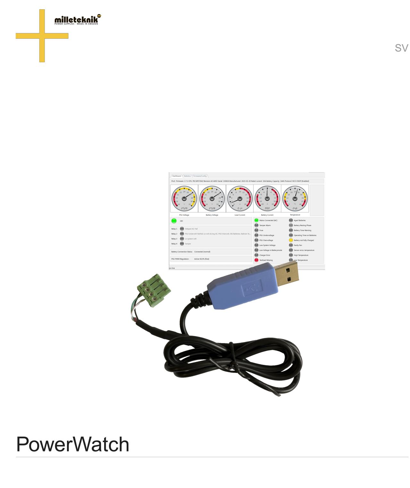
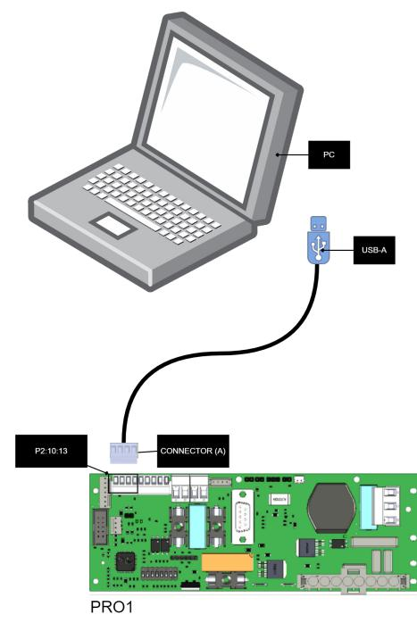
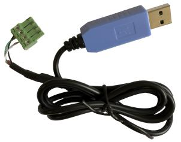
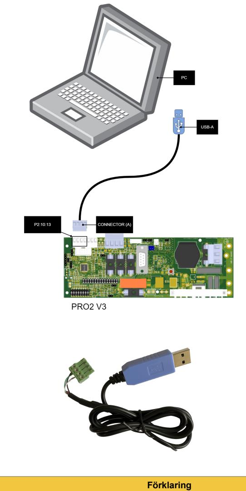
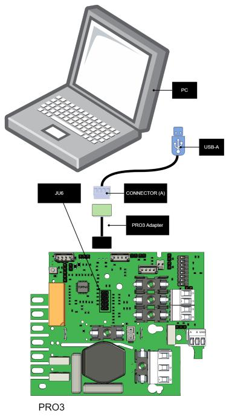
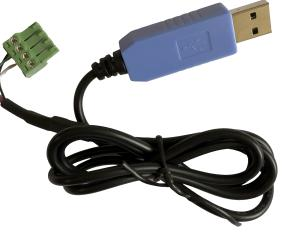
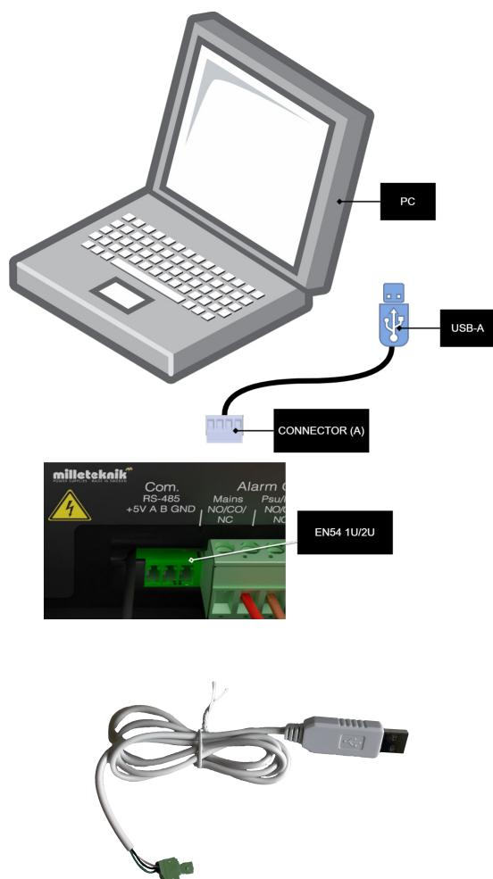

350-259 Publiceringsdatum 2023-09-21

# **Innehållsförteckning**

| 1. Om  3                                                     |  |
|--------------------------------------------------------------|--|
| 1.1. Namn, artikelnummer och e-nummer  3                     |  |
| 2. Beskrivning / PowerWatch består av  3                     |  |
| 3. Hämta mjukvara och drivrutiner  4                         |  |
| 4. Installationskrav, mjukvara  4                            |  |
| 4.1. Installera drivrutiner  4                               |  |
| 5. Anslut till PRO1-kort  5                                  |  |
| 6. Anslut till PRO2v3-kort  6                                |  |
| 7. Anslut till PRO3-kort  7                                  |  |
| 8. Anslut till EN54 1U/2U  8                                 |  |
| 8.1. Not om certifiering och uppdatering av EN54 1U/2U  9    |  |
| 9. Vad händer efter uppdatering?  9                          |  |
| 10. Firmware och konfigurationsfiler - vad är skillnaden?  9 |  |
| 11. Begränsningar  9                                         |  |
| 12. Tekniska specifikationer  10                             |  |
| 13. Adress och kontaktuppgifter  10                          |  |

### 1. OM

PowerWatch är en mjukvara från Milleteknik som gör det möjligt att uppdatera mjukvara i batteribackup, läsa status, ställa vissa parametrar och statistik. PowerWatch kan användas för att enkelt uppdatera en produkt eller för diagnostik vid dimensionering och felsökning.

Denna utgåva är under granskning och används på egen risk. Alla uppgifter kan ändras utan föregående meddelande.

#### 1.1. Namn, artikelnummer och e-nummer

| Namn            | Artikelnummer       | E-nummer  |
|-----------------|---------------------|-----------|
| PowerWatch      | A-OT0000UPG02P2V3P3 | 52 137 06 |
| PowerWatch RACK | A-OT0000UPG03P2V3P3 | 52 137 07 |

## 2. BESKRIVNING / POWERWATCH BESTÅR AV

PowerWatch består av:

- Mjukvara, PowerWatch.
- Kablar för anslutning mellan batteribackup och dator (USB-A).

#### **VIKTIGT**

Systemkrav för mjukvara är: Windows 7 eller senare. Internetuppkoppling behövs för att aktivera mjukvaran.

# 3. HÄMTA MJUKVARA OCH DRIVRUTINER

Mjukvara och drivrutiner hämtas på: https://www.milleteknik.se/powerwatch/.

## 4. INSTALLATIONSKRAV, MJUKVARA

Mjukvaran kräver ingen installation utan kan köras direkt.

Internetuppkoppling krävs för att verifiera mjukvaran.

Efter att mjukvaran är verifierad mot licensserver går det att använda mjukvaran utan internetuppkoppling i 30 dagar.

Mjukvaran hämtar rätt konfigurationsfiler på server, (kommande funktion).

#### **VIKTIGT**

Milleteknik ger endast support på PowerWatch.

#### 4.1. Installera drivrutiner

- 1. Ladda ner drivrutinen från nedladdningssidan.
- 2. Extrahera eller packa upp filen till en lämplig mapp på din dator.
- 3. Högerklicka på **silabser.inf** och välj installera.

| Namn                                                                                                                                                                                           | A                                                | Senast ändrad    | Typ                 | Storlek |  |
|------------------------------------------------------------------------------------------------------------------------------------------------------------------------------------------------|--------------------------------------------------|------------------|---------------------|---------|--|
| arm                                                                                                                                                                                            |                                                  | 2023-06-23 04:39 | Filmapp             |         |  |
| arm64                                                                                                                                                                                          |                                                  | 2023-06-23 04:39 | Filmapp             |         |  |
| x64                                                                                                                                                                                            |                                                  | 2023-06-23 04:39 | Filmapp             |         |  |
| x86                                                                                                                                                                                            |                                                  | 2023-06-23 04:39 | Filmapp             |         |  |
|                                                                                                                                                                                                | CP210x_Universal_Windows_Driver_ReleaseNotes.txt | 2023-05-24 10:05 | Textdokument        | 30 KB   |  |
| silabser.cat ============================================================================================================================================================================== |                                                  | 2023-06-15 18:44 | Säkerhetskatalog    | 14 kB   |  |
| silabrorinf                                                                                                                                                                                    |                                                  | 2023-06-15 18:36 | Installationsinfor  | 14 kB   |  |
| SLAE                                                                                                                                                                                           | Öppna                                            | 2021-04-16 09:32 | Textdokument        | 9 kB    |  |
| ം Upd                                                                                                                                                                                          | Skriv ut                                         | 2023-05-24 09:03 | Windows-komma       | 1 kB    |  |
| Upda                                                                                                                                                                                           | Installera                                       | 2023-05-24 09:03 | Registreringsposter | 3 kB    |  |
|                                                                                                                                                                                                | S Dela med Skype                                 |                  |                     |         |  |
|                                                                                                                                                                                                | Flytta till OneDrive                             |                  |                     |         |  |
| ਸ                                                                                                                                                                                              | Konvertera till Adobe PDF                        |                  |                     |         |  |
| ど                                                                                                                                                                                              | Konvertera till Adobe PDF och e-post             |                  |                     |         |  |
|                                                                                                                                                                                                |                                                  |                  |                     |         |  |
| 1                                                                                                                                                                                              | Edit with Notepad++                              |                  |                     |         |  |
| 12                                                                                                                                                                                             | View File                                        |                  |                     |         |  |
|                                                                                                                                                                                                | Sök igenom med Microsoft Defender                |                  |                     |         |  |
|                                                                                                                                                                                                | ල Dela                                           |                  |                     |         |  |
|                                                                                                                                                                                                | Öppna med                                        |                  |                     |         |  |
|                                                                                                                                                                                                | Ge åtkomst till                                  |                  |                     |         |  |
| யா                                                                                                                                                                                             | Add to archive                                   |                  |                     |         |  |
| ma                                                                                                                                                                                             | Add to "silabser.rar"                            |                  |                     |         |  |
| NUM                                                                                                                                                                                            | Compress and email                               |                  |                     |         |  |
| mum                                                                                                                                                                                            | Compress to "silabser.rar" and email             |                  |                     |         |  |
|                                                                                                                                                                                                | Återställ tidigare versioner                     |                  |                     |         |  |
|                                                                                                                                                                                                | Skicka till                                      |                  |                     |         |  |
|                                                                                                                                                                                                | Klipp ut                                         |                  |                     |         |  |
|                                                                                                                                                                                                | Kopiera                                          |                  |                     |         |  |
|                                                                                                                                                                                                |                                                  |                  |                     |         |  |
|                                                                                                                                                                                                | Clana gonusa                                     |                  |                     |         |  |

### 5. ANSLUT TILL PRO1-KORT

| Text          | Förklaring                                                                                                                                                          |
|---------------|---------------------------------------------------------------------------------------------------------------------------------------------------------------------|
| PC            | PC för anslutning av PowerWatch. Ladda ner mjukvara och starta mjukvaran innan inkoppling till batteribackup. Internetanslutning krävs för att starta mjukvaran. |
| USB-A         | USB-anslutning, skall kopplas till PC.                                                                                                                              |
| Connector (A) | Anslutningskabel, fyrpoligkontakt skall kopplas in i batteribackup.                                                                                                 |
| P2:10-13      | Anslutning till batteribackup                                                                                                                                       |

### 6. ANSLUT TILL PRO2V3-KORT

| Text | Förklaring                                                                                                                                                          |
|------|---------------------------------------------------------------------------------------------------------------------------------------------------------------------|
| PC   | PC för anslutning av PowerWatch. Ladda ner mjukvara och starta mjukvaran innan inkoppling till batteribackup. Internetanslutning krävs för att starta mjukvaran. |

| Text          | Förklaring                                                          |  |
|---------------|---------------------------------------------------------------------|--|
| USB-A         | USB-anslutning, skall kopplas till PC.                              |  |
| Connector (A) | Anslutningskabel, fyrpoligkontakt skall kopplas in i batteribackup. |  |
| P2:10-13      | Anslutning till batteribackup                                       |  |

#### **VIKTIGT**

Har man larmkort i sin enhet kan man **inte** använda PowerWatch innan man avlägsnat detta. Detta då larmkortet använder samma kommunikationsbuss på processorn.

# 7. ANSLUT TILL PRO3-KORT

| Text          | Förklaring                                                                                                                                                          |
|---------------|---------------------------------------------------------------------------------------------------------------------------------------------------------------------|
| PC            | PC för anslutning av PowerWatch. Ladda ner mjukvara och starta mjukvaran innan inkoppling till batteribackup. Internetanslutning krävs för att starta mjukvaran. |
| USB-A         | USB-anslutning, skall kopplas till PC.                                                                                                                              |
| Connector (A) | Anslutningskabel, fyrpoligkontakt skall kopplas in i batteribackup.                                                                                                 |
| PRO3 Adapter  | Adapterkabel för anslutning till JU6. Grön kabel skall sitta neråt i bild, mot säkringen, F4.                                                                       |

| Text | Förklaring                    |
|------|-------------------------------|
| JU6  | Anslutning till batteribackup |

### 8. ANSLUT TILL EN54 1U/2U

#### **VIKTIGT**

För EN54 1U/2U skall PowerWatch RACK användas.

| Text          | Förklaring                                                                                                                                                          |
|---------------|---------------------------------------------------------------------------------------------------------------------------------------------------------------------|
| PC            | PC för anslutning av PowerWatch. Ladda ner mjukvara och starta mjukvaran innan inkoppling till batteribackup. Internetanslutning krävs för att starta mjukvaran. |
| USB-A         | USB-anslutning, skall kopplas till PC.                                                                                                                              |
| Connector (A) | Anslutningskabel, fyrpoligkontakt skall kopplas in i batteribackup.                                                                                                 |
| EN54 1U/2U    | Anslutning till Batteribackup                                                                                                                                       |

#### 8.1. Not om certifiering och uppdatering av EN54 1U/2U

För att certifikat skall upprätthållas efter uppdatering skall ny panel/etikett sättas på enheten. För att kunna uppdatera enheten behöver den gamla panelen/etiketten tas bort och ersättas. Detta gäller enbart enheter som levererats efter 2023-07-01. Enheter tillverkade före detta datum kan ej använda PowerWatch.

### 9. VAD HÄNDER EFTER UPPDATERING?

Efter uppdatering av mjukvara via PowerWatch startas batteribackupen om automatiskt.

#### 10. FIRMWARE OCH KONFIGURATIONSFILER - VAD ÄR SKILLNADEN?

Firmware är mjukvaran som styr enhetens grundfunktioner, denna kan behöva uppdateras med buggfixar för att säkerställa drift och funktion.

*Exempel på grundfunktioner som firmware styr är kraftfördelning och styrsignaler från nätaggregat.*

Konfigurationsfilen styr hur mjukvaran kan användas. Olika kort har olika möjligheter att använda funktioner genom mjukvara och konfigurationsfilen ger instruktioner till firmware så att rätt funktioner används.

*Exempel på funktioner som konfigurationsfilen styr är kommunikationsprotokoll och intervall för interna strömgränser.*

För att enheten skall fungera så behövs bägge filerna. En bricka i ett passersystem behöver ha både en bricka (firmware) och en kod (konfigurationsfil) för att fungera.

#### **TIPS**

Firmware kan användas till alla enheter i produktserien.

Konfigurationsfil kan bara användas till produkter med samma spänning och ampere.

### 11. BEGRÄNSNINGAR

Firmware: Uppdatering kan endast göras till samma kommunikationsprotokoll. Det går alltså inte att uppdatera till ett annat kommunikationsprotokoll.

Konfiguration: Det går bara att uppdatera till samma enhetstyp, ström, spänning. Det går att ställa batterikapacietet men det är inte möjligt inte att ändra på typ av produkt utan produkten är vad märkskylten anger. Exempel: byter du batterier från 14 Ah batterier till 20 Ah batterier i en NOVA 24V

15A FLX M så ställer du ny batterikapaciet. Det går aldrig att ändra spänning, amperetal på last eller kommunikationsprotokoll.

#### 12. TEKNISKA SPECIFIKATIONER

#### Tabell 1.

| Info                | Kommentar                                                                 |
|---------------------|---------------------------------------------------------------------------|
| PowerWatch          | Mjukvaraa., kräver PC och Windows 7 eller senare och internetuppkoppling. |
| USB - batteribackup | Kabel för inkoppling i Batteribackup och dator. USB-A.                    |

a.Milleteknik kan inte ge support på problem som kan uppstå i dator om PowerWatch ej fungerar. Mjukvaran används på egen risk och omfattas inte av garanti. Milleteknik garanterar inte att mjukvaran fungerar som avsett. Milleteknik ersätter inga kostnader som kan uppstå i samband med användandet av mjukvaran.

#### 13. ADRESS OCH KONTAKTUPPGIFTER

- Milleteknik AB Ögärdesvägen 8 B 433 30 Partille Sverige 031-340 02 30 info@milleteknik.se www.milleteknik.se
Den här sidan är avsiktligt lämnad tom.

Den här sidan är avsiktligt lämnad tom.