# Folded Size : 57 x125 mm

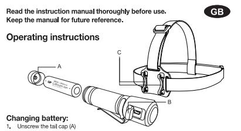

- Remove discharged battery
Insert fully charged battery taking
 and replace tail cap (A) securely
- Charging battery:
- computer, Dower Dank Charger, OOD wall SOCKer on OOD car Chargers
 Green LED: Charging completed
- 
- 
- Operation:
 • Full press switch •> High •> Medium •> Low •> Off (Oycle repeats)
 • Double press switch whether ON or OFF for strobe
•
- I will high is on tongor that o booknos, model to probod again who
 headlamp will turn off
 Accessing Turbo output at anytime. Press switch and hold for 1 second. Press again Program inil 30 %"
 Rentoving headlamp from holder
 The headlamp can buickly and easily remved from the holder by unclipping the 
 The headlamp can the vili The headlamp can
- Safety Instructions and Warnings
Use the device in a temperature range between 0 and 40°C and avoid exposure to direct
- heat and constant sunlight.
This appliance is not intended for use by young children or infirm persons unless they This appliance is not interiod for use by young childler of minim persons unless they
the appliance safety supervised by a responsible person to ensure that they consure that
- 

# ▲ Batteries

- 254 Dat Learler with integrated overcial of Percharge and over decharge for and one of the former of the former of
 the applical in the may could collection and comments.
- 

- Bispos of data baktho prompling tall cap (A) and instill new
 Replacing Dattlery (
- 
- Do not dispose of election appliement for information the separation for floor for for for for for for for for for for for for for for for for for arealing is and and and the

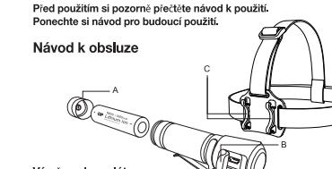

Odsroubujte Koncovou krytku (A)
Vyjměte vybitý akumulátor
Vložte plně nabitý akumulátor Dbejte při tom na správné značky polarity +/– a vratte
konovou krytku (A) bezpečně na

- abíjení akumulátoru: abljenii alkuli nuratoru.
 Stáhněte pryžový knýt mikro USB (B) a zapojte konektor míkro USB do nabíjec
 portu čelovky. Zapojte USB konektor do zdroje napájení, jako je např. ontrolka | F
- zivání něntrolika a bo Červená kontrolka LED: Probíhá nabijení
 Po úplném nabití odpojte USB kabel a opatrně vratte na místo kryt mikro USB (B)
- 
- Údolé stlačení spínače -> střední -> nízké -> vypnuto (cyklus se opakuje)
 Dokrát stlače spínač v režimu VYP nebo ZAP pro aktivací bilebníka se opakuje.
 Pokud spinač znovu

## nutí čelovky z držáku

- Čelovku je možné snadno a rychle sejmout z držáku odepnutím čelenky z upínacích boo
(C). Čelovku lze takto používat jako ruční svítilnu. Díky sponě ji lze nosit také v kapse
- ečnosttní pokyny a výsttrahy
 používejte při teplotách od 0 do 40 °C a vyhněte se vystavení přímým zdrojům
rvalému slunečnímu záření
- zařízení používejte při teplotách od 0 c a vyhněte se vystavení přimým zdrojí
odo zařizeňu vý rodužívat městí.
Kos zařízeňu vy roužívat městění, aby se zajistovil zarizou v

# /! Baterie

- v S DětCTTC
oužijte 1 x GP Libení s integrovaným modulem ochrany proti přepětí a
řepětí Pokud nepozné baterií s integrovaným nodukační zařizení. Půčesní, nůže
vatované buil
- zkratované buriky, mohou se vyskytnout nzika
 Nebo zpecí požátu a popálenii. Nenbílijejte, nerozebírejte, neohrivejte nad 40 ° O nebo
 nespalujte. Uchovávejte baterli mimo

### Výměna baterií

178

- Před výměnou baterií nejprve svitilnu vypněte a pak teprve sejměte koncovou kryku (A)
 vložite nově baterie do příslu batení. Po správním vložení batení podení je odení pod
Elektrická zařizení nelhošerý komunální odpad, poclílio systémy třídelho sbětny třídelho sbětny třídelno sbědní skládu složiná 
 spávy Pokud jsou ekkrospitětič

Betriebsanweisunger

(cz

- Instill Entlemen Sie den leeren Akku
Setzen Sie ein vollständig geladener Akku ein, achten Sie beim Einsetzen a
Ausrichtung der Polarität (+/-) und drücken Sie die Abdeckung (A) fest
- 

Lesen Sie die Bedienungsanleitung vor Gebrauch gründlich

- tku laden.
 Ziehen Sie die Gummi-Micro-USB-Abdeckung (B) ab und stecken Sie das Micro in den Laderanschluss der Stimlampe. Schließen Sie das USB-Kabel an eine Stro
 LED-Ba
- O-Batteriestatusanzeige:
 Ine LED: Aufgeladen Rote LED: Wird geladen
 Hemen Sie das USB-Kabel vorsichtig nach dem vollständigen Aufladen und bringen
 minn-Abdeckung (B)
- Volstandig eingedrickler Knopf -> niedig -> aus lich wiedenbender Zykus)
 Dopen trade -> niel -> niedig -> aus lisch wieder Ampe Fflash -> 
 Bronnt das Lich lilinger als S S
- 

- nlampe aus der Halterung entnehmen
inlampe kann schnell und einfach durch das Aummisands von den
bunkten (C) aus der Halterung entnommer werden Distrilampe kann nura Tasche b
- eherlestishinweise und Warnungen
 was was illeng manufactures were man work in the work
 we was in the the was driver one of more of more the mark cher and the e
res also wo

Les bruksan Bruksinstrukser

ade batteri:

Grønn LED: Ferdigladet
Trekk ut USB-kabelen når
forsiktig på plass igjen,

Ta ut hodelampen fra holderen

/! Batterier

- Www.netball.com 1880-84ku milinary.com Denesungs.com 
 Convention March Press Marine Marian Parties Proses Proses Proses Posterian
 Personalizano popular Payman, wen backla nstallert werden.
 Brand und Verbrennungsgefahr. Nicht aufladen, zenegen, über 40 ° C erhitzen oder verbrennen
 Bewahren Sie den Akku für Kinder umgehend,
- 

nvisningen nøye før bruk. Ta vare på 
ningen til framtidige referanser

gde bratteri.
 Boleporten på hodelampen, Sett USB-kontakten i en stranniller som er oper plaggen
 Boleporten på hodelampen Sett USB-kontakter.
 Den interkerigien

Tirykk to ganger på bryteren, PÅ eller AV, for strobelys.
Hvis lyset er på i mer enn fem sekunder, slås av hodelampen når bryteren

igjen.
 Du kan når som helst få tilgang til Turbo-effekten. Trykk på bryteren og hold inn i et
sekund. Lampen slukkes hvis du trykker igjen

delampen kan raskt og enkelt tas ut av holderen ved å fjerne gummibåndet fra klipse

Sikkerhetsinsstrukser og advarsle
Bruk enheten i temperaturer mellom 0 og 40°C, og unngå å bli utsatt for direkte varme o

en stant sollys.
 Denne enheten er ikke ment for små bander er og bruker, med mindre en
 Denne enheten er ikke ment for å sikre er ygg bruk av enheten. Små barn bør pass
 å

2011 1 220 Lend model in program over billeria og Li-in
 President in delpostors control of Section of Sacronical de Carlos
 President il approsporer child ministration coll

Erstatuningsbatteri
Vår du lader batterinne, skru forster før du tar av bakdekselet (A) og sett
nin nye batterieri riktig batteriholder. Skrupet når batteriene er satt inn hi

frykk hele bryteren > Høy -> Medium -> Lav -> Av (gjenta)

Bytte baatteri:
1. Sikru av bakdekselet (A)
2. Ta ut det utladde batteriet.
3. Ta ut det utladde batteriet.
 3. Sett inn fulladet batteri og vær nøye med å sette

mann

NO

Instrukcia obsług

vmiana akumulatora:

Odkręć zakrętkę (A)
 Wyjąć rozładowany akumulator
 Włożyć naladowany akumulator
 dobrze dokręcić zakrętkę (A)

adowanie akumulatora:

- Batteriewechtsel
Belm Batterialsmit die Taschenbergen Manaralier, Verschlusskappe (A) enterni
fest, und new antsprechenden Batterierialter, Versellussiases (Arlander) und Lyu
# Læs instruktionerne grundigt før brug.
Gem dem til senere brug Anvendelse

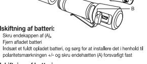

- 
- Udskifttning af batteri:
1. Træk Micro USB-stikket med en strømkilde såsom er levelsket
- LED-indikatorlys
Grøn LED: Opladning færdig Rød LED: Opladning i gang
Frakobl USB-kablet, når fuld opladning er gennemført og sæt og
USB-gummicoveret på plads

- Anvendelse:
•
Tiyk igen for at slakke lyset
 Så dan trages lygten ud af holderen
 Lygten in hurtigt og nemt tages ud af holderen ved at løsne gummibåndet fra
 ellesespidserne (C). Lygten

(DK)

Instrucciones de uso

Desenrosque la tap

A Pilas

Manual de utilizare

cuirea bateriei reîncări
Deșurubați capacul (A)
Scoateți bateria descărcată

cărcarea bateriei:

Itilizare·

/! Acumulato

বি

Sikkerhedsinstruktioner og advarsler
 Produktioner i lemperaturer fra di 400 og undaja at udesette den or direkte vame og
 Provinsi like anveres anavally personer moter opsy

ூ Batterier 23 | 日QLLCDTOCT
Rough King 1000 | March Pules March Kaso Datterial China Services Corporation
 Sanar Bullan Marchite Childer Land Collection Moster Chambler
 Praster Pricle o

Udskiftning af batteri
 Vød oplødning af batterierne skal lormelygten forst slukkes skal
 fjernes, og nye batterier placersi isatteriholderen. Skru enderling kommerikalering

් (

Unsill

a owame urtuninoratowa.
 Odoiągnąć gumową złącza Micro USB (B) i włożyć wtyczkę Micro USB do złącza
 ladowania latarki uzokowej. Podłowie przewodu USB do złodka zastania.

słamochodowa ze zączem DSB.
 Zlakowania zakończone Ozenwona dioda LED: ładowanie twa
 Polona diodioczowe dłumulatora odłączyć przewód USB i ostroznie założyć gumow
 osonę

Użykowania:

Wyjmowanie latarki czołowej z uchwytu
Latarkę czołową można szybko i łatwo wyjąć z uchwytu wyp

-atarkę czołową można szybko i łatwo wyjąć z uchwytu wypinając gumci
ounktów mocowania (C). Po wyjęciu latarki czołowej z uchwytu można i
atarki ręcznej. Zaczep pozwala równ

Instrukcje i ostrzeżenia dotyczące bezpieczeństwa Unikajnacza Unikajnacza Unikajnaczania 
Uradzenia nie przeznaczone do użytku mesto na organizacji.
 Szemnie przypowion

்டு Akumulatory
மாவிர்க்கின்று பண்டலை மாவட்டத்தியில் வாய்க்கப்பட்ட வருகிறார்.
கண்டிகளில் பரைக்குறை மாதியவும் பால்க்கவும் கல்வை கண்டிகள்
கண்டிகளில் பற்றின்றும் மக்களவும் பதவ்

Wymiana akumulatora
 Przed rozpoczęsiem wymatora wykoz latakę, następnie odkręć ząkrętkę (A) i
 zainstalu ny pokumii bięgumuitu akumującom (polinki walinku walingu minimali

okładnie (PL

Folded Size : 57 x125 mm

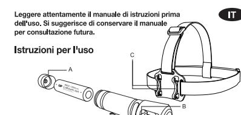

- unsin Sostituire la batteria:
 Svitare il tappo di coda (A)
 Rimuovere la batteria usa (A)
 Rimuovere la batteria usamente carica, facendo attenzione a a
- Carioare la batteria:
- 
- 
- Operazioni:
 • Pressine doppisante -> Alto -> Medio -> Basso -> Off (i ciclo si ipete)
 Pressione doppia del pulsante in modalità ON o OFF per luce stroboscopica
pi
- Se la roce e accesa per pia ul 3 secondi, quanoo si preme nuovaniente il pulsante ia
pila frontale si spegne
 Accesso al Turbo in qualsiasi momento Premere il pulsante e te

# Bimuovere la pila frontale dal supporto

- La pila frontale può essere rimossa facilmente e rapidamente dal suo supporto sganciano
la fascia elastica dai punti di fissaggio (C). Ora la pila frontale può essere usata c
Precauzioni e istruzioni di sicurezza
 Precadio divelliva di aliminosuma compreso tra o 4 0 € o e oritare
 Parzare di arcaino di ambosti anno aso al bambini proodie di
 Sorv

# A Batterie

le name : CR35_JB_V1_04
e location :

sasurement .
Nour : refer to the marking in the artwor

- Uilizzae i batteria Con som somaria e circuito e circuito di protezione da
 considere archivo por cana alla coronia di protezione da
 constituto poro internalis consideracio
Sostituzione della batteria
Per sostituire la batteria spegnere il tappo di coda (A) e installare
nuove batteria spegnere il flanteito, Avvitare il tappo di coda dopo aver di

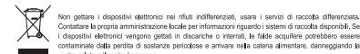

- Lees de instructiehandleiding grondig alvore
gebruiken. Houd de handleiding bij om deze
opnieuw te kunnen raadplegen.
Gebruikssaanwijzing
# Unsin

oestel te ( NL

Batterij vervangen:

# Draai de dop achteriaan (A) los
Verwijder de lege batterij
Steek de volledig opgeladen batterij in de lamp, waarij u de polarite
volgt bij het installeren, en plaats het deks

- erij opladen: atterij Oppladen:
 Trek het nubberen Micro USB-klepje (B) terug en sluit de Micro USB-connector
 de oplaadpoort van de hoofdlamp. Sluit de USB-connector aan op een stroom
- 
- EEED is oli-alimanpie:
 Groeinelicen voltooid Rode LED: bezig met opladen
- Bediening:
•
- 
- 

- 
- 

# 

## /! Batteriien

মু

Gebruik 1 x GP Li-jon 18650-batterij met gelinesreerde oversaad en over-ontlading
Protection Circuit Montel (PCM). Het niet gebruiken van speciale GP Li-le-serien in Arabian installeerd geliestaleerd.
Risioo op brand en brandvonden, Niet opladen, demonten, vervarmen boven 40 ° C of
 verbranden. Houd de batterij buiten het berelik van kinderen en in de origin

Batterij vervangen
Manterij Vervangt, schakel dan eerst de zaklamp uit alvorens de dop
anteran (A) te vervangt, schakel berjen in de pasonale bannon one one proponent ander v

Wen geen elektrische ocel op met riel gesoneerd getruit of ostaande
 inzamaliachi Nem contact on conseille cromain andre internation 

de passende battenjhouder
rect geplaatst zijn volgens de
+) en (-). Zorg ervoor dat de

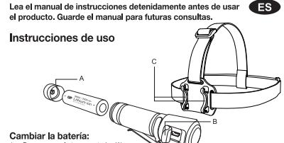

rte la batería cargada, asegurándose de que esté correctamente colocada segú
narcas de polaridad +/-, y vuelva a colocar la tapa (A) con cuidado de que qued

Cargar la batería:
1

uz LED indicadora:
ED verde: Carga completada LED rojo: Carga en curso
Desconecte el cable USB cuando haya finalizado la carga y vuelva a colocar con
uidado la cubierta

an Foreco.
 Presione a fondo el interuptor -> Alto -> Medio -> Apagado (Se repite el ciolo)
 Presione dos veces el interruptor para encender o apagar la luz estroboscopica
 Presione dos veces el interuptor para enconder o apagar la luz estroboscópi
Si la luz está encendida durante más de presiones presional
nuevamente el interruptor, la linguis

Sustitución de la pila
Cuando se sustinan pilas, apague la linterna al tapa posterio
Che internas mara mara en a compremento prespondientes.
En e inque lastridad ia pillas se

No desected be discoglies selectivity as com resibus municipales sin dasficar unice para el ourealize con a propriese con actives para establis a particos a para electros o

Retirar la linterna frontal del soporte
 La linterna frontal puede retirarse rápida y fácilmente del soporto
 goma de los puntos de sujeción (C). La tema frontal se pued
 ma

lnstrucciones de seguridad y advertencias
Ulilios el disportivo en un mango versioner ente o y ovita la exposibio al
No permita que ullivon este operator en espansa para ante

zaza 7 a Quernodu (PCM). a taxat arat arat arat arat marka a parktoa.
Kayttolatteeseen se integratioa, karat musika na marka Kararatoa.
Kayttolatteeseen se ingertumat kala ma 2 - 1 TLL in 1860 bateria on moduları na marina de protocolor (PCM) internado
 para in calita description and million and million and more de manimalia.
 Presonalina promise mattomissa ja alkuperäisessä
äytetyt paristot välittömästi

A Akut

Kävttöohieet

n lataus:

Akun vaihtaminen
Valhtaessasi akkua katkaise ensin vira taskottuun pidikkessen. Kun irrotat siiita takak
(A) ja asetat uuden yhteensopivan akun sille turkamikaan kukania
tak

Micro USB (B)-suojus takaisin ja liitä Micro USB - liitin otsalampu
itä USB-liitin virtalähteeseen, kuten tietokoneeseen, ulkoiseen
USB-laturiin tai USB-autolaturiin

virtalähteeseen, USB-laturiin tai USB-autolaturiin
 LED-merkkivalo:
 Viirreä LED: lataus valmis Punainen LED: lataus käynnissä

Paina kytkin kokonaan -> High (Kirkas) -> Medium (Keski)-> Low (Himmeä)
(Pois) (Syklien toistot)
Paina kytkintä kaksi kertaa ON tai OFF strobovalolle
Jos valo palaa pidempään

otsalamppu sammuu
Turbo-tehon käyttö milloin tahansa. Paina kytkintä ja pidä sitä painettuna sekunnin
ajan. Paina uudelleen ja valo sammuu

Otsalampun poistaminen pidikkeestään
Otsalampu voidaan poistaa pidlikkeestään nopeasti ja helposti avaamalla kuminauha
klipsipisteistä (C). Otsalampua voidaan käyttää myös t

Turvallisuusobhjeet ja varoitukset
Kürkülatla 00 ja valisessa limpidiassa. Väli laitteen alistumista suoralle
Kumundate eso li köytävä pienille selevalt helekollerin in leikt

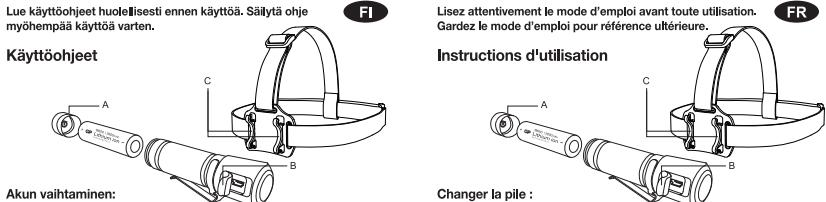

Devisser i embout (A)
 Enlevez la pile forsqu'elle est
 Insérez une pile chargée en 1
 (A) correctement en pile chargée en 1
 (A) correctement en place

- Charger La pillions USB (B) en secutenous et branches le connecteur le comments on onceleur and on one otour on one oto competeur and our operationers of the outservation of
- 
- foncetionnement :
 Pression complète -> High -> Medium -> Low -> Off (le cycle se répète)
 Double pression ON ou OFF pour la lumière stroboscopique 
 Si la lumière est allumé
- Double pression ON ou OFF pour la lumière strobosopique
Si la lumière est alumée pendant plus de 5 secondes lorsque l'interupteur est
enforcé à nouveau, la lampe from ent. Ap
- 

Enlever la lampe frontale de son support
 La lampe frontale peut être enlevée aisément de son support en de 
 le bandeau en caoutchouc des points de contact (C) La lampe fro

lmstructions de sécurité et avertissements
ocostions innovillage dia limpions antrolos antro o e 40%, éviter tour ou a
conosticos introl de consultato este premier de parte e

# ‍ / Piles

Ulisiez 1 x Odeio GP Li-ion 18650 avec module de circuit de protection (PCM) integr
 onite la surharge et la sur-décharge. Le fait de ne pas utiliser de protector on order d

productions on mailles bless and server describer more and moder and moders
 model de comments a mores mores more and more and more and more and more of manager de comments a

Használat előtt figyelmesen olvassa el a haszná

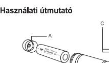

- Csavárja ki a zárókupakot (A)
Távolítsa el a lemerült akkumillátort
Helyezzen be egy teljesen feltúláltort
gondosan helyezzen belyezze zárókupo
- kumulátor töltése: akkumulátor töltése:
Húzza hálra a miro-USB gumi boritását (B), és csatlakozlassa a USB-csatlakozót
mikro-USB-cadlakozót a fejlámpa töltőportjába. Osatlakoztássa az USB-csalt
- vagy autós USB-adapterhez),
 LED-jelzőfőltőkés belejeződőtt Piros LED: Töltés folyamatban
 Zöd LED-költés után válassza le az USE-kábelt, és óvatosan helyezze vissza a 
 m
- 
- Nyomja le teljesen a kapcsolót -> Magas -> Kōzepes -> Alacsony -> Ki (A ciklu
 ismétlődik)
- oz nyomja meg kétszer a kapcsolód ON vagy OFF állásban 
másodpercnél tovább van bekapcsolva, és ismét megnyomja
- Strobószkophióz nyomja meg kelszére a kapcsolva, és ismét megynyara az 
Hapcsolót, a fejlálómpa lekapcsolva, és ismét megnyonja a a
kapcsolót, a lekapcsol
Nyomja meg újra, a
- 
- 

észőrésen is hordható
 Kázöntsén zsem is hortható
 Zázönsén zsem is hortható
 Lizonnsén zsem is hortható
 Lizonnsén zsorbató nő nözött is frigyel mezznaki a visa a között má allalluo haplelívű
A készüléket kisgyermekek és felügyeletre szoruló személyek csak egy felelős személy
felügyelete mellett használhatják, aki biztonságos használatát. Ne
en

## /\ Akkumulátorok

l i GP Li-ion 18650 akkumulátort beépített túlterhelési vé
lullal (PCM). Ha nem használják a speciális GP Li-ion 18650 akkurulási vé
áshoz, akkor a zseblámna és / vagy az akk árasználjór 1 X GP Lisőt 16630 akkumulatort beepitelt tülternélesi és tülter
áramkörmodullal (PCM). Ha nem használják a speciális GP bizonnálók között.
Sérült vagy rövidzára

ക്കാക്കുമായി വരെ ലിക്കാലം പ്രകാലം. അവലംബം പ്രത്യേക്കും വാക്കുകയും പ്രവേശം
 വിരോഹിക്കുന്ന പ്രോവസ് വേണ്ടിക്കുന്നത്. അവലംബം പ്രാമക്കുകയും
 കാലക്ഷി വാഹ്യമായി വേദ്യാസിക്കുന്നതിന്

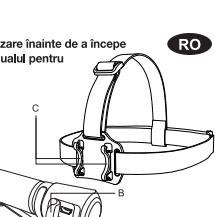

e capacul (A

rincərrəa balında Micro USB (Balının Micro USB (Balan USB)
 Mürəliyanın Micro USB (Balından çığında olanları ABŞ də ABŞ də USB sa
 Mürafiə çalışmış çatırılmışdır. Əhalində ç

Utilizarea butonului până la capăt -> Mod ridicat -> Mod mediu -> Mod redus -> Oprire

Apăsarea de două ori a lanterna este pornită sau oprită activează modul
 Strobuscopine este aprină imp de mai mult de 5 secunde, apăsarea din nou a bruiui a în pri a barundă

coaterea lanternei frontale din suport unea frontală poate fi scoasă rapid și ușor din suport, prin desprinderea curelei de
uciuc din punctele de fixare (C), După scoaterea lanternei frontale din suport, aceasta

lnstrucțiuni și avertismente privind masurile de siguranță
Dispozitivul este destinat utilizării la temperaturi o și 40°C. Evitați exparatului constanți

bispozitivul nu este destinat uliizarii de către copiii mici sau persoanele cu mobilitate reduă.
u u exceptia cazului in care acestea sunt supraveate corespurativului.
Popii

Ulikari v Sali Hon 1880 asumulator da protection i disabeliri i
dasaran bora prodo desimisera de protection i lilisat of ministrativ
de androals ocalindade o collul organizat

În locuirea a acumulatorului
nainte de â în cumulatori, serit lên merîkator de în stalatî
nainte de ânboui acumulator După instalarea comuneral în comformitat
e a înstalerea

Echipamoniale elective nuncale impreuna a citectiva a dependine municipale nesomale, co
eliminde in cadul de colociale selectiva a dependint municipale manalalador el co
o gu

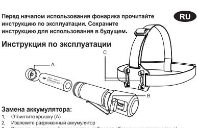

ите разряженный аккумулять

рядка аккумуулятора:
 Снямите крышку разъема Micro USB (B) и вставьте штекер Micro USB в раз
 дитазарджи нагобного фонаря, Подклочите конец USB-катрова и USB-8
 Адаптером USB

ветодиодные индикаторы:
 аленый светодиод: зарядка завершена Красный светодиод: выполняя
 огда аккумулятор полностью зарядится, отгоедините кабель USB
 становите на место р

ие:
Висин До упора -> Высоний режим -> Средний режим -> Низной режим
кажетие на красний режим актиснен или выключен активромар
пажатие на акиат коярна фонарь важатие культавы

# урбо-режим можно запустить в любой момент, на
овторное нажатие кнопки выключает фонарик

 Д. Д. АККУМУЛАТООРЫ.
 Мользуйск (РСМ), Невничения модулем авчиты от
 прикарский батарии (РСМ), Невни пристранства может присанские прикариски.
 Современно предриа и портаро и установнена поврежденные или закороченные злемента.
скложара и ожогов. Не перезарямия в не разбирайте, не нагревайте
е сжигайте. Храните аккулмуляр в недоступите, не детен

Замена аккумулятора
Перед заменой акумулятора выслочите фонцијате крышку (А
метановите новый ягора ратовк для аккумулятора. Постради
акстанови завинтите крысуству становкиров

র্ম стания О

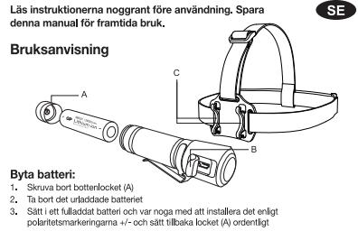

- polaritetsmarkeringarna +/- och sätt tillbaka lock
Så laddar clu Ibatterriet.
Dra tillbaka milko USB-kot (B) och anslat med mångar strö
in i USB vägsportassadapter eller USB t mikro USB-kontakten till pannlampans
 strömkälla, såsom dator, power bank,
- 
- 035 vaggdnadsarer eller DSB bliadoare
 GED-indikstor:
- 
- 
- 
- ossaa pannlarnpan från hållaren
 lannampan kan snabbt och enkelt tas loss från hållaren genom att lossa gummbanden
 ån fästena (C). Pannlampan kan nu användas som en handhå
- stet kan du även bära den i fickar

Säkerhetsföreskrifter och varningar
Använd enheten i temperaturer mellan 0 och 40°C och undvik exponering för direkt

Använd enheten i temperaturer mellan 0 och 40°C och undvik exponering för direkt
värme minte ante ander ander ander må barn eller pronering för direkt
en heler anvärde på ett

## A Batterie

ﺍﻟﺴﻘﻂ 1 ﺩﻳﻦ 2 | ﺁﺧﺮ 10 | ﺁﺧﺮ 10 ﻣﺎﻳﻮ 10 ﻣﺎﻳﻮ 1 ﻣﺎﻳﻮ ﺍﻟﻌﻴﺎﻣﻴﺎﺕ ﺍﻟﻤﺘﺤﺪﺓ ﺍﻟﻤﺘﺤﺪﺓ ﺍﻟﻤﺘﺤﺪﺓ ﺍﻟﻤﺘﺤﺪﺓ ﺍﻟﻤﺘﺤﺪﺓ ﺍﻟﻤﺘﺤﺪﺓ ﺍﻟﻤﺘﺤﺪﺓ ﺍﻟﻤﺘﺤﺪﺓ ﺍﻟﻤﺘﺤﺪﺓ ﺍﻟﻤﺘﺤﺪﺓ
ﺍﻟﻤﺘﺎﺳﻌﺔ ﺍﻟﻤﺘﺮﺍﺿﺎﺕ ﺍﻟﻤﺮﺍﺿﺎﺕ ﺍﻟﻤ

# Byta batterier
 När du byter batterier stång först av ficklampan innan bivit komersket (A) och
 installera mya batteribalterihållere, När batterierna har blivit korrekt
 nog

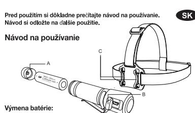

CH35 Flashlight

Instruction Manual

Vyberte vybitu bateriu, pričom dbajte na to, aby ste ju nainštalovali podľa
 označenia polarity +/- a bezpečne nasadte koncovú krytku (A)

Demontáž svetlometu z držiaka

- labíjanie batérie: Potiahnite dozadu gumový kryt Micro USB (B) a konovku mikro USB pripojte d
nabijacieho vstupu USB čelovky. Pripojte koncovku USB do zdroja napájalia.
počítač, nabíjačka Powe
- 

/!\ Batérie

ýmena batérie

- 2 LED indikátor svieti:
- Prevádzka:
 Plné stlačenie » revadzenie vypínača -> Vysoké -> Stredné -> Nízke -> Vypnite (cykus sa opakuje
 Dvojitým stlačením vypínača zapnite alebo vypnite snímaci impulz
 Ak kontrolka svieti dlhšie a

znásne
Prístup k výstupu Turbo v ľubovolnom čase. Stlačte vypínač a podržte ho 1 sekundu.
Po opätovnom stlačení kontrolka zhasne

lovka sa dá rýchlo a ľahko vybrať z držiaka uvoľnením gumového pásu z príchytie
). Čelovka je teraz možné používať ako ručné svietidlo. Spona umožňuje aj noseni
v vrecku

νο ποιακ
Ζαραφούν κρακτηρια τον αριθμό το 0 °C α αν °C a nevystavujte ho priamemu
Porademiu toplate versiale or vols do °C a nevystavujte ho priamenu
donic donic as yabansin

– Dratel i U Heropoujim nadalom od integrovanji proti protipreditu a
 Prozenti I Poli, kropo visu o većini se onariški povinska pravnika.
 Razvodal brojim a voskoji i Krist

vý v rovne botéré najov vypnite svietidlo, potom odskrutkujte uzáver (A) a do príslušní.
 Přívýmene batvící najbrv vyprite svicíhou batérií so správnou polaritou do třajděl

Elektrické zahadania nevyhadzuje do komuniste loh oberna triodonéh