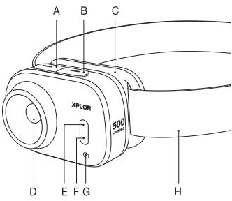
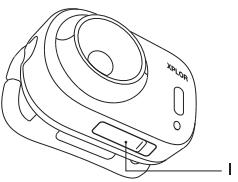
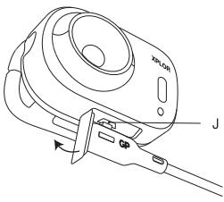
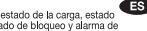
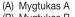
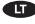
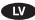
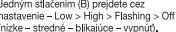

# XPLOR PHR17 Headlamp Instruction Manual

| Getting to know your head amp (A) Button A (B)  Button B (C) Bracket (D) Main light Night vison - Red LED White Flood Light                                                                                                                                                                                             | GB (G) Indicator light - Charge status, battery status, lock-out status & overheat warning (H) Washable & reflective head strap ( ) Water protection cap J ) USB-C charging port                                                              |  |  |  |  |
|-------------------------------------------------------------------------------------------------------------------------------------------------------------------------------------------------------------------------------------------------------------------------------------------------------------------------------------------|-----------------------------------------------------------------------------------------------------------------------------------------------------------------------------------------------------------------------------------------------------------------|--|--|--|--|
| Operating instruction                                                                                                                                                                                                                                                                                                                     |                                                                                                                                                                                                                                                                 |  |  |  |  |
| Main light                                                                                                                                                                                                                                                                                                                                | Night Vison - Red LED                                                                                                                                                                                                                                           |  |  |  |  |
| · Press (A) to turn on. Double press to turn off. Single press (A) to cvcle through settings - Low > Med > High > Off. Double press (A) at any time to turn off any light output                                                                                                                                           | · Press (B) to turn on night vision. · Single press (B) to cycle through settings - Low > High > Flashing > Off · Double press (A) to turn off night vsion                                                                                             |  |  |  |  |
| White Flood light                                                                                                                                                                                                                                                                                                                         | Turbo                                                                                                                                                                                                                                                           |  |  |  |  |
| · Press and hold (B) for 1 sec , to turn on white flood liaht. Single press (B) again to cycle through settings - Red low > Red high > Red flash > Off                                                                                                                                                                        | · Press and hold (A) for 1 sec to activate turbo mode. Available from any light setting. Turbo will drop to high setting after one minute to protect from high temperatures. Can be re-activated when needed. Double press (A) to turn off Turbo |  |  |  |  |
| SOS & Beacon                                                                                                                                                                                                                                                                                                                              | Lock-out                                                                                                                                                                                                                                                        |  |  |  |  |
| To activate SOS, press and hold (A) or (B) for 4 secs. Activation can be from off or when already on. To activate Beacon, press and hold (A) and then press (B), or press and hold (B) and then press (A). Press (A) and output returns to low Press (B) and Red LED On Double press (A) to turn off all settings | · Lock · Press and hold (A) and (B) for 1 to activate Lock out - indicator light will flash red twice · Unlock · Press and hold (A) and (B) for 1 to activate Unlock mode - battery indicator light will flash green twice.                      |  |  |  |  |
|                                                                                                                                                                                                                                                                                                                                           |                                                                                                                                                                                                                                                                 |  |  |  |  |

# Charging the headlamp

- · Remove water protection cap (1) and insert the USB-A plug into a power supply,
 such as a power bank, computer or wall socket and the USB-C plug into the headlamp
- · Indicator light (G) will indicate the charge status of the headlamp
- · Red LED indicates charging protection.
- · When running, the headlamp can remain plugged into a power bank for extended.
runtime, Only the high mode will be available for main light out. The red LED rand only the high mga mill be available for main ight output The flood LED
features (Constant on - low to high and flashing) as well as white flood light, SOS
and Beacon are
- For best battery performance, please recharge the headlamp every 3 . 4 months. This is a non-replaceable battery and will provide excellent service if well maintained.

# Battery indicator

- . When headlamp is off, double press (B) to check battery level
- Over 70%
35% to 70% Solid green
- Solid red
- Red flashes 5 times Below 35% Healthes 3 thees 3 times - Below 35%
Low battery warning light - When battery is below 35%, the light in use will flash
twice every 5 minutes .
- 

# Specifications

| ANS FL1 Standard  | Main light |      |       |       | Flood light | Red LED |      |
|-------------------|------------|------|-------|-------|-------------|---------|------|
|                   | LOW        | Med  | High  | Turbo | -           | LOW     | High |
| Output Lumen      | 5 m        | 60 m | 200 m | 500 m | 50 m        | 5 m     | 10 m |
| Runtime           | 100h       | 9h   | 4h    | 3h    | 6h          | 13h     | 6 5h |
| Beam Distance     | 5m         | 25m  | 45m   | 85m   | 10m         | 4m      | 5m   |
| Impact Resistance | 1m         |      |       |       |             |         |      |
| Waterproof        | PX6        |      |       |       |             |         |      |

| Weight   | : 59 5 a      | Circuit : Digitally requlated                          |
|----------|---------------|--------------------------------------------------------|
| LED      | :  CREE / SMD | Dimensions : 56 x 38 x 39 mm Battery : Lithium polymer |
| Material | : PC + POM    | Battery protection: Over-charge and over-discharge     |

# Usage and Care

- · Do not dismantle headlamp, as this can cause harm to the headlamp and the berson will void the warranty.
This has a high lumenty, as be careful not to shine directly into anyone's
- . eyes as it may cause harm and injury
- This battery is sealed and cannot be replaced for your own safety .
- · Do not use cleaning agents that may damage the product. Use a soft cloth to avoid scratching
- . This headlamp uses a sealed LiPo 1600mAh battery. Always connect the USB carefully, to avoid water and other liquids getting into the port; which may cause damage to the unit and battery

# Poznejte svou čelovku

- (A) Tlačitko A
- (B) Tlačítko B
- (C) Držák
- (D) Hlavní světlo
- (E) Noční vidění červená LED
- Světlomet (bílé světlo) F

#### Návod k použití

#### Hlavní světlo

- Zapněte stisknutím (A). Dvojitým . stisknutím vypnete.
- . Jedním stisknutím (A) můžete nastavit intenzitu – nízká > střední > vysoká > vypnuto.
- . Dvojím stisknutím (A) kdykoli vypnete iakoukoli intenzitu sviceni.

#### Světlomet (bilé světlo)

- . Stiskněte a podržte (B) po dobu 1 sekundy, aby se světlomet rozsvítil.
- . Jedním stisknutím (B) můžete nastavit intenzitu - červená nízká > červená vysoká > červené blikání > vypnuto

### Režimy SOS a "maják"

- Chcete-li aktivovat režim SOS stiskněte a . podržte (A) nebo (B) po dobu 4 sekund. Aktivace je možná, i když je svítilna vypnutá nebo když je již zapnutá.
- . Chcete-li aktivovat režim "malák", stiskněte a podržte (A) a poté stiskněte (B) nebo stiskněte a podržte (B) a poté stiskněte (A)
- . Stiskněte (A) a intenzita svícení se vrátí na nízkou úroveň
- . Stiskněte (B) a rozsvítí se červená LED.
- Dvojím stisknutím (A) vypnete všechna nastaveni
- (G) Kontrolka stav nabití, stav baterie, stav uzamčení a varování před přehřátím
- (H) Omvvatelný, reflexní pásek na čelo Ochranný kryt proti vniknutí vody (1) -
- (J) Nabíjecí port USB-C

.

# Noční vidění - červená LED

- Stisknutím (R) zannete noční vidění
- Jedním stisknutím (B) můžete nastavit intenzitu nízká > vysoká > blikání > vypnuto.
- . Dvojím stisknutím (A) vypnete režim nočního viděni

#### Režim turbo

- Stisknutím a podržením (A) po dobu 1 sekundv aktivujete režim Turbo. K dispozici při jakékoliv intenzitě svícení. Režim turbo po jedné minutě klesne na vysokou intenzitu, aby se zabránilo přehřívání. V případě potřeby lze znovu aktivovat.
- . Dvojím stisknutím (A) vypnete režim turbo

#### Uzamčení

- Pro uzamčení stisknutím a podržením (A) a (B) . po dobu 1 sekundy aktivujete režim uzamčení kontrolka dvakrát blikne červeně.
- Pro odemknutí stisknutím a podržením (A) a (B) po dobu 1 sekundv aktivujete režim odemknutí kontrolka baterie dvakrát blikne zeleně.

sc In ní se st eń, p ්‍යාප් අර de k př sti to kvěli os ně če ovky.

#### Nabíjení čelovky

- ejměte ochranný kryt proti vniknutí vody (l) a zasuňte zástrčku USB-A do napáje zdroje, jako je např. power banka, počítač nebo zásuvka, a zástrčku USB-C do čelovky.
- . Kontrolka (G) značí stav nabití čelovky
- Červená LED značí nabíjení Zelená LED indikuje plné nabití
- . Po úplném nabití odpojte kabel a vložte ochrannou krytku (l), abyste zajistili ochranu proti vniknutí vody
- . Při provozu může čelovka zůstat připojená k power bance delší dobu. K dispozici bude pouze vysoká intenzita svícení. Červené LED budou také k dispozici (trvale svíticí od nejnižší po nejvyšší intenzitu a blikání), stejně jako světlomet (bílé světlo a režimy SOS a -maiak".
- . Pro optimální výkon baterie nabíjejte čelovku každé 3 až 4 měsíce. Jedná se o nevyměnitelnou baterii, která se při dobré údržbě odmění vynikající a spolehlivou službou.

#### Indikátor baterie

- Když je čelovka vypnutá, stiskněte dvakrát (B) a zkontrolujte stav baterie,
	- Svítí zeleně Více než 70 %
	- Svítí červeně 35 % až 70 %
	- Pod 35 % Červená blikne 5krát
- Výstražná kontrolka slabé baterie Je-li baterie pod 35 %, používané světlo bude blikat . dvakrát každých 5 minut

#### Technické údaie

|                       | Hlavní svět o |         |        |             | Světlomet | Cervená LED |        |
|-----------------------|---------------|---------|--------|-------------|-----------|-------------|--------|
| Standard ANSI FL1     | Nízká         | Stredni | Vysoká | Režim turbo | -         | Nizká       | Vysoká |
| Výkon v lumenech      | 5 m           | 60 m    | 200 m  | 500 m       | 50 m      | 5 m         | 10 m   |
| Doba provozu          | 100h          | 9h      | 4h     | 3h          | Sh        | 13h         | 6 5h   |
| Dosah svitu           | 5m            | 25m     | 45m    | 85m         | 10m       | 4m          | 5m     |
| Odolnost proti nárazu | 1 m           |         |        |             |           |             |        |
| Vormosmi              | PYR           |         |        |             |           |             |        |

Hmotnost : 59.5 g
Rozměry : 56 x 38 x 39 mm
LED

- 
- Materiál
- PC + POM :
- Rozvody : digitálně regulované Baterie : lithium-polymerová
- Ochrana baterie: proti nadbytečnému nabití a přílišnému vybití
- 

# Použití a údržba

- . Nerozebírejte čelovku - mohlo by dojít k poškození čelovky nebo k úrazu a způsobit ztrátu záruky
- . Čelovka má vysokou svítivost, nesvitte tedy nikomu přímo do očí - mohlo by dojít k úrazu.
- . Z důvodů vaší bezpečnosti nelze vyjmout baterii
- . Nepoužívejte čisticí prostředky, které by mohly poškodit výrobek nebo jeho části. K čištění používejte jemnou tkaninu, abyste zabránili poškrábání,
- . Tato čelovka používá nevyjímatelnou LiPo 1600mAh baterii. Vždy připojujte USB opatrně, aby se do portu nedostala voda a jiné tekutiny, které by mohly poškodit jednotku a baterii.

# Machen Sie sich mit Ihrer Stirnlampe vertraut

# (A) Knopf A

- Knopf B
- moor Halterung
- Hauptlicht
- 

- Rote LED
- Nachtsicht Rot
Weißes Flutlicht

#### Bedienungsanleitung

#### Hauptlicht

- Zum Einschalten auf (A) drücken. Zum Ausschalten doppelt drücken
- . Einmaliges Drücken auf (A), um
zwischen den Einstellungen zu wechseln
- Niedrig > Mittel > Hoch > Aus
- . Durch doppeltes Drücken von (A) können Sie das Licht jederzeit
- ausschalten.
- Weißes Flutlicht
- . Drücken und halten Sie (B) 1 Sek. lang gedrückt, um das Flutlicht einzuschalten
- Durch einmaliges Drücken auf (B) . wechseln Sie zwischen den Einstellungen - Rot niedrig > Rot hoch >
Rot blinkend > Aus

#### SOS & Beacon

- To activate SOS, press and hold (A) or (B) for 4 sec. Activation can be from off or when already on.
To activate Beacon, press and hold (a
- . and then press (B), or press and hold (B) and then press (A)
- .
- Press (A) and output returns to low
Press (B) and Red LED On
Double press (A) to turn off all settings .
- 
- (G) Kontrolleuchte Ladestand, Batteriestatus,
Spermodus & Überhitzungswarnung
- Speimmodus & Oben litzungswarnung
(H) Waschbares & reflektierendes Stirnband
	- Wass erschutzkapp USB-C Ladeanschluss

#### Nachtsicht - Rote LED

- . Zum Einschalten von Nachtsicht auf (B) drücke
- . Einmaliges Drücken auf (B), um zwischen den
Einstellungen zu wechseln - Niedrig > Hoch >
Blinken > Aus
- Durch doppeltes Drücken auf (A) schalten Sie . die Nachtsicht aus

#### Turbo

- . Drücken und halten Sie (A) 1 Sek, lang gedrückt, um den Turbomodus einzuschalten
Von jeder Lichteinstellung aus aktivierbar Der Turbo wechselt nach einer Minute wieder in eine niedrige Lichteinstellung, um
Überhitzung zu vermeiden Kann bei Bedarf erneut aktiviert werden.
	- . Durch doppeltes Drücken von (A) schalten

#### Sperren

- Snerren Drücken und halten Sie (A) und (B) . Sek, gedrückt, um die Sperre zu aktivieren - Kontrollleuchte blinkt zweimal rot.
- . Entsperren - Drücken und hatten Sie (A) und (B) 1 Sek gedrückt, um die Sperre aufzuheben - Kontrollleuchte blinkt zweimal anin

s: Die Lichteinstellung geht bei Überhitzung eine Stufe zurück, um die Stimlampe zu schültzen,

#### Aufladen der Stirnlampe

- Entfernen Sie die Wasserschutzkappe ()) und schließen Sie den USB-A-Stecker an ein Stromquelle an, wie z. B. eine Powerbank, einen Computer oder eine Steckdose und stecken Sie den USB-C Stecker in die StirnJeuchte
- . Die Kontrollleuchte (G) zeigt den Ladestand der Stirnlampe ar
- Rote LED: Wir geladen Grüne LED: Vollständig aufgeladen
- . Nach dem Aufladen entfernen Sie das Kabel und stecken die Kappe () zum Schutz von Feuchtigkeit wieder auf
- Die Stirnlampe kann im Betrieb an eine Powerbank angeschlossen bleiben, um die Laufzeit . zu verlängern. Dann ist nur die maximale Lichteinstellung als Hauptlicht verfügbar. Des Weiteren sind die roten LED-Einstellungen (durchgehend - niedrig bis hoch und blinkend) sowie weißes Flutlicht, SOS und Lichtsignal verfügbar
- . Für maximale Batterieleistung Jaden Sie die Stirnlampe bitte alle 3-4 Monate auf. Es handelf sich um eine nicht austauschbare Batterie, die beste Leistung verspricht, wenn sie richtig aepflegt wird.

#### Batterieanzi SICIE

- Drücken Sie bei ausgeschalteter Stimlampe doppelt auf (B), um den Batteriestand zu prüfen. . Durchgängig grün Uber 70 %
	- Durchgängig rot 35 % bis 70 % Unter 35 %
- Rot blinkt fünfma Warnlicht bei niedrigem Batterie stand - Sinkt der Batteriestand unter 35 %, blinkt das
- ieweils eingeschaltete Licht alle 5 Minuten zweimal

#### Technische Daten

| ASN FL1 Standard:                                                                                                                                                                                     | Haupt licht |        |       |       | Flut licht | Rote LED |      |
|-------------------------------------------------------------------------------------------------------------------------------------------------------------------------------------------------------|-------------|--------|-------|-------|------------|----------|------|
|                                                                                                                                                                                                       | Niedrig     | Mittel | Hoch  | Turbo | -          | Niedria  | Hoch |
| Lumenausstoß                                                                                                                                                                                          | 5 m         | 60 m   | 200 m | 500 m | 50 m       | 5 m      | 10 m |
| Laufzeit                                                                                                                                                                                              | 100h        | 9h     | 4h    | 3h    | 6h         | 13h      | 6 5h |
| Strahlabstand                                                                                                                                                                                         | 5m          | 25m    | 45m   | 85m   | 10m        | 4m       | 5m   |
| Stoßfestiakeit                                                                                                                                                                                        | 1m          |        |       |       |            |          |      |
| Wasserfest                                                                                                                                                                                            | IPX6        |        |       |       |            |          |      |
| : 59 5 a Schaltkreis : Digital gesteuert Gewicht Abmessungen : 56 x 38 x 39 mm Batterie : Lithium Polymer 1 . ODEC / CHIS Catanganian   Calaism   Calais Line   Hallantisa |             |        |       |       |            |          |      |

: PC + POM Material

Gebrauch und Pflege

- Nehmen Sie die Stirnlampe nicht auseinander, da Stirnlampe und Person zu Schaden kommen könnten und die Garantie erlischt
- . Die Leuchte hat einen hohenausstoß, richten Sie den Lichtstrah| also nicht direkt in die Augen anderer, weil das zu Schäden und Verletzungen führen kann
- . Die Batterie ist verschlossen und zu Ihrer eigenen Sicherheit nicht austauschbar.
- Verwenden Sie keine Reinigungsmittel, welche die Materialien beschädigen könnten . Benutzen Sie ein weiches Tuch, um Kratzer zu vermeiden.
- Diese Stirnlampe hat eine verschlossene LiPo 1600mAh-Batterie, Achten Sie beim Anschließen des USB-Ladekabels stets darauf, dass kein Wasser oder andere Flüssigkeiten in den Anschluss gelangen, da dies zu Schäden an Gerät und Batterie führen kann

# Lær din pandelygte at kende

(A) Knap A

- Knap B
- 道)Knap E
 (C) Beslage
 (O) Hotels
 (O) Hotted
 (E) Natted
- Hovedlys
- 
- Nattesyn rød LED
Hvidt projektørlys
- 
- 

# Betjeningsveiledning

#### Hovedlys

- . Tryk på (A) for at tænde. Tryk to gange for at slukke
- . Enkelt tryk (A) for at skifte mellem
- indstilling Lav > Med > Høi > fra
- . Dobbelttryk (A) når som helst for at slukke for enhver lyseffekt.

#### Hvidt projektørlys

- Tryk på (B), og hold den nede i 1 sekund
- .
- for at tænde det hvide projektørlys.
 Tryk én gang på (B) igen for at skifte 
 mellem indstillinger Rød Lav > Rød Høj
 > Rød Blinker > Fra

#### SOS og advarselslampe

- Tryk på (A) eller (B), og hold den nøde i 4
sekunder for at aktivere SOS, SOS kan aktiveres, når lampen er både tændt og slukket
- . Blinket kan aktiveres ved, at du trykker
på og holder (A) inde, hvorefter du
trykker på (B), eller trykker på (B) og hold den inde, hvorefter du trykker på (A)
- . Tryk på (A), og effekten vender tilbage til lav
- Tryk på (B) og tænd for den røde LED
Dobbelttryk på (A) for at slukke for alle indstillinger
- (G) Indikatoriampe opladningsstatus,
 overophedning
Vaskbar og hovedrem med refleks
	-
	- Vandbeskyttelseshætte
	USB-C-ladeport

e F

715

#### Natiys Rødt lys

- 
- Tryk på (B) for at aktivere nattesyn
Enkelt tryk (B) for at skifte mellem indstillinger
 Lav > Høj > Blinker > Fra .
	- Dobbelttryk (A) for at slå nattesyn fra

#### Turbo

- Tryk på (A), og hold den nede i 1 sekund for at aktivere Turbo-tilstand. Nås fra alle lysindstillinger. Turbo reducerer den høje
indstilling efter et minut for at beskytte mod høje temperaturer. Kan genaktiveres efter henow
- Dobbelttryk på (A) for at slukke for turbo

#### Låsefunktion

- Lås Tryk på (A) og (B) og hold dem nede i 1
sekund for at aktivere Låsefunktion -. indikatorlampen blinker rødt 2 gange
- .
	- Lås op Tryk på (A) og (B), og hold dem nede
	i 1 sekund for at aktivere oplåsningsfunktionen
	 batterlindikatorlampen blinker grønt 2 gange
	-

k: Lysstyr n falder et trin ned, hvis der ogstår overophed ing, som beskyttelse af pandela

#### Opladning af pandelampen

- Fjern vandbeskyttelseshætten (), og sæt USB-A-stikket i en strømforsyning som f.eks. en powerbank, computer eller vægkontakt og USB-C-stikket i pandelampen
- . Indikatorlampen (G) angiver stikkontakt ladestatus.
- Rød LED angiver opladning - Grøn LED angiver fuldt opladet
- Når enheden er fuldt opladet, skal du fjerne kablet og sætte beskyttelseshætten (1) på for at . sikre mod vandindtrængen
- . Når pandelampen er aktiv, kan den forblive tilsluttet til en powerbank for at forlæng driftstiden. Kun den høje indstilling er tilgængelig for hovedlyset. De røde LED-funktioner (konstant tændt - lav til høj og blinkende) samt det hvide projektørlys, SOS og advarselslampe er også tilgængelige.
- For at opnå den bedste batteriydelse skal pandelampen genoplades hver 3-4 måneder Dette er et batteri, der ikke kan udskiftes, og som giver fremragende service, hvis det vedligeholdes godt

#### Batteriindikator

Når pandelampen er slukket, skal du trykke to gange på (B) for at kontrollere hatt riniu aguat

| Konstant grøn | Over 70 %   |
|---------------|-------------|
| Konstant rød  | 35% til 70% |
|               |             |

- 50
- Advarselslampe for lavt batteriniveau når batteriet er under 35 %, blinker den anvendte lampe to gange hvert 5 minut

#### Specifikationer

| ASNI FL1 Standard: |      | Hoved vs |       | Projektorlys | Rød LED |     |      |
|--------------------|------|----------|-------|--------------|---------|-----|------|
|                    | Lav  | Med      | Hol   | Turbo        | -       | Lav | Hol  |
| Lysstyrke          | 5 m  | 60 m     | 200 m | 500 m        | 50 m    | 5 m | 10 m |
| Runtime            | 100t | કા       | 41    | રેન          | St      | 13t | 6 51 |
| Lyslængde          | 5m   | 25m      | 45m   | 85m          | 10m     | 4m  | 5m   |
| Slagstyrke         | 1m   |          |       |              |         |     |      |
| Standant           | Invo |          |       |              |         |     |      |

Vægt 59 5 g Má : 56 x 38 x 39 mm
CREE / SMD IFC : Materiale : PC + POM

Kredsløb : Digitalt reguleret

Batteri : Litium-polymer

Batteribeskyttelse : Overopladning og overafladning

#### Brug og vedligeholdelse

- Skil ikke pandelampen ad, da dette kan skade den og personen, og vil ugyldiggøre
- garantien.
 Dette har en høj lumeneffekt, så du må ikke skinne direkte i nogens øjne, da det kan
 forårsage skade og personskade .
- . Dette batteri er forseglet og kan ikke udskiftes lyse hensyn til din egen sikkerhed.
- Brug ikke rengøringsmidler, der kan beskadige produkterne. Brug en blød klud for at undgå . ridser.
- . Denne pandelampe bruger et forseglet LiPo 1600 mAh batteri. Tilslut altid USB forsigtigt for at undgå, at der kommer vand og andre væsker ind i porten, som kan beskadige enheden og batteriet.

# Ülevaade pealambist

- (A) Nupp A
- (B) Nupp B
- (C) Klambe
- (D) Põhituli
- 
- (E) Öönägemisseadis punane LED
- (F) Valge voogvalqusti

#### Kasutusjuhend

#### Põhituli

- Sisse lülitamiseks vajutage nuppu (A) Välja lülitamiseks vajutage seda kaks korda.
- . Vajutage üks kord nuppu (A), et kerida läbi sätete - madal > keskmine > kõrge > väljas
- . Ükskõik millise valgusallika mis tahes ajal välja lülitamiseks vajutage kaks korda nuppu (A)

# Valge voogvalgusti

- . Turborežiimi aktiveerimiseks vajutage
- nuppu (B) ja hoidke seda 1 sekund all, . Vajutage taas üks kord nuppu (B), et kerida läbi sătete - punane madal >
- punane korge > punane vilkuv > väljas SOS ja märgutuli

- SOS-funktsiooni aktiveerimiseks . vajutage nuppu (A) või (B) ja hoidke seda 4 sekundit all. Aktiveerida saab nii sisse- kui ka väljalülitatud olekust.
- . Märqutule aktiveerimiseks vaiutage ja hoidke all nuopu (A) ning seejärel vajutage nuppu (B) või vajutage ja hoidke alla nuppu (B) ning seejärel vaiutage nuppu (A)
- . Vajutage nuppu (A) ja valgusallikas naaseb madalale sättele.
- . Valutage nuppu (B) ia punane LED süttib
- . Kõigi sätete välja lülitamiseks vajutage
- kaks korda nuppu (A)

e k ral väheneb väljund pealambi kaitsmiseks ühe as Märkus Ülek 18 18

#### Pealambi Jaadimine

- Eemadada ueekaitsekork (l) ja sisestage USB-A pistik toiteallikasse, näiteks akupanka,
Eenvutisse või seinakontakti, ning sisestage USB-C pistiik pealampi
Näidikutuli (G) näi
- .
- Punane LED näitab, et aku laeb
- Roheline LED näitab, et aku on täielikult laetud
- . Kui aku on täielikult laetud, eemaldage kaabel ja sisestage kaitsekork (l), et tagada kaitse
- vee eest.
- Töötamise ajal võib pealamp jääda akupangaga ühendatuks, et tööaega pikendada
Põhitule väljundi jaoks on saadaval ainutt kõrge režiim. Saadaval on ka punase LED . funktsioonid (püsiyalt sees - madalalt körge ja vilkuvani) ning samuti valge voogralqusi SOS ja märgutuli.
- . Aku parima jõudluse tagamiseks laadige pealampi iga 3-4 kuu järel. See aku ei ole asendatav ning hea hoolduse korral tagab suurepārase toimivuse.

#### Aku näidik

- Kui pealamp on välia lülitatud, vajutage aku laetuse taseme kontrollimiseks kaks korda ກັບກວມ (B)
- Püsiv roheline Üle 70%
35%–70% Püsiv punane
	- Alla 35% Punane vilgub 5 korda
- Aku tühjenemise hoiatustuli kui aku laetuse tase on alla 35%, vilgub kasutusel olev tuli
iga 5 minuti järel kaks korda .

#### Tehnilised andmed

| Standard ANSI FL1 | Põhituli |          |       |       | Voogvalqusti | Punane LED |       |
|-------------------|----------|----------|-------|-------|--------------|------------|-------|
|                   | Mada     | Keskmine | Körge | Turbo |              | Mada       | Körge |
| Vāljundvalgusvoog | 5 m      | 60 m     | 200lm | 500lm | 50lm         | 5 m        | 10 m  |
| Tööaeg            | 100h     | 9h       | 4h    | 3h    | 6h           | 13h        | 6 5h  |
| Löögikindlus      | 5m       | 25m      | 45m   | 85m   | 10m          | 4m         | 5m    |
| Loogikindlus      | 1m       |          |       |       |              |            |       |
| Veekinde          | PX6      |          |       |       |              |            |       |

# Material

Kaal : CREE / SMD
: PC + POM LED

- Vooluring : Digitaalselt reguleeritav
Aku : Liitiumpolümeer

Aku kaitse: Ülelaadimine ja alalaadimine

#### Kasutamine ia hooldamine

- Ärge võtke pealampi lahti, kuna sellega võite lampi kahjustada või ennast vigastada; see tühistab ka garantii
- . Lambil on tugev valgusvooq, nii et ārge suunake seda otse kellegi silmadesse, kuna see võib põhjustada kahjustusi ja vigastusi
- Aku on hermeetiliselt suletud ja teie enda ohutuse huvides ei saa seda asendada,
- Ärge kasutage puhastusvahendeid, mis võivad toodet kahjustada. Kriimustuste vältimiseks kasutage pehmet lappi
- . Selles pealambis kasutatakse hermeetiliselt suletud LiPo 1600 mAh akut. Olge USB ühendamisel alati ettevaatlik, et vesi ja muud vedelikud ei satuks porti, mis võib kahjustada nii seadet kui ka akut,

#### (G) Nāidikutuli - aku laetuse olek, aku olek, aku

- väljalülituse olek ja ülekuumenemise hoiatus
- (H) Pestav ja peegeldav pearihm Veekaitsekork 0)
- (J) USB-C laadimisport

### Öönägemisseadis - punane LED

- Õõnägemisseadise sisse lülitamiseks vajutage nuppu (B)
- . Vajutage üks kord nuppu (B), et kerida läbi sätete – madal > kõrge > vilkuv > väljas

EE

- Öönägemisseadise välja lülitamiseks . vajutage kaks korda nuppu (A)
#### Turbo

- Turborežiimi aktiveerimiseks vajutage nuppu . (A) ja hoidke seda 1 sekund all. Saadaval ükskõik millisest valgussättest. Turbo langeb kõrgest režiimist, et kaitsta kõrge temperatuuri eest. Vajadusel saab uuesti aktiveerida
- Turbo välja lülitamiseks vajutage kaks korda nunnu (A)
- Lukk välialülitamisrežiimi aktiveerimiseks vajutage ja hoidke all nuppu (A) ja (B) 1 sekundi jooksul - näidikutuli vilgub 2 korda punaselt.
- . Luku avamine - luku avamise režiimi aktiveerimiseks vajutage ja hoidke all nuppu (A) ja (B) 1 sekundi jooksul – aku näidik vilgub 2 korda roheliselt.
- 
- Välialülitus .
- .
- 

# Información sobre la linterna frontal

- (A) Botón A
- ip Botón B
- 
- (C) Soporte
(D) Luz principal
- (E) Visión nocturna: LED roio
- Luz blanca Fi

# Instrucciones de funcionamiento

### Luz principal

- · Presionar (A) para encender. Presionar dos verge hard anamar
- . Presionar una vez (A) para avanzar por las
 Presionar una vez (A) para avanzar por las
 opciones de configuración: Bajo > Medio > Alto > Apagado
- . Presionar dos veces (A) en cualqui momento para apagar cualquier salida de luz

#### Luz blanca

- Mantener pulsado (B) durante 1 segundo
- para encender el royector de luz blanca.
Presionar una vez (B) nuevamente para .
- avanzar por las opciones de configuración:
Roja baja > Roja alta > Deste o rojo > Apagado

#### SOS y baliza

- Para activar la señal de SOS, mantener presionado (A) o (B) durante 4 segundos La señal se activará tanto si la linterna está
- apagada como encendida
Para activar la baliza, presionar y mantenen . Para dotivar la banza, prosionar y mantener
presionado (A) y luego presionar (B), o
presionar y mantener presionado (B), y luego
presionar y mantener presionado (B) y luego
- . Presionar (A) y la potencia de salida volverá a la posición Bajo
Presionar (B) y se encenderá el LED rojo
- . Presionar dos veces (A) para desactivar todas las configuraciones
- (G) Ind Indicador de luz: estado de la carga, estado
de la batería, estado de bloqueo y alarma de sobrecalentamiento
- (H) Cinta para la cabeza lavable y reflectante
(I) Tapa de protección contra el agua
(J) Puerto de carga USB-C
	-
	-

#### Visión nocturna: LED rojo

- Presionar (B) para activar la visión nocturna.
Presionar una vez (B) para avanzar por las opciones de configuración: Bajo > Alto >
Parpadeo > Apagado
- . Presionar dos veces (A) para apagar la visión nocturna

### Turbo

- . Presionar y mantener pulsado (A) durante 1 segundo para activar el modo Turbo Esta configuración de luz. Para protegerse de las
altas temperaturas, el modo Turbo pasará de «Alto» a una configuración inferior después de un minuto. Se podrá reactivar cuando sea norecario
- Presionar dos veces (A) para apagar el modo . Turbo

#### Blogueo

- . Bloquear: mantener presionados (A) y (B) durante 1 segundo para activar el modo de bloqueo: la luz indicadora parpadeará en rojo 2 veces
- Desbloquear: mantener presionados (A) y (B) . durante 1 segundo para activar el modo de parpadeará en verde 2 veces.

Nota: Si se produce un sobrecalentamiento, la potencia de salida disminuirá un nivel para proteger la lintema frontal.

# Cargar la linterna fronta

- Retirar la tapa de protección contra el agua (l) e insertar la toma USB-A en una fuente de alimentación como un cargador, un ordenador o una toma de corriente, y la toma USB-C en la linterna
- · La luz indicadora (G) indica el estado de carga de la linterna frontal.
	- El LED rojo indica que se está cargando
- El LED verde indica que está completamente cargada
- Una vez que la linterna esté completamente cargada, retirar el cable e insertar la tapa Ona Vez que la interna este completamonte cargada, rollia.
protectora (l) para garantizar que queda protegida del agua.
- Mientras está funcionando, la linterna frontal puede permanecer conectada a un cargado para prolongar el tiempo de funcionamiento. El modo «Alto» solo estará disponible para la salida de luz principal. También están disponibles las características del LED rojo (encendido constante: de bajo a alto y parpadeo), así como las funciones de luz blanca, SOS y Baliza
- Para obtener un mejor rendimiento de la batería, recargar la linterna frontal cada 3-4 meses Esta batería no es reemplazable, y proporcionará un excelente servicio si se mantiene en buen estado.

# Indicador del estado de la batería

- Con la linterna frontal apagada, presionar dos veces (B) para verificar el nivel de la batería. Verde fijo Más del 70 % Rojo fijo
	- Del 35 % al 70 %
	- Por debajo del 35 % El rojo parpadea 5 veces

. Luz de advertencia de batería baja: cuando la batería esté por debajo del 35 %, la luz en uso parpadeará dos veces cada 5 minutos

#### Esnecificaciones

| Estándar ANS  FL 1     | Luz principal |       |       |       | Luminosidad | LED rojo |      |
|------------------------|---------------|-------|-------|-------|-------------|----------|------|
|                        | Bala          | Media | Alta  | Turbo | -           | Bala     | Alta |
| Potencia               | 5 m           | 60 m  | 200 m | 500 m | 50 m        | 5 m      | 10 m |
| Autonomia              | 100h          | 9h    | 4h    | 3h    | 6h          | 13h      | 6.5h |
| Alcance                | 5m            | 25m   | 45m   | 85m   | 10m         | 4m       | Sm   |
| Resistencia al impacto | 1m            |       |       |       |             |          |      |
| Claning and in the in  | IDVA          |       |       |       |             |          |      |

Peso : 59.5 g

- 
- Medidas : 56 x 38 x 38 x 39 mm
LED

- 
- Batería : Polímero de litio
Protección de la batería: Sobrecarga y sobredescarga

Material : PC + POM

- · No desmontar la linterna frontal; esto podría producir daños en el dispositivo y en la persona que lo manipula y anular la garantía.
- El dispositivo emite una luz intensa; no lo enfoque directamente a los ojos del usuario o de
 otras personas, ya que les podría causar daños y lesiones .
- Para garantizar la seguridad del usuario, esta batería está sellada y no es reemplazable. .
- · No utilizar productos de limpieza que puedan dañar los productos. Utilizar un paño suave para evitar arañazos
- Esta linterna frontal utiliza una batería sellada LiPo de 1600 mAh. Conectar siempre el USB con cuidado para evitar la posible entrada de agua y otros líquidos en el puerto que puedan dañar la unidad y la batería

Circuito : Regulado digitalmente

Uso y cuidado

#### Opi tuntemaan otsalamppusi

- (A) Painike A
- (B) Painike B
- (C) Kannatin
- (D) Päävalo
- (E) Yövalo Punainen LED
- (F) Valonheitin

#### Käyttöohje

#### Päävalo

- · Kytke virta painalluksella (A). Sammuta kaksoispainalluksella.
- . Selaa asetuksia painalluksella (A) Himmeä > Keskitaso > Kirkas > Pois päältä
- Kaksoispaina|Juksella (A) voit milloin . tahansa sammuttaa kaikki valoasetukset.

#### Valonheitin

- Ota valonheitin käyttöön pitämällä painettuna (B) 1 sekunnin ajan
- . Selaa asetuksia painamalla toistuvasti (B) - Punainen himmeä> Punainen kirkas> Punainen vilkkuva> Pois päältä

#### SOS & Beacon

- Aktivoi SOS pitämällä (A) tai (B) painettuna 4 sekunnin ajan. SOS voidaan aktivoida myös suoraan, kun otsalamppu on pois päältä
- Aktivoi Beacon pitämällä (A) painettuna . ja painamalla sitten (B) tai pitämällä (B) painettuna ja painamalla sitten (A)
- Painalluksella (A) valo palautuu . asetukselle himmeä.
- Painalluksella (B) punainen LED syttyy .
- Kaksoispainalluksella (A) voit kytkeä pois . päältä kaikki asetukset

### Yövalo - punainen LED

- . Ota vövalo kävttöön painalluksella (B), . Selaa asetuksia painalluksella (B) - Himmeä >
- Kirkas > Vilkkuva > Pois päältä. Sammuta võvalo kaksoispainalluksella (A) .

#### Turbo

- Aktivoi Turbo-tila pitämällä (A) painettuna 1 . sekunnin aian. Toimii kaikissa valoasetuksissa. Turbo laskee minuutin kuluttua asetukselle Kirkas estääkseen lämpötilan nousun. Voidaan aktivoida uudelleen tarvittaessa.
- . Kytke Turbo pois päältä kaksoispainalluksella (A)

# Lukitus

- · Lukitus Pidä painettuna (A) ja (B) 1 sekunnin ajan aktivoidaksesi lukitustilan - merkkivalo vilkkuu punaisena 2 kertaa.
- Avaa lukitus -Pidä painettuna (A) ja (B) 1 sekunnin aian avataksesi lukituksen - akun merkkivalo vilkkuu vihreänä 2 kertaa.

a: Kirkka o laskee vhden tason otsalampun suoisa niseksi, ios vikuu nista han

#### Otsalampun lataaminen

- Irrota roiskevesisuoja (I) ja yhdistä USB-A-pistoke virtalähteeseen, kuten virtapankkiin, tietokoneeseen tai pistorasiaan, ja yhdistä USB-C-pistoke otsalamppuun.
- · Merkkivalo (G) ilmaisee otsalampun lataustilan.
- Punainen LED ilmaisee lataamista - Vihreä LED osoittaa täyttä latausta
- · Kun otsalamppu on täyteen ladattu, irrota kaapeli ja aseta roiskevesisuoja (1) paikalleen vesitiivivden varmistamiseksi
- Käytön alkana otsalamppua voidaan pitää kytkettynä virtapankkiin pidennettyä käyttöaikaa varten. Vain kirkas tila on käytettävissä päävalon tuottamiseen. Punaisen LED-valon eri asetukset (Klinteä valo - himmeä sekä kirkas ja vilkkuva valo) sekä SOS ja Beacon ovat myös kävtettävissä.
- Parhaan suorituskyvyn varmistamiseksi lataa otsalamppu 3-4 kuukauden välein. Otsalampou sisältää ladattavan akun, joka tarioaa erinomaista suorituskykvä, jos sitä vlläpidetään hyvin

#### Akun merkkivalo

- Kun otsalamppu on kytketty pois päältä voit tarkistaa akun varaustilan kaksoispainalluksella (B). Vihreä valo Yli 70%
- Punainen valo
- 35% 70%
- Punainen vilkkuu 5 kertaa Alle 35% Akun varaustilan varoitusvalo - Kun akun varaus on alle 35%, otsalampussa palava valo vilkkuu kahdesti 5 minuutin välein

#### Tekniset tiedot

| ASN FL1 Standardi: |         | Pääva o   |        | Valonheitin | Punainen LED |        |        |
|--------------------|---------|-----------|--------|-------------|--------------|--------|--------|
|                    | Hiimmea | Keskitaso | Kirkas | Turbo       | -            | Himmea | Kirkas |
| Valovirta Lumen    | 5 m     | 60 m      | 200 m  | 500lm       | 50 m         | 5 m    | 10 m   |
| Käyttöaika         | 100h    | 9h        | 4h     | 3h          | 6h           | 13h    | 6 5h   |
| Säteen etäisyys    | 5m      | 25m       | 45m    | 85m         | 10m          | 4m     | 5m     |
| skunkestävä        | 1m      |           |        |             |              |        |        |
| Vesitiivis         | IPX6    |           |        |             |              |        |        |

Paino

: Digitaalisesti reguloitu Sähköpiiri . . Litiumpolymeeri

Akun suojaus : Ylilataus ja ylipurkaussuoja

Käyttö ja hoito

- · Älä pura otsalamppua. Se saattaa vahingoittaa otsalamppua ja sen käyttäjää, se myös mitätöi takuun
Akku

- · Tässä tuotteessa on voimakas valovirta, joten älä suuntaa sitä suoraan kenenkään silmiin, koska se voi aiheuttaa vahinkoa.
- · Tämä akku on sisäänrakennettu eikä sitä ole tarkoitettu vaihdettavaksi oman turvallisuutesi vuoksi
- . Älä käytä puhdistusaineita, jotka voivat vahingoittaa tuotetta. Käytä pehmeää liinaa naarmuuntumisen välttämiseksi
- . Tässä otsalampussa on integroitu LiPo 1600mAh -akku, Liitä USB portti aina huojellisesti, jotta vettä tai muuta nestettä ei pääse porttiin, mikä saattaa vahingoittaa laitetta ja akkua

- - (G) Merkkivalo Lataustila, akun varaustila,
		- Jukitustija ja viikuumenemisvaroitus
	- (H) Pestāvā ja heijastava otsanauha
	- Roiskevesisuoja (1) (J) USB-C-latausportti

### Familiarisez-vous avec votre lampe frontale

# (A) Bouton A

- B
- 
- (C) Support
(D) Lumière principale
- (E) Vision nocturne - LED rouge
- Faisceau blanc F
- (G) Voyant lumineux niveau de chargement, 
état de la batterie, verrouillage, avertissement de surchauffe
- (H) Bandeau réfléchissant lavable
	- Couvercle de protection étanche
	 Port USB-C de recharge
	-

# Instructions d'utilisation

- I umière principale
- . Appuyez sur le bouton (A) pour l'allumer
Appuyez deux fois pour l'éteindre
- . Pression unique sur le bouton (A) pour
- naviquer dans les réglages Faible > Moven > Fort > Éteint
- . Pression double sur le bouton (A) à tout moment pour éteindre la lampe

#### Faisceau bland

- Maintenez le bouton (B) enfoncé pendant
- 1 seconde pour allumer le faisceau blanc
 Pression unique sur le bouton (B) pour . naviguer dans les réglages Rouge faible
> Rouge fort > Rouge clignotant > Éteint

#### SOS et balise

- Pour activer le mode SOS, maintenez enfoncé le bouton (A) ou (B) nendant 4 secondes. Cette activation peut se faire avec une lampe éteinte ou déjà allumée
- . Pour activer la Balise, appuyez sur le bouton
- (A) puis (B), ou (B) puis (A)
Appuyez sur le bouton (A) pour revenir à une . lumière faible
- . Appuyez sur le bouton (B) pour activer la LED rouge .
- Double pression sur le bouton (A) pou
désactiver tous les paramètres
- Vision nocturne LED rouge · Appuyez sur le bouton (B) pour allumer la
- ision nocturne . Pression unique sur le bouton (B) pou naviguer dans les réglages - Faible > Fort >
- Clignotant > Éteint. . Double pression sur le bouton (A) pour
- éteindre la vision nocturne

#### Turbo

- . Maintenez enfoncé le bouton (A) pendant une seconde pour activer le mode Turbo. Ce mode est disponible avec tous les types de lumière. Le mode
Turbo passera en mode Fort après une minute pouve si nécessaire
- . Double press ion sur le bouton (A) pour désactiver la mode Turbo"

#### Verrouillage

- Verrouillage Maintenez enfoncés les boutons (A) et (B) pendant 1 seconde pour lumineux clignotera rouge deux fois.
- Déverrouillage Maintenez enfoncés les
boutons (A) et (B) pendant 1 seconde pour activer le mode de déverrouillage - le voyant lumineux clignotera vert deux fois.

au en cas de surchauffe, afin de protéger la lampe frontaie. e : la lum 804 A

#### Charger a lampe frontale

- Enlevez le couvercle de protection étanche (1) et insérez la fiche USB-A dans une source d'alimentation (powerbank, ordinateur ou prise murale), et la fiche USB-C dans la lampe frontale
- · Le voyant lumineux (G) indiquera la progression du chargement de la lampe frontale, - LED rouge : en charge - LED verte : charge complète
- Une fois la lampe frontale entièrement chargée, débranchez le câble et rem . PATAT F couvercle de protection étanche (I)
- . Lorsque vous courez, votre lampe frontale peut rester branchée à un powerbank pour une autonomie accrue. Seul le mode Fort sera disponible comme lumière principale. Les fonctionnalités de la LED rouge (Allumée en permanence - faible à fort et clignotant), le faisceau blanc. Je mode SOS et Balise seront également disponibles,
- Pour de meilleures performances de la batterie, veuillez recharger votre lampe frontale tous . les 3 à 4 mois. Il s'agit d'une batterie non remplacable, qui fournira d'excellentes prestations si elle est correctement entretenue

#### Indicateur de la batterie

- · Lorsque la lampe frontale est éteinte, appuyez deux fois sur le bouton (B) pour contrôler le nivreau do la hatteria

| Vert fixe               | Plus de 70 %  |
|-------------------------|---------------|
| Rouge fixe              | De 35 à 70 %  |
| Rouge clignotant 5 fois | Moins de 35 % |

- Voyant d'avertissement de batterie faible Lorsque la batterie a moins de 35 %
- d'autonomie, la lumière utilisée clignotera deux fois toutes les 5 minutes.

#### Spécifications

| Standard ASNI FL1 :      | Lumière principale |       |       |       | Faisceau branc | LED rouge |      |
|--------------------------|--------------------|-------|-------|-------|----------------|-----------|------|
|                          | Fable              | Moyen | Fort  | Turbo | -              | Faible    | Fort |
| Rendement lumineux       | 5 m                | 60 m  | 200 m | 500 m | 50 m           | 5 m       | 10 m |
| Durile de fonctionnement | 100h               | 9h    | 4h    | 3h    | 6h             | 13h       | 6 5h |
| Portée                   | Sm                 | 25m   | 45m   | 85m   | 10m            | 4m        | 5m   |
| Résistance aux impacts   | 1m                 |       |       |       |                |           |      |
| FlanchAlte               | IPX6               |       |       |       |                |           |      |

| Poids | : 595 q | Circuit | : régulation digitale |
|-------|---------|---------|-----------------------|
|       |         |         |                       |

Dimensions : 56 x 38 x 39 mm Batterie I FD CREE / SMD ..... : PC + POM Matériaux

: lithium polymere

Protection de la batterie : surcharge et décharge excessive

#### Utilisation et entretien

- · Ne démontez pas votre lampe frontale, cela pourrait l'endommager ou vous blesser, et cela annulerait la garantie.
- . Cette lampe fournit une forte luminosité, ne la braquez donc pas directement dans les yeux d'une personne, cela pourrait être douloureux ou causer des lésions.
- . Cette batterie est scellée et ne peut être remplacée pour votre propre sécurité
- . N'utilisez pas de produits nettoyants pouvant endommager les produits. Utilisez un linge doux pour éviter de rayer les surfaces.
- Cette lampe frontale est équipée d'une batterie LiPo 1600 mAh scellée. Branchez toujours la fiche USB soigneusement pour éviter toute pénétration d'eau ou d'autres liquides dans le port, car cela pourrait endommager l'unité et la batterie.

# A fejlámpa bemutatása

- A) A gomb
- (B) B gomb
- 
- (C) Keret
(D) Fő világítás
- (E) Éjjellátó funkció piros LED
- (F) Feher reflektorfény

# Használati útmutató

#### Fő világítás

- Nyomja meg az (A) gombot a € bekapcsoláshoz. Nyomja meg kétszer a kikapcsoláshoz
- . Nyomja meg egyszer az (A) gombot a
beállítások áttekintéséhez – Alacsony > Közepes > Magas > Kikapcsolva
- . Nyomja meg bármikor kétszer az (A) gombot a fénykimenet kikapcsolásához

#### Fehér reflektorfény

- . Tartsa nyomva 1 másodpercig a (B) gombot a fehér reflektorfény bekapcsolásához
- . Nyomja meg ismét egyszer a (B) gombot a beállítások áttekintéséhez - Piros alacsony > Piros magas > Piros villogás > Kikapcsolva

# SOS és jeladó

- Az SOS funkció aktiválásához tartsa . nyomva 4 másodpercig az (A) vagy a (B)
gombot. Kikapcsolt és bekapcsolt állapotban is aktiválható.
- A jeladó aktiválásához tartsa nyomva az . (A) gombot, és nyomja meg a (B) gombot, vagy tartsa nyomva a (B) gombot, és nyomja meg az (A) gombot.
- Az (A) gomb megnyomásával a kimenet . alacsony lesz
- . A (B) gomb megnyomásával
- bekapcsolhatja a piros LED-et. . Nyomja meg kétszer az (A) gombot az összes beállítás kikapcsolásához.

és esetén a kimenet egy fokozattal visszalép a fejlámpa védelme érde 5471 18: Türmalagas 5

#### A feilámpa feltöltése

- Vegye le a vízvédelmi sapkát (I), és dugja be az USB-A dugót áramforrásba (például
- hordozható töltöbe, számítógépbe vagy fali aljzatba) és az USB-C dugót a fejlámpába.
A jelzőfény (G) jelzi a fejlámpa töltési állapotát. .
- A piros LED jelzi, hogy a töltés folyamatban van A zöld LED jelzi, hogy a lámpa teljesen fel van töltve . A teljes feltöltés után húzza ki a kábelt, és helvezze vissza a védősapkát (I) a vízvédelem
- biztosítása érdekéber
- . Használat közben a fejlámpa hordozható töltőbe dugva maradhat a hosszabb működés idő érdekében. A fő fénykimenet esetében csak a magas mód használható. A piros LED funkciói (folyamatosan világít - alacsony, magas és villogás), illetve a fehér reflektorfény, az SOS és a jeladó mód is használható.
- A legjobb akkumulátorteljesítmény érdekében 3-4 havonta töltse fel a fejlámpát. Az . akkumulátor nem cserélhető, és megfelelő karbantartás esetén kiváló szolgáltatást nyúit.

#### Akkumulátor jelzőfénye

- A fejlámpa kikapcsolt állapotában nyomja meg kétszer a (B) gombot az akkumulátor szintjének ellenőrzéséhez 70% felett
	- Folyamatos zöld
	- Folyamatos piros
	- 35%-70% 35% alatt Villogás piros színnel 5 alkalommal
- villógás piroo ozinnor o alikalominfa.
Alacsony akkumulátortöltöttség figyelmeztető fénye ha az akkumul
35%-nál alacsonyabb, a használt tény 5 percenként kétszer felvillan . - ha az akkumulátor töltöttsége
- 

#### Jellemzők

|                    |          | Fő világítás |       | Reflektorfény | Piros LED |          |        |
|--------------------|----------|--------------|-------|---------------|-----------|----------|--------|
| ANSI FL1 szabvány  | Alacsony | Közepes      | Magas | Turbo         |           | Alacsony | Magas  |
| Fényteljesitmény   | 5 m      | 60 m         | 200lm | 500 m         | 50 m      | 5 m      | 10 m   |
| Múködési idő       | 100óra   | 96ra         | 4óra  | 3óra          | 66ra      | 136ra    | 6 56ra |
| Fény hatótávolsága | 5m       | 25m          | 45m   | 85m           | 10m       | 4m       | 5m     |
| Ütésállóság        |          |              |       | 1m            |           |          |        |
| 1874 hoher         | IDVA     |              |       |               |           |          |        |

| -    |                           |
|------|---------------------------|
| Súly | 59 5 a                    |
|      | Méretek : 56 x 38 x 39 mm |
| LED  | : CREE / SMD              |
|      | Anyag : PC + POM          |

- Áramkör : Digitálisan szabályozott Akkumulátor : Lítium polime
Akkumulátorvédelem : túltöltés és túlzott lemerülés ellen

### Használat és ápolás

- A fejlámpát ne szerelje szét, mert az károsodhat, illetve személyi sérülés történhet, és a arancia érvényét veszti
- Magas a fényteljesítménye, ezért ne világítson közvetlenül valakinek a szemébe, mert az
károsodást és sérülést okozhat. .
- . Ez az akkumulátor el van zárva a felhasználótól, és a saját biztonsága érdekében nem cseré hető
- . Ne használjon olyan tisztítószert, amely károsíthatja a terméket. A karcolás megelőzése érdekében használjon puha rongyot
Ebben a fejlámpában a felhasználótól elzárt LiPo 1600 mAh-s akkumulátor található Az
- . USB-kábelt mindig óvatosan csatlakoztassa annak megelőzése érdekében, hogy a csatlakozóba víz vagy más folyadék kerüljön, mert az károsíthatja a készüléket és az akkumulátort.
- (G) Jelzöfény Töltési állapot, akkumulátor állapota, zárolási állapot és túlmelegedés miatti
	-
- () Vízvédelmi sapka
- (J) USB-C töltőport

#### Éjjellátó funkció - piros LED

- Nyomja meg a (B) gombot az éjjellátó funkció
bekapcsolásához .
- . Nyomja meg egyszer a (B) gombot a beállítások áttekintéséhez - Alacsony >
- Közepes > Magas > Kikapcsolva.
Nyomja meg kétszer az (A) gombot az éjjellátó .
- Tartsa nyomva az (A) gombot 1 másodpercig a
Turbo mód aktiválássához. Minden fénybeállitás
esetében használható. A lámpa egy perc után . Turbo módról magas módra vált a magas hőmérséklet elleni védelem érdekében
- Szükség esetén újraaktiválható.
Nyomja meg kétszer az (A) gombot a Turbo . mód kikapcsolásához

#### Zárolás

- Zárolás tartsa nyomva 1 másodpercia az (A) . és a (B) gombot a zárolási mód aktiválásához – a jelzőfény piros színnel 2-szer felvillan
- Zárolás feloldása tartsa nyomva 1 . másodpercig az (A) és a (B) gombot a zárolás feloldásához – az akkumulátor jelzőfénye zöld színnel 2-szer felvillan.

- funkció kikapcsolásához Turbo
- figyelmeztetés
(H) Mosható és fényvisszaverő fejpánt
- 

| Impara a usare la tua lampada frontale 10 (A) Pulsante A (G) Spia di indicazione - Stato della carica, stato (B) Pulsante B della batteria, blocco lampada e allarme (C) Staffa surrisca damento (D) Lampada principale (H) Fascia per la testa lavabile e riflettente (E) Visore notturno - LED rosso Cappuccio protettivo per l'acqua () (F) Luce bianca diffusa (J) Porta di ricarica USB-C |  |       |                                                                                                                                                                                                                                                                                                                     |  |  |  |  |
|------------------------------------------------------------------------------------------------------------------------------------------------------------------------------------------------------------------------------------------------------------------------------------------------------------------------------------------------------------------------------------------------------------------------------------------|--|-------|---------------------------------------------------------------------------------------------------------------------------------------------------------------------------------------------------------------------------------------------------------------------------------------------------------------------|--|--|--|--|
| Istruzioni per l'uso                                                                                                                                                                                                                                                                                                                                                                                                                     |  |       |                                                                                                                                                                                                                                                                                                                     |  |  |  |  |
| Lampada principale                                                                                                                                                                                                                                                                                                                                                                                                                       |  |       | Visore notturno - LED rosso                                                                                                                                                                                                                                                                                         |  |  |  |  |
| Premi (A) per accendere, Premi due volte per speanere Premi una volta (A) per scorrere tutte le modalità - Basso > Medio > Alto > Off                                                                                                                                                                                                                                                                                           |  |       | · Premi (B) per accendere la visione notturna. · Premi una volta (B) per scorrere tutte le modalità - Basso > Alto > Lampeggiante > Off · Premi due volte (A) per spegnere la visione notturna.                                                                                                            |  |  |  |  |
| Premi due volte (A) con qualsiasi modalità per spegnere la lampada,                                                                                                                                                                                                                                                                                                                                                                   |  | Turbo |                                                                                                                                                                                                                                                                                                                     |  |  |  |  |
| Luce bianca diffusa                                                                                                                                                                                                                                                                                                                                                                                                                      |  |       | Premi e tieni premuto (A) per 1 secondo per attivare la modalità Turbo. Disponibile da                                                                                                                                                                                                                           |  |  |  |  |
| Premi e tieni premuto (B) per 1 secondo per attivare la luce bianca diffusa, Premi una volta (B) per scorrere tutte le modalità - Bassa rossa > Alta rossa > Lampeggiante rossa > Off                                                                                                                                                                                                                                        |  |       | qualsiasi impostazione della luce. Il Turbo passerà ad un'intensità alta dopo un minuto. per proteggere la lampada dalle alte temperature. Può essere riattivato al bisogno · Premi due volte (A) per spegnere il Turbo                                                                                 |  |  |  |  |
| SOS e Faro                                                                                                                                                                                                                                                                                                                                                                                                                               |  |       | Blocco ampada                                                                                                                                                                                                                                                                                                       |  |  |  |  |
| Per attivare la modalità SOS, premi e tieni premuto (A) oppure (B) per 4 secondi. L'attivazione avviene sia che la lampada sia spenta, sia che sia già accesa. · Per attivare la modalità Faro, premi e tieni premuto (A) e poi premi (B), oppure premi e tieni premuto (B) e poi premi (A) Premi (A) per tornare alla potenza bassa.                                                                            |  |       | · Blocca: premi e tieni premuto (A) e (B) per 1 secondo per attivare la modalità di blocco. La spia lampeggia di rosso 2 volte, · Sblocca: premi e tieni premuto (A) e (B) per 1 secondo per disattivare la modalità di blocco. La spia di indicazione della batteria lampeagia di verde 2 volte. |  |  |  |  |

a: Per pr re la lampada, in caso di surriscaldamento la potenza si abbasserà di un'inte opport ්‍යා

# Caricare la lampada frontale

.

· Premi (B) per accendere il LED rosso.

Premi due volte (A) per disattivare tutte le impostazioni

- Rimuovi il cappuccio protettivo (I) e inserisci la spina USB-A in un alimentatore come un . power bank, un computer o una presa a parete, poi inserisci lo spinotto USB-C nella lampada.
- . La spia di indicazione (G) indica lo stato di carica della lampada
- Il LED rosso indica che la carica è in corso Il LED verde indica che la carica è completa
- . Una volta completata la carica, rimuovi il cavo e inserisci il cappuccio protettivo (l) per garantire una protezione dalla penetrazione dell'acqua
- . Durante il funzionamento, la lampada frontale può rimanere collegata ad un powerbank per una durata più lunga. Per la lampada principale, sarà disponibile solo la modalità con intensità alta. Sono anche disponibili le modalità con LED rosso (acceso costante - da basso ad alto e lampeggiante), così come la luce bianca diffusa, l'SOS e il Faro,
- . Per ottenere le migliori prestazioni dalla batteria, ricarica la lampada frontale ogni 3-4 mesi Questa batteria non è sostituibile e fornirà un servizio eccellente se sarà mantenuta in modo corretto

#### Indicatore di batteria

- Con la lampada frontale spenta, premi due volte (B) per controllare il livello della batteria. Luce verde fissa Oltre 70%
- 35% 70% luca mesa fissa
- Luce rossa lampeggiante per 5 volte Sotto 35%
- . Spia di avvertimento per batteria scarica - Quando la batteria è sotto il 35 %, la luce in uso lampeggerà due volte ogni 5 minuti.

# Specifiche

| Standard ASNI FL1            |       | Lampada principale |       | Luce diffusa | LED rosso |       |      |
|------------------------------|-------|--------------------|-------|--------------|-----------|-------|------|
|                              | Basso | Medio              | Alto  | Turbo        | -         | Basso | Alto |
| Lumen prodotti               | 5 m   | 60 m               | 200 m | 500 m        | 50 m      | 5 m   | 10 m |
| Tempo di funzionamento       | 100h  | 9h                 | 4h    | 3h           | 6h        | 13h   | 6 5h |
| Lunghezza del fascio di luce | 5m    | 25m                | 45m   | 85m          | 10m       | 4m    | 5m   |
| Resistenza agli impatti      | 1m    |                    |       |              |           |       |      |
| mpermeabile                  |       |                    |       | IPX6         |           |       |      |

Poso : 59 5 a

- Misure : 56 x 38 x 39 mm
Materiale : PC + POM

LED : CREE / SMD Protezione batteria : sovraccarico e sovravoltaggio

# Utilizzo e cura

- · Non disassemblare la lampada frontale, potrebbe danneggiare la lampada e la persona, e invaliderà la garanzia
- . Questa lampada ha un'alta potenza in lumen, quindi non direzionarla negli occhi delle persone perché potrebbe causare danni e lesioni.
- . Per la tua sicurezza, la batteria è sigillata e non può essere sostituita
- . Non usare prodotti detergenti che potrebbero danneggiare il prodotto. Usa un panno morbido per evitare graffi
- . Questa lampada frontale usa una batteria sigillata LiPo da 1600mAh. Collega sempre il cavo USB con cautela evitando che acqua e altri liguidi penetrino nella presa. Questo potrebbe causare danni al dispositivo e alla batteria.

Circuito : regolato digitalmente : polimeri di litia

Batteria

# Faceți cunoștință cu lanterna de frunte

- (B) Mygtukas B
- (C) Sagtis
- (D) Pagrindinė lemputė
- (E) Noktovizorius raudona LED šviesa

# (F) Baltas halogenas

# Naudojimo instrukcija

### Lampă principală

- · Norint jjungti, paspauskite (A), Norint išjungti, paspauskite du kartus.
- . Viena karta paspaudus mygtuka (A), persijungiame tarp darbo režimu: Silpna > Vidutinė > Stipri > Išj
- . Bet kuriuo metu, du kartus paspaudus mygtuką (A), galite išjungti visas šviesos sroves

#### Baltas halogenas

- . Norint jjungti halogeną, paspauskite ir 1 sek laikykite (B)
- . Dar kartą paspaudus mygtuką (B), galima
persijungti tarp režimų: Raudonas silpnas silpnas s Raudonas stiprus > Raudonas mirksintis > Išį

#### SOS și Alarmă

- Norint akt vuoti SOS, paspauskite ir 4 sekundes laikykite (A) arba (B) Funkcija galima aktyvuoti, kai prietaisas yra jjungtas arba išjungtas
- . Norint aktyvuoti "Alarm", paspauskite ir prilaikykite (A), toliau paspauskite (B) arba paspauskite ir prilaikykite (B), o po to paspauskite (A)
- Paspauskite (A), tuomet šviesos srautas . vėl bus silpnas
- . Paspauskite (B), tuomet įsijungs raudona LED šviesa
- . Norint išjungti visus nustatymus, du kartus paspauskite (A)
- (G) Kontrolinė lemputė įkrovimo laipsnis akumuliatoriaus būklė, blokavimo būklė ir ispėjimas apie perkaitima
- (H) Plaunamas, šviesa atspindintis dirželis ant galvos
- (1) Elementas apsaugantis nuo vandens
- (J) USB-C įkrovimo lizdas

#### Noktovizorius - raudona LED šviesa

- Norint ijungti noktovizorių, paspauskite (B) Vieną kartą paspaudus mygtuką (B),
	- persijungiame tarp darbo režimu: Silpna > Stipri > Mirksėjimas > Iši.
- . Nonint išjungti noktovizorių, du kartus paspauskite (A)

#### Turbo

- Norint aktyvuoti režimą "Turbo", paspauskite ir 1
sekundę laikykite (A). Šis režimas prieinamas . kiekvienos šviesos srovės atveju. Praėjus vienai minutei, režimas "Turbo" persijungs į "Stiprų", tai turi apsaugoti nuo perkaitimo. Jei reikia, galima jį aktyvuoti dar kartą
- Norint išjungti režimą "Turbo", du kartus paspauskite (A)

#### Lock out

- Užblokuokite norint aktyvuoti blokavimo režimą, paspauskite ir 1 sekundę laikykite (A) ir (B) - kontrolinė lemputė 2 kartus sumirksės raudona spalva.
- . Atblokuokite - norint išjungti blokavimo režimą, paspauskite ir 1 sekundę laikykite (A) ir (B) akumuliatoriaus kontrolinė lemputė 2 kartus sumirksės žalia spalva.

C os srautas bus s tas vienu laipsniu, tai turi ap a should frien idiz sovenilos žibi ruveli

#### Galvos žibintuvėlio ikrovimas

- Nuimkite apsaugą nuo vandens (I) ir įdėkite USB-A kištuką į įkrovimo šaltinį (pvz. išorinę
 bateriją ("power bank"), kompiuterį arba rozetę), o kištuką USB-C į galvos žibin
- Kontrolinė lemputė (G) parodo galvos žibintuvėlio įkrovimo laipsnį .
	- Raudonas LED diodas signalizuoja įkrovimo procesą.
	- Žalias LED diodas signalizuoja pilną įkrovimą
- Pilnai ikrovus, atiunkite laida ir uždėkite apsauga nuo vandens (I), kad apsaugotumėte prietaisą. Darbo metu galvos žibintuvėlis gali būti visą laiką pajungtas prie išorinės baterijos, tai užtikrins ilgesnį darbo laiką. Tuomet bus prieinamas tik stiprios šviesos režimas pagrindinei lemputei. Be to, bus prieinama raudona LED šviesa (visuomet jjungta – nuo silpnos iki stiprios ir mirksėjimo) bei baltas halogenas, SOS ir "Alarm"
- . Norint palaikyti geriausią akumuliatoriaus našumą, reikia įkrauti galvos žibintuvėlį kas 3-4 menesius. Akumuliatorius užtikrins puikų aptamavimą, jei bus palaikoma gera jo būklė.

#### Akumuliatoriaus diodas

- Kai galvos žibintuvėlis yra išjungtas, du kartus paspauskite (B) ir taip patikrinkite akumuliatoriaus įkrovimo laipsnį.
- Dega žaliai
	- Dega raudona
- Daugiau kaip 70 % Nuo 35 % iki 70 %
- Penkis kartus mirksi raudonai Mažiau nei 35 %
- Mažo akumuliatoriaus įkrovimo įspėjimo lemputė kai akumuliatoriaus įkrovimo lygis nukris žemiau 35 %, naudojama šviesa mirksės du kartus kas 5 minutes

# Specifikacija

| Standartas ASNI FL1:          |         | Pagrindinē šviesa |        | Halogenas | Raudona LED šviesa |        |         |
|-------------------------------|---------|-------------------|--------|-----------|--------------------|--------|---------|
|                               | Sipna   | Vidutinė          | Stipri | Turbo     | -                  | Silpna | Stipri  |
| Sinesos srautas liumenais     | 5 m     | 60 m              | 200 m  | 500lm     | 50 m               | 5 m    | 10 m    |
| Veilkimo laikas               | 100val. | Əval              | 4val.  | Sval.     | 6val.              | 13val. | 6 Sval. |
| Siliesos srauto pasiekiamumas | 5m      | 25m               | 45m    | 85m       | 10m                | 4m     | 5m      |
| Atsparumas smugiams           |         |                   |        | 1m        |                    |        |         |
| Atsnanis vandeniui            |         |                   |        | IPX6      |                    |        |         |

 : 59.5 g
 : 56 x 38 x 38 x 39 mm Svoris Matmenys LED : CREE / SMD Medžiaga : PC + POM

Akumuliatoriaus apsauga: nuo pernelyg didelio

#### Naudojimas ir priežiūra

- Draudžiama demontuoti galvos žibintuvėjį, nes taip jis gali būti sugadintas, tai gali tapti . kūno sužalojimų bei garantijos praradimo priežastimi
- . Prietaisas skleidžia stipria šviesa - nešviesti tiesiai į akis, nes tai gali tapti sužalojimų priežastimi
- Naudojamas akumuliatorius yra užplombuotas, dėl vartotojo saugumo jo negalima pakeisti nauju.
- . Draudžiama naudoti valymo priemones, kurios gali pažeisti produkta. Naudokite minkšta šluostę, kuri leis išvengti įbrėžimų
- . Šiame galvos žibintuvėlyje yra naudojamas sandarus akumuliatorius LiPo 1600 mAh. Visuomet labai atsargiai pajunkite laidą į USB jungtį, kad vanduo ir kiti skysčiai nepatektų į vidų ir nesugadintų prietaiso bei akumuliatoriaus

Grandine reguliuojama skaitmeniniu būdu : Akumuliatorius : ličio polimerų

#### lepazīsties ar savu pieres lukturi

- (A) Slēdzis A
- (B) Slēdzis B
- (C) Sprādze
- (D) Galvenā lampa
- (E) Noktovizors sarkanā gaisma LED
- (F) Baltais halogens

#### Apkalpošanas instrukcija

#### Galvenā lamna

- . Nospiest (A), lai ieslēgtu, Nospiest divas reizes, lai izslēgtu
- . Vienreiz nospiežot slēdzi (A) notiek pārslēgšanās starp iestatījumiem - Vāja > Vidēja > Stipra > Izsl
- . Jebkurā brīdi divas reizes nospiest slēdzi (A), lai izslēgtu visas gaismas plūsmas

#### Baltais halogens

- Nospiest un turēt (B) 1 sekundi, lai
- ieslēgtu halogēnu . Atkārtoti nospiežot slēdzi (B) notiek pārslēgšanās starp iestatījumiem -Sarkans vaiš > Sarkans stiprs > Sarkans mirgojošs > Izsl

#### SOS un Trauksme

- Lai aktivizētu SOS, nospiest un turēt (A) vai (B) 4 sekundes. Funkciju var aktivizēt pie ieslēgtas kā arī pie izslēgtas ierīces
- . Lai aktivizētu Trauksmi, nospiest un turēt (A), un pēc tam nospiest (B) vai nospiest un turēt (B), un pēc tam nospiest (A).
- . Nospiest (A), un gaismas intensitāte atgriezīsies pie vājas
- . Nospiest (B), un ieslēgsies sarkanā gaisma LED
- . Nospiest divas reizes (A), lai izslēgtu visus iestatījumus.
- (G) Kontrollampiņa uzlādēšanas stāvoklis, akumujatora stāvoklis, blokēšanas stāvokļis un pārkaršanas brīdinājums
- (H) Mazgājama un atstarojoša galvas saite
- (1) Ūdens aizsarqvāciinš 60
	- Uzlādēšanas ports USB-C

### Noktovizors - sarkanā gaisma LED

- Nospiest (B), lai ieslēgtu noktovizoru. Vienreiz nospiežot slēdzi (B) notiek
- pārslēgšanās starp iestatijumiem Vāja > Stipra > Miraojoša > Izsl
- . Nospiest divas reizes (A), lai izslēgtu noktowizoni

#### Turbo

- . Nospiest un turēt (A) vai (B) 1 sekundi, lai aktivizētu Turbo režīmu. Pieejams pie jebkura gaismas iestatījuma. Turbo iestatījums nokritīs līdz stipram pēc vienas minūtes. Jai aizsargātu no augstām temperatūrām. Nepieciešamības gadījumā to var atkārtoti aktivizēt
- . Nospiest divas reizes (A), lai izslēgtu Turbo

#### Lock-out

- Bloķēšana nospiest un turēt (A) un (B) 1 sekundi, lai aktivizētu blokēšanas režīmu kontrollampina iemirgosies 2 reizes sarkanā krāsā
- . Atblokēšana - nospiest un turēt (A) un (B) 1 sekundi, lai deaktivizētu blokēšanu akumulatora kontrollampina iemirgosies 2 reizes zaļā krāsā

Uzm nību: pārkaršanas gadījumā, lai aizsargātu pieres lukturi gaismas intensitāte se

#### Pieres luktura lādēšana

- Noņemiet ūdensnecaurlaidīgu vāciņu (l) un iespraust USB-A spraudni barošanas avotā, . tādā kā power bank, dators vai tīkla ligzda, bet USB-C spraudni pieres lukturī
- . Kontrollampiņa (G) norāda pieres luktura uzlādēšanas limeni
- Sarkanā diode LED signalizē lādēšanu
- Zalā diode LED norāda pilnu uzlādēšanu.
- . Pēc pilnīgas uzlādēšanas atvienot vadu un uzlikt aizsargpārsegu ()), lai nodrošinātu ūdens aizsardzību.
- . Darba laikā pieres lukturis var būt visu laiku pievienots pie power banku, kas nodrošinās ilgāku darba laiku. Tad galvenā lampiņa degs tikai spēcīgas gaismas režīmā. Būs pieejama arī sarkaņā gaisma LED (pastāvīgi ieslēgta - no vājas līdz stiprai un mirgošana), kā arī baltais halogens, SOS un Trauksme
- Lai iegūtu vislabāko akumulatora efektivitāti, pieres lukturi nepieciešams lādēt ik 3 . mēnešus. Akumulators nodrošinās lielisku servisu, ja tiks uzturēts labā stāvokli

#### Akumulatora indikators

Kad pieres lukturis ir izslēgts, divas reizes nospiest (B), lai pārbaudītu akumulatora .

- uzlādēšanas līmeni Virs 70%
- ledegas zaļā krāsā 35% līdz 70% Zem 35%
	- ledegas sarkanā krāsā
	- Pieckārtīgi mirgo sarkanā krāsā
- Akumulatora zema līmeņa brīdinājuma indikators kad akumulatora uzlādēšanas līmenis . nokritīs zem 35%, ieslēgtā gaisma mirgos divas reizes ik pēc 5 minūtēm.

### Specifikācija

| Standarts ASNI FL1:          | Galvenā gaisma |        |        |       | Halogëns | Sarkanā gaisma LED |        |
|------------------------------|----------------|--------|--------|-------|----------|--------------------|--------|
|                              | Vāla           | Videla | Stipra | Turbo | -        | Vala               | Stipra |
| Gaismas intensitäte limencos | 5 m            | 60 m   | 200 m  | 500 m | 50 m     | 5 m                | 10 m   |
| Darbības ilgums              | 100h           | 9h     | 4h     | 3h    | 6h       | 13h                | 6 5h   |
| Gaismas stara diapazons      | 5m             | 25m    | 45m    | 85m   | 10m      | 4m                 | 5m     |
| Triecienizturība             |                |        |        | 1m    |          |                    |        |
| ปี ตัวกระทานที่ต้าง          |                |        |        | BADI  |          |                    |        |

Svars

: 59.5 g
: 56 x 38 x 38 x 39 mm lzmēri : CREE / SMD LED

#### Kēde : digitāli regulējama

Akumulators : litija-polimēra

Materials : PC + POM

Akumulatora aizsardzība: no pārmērīgas uzlādēšanas un izlādēšanas

#### Lietošana un kopšana

- · Neizjaukt pieres lukturi, jo tas var izraisīt tā bojājumus, kermeņa traumas vai garantijas zaudēšanu.
- lerīce izstaro spēcīgu gaismu nevirzīt tieši acīs, jo tas var radīt traumas.
- Izmantotais akumulators ir aizzīmogots un lietotāja drošībai to nevar mainīt
- . Nelietot tirīšanas līdzekļus, kuri varētu sabojāt produktu. Izmantot mīkstu drānu , laī izvairītos no saskrāpējumiem
- . Šini pieres lukturi tiek izmantots hermētisks 1600 mAh LiPo akumulators. Vienmēr uzmanīgi pievienot USB, lai ierices portā neiekļūtu ūdens un citi šķidrumi , kuri varētu sabojāt ierici un akumulatoru.

# Kennismaking met uw hoofdlamp (G) Controlelampje Laadstatus, batterijstatus,
 lock-outstatus & oververhittingswaarschuwing

(1) -

- 
- (A) Knop A
(B) Knop B
- 
- 
- (B) Knop B
(C) Beugel
(D) Beugel
(D) Hoofddlicht
(E) Nachtzicht Nachtzicht - Rode LED
	- Witte schijnwerper

#### Gebruiksaanwijzing

#### Hoofdlicht

- . Druk op (A) om aan te zetten. Druk
- tweemaal om uit te zetten. .
- tweemaal op (A) om de instelling te
Druk eenmaal op (A) om de instelling te doorlopen - Laag > Med > Hoog > Uit
Druk tweemaal op (A) om eender welke
- . lichtopbrengst uit te schakelen.

#### Witte schijnwerper

- Houd (B) 1 sec. ingedrukt om de witte
- .
- schijnwerper in te schakelen
Druk opnieuw eenmaal op (B) om de
instelling te doorlopen Rood laag 
Rood hoog > Rood knipperend > Uit

#### SOS & Baken

- Om de SOS te activeren, houdt u (A) of ec ingedrukt Activering is IBLAS mogelijk vanuit de uit- of aan stand
- . Om het Baken te activeren, houdt u (A) gedrukt en drukt u vervolgens op (B), of houdt u (B) ingedrukt en drukt u vervolgens op (A)
- . Druk op (A) en de lichtopbrenast keert terug naar laag
- Druk op (B) en de rode LED brandt
Druk tweemaal op (A) om alle
instellingen uit te schakelen .
- 

Waterbeschermingskap
USB-C oplaadpoort

(H) Wasbare & reflecterende hoofdband

#### Nachtzicht Rode LED

- . Druk op (B) om het nachtzicht in te
schakelen. .
	- Druk eenmaal op (B) om de instelling te
- doorlopen Laag > Hoog > Knipperend > Uit. . Druk tweemaal op (A) om het nachtzicht uit te schakelen

# Turbo

- . Houd (A) 1 sec. ingedrukt om de Turbo-modus te activeren. Beschikbaar
vanuit elke lichtinstelling. De Turbo zal na één
minuut op een hoge instelling dalen om te beschermen tegen hoge temperaturen. Kan indien nodig opnieuw geactiveerd worden.
- Druk tweemaal op (A) om de Turbo uit te schakelen

#### Lock-out

- . Vergrendeling - Houd (A) en (B) 1 sec. ingedrukt om de Lock-out-modus te
activeren - het controlelampje knippert 2 keer rood.
- Ontgrendeling Houd (A) en (B) 1 sec activeren - het batterijcontrolelampje knippert 2 keer groen.

Cor erking: De opbrengst zal een stap dalen als er oververhitting optreedt om de hoofdiamp te beschermen.

#### Onladen van de hoofdlamn

- Verwijder de waterbeschermingskap (I) en steek de USB-A stekker in een stroomvoorziening zoals een powerbank, computer of wandcontactdoos en de USB-C stekker in de hoofdlamp
- . Het controlelampie (G) geeft de oplaadstatus van de hoofdlamp aan
- Rode LED geeft opladen aan Groene LED geeft volledig opgeladen aan . Zodra de hoofdlamp volledige opgeladen is, verwijdert u de kabel en brengt u de
- beschermingskap (l) aan om te zorgen voor bescherming tegen water
- . Tijdens het gebruik kan de hoofdlamp op een powerbank aangesloten blijven voor een langere gebruikstijd. Alleen de hoge stand zal beschikbaar zijn voor de
- hoofdlichtopbrengst. De rode LED-functies (Continu aan laag naar hoog en knipperend). witte schiinwerper. SOS en Baken zijn ook beschikbaar.
- Voor optimale batterijprestaties laadt u de hoofdlamp elke 3-4 maanden op. Dit is een .
- niet-vervangbare batterij die een uitstekende service levert als ze goed wordt onderhouden.

#### Batteriicontrolelampie

- Wanneer de hoofdlamp uit is, drukt u tweemaal op (B) om het batterijniveau te controleren. Vast groen Meer dan 70%
	- Vact mod 3506 tot 7006
	- Rood knippert 5 keer Minder dan 35%
- . Waarschuwingslampje bij laag batterijniveau - Wanneer het batterijniveau lager dan 35 % is, knippert het licht in gebruik tweemaal om de 5 minuten.

#### Specificaties

| ANS  FL1 Standaard:                                   |        | Hoofdlicht |       | Schilmerper | Rode LED |       |        |
|-------------------------------------------------------|--------|------------|-------|-------------|----------|-------|--------|
|                                                       | Laaq   | Med        | Hooa  | Turbo       | -        | Laaq  | Hooa   |
| Lumenopbrengst                                        | 5 m    | 60 m       | 200 m | 500 m       | 50 m     | 5 m   | 10 m   |
| Gebruikstijd                                          | 100uur | 9uur       | 4 பய  | SUUI        | Guur     | 13uur | 6 Suur |
| Bundel reikwijdte                                     | 5m     | 25m        | 45m   | 85m         | 10m      | 4m    | 5m     |
| Schokbestendigheid                                    | 1m     |            |       |             |          |       |        |
| Waterdichtheid                                        | IPX6   |            |       |             |          |       |        |
| Gauricht · 50 5 a Circuit · Diritas marangin |        |            |       |             |          |       |        |

Afmetingen LED Materiaal

: 56 x 38 x 39 mm Batterij : Lithium polymeer

- 
- : CREE / SMD Bescherming van de batterij : Overlading en overontlading : PC + POM

### Gebruik en zorg

- . Demonteer de hoofdlamp niet, omdat dit schade kan toebrengen aan de hoofdlamp en de persoon, en de garantie dan ongeldig wordt.
- . Deze lamp heeft een hoge lumenopbrengst, dus schijn niet direct in iemands ogen, want dit kan schade en letsel veroorzaken.
- . Deze batterij is verzegeld en kan voor uw eigen veiligheid niet worden vervangen
- . Gebruik geen reinigingsmiddelen die de producten kunnen beschadigen. Gebruik een zachte doek om krassen te voorkomen
- Deze hoofdlamp maakt gebruik van een verzegelde LiPo 1600mAh-batterij. Sluit de USB altijd voorzichtig aan om te voorkomen dat er water en andere vloeistoffen in de poort komen, die schade aan de lamp en de batterij kunnen veroorzaken.

### Bli kjent med hodelykten din

- (A) Knapp A
- (B) Knapp B
- (C) Brakett
- (D) Hovedlampe
- (E) Nattsyn Rød LED

# (F) Hvitt flomlys

#### Driftsinstruksjoner

#### Hovedlamne

- . Trykk på (A) for å slå på. Dobbelttrykk for å slå av
- . Trykk én gang (A) for å kiøre gjennom
- innstilling Lav > Med > Høy > Av . Dobbelttrykk på (A) når som helst for å slå av et lys

#### Hvitt flomlys

- Trykk og hold inne (B) i 1 sekund for â slå på det hvite flomlyset.
- . Trykk på (B) igjen for å kjøre g ennom innstilling - Lav > Høy > Rød blinking > Av

#### SOS- og varse ampe

- For å aktivere SOS, trykk og holde inne . (A) eller (B) i 4 sek. Aktivering kan skie fra av modus eller når det allerede er på
- For å aktivere varsellampen, trykk og . hold inne (A) og trykk deretter på (B), eller trykk og hold inne (B) og trykk deretter på (A)
- Trykk på (A) og utgangsretur til lav.
- . Trykk på (B) og den røde LED-lampen lyser
- . Dobbelttrykk på (A) for å slå av alle innstil linger.

# Nattsyn Rød LED

- . Trykk på (B) for å slå på nattsynet. . Trykk én gang (B) for å kjøre gjennom innstilling - Lav > Høy > Blinkina > Av
	- Dobbelttrykk på (A) for å slå av nattsyn

# . Turno

0)

- Trykk og hold inne (A) i 1 sekund for å . aktivere Turbo-modus. Tilgjengelig fra en hvilken som helst fysinnstilling. Turbo vil synke til en lavere innstilling etter ett minutt for å beskytte mot høye temperaturer. Kan aktiveres på nytt ved behov
- . Dobbelttrykk på (A) for å slå av Turbo

# Sperring

- Lås Trykk og hold inne (A) og (B) i 1 sek for . å aktivere sperremodus - indikatorlampen blinker rødt to ganger
- Lås opp Trykk og hold inne (A) og (B) i 1 . sek, for å aktivere lås opp modus batteriindikatorlampen blinker grønt to ganger

Merknad: Effekten vil synke ned ett trinn hvis overoppheting oppstår, for å beskytte hodaykten.

### Lade hodelykten

- · Fjern vannbeskyttelsesdekselet (l) og sett inn USB-A-kontakten i en strømforsyning som en en
powerbank, PC eller vegguttak og USB-C-kontakten i hodelykten
- . Indikatorlampen (G) viser ladestatus til hodelykten
- Rød LED viser lading - Grønn LED viser fulladet
- Når lykten er fulladet, trekk ut kabelen og sett inn beskyttelsesdekselet (I) for å sikre . beskyttelse mot vann
- . Under løping kan hodelykten fortsatt være plugget til en powerbank for lengre kjøretid. Bare høy modus vil være tilgjengelig for hovedlyseffekt. Den røde LED-lampens funksjoner (konstant på - lav til høy og blinking) i tillegg til det hvite flomlyset, SOS og varsellampe, er også tilgjengelige.
- For best batteriytelse, lad hodelykten hver 3-4. måned, Dette er et ikke-utskiftbart batteri og vil gi enestående service hvis det vedlikeholdes godt

#### Batteriindikator

- · Når hodelykten er av, trykk to ganger på (B) for å sjekke batterinivået.
	- Lys grønn Over 70%
	- Lys rød 35% til 70%
	- Rød blinker 5 ganger under 35%
	- Lavt batteri på varsellampen Når batteriet er under 35 %, blinker den aktive lampen to ganger hvert 5. minutt.

#### Spesifikasioner

| ASNI FL1-standard: |      | Howedlampe |       | Flomlys | Rod LED |     |      |
|--------------------|------|------------|-------|---------|---------|-----|------|
|                    | Lav  | Med        | Hov   | Turbo   | -       | Lav | How  |
| Utgangslumen       | 5 m  | 60 m       | 200 m | 500 m   | 50 m    | 5 m | 10 m |
| Kløretid           | 100t | કા         | 4 t   | રિદ્ય   | હિંદ    | 13t | 6 51 |
| Lyslengde          | 5m   | 25m        | 45m   | 85m     | 10m     | 4m  | 5m   |
| Støtresistens      | 1m   |            |       |         |         |     |      |
| Vanntett           | PX6  |            |       |         |         |     |      |

Vekt

59 5 a . . 56 x 38 x 39 mm Dime nsjoner : LED ..

CREE / SMD PC + POM Materiale . .

Krets : Reguleres digitalt

Batteri : Litiumpolymer

Batteribeskyttelse: Overlading og overutlading

#### Bruk og vedlikehold

- · Ikke demonter hodelykten, da dette kan medføre skade på hodelykten og personen som bruker den, og gjøre garantien ugyldig.
- . Dette har en høy lumeneffekt, så ikke rett direkte i øynene på noen, da det kan forårsake skada
- Dette batteriet er forseglet, og for din egen sikkerhet kan det ikke byttes ut
- · Ikke bruk rengiøringsmidler som kan skade produktene. Bruk en myk klut for å unnoå riper
- . Denne hodelykten bruker et forseglet LiPo 1600 mAh-batteri. Når USB-en settes i, vær alltid nøye med å unngå at vann og annen væske kommer inn i porten. Det kan skade enheten og batteriet.

- (G) Indikatorlampe Ladestatus, batteristatus, sperrestatus og overopphetingsvarsel (H) Vaskbar hodestropp med refleks Vannbeskyttelsesdekse (J) USB-C-ladeport
# Poznaj swoją latarkę czołówkę

- (A) Przycisk A
- (B) Przycisk B
- (C) Kjamra
- (D) Główna Jampka
- (E) Noktowizor czerwone światło LED
- (F) Biały halogen

### Instrukcja obsługi

#### Główna lampka

- . Naciśnii (A), aby właczyć, Naciśnii dwukrotnie, aby wyłączyć
- . Pojedyncze naciśniecie przycisku (A) powoduje przełączanie między ustawieniami Słabe > Średnie >
- Mocne > Wyt . W dowolnym momencie dwukrotnie naciśnii przycisk (A) , aby wyłączyć wszelkie światła.

#### Biały halogen

- Naciśnij i przytrzymaj (B) przez 1 sek , aby właczyć halogen
- . Ponowne naciśnięcie przycisku (B) powoduje przełączenie między ustawieniami - Czerwony słaby > Czerwony mocny > Czerwony migający > Wył

#### SOS i Alarm

- Aby aktywować SOS, naciśnij i przytrzymaj (A) lub (B) przez 4 sekundy. Funkcję można aktywować zarówno przy włączonym jak i wyłączonym urządzeniu.
- . Aby aktywować Alarm naciśnij i przytrzymaj (A), a następnie naciśnij (B) lub naciśnij i przytrzymaj (B), a następnie naciśnij (A)
- Naciśnij (A), a natężenie światła powróci do . słabego
- . Wciśnij (B), a włączy się czerwone światło LED
- . Naciśnij dwukrotnie (A), aby wyłączyć
- wszystkie ustawienia.
- (G) Lampka kontrolna stan naładowania, stan akumulatora, stan blokady i ostrzeżenie o przegrzaniu
- (H) Zmywalny i odblaskowy pasek na głowe
- (D Nasadka chroniaca przed woda
- (J) Port ładowania USB-C

#### Noktowizor - czerwone światło LED

- . Naciśnii (B), aby właczyć noktowizon
- . Pojedyncze naciśnięcie przycisku (B) powoduje przełaczanie miedzy ustawieniami - Słabe > Mocne > Miaanie > Wyt
- . Naciśnij dwulkrotnie (A), aby wyłączyć noktowizor

# Turbo

- · Naciśnij i przytrzymaj (A) przez 1 sekundę, aby aktywować tryb Turbo. Dostępne przy dowolnym ustawieniu światła. Ustawienie Turbo wróci do trybu mocnego światła po jednej minucie w celu ochrony przed przegrzaniem. W razie potrzeby
- można go ponownie włączyć
 Naciśnij dwukrotnie (A), aby wyłączyć Turbo

#### Lock out

- . Zabłokuj - naciśnij i przytrzymaj (A) i (B) przez 1 sekundę, aby aktywować tryb błokady - lampka kontrolna mignie 2 razy na czerwono
- Odblokuj naciśnij i przytrzymaj (A) i (B) przez 1 . sekundę, aby dezaktywować błokadę - lampka kontrolna akumulatora mignie 2 razy na zielono.

tga: w przyp o mont be No 71 10 7 na o jeden stopi eń w celu och 11057000

#### Ładowanie czołówki

- Zdejmij nasadkę wodoszczelną (I) i włóż wtyczkę USB-A do źródła zasilania, takiego jak power bank, komputer lub gniazdko ścienne, a wtyczkę USB-C do czołówki.
Lampka kontrolna (G) wskazuje stan naładowania czołówki
- .
- Czerwona dioda LED sygnalizuje ladowanie Zielona dioda LED wskazuje pelne naladowanie . Po całkowitym naładowaniu odłącz kabel i załóż nasadkę ochronną (l), aby zapewnia ochronę przed wodą
- . Podczas pracy czołówka może być cały czas podłączona do power banku, co zapewni dłuższy czas pracy. Dostępny będzie wtedy tylko tryb mocnego światła dla głównej lampki Dostępne będzie również czerwone światło LED (stale wiączone - od słabego do mocnego
i miganie), a także biały halogen, SOS i Alarm
- . Aby uzyskać najlepszą wydajność akumulatora, należy ładować czołówkę co 3-4 miesiące. Akumulator zapewni doskonałą obsługę, jeśli będzie utrzymywany w dobrym stanie

# Wskaźnik akumulatora

- Gdy czołówka jest wyłączona, naciśnij dwukrotnie (B), aby sprawdzić poziom naładowania akumulatora
	- Świeci na zielono Ponad 70% Świeci na czerwono 35% do 70%
- Pięciokrotnie miga na czerwono Ponizej 35%
- 
- Lampka ostrzegawcza niskiego poziomu akumulatora gdy poziom naładowania 
akumulatora spadnie poniżej 35%, używane światło będzie migać dwa razy co 5 minut

# Specyfikacje

| Standard ASN  FL1:     | Główne światło |         |       |       | Halogen | Czerillone światło LED |       |
|------------------------|----------------|---------|-------|-------|---------|------------------------|-------|
|                        | Stabe          | Srednie | Mocne | Turbo |         | Slabe                  | Mocne |
| Moc światła w umenach  | 5 m            | 60 m    | 200 m | 500 m | 50 m    | 5 m                    | 10 m  |
| Czas działania         | 100h           | 9h      | 4h    | 3h    | 6h      | 13h                    | 6 5h  |
| Zasleg                 | 5m             | 25m     | 45m   | 85m   | 10m     | 4m                     | 5m    |
| Odporność na uderzenia | 1m             |         |       |       |         |                        |       |
| Wodoodporność          | IPX6           |         |       |       |         |                        |       |

| Waga     | : 59 5 g          | Obwód      |
|----------|-------------------|------------|
| Wymiary  | : 56 x 38 x 39 mm | Akumulator |
| LED      | : CREE / SMD      | Ochrona ak |
| Materiał | : PC + POM        |            |

- : regulowany cyfrowo
- : litowo-polimerowy

Ochrona akumulatora : przed nadmiernym naładowaniem i rozładowaniem

# Użytkowanie i pielęgnacja

- Nie rozkładaj czołówki na części, ponieważ może to spowodować jej uszkodzenie, obrażenia ciała oraz utratę gwarancji.
- . Urządzenie emituje mocne światło - nie świeć bezpośrednio w oczy, ponieważ może to spowodować obrażenia.
- . Używany akumulator jest zaplombowany i dla bezpieczeństwa użytkownika nie można go wymieniać
- . Nie używaj środków czyszczacych, które moga uszkodzić produkt. Użyj miekkiej szmatki. aby uniknać zarysowania.
- . W niniejszej czołówce zastosowano szczelny akumulator LiPo 1600 mAh. Zawsze ostrożnie podłączaj USB, aby woda i inne płyny nie dostały się do portu, co mogłoby spowodować uszkodzenie urzadzenia i akumulatora.

# Faceți cunoștință cu lanterna de frunte

#### (A) Buton A

- (B) Buton B
- (C) Clema
- (D) Lampa principală
- (E) Vizionare nocturnă Jumină rosie LED
- (F) Halogen alb

# Manual de utilizare

# Lampă principală

- Apăsati (A) pentru activare. Apăsati de două ori pentru dezactivare
- . Apăsarea o dată butonului (A) duce la comutarea între setări - Slab> Mediu> Puternic:> Dezact
- . În orice moment apăsați de două ori butonul (A), pentru a dezactiva toate luminile.

#### Halogen alb

- Tîneți apăsat (B) timp de 1 sec, pentru a activa lampa cu halogen
- . Apăsarea din noua butonuuil (B) duce la comutarea între setări - Rosu slab> Rosu puternic> Rosu intermitent> Dezact

#### SOS și Alarmă

- Pentru a activa SOS, apăsați și țineți apăsat (A) sau (B) timp de 4 secunde Funcția poate fi activată atunci când dispozitivul este activat sau dezactivat
- Pentru a activa Alarma, apăsați și țineți . apăsat (A), apoi apăsați (B) sau apăsați și țineți apăsat (B), apoi apăsați (A)
- Apăsați (A) și intensitatea luminii revin . la nivelul scăzut
- Apăsați (B) și va fi activată lumina roșie LED . Apăsați de două ori (A) pentru a .
- dezactiva toate setările.
- (G) Indicator de control stare de încărcare starea acumulatorului, starea blocadei si ertizarea de supraîncălzire
	- (H) Banda de sustinere pe frunte lavabilă si reflectantă
	- () Capac de protectie împotriva apei
	- (J) Port de încărcare USB-C

#### Vizionare nocturnă - lumină roșie LED

- Apăsati (B) pentru a activa vizionarea nocturnă Apăsând o dată butonul (B) comutați între setări -
- Slab> Puternic> Intermitent> Dezact . Apăsati de două ori (A) pentru a dezact vizionarea pocturnă

#### Turbo

- Tineți apăsat (A) timp de 1 secundă pentru a activa . modul Turbo. Disponibil la orice setare a luminii Setarea Turbo va scădea la nivelul luminii puternice după un minut pentru protejarea împotriva supraîncălzirii. În caz de nevoie poate fi reactivat
- . Apăsați de două ori (A) pentru a dezactiva Turbo

#### Lock-out

- . Blocare - apăsați și țineți apăsate (A) și (B) timo de 1 secundă pentru a activa modul de blocare - lampa de control va clipi roșu de 2 ori
- . Deblocare - apăsati si tineti apăsate (A) și (Bì timo de 1 secundă pentru a dezactiva blocarea - lampa de control a acumulatorului va clipi în verde de 2 ori.

a: în caz de supraîncalzire, puterea de ilum inare va. redusă cu scopul de a proteja lanterna de frontală.

#### Încărcarea lanternei de frontale

- Dați la o parte capacul rezistent la apă (l) și introduceți mufa USB-A în sursa de alimentare cum ar fi un power bank, computer sau priză de perete, iar mufa USB-C în lantema de frunte
- . Lampa de control (F) indica starea de încarcare a lanternei de frunte
- Dioda roșie LED semnalizează încărcarea Dioda verde LED indică încărcarea completă .
- protecţie (l) pentru a asigura protecţia împotriva apei
- . În timpul funcționării, lanterna de frunte poate fi conectată tot timpul la power bank, ceea ce va asigura o durată mai lungă de functionare. Atunci va fi disponibil numai modul cu lumină puternică pentru lampa principală. De asemenea, va fi disponibilă lumina rosie LED (aprinsă permanent - de la slab până la puternic și intermitent), precum și halogenul alb SOS și Alarma
- . Pentru a obține performanța a acumulatorului, încarcați lanterna frontală la fiecare 3-4 luni. Acumulatorul va oferi deservire excelentă dacă este păstrat în stare bună.

#### Indicator acumulator

- Când lanterna de frontală este dezactivată, apasați de două ori (B) pentru a verifica nivelul de baterie rămas.
	- Luminează în verde Peste 70%
	- Luminează în roșu 35% până la 70%
- Clipește de cinci ori în roșu Mai putin de 35%
- Indicator de avertizare nivel baterie scăzută când bateria scade sub 35%, indicatorul led va clipi de doua ori la fiecare 5 minute

#### Specificatii

| Standard ASN  FL1:        | Lumina principală |       |          |       | Halogen | Lumină roșie LED |          |
|---------------------------|-------------------|-------|----------|-------|---------|------------------|----------|
|                           | Slab              | Mediu | Puternic | Turbo |         | Slab             | Puternic |
| Puterea luminii în lumeni | 5 m               | 60 m  | 200lm    | 500 m | 50 m    | 5 m              | 10 m     |
| Timp de actionare         | 100h              | 9h    | 4h       | 3h    | 6h      | 13h              | 6 5h     |
| Distanța de iluminare     | 5m                | 25m   | 45m      | 85m   | 10m     | 4m               | 5m       |
| Rezistentă la impact      |                   |       |          | 1m    |         |                  |          |
| Dozictonió la oni         | JOVA              |       |          |       |         |                  |          |

| Greutate : 59.5 g |                              |
|-------------------|------------------------------|
|                   | Dimensiuni : 56 x 38 x 39 mm |
| LED               | : CREE / SMD                 |
|                   | Material : PC + POM          |

Circuit reglat digital

Proteția acumulatorului: împotriva supraîncărcării și supra-descărcării

#### Utilizare și îngrijire

- Nu dezasamblati lanterna frontală, deoarece acest lucru poate duce la deteriorarea acesteia, rănirea corpului și pierderea garantiei,
- . Dispozitivul emite lumină puternică - nu luminați direct în ochi, deoarece acest lucru poate provoca răniri
- Acumulatorul utilizat este sigilat și, pentru siguranța utilizatorului, nu poate fi înlocuit.
- . Nu folosiți agenți de curățare care pot deteriora produsul. Folosiți o cârpă moale pentru a evita zgārierea.
- . În aceasta lanterna de frunte este utilizat un acumulator sigilat LiPo 1600 mAh. USB trebuie conectat cu atentie pentru a preveni pătrunderea apei si a altor lichide în port, deoarece acest lucru ar putea deteriora dispozitivul și acumulatorul

Acumulator : litiu polimer

#### Познакомьтесь с работой своего налобного фонарика RU (G) Световой индикатор - состояние заряда,
 (A) Кнопка А (B) Кнопка B (С) Зажим
(D) Главная лампочка и предупреждение о перегреве Моющаяся светоотражающая повязка на голо (Е) Ночное видение красный светодиод
(F) Белый галоген (1) Водозашитный колпачок Порт зарядки USB-C (.J) Руководство по эксплуатации Главная лампочка Ночное видение красный светодиод . Нажмите (А), чтобы включить Нажмите Нажмите (В), чтобы включить прибор ночного дважды, чтобы выключить виления. . Однократное нажатие кнопки (А) позвол . Однократное нажатие кнопки (В) позг переключаться между настройками переключаться между настройками Слабый > Слабый > Средний > Яркий > Выкл Яркий > Мигает > Выкл . Нажмите кнопку (А) дважды в любой Дважды нажмите (A), чтобы выключить прибор . момент, чтобы выключить вое лампочки. ночного видения Белый гапоген Турбо Нажмите и удерживайте (А) в течение 1
секунды, чтобы активировать режим Турбо
Доступен при любой настройке свечения Нажмите и удерживайте (В) в течение 1 . . секунды, чтобы включить галогенную лампу . Повторное нажатие кнопки (В) позволяет Настройка Турбо через одну минуту урове яркости снизится до яркого, чтобы защитить от 
перегрева. При необходимости его можно снова переключаться между настройками
Красный слабый > Красный яркий > Красный мигающий > Выкл включить . Дважды нажмите (A), чтобы выключить Турбо SOS и сигнализация Блокиро Чтобы яктиви . овать SOS, нажмите и удерживайте (А) или (В) в течение 4 . Блакирав а - нажмите и удерживайте (A) и (B) в сунд. Функцию можно активировать как течение 1 секунды, чтобы активировать режим ભા при включенном, так и при выключенном блокировки - индикатор мигнет красным светом устройстве 2 раза
Разблокировка - нажмите и удерживайте (А) и
(В) в течение 1 секунды, чтобы отключить
блокировку - индикатор аккумулятора мигнет . Чтобы активировать сигнализацию,
нажмите и удерживайте (А), затем нажмите
(В) или нажмите и удерживайте (В), затем нажмите (А) зеленым 2 раза . Нажмите (А) и и тенсив сть св вернется к слабой . Нажмите (В), загорится красный светодиод . настройки

ие: в слу По ae neperp a Ap ость света будет уг на на одну сту ь д

#### Зарядка налобного фонарика

- Снимите водонепроницаемый колпачок (I) и вставьте вилку USB-A в источник питания).
 например, power bank, компьютер или настенную розетку, а вилку USB-C в налобный тонарь
- . Индикатор (G) показывает состояние заряда налобного фонарии
Красный светодиод указывает на процеос зарядки
- 
- Зеленый светодиод указывает на полную зарядку
После полной зарядки отсоедините кабель и устано . ите на место защитный колпачок (I) для защиты от воды
- . Во время работы налобный фонарь может быть постоянно подключен к power bank что обеспечивает более длительное время работы. Тогда будет доступен только
режим яркого свечения для основной лампочки. Также будет доступен красный светодиод (постоянно горит - от слабого до яркого и мигает), а таюже белый галоген, SOS и сигнализация.
- . Для оптимальной работы аккумулятора заряжайте налобный фонарь каждые 3-4
месяца. Аккумулятор будет служить безупречно, если его держать в хорошем состоянии.

#### M ндикатор аккумулятора

- При выключенном налобном фонаре дважды нажмите (В), чтобы проверить уро заряда аккумулятора.
- Горит зеленым Горит красным
- Более 70% от 35% до 70%
- Мигает красным пять раз Менее 35% . Предупреждающий индикатор низкого заряда аккумулятора - когда уровень заряд
аккумулятора ниже 35%, используемая лампочка будет мигать дважды каждые 5 минут

#### Спецификации

| Стандарт ANSI FL1:        |        | Основной свет    |       | Галоген | Красный свет светодиода |        |       |
|---------------------------|--------|------------------|-------|---------|-------------------------|--------|-------|
|                           | Слабый | Средний Ярхий |       | Турбо   | -                       | Слабый | Яркий |
| Мощность света в люменах: | 51ЛМ   | 60лм             | 200лм | 500лм   | 50mm                    | 51лм   | 10лы  |
| Время работы              | 100ч   | ું વ             | હંપ   | રેપ્પ   | હિન                     | 134    | 6 ઉપ  |
| Дальность                 | 5M     | 25M              | 45M   | 85M     | 10M                     | 414    | 5M    |
| Устойчивость к ударам     | 1M     |                  |       |         |                         |        |       |
| Водостойкость             | IPX6   |                  |       |         |                         |        |       |

| Bec Размеры      | 59 5 r : 56 x 38 x 39 mm |
|---------------------|-----------------------------|
|                     | Светодиоды : CREE / SMD     |
| Материал : РС + РОМ |                             |

с цифровым регулирование

Контур
Аккумулятор : литий полимерный Защита аккумулятора: от перезаряда и разряда

#### Использование и уход

- Не разбирайте налобный фонарь, так как это может привести к его повреждению
- травмированию и аннулированию гарантии.
- . Устройство излучает сильный свет - не светите прямо в глаза, это может привести к
- травме
Использованный аккумулятор запломбирован и в целях безопасности не подлежит . замана
- . Не используйте чи истящие средства, которые могут повредить изделие. Используйте мягкую ткань, чтобы его не поцарапать.
- . В данном фонарике использувтся герметичный аккумулятор LiPo емкостью 1600 мАч.
 Воегда будьте осторожны при подключении USB, чтобы вода и другие жидкости не
 попали в порт,

#### Lär känna din pannlampa

- (A) Knapp A
- (B) Knapp B
- (C) Fāste
- (D) Primär belysning
- (E) Mörkerseende Röd LED
- (F) Vitt strålkastar jus

#### Bruksanvisning

#### Primär belysning

- . Tryck på (A) för att tända. Dubbeltryck för att släcka
- . Tryck en gång på (A) för att bläddra igenom inställningarna - Lâg> Med> Höa> Av
- . Dubbeltryck (A) när som helst för att stānga av alt lius.

#### Vitt strå kastarlius

- Håll (B) intryckt i 1 sekund för att tända vitt strålkastarlius
- . Tryck en gång till på (B) för att bläddr: igenom inställningarna - Röd låg> Röd hög> röd blinkande> Av

#### SOS & Ljussignal

- För att aktivera SOS, håll ned (A) eller (Bi i 4 sekunder. Aktivering kan ske från både släckt och tänt läge.
- . För att aktivera ljussignalen, håll ned (A) och tryck sedan på (B), eller håll ned (B) och tryck sedan på (A).
- . Tryck på (A) och liuset växlar till låg effekt.
- . Tryck på (B) och röd LED tänds
- . Dubbeltryck på (A) för att stänga av alla inställningar

OBS: Effekten växlar ner ett steg vid överhettning för att skydda pannlampan

#### Ladda nannlamnan

- Ta bort vattenskyddskåpan (I) och sätt i USB-A-kontakten i en strömkälla, t.ex. en
- powerbank, dator eller vägguttag och anslut USB-C-kontakten till pannlampan.
- . Indikatorlampa (G) visar pannlampans laddningsstatus
- Rött ljus indikerar pågående laddning - Grönt ljus indikerar full laddning
- När lampan är fulladdad, ta loss kabeln och montera skyddskåpan (I) för att säkerställa . vattenskvid
- . En tänd pannlampa kan vara ansluten till en powerbank, för förlängd drift. Endast det höga läget kommer att vara tillgängligt för primär belysning. De röda LED-funktionerna (konstant
- på låg till hög och blinkande) samt vitt strålkastarljus, SOS och Signal finns tillgängligt . För bästa batteriprestanda, ladda pannlampan var 3-4 månad. Detta är ett icke-ulbytbart batteri.

#### Batteriindikator

- När pannlampan är släckt, dubbeltrvck på (B) för att kontrollera batterinivå.
	- grönt ljus = över 70%
	- rött ljus = 35-70 % batterikapacitet
	- Blinkar rött 5 gånger = under 35%
- . Varningslampa för svagt batteriet är svagare än 35% kommer aktuellt ljus att blinka två gånger var femte minut.

#### Specifikationer

| ASNI FL1 Standard: |            | Primär belysning |       | 1 Vitt stråkastanjus | Rod LED |     |      |
|--------------------|------------|------------------|-------|----------------------|---------|-----|------|
|                    | Låg Med |                  | Hoa   | Turbo                |         | Lag | Hög  |
| Lumen utgång       | 5 m        | 60 m             | 200 m | 500 m                | 50 m    | 5 m | 10 m |
| Driftstid          | 100h       | 9h               | 4h    | 3h                   | 6h      | 13h | 6.5h |
| Ljusstrålens längd | 5m         | 25m              | 45m   | 85m                  | 10m     | 4m  | 5m   |
| Stötmotstand       | 1m         |                  |       |                      |         |     |      |
| Vattentäthat       | PX6        |                  |       |                      |         |     |      |

Vikt .

Matt LED : CREE / SMD Materia

: 59.5 g
: 56 x 38 x 38 x 39 mm

Krets : Digitalt reglerad

- Batteri : Litiumpolymer
Batteriskydd: Överladdning och överurladdning

# PC + POM Användning och skötsel

- Montera inte isär pannlampan eftersom detta kan skada lampan samt dig och upphäva garantin
- . Lampan har en hög effekt så lys inte direkt i någons ögon eftersom detta kan orsaka skada.
- Batteriet är förseglat och kan inte bytas ut, för din egen säkerhet. Använd inte rengöringsmedel som kan skada produkterna. Använd en mjuk trasa för att .
- undvika repor
- . Denna pannlampa använder ett förseglat LiPo 1600mAh-batteri. Tänk på att undvika att vatten och andra vätskor kommer in genom USB porten när USB laddaren ansluts.
- (G) Indikatorlampa Laddningsstatus, batteristatus. Jåsningsstatus och överhettningsvamina
- (H) Tvättbar och reflekterande huvudi
- (1) Vattenskyddslock
- (J) USB-C laddningsport
	- Tryck på (B) för att aktivera mörkerseende, Tryck en gång (B) för att bläddra igenom
	- inställningarna Låg> Hög> Blinkande> Av Dubbeltryck på (A) för att stänga av mörkerseendet

#### Turba

- Håll (A) intrvckt i 1 sekund för att aktivera Turbo-läge, Tillganglia frân alla ljusinställningar. Efter en minut växlas Turbo ner till högt läge för skydda mot höga
- temperaturer. Kan återaktiveras vid behov Dubbeltryck på (A) för att stänga av Turbo .
- 

#### Lås

- Lås Håll ned (A) och (B) i 1 sekund för att aktivera låset - indikatorlampan blinkar rött två gånger.
- Lås upp Håll ned (A) och (B) 1 sekund för att . aktivera upplåsningsläge batterilampan blinkar grönt två gånger

- Mörkerseende Röd LED

# Spoznajte svojo naglavno svetilko

- (A) Tipka A (G) Indikatorska lučka - stanje napolnjenosti
- (B) Tipka B
- (C) Nosilec
- (D) Glavna svetilka
- (E) Nočni vid rdeča LED svetilka
- Bela reflektorska svetilka (F)

# Navodila za uporabo

# Glayna svetilka

- Pritisnite tipko (A) za vklop. Pritisnite dvakrat za izklop
- . Enkrat pritisnite tipko (A), da preklopite med nastavitvami: nizka moč > srednija moč > visoka moč > izklop
- . Dvakrat pritisnite tipko (A), da izklopite kateri koli svetlobni snop

# Bela reflektorska svetloba

- . Pritisnite in zadržite tipko (B) za 1 sekundo, če želite preklopiti na način bele reflektorske svetlobe.
- . Ponovno enkrat pritisnite tipko (B), da preklopite med nastavitvami: nizka moč rdeče svetilke > visoka moč rdeče svetilke > utripanje rdeče svetilke > izklop

# Načina SOS in Beacon

- Za vklop funkcije SOS pritisnite in 4 sekunde zadržite tipki (A) ali (B). Način lahko vklopite. ko je svetilka izklopljena ali že vklopljena.
- . Za vklop funkcije Beacon pritisnite in zadržite tipko (A) ter nato pritisnite tipko (B) ali pa pritisnite in zadržite tipko (B) ter nato pritisnite tipko (A)
- . Pritisnite tipko (A), da se svetlobni snop vrne na nizko moč
- Pritisnite tipko (B), da vklopite rdečo LED-svetilko. .
- . Dvakrat pritisnite tipko (A), da izklopite vse
- nastavitve
- Opo iba: Svetlobna moč se bo zmanjšala za eno stopnjo, da zaščiti svetliko pred pr

# Polnjenje naglavne svetilke

- Odstranite pokrovček (l) za zaščito pred vodo in vstavite vtič USB-A v vir napajanja (npr
prenosni polnilnik, računalnik ali stenska vtičnica), vtič USB-C pa vstavite v nagl .
	- Indikatorska lučka (G) prikazuje stanje napolnjenosti naglavne svetilke
	- Rdeča LED-lučka pomeni, da se svetilka polni
- 
- Zelena LED-lučka pomeni, da je svetilka popolnoma napolnjena
Ko je svetilka popolnoma napolnjena, odstranite kabel in vstavite zaščitni pokrovček (l), da . svetilko zaščitite pred vdorom vode.
- . Med tekom lahko naglavno svetilko pustite priključeno na prenosni polnilnik, da podaljšate čas delovanja. V tem primeru bo glavna svetilka delovala samo z visoko močjo svetlobnega snopa. Na voljo bodo tudi nastavitve rdeče LED-svetilke (stalno vklopljena, nizka do visoka moč in utripanje) ter načini bele reflektorske svetlobe, SOS in Beacon
- . Za najboljšo zmogljivost baterije napolnite naglavno svetilko vsake 3 do 4 mesece. To je nezamenljiva baterija in bo v primeru ustreznega vzdrževanja zagotavljalo odlično delovanje.

# Indikator baterije

- Ko je naglavna svetilka izklopljena, dvakrat pritisnite tipko (B), da preverite raven napolnjenosti baterije.
- Zelena lučka sveti neprekinjeno Več kot 70 % Rdeča Jučka sveti neprekinjeno 35 do 70 %
	- Rdeča lučka utripne 5-krat Manj kot 35 %
- Opozorilna lučka za nizko raven napolnjenosti baterije ko raven pade pod 35 %, bo .
	- svetilka, ki jo uporabliate, dvakrat utripnila vsakih 5 minut.

#### Specifikacije

|                            |           | Glavna sveti ka                      |       | Reflektorska svetlica | Rdeča LED-svetilka |                      |       |
|----------------------------|-----------|--------------------------------------|-------|-----------------------|--------------------|----------------------|-------|
| Standard ASNI FL1          | Nizka moč | Srednja moč Visoka moč   Način Turbo |       |                       | -                  | Nizka moč Visoka moč |       |
| Svetlobna moč              | 5 m       | 60 m                                 | 200 m | 500 m                 | 50 m               | 5 m                  | 10 m  |
| Cas delovanja              | 100ur     | Sur                                  | Aur   | Зиг                   | ்பா                | 13ur                 | 6 Sur |
| Razdalja svetlobnega snopa | 5m        | 25m                                  | 45m   | 85m                   | 10m                | 4m                   | 5m    |
| Odpornost na udarce        | 1m        |                                      |       |                       |                    |                      |       |
| Vodoodpornost              | PX6       |                                      |       |                       |                    |                      |       |

| Teža | : 59.5 g            |
|------|---------------------|
| Mere | : 56 x 38 x 39 mm   |
| LED  | : CREE / SMD        |
|      | Material : PC + POM |

: digitalno krmiljeno : Baterija Litijev polimer

Zaščita baterije : pred čezmerno napolnitvijo in čezmerno izpraznitvilo

# Uporaba in nega

- Naglavne svetilke ne razstavljajte, ker lahko s tem poškodujete svetilko ali povzročite telesno poškodbo ter razveljavitev garancije
- . Svetilka ima visoko svetlobno moč, zato je ne usmerjajte neposredno v oči, da se izognete poškodbam.
- . Baterija je zaprtega tipa in je zaradi lastne varnosti ni mogoče zamenjati.
- Ne uporabljajte čistilnih sredstev, ki lahko poškodujejo izdelek. Za čiščenje uporabite mehko krpo in se izognite praskanju
- monilo m od lavgho prablja i LiPo baterijo zaprtega tipa. Bodite previdni pri
priključevanju USB-kabla, da preprečite vdor vode in drugih tekočin v priključek, kar lahko . poškoduje enoto in baterijo.
- stanje baterije, stanje zaklepa in opozorilo o pregrevanju
- (H) Pralen in odseven naglavni trak
- (1) Pokrovček za zaščito pred vdorom vode
- (J) Polnilni priključek USB-C

# Nočni vid - rdeča LED svetilka

- Pritisnite tipko (B) za vklop nočnega vida. Enkrat pritisnite tipko (B), da preklopite med
SI

- nastavitvami: nizka moč > visoka moč > utripanie > izklop.
- . Dvakrat pritisnite tipko (A), da izklopite nočni vid

### Način Turbo

- Za vklop načina Turbo pritisnite in 1 sekundo zadržite tipko (A). Način je na voljo v vseh svetlobnih nastavitvah. Način Turbo se bo po eni minuti zmanjšal na visoko svetlobno moč, da zaščiti svetilko pred pregrevanjem Po potrebi ga lahko ponovno vklopite
- Dvakrat pritisnite tipko (A) za izklop načina Turbo
- . Zaklepanje - pritisnite in 1 sekundo zadržite tipki (A) in (B), da vključite način za zaklepanje - indikatorska lučka bo dvakrat
- utripnila v rdeči barvi . Odklepanje - pritisnite in 1 sekundo zadržite tipki (A) in (B), da vključite način za odklepanje - indikatorska lučka bo dvakrat utripnila v zeleni barvi
- 

# Zaklepanje

# Oboznámte sa s vaším čelovým svietidlom

#### (A) Tlačidlo A

- (B) Tlačidlo B
- (C) Konzola
- (D) Hlavné svetlo
- (E) Nočné videnie červená LED
- Biele svetlo Flood Light (F)

# Návod na obsluhu

# Hlavné svetlo

- Stlačením (A) zapnite. Dvojitým stlačením vypnite
- . Jedným stlačením (A) preidete cez nastavenie - Low > Med > High > Off (nízke – stredné – vysoké – vypnúť)
- . Dvojitým stlačením (A) kedykoľvek vypnete akýkoľvek svetelný výstup

### Biele svetlo Flood Light

- . Stlačením a podržaním (B) na 1 sekundu vypnite biele svetlo Flood Light
- . Jedným stlačením (B) prejdete cez nastavenie - Red low > Red high > Red flash > Off (červená nízka - červená vysoká - červená bliká - vypnút)

#### SOS a výstražné svetlo

- Ak chcete aktivovať SOS, stlačte a podržte (A) alebo (B) 4 sekundy. Aktivácia môže byť z vypnutého stavu alebo keď je už zapnutá.
- . Ak chcete aktivovať výstražné svetlo stlačte a podržte (A) a potom stlačte (B), alebo stlačte a podržte (B) a potom stlačte (A)
- Po stlačení (A) sa výkon vráti na nízky
- Po stlačení (B) sa rozsvieti červená LED . .
- Dvojitým stlačením (A) vypnite všetky nastavenia

#### tiu, kvô i ochrane če ového svietidla výkon klesne o jed ak p

#### Nabíjanie čelového svietidla

60. Akr

- Odstráňte ochranný kryt proti vode (l) a zasuňte konektor USB-A do napájacieho zdroja,
napríklad od powerbanky, počítača alebo nástennej zásuvky a konektor USB-C do čelového svietidla.
- . Kontrolka (G) bude signalizovať stav nabitia čelového svietidla.
	- Červená LED signalizuje nabíjanie Zelená LED signalizuje plné nabítie
- Po úplnom nabití odpojte kábel a vložte ochranný kryt (I), aby bola zaistená ochrana proti . vode
- . Počas spustenia môže čelové svietidlo zostať pripojené k powerbanke na predĺženie doby chodu. Pre hlavný svetelný výstup bude k dispozícii iba vysoký režim. K dispozícii sú aj 
červené funkcie LED (stále svietia – od najnižšej po najvyššiu a blikajú) ako aj bi Flood Light, SOS a výstražné svetlo.
- . Na dosiahnutie najlepšieho výkonu batérie dobíjajte čelové svietidlo každé 3 - 4 mesiace, Toto je nevymeniteľná batéria a pri dobrej údržbe poskytne vynikajúce služby.

# Indikátor batérie

- Pri zhasnutom čelovom svietidle dvojitým stlačením (B) skontrolujte stav batérie. Stály zelený
	- Nad 70 %
		- 35 % až 70 %
	- Stály červený Pod 35 % Červený zabliká 5 krát
- Výstražná kontrolka slabej batérie Ak je batéria nabitá na 35 %, používané svetlo zabliká dvakrát každých 5 minút

# Technické údaje

| Norma ANSI FL1       | Hlavné svetlo |         |        |       | Svetlo Flood Light | Cervená LED |        |
|----------------------|---------------|---------|--------|-------|--------------------|-------------|--------|
|                      | Nizke         | Stredné | Vysoké | Turbo |                    | Nizke       | Vysoké |
| Svetelný výkon       | 5 m           | 60 m    | 200 m  | 500 m | 50 m               | 5 m         | 10 m   |
| Čas prevádzky        | 100h          | 9h      | 4h     | 3h    | 6h                 | 13h         | 6.5h   |
| Dosvit               | 5m            | 25m     | 45m    | 85m   | 10m                | 4m          | 5m     |
| Odolnosť voči nárazu | 1m            |         |        |       |                    |             |        |
| Vacatornat           | Invo          |         |        |       |                    |             |        |

IFD Materiál

- Hmotnosť : 59.5 g
Rozmery : 56 x 38 x 39 mm Rozmery : CREE / SMD
: PC + POM
Batéria : lítiovo-polymérová

Ochrana batérie : Prebijanie a nadmerné vybíjanie

# Používanie a starostivosť

- Nerozoberajte čelové svietidlo, pretože by ho to mohlo poškodiť a osobe spôsobiť ujmu . Malo by to za následok stratu záruky.
- . Má vysoký svetelný výkon, preto nesvieťte nilkomu priamo do očí, pretože by to mohlo spôsobiť ujmu a zranenie
- . Táto batéria je zapečatená a z dôvodu vašej vlastnej bezpečnosti ju nie je možné vymeniť. . Nepoužívajte čistiace prostriedky, ktoré môžu poškodiť výrobky. Použite makkú handričku, aby nedošlo k poškriabaniu.
- Toto čelové svietidlo používa zapečatenú batériu LiPo 1 600 mAh. USB vždy pripájajte . opatrne, aby sa do výstupu nedostala voda a iné tekutiny, ktoré by mohli poškodit jednotku aj batériu.

# Nočné videnie - červená LED

- Stlačením (B) zapnite nočné videnie Jedným stlačením (B) prejdete cez nastavenie - Low > High > Flashing > Off
- (nízke stredné blikajúce vypnút)
- . Dvojitým stlačením (A) vypnite nočné videnie

#### Turbo

(J) Nabíjací výstup USB-C

- Stlačením a podržaním (A) na 1 sekundu aktivujete režim Turbo. Dostupné z nastavenia ktoréhokoľvek svetla. Na ochranu pred vysokými teplotami Turbo po jednej minúte klesne na vysoké nastavenie V prípade potreby sa dá znovu aktivovať.
- . Dvojitým stlačením (A) vypnite Turbo

# Blokovanie

- . Blokovanie stlačením a podržaním (A) a (B) 1 sekundu aktivujete režim blokovania kontrolka dvakrát blikne načerveno.
- . Odblokovanie - stlačením a podržaním (A) a (B) 1 sekundu aktivujete režim odblokovania – kontrolka batérie dvakrát blikne nazeleno.

- 

- (G) Kontrolka stav nabitia, stav batérie, stav
	- blokovania a varovanie pred prehriatím
- (H) Umývatelný a reflexný upevňovací pásik na hlavu (1) Ochranný kryt proti vode

Obvod : digitálne regulovaný