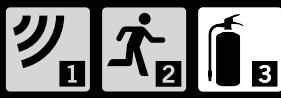

# USERMANUAL

## CO2 extinguishers

User manual CO2 extinguishers Ver:161207

# USERMANUAL

CO2 extinguishers (K2, K5TGX)

» BRUKSANVISNING » BRUGSVEJLEDNING » BRUKSANVISNING » KÄYTTÖOHJE » MANUEL D'UTILISATION

#### FOR MORE INFORMATION VISIT WWW.HOUSEGARD.COM

#### **» BRUKSANVISNING HOUSEGARD CO2 SLOKKER**

VIKTIG: : Les hele denne bruksanvisning nøye før du installerer produktet. Spar den for framtidig bruk.

Din nye HOUSEGARD brannslokker inneholder CO2 som er egnet til slokking av branner i en rekke materialer så som ildsfarlige væsker og kjemikalier. CO2 gir en ren slokking uten forurensende restprodukter.

Brannslokkeren kan også benyttes ved branner i elektriske anlegg inntil 1000 Volt. Ved slokking av branner i elektriske anlegg, sørg for en sikkerhetsavstand på minimum 1 meter.

#### FORPAKNINGEN INNEHOLDER:

- » 1 stk brannslokker
- » 1 stk veggfeste
- » 1 stk slange (modell K5TGX)
- » 1 stk pakning til slange. (modell K5TGX)
- » 1 stk bruksanvisning

#### EGENKONTROLL

Ved utpakking av produktet kontroller at sikringsplinten er montert og plombert. Kontroller at slangen er montert (modell K5). Dersom ikke, monter slangen. Husk å montere den vedlagte pakningen mellom slange og ventil.

VIKTIG: Visuell kontroll av brannslokkeren er brukerens ansvar, eksempelvis att det er tilfredsstillende trykk på brannslokkeren.

#### SLIK FUNGERER CO2 SOM SLOKKEMIDDEL.

CO2 er en fargeløs og giftfri gass. CO2 er tyngre en luft. CO2 virker gjennom å kvele brannen. Gassen vil fortrenge oksygenet som brannen er avhengig av, og legge seg som et "teppe" over brannstedet. CO2 apparatet er velegnet til bruksområder såom datarom, elektriske installasjoner, storkjøkken etc.

#### BRANNKLASSER

Brannklassen angir hvilken type av branner man kan slokke. Klassene er angitt med piktogram,

B Klassen | Væskebranner som olje, bensin, maling mm.

#### VIKTIGT VED SLOKKING AV BRANN

Vær alltid forsiktig når du nærmer deg en brann. Gå ikke for nære men hold en sikkerhetsavstand på minimum 1 meter. Se alltid etter mulige rømningsveier først. Forsøk ikke å nærme deg brannen dersom det er risiko for at brannen kan spre seg slik at rømmningsveien blokkeres.

DANSK

SVENSKA

SOUMI

FRANCAIS

## HANDLING VED BRUK AV BRANNSLOKKEREN

- » Dra ut sikringen.
- » Hold slangen med ett fast grep og sikt i underkant av brannen.
- » Trykk ned håndtaket slik at brannslokkeren utløses.
- » Beveg munnstykket frem og tilbake i mot underkant av flammene inntil brannen er slokket.

#### ETTERSYN OG KONTROLL.

I private boliger skal autorisert kontroll gjennomføres hvert 5 år, full service hvert 10 år. For næringsvirksomhet gjelder egne regler iht. NS 3910 samt HOUSEGARDS serviceinstruksjoner.

#### KONTROLL AV MENGDE CO2 .

Slokkeren skal inneholde en spesifisert mengde med CO2 angitt i kg. For modell K2 = 2 kg, for modell K5TGX = 5 kg. Innholdet kan kontrolleres ved å veie apparatet uten slange. Apparatets vekt fratrukket apparatets tomvekt tilsvarer den mengde CO2 som er i apparatet. Apparatets tomvekt uten slange er stemplet inn i sylinderen. "Tar Weigth" Dersom avviket mellom spesifisert mengde CO2 og målt mengde overstiger 10% må apparatet refylles.

#### JEVNLIG EGENKONTROLL.

- » Kontroller att brannslokkeren er på plass og rett plassert.
- » Kontroller att brannslokkeren er hel og uten synlige skader.
- » Kontroller att sikringspinnen er på plass og plombert.

VIKTIG: Apparatet må alltid refylles etter at det har vært utløst. Refylling krever spesialutstyr. Lever apparatet til et autorisert serviceverksted. Bruk bare HOUSEGARD spesifisert slokkemiddel og reservedeler.

#### VIKTIG SIKKERHETSINFORMASJON.

- » Beholderen er under trykk, benytt derfor aldri fysisk makt for å åpne beholder eller demontere ventil.
- » Bytt alltid ut skadede eller korroderte deler, benytt autorisert personell.
- » Sjekk at brannslokkeren passer til ditt bruksområde iht. informasjonen på brannslokkerens frontetikett.
- » Rett aldri brannslokkerens munnstykke direkte mot mennesker eller dyr. Sikkerhetsavstand minimum 1 meter ved slokking av branner i klær.
- » Hold brannslokkeren ren, unngå bruk av korroderende rengjøringsmidler.
- » Ved bruk på bil, lastevogn. Sørg for tilstrekkelig festeanordning som sikrer brannslokkeren.
- » Brannslokkeren skal oppbevares utenfor rekkevidde for små barn.
- » CO2 fortrenger oksygen. Det må utvises forsiktighet ved bruk i små uventilerte rom grunnet faren for kvelning.
- » CO2 gassen i apparatet holder ved utløsning en temperatur på om lag minus 80 grader og kan forårsake forfrysning ved direkte kontakt.
- » Luft ut etter bruk.
- » Ved kassasjon, lever brannslokkeren til godkjent oppsamlingsplass for søppel.

#### TEKNISKE SPESIFIKASJONER:

#### HOUSEGARD K2

Modell: K2 Type: 2 kg CO2 , trykkladet Brannklasse: B Effektklasse: 34B Vekt: 6,4 kg Trykk: 220 Bar Drivgass: CO2 Slokkemiddel: CO2 Godkjenninger: Norsk Standard NS-EN3, CE, Lisensiert av DNV. Temperaturområde: -30 °C til +60 °C

#### HOUSEGARD K5TGX

Model: K5TGX Type: 5 kg CO2 , trykkladet Brannklasse: B Effektklasse: 89B Vekt: 15 kg Trykk: 220 Bar Drivgass: CO2 Slokkemiddel: CO2 Godkjenninger: Norsk Standard NS-EN3, Wheelmark, CE, Lisensiert av DNV Temperaturområde: -30 °C til +60 °C

#### CE DEKLARASJON FOR TRYKKPÅKJENT UTSTYR IHT. ARTIKKEL 3(2) I EU DIREKTIV 97/23/EG.

GPBM Nordic AS Professor Birkelandsvei 26B 1081 Oslo Norge

Bekrefter att følgende typer av trykksatte HOUSEGARD brannslokkere: permanent trykksatt av typen vann, skum, og pulver. (For detaljert modellbetegnelse se på brannslokkerens etikett) er i overensstemmelse med:

- » Forskrift om trykkpåkjent utstyr 97/23 EEG
- » Europeisk Standard NS-EN3

De allment aksepterte regler for god bransjepraksis. (Sound Engineering Praxis). Til grunn for bedømming av overensstemmelse er brukt Modul B + C1 og EU direktiv 97/23/EØF (annex III) og/eller artikkel 3 (3) i direktiv 97/23/EØF. Manometre, trykkindikatorer, slanger og/eller munnstykker som kan være benyttet, samt øvrige trykkbærende anordninger som ikke er nevnt ovenfor er også i overensstemmelse med direktivet.

#### GARANTIVILKÅR

5 års garanti mot trykkfall regnet fra produksjonsmåned.

Garantien forutsetter at originalplombe er inntakt, samt at produktet ikke er åpnet, brukt, refylt, eller undergått service som innebærer fysisk inngrep på produktet.

Garantien forutsetter at produktet er brukt og oppbevart under normale forhold, og i normale miljø. Garantien er ikke gyldig dersom produktet er oppbevart i korrosive eller på andre måter ugunstige eller belastende miljøer, eller på annen måte åpenbart er skadet av kundens oppbevaring og bruk.

For ytterligere informasjon www.housegard.com

DANSK

SVENSKA

SOUMI

#### **» BRUGSVEJLEDNING HOUSEGARD CO2 SLUKKER**

VIGTIG: Læs denne brugsanvisning nøje igennem, før du monterer produktet. Gem brugervejledningen til fremtidig brug.

Deres nye Housegard CO2 slukker indeholder CO2 som er velegnet til slukning af brande i en række materialer så som, brandfarlige væsker og kemikalier. CO2 en ren slukning uden forurenende restprodukter.

Brandslukkeren kan også benyttes ved brande i elektriske anlæg op til 1000 Volt. Ved slukning af brande i elektriske anlæg, sørg for en sikkerhedsafstand på minimum 1 meter.

#### PAKKEN INDEHOLDER

- » 1 stk. brandslukker
- » 1 stk. beslag

PAKKEN INDEHOLDER » 1 stk. brandslukker. » 1 stk. væg beslag. » 1 stk. slange. » 1 stk. brugsvejledning.

- » 1 stk. pakning (Model K5TGX)
- » 1 stk. slange (Model K5TGX)
- » 1 stk. brugsvejledning

#### EGENKONTROL:

Ved udpaking kontroller at produktet er helt og uskadet. Kontroller at sikringsplinten er monteret og plomberet. Kontroller at slangen er monteret (Model K5), hvis ikke, monter slangen, husk at påmontere slangepakningen. Kontroller jævnligt plomberingen!

VIGTIGT: Visuel kontrol af brandslukkeren er brugernes ansvar, kontroller jævnligt, at det er tilfredsstillende tryk på brandslukkeren.

#### HVORDAN VIRKER CO2 SLUKKEREN:

CO2 er en farveløs og giftfri gas. CO2 er tungere end luft. CO2 virker ved at kvæle branden/ ilden. CO2 fortrænger oxygenet/ ilten som branden er afhængig af, og lægger sig som et "tæppe" over brandstedet. CO2 slukker er velegnet til at slukke brande i datarum, serverrum, elektriske installationer, storkøkkener etc.

#### BRANDKLASSER

Brandklassen angiver hvilken type af brande man kan slukke. Klasserne er i piktogram: B Klassen | Væskebrande som olie, benzin, maling m.m.

#### VIGTIGT VED SLUKNING AF EN BRAND:

Vær altid forsigtig når du nærmer dig branden. Gå ikke for tæt, og hold en sikkerhedsafstand på minimum 1 meter. Se altid efter mulige flugtveje først. Forsøg aldrig at nærme dig branden, hvis der er risiko for at branden kan sprede sig, og blokere flugtvejen.

#### VED BRUG AF BRANDSLUKKEREN

- » Træk sikringen ud.
- » Hold på slangen med et fast greb og sigt i underkanten af branden.
- » Tryk håndtaget ned, så brandslukkeren udløses.
- » Bevæg mundstykket på slangen frem og tilbage, mod underkanten af flammerne indtil branden er slukket.

#### EFTERSYN SERVICE OG KONTROL

Vedligeholdelse af håndslukkere skal udføres efter DS 2320.

Service på håndslukkere må kun udføres af sagkyndige personer som er certificeret i henhold til DS 2320. Denne serviceinstruktion er skrevet på basis af servicevejledning fra producenten.

#### ÅRLIG KONTROL AF MÆNGDE CO2

CO2 slukkeren skal indeholde en specifik mængde med CO2 angivet i kg. For model K2 =2 kg, for model K5TGX = 5 kg. Indholdet kan kontrolleres ved at veje apparatet uden slange. Apparatets vægt fratrukket apparatets nettovægt (tom) tilsvaret den mængde CO2 som er i apparatet. Apparatets nettovægt uden slange er stemplet på siden af cylinderen. "Tar Weigth" Hvis afvigelsen mellem specifikt mængde CO2 og målt mængde overstiger 10% skal apparatet genfyldes.

#### DEN JÆVNLIG EGENKONTROL.

- » Kontroller at brandslukkeren er placeret korrekt, at den er placeret på rette sted.
- » Kontroller at brandslukkeren er hel og ikke har defekter eller synlige skader.
- » Kontroller at sikrings-splitten sidder korrekt og er plomberet.

VIKTIGT: Apparatet skal altid genfyldes hvis det har været udløst. Genfyldning kræver specialudstyr. Apparatet indleveres til en autoriseret forhandler/ serviceværksted. Brug kun HOUSEGARD specificeret slukkemiddel og reservedele.

SVENSKA

NORSK

SOUMI

#### VIKTIG SIKKERHEDS INFORMATION:

- » Beholderen er under tryk, prøv derfor aldrig med fysisk magt, at åbne beholderen eller demontere ventilen.
- » Udskift altid skadede eller korroderede dele, benyt en autoriseret forhandler.
- » Tjek at brandslukkeren passer til brugsområdet iht. informationen på brandslukkerens frontetiket.
- » Ret ALDRIG brandslukkerens mundstykke direkte mod mennesker eller dyr. Sikkerhedsafstand, altid minimum 1 meter ved slukning.
- » Hold brandslukkeren ren, undgå brug af ætsende rengøringsmidler.
- » Ved montering på køretøj. Sørg for tilstrækkelig festeanordning, der sikrer at brandslukkeren sidder fast.
- » Brandslukkeren skal opbevares udenfor rækkevidde af små børn.
- » CO2 fortrænger oxygen. Vær forsigtigt ved brug i små uventilerede rum grundet faren for kvælning.
- » Apparatet har et højt arbeidstryk/ trykbeholder og skal behandles med forsigtighed.
- » CO2 holder en temperatur på ned til minus 80 grader og kan forårsage forfrysning ved direkte
- » kontakt på huden.
- » Udluft efter brug.
- » Ved kassering, leveres brandslukkeren til en autoriseret forhandler eller godkendt genbrugsstation.

#### TEKNISKE SPECIFIKATIONER:

#### HOUSEGARD K2

Model: K2 Type: 2 kg CO2 , trykladet Brandklasse: B Effektklasse: 34B Vægt: 6,4 kg Tryk: 220 Bar Drivgas: CO2 Slukkemiddel: CO2 Godkendelser: Dansk Standard DS-EN3, CE, licenseret af DS Driftstemperatur:-30 °C til +60 °C

#### HOUSEGARD K5TGX

Model: K5TGX Type: 5 kg CO2 ,trykladet Brandklasse: B Effektklasse: 89B Vægt: 15 kg Tryk: 220 Bar Drivgas: CO2 Slukkemiddel: CO2 Godkendelser: Dansk Standard DS-EN3, Wheelmark, CE, licenseret af DS Driftstemperatur: -30 °C til +60 °C

#### CE DEKLARATION FOR TRYKODKENDT UDSTYR IHT. ARTIKEL 3(2) I EU DIREKTIV 97/23/EG.

GPBM Nordic AS Professor Birkelandsvei 26B 1081 Oslo Norge

Bekræfter hermed følgende typer af trykholdige HOUSEGARD brandslukkere: Typer beholdere med permanent tryk: vand, skum, og pulver. (For mere detaljeret modelbetegnelse se brandslukkerens frontetiket) dette i overensstemmelse med:

» Dokumenteret og trykgodkendt udstyr 97/23 EEG

- » Europæisk Standard NS-EN3
I overensstemmelse med de almene regler for god branchepraksis. (Sound Engineering Praxis).

I henhold overensstemmelser om regler og krav til: Modul B + C1 og EU direktiv 97/23/EØF (annex III) og/eller artikel 3 (3) i direktiv 97/23/EØF. Manometre, trykindikatorer, slanger og/eller mundstykker som kan være benyttet, samt øvrige trykbærende anordninger som ikke er nævnt ovenfor, også er i overensstemmelse med direktivet.

#### GARANTI Der ydes 5 års garanti ved trykfald på beholderen, beregnet fra produktionsmåned.

Garantien forudsætter, at original-plump er intakt, samt at produktet ikke har været åbnet, brugt, genopfyldt, eller har gennemgået service, hvilket indebærer fysisk indgreb i produktet.

Garantien forudsætter, at produktet er i brug under normale forhold og i normalt miljø. Der ydes ikke garanti hvis produktet er tæret, eller på andre måder har været placeret i ekstremt hårdt miljø eller på anden måde er blevet skadet i forbindelse af opbevaring eller brug.

For yderligere information www.housegard.com

NORSK

SOUMI

SVENSKA

## **» BRUKSANVISNING HOUSEGARD KOLDIOXIDSLÄCKARE**

VIKTIGT: Läs hela denna bruksanvisning noggrant innan du installerar produkten. Spara den för framtida bruk.

Din nya Housegard brandsläckare innehåller koldioxid som är avsedd för släckning av bränder i olika material såsom brandfarliga vätskor och kemikalier. CO2 ger en ren släckning utan förorenade restprodukter. Brandsläckaren kan också användas vid bränder i elektriska installationer som uppgår till 1000 Volt. Vid släckning av bränder i elektriska installationer ska du hålla ett säkerhetsavstånd på minst 1 meter.

### DENNA FÖRPACKNING INNEHÅLLER:

- » 1 st brandsläckare
- » 1 st väggfäste
- » 1 st slang (Gäller modell K5TGX)
- » 1 st packning till slang (Gäller modell K5TGX)
- » 1 st bruksanvisning

#### EGENKONTROLL

Vid uppackning av produkten kontrollera att säkringssprinten är monterad och plomberad. Kontrollera att slangen är monterad. (modell K5) Om inte, montera slangen. Var noga med att installera den medföljande packningen mellan slang och ventil.

VIKTIGT: Visuell kontroll av brandsläckaren är användarens ansvar, t ex att det är tillfredsställande tryck på handsläckaren.

### SÅ FUNGERAR KOLDIOXID SOM SLÄCKMEDEL

CO2 är en färglös och giftfri gas som är tyngre än luft. Koldioxid verkar genom att kväva branden. CO2 kväver syret som branden är beroende av och lägger sig som en "matta" över eldslågan. Koldioxidsläckaren är avsedd för att släcka bränder i exempelvis datarum, elektriska installationer, storkök etc.

#### BRANDKLASSER

Brandklassen anger vilken typ av bränder man kan släcka. Klasserna är angivna med piktogram.

B Klassen | Vätskebränder som olja, bensin, målarfärg mm.

#### VIKTIGT VID SLÄCKNING AV BRAND

Var alltid försiktig när du närmar dig en brand. Gå inte för nära branden utan håll ett säkerhetsavstånd på minimum 1 meter. Kontrollera alltid möjliga utrymningsvägar först. Försök inte att närma dig branden om det finns risk att den kan spridas så att utrymningsvägen blockeras.

#### HUR DU ANVÄNDER BRANDSLÄCKARE

- » Dra ur säkringen.
- » Håll slangen med ett fast grepp och sikta mot lågornas bas
- » Tryck ner handtaget så att brandsläckaren utlöses.
- » Flytta munstycket fram och tillbaka mot lågornas bas tills branden är släckt.

#### UNDERHÅLL OCH KONTROLL

I privata bostäder rekommenderas en auktoriserad kontroll vart 5:e år och full service vart 10:e år. För näringsverksamhet gäller servicestandard SS 3656 och HOUSEGARDs serviceinstruktioner.

#### KONTROLL AV MÄNGDEN CO2 .

Släckaren ska innehålla en specificerad mängd CO2 angiven i kg. För modell K2 = 2 kg och för modell K5TGX = 5 kg. Innehållet kan kontrolleras genom att väga apparaten utan slang. Apparatens vikt frånräknat apparatens tomvikt motsvarar mängden CO2 som är i apparaten. Apparatens tomvikt utan slang står instämplad på cylindern Tar weight". Om skillnaden mellan mätt mängd CO2 överstiger ±10% av angiven mängd CO2 måste apparaten fyllas på.

#### REGELBUNDEN EGENKONTROLL

- » Kontrollera att brandsläckare finns på plats och är rätt placerad.
- » Kontrollera att brandsläckare är intakt och utan synliga skador.
- » Kontrollera att manometerpilen står i det gröna fältet.
- » Kontrollera att säkerhetssprint är på plats och plomberad.

VIKTIGT: Brandsläckaren måste alltid laddas om efter användning även om bara delar av innehållet använts. Omladdning kräver specialutrustning. Kontakta en auktoriserad serviceverkstad. Använda bara av HOUSEGARD specificerade reservdelar.

DANSK

NORSK

SOUMI

### VIKTIG SÄKERHETSINFORMATION

- » Behållaren är under tryck. Använd aldrig fysisk kraft för att öppna behållaren eller demontera ventilen.
- » Byt alltid ut skadade eller korroderade delar. Service skall endast utföras av auktoriserad personal.
- » Kontrollera att brandsläckaren passar till ditt bruksområde enligt informationen på brandsläckarens etikett.
- » Rikta aldrig brandsläckarens munstycke mot människor eller djur. Säkerhetsavstånd minimum 1 meter vid släckning av brand i kläder.
- » Håll brandsläckaren ren. Använd inte frätande rengörningsmedel.
- » Vid användning i fordon skall lämpliga fästelement / fordonshållare användas.
- » Brandsläckaren skall förvaras utom räckhåll för små barn.
- » CO2 förtränger syre. Försiktighet bör iakttas vid användning i små oventilerade rum på grund av risken för kvävning.
- » Vid användning håller gasen en temperatur på cirka minus 80 ˚C och kan orsaka förfrysning viddirektkontakt.
- » Ventilera efter användning.
- » Vid avyttring, lämna brandsläckare till din återvinningscentral.

#### TEKNISKA SPECIFIKATIONER:

#### HOUSEGARD K2

Modell: K2 Typ: 2 kg CO2 , tryckladdad Brandklass: B Effektklass: 34B Vikt: 6,4 kg Tryck: 220 Bar Drivgas: CO2 Släckmedel: CO2 Godkännanden: Svensk Standard SS-EN3, CE, Licensierad av DNV. Temperaturområde: -30 °C till +60 °C

#### HOUSEGARD K5TGX

Modell: K5TGX Typ: 5 kg CO2 , tryckladdad Brandklass: B Effektklass: 89B Vikt: 15 kg Tryck: 220 Bar Drivgas: CO2 Släckmedel: CO2 Godkännanden: Svensk Standard SS-EN3, CE, Licensierad av DNV, Wheelmark Temperaturområde: -30 °C till +60 °C

#### CE-KONFORMITETSDEKLARATION FÖR TRYCKBÄRANDE ANORDNING I ENLIGHET MED ARTIKEL 3(2) I EUROPEISKA TRYCKKÄRLSDIREKTIVET 97/23/EG.

GPBM Nordic AB Argongatan 2B SE-431 53, Mölndal Sweden

Intygar att följande typer av trycksatta brandsläckare: permanent trycksatt vatten, skum, torrpulversläckare. (För detaljerad typ se beteckning på brandsläckarens etikett) är i överensstämmelse med:

- » Tryckkärlsdirektivet 97/23 EEG
- » Europeisk Standard EN 3

De allmänt erkända reglerna för god branschpraxis (Sound Engineering Praxis).

Förfarandet för bedömning av överensstämmelse för tryckbärande anordningar och för behållaren har baserats på Modul B + C1 och det europeiska direktivet 97/23/EG (annex III) och/eller artikel 3 (3) i direktiv 97/23/EG. Manometrar, tryckindikatorer, slangar och/eller munstycken som kan vara installerade samt övrig tryckbärande anordning som inte nämns ovan omfattas av bestämmelserna och artikel.

#### GARANTIVILLKOR 5 års garanti gäller för tryckfall räknat från produktens produktionsmånad.

Garantin förutsätter att originalplomben är intakt och att produkten inte är öppnad, använd, återfylld eller har genomgått service som inneburit fysiskt ingrepp på produkten.

Garantin förutsätter att produkten används och förvaras under normala förhållanden och i normal miljö. Garantin gäller inte om produkten lagras i korrosiva eller på annat sätt ogynnsamma eller belastande miljöer, eller på annat sätt kan anses ta skada av dess lagring eller användning.

För ytterligare information www.housegard.com

DANSK

NORSK

SOUMI

FRANCAIS

## **» KÄYTTÖOHJE HOUSEGARD HIILIHAPPOSAMMUTIN**

TÄRKEÄÄ! Lue ohjeet huolellisesti ennen käyttöä. Säilytä käyttöohjeet – saatat tarvita niitä myöhemmin.

Uusi Housegard sammuttimenne sisältää hiilihappoa joka on tarkoitettu useiden eri materiaalien sammuttamiseen, kuten palavat nesteet ja kemikaalit. Lisäksi sammuttimella voidaan sammuttaa sähköpaloja 1000V saakka. Sähköpaloissa tulee pitää vähintään 1 metrin turvaetäisyys. Hiilihappo sammuttaa puhtaasti, ilman jälkisiivousta.

#### PAKKAUS SISÄLTÄÄ

- » Seinäkiinnike, 1 kpl
- » Letku, 1 kpl (vain K5TGX)
- » Letkun pakkaus (vain K5TGX)
- » Käyttöohje, 1 kpl

#### KUN OTAT SAMMUTTIMEN PAKKAUKSESTA, KÄY LÄPI SEURAAVAT ASIAT

Tarkista, että painemittarin neula on vihreällä alueella. Tarkista myös, että sokka on ehjä ja paikallaan sekä sinetöity. Kiinnitä letku sammuttimeen, jos se on pakkauksessa irtonaisena.

TÄRKEÄÄ: Sammuttimen visuaalinen tarkastus on käyttäjän vastuulla. Tämä tarkoittaa esimerkiksi sitä, että käyttäjä tarkistaa sammuttimen paineen, jonka pitää olla hyväksyttävällä tasolla.

#### HIILIDIOKSIDIN TOIMINTA SAMMUTUSAINEENA

CO2 on väritön, hajuton ja mauton ilmaa raskaampi kaasu. Hiilidioksidi tukahduttaa palon. CO2 syrjäyttää hapen, josta palo on riippuvainen, ja asettuu "mattona" palon päälle. Hiilidioksidisammutin on tarkoitettu sammuttamaan paloja esimerkiksi datahuoneissa, sähköasennuskeskuksissa, suurkeittiöissä jne.

#### PALOLUOKAT:

Sammuttimet ovat luokiteltu kirjaimella, joka ilmaisee palojen tyypit, joihin sammutin soveltuu.

B - luokka Nestepalot, kuten öljy, bensiini, lakka, maali

#### TÄRKEÄÄ TIETOA

Ole erityisen varoivainen, kun sammutat tulipaloa. Pidä aina vähintään 1 metrin turvaetäisyys. Tarkista aina ensin poistumistiet. Älä lähesty tulta jos on riski, että tuli leviää tukkien poistumistien.

### CO2-MÄÄRÄN VUOSIKONTROLLI

Hiilihapposammutin sisältää tietyn määrän CO2 :a kiloissa. Mallissa CO2 GA 2 kg ja mallissa CO2 GA 5 kg. Sisällön määrä voidan kontrolloida punnitsemalla sammutin ilman letkua. Sammuttimen paino vähennettynä tyhjän sammuttimen painolla ilmaisee sisällön määrän. Tyhjäpaino on merkitty pulloon. Jos mitattu määrä ylittää ilmoitetun määrän ±10% tulee sammutin täyttää.

#### MITEN KÄYTÄT SAMMUTINTA

- » Näin käytät sammutinta.
- » Vedä sokka pois.
- » Tähtää palon juureen.
- » Paina kahvaa.
- » Kun palo on sammutettu käännä suutin takaisin rungon suuntaisesti

#### YLLÄPITO JA TARKISTUS

Yksityisasunnoissa suosittelemme sammuttimen tarkistusta viiden (5) vuoden välein. Sammutin on huollettava valtuutetussa sammutinhuoltoliikkeessä kymmenen (10) vuoden välein. Yrityksissä tarkistus ja huolto on suoritettava paikallisten lakien ja asetusten mukaisesti.

#### SÄÄNNÖLLINEN TARKISTUS

- » Tarkista, että sammutin on määrätyssä paikassa.
- » Tarkista, että sammutin on koskematon ja vahingoittumaton.
- » Tarkista, että sokka on paikoillaan ja sinetöity.

TÄRKEÄÄ: Sammutin on aina huollettava käytön jälkeen, vaikka vain osa jauheesta olisi käytetty. Huoltaminen ja sammuttimen täyttö vaatii erikoistyökaluja ja koulutusta; ota yhteyttä valtuutettuun sammutinhuoltoliikkeeseen. Käytettävä vain HOUSEGARDin hyväksymiä jauheita ja varaosia.

DANSK

SVENSKA

NORSK

## TÄRKEÄÄ TURVALLISUUSTIETOA

- » Sammutin on paineistettu. ÄLÄ pura sitä. Älä alitista sammutinta ulkoiselle vahinkoa aiheuttavalle voimalle, älä käytä väkisin. Vioittununeet tai korroosioituneet sammuttimet on tyhjennettävä ennen kierrätystä. Huolto ja täyttö voidaan suorittaa vain valtuutetussa sammutinhuoltoliikkeessä.
- » Tarkista, että sammutin soveltuu paikkaan, johon se asennetaan. Katso sammuttimen etiketistä lisätietoja.
- » Ihmisiin ja eläimiin suuntaaminen on kielletty. Pidä vaatteita sammutettaessa yhden (1) metrin turvaetäisyys.
- » Pidä sammutin puhtaana. Älä käytä syövyttäviä pesuaineita.
- » Kulkuneuvoihin asennettavat sammuttimet on kiinnitettävä turvallisesti sopivalla telineellä.
- » Sammutin olisi pidettävä pienten lasten saavuttamattomissa..
- » CO2 syrjäyttää hapen. Varovaisuutta on noudatettava tuulettamattomissa tiloissa tukehtumisriskin vuoksi.
- » Käytettäessä CO2 :n lämpötila on -80 ˚C joka voi aiheuttaa paleltumisvammoja.
- » Käytön jälkeen tila on tuuletettava.
- » Sammutinta ei saa hävittää kotitalousjätteiden mukana. Vie sammutin hävitettäessä kierrätyskeskukseen.

#### TEKNISET OMINAISUUDET:

#### HOUSEGARD K2

Malli: K2 Tyyppi: 2 kg CO2 , paineistettu Paloluokat: B Sammutusteho: 34B Kokonaispaino: 6,4 kg Paine: 220 Bar Ponneaine: CO2 Sammutusaine: CO2 Hyväksynnät: Suomalainen standardi, SFS-EN3, CE, DVN:n lisensoima Käyttölämpötila: -30 °C to +60 °C

#### HOUSEGARD K5TGX

Malli: K5TGX Tyyppi: 5 kg CO2 , paineistettu Paloluokat: B Sammutusteho: 89B Kokonaispaino: 15 kg Paine: 220 Bar Ponneaine: CO2 Sammutusaine: CO2 Hyväksynnät: Suomalainen standardi, Wheelmark, SFS-EN3, CE, DNV:n lisensoima Käyttölämpötila -30 °C to +60 °C

#### VAATIMUKSENMUKAISUUSVAKUUTUS SIITÄ, ETTÄ LAITE TÄYTTÄÄ EUROOPAN PAINELAITEDIREKTIIVIN 97/23/EY ARTIKLAN 3(2) VAATIMUKSET

GPBM Nordic AB Argongatan 2B SE-431 53, Mölndal Sverige

Vakuuttaa täten, että seuraavat paineistetut sammutintyypit: pysyvästi paineistetut vesisammuttimet, vaahtosammuttimet ja jauhesammuttimet, täyttävät seuraavien standardien ja direktiivien vaatimukset:

» Painelaitedirektiivi 97/23/EY

» Eurooppalainen standardi EN3

The generally acknowledged rules of engineering (Sound Engineering Praxis). Yleisesti hyväksytyt tekniset määräykset

Painelaitteiston ja paineastian yhdenmukaisuusarviointi perustuu B + C1 Moduleihin ja Eurooppa Direktiiveihin 97/23/EY (Liite III) ja/tai 97/23/EY Artiklaan 3(3).

Painemittarit ja paineilmaisimet, kokonaiset letkut ja/tai suuttimet, jotka voidaan asentaa sammuttimen yhteyteen, ja kaikki muut paineistetut laitteet, joita ei ole erikseen yllä mainittu, ovat direktiivin 97/23/EY artiklan 3(3) vaatimusten alaisia.

# SOUMI

DANSK

SVENSKA

NORSK

FRANCAIS

#### TAKUUEHDOT

#### 5 vuoden takuu paineenlaskulle alkaen valmistuspäivästä.

Takuu edellyttää, että alkuperäinen plommaus on ehjä ja että tuotetta ei ole avattu, käytetty, täytetty tai huollettu siten, että tuotetta on fyysisesti muutettu. Takuu edellyttää, että tuotetta käytetään ja säilytetään normaaleissa olosuhteissa ja ympäristössä. Takuu ei ole voimassa, mikäli tuotetta on säilytetty syövyttävässä, epäsuotuisassa ympäristössä tai muutoin vahinkoa aiheuttavissa olosuhteissa.

Lisätietoja: www.housegard.com

# **» MANUEL D'UTILISATION DE L'EXTINCTEUR À DIOXYDE DE CARBONE HOUSEGARD**

IMPORTANT ! Nous vous recommandons de lire attentivement les instructions ci-dessous avant l'utilisation de votre appareil. Gardez également la notice pour références ultérieures.

Cet extincteur HOUSEGARD contient du dioxyde de carbone (CO2 ) sous forme comprimée liquéfiée et gazeuse.Il est destiné à éteindre les incendies de liquides inflammables. l'usage de cet extincteur à dioxyde de carbone ne laisse pas de résidu.

Cet extincteur peut être utilisé sur des feux électriques de tension jusqu'à 1000V, à une distance de 1 mètre.

#### CET EMBALLAGE CONTIENT :

- » 1 extincteur
- » 1 support mural
- » 1 tuyau (Modèle applicable K5TGX)
- » 1 joint pour tuyau (Modèle applicable K5TGX)
- » 1 mode d'emploi

#### CONTRÔLE ET INSPECTION DE L'EXTINCTEUR

Lors du déballage de l'extincteur, vérifier que la goupille de sécurité est en place et scellée. Vérifier également que le tuyau est monté (Modele K5) . Le cas échéant, attachez-le. Veillez à bien installer le joint fourni entre le tuyau et la vanne.

IMPORTANT : L'inspection visuelle de l'extincteur est de la responsabilité de l'utilisateur – par exemple, la pression de l'extincteur doit se trouver à un niveau satisfaisant d'utilisation.

#### LE DIOXYDE DE CARBONE (CO2 ) COMME AGENT EXTINCTEUR

Le dioxyde de carbone (CO2 ) est un gaz incolore et non toxique. Il est plus lourd que l'air. L'expulsion du dioxyde de carbone crée un froid intense.

L'extinction des feux traités se fait par le biais du refroidissement de l'incendie, par la diminution de la teneur en oxygène et par l'effet de souffle créé.

#### CLASSE DE FEUX

Nos types d'extincteurs sont identifiés par une lettre-symbole indiquant leur classe de feux – et signifie ainsi quel type de feux il est possible d'éteindre.

Classe B : Feux de liquides tels que d'huiles, l'essence, le vernis, la peinture etc…

#### INFORMATION IMPORTANTE

Faites preuve de vigilance lorsque vous vous approchez d'un feu. Ne vous en approchez pas trop et gardez une distance minimale de sécurité d'un mètre. Dans un premier temps, pensez aux possibilités d'évacuation et restez à distance du feu. Il faut que vous soyez en mesure d'évacuer les lieux, même en risque de propagation de feu.

#### COMMENT FAIRE FONCTIONNER VOTRE EXTINCTEUR ?

- » Enlever la goupille de sécurité en tirant sur l'anneau.
- » Viser la base des flammes et diriger la buse dans cette direction.
- » Presser la gâchette pour faire sortir l'agent extincteur.
- » Effectuer un mouvement de balayage avec le jet à la base des flammes jusqu'à l'extinction complète du feu.

#### MAINTENANCE ET INSPECTION

En résidence privée, une inspection est recommandée tous les 5 ans et une maintenance complète tous les 10 ans. Pour les entreprises, toute maintenance doit être effectuée conformément à la réglementation nationale.

#### CONTRÔLE DE LA QUANTITÉ DE CO2 .

Les extincteurs doivent contenir une quantité donnée de CO2 exprimée en kg. Par exemple, le modèle K2 = 2 kg et le modèle K5TGX = 5 kg. Le contenu peut être vérifié en pesant le dispositif sans tuyau. Le poids de l'extincteur vide sans tuyau est indiqué sur l'extincteur. Il suffit de peser l'extincteur sans son tuyau : la différence entre les 2 poids donne la quantité mesurée de CO2 . Si le poids mesuré dépasse ± 10% de la quantité spécifiée de CO2 (2kg ou 5kg), le dispositif doit être réapprovisionné.

#### AUTO SURVEILLANCE RÉGULIÈRE

- » Vérifier que l'extincteur est bien installé et à sa place désignée.
- » S'assurer que l'extincteur est intact et en état de marche et qu'il ne présente pas de signe de détérioration visible.
- » Vérifier que la goupille de sécurité est en place et scellée.

IMPORTANT : Recharger après utilisation, même partielle – et ce, même si seule une petite quantité de produit ou des éléments ont été utilisés. N'utiliser pour l'entretien et la recharge que des produits et des pièces de rechange conformes au modèle certifié. La recharge nécessite l'intervention d'un personnel qualifié compétent. Contacter un centre de service agréé. Utiliser uniquement des pièces de rechange Housegard

SOUMI

DANSK

SVENSKA

NORSK

#### INFORMATION IMPORTANTE DE SÉCURITÉ

- » L'extincteur est un appareil sous pression. Il NE doit PAS être incinéré. NE PAS démonter ou soumettre à une force ou pression externe. Les extincteurs endommagés ou corrodés doivent être dépressurisés avant d'être jetés. Ce service ne peut être effectué que par du personnel compétent.
- » Assurez-vous que l'extincteur est adapté à la zone d'utilisation prévue. Pour plus d'information, se référer à l'étiquette avant de l'extincteur.
- » Ne jamais diriger la buse en direction de personnes ou d'animaux. Garder une distance de sécurité minimale d'un mètre lorsque vous éteignez un feu de tissu.
- » Garder l'extincteur propre. Ne pas utiliser de produits nettoyants contenant un agent corrosif.
- » Les extincteurs dans les véhicules doivent être solidement fixés à l'aide d'un support adapté.
- » L'extincteur doit être tenu hors de portée des jeunes enfants.
- » Le CO2 étouffe l'oxygène. Il faut être prudent lorsqu'il est utilisé dans une petite pièce non ventilée, en raison du risque de suffocation
- » Le dioxyde de carbone est expulsé à une température avoisinant les -80 °C. Eviter tout contact entre le gaz et la peau, sous peine de risquer des gelures.
- » Ventiler après utilisation.
- » Ne se jette pas dans les ordures ménagères. Il doit être déposé dans un point de collecte approprié afin d'être recyclé.

#### CARACTÉRISTIQUES TECHNIQUES

#### HOUSEGARD EXTINCTEUR K2

Modèle: K2 Type: 2 kg CO2 , – stocké sous pression Classes de feux: B Résistance au feu: 34B Poids total: 6,4 kg Pression interne: 220 Bar Gaz propulseur: CO2 Poudre: CO2 Certifications : Standart Français EN3, CE Températures de fonctionnement: de -30 °C à +60 °C

#### HOUSEGARD EXTINCTEUR K5TGX

Modèle : K5TGX Type : 5 kg CO2 , - stocké sous pression Classes de feux : B Résistance au feu : 89B Poids total : 15 kg Pression interne : 220 Bar Gaz propulseur : CO2 Poudre : CO2 Certifications : Standart Français EN3, CE, Wheelmark Températures de fonctionnement : de -30 °C à +60 °C

#### DÉCLARATION DE CONFORMITÉ CE RELATIVE POUR APPAREIL TEL QUE SPÉCIFIÉ DANS L'ARTICLE 3, PARAGRAPHE 2 DE LA DIRECTIVE DES ÉQUIPEMENTS SOUS PRES-SION 97/23/EG

GPBM NORDIC AB ARGONGATAN 2B SE-431 53 Mölndal SUÈDE

Certifie que les types d'extincteurs sous pression suivants : eau sous pression permanente, mousse, poudre sèche (pour connaître la désignation du type, voir l'étiquette frontale) sont en conformité avec :

» La directive 97/23/CE concernant les équipements sous pression

- » La norme européenne EN 3
Les règles d'ingénierie généralement admises (Société d'ingénierie de sûreté spécialisée Praxis)

La procédure d'évaluation de la conformité appliquée à l'équipement de pression et au récipient se fonde sur les modules B + C1 et la directive européenne 97/23/CE (Annexe III) et/ou l'article 3, paragraphe 3, de la directive 97/23/CE.

Les manomètres et indicateurs de pression, les manches et/ou ajutages complets susceptibles d'être installés et tout autre élément d'équipement sous pression non mentionné ci-dessus sont soumis aux dispositions et à l'article 3, paragraphe 3, de la directive 97/23/CE.

#### GARANTIE

#### Une garantie de 5 ans s'applique contre la chute de pression. La garantie court à partir du mois de fabrication du produit.

La garantie exige que le sceau original soit intact et que le produit n'ait pas été ouvert, utilisé, réutilisé ou qu'il n'ait pas subi d'intervention physique.

La garantie s'applique uniquement si le produit est utilisé et stocké dans des conditions et dans un environnement normal. La garantie ne s'applique pas si le produit est stocké dans des environnements corrosifs ou autrement défavorables, ou si le produit est considéré avoir été endommagé par son stockage ou son utilisation.

Pour plus d'information : www.housegard.com

SOUMI

DANSK

SVENSKA

NORSK

Secure your home by following **HOUSEGARD's** 1-2-3 product system which helps you **ALARM, EVACUATE & EXTINGUISH.** Secure your home by following **HOUSEGARD's** 1-2-3 product system which helps you **ALARM, EVACUATE & EXTINGUISH.**

© 2015 GPBM Nordic AB. All right reserved. © 2016 GPBM Nordic AB. All right reserved.

Housegard is a registered trademark of GPBM Nordic AB. Housegard is a registered trademark of GPBM Nordic AB.

Supplementary information about the product can be found at www.housegard.com Supplementary information about the product can be found at www.housegard.com