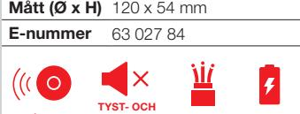

Utvalda brandskyddsprodukter anpassade för olika projektformer.

# Brandskydd för proffsmarknaden

# Vi vet att olika projekt har olika förutsättningar...

Därför har vi tagit fram ProSelect, ett sortiment som är noga utvalt för att passa in i så många olika projektformer som möjligt. Alla produkterna uppfyller de standarder och säkerhetskrav som krävs vid ny- och ombyggnationer.

I det breda utbudet finns vanliga singelbrandvarnare, sammankopplingsbara brandvarnare, värmevarnare samt pulversläckare och brandfilt som tillsammans skapar ett tryggt och säkert hem.

**ProSelect – exklusivt utvalt för proffsmarknaden.** 

### **PROSELECT BRANDSLÄCKARE**

Pulversläckare anses vara den mest mångsidiga släckaren och släcker de flesta bränder som kan uppstå och rekommenderas av Brandmyndigheten. En pulversläckare är frostbeständig och leder ej elektricitet.

Tänk på att en brandsläckare bara går att använda en gång, sedan måste de laddas om.

#### **Dessa typer av bränder kan du släcka med abc-pulver:**

- **A:** Glödbrand och brand i porösa material som trä, textil och papper.
- **B:** Brand i vätskor och oljor eller i fasta ämnen som kan anta vätskeform.
- **C:** Gasbrand.

| Uppfyller kraven enligt EN 1869:2019 | Silikonbelagd brandfilt som står emot gasgenomträngning och tål temperaturer upp till 500 °C.                                                                                       |
|-----------------------------------------|-------------------------------------------------------------------------------------------------------------------------------------------------------------------------------------------|
| FBSH-180                                |                                                                                                                                                                                           |
| Mått filt                               | 120 x 180 cm                                                                                                                                                                              |
| Mått box                                | 34,5 x 16 cm                                                                                                                                                                              |
| E-nummer                                | 16 939 63                                                                                                                                                                                 |
| Tang PD2 Vikt fylld E-nummer      | Tryckladdad pulversläckare med torrt kemikaliskt ABC-pulver. Uppfyller kraven enligt EN 3-7 och har wheelmark certifiering. Släckmedel 2 kg ABC-pulver 3,6 kg 16 933 83 |
|                                         |                                                                                                                                                                                           |
|                                         |                                                                                                                                                                                           |
|                                         |                                                                                                                                                                                           |
| mark certifiering.                      | Tryckladdad pulversläck are med torrt kemikaliskt ABC-pulver. Uppfyller kraven enligt EN 3-7 och har wheel                                                                       |
|                                         |                                                                                                                                                                                           |
|                                         |                                                                                                                                                                                           |
| Tang PD6S                               | Släckmedel 6 kg ABC-pulver                                                                                                                                                                |
| Vikt fylld                              | 9,3 kg                                                                                                                                                                                    |

#### **TRÅDLÖS SAMMANKOPPLING**

**PAUSFUNKTION**

**TRÅDLÖS**

**230 V AC**

**LONG LIFE**

| Räckvidd | upp till 30 meter        |
|----------|--------------------------|
|          | Mått (Ø x H) 102 x 35 mm |
| E-nummer | 63 020 07                |
|          |                          |

**Strömkälla** Inbyggt batteri, 10 år

**MSA-866/RF2**

**TRÅDLÖS LONG LIFE**

**PAUSFUNKTION**

**SINGEL BRANDVARNARE**

**VARNARE**

| GNSP-2236/10Y |  |
|---------------|--|

| Strömkälla | 220-240 V + backup batteri |  |
|------------|----------------------------|--|
|            | Mått (Ø x H) 120 x 54 mm   |  |
| E-nummer   | 63 027 86                  |  |

| E-nummer | 63 026 24 |
|----------|-----------|
| +        |           |

| MSA-866/10Y                    |                        |  |  |  |
|--------------------------------|------------------------|--|--|--|
| Strömkälla                     | Inbyggt batteri, 10 år |  |  |  |
| Mått (Ø x H)                   | 80 x 40 mm             |  |  |  |
| E-nummer                       | 63 010 96              |  |  |  |
| + TYST- OCH PAUSFUNKTION | 10 ÅRS GARANTI   |  |  |  |

*Alla brandvarnarna uppfyller kraven enligt EN 14604:2005/AC:2008, prestandadeklaration hittar du på www.nexa.se/proselect.*

## **PROSELECT BRANDVARNARE**

I det breda utbudet finns vanliga singelbrandvarnare och sammankopplingsbara brandvarnare samt värmevarnare. Fördelen med sammankopplande brandvarnare är att larmar en brandvarnare så larmar alla, inte bara den närmast brandhärden. Alla ProSelects trådlösa brandvarnare går att koppla samman, oavsett modell.

#### **Alla ProSelect brandvarnarna har:**

- Larmsignal på 85 dB vid 3 meter
- Pausfunktion
- Tystfunktion
- Signal vid låg batterispänning
- Dammskydd som skyddar vid byggnationer

**GARANTI**

#### **10 ÅRS GARANTI**

Våra modeller med inbyggda batterier har 10 års garanti.

#### **TRÅDLÖS SAMMANKOPPLING**

Sammankoppla upp till 12 brandvarnare trådlöst. Larmar en så larmar alla.

**TRÅDLÖS**

### **TRÅDBUNDEN SAMMANKOPPLING**

Sammankoppla upp till 40 brandvarnare i samma system.

**TRÅDBUNDEN**

**LONG LIFE**

#### **LONG LIFE BATTERI (10-ÅRS BATTERI)**

Ett long life batteri har en livslängd på upp till 10 år beroende på yttre omständigheter.

### **230 V**

Nätansluten brandvarnare med back-up batteri.

**230 V AC**

**VÄRME-VARNARE**

#### **VÄRMEVARNARE**

Används i utrymmen där optiska brandvarnare inte kan placeras, exempelvis i kök, källare och andra ställen där matos, fukt eller damm kan orsaka falsklarm.

**TYST- OCH PAUSFUNKTION**

#### **TYSTFUNKTION / PAUSFUNKTION**

Tystfunktionen tystar larmet tillfälligt i 12 timmar vid låg batterisignal. Pausfunktionen används i förebyggande syfte. Om du vet att det exempelvis kommer osa mycket vid matlagning kan du stänga av larmet i 10 min.

#### **TRÅDLÖS SAMMANKOPPLING**

# ProSelect projektbox, ett bra val för större projekt

När du köper projektboxar sparar du både tid, pengar och miljön.

I vårt sortiment finns fyra olika projektboxar att välja mellan. Två olika singelbrandvarnare, MSA-866/10Y som har 10-års garanti samt MTS-166/10Y som har ett longlife batteri (10-års batteri).

De sammankopplade brandvarnarna levereras parvis förpackade och sammankopplade från fabrik vilket innebär att de kan monteras direkt utan något extra arbete. Det går givetvis bra att lägga till brandvarnare av samma modell om man vill ha fler än två i sitt system.

Bifogat i boxarna finns en manual per brandvarnare som lämnas hos kunden efter installation.

#### **Alla ProSelect brandvarnarna har:**

- Larmsignal på 85 dB vid 3 meter
- Pausfunktion
- Tystfunktion
- Signal vid låg batterispänning
- Dammskydd som skyddar under byggnation

#### **PB2x10-MSA-866/RF2**

| Strömkälla          | Inbyggt batteri med 10 års batteritid |
|---------------------|---------------------------------------|
| Mått (Ø x H)        | 80 x 40 mm                            |
| Antal i förpackning | 2 x 10                                |
| E-nummer            | 63 032 67                             |

*Brandvarnarna levereras parvis sammankopplade från fabrik.* 

#### **PB2x10-MTS-166/RF2**

| Strömkälla          | Long-life batteri (10-års batteri), 9V |
|---------------------|----------------------------------------|
| Mått (Ø x H)        | 102 x 35 mm                            |
| Antal i förpackning | 2 x 10                                 |
| E-nummer            | 63 032 68                              |
|                     |                                        |

*Brandvarnarna levereras parvis sammankopplade från fabrik.* 

#### **SINGELBRANDVARNARE**

**ÅRS TYST- OCH PAUSFUNKTION** +

**GARANTI 10**

**LONG LIFE**

**TYST- OCH PAUSFUNKTION** +

#### **PB20-MSA-866/10Y**

| Strömkälla          | Inbyggt batteri med 10 års batteritid |
|---------------------|---------------------------------------|
| Mått (Ø x H)        | 80 x 40 mm                            |
| Antal i förpackning | 20 st                                 |
| E-nummer            | 63 032 39                             |

| Strömkälla          | Long-life batteri (10-års batteri), 9V |
|---------------------|----------------------------------------|
| Mått (Ø x H)        | 102 x 35 mm                            |
| Antal i förpackning | 20 st                                  |
| E-nummer            | 63 032 38                              |

*Alla brandvarnarna uppfyller kraven enligt EN 14604:2005/AC:2008, prestandadeklaration hittar du på www.nexa.se/proselect.*

**E 16 864 55**

Väskan är tillverkad i ett slitstarkt material som tål både fukt och smuts. Det gummerade handtaget gör den lätt att bära och smidig att hängas upp på en krok.

#### Innehåll:

4-i-1 blodstoppare 4-i-1 blodstoppare, mini Burn Care Räddningsfilt Sterilt metallförband Latexhandskar Andningsmask Elastisk binda med clips Soft foam bandage Fixeringsnät Ögondusch Mitella Plåster Sårtvätt Hand Cleanser Säkerhetsnålar Pincett Sax Pannlampa Räddningshammare Reflexväst

#### **FAPS-L**

| Innehåller       | 65 delar          |
|------------------|-------------------|
| Mått (B x H x D) | 310 x 235 x 70 mm |
| E-nummer         | 16 864 55         |

# Välutrustad första hjälpen väska

En komplett och lättöverskådlig första hjälpenväska med allt som behövs för att hantera allt från småsår till lite större skador samt brännskador.

I väskan finner du bland annat olika typer av förband, ögondusch och burn care samt en reflexväst och pannlampa om olyckan skulle inträffa på en extra utsatta plats.

Lätt att ta med och bra att ha i bilen eller ute på byggarbetsplats.

Nexa utvecklar och marknadsför produkter inom trådlös styrning; Smarta Hem och brandskydd; Trygga Hem.

Våra trådlösa produkter och system för hemautomation förenklar vardagen i miljoner hem runt om i Norden. Och vårt kompletta sortiment för brandskydd är det självklara valet för ett tryggt hem. Vår vision är att ligga i framkant av utvecklingen inom hemautomation och tillhandahålla ett komplett sortiment för ett tryggt och smart hem.

Redan sedan starten 1997 har Nexa haft sitt huvudkontor och lager i Göteborg. I januari 2014 blev Nexa en del av den börsnoterade OEM-koncernen med verksamhet i 14 länder och en omsättning på ca 3,2 miljarder.

