**1 | 2 | 3 | 4 |**

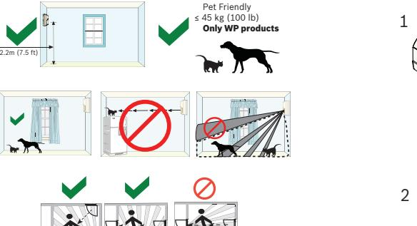

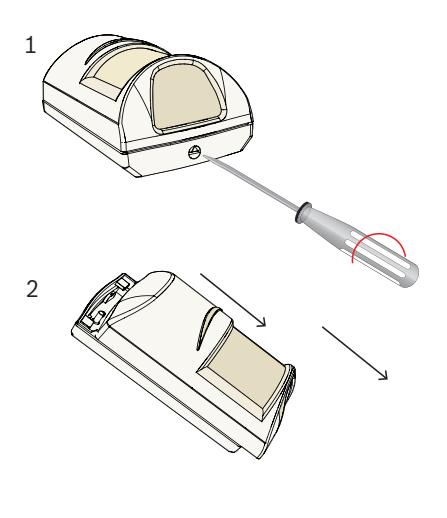

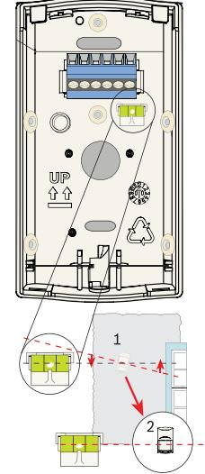

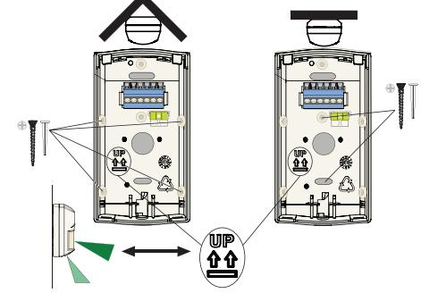

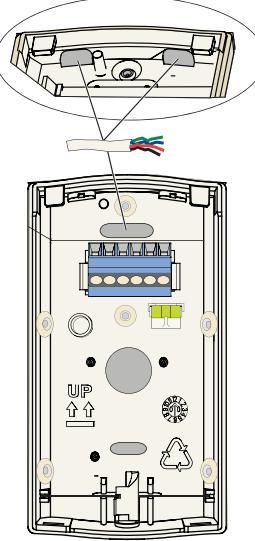

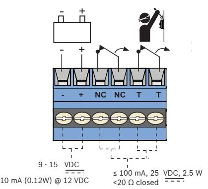

**5 | 6 | 7 | 8 |**

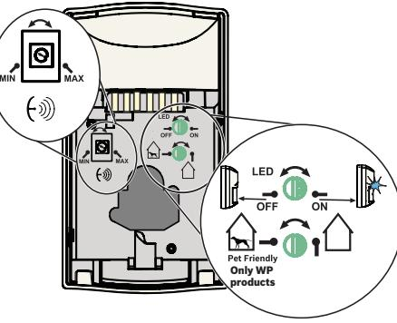

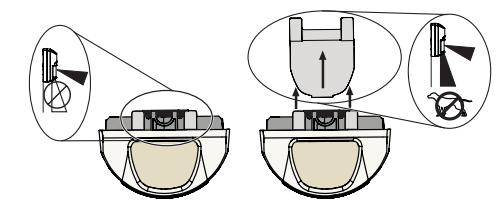

**Blue Line Gen2 TriTech Motion Detector** ISC‑BDL2‑W12G ISC‑BDL2‑W12GE ISC‑BDL2‑W12HE ISC‑BDL2‑WP12G ISC‑BDL2‑WP12GE ISC‑BDL2‑WP12HE ISC‑BDL2‑WP6G

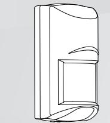

**en** Quick installation guide

| BE | HR                   | LL | IE | EL                            | MT |
|----|----------------------|----|----|-------------------------------|----|
| BG | IT                   | PT | LU | NL                            | NO |
| CY | IS                   | RO | SE | UK                            | SK |
| DE | LI                   | CH | AT | HU                            | EE |
| DK | LT                   | SI | CZ | ES                            | LV |
|    |                      |    |    |                               |    |
| FI | ISC-BDL2-WP12HE      |    |    | 10.570 to 10.610 GHz 20 mW |    |
| FR | ISC-BDL2-W12HE UK | CZ | EE | AT                            | SK |

# **12 | 13 | 14 |**

## **Manufacturing dates**

For product manufacturing dates, go to http://www.boschsecurity.com/datecodes/ and refer to the serial number located on the product label.

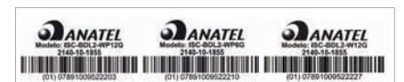

Este equipamento opera em caráter secundário, isto é, não tem direito à proteção contra interferência prejudicial, mesmo de estações do mesmo tipo e não pode causar interferência a sistemas operando em carácter primário.

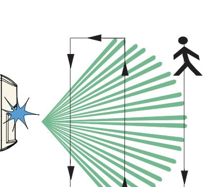

2 min

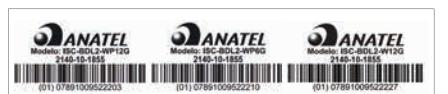

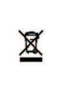

| em | with Nat            |
|----|---------------------|
|    | Part 1 of           |
|    | C22.1. A            |
|    | necessa             |
|    | G, GE m (-4°F to |

| UL/ C-UL | Perform Walk Test at least once a year. Use only a Listed limited-power source. Pet im munity not tested by UL / C-UL (ISC-BDL2- WP12G, ISC-BDL2-WP12GE, ISC-BDL2- WP12HE, ISC-BDL2-WP6G). E-Models not evaluated by UL / C-UL. The Lis ted control unit or Listed burglary power sup ply must provide 4 hours (40 mAh) Of standby power. Install the unit in accordance with National Electrical Code NFPA 70 and Part 1 of the Canadian Electrical code CSA C22.1. Adjust the microwave range control, if necessary, to achieve maximum range. |
|-------------|--------------------------------------------------------------------------------------------------------------------------------------------------------------------------------------------------------------------------------------------------------------------------------------------------------------------------------------------------------------------------------------------------------------------------------------------------------------------------------------------------------------------------------------------------------------------------------------|
|             | G, GE models: -20°C to +55°C (-4°F to +131°F) HE models: +5°C to +40°C (+41°F to 104°F) UL / C-UL Listed installations: 0°C to +49°C (+32°F to +120°F)                                                                                                                                                                                                                                                                                                                                                                                                                   |
|             | 0 - 95% Relative humidity (0 - 85% UL / C-UL installations)                                                                                                                                                                                                                                                                                                                                                                                                                                                                                                                       |

CE (CE 0700) For E-Models