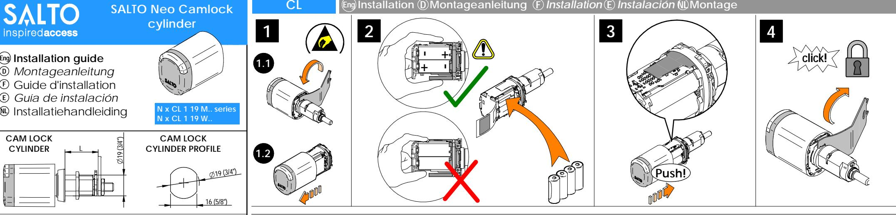
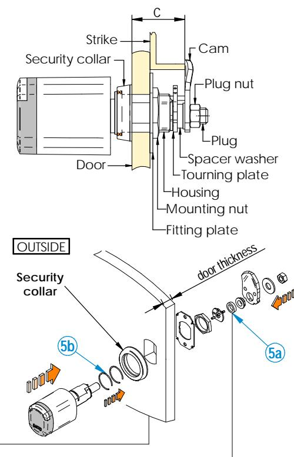
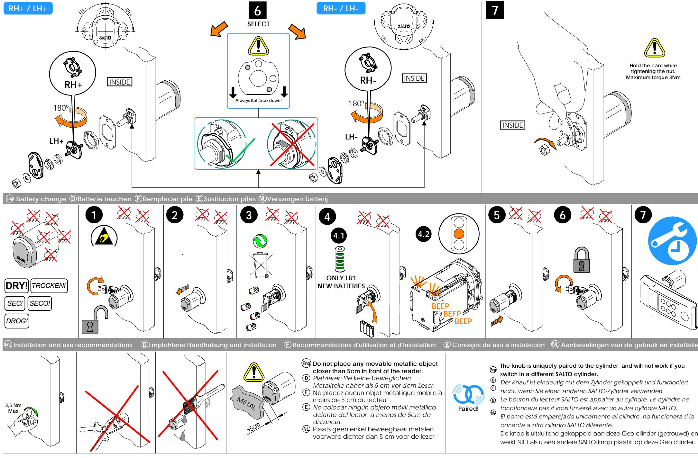

 **Measure c distance - Select cam type - select components 5a,5b Gemessene Entferung c - Auswahl des Hebels - Auswahi der Komponenten 5a, 5b Mesurer la distance c - Sélection cam - Sélectionner les composants 5a,5b Medir distancia c - Seleccionar lengüeta - Seleccionar componentes 5a, 5b Meet afstand c - Selecteer lip - Selecteer componenten 5a,5b Eng D F E NL**

| "c " i ke d is Do tr ta or -s nc e                                                                                           |                   |                                             |                   | and Cam Ty pe itio pos n | mb f Nu er o spa cer she wa rs | mb Nu er spa cer ring s |
|------------------------------------------------------------------------------------------------------------------------------------------------------------------|-------------------|---------------------------------------------|-------------------|--------------------------------------------|--------------------------------------------------------|-------------------------------------------|
| Nx CL 119 M.                                                                                                                                         |                   | Nx CL 119 W.                    |                   |                                            | 5a                                                     | 5b                                        |
| 22 23m to m                                                                                                                                             | 57/ " 64    | 29 30m to m                        | 5/ 32" 1 -  |                                            | -                                                      | 2                                         |
| 23 24m to m                                                                                                                                             | 59/ " 64    | 30 31m to m                        | 13/ 64" 1 - |                                            | -                                                      | 1                                         |
| 24 25m to m                                                                                                                                             | 31/ 32"        | 31 32m to m                        | 15/ 64" 1 - |                                            | -                                                      | -                                         |
| 25 26m to m                                                                                                                                             | 1"                | 32 33m to m                        | 9/ 32" 1 -  |                                            | 1                                                      | 2                                         |
| 26 to 27m m                                                                                                                                             | 3/ 64" 1 -  | 33 to 34m m                        | 5/ 16" 1 -  |                                            | 1                                                      | 1                                         |
| 27 28m to m                                                                                                                                             | 5/ 1 - 64"  | 34 35m to m                        | 23/ 1 - 64" | Cur ved ca m                      | 1                                                      | -                                         |
| 28 29m to m                                                                                                                                             | 1/ 8" 1 -   | 35 36m to m                        | 25/ 64" 1 - |                                            | -                                                      | 2                                         |
| 29 30m to m                                                                                                                                             | 5/ 32" 1 -  | 36 37m to m                        | 7/ 16" 1 -  |                                            | -                                                      | 1                                         |
| 30 31m to m                                                                                                                                             | 13/ 64" 1 - | 37 38m to m                        | 15/ 32" 1 - |                                            | -                                                      | -                                         |
| 31 32m to m                                                                                                                                             | 15/ 64" 1 - | 38 39m to m                        | 33/ 64" 1 - |                                            | 1                                                      | 2                                         |
| 32 33m to m                                                                                                                                             | 9/ 32" 1 -  | 39 40m to m                        | 19/ 32" 1 - |                                            | 1                                                      | 1                                         |
| 33 34m to m                                                                                                                                             | 5/ 16" 1 -  | 40 to 41m m                        | 5/ 16" 1 -  | Str aig ht c am                   | 1                                                      | -                                         |
| 34 35m to m                                                                                                                                             | 23/ 1 - 64" | 41 42m to m                        | 41/ 1 - 64" |                                            | -                                                      | 2                                         |
| 35 36m to m                                                                                                                                             | 25/ 1 - 64" | 42 43m to m                        | 43/ 1 - 64" |                                            | -                                                      | 1                                         |
| 36 37m to m                                                                                                                                             | 7/ 16" 1 -  | 43 44m to m                        | 23/ 32" 1 - |                                            | -                                                      | -                                         |
| 37 38m to m                                                                                                                                             | 15/ 32" 1 - | 44 45m to m                        | 3/ 4" 1 -   |                                            | 1                                                      | 2                                         |
| 38 39m to m                                                                                                                                             | 33/ 64" 1 - | 45 46m to m                        | 51/ 64" 1 - |                                            | 1                                                      | 1                                         |
| 39 40m to m                                                                                                                                             | 19/ 32" 1 - | 46 47m to m                        | 53/ 64" 1 - | ved Cur ca m                      | 1                                                      | -                                         |
| Doo r th ickn es Doo r th 15 ≤ t ≤ 1 ≤ 15 m t < m Nor lly w Nor lly m eta l ma ma do do ors |                   | ickn es 22 m m ood en ors |                   |                                            |                                                        |                                           |

All contents current at time of publication. SALTO Systems S.L. reserves the right to change availability of any item in this catalog, its design, construction, and/or materials. © 2020 SALTO Systems S.L.

**www.saltosystems.com/en/quick-links/manuals-and-guides/**

**Not included/***Nicht enthalten/*Non inclus/*No incluido*

**22**

**SALTO**

**G1824**

**a**

**INDOOR Use!**

**Recommended**

**Batteries SP01926-5**

**10**

**SP225542**

**i**

**G1824**

**b**

**OUTDOOR Use!**

**IP66**

Niet inbegrepen/*Non incluso/*Não incluso

225776-ED.- 23/06/2020

**F**

**E**

Danger for electronic

components

due to electrostatic

discharge.

**i**

