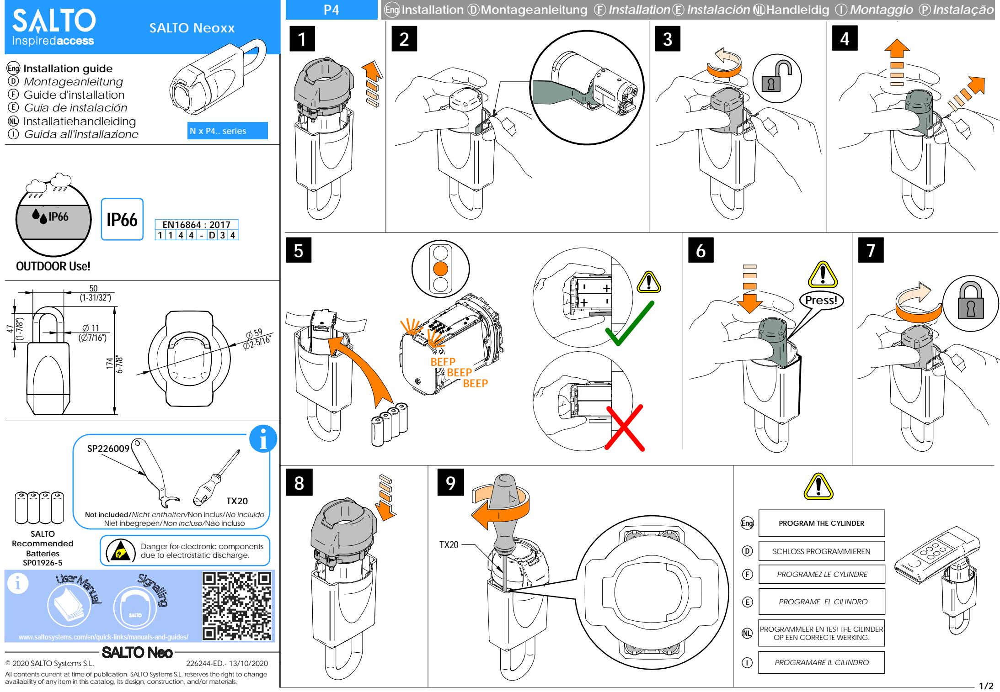
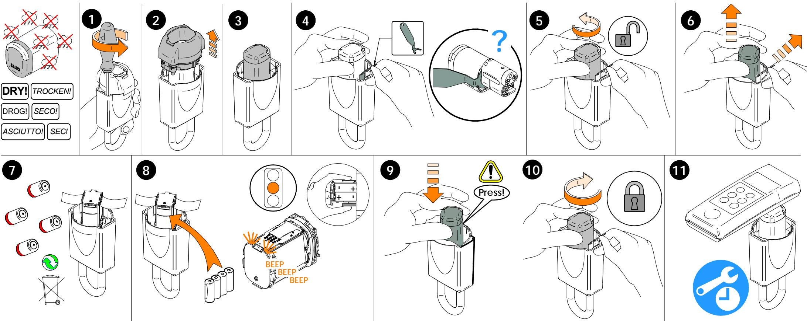
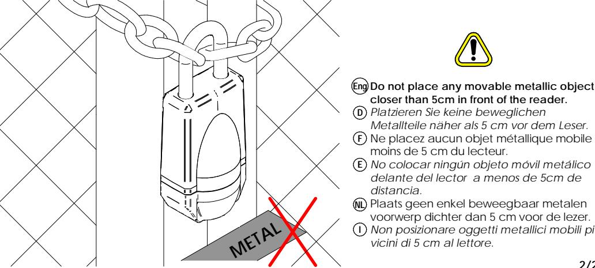

**E**

**NL**

 **Installation and use recommendations Empfohlene Handhabung und installation Recommandations d'utilisation et d'instalaltion Consejos de uso e instalación Installatie - en gebruiksinstructies Raccomandazioni d'uso ed d'utilizzo Instruções de uso e instalação Eng D F NLI E P**

- **Eng The knob is uniquely paired to this cylinder, and will not work if you switch it with a different SALTO cylinder. /** *El pomo está emparejado unicamente a este cilindro, no funcionará si lo conecta a otro cilindro SALTO diferente.* **/** *Der Knauf ist eindeutig mit dem Zylinder gekoppeltund funktioniert nicht, wenn Sie einen anderen zylinder. Le bouton du lecteur SALTO est appairé au cylindre. Le cylindre ne fonctionnera pas si vous l'inversé avec un autre bouton SALTO. /* De knop is is uniek gekoppeld aan de cilinder en zal niet werken als u de knop op een andere SALTO cilinder plaatst. / *Il pomolo è accoppiato univocamente con il corpo delcilindro, non funzionerá il dispositivo se si cambia con un altro pomolo.* **Paired! E D F NL I**
**The product should not be modified in any way except in accordance with those modifications described in the instructions. /** *El producto no debe ser modificado de ninguna manera, exceptuando las modificaciones descritas en las instrucciones. /* Das Produkt darf in keiner Weise verändert werden, außer in Übereinstimmung mit den in der Anleitung beschriebenen Weisen. / *Le produit ne peut être modifié de quelque manière que ce soit, sauf en respectant les modifications décrites dans les instructions. /* Het product mag op geen enkele wijze worden aangepast, behalve in overeenstemming met de in de handleiding beschreven wijzigingen. / *Il prodotto non deve essere modificato in nessun modo se non secondo le modifiche descritte nelle istruzioni.* **Eng E D F NL IT**

- *Platzieren Sie keine beweglichen*
- *Metallteile näher als 5 cm vor dem Leser.* Ne placez aucun objet métallique mobile à
- moins de 5 cm du lecteur. *No colocar ningún objeto móvil metálico*
- *delante del lector a menos de 5cm de*
- Plaats geen enkel beweegbaar metalen voorwerp dichter dan 5 cm voor de lezer. *Non posizionare oggetti metallici mobili più*