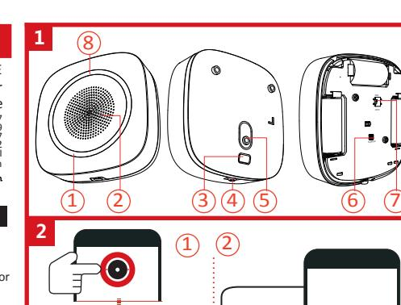
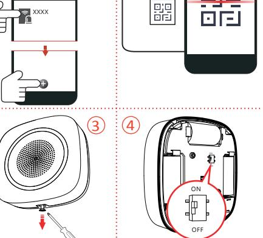
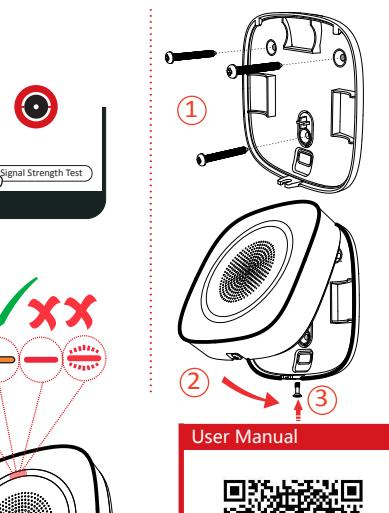
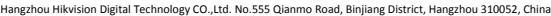

Wireless Internal Sounder DS-PS1-I-WE Quick Start Guide EN 50131-1:2006+A2:2017 EN 50131-4:2019 EN 50131-5-3:2017 Security Grade(SG)2 Environmental Class(EC) II Certified by Telefication

**3**

# English

**1** APPEARANCE

1. Strobe Light 2. Buzzer 3. Cable Hole 4. Set Screw 5. Tamper Screw Hole 6. Tamper Button 7. Power Switch 8. Indicator

#### **2** ENROLLMENT

INSTALLATION **3**

## Check signal strength.

User Manual

Scan the QR code for more information and operation help.

## Specification

|            | Frequency                       | 868 MHz                                                         |
|------------|---------------------------------|-----------------------------------------------------------------|
| RF         | Metod                           | Two-way communication                                           |
|            | Distance                        | 1.6 KM                                                          |
|            | Indicator                       | Red/Green/Amber                                                 |
| Indication | Strobe light                    | Red/Blue                                                        |
|            | Power                           | Battery (default power supply method)                           |
|            | Consumption                     | Quiescent Current: 40uA                                         |
|            |                                 | Max. 3 V/4A (alerts in volume level 3 )                         |
| Power      | Low Battery Cut Off 2.45 V      |                                                                 |
|            | Voltage Range                   | Fully charged (new) to 2.45V DC (battery)                       |
|            | Battery life span               | 3 CR123A, 3 years in work status (triggered every two weeks and |
|            |                                 | alerting 90 s for each triggering)                              |
|            | Power switch                    | Power switch                                                    |
| Interface  | Tamper switch                   | Front and rear tamper-proof                                     |
|            | Decibel                         | 90 to 110 db                                                    |
| Buzzer     | Max. sound duration 15min(900s) |                                                                 |
|            | Operation                       |                                                                 |
| General    | Temperature                     | -10 °C to40 °C (14 °F to104°F)                                  |
|            | Operation Humidity 10% to 90%   |                                                                 |
|            | Dimension(W × H ×               |                                                                 |
|            | D)                              | 88× 88 × 32mm(3.46" ×3.46" × 1.26")                             |
|            | Weight                          | 169.5g                                                          |
|            | Installation                    | Wall mounting                                                   |

## Français

**1** ASPECT

1. Éclairage stroboscopique 2. Avertisseur 3. Passage de câble 4. Vis de blocage 5. Trou de vis antisabotage 6. Bouton de sabotage 7. Commutateur d'alimentation 8. Indicateur

#### **2** ASSOCIATION

INSTALLATION **3**

Vérifier la puissance du signal.

### Manuel d'utilisation

Scannez le code QR pour obtenir plus d'informations ainsi qu'une aide concernant le fonctionnement de l'appareil.

## Spécification

|                      | Fréquence                                  | 868 MHz                                                                                                                       |
|----------------------|--------------------------------------------|-------------------------------------------------------------------------------------------------------------------------------|
| RF                   | Mode                                       | Communication bidirectionnelle                                                                                                |
|                      | Distance                                   | 1,6 km                                                                                                                        |
| Indication           | Indicateur                                 | Rouge/vert                                                                                                                    |
|                      | Éclairage stroboscopique                   | Rouge/bleu                                                                                                                    |
| Alimentation         | Alimentation                               | Batterie (mode d'alimentation électrique par défaut)                                                                          |
|                      | Consommation                               | Consommation statique : 30 à 40 µA                                                                                            |
|                      | Autonomie de la batterie                   | 3 piles CR123A, 3 ans en état de marche (déclenchement toutes les deux semaines et alarme de 90 s à chaque déclenchement). |
|                      | Interrupteur d'alimentation                | Interrupteur d'alimentation                                                                                                   |
| Interface            | Contact antisabotage                       | Sécurité antisabotage à l'avant et à l'arrière                                                                                |
| Avertisseur Décibels |                                            | 90 à 110 dB                                                                                                                   |
| Généralités          | Température de fonctionnement -10 à +55 °C |                                                                                                                               |
|                      | Humidité de fonctionnement 10 à 90 %       |                                                                                                                               |
|                      | Installation                               | Montage mural                                                                                                                 |

## **1** AUFBAU

1. Stroboskoplicht 2 Summer 3. Kabeldurchführung 4. Einstellschraube 5. Sabotageschraubenloch 6. Sabotagetaste 7. Ein-/Ausschalter 8. Statusanzeige

#### **2** REGISTRIERUNG

INSTALLATION **3**

Prüfen Sie die Signalstärke.

Benutzerhandbuch

### Scannen Sie den QR-Code für weitere Informationen und Bedienungshilfen.

|             | Technische Daten     |                                                                                                                 |
|-------------|----------------------|-----------------------------------------------------------------------------------------------------------------|
|             | Frequenz             | 868 MHz                                                                                                         |
| Funk        | Methode              | Gegensprechen                                                                                                   |
|             | Entfernung           | 1,6 KM                                                                                                          |
|             | Statusanzeige        | Rot/Grün                                                                                                        |
| Richtung    | Stroboskoplicht      | Rot/Blau                                                                                                        |
|             | Strom                | Batterie (Standardstromversorgung)                                                                              |
|             | Leistungsaufnahme    | Statische Leistungsaufnahme: 30 bis 40 uA                                                                       |
| Strom       | Akkulaufzeit         | 3 CR123A, 3 Jahre Betriebsbereitschaft (bei 1 Auslösung alle zwei Wochen und 90 s Alarm bei jeder Auslösung) |
|             | Ein-/Ausschalter     | Ein-/Ausschalter                                                                                                |
| Anschluss   | Sabotageschalter     | Vorder- und Rückseite sabotagesicher                                                                            |
| Summer      | Dezibel              | 90 bis 110 db                                                                                                   |
|             | Betriebstemperatur   | -10 °C bis +55 °C                                                                                               |
| Allgemeines | Betriebsfeuchtigkeit | 10 % bis 90 %                                                                                                   |
|             | Installation         | Wandmontage                                                                                                     |

## Italiano

## **1** ASPETTO

1. Luce stroboscopica 2. Cicalino 3. Foro per il cavo 4. Vite di regolazione 5. Foro vite antimanomissione 6. Pulsante antimanomissione 7. Interruttore di alimentazione 8. Indicatore

**2** REGISTRAZIONE

INSTALLAZIONE **3**

Controllo intensità del segnale.

## Manuale dell'utente Per ulteriori informazioni e assistenza sull'utilizzo, scansionare il codice QR.

## Specifiche

| RF                          | Frequenza                                                   | 868 MHz                                                                                                                   |
|-----------------------------|-------------------------------------------------------------|---------------------------------------------------------------------------------------------------------------------------|
|                             | Metodo                                                      | Comunicazione bidirezionale                                                                                               |
|                             | Distanza                                                    | 1,6 km                                                                                                                    |
| Indicazione                 | Indicatore                                                  | Rosso/verde                                                                                                               |
|                             | Luce stroboscopica                                          | Rosso/Blu                                                                                                                 |
| Alimentazione               | Alimentazione                                               | Batteria (metodo di alimentazione predefinito)                                                                            |
|                             | Consumo                                                     | Consumo in standby: 30 - 40 μA                                                                                            |
|                             | Durata delle batterie                                       | 3 CR123A, 3 anni in condizioni operative (attivazione ogni due settimane e allarme di 90 secondi per ogni attivazione) |
|                             | Interruttore di alimentazione Interruttore di alimentazione |                                                                                                                           |
| Interfaccia                 |                                                             | Interruttore antimanomissione Antimanomissione anteriore e posteriore                                                     |
| Cicalino                    | Decibel                                                     | 90 - 110 dB                                                                                                               |
| Caratteristiche generali | Temperatura operativa                                       | Da -10 °C a +55 °C                                                                                                        |
|                             | Umidità operativa                                           | Da 10% a 90%                                                                                                              |
|                             | Installazione                                               | Montaggio a parete                                                                                                        |

## Español

## **1** ASPECTO

1. Luz estroboscópica 2. Timbre 3. Perforación para el cable 4. Tornillo de fijación 5. Agujero para el tornillo de manipulación 6. Botón de manipulación 7. Interruptor de alimentación 8. Piloto

#### **2** REGISTRO

INSTALACIÓN **3**

## Comprobar la intensidad de la señal.

Manual de usuario

Escanee el código QR para obtener más información y ayuda sobre el funcionamiento.

### Especificación

| Radiofrecuencia | Frecuencia                                       | 868 MHz                                                                                                            |
|-----------------|--------------------------------------------------|--------------------------------------------------------------------------------------------------------------------|
|                 | Método                                           | Comunicación bidireccional                                                                                         |
|                 | Distancia                                        | 1,6 km                                                                                                             |
|                 | Piloto                                           | Rojo/verde                                                                                                         |
| Indicación      | Luz estroboscópica                               | Rojo/azul                                                                                                          |
|                 | Alimentación                                     | Batería (método de alimentación por defecto)                                                                       |
|                 | Consumo                                          | Consumo estático: 30-40 uA                                                                                         |
| Alimentación    | Duración de las pilas                            | 3 baterías CR123A, 3 años de funcionamiento (activación cada dos semanas y alertas de 90 s por cada activación) |
|                 | Interruptor de alimentación                      | Interruptor de alimentación                                                                                        |
| Interfaz        | Interruptor antimanipulación                     | Protectores contra manipulación frontal y trasero                                                                  |
| Timbre          | Decibelios                                       | 90 a 110 dB                                                                                                        |
| General         | Temperatura de funcionamiento De -10 °C a +55 °C |                                                                                                                    |
|                 | Humedad de funcionamiento                        | 10 % a 90 %                                                                                                        |
|                 | Instalación                                      | Montaje en la pared                                                                                                |

## Português

## **1** ASPETO

1. Luz estroboscópica 2. Campainha 3. Orifício do cabo 4. Parafuso de fixação 5. Orifício do parafuso de adulteração 6. Botão de adulteração 7. Interruptor Ligar/Desligar 8. Indicador

**2** REGISTO

INSTALAÇÃO **3**

Verifique a intensidade do sinal.

### Manual de utilizador

## Faça a leitura do código QR para obter mais informações e ajuda sobre o funcionamento.

|                   | Frequência                                   | 868 MHz                                                                                                                 |
|-------------------|----------------------------------------------|-------------------------------------------------------------------------------------------------------------------------|
| RF                | Método                                       | Comunicação bidirecional                                                                                                |
|                   | Distância                                    | 1,6 Km                                                                                                                  |
|                   | Indicador                                    | Vermelho/Verde                                                                                                          |
| Indicação         | Luz estroboscópica                           | Vermelha/Azul                                                                                                           |
|                   | Potência                                     | Bateria (método de alimentação predefinido)                                                                             |
|                   | Consumo                                      | Consumo estático: 30 a 40 uA                                                                                            |
| Potência          | Duração da bateria                           | 3 CR123A, 3 anos em estado de funcionamento (acionado de 2 em 2 semanas e 90 segundos de alerta em cada acionamento) |
|                   | Interruptor de alimentação                   | Interruptor de alimentação                                                                                              |
| Interface         | Interruptor de adulteração                   | À prova de adulteração na parte dianteira e traseira                                                                    |
| Campainha Decibel |                                              | 90 a 110 db                                                                                                             |
|                   | Temperatura de funcionamento -10 °C a +55 °C |                                                                                                                         |
| Geral             | Humidade de funcionamento 10% a 90%          |                                                                                                                         |
|                   | Instalação                                   | Montagem na parede                                                                                                      |

### Nederlands

### **1** VERSCHIJNINGSVORM

1. Stroboscooplamp 2 Zoemer 3. Kabelgat 4. Stelschroef 5. Verzegelingsschroefgat 6. Sabotageknop 7. Aan-/uitschakelaar 8 Pictogram

#### **2** INSCHRIJVING

INSTALLATIE **3**

### Controleer de signaalsterkte.

Gebruiksaanwijzing

Scan de QR-code voor meer informatie en assistentie bij de bediening.

### Specificatie

| RF        | Frequentie                                   | 868 MHz                                             |
|-----------|----------------------------------------------|-----------------------------------------------------|
|           | Methode                                      | Bi-directionele communicatie                        |
|           | Afstand                                      | 1,6 KM                                              |
| Indicatie | Pictogram                                    | Rood/groen                                          |
|           | Stroboscooplamp                              | Rood/blauw                                          |
| Aan/uit   | Aan/uit                                      | Batterij (standaard stroomvoorzieningsmethode)      |
|           | Verbruik                                     | Statisch verbruik: 30 tot 40 uA                     |
|           | Levensduur batterij                          | 3 CR123A, 3 jaar werkstatus (wordt om de twee weken |
|           |                                              | geactiveerd en waarschuwt 90s voor elke activering) |
| Interface | Aan-/uitschakelaar                           | Aan-/uitschakelaar                                  |
|           | Sabotageschakelaar                           | Voor- en achterkant sabotagebestendig               |
| Zoemer    | Decibel                                      | 90 tot 110 db                                       |
| Algemeen  | Bedrijfstemperatuur                          | -10°C tot +55°C                                     |
|           | Luchtvochtigheid tijdens bedrijf 10% tot 90% |                                                     |
|           | Installatie                                  | Wandmontage                                         |

### Polski

### **1** ELEMENTY URZĄDZENIA

1. Stroboskop 2. Brzęczyk 3. Otwór na przewód 4. Śruba ustalająca 5. Otwór na śrubę zabezpieczenia antysabotażowego 6. Przycisk zabezpieczenia antysabotażowego 7. Przełącznik zasilania 8. Wskaźnik

#### **2** REJESTRACJA

INSTALACJA **3**

### Sprawdzanie siły sygnału

## Podręcznik użytkownika

Zeskanuj kod QR, aby uzyskać więcej informacji i opisów procedur.

## Specyfikacje

|               | Częstotliwość                                  | 868 MHz                                                                                                                  |
|---------------|------------------------------------------------|--------------------------------------------------------------------------------------------------------------------------|
| Moduł radiowy | Tryb                                           | Komunikacja dwukierunkowa                                                                                                |
|               | Odległość                                      | 1,6 km                                                                                                                   |
| Sygnalizacja  | Wskaźnik                                       | Czerwony/zielony                                                                                                         |
|               | Stroboskop                                     | Czerwony/niebieski                                                                                                       |
|               | Zasilanie                                      | Bateria (domyślne źródło zasilania)                                                                                      |
|               | Zasilanie                                      | Pobór prądu: 30–40 μA                                                                                                    |
| Zasilanie     | Wydajność baterii                              | Trzy baterie CR123A zapewniające zasilanie przez trzy lata (wyzwalanie co dwa tygodnie z alarmem trwającym 90 sekund) |
|               | Przełącznik zasilania                          | Przełącznik zasilania                                                                                                    |
| Interfejs     | Przełącznik zabezpieczenia antysabotażowego | Zabezpieczenie antysabotażowe przednie i tylne                                                                           |
| Brzęczyk      | Głośność                                       | 90–110 dB                                                                                                                |
|               | Temperatura (użytkowanie)                      | Od –10°C do +55°C                                                                                                        |
| Ogólne        | Wilgotność (użytkowanie)                       | Od 10% do 90%                                                                                                            |
|               |                                                |                                                                                                                          |

## Türkçe

**1** GÖRÜNÜM

1. Flaş Işığı 2. Sesli Sinyal 3. Kablo Deliği 4. Ayar Vidası 5. Kurcalama Vidası Deliği 6. Kurcalama Düğmesi 7. Güç Düğmesi 8. Gösterge

Instalacja Montaż ścienny

### **2** KAYIT

MONTAJ **3**

Sinyal gücünü kontrol edin.

Kullanım Kılavuzu

Daha fazla bilgi ve çalıştırma hakkında yardım almak için QR kodunu tarayın.

### Özellikler

| RF                   | Frekans            | 868 MHz                                                                                                         |
|----------------------|--------------------|-----------------------------------------------------------------------------------------------------------------|
|                      | Yöntem             | İki yönlü iletişim                                                                                              |
|                      | Mesafe             | 1,6 KM                                                                                                          |
|                      | Gösterge           | Kırmızı/Yeşil                                                                                                   |
| Gösterge             | Flaş ışığı         | Kırmızı/Mavi                                                                                                    |
|                      | Güç                | Pil (varsayılan güç besleme yöntemi)                                                                            |
| Güç                  | Tüketim            | Statik tüketim: 30 ila 40uA                                                                                     |
|                      | Pil kullanım ömrü  | 3 CR123A, çalışma durumunda 3 yıl (her iki haftada bir tetiklenir ve her tetikleme için 90 sn uyarı verilir) |
| Arayüz               | Güç düğmesi        | Güç düğmesi                                                                                                     |
|                      | Kurcalama anahtarı | Ön ve arka kurcalamaya dayanıklı                                                                                |
| Sesli Sinyal Desibel |                    | 90 ila 110 db                                                                                                   |
| Genel                | Çalışma Sıcaklığı  | -10 °C ila +55 °C                                                                                               |
|                      | Çalışma Nemi       | %10 ila %90                                                                                                     |
|                      | Montaj             | Duvara montaj                                                                                                   |

## Čeština

**1** VZHLED

1. Zábleskové svítidlo 2. Bzučák 3. Otvor pro kabel 4. Nastavovací šroub 5. Otvor na šroubu proti neoprávněné manipulaci 6. Tlačítko neoprávněné manipulace 7. Vypínač 8. Indikátor

**2** REGISTRACE

MONTÁŽ **3**

Zkontrolujte sílu signálu.

Návod k obsluze

Další informace a nápovědu k ovládání získáte naskenováním kódu QR.

### Specifikace

| VF               | Frekvence           | 868 MHz                                                                                                                |
|------------------|---------------------|------------------------------------------------------------------------------------------------------------------------|
|                  | Metoda              | Obousměrná komunikace                                                                                                  |
|                  | Vzdálenost          | 1,6 km                                                                                                                 |
| Indikace         | Indikátor           | Červený/zelený                                                                                                         |
|                  | Zábleskové svítidlo | Červené/modré                                                                                                          |
| Napájení         | Napájení            | Baterie (výchozí způsob napájení)                                                                                      |
|                  | Spotřeba            | Statická spotřeba: 30 až 40 uA                                                                                         |
|                  | Životnost baterie   | 3 CR123A, 3 roky v provozním stavu (spouští se každé dva týdny a při každém spuštění zazní upozornění po dobu 90 s) |
|                  | Vypínač             | Vypínač                                                                                                                |
| Konektory        |                     | Spínač neoprávněné manipulace Ochrana před neoprávněnou manipulací vepředu i vzadu                                     |
| Bzučák           | Decibely            | 90 až 110 db                                                                                                           |
| Obecné parametry | Provozní teplota    | −10 až +55 °C                                                                                                          |
|                  | Provozní vlhkost    | 10 až 90 %                                                                                                             |
|                  | Montáž              | Montáž na zeď                                                                                                          |

## Română

### **1** ASPECT

1. Lumină stroboscopică 2. Sonerie 3. Orificiu cablu 4. Set șurub 5. Orificiu șurub alterare 6. Buton alterare 7. Comutator alimentare 8. Indicator

#### **2** ÎNSCRIERE

INSTALARE **3**

Verificați intensitatea semnalului.

Manual de utilizare

Scanați codul QR pentru mai multe informații și ajutor de operare.

### Specificații

| FR           | Frecvența                  | 868 MHz                                                                                                                                                       |
|--------------|----------------------------|---------------------------------------------------------------------------------------------------------------------------------------------------------------|
|              | Metoda                     | Comunicație în două sensuri                                                                                                                                   |
|              | Distanţă                   | 1,6 KM                                                                                                                                                        |
| Indicație    | Indicator                  | Roșu/Verde                                                                                                                                                    |
|              | Lumină stroboscopică       | Roșu/Albastru                                                                                                                                                 |
| Putere       | Putere                     | Baterie (metoda implicită de alimentare)                                                                                                                      |
|              | Consum                     | Consum static de la 30 până la 40uA                                                                                                                           |
|              |                            | Durata de funcționare a bateriei 3 CR123A, 3 ani în stare de funcționare (declanșate la fiecare două săptămâni și alertare 90 s pentru fiecare declanșare) |
| Interfaţă    | Comutator alimentare       | Comutator alimentare                                                                                                                                          |
|              | Comutator alterare         | Alarmă securizată frontală și dorsală                                                                                                                         |
| Sonerie      | Decibel                    | de la 90 până la110 db                                                                                                                                        |
| Generalități | Temperatura de funcționare | De la -10°C până la +55°C                                                                                                                                     |
|              | Umiditatea de funcționare  | De la 10% până la 90%                                                                                                                                         |
|              | Instalarea                 | Montare pe perete                                                                                                                                             |

### Dansk

## **1** UDSEENDE

1. Stroboskoplys 2. Brummer 3. Hul til ledning 4. Stilleskrue 5. Hul til manipulationssikret skrue 6. Manipulationsknap 7. Strømafbryder 8. Kontrollampe

**2** REGISTRERING

INSTALLATION **3**

Kontrollér signalstyrke.

Brugervejledning

Scan QR-koden for at få flere oplysninger og hjælp til betjening.

### Specifikation

| RF              | Frekvens             | 868 MHz                                                                                                         |
|-----------------|----------------------|-----------------------------------------------------------------------------------------------------------------|
|                 | Metode               | Tovejskommunikation                                                                                             |
|                 | Afstand              | 1,6 km                                                                                                          |
| Betydning       | Kontrollampe         | Rød/grøn                                                                                                        |
|                 | Stroboskoplys        | Rød/blå                                                                                                         |
| Strøm           | Strøm                | Batteri (standard strømforsyningsmetode)                                                                        |
|                 | Forbrug              | Statisk forbrug: 30-40 uA                                                                                       |
|                 | Batterilevetid       | 3 CR123A, tre års holdbarhed i driftsstatus (udløst hver anden uge og 90 sekunders alarm for hver udløsning) |
| Grænseflade     | Tænd/sluk-kontakt    | Tænd/sluk-kontakt                                                                                               |
|                 | Manipulationskontakt | Manipulationssikret forside og bagside                                                                          |
| Brummer Decibel |                      | 90-110 dB                                                                                                       |
| Generelt        | Driftstemperatur     | -10 °C til +55 °C                                                                                               |
|                 | Driftsfugtighed      | 10-90 %                                                                                                         |
|                 | Installation         | Montering på væg                                                                                                |

## Русский

### **1** ВНЕШНИЙ ВИД

1. Стробоскоп 2. Зуммер 3. Кабельный ввод 4. Зажимной винт 5. Отверстие для винта защиты от взлома 6. Кнопка датчика взлома 7. Выключатель питания 8. Индикатор

**2** РЕГИСТРАЦИЯ

УСТАНОВКА **3**

### Проверка уровня сигнала.

Руководство пользователя

Отсканируйте QR-код для получения справочной информации по эксплуатации и других дополнительных сведений.

### Технические данные

| Радиоканал              | Частота                           | 868 МГц                                                                                                                         |  |  |  |  |
|-------------------------|-----------------------------------|---------------------------------------------------------------------------------------------------------------------------------|--|--|--|--|
|                         | Метод                             | Двусторонняя связь                                                                                                              |  |  |  |  |
|                         | Дальность действия                | 1,6 км                                                                                                                          |  |  |  |  |
| Индикация               | Индикатор                         | Красный/зеленый                                                                                                                 |  |  |  |  |
|                         | Стробоскоп                        | Красный/синий                                                                                                                   |  |  |  |  |
|                         | Питание                           | Батарея (метод электропитания по умолчанию)                                                                                     |  |  |  |  |
|                         | Потребляемый ток                  | Потребление в статическом режиме: 30–40 мкА                                                                                     |  |  |  |  |
| Питание                 | Срок службы батарей               | 3 CR123A, 3 года в рабочем режиме (срабатывает каждые две недели с оповещением в течение 90 сек. при каждом срабатывании) |  |  |  |  |
| Разъемы                 | Выключатель питания               | Выключатель питания                                                                                                             |  |  |  |  |
|                         | Реле защиты от вскрытия           | Передняя и задняя панели защищены от взлома                                                                                     |  |  |  |  |
| Зуммер                  | Сила звука                        | 90–110 дБ                                                                                                                       |  |  |  |  |
| Общие характеристики | Рабочая температура               | от -10°C до +55°C                                                                                                               |  |  |  |  |
|                         | Влажность в рабочем режиме 10–90% |                                                                                                                                 |  |  |  |  |
|                         | Установка                         | Настенное крепление                                                                                                             |  |  |  |  |

## Magyar

## **1** KINÉZET

1. Villanófény 2. Hangjelző 3. Kábelnyílás 4. Állítócsavar 5. Biztonsági csavar nyílása 6. Szabotázsgomb 7. Tápkapcsoló 8. Jelző

#### **2** REGISZTRÁLÁS

TELEPÍTÉS **3**

## Ellenőrizze a jelerősséget.

Felhasználói kézikönyv

Szkennelje be a QR-kódot további információkért és üzemeltetési segítségért.

### Specifikáció

| RF                  | Frekvencia         | 868 MHz                                                                           |  |  |  |
|---------------------|--------------------|-----------------------------------------------------------------------------------|--|--|--|
|                     | Mód                | Kétirányú kommunikáció                                                            |  |  |  |
|                     | Távolság           | 1,6 km                                                                            |  |  |  |
| Jelzés              | Jelző              | Piros/zöld                                                                        |  |  |  |
|                     | Villanófény        | Piros/kék                                                                         |  |  |  |
| Tápellátás          | Tápellátás         | Elem (alapértelmezett tápellátási mód)                                            |  |  |  |
|                     | Fogyasztás         | Statikus fogyasztás: 30-40 uA                                                     |  |  |  |
|                     | Elem élettartama   | 3 CR123A, 3 év üzemelés (kéthetente működtetve, riasztásonként 90 másodpercig) |  |  |  |
|                     | Tápkapcsoló        | Tápkapcsoló                                                                       |  |  |  |
| Csatlakozó          | Szabotázskapcsoló  | Első és hátsó, szabotázsbiztos                                                    |  |  |  |
| Hangjelző Decibel   |                    | 90 – 110 dB                                                                       |  |  |  |
| Általános adatok | Üzemi hőmérséklet  | -10 °C – +55 °C                                                                   |  |  |  |
|                     | Üzemi páratartalom | 10% – 90%                                                                         |  |  |  |
|                     | Telepítés          | Falra szerelés                                                                    |  |  |  |

## Slovenčina

### **1** VZHĽAD

1. Výstražné svetlo 2. Bzučiak 3. Otvor na kábel 4. Nastavovacia skrutka 5. Otvor na skrutku odolnú voči cudziemu zásahu 6. Tlačidlo ochrany pred cudzím zásahom 7. Vypínač 8. Indikátor

**2** REGISTRÁCIA

INŠTALÁCIA **3**

Skontrolujte intenzitu signálu.

Používateľská príručka

Naskenujte kód QR a získate ďalšie informácie a pomoc pri používaní.

|  | Špecifikácia |  |  |
|--|--------------|--|--|
|  |              |  |  |

|                                                      | Frekvencia          | 868 MHz                                                                                                     |  |  |  |  |
|------------------------------------------------------|---------------------|-------------------------------------------------------------------------------------------------------------|--|--|--|--|
| RF                                                   | Metóda              | Obojsmerná komunikácia                                                                                      |  |  |  |  |
|                                                      | Vzdialenosť         | 1,6 km                                                                                                      |  |  |  |  |
| Indikácia                                            | Indikátor           | Červená/zelená                                                                                              |  |  |  |  |
|                                                      | Výstražné svetlo    | Červená/modrá                                                                                               |  |  |  |  |
| Napájanie                                            | Napájanie           | Batéria (predvolený zdroj napájania)                                                                        |  |  |  |  |
|                                                      | Spotreba            | Spotreba v statickom stave: 30 až 40 uA                                                                     |  |  |  |  |
|                                                      | Životnosť batérie   | 3 CR123A, 3 roky v prevádzke (spustenie každé dva týždne a upozornenie po dobu 90 s pri každom spustení) |  |  |  |  |
|                                                      | Vypínač             | Vypínač                                                                                                     |  |  |  |  |
| Prepínač ochrany pred Rozhranie cudzím zásahom |                     | Predná a zadná časť chránená pred cudzím zásahom                                                            |  |  |  |  |
| Bzučiak                                              | Decibel             | 90 až 110 dB                                                                                                |  |  |  |  |
|                                                      | Prevádzková teplota | -10 °C až +55 °C                                                                                            |  |  |  |  |
| Všeobecné                                            | Prevádzková vlhkosť | 10 % až 90 %                                                                                                |  |  |  |  |
|                                                      | Montáž              | Montáž na stenu                                                                                             |  |  |  |  |

About this Manual The Manual includes instructions for using and managing the Product. Pictures, charts, images and all other information hereinafter are for description and explanation only. The information contained in the Manual is subject to change, without notice, due to firmware updates or other reasons. Please find the latest version of this

Manual at the Hikvision website (https://www.hikvision.com/). Please use this Manual with the guidance and assistance of professionals trained in supporting the Product. and other Hikvision's trademarks and logos are the properties of Hikvision in various jurisdictions. Other trademarks and logos mentioned are the

properties of their respective owners. Disclaimer TO THE MAXIMUM EXTENT PERMITTED BY APPLICABLE LAW, THIS MANUAL AND THE PRODUCT DESCRIBED, WITH ITS HARDWARE, SOFTWARE AND FIRMWARE, ARE PROVIDED "AS IS" AND "WITH ALL FAULTS AND ERRORS". HIKVISION MAKES NO WARRANTIES, EXPRESS OR IMPLIED, INCLUDING WITHOUT LIMITATION, MERCHANTABILITY, SATISFACTORY QUALITY, OR FITNESS FOR A PARTICULAR PURPOSE. THE USE OF THE PRODUCT BY YOU IS AT YOUR OWN RISK. IN NO EVENT WILL HIKVISION BE LIABLE TO YOU FOR ANY SPECIAL, CONSEQUENTIAL, INCIDENTAL, OR INDIRECT DAMAGES, INCLUDING, AMONG OTHERS, DAMAGES FOR LOSS OF BUSINESS PROFITS, BUSINESS INTERRUPTION, OR LOSS OF DATA, CORRUPTION OF SYSTEMS, OR LOSS OF DOCUMENTATION, WHETHER BASED ON BREACH OF CONTRACT, TORT (INCLUDING NEGLIGENCE), PRODUCT LIABILITY, OR OTHERWISE, IN CONNECTION WITH THE USE OF THE PRODUCT, EVEN IF HIKVISION HAS BEEN

ADVISED OF THE POSSIBILITY OF SUCH DAMAGES OR LOSS. YOU ACKNOWLEDGE THAT THE NATURE OF INTERNET PROVIDES FOR INHERENT SECURITY RISKS, AND HIKVISION SHALL NOT TAKE ANY RESPONSIBILITIES FOR ABNORMAL OPERATION, PRIVACY LEAKAGE OR OTHER DAMAGES RESULTING FROM CYBER-ATTACK, HACKER ATTACK, VIRUS INSPECTION, OR OTHER INTERNET SECURITY RISKS; HOWEVER, HIKVISION WILL PROVIDE TIMELY TECHNICAL SUPPORT IF REQUIRED. YOU AGREE TO USE THIS PRODUCT IN COMPLIANCE WITH ALL APPLICABLE LAWS, AND YOU ARE SOLELY RESPONSIBLE FOR ENSURING THAT YOUR USE CONFORMS TO THE APPLICABLE LAW. ESPECIALLY, YOU ARE RESPONSIBLE, FOR USING THIS PRODUCT IN A MANNER THAT DOES NOT INFRINGE ON THE RIGHTS OF THIRD PARTIES, INCLUDING WITHOUT LIMITATION, RIGHTS OF PUBLICITY, INTELLECTUAL PROPERTY RIGHTS, OR DATA PROTECTION AND OTHER PRIVACY RIGHTS. YOU SHALL NOT USE THIS PRODUCT FOR ANY PROHIBITED END-USES, INCLUDING THE DEVELOPMENT OR PRODUCTION OF WEAPONS OF MASS DESTRUCTION, THE DEVELOPMENT OR PRODUCTION OF CHEMICAL OR BIOLOGICAL WEAPONS, ANY ACTIVITIES IN THE CONTEXT RELATED TO ANY NUCLEAR EXPLOSIVE OR UNSAFE NUCLEAR FUEL-CYCLE, OR IN SUPPORT OF HUMAN RIGHTS ABUSES.

IN THE EVENT OF ANY CONFLICTS BETWEEN THIS MANUAL AND THE APPLICABLE LAW, THE LATER PREVAILS.

This product and - if applicable - the supplied accessories too are marked with "CE" and comply therefore with the applicable harmonized European standards listed under the RE Directive 2014/53/EU, the EMC Directive 2014/30/EU, the RoHS Directive 2011/65/EU.

2012/19/EU (WEEE directive): Products marked with this symbol cannot be disposed of as unsorted municipal waste in the European Union. For proper recycling, return this product to your local supplier upon the purchase of equivalent new equipment, or dispose of it at designated collection points. For more information see: www.recyclethis.info

2006/66/EC (battery directive): This product contains a battery that cannot be disposed of as unsorted municipal waste in the European Union. See the product documentation for specific battery information. The battery is marked with this symbol, which may include lettering to indicate cadmium (Cd), lead (Pb), or mercury (Hg). For proper recycling, return the battery to your supplier or to a designated collection point. For more information see:www.recyclethis.info

replacement of a battery with an incorrect type that can defeat a safeguard (for example, in the case of some lithium battery types); BATTERY CAUTION

– disposal of a battery into fire or a hot oven, or mechanically crushing or cutting of a battery, that can result in an explosion; – leaving a battery in an extremely high temperature surrounding environment that can result in an explosion or the leakage of flammable liquid or gas; and – a battery subjected to extremely low air pressure that may result in an explosion or the leakage of flammable liquid or gas

Chemical burning danger Do not swallow the battery.

Keep new and used batteries away from the children. If you think batteries might have been swallowed or placed inside any part of the body, seek immediate medical attention.

Risk of explosion if batteri is replaced by an incorrect type.

Replacement of a battery with an incorrect type that can defeat a safeguard. Dispose of used batteries according to the instructions and local regulation.

If the battery compartment does not close securetyly, stop using the product and keep it away from children. Install the battries acoording to the polarity mark on the battery holder. The opposite polarity may cause device damage.

### INSTALLATION CAUTION

The additional force shall be equal to three times the weight of the equipment but not less than 50N. The equipment and its associated mounting means shall remain secure during the installation. After the installation, the equipment, including any associated mounting plate, shall not be damaged. Install the device on the place with nonflammable surface, such as concrete wall.

© 2020 Hangzhou Hikvision Digital Technology Co., Ltd. Todos los derechos reservados.

Sobre este manual Este manual incluye las instrucciones de utilización y gestión del producto. Las figuras, gráficos, imágenes y cualquier otra información que encontrará en lo sucesivo tienen únicamente fines descriptivos y aclaratorios. La información incluida en el manual está sujeta a cambios, sin aviso previo, debido a las actualizaciones de software u otros motivos. Visite el sitio web de Hikvision —https://www.hikvision.com/— para acceder a la última versión de este manual.

Utilice este manual con la guía y asistencia de profesionales capacitados en el soporte del producto. y otras marcas comerciales y logotipos de Hikvision son propiedad de Hikvision en diferentes jurisdicciones. Las demás marcas comerciales y logotipos mencionados son propiedad de sus respectivos dueños.

Descargo de responsabilidad EN LA MEDIDA MÁXIMA PERMITIDA POR LAS LEYES APLICABLES, ESTE MANUAL Y EL PRODUCTO DESCRITO —INCLUIDOS SU HARDWARE, SOFTWARE Y FIRMWARE— SE SUMINISTRAN «TAL CUAL» Y «CON TODOS SU FALLOS Y ERRORES». HIKVISION NO OFRECE GARANTÍAS, EXPLÍCITAS O IMPLÍCITAS, INCLUIDAS, A MODO ENUNCIATIVO, COMERCIABILIDAD, CALIDAD SATISFACTORIA O IDONEIDAD PARA UN PROPÓSITO EN PARTICULAR. EL USO QUE HAGA DEL PRODUCTO CORRE BAJO SU ÚNICO RIESGO. EN NINGÚN CASO, HIKVISION PODRÁ CONSIDERARSE RESPONSABLE ANTE USTED DE NINGÚN DAÑO ESPECIAL, CONSECUENTE, INCIDENTAL O INDIRECTO, INCLUYENDO, ENTRE OTROS, DAÑOS POR PÉRDIDAS DE BENEFICIOS COMERCIALES, INTERRUPCIÓN DE LA ACTIVIDAD COMERCIAL, PÉRDIDA DE DATOS, CORRUPCIÓN DE LOS SISTEMAS O PÉRDIDA DE DOCUMENTACIÓN, YA SEA POR INCUMPLIMIENTO DEL CONTRATO, AGRAVIO (INCLUYENDO NEGLIGENCIA), RESPONSABILIDAD DEL PRODUCTO O EN RELACIÓN CON EL USO DEL PRODUCTO, INCLUSO CUANDO HIKVISION HAYA RECIBIDO UNA NOTIFICACIÓN DE LA POSIBILIDAD DE DICHOS DAÑOS O PÉRDIDAS. USTED RECONOCE QUE LA NATURALEZA DE INTERNET IMPLICA RIESGOS DE SEGURIDAD INHERENTES Y HIKVISION NO TENDRÁ NINGUNA RESPONSABILIDAD POR EL FUNCIONAMIENTO ANORMAL, FILTRACIONES DE PRIVACIDAD U OTROS DAÑOS RESULTANTES DE ATAQUES CIBERNÉTICOS, ATAQUES DE HACKERS, INFECCIONES DE VIRUS U OTROS RIESGOS DE SEGURIDAD DE INTERNET; SIN EMBARGO, HIKVISION PROPORCIONARÁ APOYO TÉCNICO OPORTUNO DE SER NECESARIO. USTED ACEPTA USAR ESTE PRODUCTO DE CONFORMIDAD CON TODAS LAS LEYES APLICABLES Y SOLO USTED ES EL ÚNICO RESPONSABLE DE ASEGURAR QUE EL USO

CUMPLA CON DICHAS LEYES. EN ESPECIAL, USTED ES RESPONSABLE DE USAR ESTE PRODUCTO DE FORMA QUE NO INFRINJA LOS DERECHOS DE TERCEROS, INCLUYENDO, DE MANERA ENUNCIATIVA MAS NO LIMITATIVA, DERECHOS DE PUBLICIDAD, DERECHOS DE PROPIEDAD INTELECTUAL, DERECHOS RELATIVOS A LA PROTECCIÓN DE DATOS Y OTROS DERECHOS RELATIVOS A LA PRIVACIDAD. NO UTILIZARÁ ESTE PRODUCTO PARA NINGÚN USO FINAL PROHIBIDO, INCLUYENDO EL DESARROLLO O LA PRODUCCIÓN DE ARMAS DE DESTRUCCIÓN MASIVA, EL DESARROLLO O PRODUCCIÓN DE ARMAS QUÍMICAS O BIOLÓGICAS, NINGUNA ACTIVIDAD EN EL CONTEXTO RELACIONADO CON ALGÚN EXPLOSIVO NUCLEAR O EL CICLO DE COMBUSTIBLE NUCLEAR INSEGURO O EN APOYO DE ABUSOS DE LOS DERECHOS HUMANOS. EN CASO DE HABER CONFLICTO ENTRE ESTE MANUAL Y LA LEGISLACIÓN VIGENTE, ESTA ÚLTIMA PREVALECERÁ.

- Este producto, y en su caso también los accesorios suministrados, tienen la marca "CE" y por tanto cumplen con las normas europeas armonizadas aplicables
- enumeradas en la Directiva de equipos de radio 2014/53/UE, la Directiva de compatibilidad electromagnética 2014/30/UE y la Directiva de restricción del uso de sustancias peligrosas 2011/65/UE. 2012/19/UE (directiva RAEE, residuos de aparatos eléctricos y electromagnéticos): En la Unión Europea, los productos marcados con este símbolo no pueden ser
- desechados en el sistema de basura municipal sin recogida selectiva. Para un reciclaje adecuado, entregue este producto en el lugar de compra del equipo nuevo equivalente o deshágase de él en el punto de recogida designado a tal efecto. Para ver más información, visite: www.recyclethis.info 2006/66/CE (directiva sobre baterías): Este producto lleva una batería que no puede ser desechada en el sistema municipal de basuras sin recogida selectiva

dentro de la Unión Europea. Consulte la documentación del producto para ver la información específica de la batería. La batería lleva marcado este símbolo, que incluye unas letras indicando si contiene cadmio (Cd), plomo (Pb), o mercurio (Hg). Para un reciclaje adecuado, entregue la batería a su vendedor o llévela al punto de recogida de basuras designado a tal efecto. Para más información visite: www.recyclethis.info.

Reemplazar una batería por un tipo de batería incorrecto puede dar lugar a la anulación de una garantía (por ejemplo, en el caso de algunos tipos de batería de litio). PRECAUCIONES RELATIVAS A LA BATERÍA

- La eliminación de una batería en fuego o en un horno a alta temperatura, o mecánicamente, aplastándola o cortándola, puede dar lugar a una explosión. - Dejar una batería en un entorno circundante con una temperatura extremadamente alta puede dar lugar a una explosión o a la fuga de líquido o gas inflamable. - Una batería sometida a una presión de aire extremadamente baja puede dar lugar a una explosión o a la fuga de líquido o gas inflamable.

#### Peligro de quemaduras químicas No se debe ingerir la batería.

Mantenga las baterías nuevas y usadas fuera del alcance de los niños. Si sospecha que una batería ha sido tragada o introducida en alguna parte del cuerpo, busque atención médica de inmediato.

Existe el riesgo de explosión si se reemplaza la batería por un tipo de batería incorrecto.

El reemplazo de una batería por un tipo de batería incorrecto puede ser motivo de anulación de la garantía. Elimine las baterías usadas de conformidad con las instrucciones y las normativas de su localidad.

Instale el dispositivo en una superficie no inflamable, por ejemplo, una pared de hormigón.

Si el compartimento de la batería no cierra debidamente, deje de usar el producto y manténgalo fuera del alcance de los niños. Instale las baterías observando la polaridad indicada en el soporte de baterías. Invertir la polaridad podría dañar el dispositivo.

### PRECAUCIONES DE INSTALACIÓN

La fuerza adicional debe ser equivalente a tres veces el peso del equipo, pero no inferior a 50 N El equipo y el soporte asociado deben permanecer seguros durante la instalación. Tras la instalación, no se debe dañar el equipo ni tampoco las placas de montaje asociadas.

©2020 Hangzhou Hikvision Digital Technology Co., Ltd. Alle rechten voorbehouden.

Over deze handleiding De handleiding bevat instructies voor het gebruik en beheer van het product. Foto's, grafieken, afbeeldingen en alle andere informatie hierna worden verstrekt voor beschrijving en uitleg. De informatie in de handleiding is onderhevig aan verandering, zonder voorafgaande kennisgeving, als gevolg van firmware-updates of andere redenen. U kunt de nieuwste versie van deze

handleiding vinden op de Hikvision-website (https://www.hikvision.com/). Gebruik deze handleiding onder begeleiding en ondersteuning van professionals die zijn opgeleid voor het ondersteunen van het product. en andere handelsmerken en logo's van Hikvision zijn eigendom van Hikvision in de verschillende jurisdicties. Andere handelsmerken en logo's zijn het eigendom van hun respectieve

eigenaren. Vrijwaringsclausule VOOR ZOVER MAXIMAAL TOEGESTAAN OP GROND VAN HET TOEPASSELIJK RECHT, WORDEN DEZE HANDLEIDING EN HET OMSCHREVEN PRODUCT, INCLUSIEF HARDWARE, SOFTWARE EN FIRMWARE, GELEVERD 'ZOALS ZE ZIJN', INCLUSIEF 'FOUTEN EN GEBREKEN'. HIKVISION GEEFT GEEN GARANTIES, EXPLICIET NOCH IMPLICIET, INCLUSIEF ZONDER BEPERKING OMTRENT VERKOOPBAARHEIED,

TEVREDENHEID OMTRENT KWALITEIT OF GESCHIKTHEID VOOR EEN BEPAALD DOEL. HET GEBRUIK VAN HET PRODUCT DOOR U IS OP EIGEN RISICO. IN GEEN GEVAL IS HIKVISION VERANTWOORDELIJK VOOR SPECIALE, BIJKOMENDE, INCIDENTELE OF INDIRECTE SCHADE, WAARONDER, ONDER ANDERE, SCHADE VAN VERLIES AAN ZAKELIJKE WINST, ZAKELIJKE ONDERBREKING OF VERLIES VAN GEGEVENS, CORRUPTIE OF SYSTEMEN, OF VERLIES VAN DOCUMENTATIE, ONGEACHT OF DIT VOORTVLOEIT UIT CONTRACTBREUK, BENADELING (INCLUSIEF NALATIGHEID), PRODUCTAANSPRAAKELIJKHEID OF ANDERS, MET BETREKKING TOT HET PRODUCT, ZELFS ALS HIKVISION OP DE HOOGTE IS GEBRACHT VAN ZULKE SCHADE OF VERLIES. U ERKENT DAT DE AARD VAN INTERNET INHERENTE VEILIGHEIDSRISICO'S MET ZICH MEE BRENGT, EN HIKVISION GEEN ENKELE VERANTWOORDELIJKHEID NEEMT VOOR ABNORMALE WERKING,

PRIVACYLEKKEN OF ANDERE SCHADE DIE VOORTVLOEIT UIT CYBERAANVAL, HACKERAANVAL, VIRUSINFECTIE, OF ANDERE INTERNETVEILIGHEIDSRISICO'S; HIKVISION BIEDT INDIEN NODIG ECHTER TIJDELIJK TECHNISCHE ONDERSTEUNING. U GAAT AKKOORD MET HET GEBRUIK VAN DIT PRODUCT IN OVEREENSTEMMING MET ALLE TOEPASBARE WETTEN EN UITSLUITEND U BENT VERANTWOORDELIJK VOOR DE GARANTIE DAT UW GEBRUIK OVEREENSTEMT MET DE TOEPASBARE WET. U BENT VOORAL VERANTWOORDELIJK DAT HET GEBRUIK VAN DIT PRODUCT GEEN INBREUK MAAKT OP DE RECHTEN VAN DERDEN, INCLUSIEF EN ZONDER BEPERKING DE RECHTEN VAN PUBLICITEIT, INTELLECTUEEL EIGENDOM, OF GEGEVENSBESCHERMING EN ANDERE PRIVACYRECHTEN. U MAG DIT PRODUCT NIET GEBRUIKEN VOOR ENIGE ONWETTIG

EINDGEBRUIK, MET INBEGRIP VAN DE ONTWIKKELING OF DE PRODUCTIE VAN MASSAVERNIETIGINGSWAPENS, DE ONTWIKKELING OF DE PRODUCTIE VAN CHEMISCHE OF BIOLOGISCHE WAPENS, ALLE ACTIVITEITEN IN HET KADER VAN EVENTUELE NUCLEAIRE EXPLOSIEVEN OF ONVEILIGE NUCLEAIRE BRANDSTOFCYCLUS, OF TER ONDERSTEUNING VAN MENSENRECHTENSCHENDINGEN. IN HET GEVAL VAN ENIGE CONFLICTEN TUSSEN DEZE HANDLEIDING EN DE TOEPASSELIJKE WETGEVING, PREVALEERT DE LAATSTE.

Dit product en, indien van toepassing, de meegeleverde accessoires, zijn gemarkeerd met "CE" en voldoen daardoor aan de toepasbare geharmoniseerde Europese normen zoals vermeld onder de RE-richtlijn 2014/53/EU, de EMC-richtlijn 2014/30/EU, de RoHS-richtlijn 2011/65/EU.

2012/19/EU (WEEE-richtlijn): Producten die met dit symbool zijn gemarkeerd mogen binnen de Europese Unie niet worden weggegooid als ongesorteerd huishoudelijk afval. Retourneer dit product voor juist hergebruik aan uw lokale leverancier bij aanschaf van gelijkwaardige nieuwe apparatuur of lever het in bij een aangewezen inzamelpunt. Raadpleeg voor meer informatie: www.recyclethis.info

2006/66/EG (Batterijrichtlijn): Dit product bevat een batterij die binnen de Europese Unie niet mag worden weggegooid als ongesorteerd huishoudelijk afval. Zie de productdocumentatie voor specifieke informatie over de batterij. De batterij is gemarkeerd met dit symbool, dat letters kan bevatten die cadmium (Cd), lood (Pb) of kwik (Hg)

aanduiden. Retourneer de batterij voor juist hergebruik aan uw lokale leverancier of lever deze in bij een aangewezen inzamelpunt. Zie: www.recyclethis.info voor meer informatie BATTERIJWAARSCHUWING

vervanging van een batterij van een onjuist type dat een beveiliging kan omzeilen (bijvoorbeeld in het geval van sommige typen lithiumbatterij); - het weggooien van een batterij in een open vuur of een hete oven of het mechanisch pletten of doorknippen van een batterij, wat tot een explosie kan leiden; - een batterij laten liggen in een omgeving met een extreem hoge temperatuur, wat een explosie of het lekken van brandbare vloeistof of gas tot gevolg kan hebben; en

- een batterij die wordt blootgesteld aan extreem lage luchtdruk, wat kan leiden tot een explosie of het lekken van brandbare vloeistof of gas Gevaar van chemische verbranding

Slik de batterij niet in.

Houd nieuwe en gebruikte batterijen buiten het bereik van kinderen. Als u vermoedt dat de batterijen zijn ingeslikt of in enig deel van het lichaam zijn gebracht, ga dan onmiddellijk op zoek naar medische hulp.

Er bestaat explosiegevaar als de batterij wordt vervangen door een onjuist type. Vervanging van een batterij door een onjuist type dat een beveiliging kan omzeilen.

Verwijder gebruikte batterijen in overeenstemming met de instructies en plaatselijke regelgeving.

Gebruik het product niet langer als het batterijvak niet goed sluit, en houd het buiten bereik van kinderen.

Installeer de batterijen in overeenstemming met de polariteitsmarkeringen in de batterijhouder. Tegengestelde polariteit kan schade aan het veroorzaken.

### INSTALLATIEWAARSCHUWING

- de extra kracht moet gelijk zijn aan drie keer het gewicht van de apparatuur, maar niet minder dan 50 N. De apparatuur en de bijbehorende bevestigingsmiddelen moeten tijdens de installatie stevig vast blijven zitten. De apparatuur, inclusief enige bijbehorende montageplaat, mag na de installatie niet worden beschadigd. Installeer het apparaat op een plek met een onbrandbaar oppervlak, zoals een betonnen muur.
©2020 Hangzhou Hikvision Digital Technology Co., Ltd. Tous droits réservés.

À propos de ce manuel Ce manuel fournit des instructions d'utilisation et de gestion du produit. Les images, les tableaux, les figures et toutes les autres informations ci-après ne sont donnés qu'à titre de description et d'explication. Les informations contenues dans ce manuel sont sujettes à modification sans préavis, en raison d'une mise à jour d'un micrologiciel ou pour d'autres raisons. La dernière version de ce manuel est mise à votre disposition sur le site Internet d'Hikvision (https://www.hikvision.com/). Veuillez utiliser ce mode d'emploi avec les conseils et l'assistance de professionnels spécialement formés dans la prise en charge de ce produit.

 et d'autres marques de commerce et logos de Hikvision appartiennent à Hikvision dans divers pays. Toutes les autres marques et tous les logos mentionnés appartiennent à leurs propriétaires respectifs.

Clause d'exclusion de responsabilité DANS LES LIMITES AUTORISÉES PAR LA LOI EN VIGUEUR, LE PRÉSENT MANUEL ET LE PRODUIT DÉCRIT, AINSI QUE SON MATÉRIEL, SES LOGICIELS ET SES MICROLOGICIELS, SONT FOURNIS « EN L'ÉTAT » ET « AVEC TOUS LES DÉFAUTS ET ERREURS ». HIKVISION NE FAIT AUCUNE GARANTIE, EXPLICITE OU IMPLICITE, Y COMPRIS, MAIS SANS S'Y LIMITER, DE QUALITÉ MARCHANDE, DE QUALITÉ SATISFAISANTE, OU D'ADÉQUATION À UN USAGE PARTICULIER. VOUS UTILISEZ LE PRODUIT À VOS PROPRES RISQUES. EN AUCUN CAS HIKVISION NE SERA TENU RESPONSABLE POUR TOUT DOMMAGE SPÉCIAL, CONSÉCUTIF, ACCESSOIRE OU INDIRECT, Y COMPRIS, ENTRE AUTRES, LES DOMMAGES RELATIFS À LA PERTE DE PROFITS D'ENTREPRISE, À L'INTERRUPTION D'ACTIVITÉS COMMERCIALES, OU LA PERTE DES DONNÉES, LA CORRUPTION DES SYSTÈMES, OU LA PERTE DES DOCUMENTS, S'ILS SONT BASÉS SUR UNE VIOLATION DE CONTRAT, UNE FAUTE (Y COMPRIS LA NÉGLIGENCE), LA RESPONSABILITÉ EN MATIÈRE DE PRODUITS, OU AUTRE, EN RAPPORT AVEC L'UTILISATION DU PRODUIT, MÊME SI HIKVISION A ÉTÉ INFORMÉ DE LA POSSIBILITÉ D'UN TEL DOMMAGE OU D'UNE TELLE PERTE. VOUS RECONNAISSEZ QUE LA NATURE D'INTERNET EST SOURCE DE RISQUES DE SÉCURITÉ INHÉRENTS, ET HIKVISION SE DÉGAGE DE TOUTE RESPONSABILITÉ EN CAS DE FONCTIONNEMENT ANORMAL, DIVULGATION D'INFORMATIONS CONFIDENTIELLES OU AUTRES DOMMAGES DÉCOULANT D'UNE CYBERATTAQUE, D'UN PIRATAGE INFORMATIQUE, D'UNE INFECTION PAR DES VIRUS, OU AUTRES RISQUES DE SÉCURITÉ LIÉS À INTERNET ; TOUTEFOIS, HIKVISION FOURNIRA UNE ASSISTANCE TECHNIQUE DANS LES DÉLAIS, LE CAS ÉCHÉANT. VOUS ACCEPTEZ D'UTILISER CE PRODUIT CONFORMÉMENT À L'ENSEMBLE DES LOIS EN VIGUEUR. IL EST DE VOTRE RESPONSABILITÉ EXCLUSIVE DE VEILLER À CE QUE VOTRE UTILISATION SOIT CONFORME À LA LOI APPLICABLE. IL VOUS APPARTIENT SURTOUT D'UTILISER CE PRODUIT D'UNE MANIÈRE QUI NE PORTE PAS ATTEINTE AUX DROITS DE TIERS, Y COMPRIS, MAIS SANS S'Y LIMITER, LES DROITS DE PUBLICITÉ, LES DROITS DE PROPRIÉTÉ INTELLECTUELLE, OU LA PROTECTION DES DONNÉES ET D'AUTRES DROITS À LA VIE PRIVÉE. VOUS NE DEVEZ PAS UTILISER CE PRODUIT POUR TOUTE UTILISATION FINALE INTERDITE, NOTAMMENT LA MISE AU POINT OU LA PRODUCTION D'ARMES DE DESTRUCTION MASSIVE, LA MISE AU POINT OU LA FABRICATION D'ARMES CHIMIQUES OU BIOLOGIQUES, LES ACTIVITÉS DANS LE CONTEXTE LIÉ AUX EXPLOSIFS NUCLÉAIRES OU AU CYCLE DU COMBUSTIBLE NUCLÉAIRE DANGEREUX, OU SOUTENANT LES VIOLATIONS DES DROITS DE L'HOMME.

©2020 Hangzhou Hikvision Digital Technology Co., Ltd. Alle Rechte vorbehalten.

Version dieser Bedienungsanleitung finden Sie auf der Hikvision-Website (https://www.hikvision.com/).

Bitte verwenden Sie diese Bedienungsanleitung unter Anleitung und Unterstützung von Fachleuten, die für den Support des Produkts geschult sind.

IM FALL VON WIDERSPRÜCHEN ZWISCHEN DIESER BEDIENUNGSANLEITUNG UND GELTENDEM RECHT IST LETZTERES MASSGEBLICH.

der RE-Richtlinie 2014/53/EU, der EMV-Richtlinie 2014/30/EU und der RoHS-Richtlinie 2011/65/EU.

Bei Austausch der Batterie durch einen falschen Typ besteht Explosionsgefahr. Bei Austausch einer Batterie durch einen falschen Typ kann eine Schutzmaßnahme beeinträchtigen. Entsorgen Sie verbrauchte Akkus oder Batterien entsprechend den Anweisungen und örtlichen Vorschriften. Wenn sich das Batteriefach nicht richtig schließt, stellen Sie den Gebrauch des Produkts ein und halten Sie es von Kindern fern. Setzen Sie die Batterien entsprechend den Polaritätsmarkierungen im Batteriefach ein. Bei falscher Polarität kann das Gerät beschädigt werden.

Installieren Sie das Gerät an einer Stelle mit feuerfester Oberfläche, wie z. B. einer Betonwand.

Utilize este Manual com a orientação e assistência de profissionais qualificados para fornecer suporte ao Produto.

UTILIZAÇÃO DO PRODUTO, AINDA QUE A HIKVISION TENHA SIDO AVISADA SOBRE A POSSIBILIDADE DE TAIS DANOS OU PERDAS.

NA EVENTUALIDADE DA OCORRÊNCIA DE ALGUM CONFLITO ENTRE ESTE MANUAL E A LEGISLAÇÃO APLICÁVEL, ESTA ÚLTIMA PREVALECE.

Se achar que as pilhas foram engolidas ou colocadas numa parte do organismo, consulte um médico de imediato.

Instale o dispositivo num local com uma superfície não inflamável, como uma parede de betão.

MED BRUGEN AF PRODUKTET, SELVOM HIKVISION ER BLEVET UNDERRETTET OM MULIGHEDEN FOR SÅDANNE SKADER.

I TILFÆLDE AF UOVERENSSTEMMELSE MELLEM VEJLEDNINGEN OG GÆLDENDE LOVGIVNING GÆLDER SIDSTNÆVNTE.

Hvis du tror, at en person har slugt et batteri eller placeret det i en del af kroppen, skal du øjeblikkeligt søge lægehjælp.

Indsæt batterierne i henhold til polaritetsmærket på batteriholderen. Hvis batterierne indsættes med forkert polaritet, kan det forårsage skade på enheden. Den ekstra styrke skal være lig med tre gange vægten af udstyret, men ikke mindre end 50 N. Udstyret og dets tilhørende monteringsenheder skal holdes sikre under installationen.

2014/53/EU, EMC-direktivet 2014/30/EU og RoHS-direktivet 2011/65/EU.

Risiko for eksplosionsfare, hvis batteriet udskiftes med en ukorrekt type. Udskiftning af et batteri af en ukorrekt type, som kan sætte en sikkerhedsforanstaltning ud af kraft. Brugte batterier skal bortskaffes i henhold til instruktioner og lokale bestemmelser. Hvis batterirummet ikke lukker forsvarligt, skal du stoppe med at bruge produktet og holde det væk fra børn.

Udstyret, herunder alle tilhørende monteringsplader, må ikke beskadiges under installationen. Montér enheden på et sted uden brandbar overflade, såsom en betonvæg.

Du bedes anvende denne vejledning sammen med vejledning og hjælp fra professionelle, der er uddannet i at understøtte produktet.

Austausch einer Batterie falschen Typs, die eine Schutzvorrichtung umgehen kann (z. B. bei einigen Lithium-Batterietypen);

Suchen Sie umgehend ärztliche Hilfe auf, wenn Sie vermuten, dass Batterien verschluckt oder in Körperöffnungen eingeführt wurden.

Installation stets gesichert sein. Nach der Installation darf das Gerät, einschließlich der zugehörigen Montageplatte, nicht beschädigt werden.

a substituição de uma pilha por outra de tipo incorreto pode destruir uma proteção (por exemplo, no caso de alguns tipos de pilhas de lítio); – a eliminação de uma pilha numa fogueira ou forno quente ou esmagamento ou corte mecânico de uma pilha pode resultar numa explosão; – deixar a pilha num ambiente com temperaturas extremamente elevadas pode resultar numa explosão ou na fuga de líquido inflamável ou gás; e – uma pilha sujeita a pressão de ar extremamente baixa poderá resultar numa explosão de líquido inflamável ou gás

Se o compartimento da pilha não fechar de forma segura, suspensa a utilização do produto e mantenha-o longe do alcance das crianças. Coloque as pilhas de acordo com a marca de polaridade no respetivo suporte. A polaridade oposta poderá causar danos ao dispositivo.

segurança durante a instalação. Após a instalação, o equipamento, incluindo qualquer placa de montagem associada, não devem estar danificados.

og andre af Hikvisions varemærker og logoer tilhører Hikvision i forskellige jurisdiktioner. Andre nævnte varemærker og logoer tilhører deres respektive ejere.

Vejledningen indeholder anvisninger om brug og håndtering af produktet. Billeder, diagrammer, illustrationer og alle øvrige oplysninger herefter tjener kun som beskrivelse og forklaring. Oplysningerne i vejledningen er med forbehold for ændring uden varsel på grund af opdateringer af firmware eller andre årsager. Se den seneste udgave af denne vejledning på Hikvisions

VEJLEDNINGEN OG DET HERI BESKREVNE PRODUKT, INKL. HARDWARE, SOFTWARE OG FIRMWARE, LEVERES I STØRST MULIGT OMFANG, DER ER TILLADT VED LOV, "SOM DET ER OG FOREFINDES" OG "MED ALLE DEFEKTER OG FEJL". HIKVISION UDSTEDER INGEN GARANTIER, UDTRYKKELIGE ELLER UNDERFORSTÅEDE, INKL. UDEN BEGRÆNSNING, VEDRØRENDE SALGBARHED, TILFREDSSTILLENDE KVALITET ELLER EGNETHED TIL ET BESTEMT FORMÅL. DIN BRUG AF PRODUKTET SKER PÅ DIN EGEN RISIKO. UNDER INGEN OMSTÆNDIGHEDER ER HIKVISION ANSVARLIG OVER FOR DIG FOR SÆRLIGE SKADER, HÆNDELIGE SKADER, FØLGESKADER ELLER INDIREKTE SKADER, INKL. BL.A., SKADER SOM FØLGE AF DRIFTSTAB, DRIFTSFORSTYRRELSER ELLER TAB AF DATA, BESKADIGELSE AF SYSTEMER ELLER TAB AF DOKUMENTATION, UANSET OM DET ER BASERET PÅ KONTRAKTBRUD, SKADEVOLDENDE HANDLINGER (HERUNDER UAGTSOMHED), PRODUKTANSVAR ELLER PÅ ANDEN MÅDE I FORBINDELSE

DU ANERKENDER, AT INTERNETTET INDEHOLDER INDBYGGEDE SIKKERHEDSRISICI. HIKVISION PÅTAGER SIG INTET ANSVAR FOR UNORMAL DRIFT, LÆKAGE AF PERSONLIGE OPLYSNINGER ELLER ANDRE SKADER SOM FØLGE AF CYBERANGREB, HACKERANGREB, VIRUSKONTROL ELLER ANDRE INTERNETSIKKERHEDSRISICI. HIKVISION VIL DOG YDE EVENTUEL NØDVENDIG OG RETTIDIG TEKNISK BISTAND. DU ERKLÆRER DIG INDFORSTÅET MED AT BRUGE PRODUKTET I OVERENSSTEMMELSE MED ALLE GÆLDENDE LOVE, OG DU ER ENEANSVARLIG FOR AT SIKRE, AT DIN BRUG OVERHOLDER AL GÆLDENDE LOVGIVNING. DU ER ISÆR ANSVARLIG FOR AT BRUGE PRODUKTET PÅ EN MÅDE, DER IKKE KRÆNKER TREDJEPARTERS RETTIGHEDER, HERUNDER, UDEN BEGRÆNSNINGER, RETTIGHEDER VEDRØRENDE OFFENTLIG OMTALE, INTELLEKTUELLE EJENDOMSRETTIGHEDER ELLER RETTIGHEDER VEDRØRENDE DATABESKYTTELSE OG ANDRE RETTIGHEDER VEDRØRENDE PERSONLIGE OPLYSNINGER. DU MÅ IKKE BRUGE PRODUKTET TIL FORBUDTE SLUTANVENDELSER, HERUNDER UDVIKLING ELLER FREMSTILLING AF MASSEØDELÆGGELSESVÅBEN, UDVIKLING ELLER PRODUKTION AF KEMISKE ELLER BIOLOGISKE VÅBEN, AKTIVITETER I DEN KONTEKST, DER ER KNYTTET TIL ATOMBOMBER ELLER USIKKERT REAKTORBRÆNDSEL, ELLER SOM STØTTE TIL OVERTRÆDELSE AF MENNESKERETTIGHEDER.

Dette produkt og – hvis relevant – det medfølgende tilbehør er også CE-mærket og overholder derfor de gældende harmoniserede europæiske standarder opført i RE-direktivet

2012/19/EU (WEEE-direktivet): Produkter, der er mærket med dette symbol, kan ikke bortskaffes som almindeligt husholdningsaffald i EU. Med henblik på korrekt genbrug skal du aflevere produktet til din lokale leverandør ved køb af tilsvarende nyt udstyr eller aflevere det på et dertil indrettet afleveringssted. For yderligere oplysninger se: www.recyclethis.info. 2006/66/EF (batteridirektivet): Dette produkt indeholder et batteri, som ikke kan bortskaffes sammen med almindeligt husholdningsaffald i EU. Find specifikke oplysninger om batteriet i produktdokumentationen. Batteriet er mærket med dette symbol, som kan indeholde bogstaver, der indikerer indhold af kadmium (Cd), bly (Pb) eller kviksølv (Hg). Med henblik på korrekt genbrug skal du aflevere batteriet til din leverandør eller til et dertil indrettet afleveringssted. Se www.recyclethis.info for at få flere oplysninger udskiftning af et batteri med en ukorrekt type, som kan sætte en sikkerhedsforanstaltning ud af kraft (for eksempel, ved brug af nogle typer litium-batterier) – bortskaffelse af et batteri i åben ild eller en varm ovn, knusning eller opskæring af et batteri, hvilket kan forårsage en eksplosion – opbevaring af et batteri i omgivelser med ekstremt høj temperatur, hvilket kan forårsage en eksplosion eller udslip af brandbar væske eller gas og – eksponering af et batteri for ekstremt lavt lufttryk, hvilket kan forårsage en eksplosion eller udslip af brandbar væske eller gas

Die Bedienungsanleitung beinhaltet Anleitungen zur Verwendung und Verwaltung des Produkts. Bilder, Diagramme, Abbildungen und alle sonstigen Informationen dienen nur der Beschreibung und Erklärung. Die Änderung der in der Bedienungsanleitung enthaltenen Informationen ist aufgrund von Firmware-Aktualisierungen oder aus anderen Gründen vorbehalten. Die neueste

und andere Marken und Logos von Hikvision sind das Eigentum von Hikvision in verschiedenen Ländern. Andere hier erwähnte Marken und Logos sind Eigentum ihrer jeweiligen Inhaber.

DIESE BEDIENUNGSANLEITUNG UND DAS BESCHRIEBENE PRODUKT MIT SEINER HARDWARE, SOFTWARE UND FIRMWARE WERDEN, SOWEIT GESETZLICH ZULÄSSIG, IN DER "VORLIEGENDEN FORM" UND MIT "ALLEN FEHLERN UND IRRTÜMERN" BEREITGESTELLT. HIKVISION ÜBERNIMMT KEINE AUSDRÜCKLICHEN ODER STILLSCHWEIGENDEN GARANTIEN, EINSCHLIESSLICH, ABER NICHT BESCHRÄNKT AUF DIE MARKTGÄNGIGKEIT, ZUFRIEDENSTELLENDE QUALITÄT ODER EIGNUNG FÜR EINEN BESTIMMTEN ZWECK. DIE NUTZUNG DES PRODUKTS DURCH SIE ERFOLGT AUF IHRE EIGENE GEFAHR. IN KEINEM FALL IST HIKVISION IHNEN GEGENÜBER HAFTBAR FÜR BESONDERE, ZUFÄLLIGE, DIREKTE ODER INDIREKTE SCHÄDEN, EINSCHLIESSLICH, JEDOCH NICHT DARAUF BESCHRÄNKT, VERLUST VON GESCHÄFTSGEWINNEN, GESCHÄFTSUNTERBRECHUNG, DATENVERLUST, SYSTEMBESCHÄDIGUNG, VERLUST VON DOKUMENTATIONEN, SEI ES AUFGRUND VON VERTRAGSBRUCH, UNERLAUBTER HANDLUNG (EINSCHLIESSLICH FAHRLÄSSIGKEIT), PRODUKTHAFTUNG ODER ANDERWEITIG, IN VERBINDUNG MIT DER VERWENDUNG DIESES PRODUKTS, SELBST WENN HIKVISION ÜBER DIE MÖGLICHKEIT DERARTIGER SCHÄDEN ODER

SIE ERKENNEN AN, DASS DIE NATUR DES INTERNETS DAMIT VERBUNDENE SICHERHEITSRISIKEN BEINHALTET. HIKVISION ÜBERNIMMT KEINE VERANTWORTUNG FÜR ANORMALEN BETRIEB, DATENVERLUST ODER ANDERE SCHÄDEN, DIE SICH AUS CYBERANGRIFFEN, HACKERANGRIFFEN, VIRUSINFEKTION ODER ANDEREN SICHERHEITSRISIKEN IM INTERNET ERGEBEN. HIKVISION WIRD JEDOCH BEI BEDARF ZEITNAH

Dieses Produkt und – sofern zutreffend – das mitgelieferte Zubehör sind mit "CE" gekennzeichnet und entsprechen daher den geltenden harmonisierten europäischen Normen gemäß

2012/19/EU (Elektroaltgeräte-Richtlinie): Produkte, die mit diesem Symbol gekennzeichnet sind, dürfen innerhalb der Europäischen Union nicht mit dem Hausmüll entsorgt werden. Für korrektes Recycling geben Sie dieses Produkt an Ihren örtlichen Fachhändler zurück oder entsorgen Sie es an einer der Sammelstellen. Weitere Informationen finden Sie unter:

2006/66/EC (Batterierichtlinie): Dieses Produkt enthält eine Batterie, die innerhalb der Europäischen Union nicht mit dem Hausmüll entsorgt werden darf. Siehe Produktdokumentation für spezifische Hinweise zu Batterien. Die Batterie ist mit diesem Symbol gekennzeichnet, das zusätzlich die Buchstaben Cd für Cadmium, Pb für Blei oder Hg für Quecksilber enthalten kann. Für korrektes Recycling geben Sie die Batterie an Ihren örtlichen Fachhändler zurück oder entsorgen Sie sie an einer der Sammelstellen. Weitere Informationen finden Sie unter:

Die zusätzliche Belastung muss dem dreifachen Gewicht des Geräts entsprechen, jedoch mindestens 50 N. Das Gerät und die zugehörigen Befestigungsmittel müssen während der

O Manual inclui instruções para utilizar e gerir o produto. As fotografias, os gráficos, as imagens e todas as outras informações doravante apresentadas destinam-se apenas a fins de descritivos e informativos. As informações que constam do Manual estão sujeitas a alteração, sem aviso prévio, devido a atualizações de firmware ou a outros motivos. Pode encontrar a versão mais recente

e outros logótipos e marcas comerciais da Hikvision são propriedade da Hikvision em vários territórios. Outras marcas comerciais e logótipos mencionados são propriedade dos respetivos

NA MEDIDA MÁXIMA PERMITIDA PELA LEI APLICÁVEL, ESTE MANUAL E O PRODUTO DESCRITO, COM O SEU HARDWARE, SOFTWARE E FIRMWARE, SÃO FORNECIDOS "TAL COMO ESTÃO" E "COM TODAS AS SUAS FALHAS E ERROS". A HIKVISION EXCLUI, DE FORMA EXPLÍCITA OU IMPLÍCITA, GARANTIAS DE, INCLUINDO E SEM LIMITAÇÃO, COMERCIABILIDADE, QUALIDADE DO SERVIÇO OU ADEQUAÇÃO A UMA FINALIDADE ESPECÍFICA. A SUA UTILIZAÇÃO DESTE PRODUTO É FEITA POR SUA CONTA E RISCO. EM NENHUMA CIRCUNSTÂNCIA, A HIKVISION SERÁ RESPONSÁVEL POR SI EM RELAÇÃO A QUAISQUER DANOS ESPECIAIS, CONSEQUENCIAIS, INCIDENTAIS OU INDIRETOS, INCLUINDO, ENTRE OUTROS, DANOS PELA PERDA DE LUCROS COMERCIAIS, INTERRUPÇÃO DA ATIVIDADE, PERDA DE DADOS, CORRUPÇÃO DE SISTEMAS OU PERDA DE DOCUMENTAÇÃO SEJA COM BASE NUMA VIOLAÇÃO DO CONTRATO, ATOS ILÍCITOS (INCLUÍNDO NIGLIGÊNCIA), RESPONSABILIDADE PELO PRODUTO OU, DE OUTRO MODO, RELACIONADA COM A

O UTILIZADOR RECONHECE QUE A NATUREZA DA INTERNET OFERECE RISCOS DE SEGURANÇA INERENTES E QUE A HIKVISION NÃO SERÁ RESPONSABILIZADA POR UM FUNCIONAMENTO ANORMAL, PERDA DE PRIVACIDADE OU OUTROS DANOS RESULTANTES DE ATAQUES INFORMÁTICOS, ATAQUES DE PIRATARIA, INFEÇÃO POR VÍRUS OU OUTROS RISCOS ASSOCIADOS À SEGURANÇA DA INTERNET. NO ENTANTO, A

Este produto e, se aplicável, os acessórios fornecidos, apresentam a marcação "CE" e, por isso, cumprem as normas europeias harmonizadas aplicáveis listadas na Diretiva 2014/53/UE relativa aos equipamentos de rádio, na Diretiva 2014/30/UE sobre compatibilidade eletromagnética (CEM) e na Diretiva 2011/65/UE relativa à restrição do uso de determinadas substâncias perigosas em

2012/19/UE (Diretiva REEE): Os produtos com este símbolo não podem ser eliminados como resíduos urbanos indiferenciados na União Europeia. Para uma reciclagem adequada, devolva este produto ao seu fornecedor local quando adquirir um novo equipamento equivalente ou elimine-o através dos pontos de recolha adequados. Para mais informações, consulte: www.recyclethis.info. 2006/66/CE (diretiva relativa a baterias): Este produto contém uma bateria que não pode ser eliminada como resíduo urbano indiferenciado na União Europeia. Consulte a documentação do produto para obter informações específicas acerca da bateria. A bateria está marcada com este símbolo, que poderá incluir inscrições para indicar a presença de cádmio (Cd), chumbo (Pb), ou mercúrio (Hg). Para reciclar o produto de forma adequada, devolva a bateria ao seu fornecedor ou coloque-a num ponto de recolha apropriado. Para mais informações, consulte: www.recyclethis.info.

A força adicional deverá ser igual a três vezes o peso do equipamento, mas não inferior a 50 N. O equipamento e respetivos meios de montagem associados devem ser mantidos em

O UTILIZADOR ACEITA UTILIZAR ESTE PRODUTO EM CONFORMIDADE COM TODAS AS LEIS APLICÁVEIS E SER O ÚNICO RESPONSÁVEL POR GARANTIR QUE A SUA UTILIZAÇÃO É CONFORME À LEI APLICÁVEL. PARTICULARMENTE, O UTILIZADOR É O RESPONSÁVEL PELA UTILIZAÇÃO DESTE PRODUTO DE MODO QUE NÃO INFRINJA OS DIREITOS DE TERCEIROS, INCLUINDO, ENTRE OUTROS, OS DIREITOS DE PUBLICIDADE, DIREITOS DE PROPRIEDADE INTELECTUAL OU DE PROTEÇÃO DE DADOS, OU QUAISQUER OUTROS DIREITOS DE PRIVACIDADE. O UTILIZADOR NÃO PODERÁ UTILIZAR ESTE PRODUTO PARA QUAISQUER UTILIZAÇÕES FINAIS PROIBIDAS, INCLUINDO O DESENVOLVIMENTO OU PRODUÇÃO DE ARMAS DE DESTRUIÇÃO MACIÇA, DESENVOLVIMENTO OU PRODUÇÃO DE QUÍMICOS OU ARMAS BIOLÓGICAS, QUAISQUER ATIVIDADES DESENVOLVIDAS NO ÂMBITO DE EXPLOSIVOS NUCLEARES OU CICLOS DE COMBUSTÍVEL NUCLEAR INSEGURO OU PARA APOIAR ABUSOS AOS DIREITOS HUMANOS.

SIE STIMMEN ZU, DIESES PRODUKT IN ÜBEREINSTIMMUNG MIT ALLEN GELTENDEN GESETZEN ZU VERWENDEN, UND SIE SIND ALLEIN DAFÜR VERANTWORTLICH, DASS IHRE VERWENDUNG GEGEN KEINE GELTENDEN GESETZE VERSTÖßT. INSBESONDERE SIND SIE DAFÜR VERANTWORTLICH, DIESES PRODUKT SO ZU VERWENDEN, DASS DIE RECHTE DRITTER NICHT VERLETZT WERDEN, EINSCHLIESSLICH, ABER NICHT BESCHRÄNKT AUF VERÖFFENTLICHUNGSRECHTE, DIE RECHTE AN GEISTIGEM EIGENTUM ODER DEN DATENSCHUTZ UND ANDERE PERSÖNLICHKEITSRECHTE. SIE DÜRFEN DIESES PRODUKT NICHT FÜR VERBOTENE ENDANWENDUNGEN VERWENDEN, EINSCHLIESSLICH DER ENTWICKLUNG ODER HERSTELLUNG VON MASSENVERNICHTUNGSWAFFEN, DER ENTWICKLUNG ODER HERSTELLUNG CHEMISCHER ODER BIOLOGISCHER WAFFEN, JEGLICHER AKTIVITÄTEN IM ZUSAMMENHANG MIT EINEM NUKLEAREN SPRENGKÖRPER ODER UNSICHEREN NUKLEAREN BRENNSTOFFKREISLAUF BZW. ZUR UNTERSTÜTZUNG VON

– Entsorgung von Batterien durch Verbrennen oder in einem heißen Ofen, oder Zerkleinern oder Zerschneiden von Batterien, was zu einer Explosion führen kann; – Zurücklassen von Batterien in einer Umgebung mit extrem hoher Temperatur, was zu einer Explosion oder zum Auslaufen von entflammbarer Flüssigkeit oder Gas führen kann; und – Batterien, die einem extrem niedrigen Luftdruck ausgesetzt sind, was zu einer Explosion oder zum Auslaufen von entflammbarer Flüssigkeit oder Gas führen kann

Hinweise zu dieser Bedienungsanleitung

Haftungsausschluss

VERLUSTE INFORMIERT WAR.

TECHNISCHEN SUPPORT LEISTEN.

MENSCHENRECHTSVERLETZUNGEN.

www.recyclethis.info

www.recyclethis.info.

SICHERHEITSHINWEISE ZUR BATTERIE

Verätzungsgefahr Die Batterie nicht verschlucken. Halten Sie neue und gebrauchte Batterien von Kindern fern.

Acerca deste Manual

proprietários. Aviso legal

SICHERHEITSHINWEISE ZUR INSTALLATION

©2020 Hangzhou Hikvision Digital Technology Co., Ltd. Todos os direitos reservados.

deste Manual no website da Hikvision (https://www.hikvision.com/).

HIKVISION PRESTARÁ APOIO TÉCNICO ATEMPADO, SE SOLICITA.

equipamentos elétricos e eletrónicos (EEE).

Não engula a pilha.

CUIDADOS COM A PILHA

CUIDADOS NA INSTALAÇÃO

websted (https://www.hikvision.com).

Fare for ætsning Slug ikke batteriet. Hold nye og brugte batterier væk fra børn.

ADVARSEL OM BATTERI

ADVARSEL VED INSTALLATION

Om denne vejledning

Ansvarsfraskrivelse

Perigo de queimadura causada por produtos químicos

©2020 Hangzhou Hikvision Digital Technology Co., Ltd. Alle rettigheder forbeholdes.

Mantenha as pilhas novas e usadas longe do alcance das crianças.

Risco de explosão se a pilha for substituída por outra de tipo incorreto. A substituição de uma pilha por outra de tipo incorreto pode destruir uma proteção. Elimine as pilhas usadas de acordo com as instruções e os regulamentos locais.

EN CAS DE CONFLIT ENTRE CE MANUEL ET LES LOIS EN VIGUEUR, CES DERNIÈRES PRÉVALENT. Ce produit et, le cas échéant, les accessoires qui l'accompagnent, sont estampillés « CE » et sont donc conformes aux normes européennes harmonisées en vigueur répertoriées sous la directive relative aux équipements radioélectriques 2014/53/UE, la directive sur les émissions électromagnétiques 2014/30/UE et la directive RoHS 2011/65/UE.

- 2012/19/UE (directive DEEE) : Dans l'Union européenne, les produits portant ce pictogramme ne doivent pas être déposés dans une décharge municipale où le tri des déchets n'est pas pratiqué. Pour un recyclage adéquat, remettez ce produit à votre revendeur lors de l'achat d'un nouvel équipement équivalent, ou déposez-le dans un lieu de collecte prévu à cet effet.
- Pour de plus amples informations, consultez : www.recyclethis.info. 2006/66/CE (directive sur les batteries) : Ce produit renferme une batterie qui ne doit pas être déposée dans une décharge municipale où le tri des déchets n'est pas pratiqué, dans
- l'Union européenne. Pour plus de précisions sur la batterie, reportez-vous à sa documentation. La batterie porte le pictogramme ci-contre, qui peut inclure la mention Cd (cadmium), Pb (plomb) ou Hg (mercure). Pour la recycler correctement, renvoyez la batterie à votre revendeur ou déposez-la dans un point de collecte prévu à cet effet. Pour de plus amples informations, visitez le site Web : www.recyclethis.info.

### PRÉCAUTIONS RELATIVES À LA BATTERIE

Remplacer une pile par une pile du mauvais type peut conduire à l'annulation de la garantie (par exemple, dans le cas de certains types de piles au lithium) ; – jeter une pile au feu ou dans un four chaud, ou découper ou broyer mécaniquement une pile peut engendrer une explosion ; – laisser une pile dans un environnement à une température extrêmement élevée peut engendrer une explosion ou une fuite de gaz ou de liquide inflammable ; et – soumettre une pile à une pression atmosphérique extrêmement basse peut engendrer une explosion ou une fuite de gaz ou de liquide inflammable

Danger de brûlure chimique

Ne pas ingérer la pile. Conservez les piles neuves et usagées hors de la portée des enfants.

Si vous pensez que des piles ont été ingérées ou insérées à l'intérieur d'une partie du corps, consultez immédiatement un médecin.

- Il y a un risque d'explosion lorsque la pile est remplacée par une pile de type incorrect. Le remplacement d'une pile par une pile du mauvais type peut conduire à l'annulation de la garantie.
- Jetez les batteries usagées conformément aux instructions et aux réglementations locales.
- Si le compartiment des piles ne peut pas être complètement refermé, cessez d'utiliser le produit et conservez-le hors de la portée des enfants.

### Insérez les piles en respectant la polarité indiquée dans le compartiment des piles. Inverser la polarité peut endommager l'appareil.

Installez l'appareil sur une surface non inflammable, comme un mur en béton.

La force supplémentaire doit être égale à trois fois le poids de l'équipement et au minimum à 50 N. L'équipement et ses supports de montage doivent être maintenus pendant l'installation. Après l'installation, l'équipement, y compris le plateau de montage associé le cas échéant, ne doit pas être endommagé. PRÉCAUTIONS D'INSTALLATION

©2020 Hangzhou Hikvision Digital Technology Co., Ltd. - Tutti i diritti riservati.

Informazioni sul presente Manuale Il manuale contiene le istruzioni per l'uso e la gestione del prodotto. Le illustrazioni, i grafici e tutte le altre informazioni di seguito riportate servono unicamente a scopi illustrativi ed esplicativi. Le informazioni contenute nel manuale sono soggette a modifiche senza preavviso a seguito di aggiornamenti del firmware o per altri motivi. La versione più recente del presente manuale è disponibile sul sito web di Hikvision (https://www.hikvision.com/).

Utilizzare il presente manuale sotto la supervisione e l'assistenza di personale qualificato nel supporto del prodotto. e gli altri marchi registrati e loghi di Hikvision sono di proprietà di Hikvision nelle varie giurisdizioni. Gli altri marchi registrati e loghi menzionati appartengono ai rispettivi titolari.

Esclusione di responsabilità NELLA MISURA MASSIMA CONSENTITA DALLA LEGGE VIGENTE, QUESTO MANUALE E IL PRODOTTO DESCRITTO, CON IL SUO HARDWARE, SOFTWARE E FIRMWARE, SONO FORNITI "COSÌ COME SONO" E "CON TUTTI I DIFETTI E GLI ERRORI". HIKVISION NON RILASCIA ALCUNA GARANZIA, NÉ ESPRESSA NÉ IMPLICITA COME, SOLO A TITOLO DI ESEMPIO, GARANZIE DI COMMERCIABILITÀ, QUALITÀ SODDISFACENTE O IDONEITÀ PER UN USO SPECIFICO. L'UTENTE UTILIZZA IL PRODOTTO A PROPRIO RISCHIO. IN NESSUN CASO HIKVISION SARÀ RESPONSABILE VERSO L'UTENTE IN RELAZIONE A QUALSIASI DANNO STRAORDINARIO, CONSEQUENZIALE, ACCIDENTALE O INDIRETTO, COME, TRA GLI ALTRI, MANCATO PROFITTO, INTERRUZIONE DELL'ATTIVITÀ O PERDITA DI DATI, DANNEGGIAMENTO DI SISTEMI O PERDITA DI DOCUMENTAZIONE, DERIVANTI DA INADEMPIENZA CONTRATTUALE, ILLECITO (COMPRESA LA NEGLIGENZA), RESPONSABILITÀ PER DANNI AI PRODOTTI O ALTRIMENTI IN

RELAZIONE ALL'USO DEL PRODOTTO, ANCHE QUALORA HIKVISION SIA STATA INFORMATA DELLA POSSIBILITÀ DI TALI DANNI O PERDITE. L'UTENTE RICONOSCE CHE LA NATURA DI INTERNET PREVEDE RISCHI DI SICUREZZA INTRINSECHI E CHE HIKVISION DECLINA QUALSIASI RESPONSABILITÀ IN RELAZIONE A FUNZIONAMENTI ANOMALI, VIOLAZIONE DELLA RISERVATEZZA O ALTRI DANNI RISULTANTI DA ATTACCHI INFORMATICI, INFEZIONE DA VIRUS O ALTRI RISCHI LEGATI ALLA SICUREZZA SU INTERNET; TUTTAVIA, HIKVISION FORNIRÀ TEMPESTIVO SUPPORTO TECNICO, SE NECESSARIO.

L'UTENTE ACCETTA DI UTILIZZARE IL PRODOTTO IN CONFORMITÀ A TUTTE LE LEGGI VIGENTI E DI ESSERE IL SOLO RESPONSABILE DI TALE UTILIZZO CONFORME. IN PARTICOLARE, L'UTENTE È RESPONSABILE DEL FATTO CHE L'UTILIZZO DEL PRODOTTO NON VIOLI DIRITTI DI TERZI COME, SOLO A TITOLO DI ESEMPIO, DIRITTI DI PUBBLICITÀ, DIRITTI DI PROPRIETÀ INTELLETTUALE O DIRITTI RELATIVI ALLA PROTEZIONE DEI DATI E ALTRI DIRITTI RIGUARDANTI LA PRIVACY. L'UTENTE NON DEVE UTILIZZARE IL PRODOTTO PER SCOPI VIETATI, COMPRESI LO SVILUPPO O LA PRODUZIONE DI ARMI DI DISTRUZIONE DI MASSA, LO SVILUPPO O LA PRODUZIONE DI ARMI CHIMICHE O BIOLOGICHE, ATTIVITÀ COLLEGATE ALL'UTILIZZO DI ESPLOSIVI O COMBUSTIBILI NUCLEARI NON SICURI OPPURE IN OPERAZIONI CONNESSE A VIOLAZIONI DEI DIRITTI UMANI.

IN CASO DI CONFLITTO TRA IL PRESENTE MANUALE E LA LEGGE VIGENTE, PREVARRÀ QUEST'ULTIMA.

- Questo prodotto e gli eventuali accessori in dotazione sono contrassegnati con il marchio "CE" e sono quindi conformi alle norme europee armonizzate vigenti di cui alla Direttiva sulle energie rinnovabili RE 2014/53/UE, alla Direttiva sulla compatibilità elettromagnetica CEM 2014/30/UE e alla Direttiva sulla restrizione all'uso di sostanze pericolose RoHS 2011/65/UE.
- 2012/19/UE (Direttiva RAEE): I prodotti contrassegnati con il presente simbolo non possono essere smaltiti come rifiuti municipali indifferenziati nell'Unione Europea. Per lo smaltimento corretto, restituire il prodotto al rivenditore in occasione dell'acquisto di una nuova apparecchiatura o smaltirlo nei punti di raccolta autorizzati. Ulteriori informazioni sono disponibili sul
- sito: www.recyclethis.info 2006/66/CE (Direttiva sulle batterie): questo prodotto contiene una batteria e non è consentito smaltirlo con i rifiuti domestici indifferenziati, nell'Unione europea. Fare riferimento alla
- documentazione del prodotto per le informazioni specifiche sulla batteria. La batteria è contrassegnata con il presente simbolo, che potrebbe includere le sigle di cadmio (Cd), piombo (Pb) o mercurio (Hg). Per lo smaltimento corretto, restituire la batteria al rivenditore locale o smaltirla nei punti di raccolta autorizzati. Ulteriori informazioni sono disponibili sul sito:

V návodu jsou obsaženy pokyny k používání a obsluze výrobku. Obrázky, schémata, snímky a veškeré ostatní zde uvedené informace slouží pouze jako popis a vysvětlení. Informace obsažené v tomto návodu podléhají vzhledem k aktualizacím firmwaru nebo z jiných důvodů změnám bez upozornění. Nejnovější verzi tohoto návodu naleznete na webových stránkách společnosti

a ostatní ochranné známky a loga společnosti Hikvision jsou vlastnictvím společnosti Hikvision v různých jurisdikcích. Ostatní ochranné známky a loga uvedené v této příručce jsou

TATO PŘÍRUČKA A POPISOVANÉ PRODUKTY VČETNĚ PŘÍSLUŠNÉHO HARDWARU, SOFTWARU A FIRMWARU JSOU V MAXIMÁLNÍM ROZSAHU PŘÍPUSTNÉM PODLE ZÁKONA POSKYTOVÁNY, "JAK STOJÍ A LEŽÍ", A "SE VŠEMI VADAMI A CHYBAMI". SPOLEČNOST HIKVISION NEPOSKYTUJE ŽÁDNÉ VÝSLOVNÉ ANI PŘEDPOKLÁDANÉ ZÁRUKY ZARNUJÍCÍ MIMO JINÉ PRODEJNOST, USPOKOJIVOU KVALITU NEBO VHODNOST KE KONKRÉTNÍM ÚČELŮM. POUŽÍVÁNÍ TOHOTO PRODUKTU JE NA VAŠE VLASTNÍ RIZIKO. SPOLEČNOST HIKVISION V ŽÁDNÉM PŘÍPADĚ NENESE ODPOVĚDNOST ZA JAKÉKOLI ZVLÁŠTNÍ, NÁSLEDNÉ, NÁHODNÉ NEBO NEPŘÍMÉ ŠKODY ZAHRNUJÍCÍ MIMO JINÉ ŠKODY ZE ZTRÁTY OBCHODNÍHO ZISKU, PŘERUŠENÍ OBCHODNÍ ČINNOSTI NEBO ZTRÁTY DAT, POŠKOZENÍ SYSTÉMŮ NEBO ZTRÁTY DOKUMENTACE V SOUVISLOSTI S POUŽÍVÁNÍM TOHOTO VÝROBKU BEZ OHLEDU NA TO, ZDA TAKOVÉ ŠKODY VZNIKLY Z DŮVODU PORUŠENÍ SMLOUVY, OBČANSKOPRÁVNÍHO PŘEČINU (VČETNĚ NEDBALOSTI) ČI ODPOVĚDNOSTI ZA PRODUKT, A TO ANI V PŘÍPADĚ, ŽE SPOLEČNOST HIKVISION BYLA NA MOŽNOST TAKOVÝCHTO ŠKOD NEBO ZTRÁTY UPOZORNĚNA.

BERETE NA VĚDOMÍ, ŽE INTERNET SVOU PODSTATOU PŘEDSTAVUJE SKRYTÁ BEZPEČNOSTNÍ RIZIKA A SPOLEČNOST HIKVISION PROTO NEPŘEBÍRÁ ŽÁDNOU ODPOVĚDNOST ZA NESTANDARDNÍ PROVOZNÍ CHOVÁNÍ, ÚNIK SOUKROMÝCH ÚDAJŮ NEBO JINÉ ŠKODY VYPLÝVAJÍCÍ Z KYBERNETICKÉHO ČI HACKERSKÉHO ÚTOKU, NAPADENÍ VIREM NEBO ŠKODY ZPŮSOBENÉ JINÝMI INTERNETOVÝMI

Tento výrobek a dodávané příslušenství, je-li použito, jsou označeny značkou "CE" a proto splňují platné harmonizované evropské normy uvedené v rámci směrnice RE 2014/53/EU,

Směrnice 2012/19/ES (WEEE): Výrobky označené tímto symbolem nelze v Evropské unii likvidovat společně s netříděným domovním odpadem. Tento výrobek řádně recyklujte při zakoupení nového ekvivalentního výrobku vrácením svému místnímu dodavateli, nebo jej zlikvidujte odevzdáním v určených sběrných místech. Další informace naleznete na adrese:

Směrnice 2006/66/ES (týkající se baterií): Tento výrobek obsahuje baterii, kterou nelze v Evropské unii likvidovat společně s netříděným domovním odpadem. Konkrétní informace o baterii naleznete v dokumentaci výrobku. Baterie je označena tímto symbolem, který může obsahovat písmena značící kadmium (Cd), olovo (Pb) nebo měď (Hg). Baterii řádně zlikvidujte

Dodatečná síla by měla být rovna trojnásobku hmotnosti zařízení, avšak nejméně 50 N. Zařízení a související montážní prostředky musejí zůstat během instalace zabezpečeny. Po instalaci

SOUHLASÍTE S TÍM, ŽE TENTO PRODUKT BUDE POUŽÍVÁN V SOULADU SE VŠEMI PLATNÝMI ZÁKONY A VÝHRADNĚ ODPOVÍDÁTE ZA ZAJIŠTĚNÍ, ŽE VAŠE UŽÍVÁNÍ BUDE V SOULADU S PLATNOU LEGISLATIVOU. ODPOVÍDÁTE ZEJMÉNA ZA POUŽÍVÁNÍ PRODUKTU ZPŮSOBEM, KTERÝ NEPORUŠUJE PRÁVA TŘETÍCH STRAN, COŽ ZAHRNUJE MIMO JINÉ PRÁVO NA OCHRANU OSOBNOSTI, PRÁVO DUŠEVNÍHO VLASTNICTVÍ NEBO PRÁVO NA OCHRANU OSOBNÍCH ÚDAJŮ A DALŠÍ PRÁVA NA OCHRANU SOUKROMÍ. TENTO PRODUKT NESMÍTE POUŽÍVAT K JAKÝMKOLI NEDOVOLENÝM KONCOVÝM ÚČELŮM VČETNĚ VÝVOJE ČI VÝROBY ZBRANÍ HROMADNÉHO NIČENÍ, VÝVOJE NEBO VÝROBY CHEMICKÝCH ČI BIOLOGICKÝCH ZBRANÍ NEBO JAKÝCHKOLI ČINNOSTÍ SOUVISEJÍCÍCH S JADERNÝMI

#### www.recyclethis.info PRECAUZIONI PER LA BATTERIA

- una singola batteria con una di tipo non corretto può impedire il funzionamento dei sistemi di sicurezza (ad esempio con alcuni tipi di batterie al litio).
- Gettando una batteria nel fuoco o in un forno caldo, schiacciandola o tagliandola, si può provocare un'esplosione. Una batteria sottoposta a una temperatura ambiente estremamente alta può esplodere o lasciar uscire liquidi o gas infiammabili.
	- Una batteria sottoposta a una pressione atmosferica estremamente bassa può esplodere o lasciar uscire liquidi o gas infiammabili. Pericolo di ustione da sostanze chimiche

#### Non ingerire la batteria.

Tenere le batterie nuove e usate lontano dalla portata dei bambini. Se si pensa che una batteria possa essere stata ingerita o possa essere penetrata in una qualsiasi parte del corpo, rivolgersi immediatamente a un medico.

Hangzhou Hikvision Digital Technology CO.,Ltd. No.555 Qianmo Road, Binjiang District, Hangzhou 310052, China

Esiste il rischio di esplosione se la batteria viene sostituita con una di tipo non corretto.

- La sostituzione di una batteria con una di tipo non corretto può impedire il funzionamento dei sistemi di sicurezza. Smaltire le batterie esaurite rispettando le istruzioni e le norme locali.
Installare il dispositivo su un superficie non infiammabile, come una parete di cemento.

BEZPEČNOSTNÍMI RIZIKY; SPOLEČNOST HIKVISION VŠAK V PŘÍPADĚ POTŘEBY POSKYTNE VČASNOU TECHNICKOU PODPORU.

VÝBUŠNINAMI NEBO NEBEZPEČNÝM JADERNÝM PALIVOVÝM CYKLEM ČI K PODPOŘE PORUŠOVÁNÍ LIDSKÝCH PRÁV. V PŘÍPADĚ JAKÉHOKOLI ROZPORU MEZI TÍMTO NÁVODEM A PŘÍSLUŠNÝMI ZÁKONY PLATÍ DRUHÉ ZMÍNĚNÉ.

- Se il vano batteria non si chiude bene, interrompere l'uso del prodotto e tenerlo lontano dai bambini.
Installare le batterie rispettando la polarità indicata sul supporto della batteria. Invertendo la polarità si rischia di danneggiare il dispositivo.

odevzdáním svému dodavateli nebo na určeném sběrném místě. Další informace naleznete na adrese: www.recyclethis.info výměna baterie za nesprávný typ, který může poškodit pojistku (například v případě některých typů lithiových baterií); – likvidace baterie do ohně nebo horké trouby nebo mechanické drcení nebo řezání baterie, které může vést k explozi; – ponechání baterie v prostředí s extrémně vysokou teplotou, které může vést k explozi nebo úniku hořlavé kapaliny nebo plynu a – baterie vystavená extrémně nízkému tlaku vzduchu, který může vést k explozi nebo úniku hořlavé kapaliny nebo plynu.

Myslíte-li si, že mohlo dojít ke spolknutí baterií nebo jejich umístění uvnitř kterékoli části těla, okamžitě vyhledejte lékařskou pomoc.

Nezavře-li se bezpečně přihrádka na baterie, přestaňte výrobek používat a držte jej mimo dosah dětí. Vložte baterie podle značky polarity na držáku baterií. Opačná polarita může způsobit poškození zařízení.

#### PRECAUZIONI PER L'INSTALLAZIONE

Informace o tomto návodu

majetkem příslušných vlastníků. Prohlášení o vyloučení odpovědnosti

Hikvision (https://www.hikvision.com/).

www.recyclethis.info

UPOZORNĚNÍ K MONTÁŽI

UPOZORNĚNÍ K BATERII

Nebezpečí chemického popálení! Baterii nepolykejte.

La forza applicata deve essere pari al triplo del peso del dispositivo e in ogni caso non inferiore a 50 N. L'apparecchiatura e gli utensili utilizzati per il montaggio devono rimanere al sicuro durante l'installazione. Dopo l'installazione, l'apparecchiatura e la piastra di montaggio non devono essere danneggiate.

©2020 Hangzhou Hikvision Digital Technology Co., Ltd. Všechna práva vyhrazena.

Tento návod používejte s vedením a pomocí odborníků vyškolených v oblasti podpory výrobku.

směrnice EMC 2014/30/EU a směrnice RoHS 2011/65/EU.

Nové a použité baterie uchovávejte mimo dosah dětí.

Při výměně baterie za nesprávný typ hrozí nebezpečí exploze. Výměna baterie za nesprávný typ, který může poškodit pojistku. Použité baterie likvidujte dle pokynů a místních nařízení.

se zařízení včetně přidružené montážní desky nesmí poškodit. Nainstalujte zařízení na místo s nehořlavým povrchem, jako je betonová zeď.

#### ©2020 Hangzhou Hikvision Digital Technology Co., Ltd. Minden jog fenntartva.

A kézikönyvről A jelen kézikönyv a termék használatával és kezelésével kapcsolatos utasításokat tartalmaz. A benne található képek, grafikonok, ábrák és valamennyi egyéb információ kizárólag leírás és magyarázat célját szolgálja. A jelen kézikönyvben foglalt információk bejelentés nélkül változhatnak firmware-frissítések, vagy egyéb okok miatt. A kézikönyv aktuális változata a Hikvision

weboldalán (https://www.hikvision.com/) található. Kérjük, hogy a kézikönyvet a termék támogatásában megfelelő képzettséggel rendelkező szakemberek útmutatásával és segítségével együtt használja. valamint a Hikvision egyéb védjegyei és logói a Hikvision tulajdonát képezik különböző joghatóságokban. Az említett egyéb védjegyek és logók a megfelelő tulajdonosok tulajdonát képezik.

Felelősségkizárás EZT A KÉZIKÖNYVET, VALAMINT A BENNE SZEREPLŐ TERMÉKET ANNAK HARDVER-, SZOFTVER-ÖSSZETEVŐIVEL ÉS FIRMWARE-ÉVEL EGYÜTT "EREDETI FORMÁBAN" BIZTOSÍTJUK, "BELEÉRTVE AZOK ÖSSZES ESETLEGES HIBÁJÁT". A HIKVISION NEM VÁLLAL SEM KIFEJEZETT, SEM TÖRVÉNY ÁLTAL VÉLELMEZETT JÓTÁLLÁST, TÖBBEK KÖZÖTT – DE NEM KORLÁTOZVA – A TERMÉK ÉRTÉKESÍTHETŐSÉGÉRE, MEGFELELŐ MINŐSÉGÉRE, VALAMINT ADOTT CÉLRA VALÓ ALKALMASSÁGÁRA. A TERMÉKET KIZÁRÓLAG SAJÁT FELELŐSSÉGÉRE HASZNÁLHATJA. A HIKVISION SEMMILYEN ESETBEN SEM VÁLLAL FELELŐSSÉGET ÖN FELÉ SEMMILYEN KÜLÖNLEGES, KÖVETKEZMÉNYES, JÁRULÉKOS VAGY KÖZVETETT KÁRÉRT, BELEÉRTVE TÖBBEK KÖZÖTT A TERMÉK HASZNÁLATÁVAL ÖSSZEFÜGGÉSBEN AZ ÜZLETI HASZON ELVESZTÉSÉBŐL, AZ ÜZLETMENET MEGSZAKADÁSÁBÓL, VALAMINT AZ ADATOK VAGY DOKUMENTUMOK ELVESZTÉSÉBŐL EREDŐ KÁROKAT, TÖRTÉNJEN EZ SZERZŐDÉSSZEGÉS VAGY KÁROKOZÁS (BELEÉRTVE A GONDATLANSÁGOT) EREDMÉNYEKÉNT, MÉG AKKOR SEM, HA A HIKVISION VÁLLALATOT TÁJÉKOZTATTÁK AZ ILYEN KÁROK BEKÖVETKEZÉSÉNEK LEHETŐSÉGÉRŐL. ÖN TUDOMÁSUL VESZI, HOGY AZ INTERNET TERMÉSZETÉBŐL FAKADÓAN REJT KOCKÁZATOKAT, ÉS A HIKVISION SEMMILYEN FELELŐSSÉGET NEM VÁLLAL A RENDELLENES MŰKÖDÉSÉRT, A SZEMÉLYES ADATOK KISZIVÁRGÁSÁÉRT VAGY MÁS OLYAN KÁROKÉRT, AMELYEKET KIBERTÁMADÁSOK, HACKERTÁMADÁSOK, VÍRUSFERTŐZÉSEK VAGY MÁS INTERNETES BIZTONSÁGI VESZÉLYEK OKOZTAK; A HIKVISION

AZONBAN KÉRÉSRE IDŐBEN MŰSZAKI TÁMOGATÁST NYÚJT. ÖN ELFOGADJA, HOGY EZT A TERMÉKET KIZÁRÓLAG A VONATKOZÓ TÖRVÉNYI ELŐÍRÁSOK BETARTÁSÁVAL HASZNÁLJA, ÉS HOGY A VONATKOZÓ TÖRVÉNYEKNEK MEGFELELŐ HASZNÁLAT KIZÁRÓLAG AZ ÖN FELELŐSSÉGE. KÜLÖNÖSKÉPPEN AZ ÖN FELELŐSSÉGE, HOGY A TERMÉK HASZNÁLATA SORÁN NE SÉRTSE HARMADIK FÉL JOGAIT, BELEÉRTVE, DE NEM KORLÁTOZVA A NYILVÁNOSSÁGRA, SZELLEMI TULAJDONRA, ADATOK VÉDELMÉRE ÉS EGYÉB SZEMÉLYES ADATOKRA VONATKOZÓ JOGOKAT. A TERMÉKET NEM HASZNÁLHATJA TILTOTT CÉLRA, BELEÉRTVE A TÖMEGPUSZTÍTÓ FEGYVEREK FEJLESZTÉSÉT VAGY GYÁRTÁSÁT, A VEGYI VAGY BIOLÓGIAI FEGYVEREK FEJLESZTÉSÉT VAGY GYÁRTÁSÁT, VALAMINT BÁRMILYEN, ROBBANÁSVESZÉLYES VAGY NEM BIZTONSÁGOS NUKLEÁRIS HASADÓANYAG-CIKLUSSAL KAPCSOLATOS TEVÉKENYSÉGET, ILLETVE EMBERI JOGI VISSZAÉLÉSEKET TÁMOGATÓ MÓDON TÖRTÉNŐ FELHASZNÁLÁST. HA A JELEN KÉZIKÖNYV ÉS A HATÁLYOS TÖRVÉNY KÖZÖTT ELLENTMONDÁS TAPASZTALHATÓ, AKKOR AZ UTÓBBI A MÉRVADÓ.

#### Ez a termék és tartozékai (amennyiben vannak) "CE" jelöléssel vannak ellátva, ezáltal megfelelnek a következő irányelvekben foglalt harmonizált európai szabványoknak: 2014/53/EU

(RE-irányelv), 2014/30/EU (EMC-irányelv), 2011/65/EU (RoHS-irányelv). 2012/19/EU (WEEE-irányelv): Az ezzel a jelzéssel ellátott termékeket nem lehet szelektálatlan kommunális hulladékként elhelyezni az Európai Unióban. A megfelelő újrahasznosítás

- érdekében vigye vissza ezt a terméket helyi beszállítójához, amikor új, egyenértékű berendezést vásárol, vagy adja le a kijelölt gyűjtőhelyeken. További információért keresse fel az alábbi honlapot: www.recyclethis.info 2006/66/EC (akkumulátorokról szóló irányelv): Ez a termék olyan akkumulátort tartalmaz, amelyet nem lehet szelektálatlan kommunális hulladékként elhelyezni az Európai Unióban. A
- termékdokumentációban további információkat talál az akkumulátorról. Az akkumulátor ezzel a jelzéssel van ellátva. A jelzésen megtalálhatók lehetnek a kadmiumot (Cd), ólmot (Pb) vagy higanyt (Hg) jelző betűjelek. A megfelelő újrahasznosítás érdekében vigye vissza ezt a terméket a beszállítójához, vagy vigye egy kijelölt gyűjtőhelyre. További információért keresse fel az alábbi honlapot: www.recyclethis.info

#### AKKUMULÁTORRAL KAPCSOLATOS FIGYELMEZTETÉS

az akkumulátort nem megfelelő típusúra cserélni, ami tönkreteheti a biztonsági berendezést (például bizonyos típusú lítiumion-akkumulátorok esetében); – az akkumulátort tűzbe vagy forró sütőbe dobni, illetve az akkumulátort összezúzni, vagy felvágni, ami robbanást okozhat;

- az akkumulátort rendkívül magas környezeti hőmérsékletnek kitenni, ami robbanást, illetve gyúlékony folyadék vagy gáz szivárgását okozhatja; – az akkumulátort rendkívül alacsony légnyomásnak kitenni, ami robbanást, illetve gyúlékony folyadék vagy gáz szivárgását okozhatja
Kémiai égés veszélye Ne nyelje le az akkumulátort.

- Az új és használt akkumulátorok gyermekektől elzárva tartandók. Az akkumulátor lenyelésének vagy más testnyílásba helyezésének gyanúja esetén azonnal orvosi ellátást kell kérni.
- Az elem nem megfelelő típusúra való lecserélése robbanásveszélyes.
- Az akkumulátor nem megfelelő típusúra való lecserélése, ami tönkreteheti a biztonsági berendezést.
- A használt akkumulátorok hulladékkezelését az útmutatásnak és a helyi előírásoknak megfelelően végezze.

Ha az elemtartó rekesz nem záródik megfelelően, ne használja a terméket és gyermekektől tartsa elzárva. Az elemeket az elemtartó rekeszen feltüntetett polaritásjelzésnek megfelelően helyezze be. A fordított polaritás károsíthatja az eszközt.

#### TELEPÍTÉSSEL KAPCSOLATOS FIGYELMEZTETÉS

A maximális terhelhetőség legyen egyenlő a berendezés tömegének háromszorosával, de legalább 50 N legyen. Telepítés során a berendezésnek és a szerelőanyagoknak biztonságosnak kell lenniük. A telepítés befejeztével a berendezés és a rögzítőlemez nem lehet sérült.

Telepítse az eszközt nem gyúlékony felületre, például betonfalra.

#### © 2020 г. Hangzhou Hikvision Digital Technology Co., Ltd. Все права защищены.

О данном руководстве Настоящее руководство содержит инструкции по использованию устройства и управлению им. Изображения, графики и все другие сведения предназначены только для ознакомления. Настоящий документ может быть изменен без уведомления. Это связано с обновлением прошивки и другими причинами. Вы можете найти последнюю версию этого руководства на сайте

компании Hikvision (https://www.hikvision.com/). Пожалуйста, используйте это руководство при поддержке специалистов, имеющих опыт обслуживания данного устройства. и другие торговые марки и логотипы компании Hikvision являются интеллектуальной собственностью Hikvision в различных юрисдикциях. Другие торговые марки и логотипы,

упоминаемые в настоящем руководстве, являются собственностью соответствующих владельцев. Ограничение ответственности

В СТЕПЕНИ, МАКСИМАЛЬНО ДОПУСТИМОЙ ДЕЙСТВУЮЩИМ ЗАКОНОДАТЕЛЬСТВОМ, ОПИСЫВАЕМОЕ ЗДЕСЬ ИЗДЕЛИЕ, А ТАКЖЕ ПРИЛАГАЕМОЕ ПРОГРАММНОЕ И АППАРАТНОЕ ОБЕСПЕЧЕНИЕ ПРЕДОСТАВЛЯЮТСЯ «КАК ЕСТЬ», ТО ЕСТЬ С ВОЗМОЖНЫМИ ОШИБКАМИ И НЕТОЧНОСТЯМИ. КОМПАНИЯ HIKVISION НЕ ПРЕДОСТАВЛЯЕТ ЯВНЫХ ИЛИ ПОДРАЗУМЕВАЕМЫХ ГАРАНТИЙ В ОТНОШЕНИИ, КРОМЕ ПРОЧЕГО, ТОВАРНОГО СОСТОЯНИЯ, КАЧЕСТВА И СООТВЕТСТВИЯ УКАЗАННЫМ ЦЕЛЯМ. ОТВЕТСТВЕННОСТЬ ЗА ИСПОЛЬЗОВАНИЕ ПРОДУКТА НЕСЕТ ПОЛЬЗОВАТЕЛЬ. КОМПАНИЯ HIKVISION НЕ НЕСЕТ ОТВЕТСТВЕННОСТИ ПЕРЕД ПОТРЕБИТЕЛЕМ ЗА КАКОЙ-ЛИБО ПРЯМОЙ, ПОСЛЕДУЮЩИЙ, СЛУЧАЙНЫЙ ИЛИ КОСВЕННЫЙ УЩЕРБ, ВКЛЮЧАЯ УБЫТКИ ИЗ-ЗА ПОТЕРИ ПРИБЫЛИ, ПЕРЕРЫВА В ДЕЯТЕЛЬНОСТИ, ПОВРЕЖДЕНИЯ СИСТЕМ, ПОТЕРИ ДАННЫХ ИЛИ ДОКУМЕНТАЦИИ ПО ПРИЧИНАМ НАРУШЕНИЯ УСЛОВИЙ КОНТРАКТА, ПРАВОНАРУШЕНИЯ (ВКЛЮЧАЯ НЕБРЕЖНОСТЬ), ПРЕТЕНЗИЙ НА КАЧЕСТВО ПРОДУКТА, А ТАКЖЕ ПО ДРУГИМ ПРИЧИНАМ, СВЯЗАННЫМ С ИСПОЛЬЗОВАНИЕМ ДАННОГО ПРОДУКТА, ДАЖЕ ЕСЛИ КОМПАНИИ HIKVISION БЫЛО ИЗВЕСТНО О ВОЗМОЖНОСТИ ТАКОГО УЩЕРБА.

ВЫ СОГЛАШАЕТЕСЬ, ЧТО ИНТЕРНЕТ МОЖЕТ СОЗДАВАТЬ УГРОЗЫ БЕЗОПАСНОСТИ, В СВЯЗИ С ЧЕМ КОМПАНИЯ HIKVISION НЕ НЕСЕТ ОТВЕТСТВЕННОСТИ ЗА СБОИ В РАБОТЕ ОБОРУДОВАНИЯ, УТЕЧКУ ИНФОРМАЦИИ И ДРУГОЙ УЩЕРБ, ВЫЗВАННЫЙ КИБЕРАТАКАМИ, ХАКЕРАМИ, ВИРУСАМИ ИЛИ СЕТЕВЫМИ АТАКАМИ; ОДНАКО КОМПАНИЯ HIKVISION ОБЕСПЕЧИВАЕТ СВОЕВРЕМЕННУЮ ТЕХНИЧЕСКУЮ ПОДДЕРЖКУ, ЕСЛИ ЭТО НЕОБХОДИМО.

ВЫ ОБЯЗУЕТЕСЬ ИСПОЛЬЗОВАТЬ ЭТОТ ПРОДУКТ В СООТВЕТСТВИИ СО ВСЕМИ ПРИМЕНИМЫМИ ЗАКОНАМИ И НЕСЕТЕ ПОЛНУЮ ОТВЕТСТВЕННОСТЬЮ ЗА СООТВЕТСТВИЕ ВАШЕГО ИСПОЛЬЗОВАНИЯ ПРИМЕНИМОМУ ЗАКОНОДАТЕЛЬСТВУ. В ЧАСТНОСТИ, ВЫ ОТВЕТСТВЕННЫ ЗА ИСПОЛЬЗОВАНИЕ ЭТОГО ПРОДУКТА БЕЗ НАРУШЕНИЯ ПРАВ ТРЕТЬИХ СТОРОН, ВКЛЮЧАЯ, КРОМЕ ПРОЧЕГО, ПРАВА НА ПУБЛИЧНОЕ ИСПОЛЬЗОВАНИЕ, ПРАВА НА ИНТЕЛЛЕКТУАЛЬНУЮ СОБСТВЕННОСТЬ ИЛИ ЗАЩИТУ ДАННЫХ, А ТАКЖЕ ДРУГИЕ ПРАВА В ОТНОШЕНИИ ЛИЧНОЙ ИНФОРМАЦИИ. ВЫ НЕ ДОЛЖНЫ ИСПОЛЬЗОВАТЬ ЭТОТ ПРОДУКТ ДЛЯ ЗАПРЕЩЕННОЙ ДЕЯТЕЛЬНОСТИ, ВКЛЮЧАЯ РАЗРАБОТКУ И ПРОИЗВОДСТВО ОРУЖИЯ МАССОВОГО УНИЧТОЖЕНИЯ, ХИМИЧЕСКОГО ИЛИ БИОЛОГИЧЕСКОГО ОРУЖИЯ, ЛЮБЫЕ ДЕЙСТВИЯ, СВЯЗАННЫЕ С ЯДЕРНЫМИ ВЗРЫВАМИ ИЛИ НЕБЕЗОПАСНОЙ ПЕРЕРАБОТКОЙ ЯДЕРНОГО ТОПЛИВА, А ТАКЖЕ ПОДДЕРЖКУ НАРУШЕНИЯ ПРАВ ЧЕЛОВЕКА. В СЛУЧАЕ РАЗНОЧТЕНИЙ МЕЖДУ НАСТОЯЩИМ РУКОВОДСТВОМ И ДЕЙСТВУЮЩИМ ЗАКОНОДАТЕЛЬСТВОМ, ПОСЛЕДНЕЕ ИМЕЕТ ПРИОРИТЕТ.

- Этот продукт и (если применимо) поставляемые аксессуары имеют маркировку "CE" и соответствуют применимым согласованным стандартам, перечисленным в Директиве по
- радиооборудованию 2014/53/EU RE, Директиве по электромагнитной совместимости 2014/30/EU EMC и Директиве по ограничению использования опасных веществ 2011/65/EU RoHS. ДИРЕКТИВА WEEE 2012/19/EU (по утилизации отходов электрического и электронного оборудования): продукты, отмеченные этим символом, запрещено утилизировать в Европейском
- союзе в качестве несортированных муниципальных отходов. Для надлежащей переработки возвратите этот продукт местному поставщику после покупки эквивалентного нового оборудования или утилизируйте его в предназначенных для этого пунктах сбора отходов. Для получения дополнительной информации посетите веб-сайт www.recyclethis.info
- Директива 2006/66/EC по обращению с батареями: этот продукт содержит батарею, которую запрещено утилизировать в Европейском союзе в качестве несортированных муниципальных отходов. Для получения точной информации о батарее см. документацию к продукту. Маркировка батареи может включать символы, которые определяют ее химический состав: кадмий (CD), свинец (Pb) или ртуть (Hg). Для надлежащей утилизации отправьте батарею местному поставщику или утилизируйте ее в специальных пунктах приема отходов. Для получения

#### дополнительной информации посетите веб-сайт www.recyclethis.info МЕРЫ ПРЕДОСТОРОЖНОСТИ ПРИ РАБОТЕ С БАТАРЕЕЙ

- 
- Установка батареи недопустимого типа может создать угрозу для безопасности (например, в случае некоторых типов литиевых батарей); – утилизация батареи в огне или горячей печи, а также ее механическое смятие или разрезание может привести к взрыву; – нахождение батареи в среде с чрезвычайно высокой температурой может привести к взрыву или утечке горючей жидкости или газа;

#### – нахождение батареи в среде с чрезвычайно низкой температурой воздуха может привести к взрыву или утечке горючей жидкости или газа.

Опасность химического ожога Не проглатывайте батарею.

- Храните новые и использованные батареи вдали от детей. Если вы думаете, что батарея была проглочена или каким-либо другим образом проникла в организм, немедленно обратитесь к врачу.
- При установке батареи недопустимого типа существует риск взрыва.
- Установка батареи недопустимого типа может создать угрозу для безопасности.
- Утилизируйте использованные батареи в соответствии с инструкциями и местными нормативами. Если отсек для батареи не закрывается достаточно плотно, прекратите эксплуатацию изделия и ограничьте доступ детей к нему.
- Установите батареи в батарейный отсек в соответствии с метками полярности. Противоположная полярность может привести к повреждению устройства.

#### МЕРЫ ПРЕДОСТОРОЖНОСТИ ПРИ УСТАНОВКЕ

- Примечание. Дополнительная сила должна равняться трехкратному весу оборудования, но не может быть менее 50 Н. Оборудование и соответствующие средства монтажа должны быть надежно зафиксированы во время установки. После установки осмотрите оборудование и соответствующую монтажную пластину на предмет повреждений. Установите устройство на жаропрочной поверхности, такой как бетонная стена.
Legal and Regulatory Information

UD19255B-A

© 2020 Hangzhou Hikvision Digital Technology Co., Ltd. Wszelkie prawa zastrzeżone.

Opis podręcznika Podręcznik zawiera instrukcje dotyczące korzystania z produktu i obchodzenia się z nim. Zdjęcia, rysunki, wykresy i pozostałe informacje zamieszczono w podręczniku wyłącznie dla celów informacyjnych i opisowych. Informacje zamieszczone w podręczniku mogą ulec zmianie bez powiadomienia w związku z aktualizacjami oprogramowania układowego lub w innych okolicznościach. Najnowsza wersja tego podręcznika jest dostępna w witrynie internetowej firmy Hikvision (https://www.hikvision.com/). Oprócz tego podręcznika należy korzystać z porad i pomocy specjalistów z działu pomocy technicznej związanej z produktem.

 oraz inne znaki towarowe i logo Hikvision są własnością firmy Hikvision w różnych jurysdykcjach. Inne znaki towarowe i logo użyte w podręczniku należą do odpowiednich właścicieli. Zastrzeżenia prawne W PEŁNYM ZAKRESIE DOZWOLONYM PRZEZ OBOWIĄZUJĄCE PRAWO TEN PODRĘCZNIK, OPISANY PRODUKT I ZWIĄZANE Z NIM WYPOSAŻENIE ORAZ OPROGRAMOWANIE APLIKACYJNE I UKŁADOWE SĄ UDOSTĘPNIANE BEZ GWARANCJI. FIRMA HIKVISION NIE UDZIELA ŻADNYCH WYRAŹNYCH ANI DOROZUMIANYCH GWARANCJI, TAKICH JAK GWARANCJE DOTYCZĄCE PRZYDATNOŚCI HANDLOWEJ, JAKOŚCI LUB PRZYDATNOŚCI DO OKREŚLONEGO CELU. UŻYTKOWNIK KORZYSTA Z PRODUKTU NA WŁASNE RYZYKO. NIEZALEŻNIE OD OKOLICZNOŚCI FIRMA HIKVISION NIE PONOSI ODPOWIEDZIALNOŚCI ZA STRATY SPECJALNE, WYNIKOWE, PRZYPADKOWE LUB POŚREDNIE, TAKIE JAK STRATA OCZEKIWANYCH ZYSKÓW Z DZIAŁALNOŚCI BIZNESOWEJ, PRZERWY W DZIAŁALNOŚCI BIZNESOWEJ, USZKODZENIE SYSTEMÓW ALBO STRATA DANYCH LUB DOKUMENTACJI, WYNIKAJĄCE Z NARUSZENIA UMOWY, PRZEWINIENIA (ŁĄCZNIE Z ZANIEDBANIEM), ODPOWIEDZIALNOŚCI ZA PRODUKT LUB INNYCH OKOLICZNOŚCI, ZWIĄZANE Z UŻYCIEM TEGO PRODUKTU, NAWET JEŻELI FIRMA HIKVISION ZOSTAŁA POINFORMOWANA O MOŻLIWOŚCI WYSTĄPIENIA TAKICH SZKÓD LUB STRAT. UŻYTKOWNIK PRZYJMUJE DO WIADOMOŚCI, ŻE KORZYSTANIE Z INTERNETU JEST ZWIĄZANE Z ZAGROŻENIAMI DLA BEZPIECZEŃSTWA, A FIRMA HIKVISION NIE PONOSI ODPOWIEDZIALNOŚCI ZA NIEPRAWIDŁOWE FUNKCJONOWANIE, WYCIEK POUFNYCH INFORMACJI LUB INNE SZKODY WYNIKAJĄCE Z ATAKU CYBERNETYCZNEGO, ATAKU HAKERA, DZIAŁANIA WIRUSÓW LUB INNYCH ZAGROŻEŃ DLA BEZPIECZEŃSTWA W INTERNECIE. FIRMA HIKVISION ZAPEWNI JEDNAK TERMINOWĄ POMOC TECHNICZNĄ, JEŻELI BĘDZIE TO WYMAGANE. UŻYTKOWNIK ZOBOWIĄZUJE SIĘ DO KORZYSTANIA Z PRODUKTU ZGODNIE Z OBOWIĄZUJĄCYMI PRZEPISAMI I PRZYJMUJE DO WIADOMOŚCI, ŻE JEST ZOBOWIĄZANY DO ZAPEWNIENIA ZGODNOŚCI UŻYCIA PRODUKTU Z OBOWIĄZUJĄCYMI PRZEPISAMI. W SZCZEGÓLNOŚCI UŻYTKOWNIK JEST ZOBOWIĄZANY DO KORZYSTANIA Z PRODUKTU W SPOSÓB, KTÓRY NIE NARUSZA PRAW STRON TRZECICH,

TAKICH JAK PRAWA DO KOMERCYJNEGO WIZERUNKU, PRAWA DOTYCZĄCE WŁASNOŚCI INTELEKTUALNEJ LUB PRAWA ZWIĄZANE Z OCHRONĄ DANYCH I PRYWATNOŚCI. UŻYTKOWNIK NIE BĘDZIE UŻYWAĆ PRODUKTU DO CELÓW ZABRONIONYCH, TAKICH JAK OPRACOWANIE LUB PRODUKCJA BRONI MASOWEGO RAŻENIA ALBO BRONI CHEMICZNEJ LUB BIOLOGICZNEJ ORAZ DZIAŁANIA ZWIĄZANE Z MATERIAŁAMI WYBUCHOWYMI NUKLEARNYMI, NIEBEZPIECZNYM CYKLEM PALIWOWYM LUB ŁAMANIEM PRAW CZŁOWIEKA. W PRZYPADKU NIEZGODNOŚCI NINIEJSZEGO PODRĘCZNIKA Z OBOWIĄZUJĄCYM PRAWEM, WYŻSZY PRIORYTET BĘDZIE MIAŁO OBOWIĄZUJĄCE PRAWO.

- Ten produkt i ewentualnie dostarczone z nim akcesoria oznaczono symbolem "CE" potwierdzającym zgodność z odpowiednimi ujednoliconymi normami europejskimi, uwzględnionymi w dyrektywie radiowej (RE) 2014/53/UE, dyrektywie 2014/30/UE w sprawie kompatybilności elektromagnetycznej (EMC) i dyrektywie 2011/65/UE w sprawie ograniczenia stosowania
- niektórych niebezpiecznych substancji w sprzęcie elektrycznym i elektronicznym (RoHS). Dyrektywa 2012/19/UE w sprawie zużytego sprzętu elektrycznego i elektronicznego (WEEE): Produktów oznaczonych tym symbolem nie wolno utylizować na obszarze Unii Europejskiej
- jako niesegregowane odpady komunalne. Aby zapewnić prawidłowy recykling, należy zwrócić ten produkt do lokalnego dostawcy przy zakupie równoważnego nowego urządzenia lub utylizować go w wyznaczonym punkcie zbiórki. Aby uzyskać więcej informacji, skorzystaj ze strony internetowej www.recyclethis.info.
- Dyrektywa 2006/66/WE w sprawie baterii i akumulatorów: Ten produkt zawiera baterię, której nie wolno utylizować na obszarze Unii Europejskiej jako niesegregowane odpady komunalne. Szczegółowe informacje dotyczące baterii zamieszczono w dokumentacji produktu. Bateria jest oznaczona tym symbolem, który może także zawierać litery wskazujące na
- zawartość kadmu (Cd), ołowiu (Pb) lub rtęci (Hg). Aby zapewnić prawidłowy recykling, należy zwrócić baterię do dostawcy lub przekazać ją do wyznaczonego punktu zbiórki. Aby uzyskać więcej informacji, skorzystaj ze strony internetowej www.recyclethis.info.
- PRZESTROGA DOTYCZĄCA BATERII

#### Zainstalowanie nieodpowiedniej baterii może spowodować zagrożenie (dotyczy na przykład niektórych baterii litowych). – Wrzucenie baterii do ognia lub rozgrzanego pieca albo zgniecenie lub przecięcie baterii może spowodować wybuch.

- Wysoka temperatura w otoczeniu może spowodować wybuch baterii albo wyciek palnej cieczy lub gazu. – Ekstremalnie niskie ciśnienie powietrza w otoczeniu może spowodować wybuch baterii albo wyciek palnej cieczy lub gazu.
- Zagrożenie oparzeniem chemicznym
- Nie wolno połykać baterii. Nowe i używane baterie należy przechowywać w miejscu niedostępnym dla dzieci.
- Jeżeli można przypuszczać, że baterie zostały połknięte lub w inny sposób dostały się do wnętrza ciała, należy niezwłocznie skorzystać z porady/pomocy medycznej. Zainstalowanie nieodpowiedniej baterii może spowodować wybuch.
- Zainstalowanie nieodpowiedniej baterii może spowodować zagrożenie.
- Zużyte baterie należy utylizować zgodnie z instrukcjami i lokalnymi przepisami. Jeżeli zasobnik na baterie nie jest prawidłowo zamknięty, należy zrezygnować z użycia produktu i umieścić go w miejscu niedostępnym dla dzieci.
- Zwróć uwagę na oznaczenia biegunów w zasobniku na baterie. Nieprawidłowe ułożenie biegunów baterii może spowodować uszkodzenie urządzenia.

#### PRZESTROGA DOTYCZĄCA INSTALACJI

- Zazwyczaj używana jest dodatkowa siła trzykrotnie większa niż ciężar urządzenia, ale nie mniejsza niż 50 N. Urządzenie i elementy montażowe powinny być zabezpieczone podczas instalacji. Podczas instalacji należy chronić wyposażenie, takie jak płyta montażowa, przed uszkodzeniem. Zainstaluj urządzenie na niepalnej powierzchni, takiej jak betonowa ściana.
- ©2020 Hangzhou Hikvision Digital Technology Co., Ltd. Všetky práva vyhradené.

Informácie o tejto príručke Táto príručka obsahuje pokyny na používanie a správu produktu. Ilustrácie, grafy, obrázky a všetky ostatné informácie slúžia len na účely opisov a vysvetlení. Informácie uvedené v príručke sa môžu zmeniť bez predchádzajúceho upozornenia kvôli aktualizácii firmvéru alebo z iných dôvodov. Najnovšiu verziu tejto príručky nájdete na webovej lokalite spoločnosti Hikvision (https://www.hikvision.com/).

- Túto príručku používajte spolu s usmernením a pomocou od odborníkov vyškolených v používaní produktu.
 a iné ochranné známky a logá spoločnosti Hikvision sú vlastníctvom spoločnosti Hikvision v rôznych jurisdikciách. Iné ochranné známky a logá sú vlastníctvom príslušných majiteľov. Odmietnutie zodpovednosti V MAXIMÁLNOM MOŽNOM ROZSAHU, KTORÝ POVOĽUJÚ PRÍSLUŠNÉ PRÁVNE PREDPISY, SA TÁTO PRÍRUČKA A OPÍSANÝ PRODUKT SPOLU S JEHO HARDVÉROM, SOFTVÉROM A FIRMVÉROM, DODÁVAJÚ V STAVE "AKO SÚ" A "SO VŠETKÝMI PORUCHAMI A CHYBAMI". SPOLOČNOSŤ HIKVISION NEPOSKYTUJE ŽIADNE VÝSLOVNÉ ANI PREDPOKLADANÉ ZÁRUKY, OKREM INÉHO VRÁTANE ZÁRUKY PREDAJNOSTI, USPOKOJIVEJ KVALITY ALEBO VHODNOSTI NA KONKRÉTNY ÚČEL. POUŽÍVANIE PRODUKTU JE NA VAŠE VLASTNÉ RIZIKO. SPOLOČNOSŤ HIKVISION V ŽIADNOM PRÍPADE NENESIE ZODPOVEDNOSŤ ZA ŽIADNE OSOBITNÉ, NÁSLEDNÉ, NÁHODNÉ ALEBO NEPRIAME ŠKODY, OKREM INÉHO VRÁTANE ŠKÔD Z UŠLÉHO PODNIKATEĽSKÉHO ZISKU, PRERUŠENIA PODNIKANIA, STRATY ÚDAJOV, POŠKODENIA SYSTÉMOV ALEBO STRATY DOKUMENTÁCIE, ČI UŽ NA ZÁKLADE PORUŠENIA ZMLUVY, PREČINU (VRÁTANE NEDBALOSTI), ZODPOVEDNOSTI ZA PRODUKT ALEBO INAK V SÚVISLOSTI S POUŽÍVANÍM PRODUKTU, A TO ANI V PRÍPADE, AK BOLA SPOLOČNOSŤ HIKVISION UPOZORNENÁ NA MOŽNOSŤ TAKÝCHTO ŠKÔD.

UZNÁVATE, ŽE POVAHA INTERNETU UMOŽŇUJE INHERENTNÉ BEZPEČNOSTNÉ RIZIKÁ A SPOLOČNOSŤ HIKVISION NENESIE ŽIADNU ZODPOVEDNOSŤ ZA NEŠTANDARDNÚ PREVÁDZKU, ÚNIK OSOBNÝCH ÚDAJOV ANI ZA INÉ ŠKODY V DÔSLEDKU KYBERNETICKÉHO ÚTOKU, HAKERSKÉHO ÚTOKU, VÍRUSOVEJ INFEKCIE ALEBO INÝCH BEZPEČNOSTNÝCH RIZÍK SIETE INTERNET; V PRÍPADE POTREBY VŠAK SPOLOČNOSŤ HIKVISION POSKYTNE VČASNÚ TECHNICKÚ PODPORU. SÚHLASÍTE S POUŽÍVANÍM TOHTO PRODUKTU V SÚLADE SO VŠETKÝMI PRÍSLUŠNÝMI ZÁKONMI A NESIETE VÝHRADNÚ ZODPOVEDNOSŤ ZA ZABEZPEČENIE, ABY VAŠE POUŽÍVANIE BOLO V SÚLADE S PRÍSLUŠNÝMI ZÁKONMI. STE OBZVLÁŠŤ ZODPOVEDNÍ ZA POUŽÍVANIE TOHTO PRODUKTU SPÔSOBOM, KTORÝ NEPORUŠUJE PRÁVA TRETÍCH STRÁN, OKREM INÉHO PRÁVA PUBLICITY, PRÁVA

DUŠEVNÉHO VLASTNÍCTVA, PRÁVA NA OCHRANU ÚDAJOV A INÉ PRÁVA NA OCHRANU SÚKROMIA. TENTO PRODUKT NESMIETE POUŽÍVAŤ NA ŽIADNE ZAKÁZANÉ ÚČELY VRÁTANE VÝVOJA ALEBO VÝROBY ZBRANÍ HROMADNÉHO NIČENIA, VÝVOJA ALEBO VÝROBY CHEMICKÝCH ALEBO BIOLOGICKÝCH ZBRANÍ, AKÝCHKOĽVEK AKTIVÍT V SÚVISLOSTI S AKOUKOĽVEK JADROVOU VÝBUŠNINOU ALEBO NEBEZPEČNÝM CYKLOM JADROVÉHO PALIVA, ALEBO NA PODPORU ZNEUŽÍVANIA ĽUDSKÝCH PRÁV. V PRÍPADE AKÉHOKOĽVEK NESÚLADU MEDZI TOUTO PRÍRUČKOU A PRÍSLUŠNÝMI PRÁVNYMI PREDPISMI MAJÚ PREDNOSŤ PRÍSLUŠNÉ PRÁVNE PREDPISY.

- Tento produkt a aj prípadné dodávané príslušenstvo sú označené značkou "CE", a sú preto v súlade s príslušnými harmonizovanými európskymi normami uvedenými v smernici RE 2014/53/EÚ, smernici EMC 2014/30/EÚ, smernici RoHS 2011/65/EÚ.
- 2012/19/EÚ (smernica OEEZ): Produkty označené týmto symbolom sa v Európskej únii nesmú zneškodňovať ako netriedený komunálny odpad. Správny postup pri recyklácii znamená
- vrátiť produkt miestnemu dodávateľovi pri nákupe ekvivalentného nového zariadenia alebo zlikvidovať produkt na určených zberných miestach. Ďalšie informácie: www.recyclethis.info

2006/66/ES (smernica o batériách): Tento produkt obsahuje batériu, ktorá sa v Európskej únii nesmie likvidovať ako netriedený komunálny odpad. Konkrétne informácie o batérii nájdete

Hangzhou Hikvision Digital Technology CO.,Ltd. No.555 Qianmo Road, Binjiang District, Hangzhou 310052, China

- v dokumentácii k produktu. Batéria je označená týmto symbolom, ktorý môže obsahovať aj písmená na označenie kadmia (Cd), olova (Pb) alebo ortuti (Hg). Správny postup recyklácie je odovzdať batériu dodávateľovi alebo na určené zberné miesto. Ďalšie informácie: www.recyclethis.info
### VÝSTRAHA O BATÉRII

### Výmena batérie za nesprávny typ, ktorý môže deaktivovať bezpečnostný prvok (napríklad pri niektorých typoch lítiových batérií);

- likvidácia batérie v ohni alebo horúcej rúre, či mechanické rozdrvenie alebo prerezanie batérie, ktoré môže spôsobiť výbuch; – ponechanie batérie v prostredí s mimoriadne vysokou teplotou, čo môže viesť k výbuchu alebo úniku horľavých kvapalín alebo plynov; a
- vystavenie batérie mimoriadne nízkemu tlaku vzduchu, čo môže viesť k výbuchu alebo úniku horľavých kvapalín alebo plynov

Nebezpečenstvo chemických popálenín Neprehĺtajte batériu.

- Nové a použité batérie uchovajte mimo dosahu detí.
- Ak si myslíte, že mohlo dôjsť k prehltnutiu batérií alebo ich vloženiu do akejkoľvek časti tela, okamžite vyhľadajte lekársku pomoc.
- Riziko výbuchu v prípade výmeny batérie za nesprávny typ. Výmena batérie za nesprávny typ, ktorý môže deaktivovať bezpečnostný prvok.
- Použité batérie zlikvidujte podľa pokynov a miestnych predpisov.
- Ak sa priečinok batérie nedá bezpečne zavrieť, prestaňte produkt používať a uchovajte ho mimo dosahu detí. Batérie nainštalujte podľa označenia polarity v priestore na batérie. Zapojenie s opačnou polaritou by mohlo poškodiť zariadenie.

- VÝSTRAHA PRI INŠTALÁCII
- Dodatočná sila by sa mala rovnať trojnásobku hmotnosti zariadenia a nie menej ako 50 N. Počas inštalácie dajte pozor na zariadenie a príslušné montážne prostriedky. Po inštalácii nepoškoďte zariadenie ani žiadnu prípadnú montážnu plochu.
- Zariadenie nainštalujte na miesto s nehorľavým povrchom, napríklad na betónovú stenu.

©2020 Hangzhou Hikvision Digital Technology Co., Ltd. Toate drepturile rezervate. Despre acest manual

www.recyclethis.info

ATENȚIONARE PRIVIND BATERIA

Pericol de ardere chimică Nu înghițiți bateria.

ATENȚIONARE PRIVIND INSTALAREA

ZAMANINDA TEKNİK DESTEK SAĞLAYACAKTIR.

www.recyclethis.info

Kimyasal yanık tehlikesi Pili yutmayın.

MONTAJ DİKKAT

PİL DİKKAT

Bu Kılavuz Hakkında

Feragatname

(https://www.hikvision.com/).

Nu lăsați bateriile noi și folosite la îndemâna copiilor.

©2020 Hangzhou Hikvision Digital Technology Co., Ltd. Tüm hakları saklıdır.

uyumlaştırılmış Avrupa standartlarına uygundur.

Yeni ve kullanılmış pilleri çocuklardan uzak tutun.

Pil yanlış bir türle değiştirildiğinde patlama riski. Pilin korumayı geçersiz hale getirebilecek yanlış türde bir pille değiştirilmesi. Kullanılmış pilleri talimatlara ve yerel düzenlemelere göre uygun şekilde atın. Pil bölmesi güvenli bir şekilde kapanmıyorsa ürünü kullanmayı bırakın ve çocuklardan uzak tutun. Pilleri, pil tutucusundaki kutup işaretine göre takın. Pillerin ters takılması cihazın hasar görmesine neden olabilir.

montaj plakası da dahil olmak üzere ekipman hasar görmemelidir. Cihazı, beton duvar gibi yanmaz yüzeye sahip bir yere monte edin.

Risc de explozie dacă bateria este înlocuită cu un tip incorect. Înlocuirea bateriei cu un tip incorect care poate afecta funcționarea unei protecții Aruncați bateriile folosite conform instrucțiunilor și reglementărilor locale.

#### Manualul include instrucțiunile pentru utilizarea și gestionarea produsului. Fotografiile, graficele și imaginile, precum și celelalte informații expuse în continuare sunt prezente exclusiv în scop descriptiv și explicativ. Informațiile din Manual pot fi modificate fără notificare, ca urmare a actualizărilor de firmware sau din alte motive. Vă rugăm să găsiți cea mai recentă versiune a acestui manual pe site-ul web Hikvision (https://www.hikvision.com/).

Vă rugăm să utilizați acest manual cu îndrumarea și asistența profesioniștilor instruiți în asistența acordată pentru produs.

 și alte mărci comerciale și sigle ale Hikvision reprezintă proprietatea Hikvision în diferite jurisdicții. Alte mărci comerciale şi logo-uri menţionate reprezintă proprietatea deţinătorilor resepctivi. Declinarea răspunderii legale ÎN LIMITA LEGII APLICABILE, ACEST MANUAL şI PRODUSUL DESCRIS, ÎMPREUNĂ CU HARDWARE-UL, SOFTWARE-UL şI FIRMWARE-UL AFERENTE, SUNT OFERITE "AşA CUM SUNT" şI "CU TOATE DEFECţIUNILE şI ERORILE". HIKVISION NU OFERA NICIO GARANTIE, NICI IN MOD EXPRES SI NICI IMPLICIT, IN CEEA CE PRIVESTE INCLUSIV, DAR FARA LIMITARE LA COMERCIABILITATEA, CALITATEA SATISFĂCĂTOARE, SAU UTILITATEA PENTRU UN ANUMIT SCOP. DVS. VEŢI UTILIZA ACEST PRODUS PE PROPRIUL DVS. RISC. ÎN NICIUN CAZ, HIKVISION NU VA FI RĂSPUNZĂTOARE FAţĂ DE DVS. PENTRU ORICE DAUNE INDIRECTE, INCIDENTALE, SPECIALE, DAUNE PENTRU PIERDEREA PROFITULUI, INTRERUPEREA AFACERII SAU PIERDEREA DE DATE, DEFECTAREA SISTEMELOR SAU PIERDEREA DOCUMENTAţIEI, PE BAZA ÎNCĂLCĂRII CONTRACTULUI, UNEI INFRACţIUNI (INCLUSIV NEGLIJENţĂ), RĂSPUNDEREA PENTRU PRODUSE SAU PRINTR-UN ALT MOD LEGAT DE UTILIZAREA PRODUSULUI, CHIAR DACĂ HIKVISION A FOST INFORMATĂ ÎN PREALABIL DESPRE POSIBILITATEA APARIţIEI UNOR ASTFEL DE DAUNE SAU PIERDERI.

SUNTEţI DE ACORD CĂ INTERNETUL, PRIN NATURA SA, PRESUPUNE RISCURI INERENTE CU PRIVIRE LA SECURITATE, IAR HIKVISION NU ÎşI ASUMĂ NICIO RESPONSABILITATE PENTRU OPERARE NESATISFACATOARE, ABATERI PRIVIND CONFIDENţIALITATEA SAU ALTE DAUNE REZULTATE ÎN URMA UNUI ATAC CIBERNETIC, ATAC AL HACKERILOR, PREZENţEI UNUI VIRUS SAU ALTOR RISCURI PRIVIND SECURITATEA PE INTERNET; CU

TOATE ACESTEA, HIKVISION VA OFERI SUPORT TEHNIC ÎN TIMP UTIL, DACĂ ESTE NECESAR. SUNTEţI DE ACORD SĂ UTILIZAţI ACEST PRODUS ÎN CONFORMITATE CU TOATE LEGILE APLICABILE, DEVENIND RESPONSABIL PENTRU UTILIZAREA ÎN CONFORMITATECU LEGEA APLICABILĂ. SUNTEţI, DE ASEMENEA, RESPONSABIL PENTRU UTILIZAREA ACESTUI PRODUS FĂRĂ A ÎNCĂLCA DREPTURILE TERţILOR, INCLUSIV, DAR FĂRĂ A SE LIMITA LA DREPTURILE PUBLICITĂţII, DREPTURILE DE PROPRIETATE INTELECTUALĂ SAU DREPTUL LA PROTECţIA DATELOR şI ALTE DREPTURI PRIVATE. NU UTILIZAţI ACEST PRODUS PENTRU UTILIZĂRI FINALE INTERZISE, INCLUSIV DEZVOLTAREA SAU PRODUCţIA DE ARME DE DISTRUGERE ÎN MASĂ, DEZVOLTAREA SAU PRODUCţIA DE ARME CHIMICE SAU BIOLOGICE, ACTIVITĂţI LEGATE DE ORICE EXPLOZIBIL NUCLEAR SAU CICLU DE COMBUSTIBIL NUCLEAR CARE AR PRODUCE LIPSĂ DE

2012/19/UE (Directiva WEEE): Produsele marcate cu acest simbol nu pot fi eliminate ca deşeu municipal nesortat în Uniunea Europeană. Pentru o reciclare adecvată, returnaţi acest produs furnizorului dvs. local la achiziţionarea unui nou echipament echivalent sau eliminaţi-l în punctele de colectare indicate. Pentru mai multe informații, a se vedea:

Forța suplimentară este egală cu de trei ori greutatea echipamentului, dar nu mai puțin de 50 N. Echipamentul și mijloacele de montaj asociate trebuie să rămână sigure în timpul

Kılavuz, ürünün kullanımı ve yönetimi ile ilgili talimatları içerir. Resimler, çizelgeler, resimler ve buradaki diğer tüm bilgiler, yalnızca tanımlama ve açıklama amaçlıdır. Kılavuzda bulunan bilgiler, yazılım güncellemeleri veya başka nedenlerden dolayı önceden haber verilmeksizin değiştirilebilir. Bu Kılavuzun en son sürümünü Hikvision web sitesinde bulabilirsiniz

YÜRÜRLÜKTE OLAN YASALARCA İZİN VERİLEN AZAMİ ÖLÇÜDE, BU KILAVUZ VE DONANIMI, YAZILIMI VE ÜRETİCİ YAZILIMI İLE BİRLİKTE ANLATILAN ÜRÜN "TÜM ARIZALAR VE HATALAR" İLE BİRLİKTE "OLDUĞU GİBİ" SAĞLANMAKTADIR. HIKVISION, TİCARETE ELVERİŞLİLİK, TATMİN EDİCİ KALİTE VEYA BELİRLİ BİR AMACA UYGUNLUK DA DAHİL ANCAK BUNLARLA SINIRLI OLMAMAK ÜZERE AÇIK VEYA ZIMNİ HİÇBİR GARANTİ VERMEZ. ÜRÜNÜN SİZİN TARAFINIZDAN KULLANILMASI İLE İLGİLİ TÜM RİSKLER TARAFINIZA AİTTİR. HIKVISION, ÜRÜNÜN KULLANILMASIYLA BAĞLANTILI OLARAK SÖZLEŞME İHLALİ, HAKSIZ FİİL (İHMAL DAHİL), ÜRÜN YÜKÜMLÜLÜĞÜ VEYA BAŞKA BİR KONU NEDENİYLE İŞ KÂRI KAYBI, İŞ KESİNTİSİ, VERİ KAYBI, SİSTEMLERİN BOZULMASI VEYA BELGE KAYBI DA DAHİL ANCAK BUNLARLA SINIRLI OLMAMAK ÜZERE VE SÖZ KONUSU ZARARLARIN VE KAYIPLARIN OLASILIĞI ÖNCEDEN HIKVISION'A BİLDİRİLMİŞ OLSA BİLE HİÇBİR KOŞULDA ORTAYA

İNTERNETİN YAPISI NEDENİYLE GÜVENLİK RİSKLERİ BARINDIRDIĞINI VE HIKVISION'IN SİBER SALDIRI, BİLGİSAYAR KORSANI SALDIRISI, VİRÜS BULAŞMASI VEYA BAŞKA BİR İNTERNET GÜVENLİK RİSKİNDEN KAYNAKLANAN ANORMAL ÇALIŞMA, GİZLİLİK SIZINTISI VEYA BAŞKA ZARARLAR İÇİN HİÇBİR SORUMLULUK ALMAYACAĞINI KABUL EDERSİNİZ. ANCAK HIKVISION GEREKİRSE

BU ÜRÜNÜ YÜRÜRLÜKTEKİ TÜM YASALARA UYGUN OLARAK KULLANMAYI KABUL EDERSİNİZ VE KULLANIMINIZIN YÜRÜRLÜKTEKİ YASAYA UYGUN OLMASI SORUMLULUĞU TAMAMEN SİZE AİTTİR. ÖZELLİKLE BU ÜRÜNÜ, ALENİLİK HAKLARI, FİKRİ MÜLKİYET HAKLARI VEYA VERİ KORUMA VE DİĞER GİZLİLİK HAKLARI DA DAHİL ANCAK BUNLARLA SINIRLI OLMAMAK ÜZERE ÜÇÜNCÜ TARAFLARIN HAKLARINI İHLAL ETMEYECEK ŞEKİLDE KULLANMA SORUMLULUĞU SİZE AİTTİR. BU ÜRÜNÜ KİTLE İMHA SİLAHLARININ GELİŞTİRİLMESİ VEYA ÜRETİLMESİ, KİMYASAL VEYA BİYOLOJİK SİLAHLARIN GELİŞTİRİLMESİ VEYA ÜRETİLMESİ, NÜKLEER PATLAYICI VEYA GÜVENLİ OLMAYAN NÜKLEER YAKIT DÖNGÜSÜ BAĞLAMINDAKİ HERHANGİ BİR FAALİYET VEYA İNSAN HAKLARI İHLALLERİNİ DESTEKLEYEN FAALİYETLER DE DAHİL ANCAK BUNLARLA SINIRLI OLMAMAK ÜZERE HERHANGİ BİR YASAKLANMIŞ SON KULLANIM İÇİN KULLANMAMALISINIZ.

Bu ürün ve - varsa - birlikte verilen aksesuarlar da "CE" işaretlidir ve dolayısıyla RE Direktifi 2014/53/EU, EMC Direktifi 2014/30/EU, RoHS Direktifi 2011/ 65/EU'da listelenen geçerli

2012/19/EU (WEEE direktifi): Bu sembolle işaretlenen ürünler, Avrupa Birliği'nde ayrıştırılmamış belediye atığı olarak atılamaz. Doğru geri dönüşüm için, eşdeğer yeni ekipman satın

2006/66/EC (pil direktifi): Bu ürün, Avrupa Birliği'nde ayrıştırılmamış belediye atığı olarak atılamayacak pil içerir. Özel pil bilgileri için ürün belgelerine bakın. Pil, kadmiyum (Cd), kurşun (Pb) veya cıva (Hg) ibaresi içerebilecek bu sembolle işaretlenmiştir. Doğru geri dönüşüm için pili tedarikçinize veya belirlenmiş bir toplama noktasına iade edin. Daha fazla bilgi için bkz.:

Uygulanacak ek kuvvet ekipmanın ağırlığının üç katına eşit, ancak 50N'den az olmamalıdır. Ekipman ve ilişkili montaj araçları kurulum esnasında sabit kalmalıdır. Montajdan sonra, ilgili

aldıktan sonra bu ürünü yerel tedarikçinize iade edin veya belirtilen toplama noktalarına atın. Daha fazla bilgi için bkz.: www.recyclethis.info

ve diğer Hikvision ticari markaları ve logoları, Hikvision'ın çeşitli yargı mercilerindeki mülkleridir. Adı geçen diğer ticari markalar ve logolar, kendi ilgili sahiplerinin mülkiyetindedir.

2006/66/CE (Directiva pentru baterii): Acest produs conţine o baterie care nu poate fi eliminată ca deşeu municipal nesortat în Uniunea Europeană. Consultaţi documentaţia produsului pentru informaţii specifice cu privire la baterie. Bateria este marcată cu acest simbol, care poate include litere pentru a indica substanţele cadmiu (Cd), plumb (Pb) sau mercur (Hg). Pentru o reciclare adecvată, returnaţi bateria furnizorului dvs. sau la un punct de colectare adecvat. Pentru mai multe informații, consultați:www.recyclethis.info unică a unei baterii cu un tip incorect care poate afecta funcționarea unei protecții (de exemplu, în cazul unor tipuri de baterii cu litiu); - aruncarea unei baterii în foc sau într-un cuptor încins, sau zdrobirea sau tăierea mecanică a unei baterii, care poate duce la o explozie; - lăsarea bateriei într-un mediu înconjurător cu temperatură extrem de ridicată, care poate duce la o explozie sau la scurgerea de lichid sau gaz inflamabil; și - o baterie supusă unei presiuni extrem de scăzute a aerului scăzute, care poate duce la o explozie sau la scurgerea de lichid sau gaz inflamabil

SIGURANţĂ SAU ÎN SPRIJINUL ABUZURILOR ASUPRA DREPTURILOR OMULUI. ÎN EVENTUALITATEA UNUI CONFLICT ÎNTRE ACEST MANUAL şI LEGISLAţIA APLICABILĂ, VA AVEA PRIORITATE ULTIMA DINTRE ACESTEA. Directiva 2014/53/UE privind echipamentele radio, Directiva CEM 2014/30/UE şi Directiva RoHS 2011/65/UE.

Dacă credeți că bateriile ar fi putut fi înghițite sau introduse în orice parte a corpului, solicitați asistență medicală imediată.

Dacă compartimentul pentru baterii nu se închide ferm, opriți utilizarea produsului și nu-l lăsați la îndemâna copiilor. Instalați bateriile conform marcajului de polaritate de pe suportul bateriei. Polaritatea opusă poate provoca deteriorarea dispozitivului.

instalării. După instalare, echipamentul, inclusiv orice placă de montaj asociată, nu trebuie deteriorate. Instalați dispozitivul într-un loc cu o suprafață neinflamabilă, cum ar fi un perete de beton.

Lütfen bu Kılavuzu, Ürünü destekleme konusunda eğitim almış profesyonellerin rehberliğinde ve onlardan yardım alarak kullanın.

BU KILAVUZ İLE GEÇERLİ YASALAR ARASINDA BİR ÇAKIŞMA OLMASI HALİNDE, GEÇERLİ YASALAR DİKKATE ALINACAKTIR.

pilin korumayı geçersiz hale getirebilecek yanlış türde bir pille değiştirilmesi (örneğin, bazı lityum pil tiplerinde); – pilin ateşe veya sıcak fırına atılması veya pilin mekanik olarak patlayabilecek şekilde ezilmesi veya kesilmesi; – pilin, patlamaya veya yanıcı sıvı veya gaz sızıntısına neden olabilecek aşırı yüksek sıcaklıktaki bir ortamda bırakılması ve – pilin patlamaya veya yanıcı sıvı veya gaz sızıntısına neden olabilecek aşırı düşük hava basıncına maruz bırakılması

Pillerin yutulmuş veya vücudun herhangi bir yerine yerleştirilmiş olabileceğini düşünüyorsanız, derhal tıbbi yardım alın.

ÇIKAN HERHANGİ BİR ÖZEL, SONUCA DAYALI, ARIZİ VEYA DOLAYLI ZARARDAN YÜKÜMLÜ OLMAYACAKTIR.

- Acest produs şi, dacă este cazul, accesoriile furnizate sunt însemnate cu marcajul "CE" şi, drept urmare, este conform cu standardele europene armonizate aplicabile, enumerate în