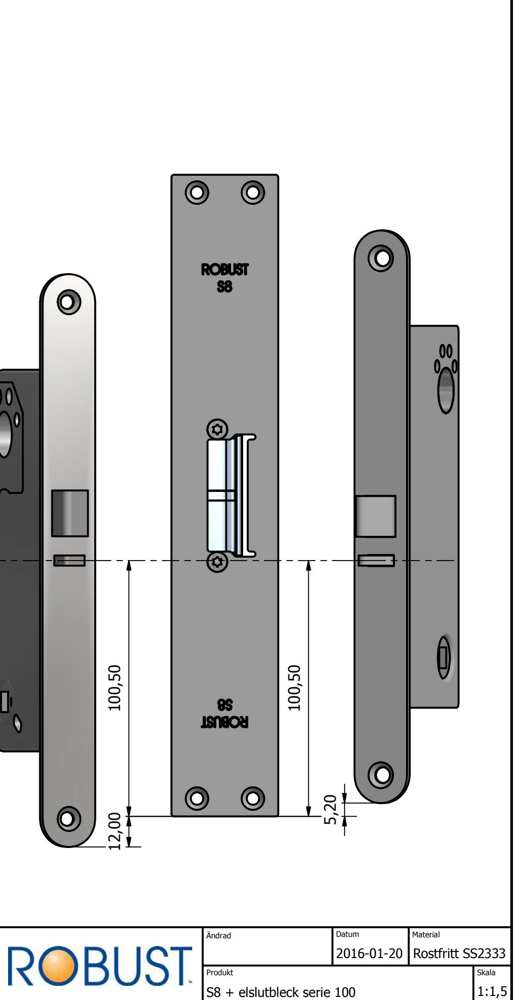
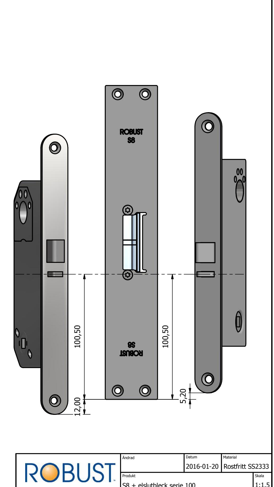
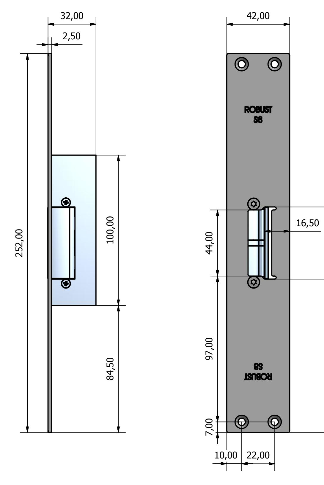

Denna handling tillh|r ISAB, Instrumentfirman Sj|holm AB, och fnr inte kopieras eller lndras, ej heller anvlndas f|r tillverkning eller annat oberh|rigt lndamnl utan vnrt skriftlitliga tillstnnd. Vi reserverar oss f|r eventuella fel i handlingen.

- S-serie passar f|r elslutbleck i 100- & 300-serie.

- Tillverkade i rostfritt, elpolerat stnl.

10

2,0

0

4

8,0

0