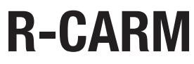
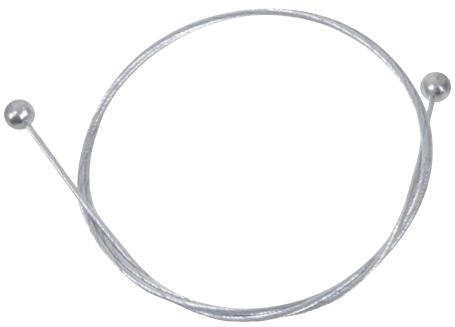

## **KARMÖVERFÖRING SOM TÅL HÅRDA TAG**

Kraftig karmöverföring inklusive väggfästen som ersätter infällda modeller, men ändå uppfyller kraven på vandalsäker överföring – samtidigt som man sparar både tid och pengar. Genom att komplettera med en vajer som är förankrad på insidan av ändstyckena så uppnår man en mycket stark karmöverföring. Förankring i vägg och dörrblad är viktigt.

## **TEKNISK DATA**

**Utförande ändstycken:** Zink, ytbehandlad med velournickel **Utförande sprialslang:** Förzinkad plåt **Mått (mm, BxHxD:)** Ändstycke: 51x37x20 Spiralslang: 500 mm lång, innerdiameter 10 mm

 Komplettera med vajer för vandalsäkert utförande