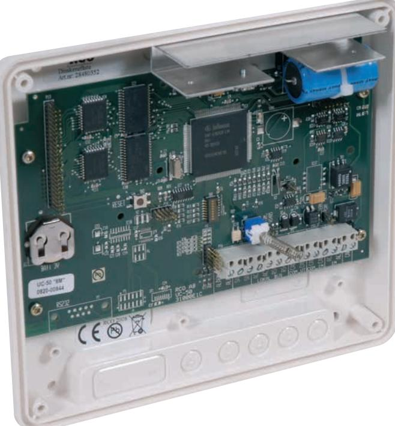
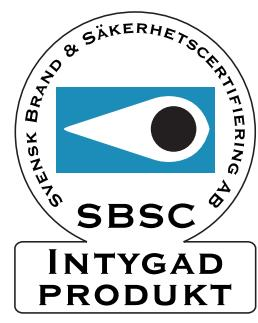
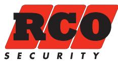
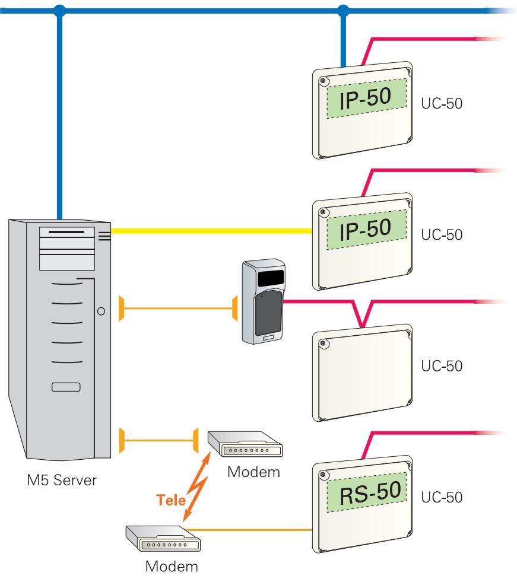
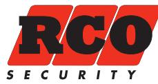

# **R-CARD 5000**

Undercentraler för anslutning till dörrmiljöer

## Undercentral UC-50

Central för anslutning av upp till 8 st dörrmiljöer.

- Undercentral för 2, 4 eller 8 dörrmiljöer.
- Adresserbar.
- Sabotageskyddad kapsling.
- Utgång för "Summa larm".
- Kan kompletteras med:

TCP/IP modul IP-50, LS-50 PSTN, LS-50 GSM, RS-50. Användas t. ex. som router.

| Matningsspänning:                 | 10-30V DC 8-24V AC |
|-----------------------------------|--------------------|
| Strömförbrukning:                 | max 119mA          |
| Temperaturområde: +5°C till +60°C |                    |
| Mått (mm) BxHxD:                  | 200x180x50         |
| Material:                         | Plast              |

*Elektroniska lås för hem och företag*

#### Exemplet visar tre anslutningsmöjligheter (Anknytningar)

## UC-50/2, **SSF 1014 Klass 2**

Art. nr 20 080 096 E. nr 58 750 18 Undercentral för 2 dörrmiljöer. 8Mb. Upp till 32.000 användare.

## UC-50/2, **SSF 1014 Klass 3**

Art. nr 20 080 135 E. nr 58 750 50 Undercentral för 2 dörrmiljöer. 8Mb. Upp till 32.000 användare.

#### UC-50/4, **SSF 1014 Klass 2**

Art. nr 20 080 102 E. nr 58 750 02 Undercentral för 4 dörrmiljöer. 8Mb. Upp till 32.000 användare.

#### UC-50/4, **SSF 1014 Klass 3**

Art. nr 20 080 136 E. nr 58 750 51 Undercentral för 4 dörrmiljöer. 8Mb. Upp till 32.000 användare.

#### UC-50/8, **SSF 1014 Klass 2**

Art. nr 20 080 112 E. nr 58 750 03 Undercentral för 8 dörrmiljöer. 8Mb. Upp till 32.000 användare.

#### UC-50/8, **SSF 1014 Klass 3**

Art. nr 20 080 137 E. nr 58 750 52 Undercentral för 8 dörrmiljöer. 8Mb. Upp till 32.000 användare.

*Elektroniska lås för hem och företag*