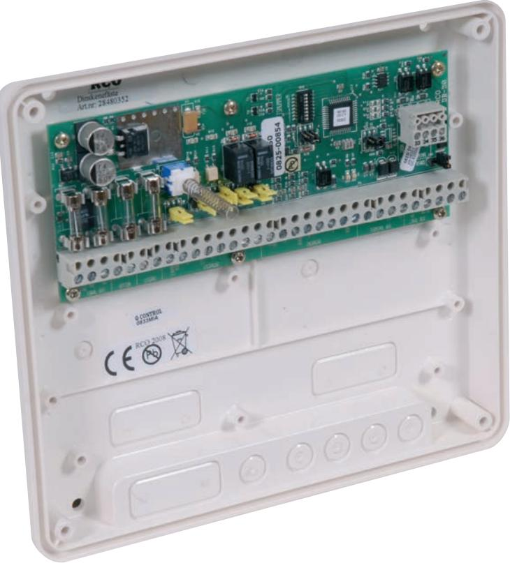

# **R-CARD 5000** DB-50 Delningsbox Standard

#### Delningsbox för en dörrmiljö

Art. nr 20 080 300 E. nr 58 750 04

DB-50 är en delningsbox för en dörrmiljö, den kan hantera upp till 4 st dörrterminaler där 2 st kan ha knappsats och 2 st utan. Delningsbox. 6 st ingångar dubbelbalanserade och strömslinga med återställning. 4 st utgångar, relä och transistor. Exempel på dörrterminaler är MAG-60, DAL-60, SMART-60, PROX-60 och PROX-62. DB-50 har även funktioner för larmstyrning och larmförbikoppling.

| Matningsspänning:                 | 10-24V AC/DC |
|-----------------------------------|--------------|
| Strömförbrukning:                 | max 84mA     |
| Temperaturområde: +5°C till +60°C |              |
| Mått (mm) BxHxD:                  | 200x180x49   |
| Material:                         | Plast        |

*Elektroniska lås för hem och företag*

#### KOMMUNIKATION

All kommunikation på bussarna sker med krypterade protokoll 64 bitars krypteringsnyckel.

- Lokal bus, 2-tråds RS 485 kommunikation med UC-50 plus 2-tråd spänningsmatning.
- Terminal bus, 2-tråds kommunikation med dörrterminal plus 2-tråd spänningsmatning.
- DB-50W har Wiegand ingång istållet för Terminal bus.

#### UTGÅNGAR

- 2 st växlande reläer (siren och dörr).
- 2 st halvledarreläer (förbikoppling och larmstyrning).
- Inställbara för "fri" växling alt. matande utgång.
- Lysdiodsindikation för aktiv utgång.

### INGÅNGAR

- 3 st dubbel- eller obalanserade (dörravkänning, knappöppning samt en oanvänd).
- 3 st opto (återkoppling samt styrning av fria lysdioder på terminalen).
- Extra spänningsingång för matande utgångar.

## ÖVRIGT

- Avsäkrade spänningsmatningar.
- Adresserbar 1 -255.
- Sabbkontakt för larmslinga och intern registrering.
- Lysdioder som indikerar intern spänning och kommunikationsstatus.

*Elektroniska lås för hem och företag*