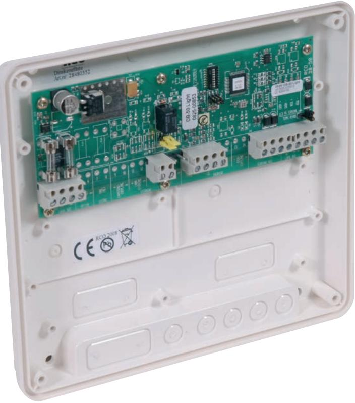
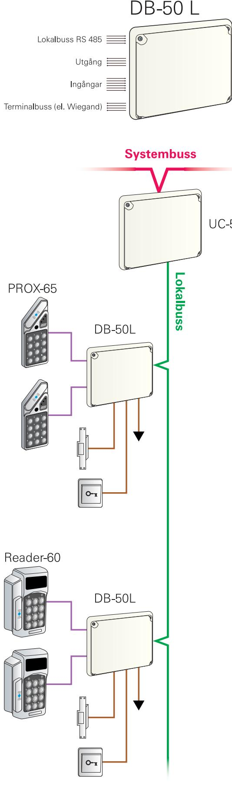

# **R-CARD 5000** DB-50L Delningsbox Light

#### Delningsbox för en dörrmiljö

Art. nr 20 080 310 E. nr 58 750 07

DB-50L är en delningsbox för en dörrmiljö, den kan hantera upp till 4 st dörrterminaler där 2 st kan ha knappsats och 2 st är slavläsare. Exempel på dörrterminaler är MAG-60, DAL-60, SMART-60, PROX-60 och PROX-62. DB-50L är minimerad för att endast styra dörrens funktioner.

| Matningsspänning:                 | 10-24V AC/DC |
|-----------------------------------|--------------|
| Strömförbrukning:                 | max 47mA     |
| Temperaturområde: +5°C till +60°C |              |
| Mått (mm) BxHxD:                  | 200x180x49   |
| Material:                         | Plast        |
|                                   |              |

*Elektroniska lås för hem och företag*

#### KOMMUNIKATION

All kommunikation på bussarna sker med krypterade protokoll 64 bitars krypteringsnyckel.

- Lokal bus, 2-tråds RS 485 kommunikation med UC-50 plus 2-tråd spänningsmatning.
- Terminal bus, 2-tråds kommunikation med dörrterminal plus 2-tråd spänningsmatning.

### UTGÅNGAR

- 1 st växlande relä (dörr).
- Inställbart för "fri" växling alt. matande utgång.

#### INGÅNGAR

- 2 st obalanserade (dörravkänning och knappöppning).
## ÖVRIGT

- Avsäkrad spänningsmatning.
- Adresserbar 1-255.

*Elektroniska lås för hem och företag*