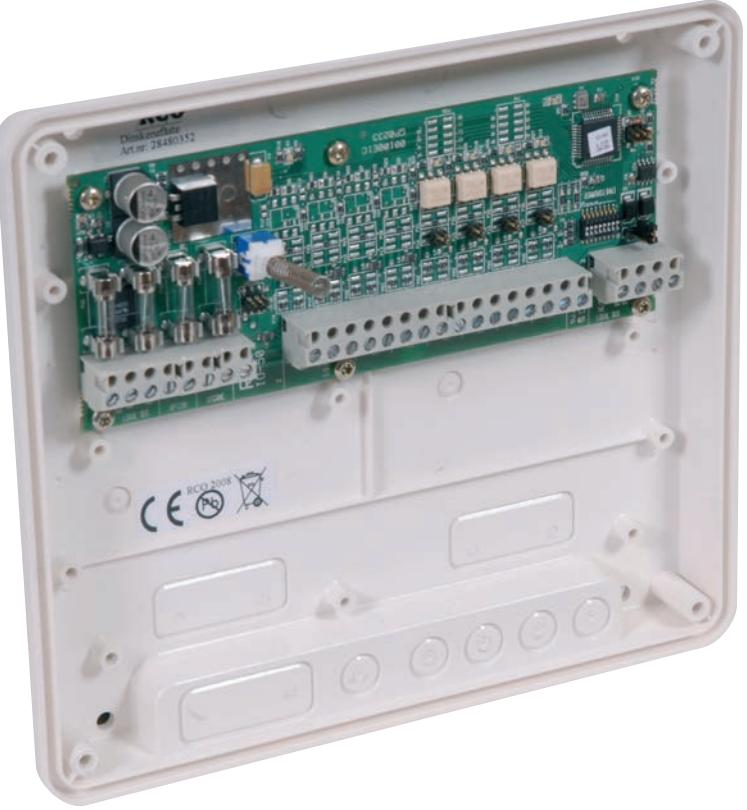
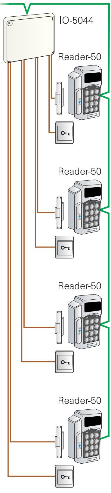

# **R-CARD 5000** IO BOXAR

# För dörröppnarknappar, elslutbleck eller motorlås

- In-/Utgångsbox för dörröppnarknappar, elslutbleck eller motorlås.
- Max 8 st kan anslutas till en UC-50.
- Adresserbar.
- Lokal bus, 2-tråds RS 485 kommunikation med UC-50 plus 2-tråd spänningsmatning.
- Finns i följande versioner: 4 eller 8 utgångar (IO-5004, 5008) 4 in + 4 ut (IO-5044).
- Dubbel eller obalanserade ingångar.
- Utgångar med halvledarereläer.

*Elektroniska lås för hem och företag*

## IO-5004

Art. nr 20 100 110 E. nr 58 750 23 Box för 4 utgångar. Används för anslutning av ellås eller hissstyrning. Kommunikation 2 tråds RS 485 med UC-50 central. Strömförbrukning max 34mA

#### IO-5008

Art. nr 20 100 115 E. nr 58 750 24 Box för 8 utgångar. Används för anslutning av ellås eller hissstyrning. Kommunikation 2 tråds RS 485 med UC-50 central. Strömförbrukning max 46mA

### IO-5044

Art. nr 20 100 120 E. nr 58 750 25 Box för 4 ingångar och 4 utgångar. Används för anslutning av ellås samt öppnaknapp eller dörravkänning. Kommunikation 2 tråds RS 485 med UC-50 central. Strömförbrukning max 34mA

| Matningsspänning:                 | 10-24V AC/DC |
|-----------------------------------|--------------|
| Temperaturområde: +5°C till +60°C |              |
| Mått (mm) BxHxD:                  | 200x180x49   |
| Material:                         | Plast        |

*Elektroniska lås för hem och företag*

93500170