## ABLOY® EL580, EL582, PE580

- Solenoidilukko – Solenoidlås

– Magnetlås

- Solenoid Lock

- Соленоидный замок

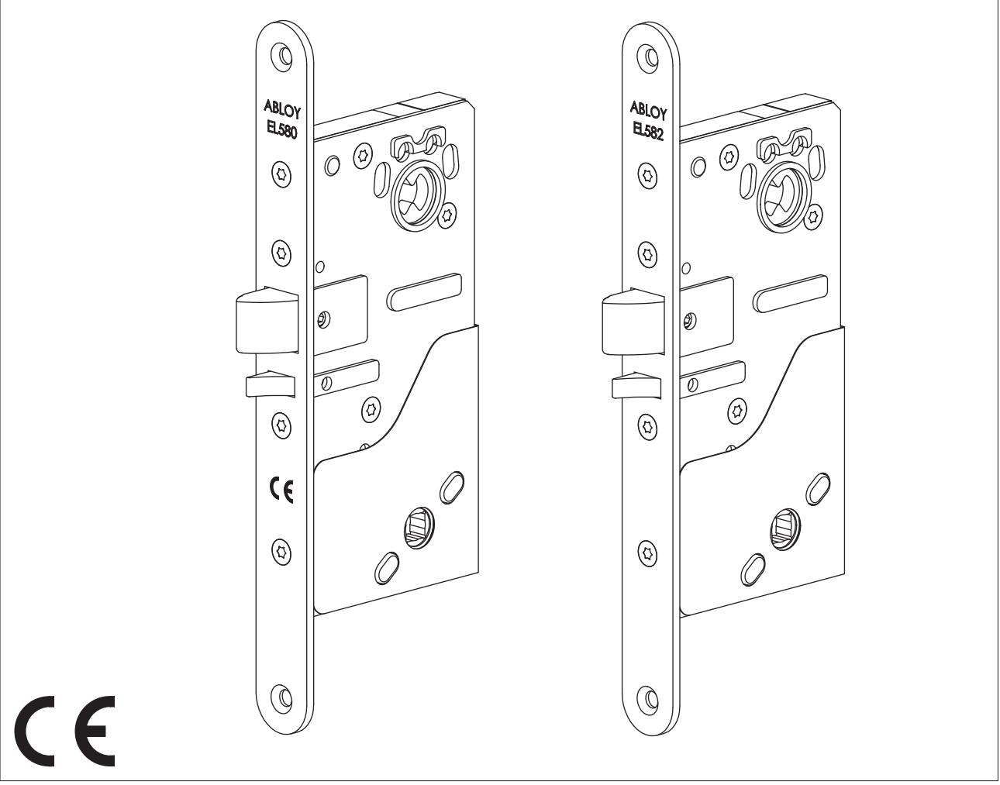

#### Sisällysluettelo SUOMI

| TEKNISET TIEDOT  3                       |  |
|------------------------------------------|--|
| STANDARDIT  4                            |  |
| POISTUMISTIESTANDARDIN EN179             |  |
| MUKAINEN ASENNUS  5                      |  |
| HÄTÄPOISTUMISTIESTANDARDIN EN 1125       |  |
| MUKAINEN ASENNUS  5                      |  |
| KYTKENTÄKAAVIO  6                        |  |
| PORAUSOHJE  7                            |  |
| MANIPULOINTISUOJA (A)  8                 |  |
| SOLENOIDIN TOIMINTASUUNNAN VAIHTO (B)  8 |  |
| KIILAN KÄTISYYDEN VAIHTO (C)  9          |  |
| TELJEN KÄTISYYDEN VAIHTO (C)  9          |  |
| TELJEN ULOSTULOPITUUDEN VAIHTO (D)  9    |  |
| POISTUMISPAINIKKEEN/-PUOMIN              |  |
| PUOLEN VALINTA (EL580, PE580) (E)  10    |  |
| VÄÄNTÖRAUDAN ASENNUS (F)  10             |  |
| ASENNUSOHJE  10 - 11                     |  |
|                                          |  |

#### Innehåll SVENSKA

| TEKNISK SPECIFIKATION  3                    |  |
|---------------------------------------------|--|
| STANDARDS  4                                |  |
| INSTALLATIONSANVISNING ABLOY EL580 MED      |  |
| NÖDUTRYMNINGSTRYCKE ENLIGT EN179  5         |  |
| PANIKUTRYMNINGSBESLAG, INSTALLATION         |  |
| ENLIGT EN 1125  5                           |  |
| KOPPLINGSSCHEMA  6                          |  |
| BORRSCHEMA  7                               |  |
| MANIPULATIONSSKYDDSKÅPA (A)  8              |  |
| ÄNDRING AV SOLENOIDENS FUNKTION             |  |
| RÄTTVÄND -> OMVÄND (B)  8                   |  |
| ÄNDRING AV FÖRREGLINGSFALL                  |  |
| HÖGER -> VÄNSTER (C)  9                     |  |
| ÄNDRING AV FALLKOLV HÖGER -> VÄNSTER (C)  9 |  |
| ÄNDRING AV FALLKOLVENS UTSPRÅNG (D)  9      |  |
| ÄNDRING AV MEKANISKT / ELEKTRISKT           |  |
| STYRD SIDA (EL580, PE580) (E)  10           |  |
| INSTALLATION AV VREDMEDBRINGARE (F)  10     |  |
| MONTERINGSANVISNING  10 - 11                |  |
|                                             |  |

#### Idholdsfortegnelse DANSKA

| TEKNISK SPECIFIKATION  3 STANDARDS  5 INSTALLATION AF NØDUDGANGSBESLAG |  |
|------------------------------------------------------------------------------|--|
| I HENHOLD TIL EN 179  5                                                      |  |
| PANIC EXIT DEVICES INSTALLATION                                              |  |
| ACCORDING TO EN 1125  5 EL-DIAGRAM  6                                     |  |
| BORESKABELON  7                                                              |  |
| BESKYTTELSESKAPPE (A)  8                                                     |  |
| ÆNDRING AF ELEKTROMAGNETENS                                                  |  |
| FUNKTION (Retvendt / Omvendt) (B)  8                                         |  |
| ÆNDRING AF SPÆRREFALLENS                                                     |  |
| RETNING (H/V) (C)  9                                                         |  |
| ÆNDRING AF FALLENS RETNING (H/V) (C)  9                                      |  |
| ÆNDRING AF FALLEFREMSPRING (14/20)mm (D)  9                                  |  |
| SÅDAN VÆLGES HVILKEN SIDE PÅ                                                 |  |
| UDGANGSDØRGREBET (EL580, PE580) (E)  10                                      |  |
| INSTALLATION OF TAIL PIECE (F)  10                                           |  |
| MONTERINGSVEJLEDNING  10 - 11                                                |  |

#### Contents ENGLISH

| TECHNICAL DATA  3 STANDARDS  4                             |  |
|---------------------------------------------------------------|--|
| EMERGENCY EXIT DEVICES INSTALLATION ACCORDING TO EN 179  5 |  |
| PANIC EXIT DEVICES INSTALLATION ACCORDING TO EN 1125  5    |  |
| WIRING DIAGRAM  6 DRILLING SCHEME  7                       |  |
| MANIPULATION PROTECTION COVER (A)  8                          |  |

| CHANGING THE DIRECTION OF THE                                               |
|-----------------------------------------------------------------------------|
| SOLENOID ACTION (B)  8                                                      |
| CHANGING THE OPENING DIRECTION OF                                           |
| THE TRIGGER BOLT (C)  9 CHANGING THE OPENING DIRECTION OF                |
| THE LATCH BOLT (C)  9                                                       |
| CHANGING THE BOLT THROW (D)  9                                              |
| SETTING THE EXIT HANDLE / PUSH BAR                                          |
| SIDE (EL580, PE580) (E)  10                                                 |
| INSTALLATION OF TAIL PIECE (F)  10                                          |
| INSTALLATION SCHEMATIC  10 - 11                                             |
| Ñîäåðæàíèå Î-ÐÓÑÑÊÈ                                                      |
| ÒÅÕÍÈ×ÅÑÊÀß ÑÏÅÖÈÔÈÊÀÖÈß  3                                                 |
| ÒÅÑÒÈÐÎÂÀÍÈÅ ÑÎÃËÀÑÍÎ ÑÒÀÍÄÀÐÒÀÌ  4                                         |
| ÓÑÒÀÍÎÂÊÀ ÓÑÒÐÎÉÑÒÂ ÄËß ÇÀÏÀÑÍÎÃÎ                                           |
| ÂÛÕÎÄÀ ÑÎÃËÀÑÍÎ ÑÒÀÍÄÀÐÒÓ EN 179  5                                         |
| ÓÑÒÀÍÎÂÊÀ ÓÑÒÐÎÉÑÒÂ ÝÂÀÊÓÀÖÈÎÍÍÎÃÎ                                          |
| ÂÛÕÎÄÀ ÑÎÃËÀÑÍÎ EN 1125  5 ÑÕÅÌÀ ÑÎÅÄÈÍÅÍÈÉ  6                           |
| ÈÍÑÒÐÓÊÖÈß ÏÎ ÑÂÅÐËÅÍÈÞ  7                                                  |
| ÊÐÛØÊÀ Ñ ÇÀÙÈÒÎÉ ÎÒ ÌÀÍÈÏÓËßÖÈÉ (A)  8                                      |
| ÈÇÌÅÍÅÍÈÅ ÍÀÏÐÀÂËÅÍÈß                                                       |
| ÔÓÍÊÖÈÎÍÈÐÎÂÀÍÈß ÑÎËÅÍÎÈÄÀ (B)  8                                           |
| ÈÇÌÅÍÅÍÈÅ ÑÒÐÎÍÍÎÑÒÈ ßÇÛ×ÊÀ (C)  9                                          |
| ÈÇÌÅÍÅÍÈÅ ÑÒÎÐÎÍÍÎÑÒÈ ÐÈÃÅËß (C)  9 ÈÇÌÅÍÅÍÈÅ ÄËÈÍÛ ÂÛÕÎÄÀ ÐÈÃÅËß (D)  9 |
| ÓÑÒÀÍÎÂÊÀ ÑÒÎÐÎÍÛ ÐÓ×ÊÈ ÂÛÕÎÄÀ /                                            |
| ÍÀÆÈÌÍÎÉ ØÒÀÍÃÈ (EL580, PE580) (E)  10                                      |
| ÓÑÒÀÍÎÂÊÀ ÏÎÂÎÄÊÀ ÎÒ                                                        |
| ÏÎÂÎÐÎÒÍÎÉ ÊÍÎÏÊÈ (F)  10                                                   |
| ÈÍÑÒÐÓÊÖÈß ÏÎ ÌÎÍÒÀÆÓ  10 - 11                                              |

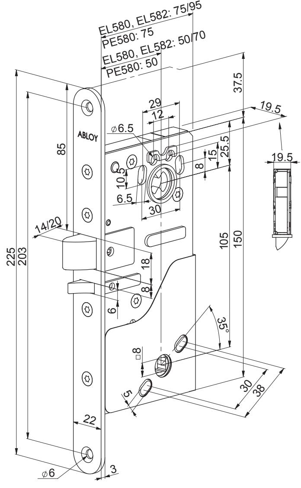

| U: 12 (-10%) – 24 (+15 %) V DC STAB |             |                |  |  |
|-------------------------------------|-------------|----------------|--|--|
| I :                                 | Max. FI  | Lepovirta      |  |  |
|                                     | Max SE   | Vila           |  |  |
|                                     | Maks. DK | I hvile        |  |  |
|                                     | Max. UK  | Idle           |  |  |
|                                     | Ìàêñ. RU | Õîëîñòîãî õîäà |  |  |
| 12 VDC                              | 550 mA      | 240 mA         |  |  |
| 24 VDC                              | 270 mA      | 110 mA         |  |  |

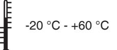

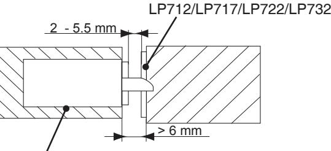

EL580, EL582, PE580

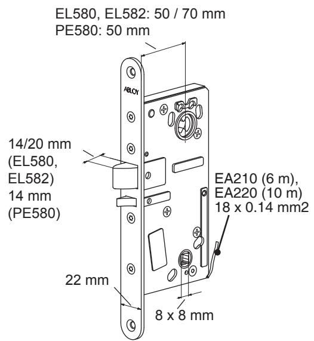

**Lukkorungosta valittavissa: Mekaaniset toiminnot FI**

-teljen ja kiilan kätisyydet

-teljen ulostulo (14 mm / 20 mm EL580, EL582) -ohjatun painikkeen puoli (EL580, PE580)

**Sähköinen toiminto**

-virta päällä -> ohjattu painike avaa lukon tai

-virta päällä -> ohjattu painike ei avaa lukkoa Aktiivipuolen painikkeesta lukko aina avattavissa (EL580, PE580)

**Tilatiedot:** -teljen takalukituksen tilatieto -painikekäytön tilatieto

Lukkorungon kanssa tulee käyttää palautusjousella varustettuja painikkeita oven molemmin puolin. **Palo-ovissa teljen ulostulopituuden tulee olla 14 mm (tehdasasetus 20 mm).**

#### **Ställbara funktioner: SE**

**Mekanisk funktion**

-höger / vänsterhängd -fallkolvutsprång (14 mm / 20 mm EL580, EL582)* -mekaniskt / elektriskt styrd sida (EL580, PE580)

**Elektrisk funktion**

-rättvänd / omvänd funktion

Låset kan alltid öppnas med den mekaniskt styrda sidans trycke (EL580, PE580).

**Indikeringar:** -förregling (stängd / öppen dörr) -trycke (vila / rörelse)

Använd trycke med returfjäder på båda sidor av dörren. *** VIKTIGT:**

EL580 / EL582 i brandcellsgräns För att säkerställa låsets brandigenhållande funktion, SKALL fallkolvens utsprång ställas i 14 mm förreglat läge vid montage i brandcellsgräns (se sidan 11 Bild G). Gäller i Sverige.

#### **Funktions muligheder i låsekassen: Mekaniske funktioner DK**

- Falleretning (H/V) og fallefremspring

(14 mm / 20 mm EL580, EL582)

- Ændring af den aktive håndgrebsside (EL580, PE580) **Elektrisk funktion**

-strømmen er på = retvendt funktion - låsen åbner

-strømmen er på = omvendt funktion - låsen åbner ikke Låsen kan altid åbnes med den aktive sides greb (EL580, PE580)

**Indikeringer:** -information om fallens position -når dørgrebet trykkes ned

På denne type låsekasse anbetales det at anvende returtieder på begge sider at røgrebene. **I branddøre skal fallefremspringet indstilles til 14 mm (fabriks** 

**indstilling 20 mm).**

**Selectable functions of the lock case: Mechanical functions UK**

-opening directions of trigger bolt and latch bolt -bolt throw (14 mm / 20 mm EL580, EL582) -controlled side (EL580, PE580)

**Electrical function**

-power on -> controlled handle opens the lock or

-power on -> controlled handle does not open the lock The lock can always be opened with the handle on the active side (EL580, PE580).

**Indications:** -deadlock status of latch bolt -indication of handle operation

Use handles with return springs on both sides of the door. **In fire doors please use 14mm bolt throw (factory setting 20 mm).**

**Íàñòðàèâàåìûå ôóíêöèè êîðïóñà çàìêà: Ìåõàíè÷åñêèå ðåæèìû RU**

-ñòîðîííîñòü ðèãåëÿ è ÿçû÷êà

-âûõîä ðèãåëÿ (14 ìì / 20 ìì EL580, EL582) -ñòîðîíó óïðàâëÿåìîé ðó÷êè (EL580, PE580)

**Ýëåêòðè÷åñêèé ðåæèì**

- -ïèòàíèå âêëþ÷åíî -> óïðàâëÿåìàÿ ðó÷êà îòêðûâàåò çàìîê èëè
-ïèòàíèå âêëþ÷åíî -> óïðàâëÿåìàÿ ðó÷êà íå îòêðûâàåò çàìêà

Ðó÷êîé ñ àêòèâíîé ñòîðîíû çàìîê ìîæíî âñåãäà îòêðûâàòü (EL580, PE580)

- **Èíäèêàöèÿ:** î áëîêèðîâêå ðèãåëÿ îá èñïîëüçîâàíèè ðó÷êè
Óñòàíîâèòå âîçâðàòíûå ïðóæèíû íà îáå ñòîðîíû äâåðíûõ ðó÷åê. **ÍÀ ÏÐÎÒÈÂÎÏÎÆÀÐÍÛÕ ÄÂÅÐßÕ ÏÎÆÀËÓÉÑÒÀ ÓÑÒÀÍÎÂÈÒÅ ÂÛÕÎÄ ÐÈÃÅËß 14ìì (çàâîäñêàÿ óñòàíîâêà 20 ìì).**

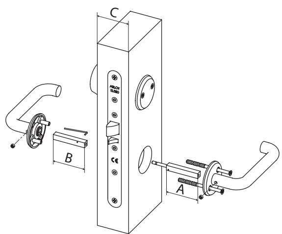

구

| C          | A(IN)  | B(OUT) | 0    |              |
|------------|--------|--------|------|--------------|
| 40 - 54 mm | 47 mm  | 50 mm  | 8 mm | EA288 001000 |
| 47 - 66 mm | 57 mm  | 50 mm  | 8 mm | EA288 002000 |
| 61 - 80 mm | 67 mm  | 60 mm  | 8 mm | EA288 003000 |
| 66 - 80 mm | 74 mm  | 50 mm  | 8 mm | EA288 004000 |
| 88 mm -    | 120 mm | 120 mm | 8 mm | EA288 005000 |
| 70 - 87 mm | 90 mm  | 50 mm  | 8 mm | EA288 006000 |

| EN 179: 2008           | 3 7 6 B 1 3 4 2 A B/D   Exit (EL580) |                     | ' Выход (EL580)                | ГОСТ Р                                                                                                                                                                         |
|------------------------|--------------------------------------|---------------------|--------------------------------|--------------------------------------------------------------------------------------------------------------------------------------------------------------------------------|
| EN 1125: 1997/A1: 2001 | 37611332A                            | Panic exit (PE580)  | Эвакуационный выход (PE580)    |                                                                                                                                                                                |
| EN 1634-1              |                                      | Fire                | Пожар                          |                                                                                                                                                                                |
| EN 61000-6-1:2007      |                                      | EMC                 | Электромагнитная совместимость |                                                                                                                                                                                |
| EN 61000-6-3:2007      |                                      | EMC                 | Электромагнитная совместимость |                                                                                                                                                                                |
| EN 12209: 2004         |                                      | Mechanical strength | Механическая прочность         | 100000000000000000000000000000000000000000000000000000000000000000000000000000000000000000000000000000000000000000000000000000000000000000000000000000000000000000000000000000 |

4

## R

| EN 179                                                                      |                                                                                         | EN 1125                                                            |
|-----------------------------------------------------------------------------|-----------------------------------------------------------------------------------------|--------------------------------------------------------------------|
| EL580                                                                       |                                                                                         | PE580                                                              |
| 3-20/032 3-19/032 3-19k/032 13/032 3-20/052                     | 3-19/052 3-19k/052 13/052                                                         | PBE001                                                             |
|                                                                             |                                                                                         |                                                                    |
| R >1/ F < 70N (7 kg) 100 mm Spray Vaselin ISOFLEX TOPAS NB52 | Spray                                                                                   | R >1/a F < 80N (8 kg) 25 mm Vaselin ISOFLEX TOPAS NB52 |
| max. 200 kg max. 2520 mm 900 mm - 1100 mm max. 1320 mm             | 25mm max. 200 kg lmin=60%*L max. 2520 mm 900 mm - 1100 mm L=max. 1320 mm | 25mm                                                               |

- **Tämän tuotteen standardin EN 179/EN 1125 mukainen vastaavuus edellyttää ehdottomasti, että sen turvalaitteisiin ei tehdä mitään muita kuin tässä ohjevihkossa sallittuja muutoksia. ! FI**
- **Säkerhetsegenskaperna på denna produkt är avgörande för dess överensstämmelse med EN 179/EN 1125. Ingen modifiering eller ändring av något slag, annat än de som beskrivs i denna instruktion är tillåtna. ! SE**
- **Sikkerheds funktionen på dette produkt er i henhold til EN 179/EN 1125. Dog må der ikke foretages ændringer eller modifikationer I forhold til produktet og denne vejledning. ! DK**
- **The safety features of this product are essential to its compliance with EN 179/EN 1125. No modification of any kind other than those described in these instructions, are permitted. ! UK**
- **Î÷åíü âàæíî, ÷òîáû çàùèòíûå ñâîéñòâà èçäåëèÿ ñîîòâåòñòâîâàëè ñòàíäàðòó EN 179/EN 1125. Ëþáûå ìîäèôèêàöèè çàïðåùåíû, çà èñêëþ÷åíèåì îïèñàííûõ â äàííûõ èíñòðóêöèÿõ. ! RU**

| 6 |
|---|

|   | E580  |
|---|-------|
| R | P     |
|   |       |
|   | L582, |
|   | E     |
|   | L580, |
|   | E     |

## **KYTKENTÄKAAVIO FI**

**NO**

Rigel inde

**-**

Blå

Grøn

|        | +                                |  | punainen  |
|--------|----------------------------------|---|-----------|
| C      | Yhteinen                         |  | musta     |
| NC     | Lukittu                          |  | keltainen |
| O N | Auki                             |  | sininen   |
|        | -                                |  | vihreä    |
| O N | Painike painettu                 |  | ruskea    |
| C      | Yhteinen                         |  | oranssi   |
| NC     | Painiketta ei painettu           |  | harmaa    |
|        | SUOJADIODIT LUKKORUNGON SISÄLLÄ. |   |           |

MAKSIMIARVOT MIKROKYTKIMILLE: max. 0.4 A 30 V AC / V DC resist. max. 10 W.MITÄÄN ARVOA EI SAA YLITTÄÄ.

VAROITUS: **!**

Painikkeen tilatietoja ei saa käyttää lukon ohjaukseen. 

### **INKOPPLING SE**

|        | +                                                              |  | röd    |
|--------|----------------------------------------------------------------|---|--------|
| C      | Gemensam                                                       |  | svart  |
| NC     | Låst                                                           |  | gul    |
| O N | Olåst                                                          |  | blå    |
|        | -                                                              |  | grön   |
| O N | Tryckesrörelse                                                 |  | brun   |
| C      | Gemensam                                                       |  | orange |
| NC     | Trycke i vila                                                  |  | grå    |
|        | MAX. BELASTNING MIKROBRYTARE: LÅSET HAR INBYGGD SKYDDSDIOD. |   |        |
|        |                                                                |   |        |

max. 0.4 A 30 V AC / V DC resist. max. 10 W.VÄRDENA FÅR INTE ÖVERSKRIDAS.

**!** VARNING: Använd inte trycket för att styra låset.

|--|

Rød

Sort

Gul

| O N | Grebet er nede                   |  | brun   |
|--------|----------------------------------|---|--------|
| C      | Fælles                           |  | orange |
| NC     | Grebet er oppe                   |  | grå    |
|        | LÅSEN ER FORSYNET MED INDBYGGEDE |   |        |

BESKYTTELSESDIODER. maks. VÆRDIER FOR MIKROKONTAKTER:0.4 A 30 V AC / 0.4 A 30 V DC; MAKS. 10 W ohmsk belastning.

 INGEN VÆRDIER MÅ OVERSKRIDES.

**!** ADVARSEL:

Bruge ikke greb anvendt tilbagemeldingen til at åbne låsen elektrisk. *)

*) Denne tilbage melding er ment for anvendelse sammen med adgangskontrol for at forhindre en ulovlig åbning af døren. Nogle alarmsystemer styre forbikoblingen af alarm og åbning af låsen på sammen indgang. Kan disse indgange ikke skilles ad må tilbagemeldingen fra greb anvendt ikke benytte til at styre denne indgang. Dette ville kunne medføre uautoriseret adgang.

## **WIRING DIAGRAM UK**

|        | +                                     |  | red    |  |
|--------|---------------------------------------|---|--------|--|
| C      | Common                                |  | black  |  |
| NC     | Locked                                |  | yellow |  |
| O N | Open                                  |  | blue   |  |
|        | -                                     |  | green  |  |
| O N | Handle down                           |  | brown  |  |
| C      | Common                                |  | orange |  |
| NC     | Handle not down                       |  | grey   |  |
|        | LOCK CASE INCLUDES PROTECTION DIODES. |   |        |  |

MAXIMUM VALUES FOR MICRO SWITCHES: max. 0.4 A 30 V AC / V DC resist. max. 10 W. NO VALUES TO BE EXCEEDED. **!** WARNING: Do not use handle down indication to lock's control. *) *) It is made for access control and prevention of the burglary alarm. In some burglary alarm systems prevention of the alarm and lock's control are working at the same time. If you can not separate these functions, it is not allowed use handle down indication to prevention of the burglary alarm. That might cause unauthorized entrance.

Copyright

© Abloy Oy Joensuu Factory

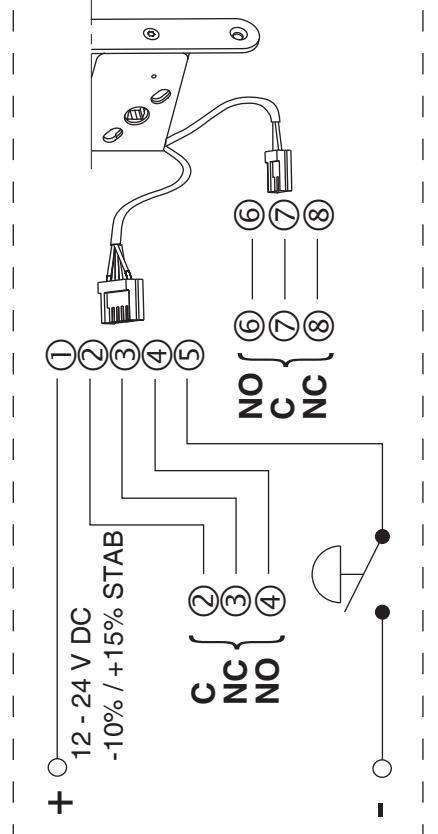

# 

| ÑÕÅ    | ÄÈÍÅÍÈÉ ÎÅ ÌÀ Ñ                                                                                                                                                                                                                                                                                                                                                                                                  |   | RU         |  |
|--------|------------------------------------------------------------------------------------------------------------------------------------------------------------------------------------------------------------------------------------------------------------------------------------------------------------------------------------------------------------------------------------------------------------------------|---|------------|--|
|        | +                                                                                                                                                                                                                                                                                                                                                                                                                      |  | êðàñíûé    |  |
| C      | Îáùèé                                                                                                                                                                                                                                                                                                                                                                                                                  |  | ÷åðíûé     |  |
| NC     | Ðèãåëü íàðóæè                                                                                                                                                                                                                                                                                                                                                                                                          |  | æåëòûé     |  |
| O N | Ðèãåëü âíóòðè                                                                                                                                                                                                                                                                                                                                                                                                          |  | ñèíèé      |  |
|        | -                                                                                                                                                                                                                                                                                                                                                                                                                      |  | çåëåíûé    |  |
| O N | Ðó÷êó íàæàëè                                                                                                                                                                                                                                                                                                                                                                                                           |  | êîðè÷íåâûé |  |
| C      | Îáùèé                                                                                                                                                                                                                                                                                                                                                                                                                  |  | îðàíæåâûé  |  |
| NC     | Ðó÷êó íå íàæèìàëè                                                                                                                                                                                                                                                                                                                                                                                                      |  | ñåðûé      |  |
| ÍÀÐÓ   | ÙÈÒÍÛÅ ÄÈÎÄÛ ÍÅ ÍÓ ÌÀÑÈÌÀËÜÍÛÅ ÂÅËÈ×ÈÍÛ ÄËß Þ×ÀÒÅËÅÉ: ÌÈÊÐÎÏÅÐÅÊË ÆÍÛÅ ÇÀ                                                                                                                                                                                                                                                                                                                                  |   | ÆÍÛ.       |  |
|        | 0,4 À 30 ïîñòîÿííîãî ÐÅÇÈÑÒ.; ÌÀÊÑ. 10 Âò ÍÈÊÀÊÈÅ ÂÅËÈ×ÈÍÛ ÍÅËÜÇß ÏÅÐÂÛ 0,4 A 30 ïåðåìåííîãî ÐÅÇÈÑÒ.;                                                                                                                                                                                                                                                                                                          |   | ØÀÒÜ.      |  |
| !      | Íåëüçÿ èñïîëüçîâàòü èíäèêàöèþ ðó÷êà íàæàòà äëÿ óïðàâëåíèÿ çàìêîì. *) ÂÍÈÌÀÍÈÅ!                                                                                                                                                                                                                                                                                                                                   |   |            |  |
|        | ôóíêöèè, òî íåëüçÿ èñïîëüçîâàòü èíäèêàöèþ ðó÷êà íàæàòà äëÿ ïðåäîòâðàùåíèÿ ñèãíàëèçàöèè î âçëîìå. Èç çà ýòîãî ïðåäîòâðàùåíèÿ ñèãíàëèçàöèè î âçëîìå.  íåêîòîðûõ îäíîâðåìåííî. Åñëè âû íå ìîæåòå ðàçäåëèòü ýòè äâå óñòðîéñòâàõ ñèãíàëèçàöèè î âçëîìå ïðåäîòâðàùåíèå ñèãíàëà òðåâîãè è óïðàâëåíèå çàìêîì ðàáîòàþò ìîæåò ïðîèçîéòè íåñàíêöèîíèðîâàííûé âõîä. *) Îíà ñäåëàíà äëÿ óïðàâëåíèÿ äîñòóïîì è |   |            |  |
|        |                                                                                                                                                                                                                                                                                                                                                                                                                        |   |            |  |

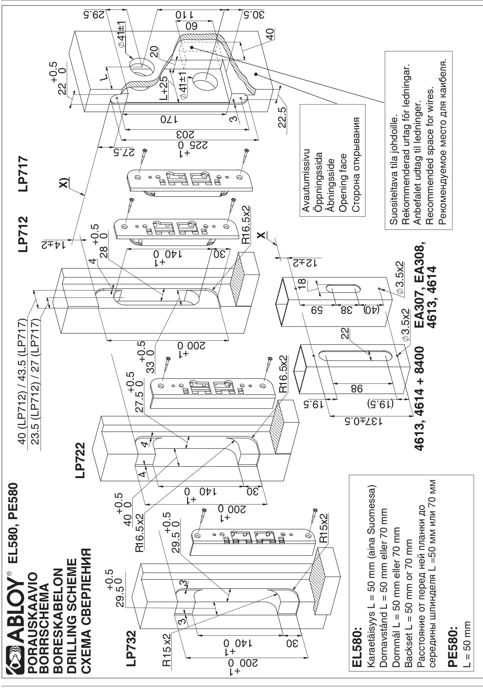

## R

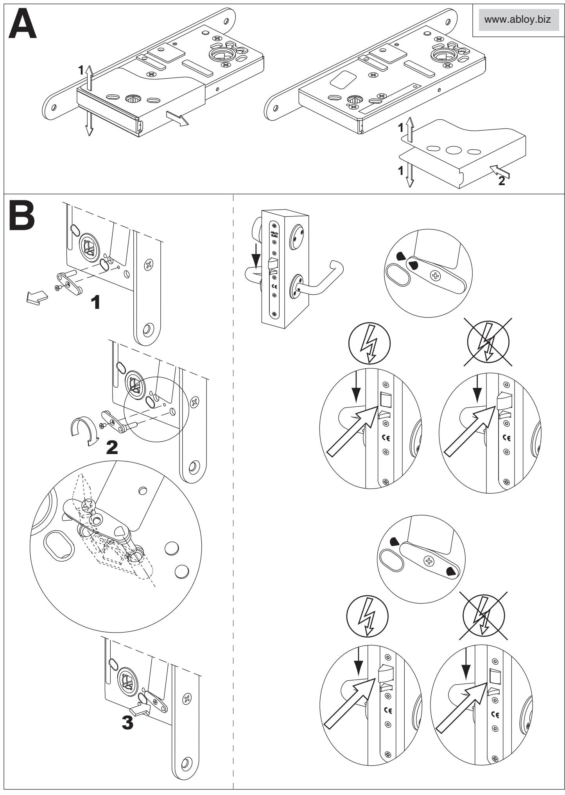

## 62 ABLOY®

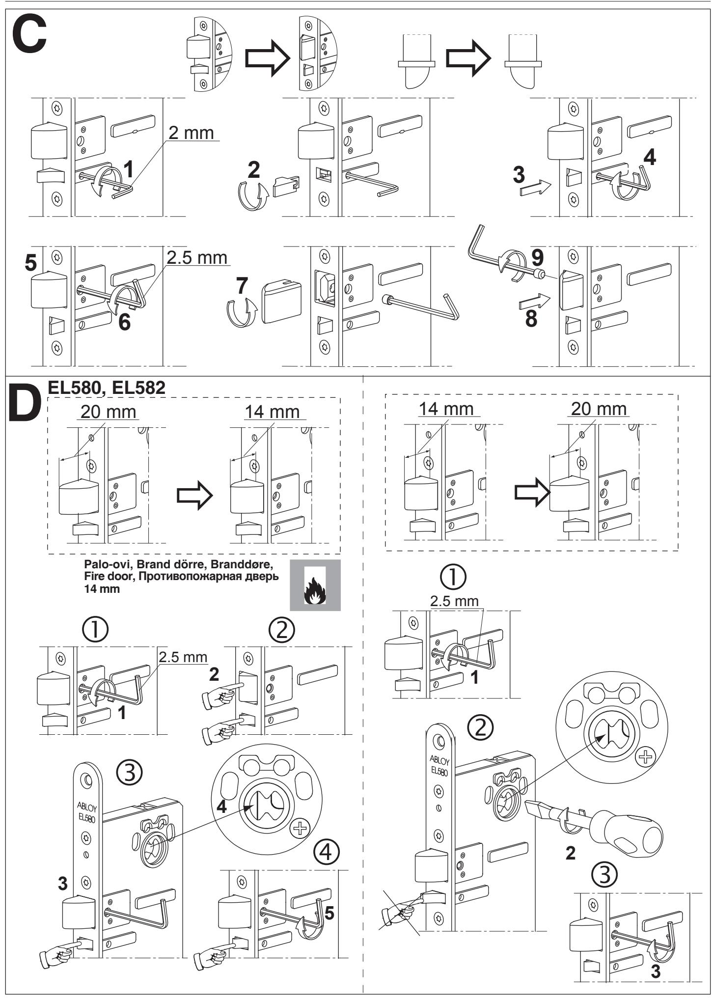

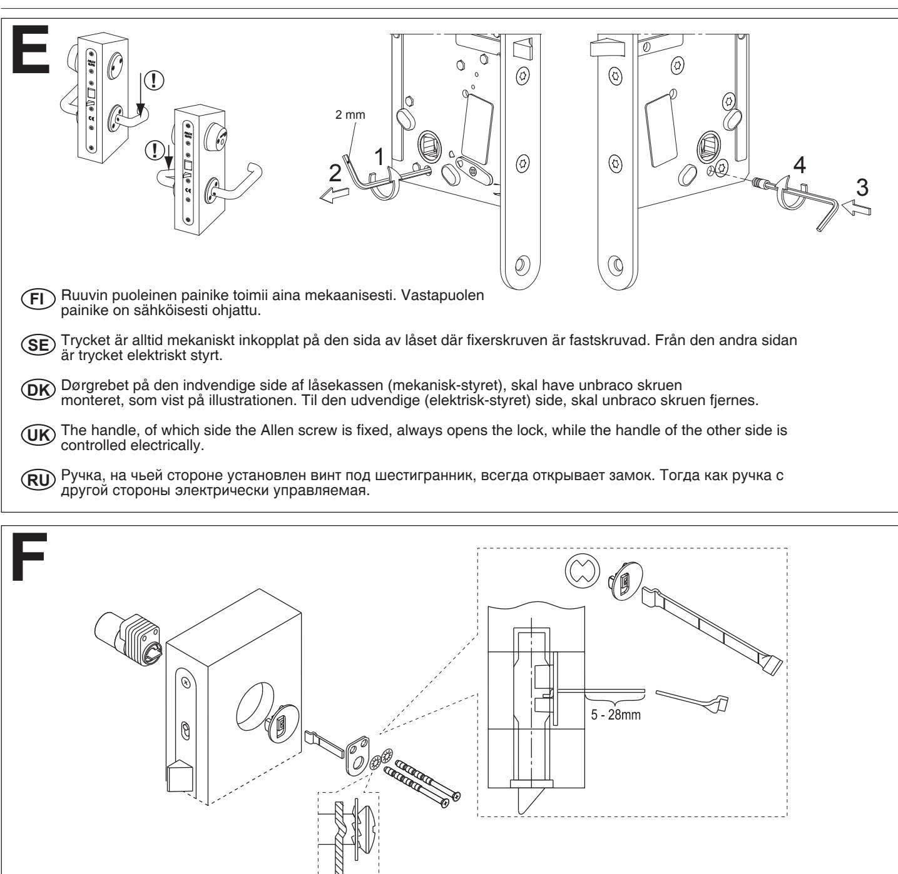

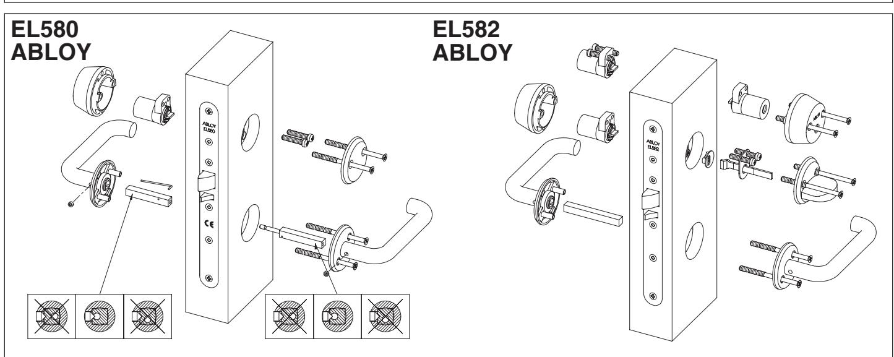

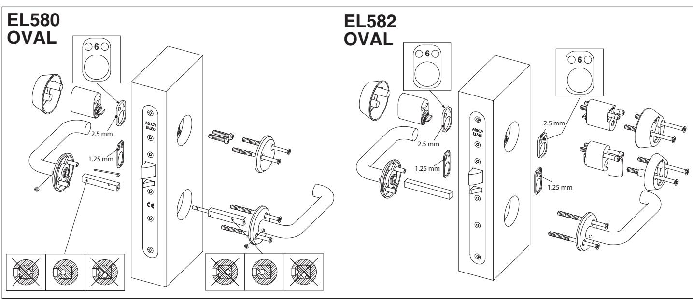

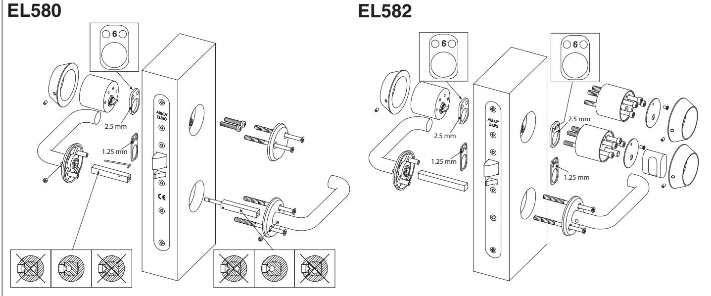

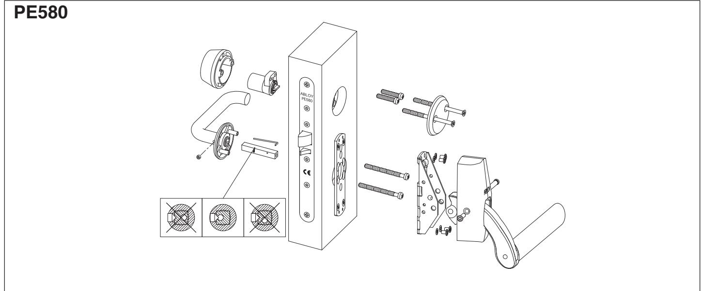

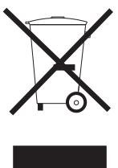

Tuote sisältää erilliskierrätystä vaativia materiaaleja mm. elektroniikkaa. Kun tuote poistetaan käytöstä, tuote on purettava osiin ja eri materiaalit on lajiteltava sekä kierrätettävä voimassa olevien kierrätysmääräysten mukaisesti.

Denna produkt innehåller material, bland annat elektronikkomponenter, som behöver specialåtervinning. När produkten avställs, demontera den och sortera och återvinn de olika material enligt den gällande återvinningsinstruktionen.

Dette produktet innehåller matriell, blandt annat elektronikkomponenter, som behøver spesialgjennvinning. Når produktet skal kastes, må den demonteres og den skal sorteres for gjennvinning av de ulike delene i forhold til gjeldende gjennvinnings instruksjon.

This product contains materials, such as electronics, which require specialist recycling techniques. When the product is taken out of use, disassemble it and sort and recycle the different materials as per valid recycling instructions.

Часть материалов, такие как электронные компоненты, требуют специальной технологии переработки. Когда изделие снято с эксплуатации, разберите его, отсортируйте и перерабатывайте различные материалы в соответствии с действующими инструкциями по их переработке.

Pidätämme oikeuden tehdä muutoksia tässä ohjeessa esitettyihin tuotteisiin.

Vi förbehåller oss rätten att vidareutveckla våra produkter utan föregående avisering.

Vi forbeholder oss retten til å vidreutvikle våre produkter uten videre forrvarsling.

We reserve the right to make alterations to the products described in this leaflet.

Мы оставляем за собой право внесения изменений в изделие, описанное в данном буклете.

Nimike Päiväys 950777 01/2011

**OHSAS 18001** Abloy Oy Wahlforssinkatu 20 P.O. Box 108 FI-80101 JOENSUU FINLAND Tel. +358 20 599 2501 www.abloy.com Fax +358 20 599 2209

An ASSA ABLOY Group brand

**ASSA ABLOY**

Abloy Oy is one of the leading manufactures of locks, locking systems and architectural hardware and the word´s leading developer of products in the field of electromechanical locking technology. ASSA ABLOY is the global leader in door opening solutions, dedicated to satisfying end-user needs for security, safety and convenience.