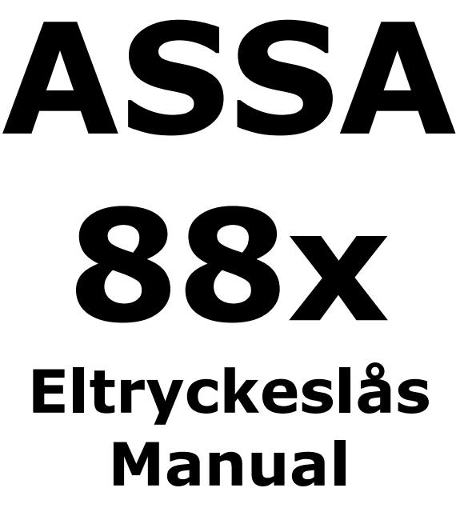

Denna manual avser följande lås: ASSA 880-50, 881-50, 884-50, 885-50, 886-50 880-70, 881-70, 884-70, 885-70, 886-70

Manual in English? Please turn over

ASSA ABLOY, the global leader in door opening solutions, dedicated to satisfying end-user needs for security, safety and convenience.

ASSA AB P.O. Box 371 SE-631 05 Eskilstuna Sweden

phone +46 (0)16 17 70 00 fax +46 (0)16 17 72 10

Customer support: phone +46 (0)771 640 640 fax +46 (0)16 17 73 72 e-mail: helpdesk@assa.se

www.assa.se

## **1. 88x serien, varianter**

Assa 88x serien består av två huvudtyper med fem varianter

- Enkla eltryckeslås (880, 881) har dubbelsidig elektrisk manövrering
	- Förreglad fall (880, 881)
	- Mekanisk regel (881)
- Eltryckeslås med splitfunktions (884, 885, 886) där ut- och insidans trycke har olika funktion
	- Förreglad fall (884, 885, 886)
	- Mekanisk regel (885, 886)
	- Engreppsöppning (886)

# **2. Rättvänd / Omvänd funktion**

Gäller 880, 881, 884, 885, 886. Fabriksinställning är rättvänd funktion

Ändring till omvänd funktion, eller vice versa, utförs enkelt på plats.

- Ta bort plastpluggarna (1)
	- **Rättvänd funktion** (leveransinställning) = När skruven är monterad till höger (närmast låshusets rygg)
	- **Omvänd funktion** = När skruven är monterad till vänster (närmast stolpen)
- Tryck monteringsröret (2), över skruvskallen, till botten av det hål där skruven är monterad.
- Skruva ur skruven med monteringsröret kvar i botten av hålet
- Dra ut skruven med hjälp av monteringsröret
- För ner skruven, med monteringsröret, i hålet för önskad funktion
- Dra åt skruven, tag bort monteringsröret
- Tryck tillbaka plastpluggarna
- **Funktionsprova**

# **3. Höger- eller vänsterhängda dörrar**

Gäller 880, 881, 884, 885, 886. Fabriksinställning är höger.

Byte från höger till vänster, eller vice versa, utförs enkelt på plats

- Skruva ur skruvarna (1)
- Dra ut, vänd och tryck tillbaka fall och förregling i låshuset
- Dra åt skruvarna (1) igen
- **Funktionsprova**

|                 |   |   |   | 880 881 884 885 886 |   |
|-----------------|---|---|---|---------------------|---|
| Förreglad fall  | X | X | X | X                   | X |
| Mekanisk regel  |   | X |   | X                   | X |
| Split funktion  |   |   | X | X                   | X |
| Engreppsöppning |   |   |   |                     | X |

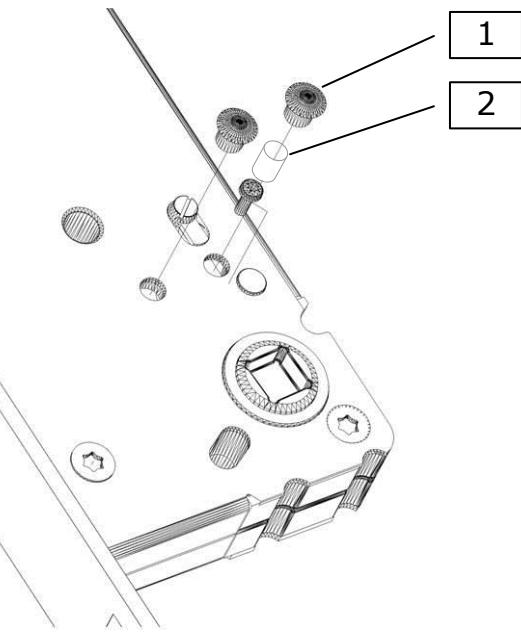

# **4. Mekanisk / Elektrisk funktion**

Gäller 884, 885, 886.

Fabriksinställning är mekanisk funktion på bägge sidor.

Ändring till elektrisk funktion, eller vice versa, utförs enkelt på plats.

- Inställning av funktion sker individuellt på var sida av låshuset
- Skruven (1) i sitt övre läge (som visas på bilden) = denna sida är elektriskt manövrerad
- Skruven (1) i sitt nedre läge = denna sida är mekaniskt manövrerad
- Lossa skruven (1) c:a 2 varv, behöver INTE skruvas ur helt
- Vrid lägessäkringen (2) 180°
- Drag åt skruven (1)
- **Funktionsprova**

**OBS!** Vid behov ändras funktionen på andra sidan också; dvs. det möter inga hinder att ställa bägge sidor i elektrisk eller mekanisk funktion

### **5. Engreppsöppning**

Gäller 886.

886 erbjuder engreppsöppning dvs. ut- och insidans trycke drar in både hakregel och fall.

På lås med **rättvänd** funktion går engreppsöppning från elektriskt kontrollerad sida går att koppla bort. För att **koppla bort engreppsöppning** från elektriskt kontrollerad sida, använd bipackad adapterkabel.

- Anslut adapterkabeln till 6-polig kontakt från låset (1) och 6-polig kontakt på anslutningskabeln
Rekommenderad anslutning (a)

- Anslut den 3-poliga kontakten på adapterkabeln till regel ute indikeringen (blå, vit, röd ledare) **OBS!** om regel ute indikering krävs för extern utrustning, se alternativ anslutning
- Klipp av grön ledare (a)

Alternativ anslutning (b), när regel ute indikering krävs till extern utrustning

- Anslut den 3-poliga kontakten på adapterkabeln till regel inne indikeringen (grön, svart, gul ledare)
- Klipp av röd ledare (b)

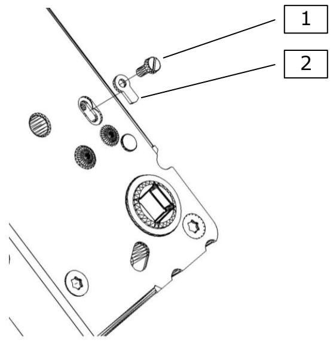

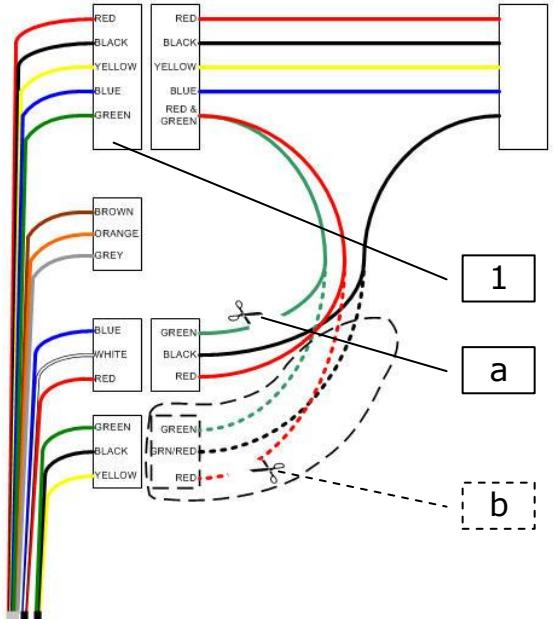

# **6. Inkoppling**

88x

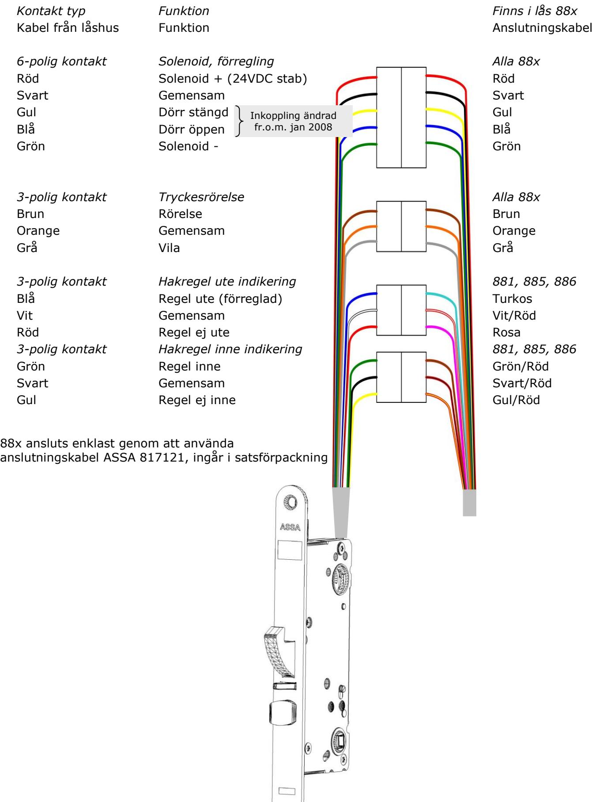

## **7. Tekniska data**

| Spänning         | 12-24VDC Stab ± 15 %    |
|------------------|-------------------------|
| Strömförbrukning | 350mA                   |
| Mikrobrytare     | Enpoligt växlande NO/NC |
|                  | Max. 100mA vid 30VDC    |
| Anslutningskabel | 817121, 10m             |

#### **Förpackningar**

Satsförpackning: Låshus, Kabel 817121, Slutbleck 1487-2,

Tryckespinnar 2x43mm, Fästmaterial, Kabelöverföring EA281 och Manual

Låshus:

Låshus och Manual

### **8. Tillbehör**

| ASSA                | 88x                                  |  |
|---------------------|--------------------------------------|--|
| Cylinder typ     | Oval                                 |  |
| Slutbleck           | 1487-1, -2*, -3, -4, -5           |  |
| Kabel               | 817121*                              |  |
| Kabel överföring | EA280, EA281*                        |  |
| Cylinder behör   | 256                                  |  |
| Öppnings beslag  | 8061                                 |  |
| Trycke              | Returfjädertrycke rekommenderas   |  |
| Tryckes pinnar   | ASSA split spindle tryckespinnar* |  |

* Ingår i satsförpacknin

## **9. Underhåll av eltryckeslås**

**Det viktigaste är att följa monteringsanvisningen, och ej avvika från den utan att först rådfråga oss på ASSA.** 

#### **Garantin förfaller om:**

- Produkten är felaktigt monterad
- Produkten är öppnad (sigillet brutet) eller om kablar/kontakter klippts av
- Installerad med tillbehör eller delar som inte rekommenderats av ASSA

### **Underhåll:**

- Se till att monterade cylindrar, vred och trycken fungerar tillfredsställande.
- Smörj och/eller justera vid behov.
- Elektriska delar behöver inget underhåll.
- Mekaniska delar på låshuset bör smörjas minst två gånger om året. Högfrekvent användning av låsen kräver underhåll med tätare intervall.
- Det är också viktigt att underhålla och vid behov, justera dörrstängare och gångjärn för att säkerställa en korrekt stängning av dörren. En bra dörrfunktion är en viktig förutsättning för en bra låsfunktion.

### **OBS!**

#### **Använd aldrig smörjmedel som innehåller grafit eller lösningsmedel, använd endast smörjmedel för elektriska lås från ASSA.**

Om något är oklart angående installation, underhåll eller garantier, tveka inte att kontakta oss på ASSA.

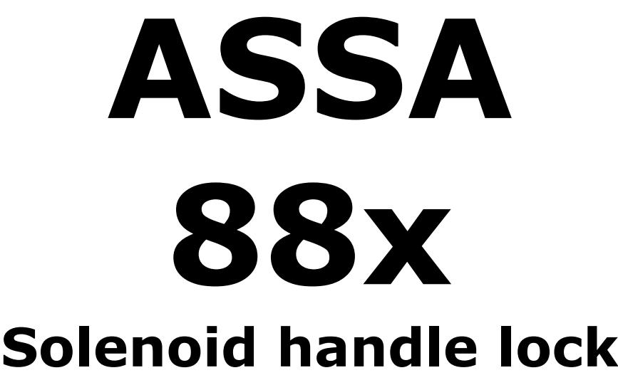

This manual complies with: ASSA 880-50, 881-50, 884-50, 885-50, 886-50 880-70, 881-70, 884-70, 885-70, 886-70

**Manual**

Manual på svenska? Var god vänd

ASSA ABLOY, the global leader in door opening solutions, dedicated to satisfying end-user needs for security, safety and convenience.

ASSA AB P.O. Box 371 SE-631 05 Eskilstuna Sweden

phone +46 (0)16 17 70 00 fax +46 (0)16 17 72 10

Customer support: phone +46 (0)771 640 640 fax +46 (0)16 17 73 72 e-mail: helpdesk@assa.se

www.assa.se

### **1. 88x series, overview**

Assa 88x series consists of two main types with five versions

- Basic type (880, 881); electrically controlled from outside and inside
	- Dead latched (880, 881)
	- Mechanical hook bolt (881)
- Split spindle type (884, 885, 886); alternative operation settings of out- and inside handle
	- Dead latched (884, 885, 886)
	- Mechanic hook bolt (885, 886)
	- Single hand action (886)

## **2. Fail locked / fail unlocked operation**

Applies to: 880, 881, 884, 885, 886. Factory default is fail locked operation.

Changeover to fail unlocked operation, or vice versa, is easily performed on site.

- Remove plastic covers (1)
	- **Fail locked operation** (factory default) = Screw placed in right hand position (towards back of lock case)
	- **Fail unlocked operation** = Screw placed in left hand position (towards face plate)
- Press assembly tube (2), over screw head, to bottom of the hole where the screw is placed.
- Unscrew screw, assembly tube still kept toward bottom of hole
- Pull out screw using assembly tube
- Place screw, using assembly tube, in position of required operation
- Re-tighten screw, pull out assembly tube
- Put back plastic covers
- **Perform operational test**

## **3. Right- or left handed doors**

Applies to 880, 881, 884, 885, 886. Factory default is right handed.

Changeover to left handed, or vice versa, is easily performed on site.

- Unscrew the screws (1)
- Pull out latch- and trigger bolt, set handing, and push back.
- Re-tighten screws (1)
- **Perform operational test**

|                      |   |   | 880 881 884 885 886 |   |   |
|----------------------|---|---|---------------------|---|---|
| Dead latched         | X | X | X                   | X | X |
| Mechanical hook bolt |   | X |                     | X | X |
| Split spindle        |   |   | X                   | X | X |
| Single hand action   |   |   |                     |   | X |

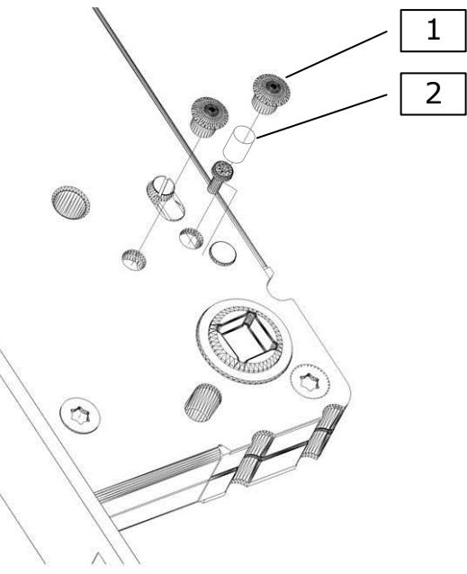

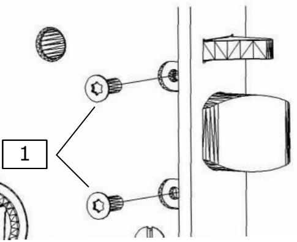

# **4. Electrical / Mechanical operated side**

Applies to 884, 885, 886.

Factory default is mechanical operation on both sides.

Changeover to electrical operation, or vice versa, is easily performed on site.

- Individual operation setting on each side
- Screw (1) in upper position (showed in picture) = This side is electrically operated
- Screw (1) in lower position = This side is mechanically operated
- Loosen screw (1) approx. 2 turns, do NOT fully unscrew
- Turn position stabiliser (2) 180°
- Re-tighten screw (1)
- **Perform operational test**

**NB!** If needed, change operational setting on opposite side; i.e. same setting on both sides is possible.

# **5. Single hand action**

Apply to 886 only.

886 offers single hand action i.e. outside and inside lever handle retracts both latch and hook bolt.

If lock is set in **fail locked** operation, single hand action from electrically operated side can be disabled. To **disable single hand action** on electrically operated side, connect supplied adaptor cable.

- Connect adaptor cable to 6-pole connector on lock (1) and 6-pole connector on cable
Suggested connection (a)

- Connect 3-pole adaptor cable connector to bolt out monitoring connector (blue, white, red wire) **NB!** If bolt out monitoring is required for external equipment, see optional connection.
- Cut green wire (a)

Optional connection (b), when bolt out monitoring is required for external equipment

- Connect 3-pole adaptor cable connector to bolt in monitoring connector (green, black, yellow wire)
- Cut red wire (b)

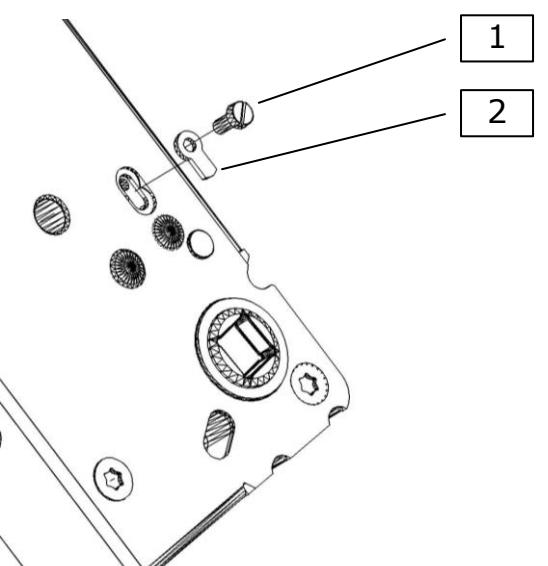

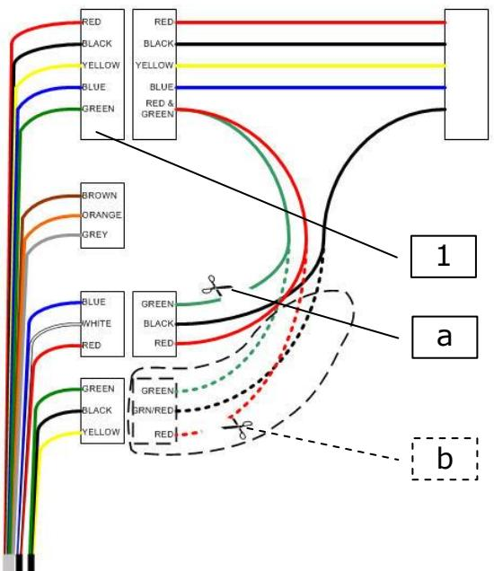

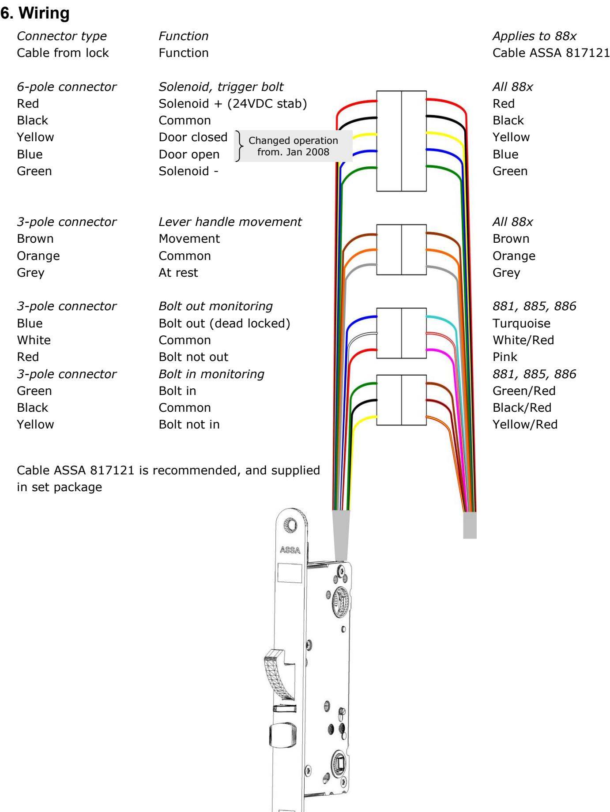

### **4. Technical data**

| Voltage          | 12-24VDC Stabilized ± 15%             |
|------------------|---------------------------------------|
| Current          | 350mA                                 |
| Micro switches   | Changeover NO/NC rated 100mA@30VDC |
| Connecting cable | 817121, 10m                           |

#### **Contents in package**

Set package: Lock case, Cable 817121, Strike plate 1487-2, Spindles 2x43mm, Fitting screws, Manual Lock case: Lock case and Manual

### **8. Accessories**

| ASSA                      | 88x                                     |  |
|---------------------------|-----------------------------------------|--|
| Cylinder type          | Scandinavian oval                    |  |
| Strike plate              | ASSA 1487-1, - 2*, -3, -4, -5     |  |
| Cable                     | ASSA 817121*                            |  |
| Cable loop                | EA280, EA281                         |  |
| Cylinder accessories   | ASSA 256                                |  |
| Plastic dome accessory | ASSA 8061                               |  |
| Lever handle              | Sprung bolt through lever handles |  |
| Spindles                  | ASSA split spindles*                 |  |

* Supplied in set packages

#### **9. Maintenance of solenoid handle locks Follow this manual thoroughly to maintain characteristics of the unit. Do not diverge from this manual without advice from ASSA.**

#### **Warranty fails if product is:**

- Wrongly installed
- Opened by unauthorised personnel (broken seal) or if cables/connectors have been cut
- Fitted with accessories or parts not recommended by ASSA

#### **Maintenance:**

Approximately twice a year, a small amount of designated grease should be applied on latches and bolts. Highly frequented doors may need maintenance with shorter intervals.

- Electric parts need NO maintenance
- To maintain desired operation and security level of installed unit, it is of great importance to check and adjust the entire door environment:
	- Lock case and strike plate
	- Lock accessories (Lever handle, thumb turn etc.)
	- Hinges, framework and door threshold (sill)
	- Door closer

#### **NB!**

supplier.

**Never use lubricants containing graphite or solvent, use designated grease from ASSA only.** If any uncertainty regarding installation, maintenance or warranty occurs, please contact ASSA or your local