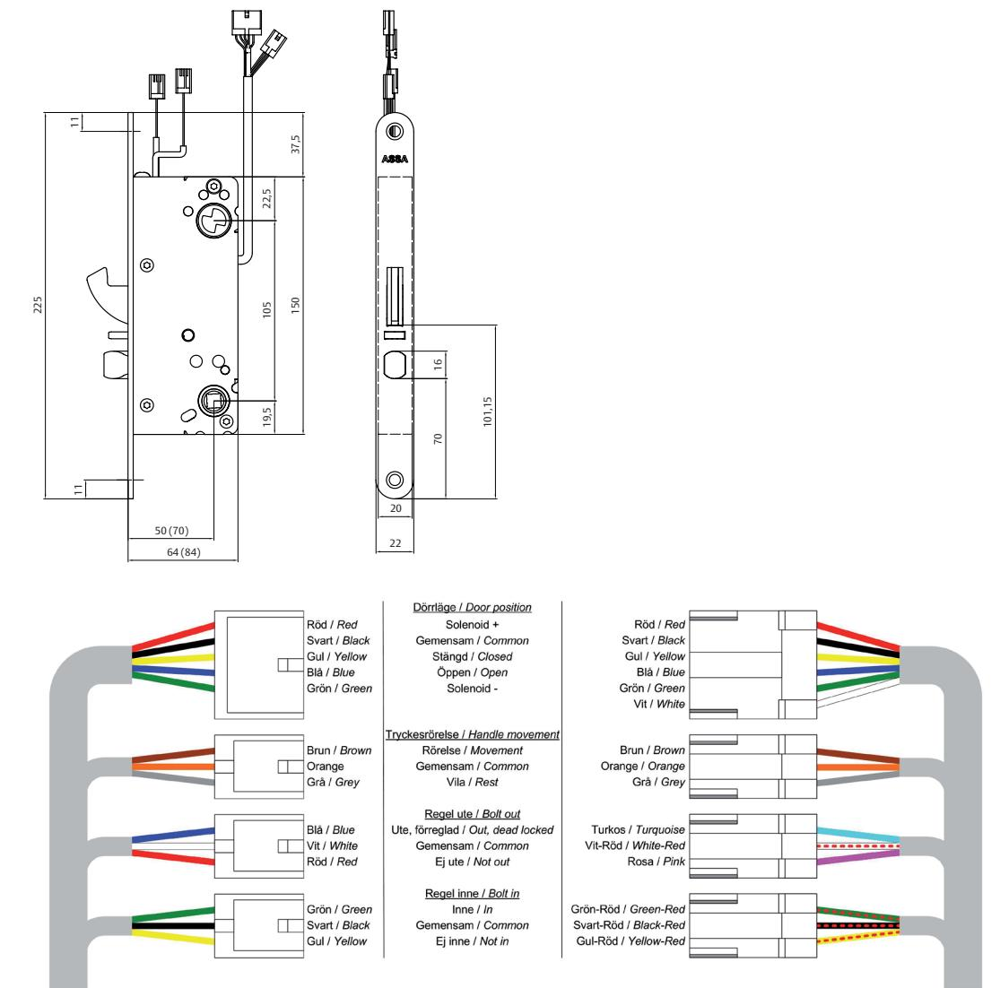

## ASSA Evolution eltryckeslås

### 880, 881, 884, 885, 886 Elektromekanisk låsning

Hakregel ger ökad brythållfasthet Fördelen med hakregel är att den kopplar ihop dörr och karm och ger ett extra starkt inbrottsskydd.

#### **Användningsområde**

Multifunktionellt eltryckeslås i Evolutionutförande. ASSA Evolution eltryckeslås är anpassade för högfrekventa dörrar med ASSA modulurtag.

Passar bra som daglåsning och intern låsning inom handel, kontor och industri eller i entréer och allmänna utrymmen i flerfamiljshus.

ASSA Evolution eltryckeslås är godkänt för montage i brandcellsgräns (TG 0456/01).

#### **Funktion**

ASSA Evolution 88x är en familj av eltryckeslås med två huvudtyper och fem varianter:

- • Enkelt (880, 881)
	- Ut- och insidans trycke elektriskt manövrerade - Mekanisk hakregel (881)
- • Split funktion (884, 885, 886)
	- Utsidans trycke elektriskt manövrerat
	- Insidans trycke öppnar alltid mekaniskt
	- Mekanisk hakregel (885, 886)
	- Engreppsöppning (886)

#### **Egenskaper**

- • Förreglad tryckesfall
- • Låset kan alltid manövreras med cylinder/vred
- • Multifunktionellt
	- 12 24 VDC, stab.
	- Enkelt omställbart rättvänd/omvänd funktion
- Enkelt omställbart elektriskt/mekaniskt manövrerad sida (884, 885, 886)
- • 4 mikrobrytare
- Förregling (dörrläge) (alla)
	- Regel ute (881, 885, 886)
	- Regel inne (881, 885, 886)
	- Insidans trycke (884, 885, 886)
- • Mekanisk regel
	- Manövreras med cylinder/vred (881, 885)
- Låses med cylinder/vred, låses upp med trycke alt. cylinder/vred (886)
- • 50 eller 70 mm dorndjup (88x-50 respektive 88x-70)
- • Alla kablar är försedda med kontakter för enkel installation med anslutningskabel 81 71 21

# ASSA Evolution eltryckeslås

## 880, 881, 884, 885, 886 Elektromekanisk låsning

ASSA ABLOY, the global leader in door opening solutions, dedicated to satisfying end-user needs for security, safety and convenience.

ASSA AB P.O. Box 371 SE-631 05 Eskilstuna Sweden

phone +46 (0)16 17 70 00 fax +46 (0)16 17 72 10

Customer support: phone +46 (0)771 640 640 fax +46 (0)16 17 73 72 e-mail: helpdesk@assa.se

- **Lås Förreglat fall Regel Split funktion Engreppsöppning Ersätter** ASSA Evolution 880 X 8030 ASSA Evolution 881 X X 8025 ASSA Evolution 884 X X 8098 ASSA Evolution 885 X X X 8065 ASSA Evolution 886 X X X X 8020
- **Teknisk data**
- 

60 mA, 24 VDC

• Strömförbrukning 130 mA, 12 VDC • Mikrobrytare Enpoligt växlande Max. 50 VDC, 100 mA

### **Tillbehör**

- • ASSA ovala eller runda cylindrar
- • ASSA trycken med returfjäder
- • ASSA tryckespinnar för split funktions lås*
- • ASSA Evolution slutbleck*
- • Anslutningskabel 81 71 21*
- • Kabelöverföring EA 280/EA 281*
- * ingår i satsförpackning

M1368.0708