**GEZE** DÖRRTEKNIK

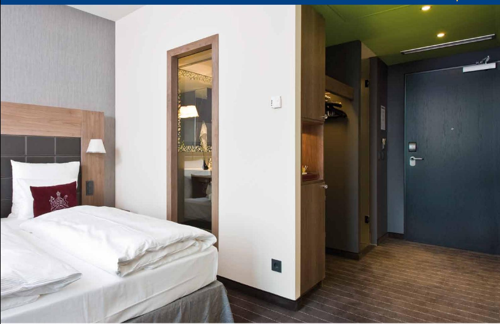

# G E Z E T S 2000 V Dörrstä nga re med arm

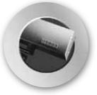

Dørteknik

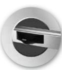

**DØRSYSTEMER**

**dörrsystem**

**DØRTEKNIK AUTOMATISKE** 

**Dörrteknik Automatiska**

Dørsystemer

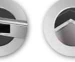

logoer 1 09/03/10 14.29

**Glassystemer**

> Røgventilation

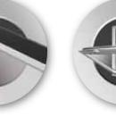

Sikkerhedsteknik

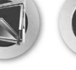

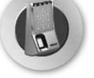

**VENTILATION OG RØGVENTILATION Komfort- och rökventilation**

**GLASSYSTEMER SIKKERHEDSTEKNIK Glassystem Säkerhetsteknik**

Glassystemer

Bewegu ng mit System

## Dörrteknik GEZE TS 2000 V Dörrst ängare med arm

**GEZE ts 2000 V**

TS 2000 V är en av GEZE's standardmodeller, en kompakt men stark dörrstängare avsedd för invändiga slagdörrar där man ställer höga krav på funktionalitet. Justering av funktioner sker från fronten med termostabila justerskruvar som har stopp i öppet läge för att undvika oljeläckage. Stängningskraften justeras genom att ändra dörrstängarens läge på dörrbladet. Naturligtvis är TS 2000 V även godkänd för brandklassade dörrar. Hög kvalitet, enkelt montage och stilren design är krav som vi ställer på alla våra dörrstängare.

### **Användningsområde:**

- j För invändiga slagdörrar
- j För både vänster- och högerhängd dörr
- j Dörrbladsmontage på gångjärnssidan eller karmmontage på anslagssidan
- j Godkänd för branddörrar enl EN 1154

#### **Produktegenskaper:**

- j Stilren design
- j Termostabila ventilskruvar
- j Justerbar stängningskraft storlek 2/4/5
- j Justerbar stängningshastighet 180-0°
- j Justerbar tillslagskraft 10-0°
- j Dörrbredd upptill 1250 mm
- j Standardfärg: Silver, vit, RAL 9016
- j Specialfärger enligt RAL- eller NCS-skala

| ID nr. | Beteckning                 | Utförande    | ID nr. |
|--------|----------------------------|--------------|--------|
|        | GEZE Dörrstängare TS 2000V | Silver       | 103386 |
|        | storlek 2/4/5, utan arm    | Vit RAL 9016 | 103388 |
|        | Standardarm                | Silver       | 102421 |
|        |                            | Vit RAL 9016 | 102423 |

#### Dörrteknik GEZE TS 2000 V Dörrst ängare med arm 45

#### **Mått Ts 2000 V**

60

344

319

294

5084

60

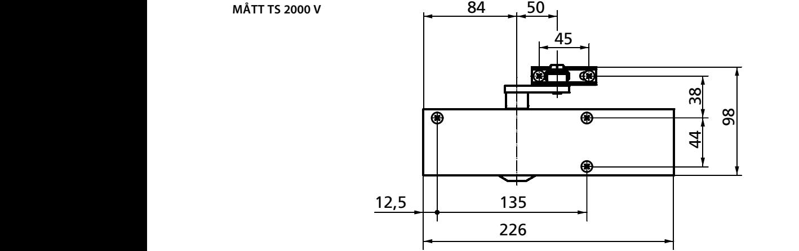

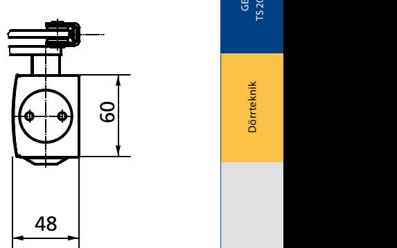

344

319

294

5084

#### **Montage**

på gångjärnssidan

344

319

294

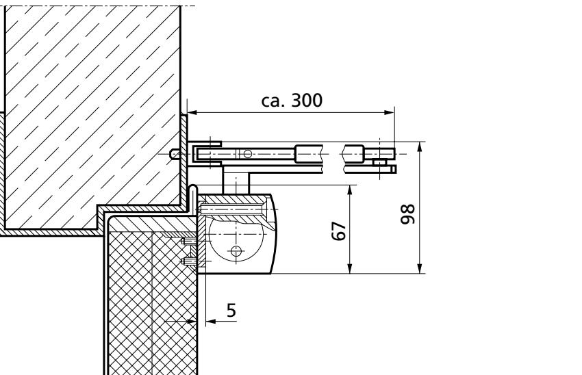

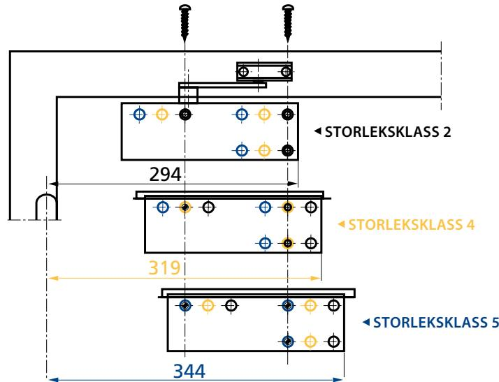

Montagemått storleksklassser Dörrteknik

45

12,5 135

45

44

ca. 300

5

98

44

ca. 300

5

67

98

 38

67

98

 38

98

5084

#### **Tillbehör:**

#### j Montageplatta dörrstängarhus

- j Klämplatta till helglasdörr
- j Parallellarmfäste
- j Axelförlängare
- j Förlängd standardarm
- j Uppställningsarm utan frånkopplingsmöjlighet upp till 150°
- j Uppställningsarm i- och urkopplingsbar upp till 150°
- j Täckkåpa i rostfritt och mässing

**TS 20000 varianter:**

- j TS 2000 V Standard
- j TS 2000 V BC Med öppningsbroms

| OM | GEZE |
|----|------|
|    |      |

GEZE Scandinavia AB är ett helägt dotterbolag till GEZE GmbH. GEZE är en världsledande tillverkare av manuella och automatiska dörr- och fönsterteknologisystem med dotterbolag och produktion runt om i världen. Sedan starten 1863 har design, funktion och innovation varit det centrala i GEZE´s filosofi. För marknaden betyder det den senaste tekniken, kvalitet, funktionalitet och formskön design.

Vi arbetar i nära samarbete med marknadens aktörer, tillsammans utvecklar vi lösningar som förvandlar ambitiösa visioner till verklighet.

#### **GEZE Scandinavia**

**GEZE Sverige**

Mallsingan 10 Box 7060 S-187 11 Täby Tel. +46 (0) 8-732 34 00 Fax +46 (0) 8-732 34 99 E-mail: sverige.se@geze.com www.geze.se

#### **GEZE Danmark**

Mårkærvej 13 J-K DK-2630 Taastrup Tel. +45 46 32 33 24 Fax +45 46 32 33 26 E-mail: danmark.se@geze.com www.geze.dk

#### **GEZE Norge**

Industrivegen 34B NO-2072 Dal Tel. +47 63 95 72 00 Fax +47 63 95 71 73 E-mail: norge.se@geze.com www.geze.no

Bewegu ng mit System