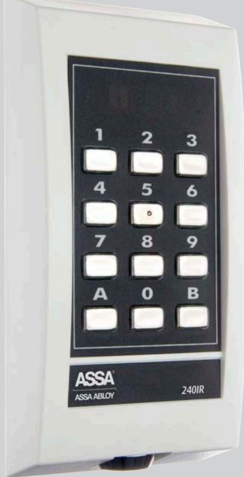
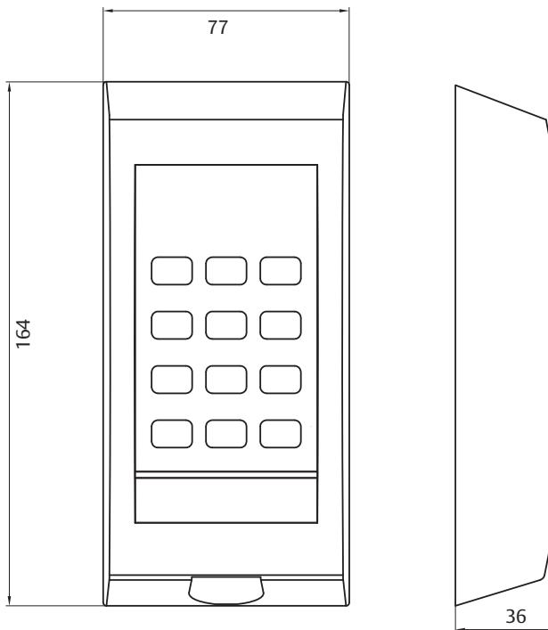

240IR skiljer sig från de vanliga kodlåsen i och med att postkoden överförs med en "fjärrkontroll" istället för med en knappsats. Ett stort bekymmer för fastighetsägare och boende är att postkoderna lätt hamnar i fel händer. Brevbäraren och tidningsbudet låser upp porten med sin fjärrkontroll som sänder IR-ljus till kodlåsets mottagare.

De boende kommer in på vanligt sätt genom att knappa in boendekoden. På så sätt släpps endast behöriga in i fastigheten vilket leder till säkrare boende.

Fastighetsägaren bestämmer själv vilka IR-kanaler som ska ha tillträde till fastigheten. Ändring av IR-kod sker automatiskt med IR-sändaren, vilket gör att fastighetsägaren inte behöver administrera detta. Aktuell kod är inte känd av brevbäraren.

Dörr med detta kodlås låses omedelbart då dörren stängs om elslutbleck med kolvkontakt är anslutet. Detta möjliggörs tack vare den inbyggda nedbrytningsfunktionen.

# **Indikeringar**

- • Programmeringsläge
- • Programmering godkänd
- • Programmering ej godkänd
- • Felslagsblockering
- • Olåst
- • "Tangenttryck"

### **Material**

- • Gjuten zinkreglering med vit eller svart pulverlack som standard
- • Rostfria tryckknappar
- • Gjuten bottenplatta

#### **Data**

- • Matningsspänning: 12-24 V AC/DC
- • Maximal strömförbrukning: 240IR = 110 mA
- • Utgång, fri reläslutning: max 24 V/1A

# **Tillbehör**

- • RST35/90 Regnskydd
- • 6170RS Regnskydd
- • TMV01 Tillgänglighetsfäste

### **Övrigt**

- • Sju IR-kanaler
- • Två 4- eller 6-siffriga koder
- • Kod 5 och 6 kan gemensamt blockeras via till exempel kopplingsur
- • Felslagsblockering
- • Automatisk nedbrytning av öppningstiden
- • Uppfyller kraven för IP54
- • Låsbar kapsling
- • Belyst knappsats

#### **Artikelnummer**

| •	 240IR Vit   | S532 300 167 |
|----------------|--------------|
| •	 240IR Svart | S532 300 164 |

- • IR Testsändare S531 250 184
- • 120IR -IR-mottagare för S531 200 185 komplettering av befintligt kodlås

phone +46 (0)16 17 70 00 fax +46 (0)16 17 72 10 Customer support: phone +46 (0)771 640 640 fax +46 (0)16 17 73 72 e-mail: helpdesk@assa.se

ASSA ABLOY, the global leader in door opening solutions, dedicated to satisfying end-user needs for security, safety and

ASSA AB P.O. Box 371 SE-631 05 Eskilstuna Sweden

convenience.