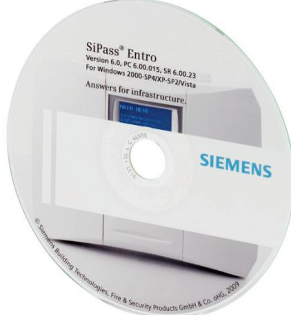

## **SiPass® Entro software** Access Control

MP 6.55

- **Ideal for organizations of all sizes**
- **Powerful, easy-to-use software**
- **Support for wireless communication**
- **Integration with SISTORE DVRs**
- **Integrated reservation function**
- **Photo ID card printing**
- **Open system for easy integration**
- **Reliable and secure**

The SiPass Entro software is Windows-based and very easy to use. It can communicate with system hardware via direct connection (COM), local and global networks (LAN/WAN), TCP/IP or modem. The software supports various operating authorizations – for example, reception personnel may be authorized only to handle card activation while administrators are authorized to implement basic modifications of the system.

The software provides sophisticated event control and search functions with graphical icons for door monitoring in addition to common tasks like card administration. It also includes alarm bypass control with alarm status feedback (ASF), anti-passback, rollcall, interlock function, elevator control, photo ID, and many other useful features.

The template design tool in the SiPass Entro software makes it possible to design personalized ID cards and print them using standard Windows printer drivers.

It is also very easy to define alarm zones using the SiPass Entro software. At each reader or door assigned to an alarm zone, the alarm can be activated or deactivated. SiPass Entro's Alarm Status Feedback (ASF) function can indicate the status (armed/disarmed) of the zone at any reader in the zone (via the red reader LED). In applications that include SISTORE DVRs, the SiPass Entro software fully integrates the DVRs into the access control system, which makes event-triggered recording very easy.

An integrated Web-based reservation function is also included in the software. It is ideal for managing access to conference rooms, sport facilities, clubs, and so on. Reservation can be done via the Internet or via an InfoPoint reservation terminal. The software also includes an open TCP/IP interface (BAPSI) to third-party applications.

In cases where wireless components (i.e. RF30-EM and RF9) are used in a SiPass Entro system, the SiPass Entro software handles those components in a similar way as it handles wired ones.

The SiPass Entro software is available in the following languages: Czech, Danish, Dutch, English, Finnish, French, German, Italian, Norwegian, Polish, Portuguese, Spanish and Swedish.

|                                  | SiPass Entro software                                |  |  |
|----------------------------------|------------------------------------------------------|--|--|
| System requirements              | Processor 1 GHz                                      |  |  |
|                                  | 512 Mb RAM                                           |  |  |
|                                  | CD-ROM drive.                                        |  |  |
|                                  | VGA colour monitor 1024 x 768.                       |  |  |
|                                  | Local Area Network connection (or serial port for    |  |  |
|                                  | connection of segment controller/modem).             |  |  |
| Operating system support         | Windows 8.1, Windows 8, Windows 7,                   |  |  |
| (all x86 and x64)                | Windows Vista and Windows XP.                        |  |  |
|                                  | Windows server 2012 R2, 2012, 2008 R2, 2008,         |  |  |
|                                  | 2003 R2 and 2003.                                    |  |  |
|                                  | Special License for terminal server usage avail      |  |  |
|                                  | able                                                 |  |  |
| Basic network requirements       | Twisted-pair Ethernet 10/100 Mbit.                   |  |  |
|                                  | Static or dynamic (DHCP) IP-address for SR35i.       |  |  |
|                                  | Stable Internet connection of SR35i (when Inter      |  |  |
|                                  | net is used).                                        |  |  |
| Requirements for modem           | 9600 baud on DTE.                                    |  |  |
|                                  | Autoanswer disabled.                                 |  |  |
|                                  | Ignore DTR.                                          |  |  |
|                                  | Local echo disabled.                                 |  |  |
| Recommendation for modem         | Watchdog should be included. Will reset the          |  |  |
|                                  | modem if' for example' communication stops.          |  |  |
| Door capacity                    | 512 wired and 512 wireless (RF30-EM)                 |  |  |
| Card capacity                    | 40,000                                               |  |  |
| Access groups                    | 450                                                  |  |  |
| Time schedules                   | 240                                                  |  |  |
| Zones                            | 240 global zones, including: alarm control with      |  |  |
|                                  | ASF, anti-passback, roll-call, en-trance limitation, |  |  |
|                                  | interlock.                                           |  |  |
| Elevator control                 | Yes, up to 192 floors.                               |  |  |
| Built-in reservation function    | Yes, up to 64 reservation objects.                   |  |  |
| Machine control                  | Yes, in conjunction with reservation.                |  |  |
| Door configuration               | Entry and Exit readers.                              |  |  |
| Day&Night lock control           | Yes, with DC22 door controller.                      |  |  |
| Software                         | Client-based software supplied on CD-ROM that        |  |  |
|                                  | can support up to 10,000 systems/sites.              |  |  |
| Standard languages               | English, German, French, Spanish, Dutch, Dan         |  |  |
|                                  | ish, Norwegian, Czech, Italian, Polish, Portu        |  |  |
|                                  | guese, Swedish and Finnish                           |  |  |
| Multiple-user database           | Up to 16 clients.                                    |  |  |
| Administrator rights             | Configurable in 5 different levels.                  |  |  |
| Backup/restoration of system     | Manual and automatic through mirrored data           |  |  |
| data                             | base.                                                |  |  |
| Import/export of cardholder data | Yes                                                  |  |  |
| Event log                        | Yes, with real-time update.                          |  |  |
| Event buffer                     | 10,000 in offline mode                               |  |  |
| Export of events                 | Yes                                                  |  |  |

- One SISTORE DVR per segment controller.
- Maximum of 16 DVRs and 128 cameras in total per SiPass Entro system.

## **2 Web Browser compatibility**

All browsers from Microsoft "Browswerchoice" listed on www.browserchoice.eu

| Browser           | 32 / 64 bit | Version         | Win7   | Win8 | WinXP |
|-------------------|-------------|-----------------|--------|------|-------|
|                   |             |                 | x64    | x64  | x86   |
| IE 8              | 32          |                 | #      | #    | OK    |
| IE 9              | 32          | 9.0.8112.16421  | OK     | #    | ##    |
| IE 9              | 64          | 9.0.8112.16421  | OK     | #    | ##    |
| IE10              | 32          | 10.0.9200.16384 | #      | OK   | ##    |
| IE 10             | 64          | 10.0.9200.16384 | #      | OK   | ##    |
| Firefox           | 32          | 20.0.1          | OK     | OK   | OK    |
| Chrome            | 32          | 26.0.1410.64m   | OK     | OK   | OK    |
| Safari            | 32          | 5.1.7           | * 1    | * 1  | * 1   |
| Opera             | 32          | 12.15           | OK     | OK   | OK    |
| Maxthon           | 32          | 4.0.5.4000      | OK     | OK   | OK    |
| Avant Browser     | 32          | 2013.23         | OK     | OK   | OK    |
| Sleipnir          | 32          | 4.1.0.4000      | OK     | OK   | OK    |
| Rockmelt          | 32          | 0.16.91.483     | OK     | OK   | OK    |
| Lunascape Browser | 32          | 6.8.3           | OK     | OK   | OK    |
| K-Meleon          | 32          | 1.5.4           | NOK *2 | #    | OK *3 |
| SRWare IRON       | 32          | 26.0.1450.0     | OK     | OK   | OK    |
| Comodo            | 32          | 26.2.2.0        | OK     | OK   | OK    |

# --> not tested

## --> not supported by OS

* 1 --> NO Java Support in Browser

* 2 --> x64 not supported with Java. Problems with old Java engines on x64 OS

* 3 --> only working with Java 1.50.22 and lower.

K-Meleon = old browser engine. No support for Java 6 or higher. Lower Java versions only work on XP.

## **3 Details for ordering**

| Type              | Part no         | Designation                              |
|-------------------|-----------------|------------------------------------------|
| Entro SW SE       | S24246-P8601-A1 | SiPass Entro software – Standard edition |
| Entro SW SE + IF1 | S24246-P8602-A1 | SiPass Entro software (Standard edition) |
|                   |                 | plus IF1 interface box                   |
| Entro SW SEUL     | S24246-P8600-A1 | Additional licence for SiPass Entro      |
|                   |                 | software – Standard edition              |
| Entro SW TS       | S54511-P3-A1    | SiPass Entro software – Terminal Server  |
|                   |                 | edition                                  |
| Entro SW TSUL     | P54511-P4-A1    | Additional license for SiPass Entro soft |
|                   |                 | ware – Terminal Server edition           |
|                   |                 |                                          |

Issued by

Siemens AB Infractructure & Cities Security Products International Headquarters Englundavägen 7 SE -171 24 Solna Tel. +46 8 629 0300 www.siemens.com/securityproducts

Document no. **A6V10074307** Edition 09.09.2014

© 2014 Copyright by Siemens AB

Data and design subject to change without notice. Supply subject to availability.