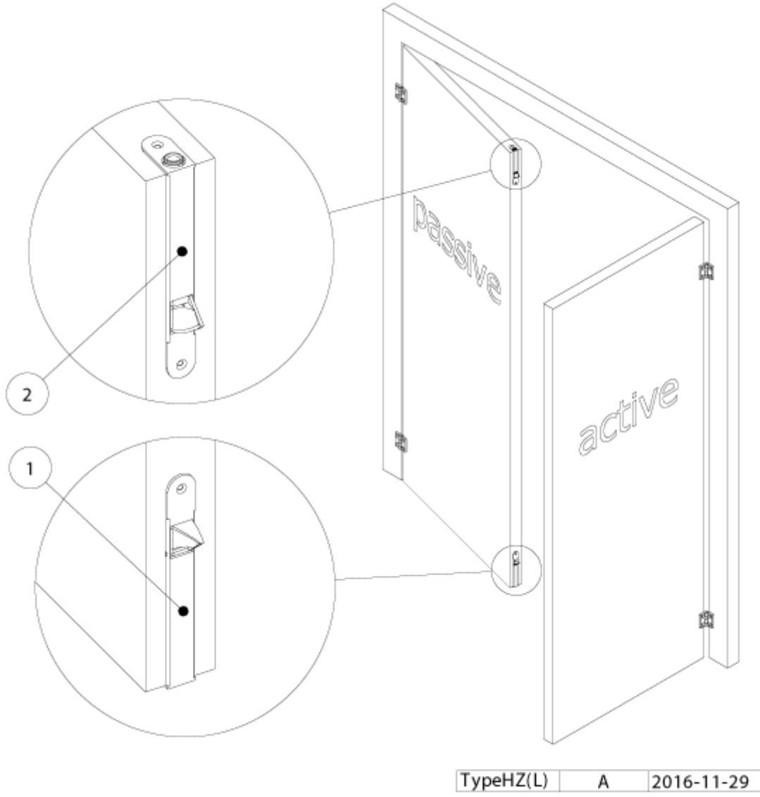
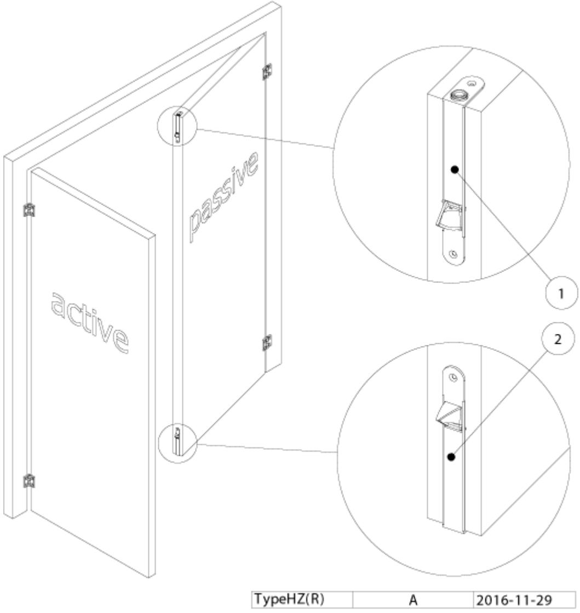

# **OLDA kantreglar**

Kantreglar används på dubbla slagdörrar, så kallade "pardörrar" för låsning av passivt dörrblad. (Det passiva dörrbladet är det som normalt ej används vid passage.)

#### **Manuell kantregel**

Frigöring samt låsning av passivt dörrblad sker manuellt. Alla våra manuella kantreglar manövreras med en hävarms-mekanism.

### **Automatisk kantregel**

Frigöring av passivt dörrblad sker automatiskt vid öppning av aktivt dörrblad, då regelns fallkolv frigörs. Låsning sker automatiskt vid stängning av aktivt dörrblad, då fallkolven trycks in och därmed aktiverar regeln. Automatiska kantreglar rekommenderas ofta när brandkrav föreligger.

## **Halv-automatisk kantregel**

Frigöring av passivt dörrblad sker manuellt. Låsning sker automatiskt när passivt dörrblad stängs. Regeln är konstant aktiverad, detta medför att kantregeln endast kan monteras upptill i passivt dörrblad. Rekommenderas som ett komplement där automatisk kantregel monterats nedtill i passivt dörrblad. Med denna installation erhålles enkel öppning samt säker låsning i två steg, vilket bidrar till att det krävs mindre kraft vid stängningsmomentet.

#### **Hur väljer jag rätt typ av kantregel?**

OLDA automatiska och halv-automatiska kantreglar beställs och monteras enligt följande:

*Det "passiva" dörrbladet är det som normalt ej används vid passage.*

Om vänster dörrblad är passivt:

Välj kantregel **typ2** ("höger") vid montering upptill och **typ1** ("vänster") nedtill.

Om höger dörrblad är passivt:

Välj kantregel **typ1** ("vänster") vid montering upptill och **typ2** ("höger") nedtill.

*Kolven på kantreglarna 26 HZ, 27 HZ, 35 HZ, 43 HZ och 100 HZA går att ändra riktning på – vid montering, men de flesta kunder föredrar att få rätt version vid leverans.*

|               | OLDA kantreglar                     | OLDA 26 HZ | OLDA 27 HZ | OLDA 28 HZ | OLDA 30 HZ | OLDA 31 HZ-A | OLDA 31 HZ-B | OLDA 31 HZ-C | OLDA 34 HZ | OLDA 35 HZ | OLDA 36 HZ | OLDA 37 HZ | OLDA 39 HZ | OLDA 33 HZ-10F | OLDA 33 HZ-30F | OLDA 43 HZ-32T | OLDA 33 HZM-32 | OLDA 43 HZ-20T | OLDA 50 HZ |
|---------------|-------------------------------------|------------|------------|------------|------------|--------------|--------------|--------------|------------|------------|------------|------------|------------|----------------|----------------|----------------|----------------|----------------|------------|
| dörrmaterial  | lämplig för trädörrar               |            |            | ✽          | ✽          | ✽            | ✽            | ✽            | ✽          | ✽          | ✽          | ✽          | ✽          |                |                |                |                | ✽              | ✽          |
|               | lämplig för stål profiler           | ✽          | ✽          |            |            |              |              | ✽            | ✽          | ✽          | ✽          | ✽          | ✽          | ✽              | ✽              | ✽              | ✽              | ✽              | ✽          |
|               | lämplig för aluminium profiler      | ✽          | ✽          |            |            |              |              | ✽            | ✽          | ✽          | ✽          | ✽          | ✽          | ✽              | ✽              | ✽              | ✽              | ✽              | ✽          |
| funktion      | manuell                             |            |            |            | ✽          |              |              |              |            |            | ✽          |            |            |                |                |                | ✽              |                |            |
|               | halv-automatisk                     |            |            |            |            |              |              |              |            | ✽          |            |            |            |                |                |                |                |                |            |
|               | automatisk                          | ✽          | ✽          | ✽          |            | ✽            | ✽            | ✽            | ✽          |            |            | ✽          | ✽          | ✽              | ✽              | ✽              |                | ✽              | ✽          |
| regel         | regel dorndjup                      | 21-66      | 40         | 12         | 12         | 10           | 10           | 10           | 11         | 3-19       | 14         | 3-19       | 11         | 10             | 30             | 32             | 32             | 20             | 68-100     |
|               | regel Ø                             | 44x10      | 12         | 10         | 10         | 10           | 10           | 12           | 12         | 15x17      | 12         | 15x17      | 10         | 12             | 12             | 12             | 12             | 12             | 31x18      |
|               | regel tvingande (T)                 | ✽          | ✽          | ✽          | ✽          | ✽            | ✽            |              |            |            | ✽          | ✽          |            |                |                | ✽              | ✽              | ✽              | ✽          |
|               | regel fjädrande (F)                 |            |            |            |            |              |              | ✽            | ✽          | (✽)        |            |            | ✽          | ✽              | ✽              |                |                |                |            |
|               | regel justerbar höjd                |            | ✽          | ✽          | ✽          | ✽            | ✽            |              |            |            |            |            |            | ✽              | ✽              | ✽              | ✽              | ✽              |            |
| stolpe / mått | stolpe i rostfritt stål             |            |            |            |            |              |              |              |            |            |            |            |            | ✽              | ✽              |                |                |                |            |
|               | stolpe rund                         | ✽          | ✽          | ✽          | ✽          | ✽            |              | ✽            | ✽          | ✽          | ✽          | ✽          |            |                |                |                |                | ✽              | ✽          |
|               | stolpe kantig                       |            |            |            |            |              | ✽            |              |            |            |            |            | ✽          | ✽              | ✽              | ✽              | ✽              |                |            |
|               | stolp bredd                         | 25         | 25         | 25         | 25         | 20           | 20           | 20           | 18         | 18         | 18         | 18         | 16         | 24             | 24             | 22             | 22             | 24             | 20         |
|               | stolp höjd                          | 78         | 98         | 168        | 168        | 160          | 160          | 160          | 190        | 190        | 190        | 190        | 188        | 193            | 193            | 200            | 200            | 200            | 68         |
|               | stolp tjocklek                      | 2,5        | 2,5        | 2          | 2          | 2            | 2            | 2            | 3          | 3          | 3          | 3          | 3          | 2              | 2              | 2              | 3              | 2              | 3          |
|               | stolp djup                          | 88         |            |            |            |              |              | 40           | 50         | 50         | 50         | 50         | 50         |                |                |                |                |                | 145        |
|               | produkt djup / passar i profil djup | 68         | 50         | 20         | 20         | 20           | 20           | 20           | 23         | 23         | 23         | 23         | 23         | 20             | 20             | 40             | 40             | 36             | 112        |