**Takmonterad PIR-inbrottsdetektor** DS939

sv Installationsguide

**Bosch Security Systems, Inc.** 130 Perinton Parkway Fairport, NY 14450 USA **www.boschsecurity.com** © Bosch Security Systems, Inc. 2015

16 © 2015 Bosch Security Systems, Inc.

#### Innehållsförteckning

| ska Sv en | (s v)                                                                                                                                                                                                                                                                                                         |  | 3                     |  |
|-----------------|------------------------------------------------------------------------------------------------------------------------------------------------------------------------------------------------------------------------------------------------------------------------------------------------------------------|--|-----------------------|--|
| 1               | Öv ikt ers                                                                                                                                                                                                                                                                                                 |  | 3                     |  |
| 2               | Ins tal lat ion sk rav                                                                                                                                                                                                                                                                            |  | 3                     |  |
| 3               | rin Mo nte g                                                                                                                                                                                                                                                                                            |  | 4                     |  |
| 4               | bla Ka ge ler 1 ( -) o ch 2 ( +) 4.1 Te ina rm na ler 3 ( ), 4 ( C) h 5 (N C) 4.2 Te ina NO rm na oc ina ler 6 ( T) h 7 (T ) 4.3 Te rm na oc 4.4 ina l 8 (M ) Te rm |  | 6 6 6 6 6 |  |
| 5               | nk tio al Fu nsv ift för l av R-k slig het 5.1 St PI än va                                                                                                                                                                                                          |  |                       |  |
| 6               | dio dri ft Lys ds ft f å/a 6.1 Sti ör lys dio d p v                                                                                                                                                                                                                       |  | 8                     |  |
| 7               | An n i nfo na ån 7.1 Mi da läg tlä h f j ärr nat sty rt g gte st nn e, g e, ge oc 7.2 An tis ab kru ota ges v rhå 7.3 Un de ll                                                                       |  | 8 8 9 9      |  |
| 8               | Tä ck nin mö nst gs er                                                                                                                                                                                                                                                                         |  | 10                    |  |
| 9               | Tä ck nin mö ask eri nst gs erm ng                                                                                                                                                                                                                                                    |  |                       |  |
| 10              | rin isk Ju od ul ste pt g a v o m                                                                                                                                                                                                                                                     |  |                       |  |
| 11              | Gå tes t ng                                                                                                                                                                                                                                                                                             |  | 13                    |  |
| 12              | Öv täm lse ere nss me                                                                                                                                                                                                                                                                             |  | 14                    |  |
| 13              | ifi k ati Sp ec on er                                                                                                                                                                                                                                                                             |  | 15                    |  |

## **13 Specifi kationer**

| å ( ) M H D ia t t ×                   | 8, 9 1 7, 8 × cm                                                                                                                                                                                                                                                                                                                                                                                                                                                                                                                                                                                                                                                                                                                                                                                                                                                                                                                                                                                                                                                                                                                                                                                                                                    |
|-------------------------------------------------------------------|-----------------------------------------------------------------------------------------------------------------------------------------------------------------------------------------------------------------------------------------------------------------------------------------------------------------------------------------------------------------------------------------------------------------------------------------------------------------------------------------------------------------------------------------------------------------------------------------------------------------------------------------------------------------------------------------------------------------------------------------------------------------------------------------------------------------------------------------------------------------------------------------------------------------------------------------------------------------------------------------------------------------------------------------------------------------------------------------------------------------------------------------------------------------------------------------------------------------------------------------------------------------------|
| kn T äc ing s å de om r                   | kn å d d d h de T äc ing 3 6 0 ° m 2 1 i iam i ing ö j te nt p e m e r v mo er s r l lan h år f å e kn å de 3, 7 7, 6 De äc ing t g t t t t t me oc m a so m r å d å h t kn å d 1 2 i ing 2, 4 äc ing 1 5 i nt p m v mo er p m oc p m v å be år de la de ing 3 M ön 6 9 in nt tre t t mo er p m s s av zo ne r ba ba l ån h br d i 2 1 i är Va j i är är 1 0. 7 1, 5 rr er r e rr m g oc m e d de la de ba i 1 0, 7 Ba i är är in i 3 7 i är v m rr er na g ru p p er o m rr er de h e ka ka lt f j i ör te t t t a va r ra so m va r o c n n us ra s v er a np as sa kn äc ing t en |
| ing Ma tn s ing än sp n                      | i l l 1 1 i lo l äg i lar d ly d io de 9, 0 t 5, 0 V D C, 2 A 2 0 A m v e, m m me s r kt ive de d da d k d be d k l la. An än t g än tr öm än tr öm ä a ra v en s o s g r sa s                                                                                                                                                                                                                                                                                                                                                                                                                                                                                                                                                                                                                                                                                                                                                                                                                                                                      |
| F ör br kn ing u i v i lo l äg e | f i n De ing int ba i. F ör j im i v i lo l äg kr äv t t nt t te t ns e er r va r e me e s fy ( ) 1 2 A h. M ins im i lo l äg öm 4 8 A h kr äv t t tr m ra ma rs v es s m s ås fr ån l ig U L- kr V i lo l äg öm ko d k än d t tr te en av en es s m m ma e n g o öm be än d öm k ä l la. tr tr s g r sa s                                                                                                                                                                                                                                                                                                                                                                                                                                                                                                                                                                                                   |
| l he K än ig t s                                | åg / h l ln L ög -in ä ing t s ar                                                                                                                                                                                                                                                                                                                                                                                                                                                                                                                                                                                                                                                                                                                                                                                                                                                                                                                                                                                                                                                                                                                                                                                                 |
| l La ä rm re                                          | d l fo l kte f h L j ös C- ä. Ko ör 1 0 0 A, 2 5 V D C, ög t nt t rm re a r < m s u lu hm f l ks be las 2, 5 W 2 0 O ör i öm is iva ing tn tr t tn , s a < sr es ar d lar f ko kte k. de l l de f år l V i öv ör i 4 I e än äe nt t m er a rn a se n r re da lu l l e kr ( fe lta ). i S E L V- Sa Ex -Lo Vo t a ta t ts ty tra en s ns s n e g e w d ka l ler du kt be las An än int it iv in iv ing tn v e p ac e                                                                                                                                                                                                                                                                                                                                                                                 |
| Sa bo ky d d ta g es                         | (m å ) s lt lu d loc ke bo ko kt No te t p ta nt Et t rm a s n e a g e a år äg bo ky d d ing kte f ör 2 8 C, 1 2 ta Ko nt V D 5 A, v g sa g es a r m år 3 lu 1 O hm de l l än de f ko lar W tn I e ma x , s a < n r o m p p en ( ). da lu i l l e S kr Sa fe lta t a ta t E L V- ts ty Ex tra -Lo Vo en s ns s n e w g e lu bo kr i l l e 4- im ky d ds kr An t s ta ts t 2 t ts s a g e e en n ma rs s e                                                                                                                                                                                                                                                                                                                                                                                                 |
| Te tu m p er a r int l l er va   | f f ft Te int l l ör ör ing h dr i är 4 0 i l l + 4 9 °C tu t m p er a r er va va r o c – f ft å En l ig U L- kr kr äv int l l ör dr i t t t te tu av en s e m p er a r er va p f / 0 i l l + 4 9 °C En l ig ins l la io kr ör E N N F A 2 P kr äv t t ta t ns av en s å – int l l p 1 0 i l l + 5 5 °C t t te tu t e m p er a r er va                                                                                                                                                                                                                                                                                                                                                                                                                                                                                                                                |
| ft fu kt he Lu ig t                             | la lu ft fu kt he 0– 9 5 % iv ig t t re ( f ör / ins l la io ) 0– 8 5 % U L C- U L- ta t ne r                                                                                                                                                                                                                                                                                                                                                                                                                                                                                                                                                                                                                                                                                                                                                                                                                                                                                                                                                                                                                                                             |
| S ky d ds k las s                               | / ( ) I P 3 0 I K 0 2 E N 6 0 5 2 9, E N 5 0 1 0 2                                                                                                                                                                                                                                                                                                                                                                                                                                                                                                                                                                                                                                                                                                                                                                                                                                                                                                                                                                                                                                                                                                                                            |
| kt V i                                                      | kg 0, 2 7                                                                                                                                                                                                                                                                                                                                                                                                                                                                                                                                                                                                                                                                                                                                                                                                                                                                                                                                                                                                                                                                                                                                                                                                                                                    |

#### **Bosch Security Systems, Inc. – tillverkningsdatum för produkt**

Titta efter serienumret som fi nns på produktetiketten och gå till webbsidan för Bosch Security Systems, Inc. på: http://www.boschsecurity.com/datecodes/.

## **12 Överensstämmelse**

Den här enheten uppfyller kraven i avsnitt 15 i FCC:s bestämmelser. Följande två villkor gäller för drift:

(1) den här enheten får inte orsaka skadliga störningar och (2) den här enheten måste godta alla eventuella störningar den utsätts för även om de får enheten att fungera sämre.

Ändringar eller modifi kationer som inte uttryckligen godkänts av Bosch Security Systems kan medföra att användaren förlorar sin behörighet att använda utrustningen.

**OBS!** Den här utrustningen har testats och uppfyller kraven för klass B-digitalprodukter i enlighet med avsnitt 15 i FCC:s bestämmelser. Dessa begränsningar är avsedda att ge rimligt skydd mot skadliga störningar när utrustningen används i bostadsmiljö. Den här utrustningen genererar, använder och kan utstråla radiofrekvent energi och om den inte installeras och används i enlighet med instruktionerna kan den orsaka skadliga störningar för radiokommunikationer. Det fi nns dock inga garantier för att störningar inte kan uppstå vid en specifi k installation. Om den här utrustningen orsakar skadliga störningar för radiooch tv-mottagning, vilket du kan testa genom att slå av och på utrustningen rekommenderar vi användaren att försöka åtgärda störningarna på något eller fl era av följande sätt:

- Rikta mottagarantennen åt ett annat håll eller placera den på en bättre plats.
- Öka avståndet mellan utrustningen och mottagaren.
- Anslut utrustningen till ett uttag på en annan ledning än den som mottagaren är ansluten till.
- Rådgör med återförsäljaren eller en erfaren radio/tv-tekniker.

| i f i e ing Ce t r r |                                                                                                                                                                                                                                                                                                                                                                                                                                                                         |  |  |  |
|-------------------------------------------|-------------------------------------------------------------------------------------------------------------------------------------------------------------------------------------------------------------------------------------------------------------------------------------------------------------------------------------------------------------------------------------------------------------------------------------------------------------------------|--|--|--|
| U Lu c s                         | ( ) S br de kte ing he 6 3 9 A N R: In t ts te te U L o r se n r (c ) S br de kte ing he i f i e de f ör da A N R 7: In t ts te te t Ka U Lu o r se n r c er ra na s                                                                                                          |  |  |  |
|                                           |                                                                                                                                                                                                                                                                                                                                                                                                                                                                         |  |  |  |
|                                           |                                                                                                                                                                                                                                                                                                                                                                                                                                                                         |  |  |  |
| 1 1 E N 5 0 3           | 1 i l j ö k las E N 5 0 3 0- 5 I I m s å 1 1- iv E N 5 0 3 2- 2 2 n                                                                                                                                                                                                                                                                                                           |  |  |  |
| I N C E R T                | B- 5 0 9 0 0 1 5                                                                                                                                                                                                                                                                                                                                                                                                                                   |  |  |  |
|                                           | i f i ka Ce rt t N F A 2 P 2 6 2 0 2 0 0 0 0 7 A 0 bo l 2 ier N F 3 2 4 H 5 8 uc s - l lan à l 'o Au i to tu su rv e ce er re uv é c ha é Im it iq t m un m p ma g n ue fn a or .o rg ww w. cn p p. co m ww w. |  |  |  |
| Sw de e n                        | La kla 2 , IN TY G 15 -47 6 rm ss Fo k i lla tio vis nin .bo hs ity ta r s ve ns ns ns an g s e w ww sc ec ur .se                                                                                                                                                                                                                                                    |  |  |  |

## **1 Översikt**

DS939 är en takhängd rörelsedetektor med täckning på 360°, 21 m diameter. I PIRdelsystemet ingår tre pyrosensorer och linser. De ytterligare sensorerna ger bättre signal/brus-förhållanden vid enkel pyrodesign.

## **2 Installation**

Installera aldrig detektorn i en miljö som kan orsaka larmtillstånd. Vid en bra installation är lysdioden av när målet inte rör sig. Det är inte acceptabelt om lysdioden visar konstant eller periodiskt larm (blå).

Undvik installationer på platser där roterande maskiner (till exempel takfl äktar) normalt används inom täckningsområdet. Rikta enheten bort från glas som utsätts för väder och vind och föremål som kan ändra temperatur snabbt.

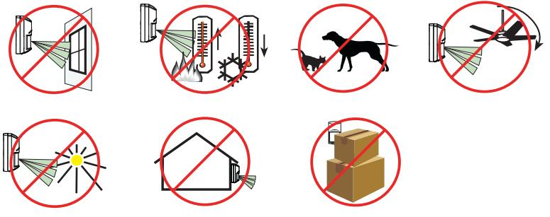

#### **OBSERVERA!**

PIR-detektorn reagerar på objekt som snabbt ändrar temperatur inom siktfältet.

För optimal detektion bör du välja en plats där det är troligt att upptäcka en inkräktare som rör sig inom täckningsområdet. *Se Bild 2.1 Välja plats.*

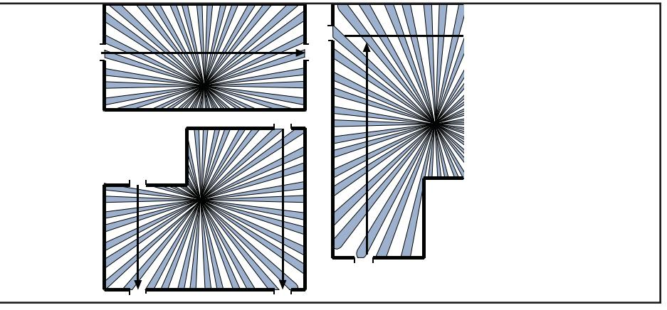

Bild 2.1: Välja plats

## **3 Montering**

- Rekommenderad monteringshöjd är 3,7 till 7,6 m. Täckningsområdet kan bli 12,2–21,3 m vid montering mellan 2,4 och 3,7 m.
- Monteringsytan bör vara fast och vibrationsfri (d.v.s. nedsänkta takplattor måste fästas om ytan ovanför plattorna används som luftretur för HVAC-system).
- För att öppna detektorn letar du reda på pilen på detektorns kåpa. Se bildtexten (1) till *Bild 3.1 Öppna detektorn*. Vrid en skruvmejsel i utrymmet mellan kåpan och basen. Se bildtexten (2) till *Bild 3.1 Öppna detektorn*. Den ena sidan av kåpan sitter fast i detektorbasen.

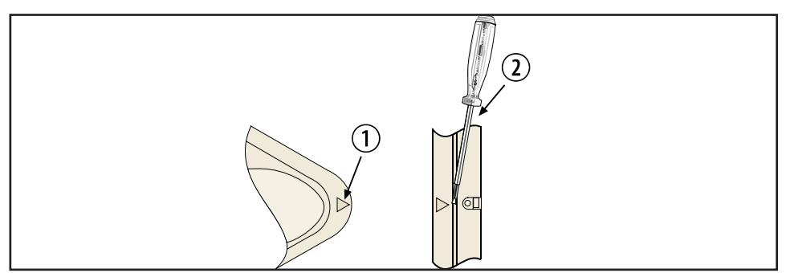

Bild 3.1: Öppna detektorn

- Vid behov kan du avlägsna basen från kåpan genom att trycka kåpans två frigöringsspärrar inåt och samtidigt lyfta bort basen från kåpan. *Se Bild 3.2 Kåpans frigöringsspärrar.*
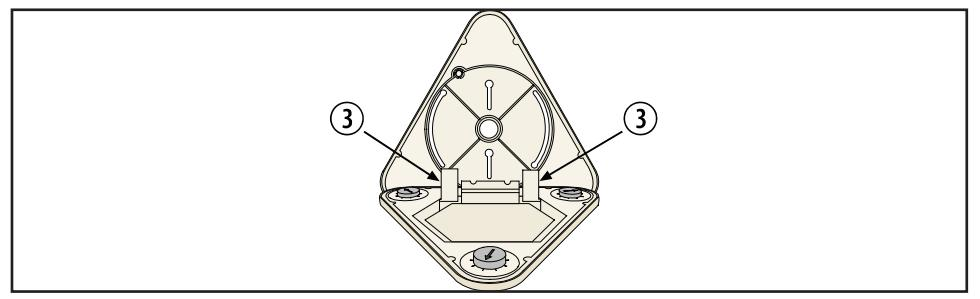

Bild 3.2: Kåpans frigöringsspärrar

- Led vid behov kablarna till basens baksida och genom mitthålet.

### **OBSERVERA!**

Säkerställ att alla kablar är avaktiverade innan de leds rätt.

- Montera basen ordentligt. Beroende på lokala bestämmelser kan basen ytmonteras direkt med hjälp av plugg, mollyplugg eller vingmuttrar. Den kan också monteras på en åttkantig, 3,5-tums eldosa av standardtyp. Detektorn kan också anslutas direkt till en kort längd (tillräckligt kort för att detektorn inte ska röra sig) 1,27 cm EMT-rör.
För installationer där en riktad täckning krävs för en del av området måste de optiska modulerna justeras för korrekt täckning. *På Bild 10.2* visas detektorn monterad 3,7 m över golvet. Avståndet till den ena väggen är 6,1 m och avståndet till väggen på den andra sidan är 10,7 m. Enligt referens från *Tabell 10.1* ställdes den optiska modulen för 6,1 m avståndet in till "D" och den optiska modulen för 10,7 m ställdes in till "I".

Bild 10.2: Justeringar av täckningsområde

## **11 Gångtest**

- 1. Kontrollera att bygelkontakten för lysdiod är i position PÅ. Se *Avsnitt 6.1 Stift för lysdiod på/av*.
- 2. Vänta minst 2 min efter start innan gångtestet inleds. Den blå lysdioden blinkar tills detektorn stabiliseras.
- 3. Iaktta lysdioden medan du går mot kanten av detektorns täckningsmönster. Lysdioden tänds när du når ytterkanten av täckningsmönstret. Den blå lysdioden indikerar ett larm.
- 4. Upprepa *Steg 3* från olika håll tills du har kontrollerat hela täckningsmönstret.

#### **OBSERVERA!**

Om du inte kan uppnå den täckning som behövs med hjälp av *Steg 1–3 i Avsnitt 11 Gångtest* ställer du in PIR-känsligheten till HÖG för att få maximal räckvidd. Se *Avsnitt 5.1*. Justera den optiska modulen för detta enligt beskrivningen i *Avsnitt 10*. Upprepa *Steg 2–4* för att säkerställa tillräcklig täckning.

## **10 Justering av optisk modul**

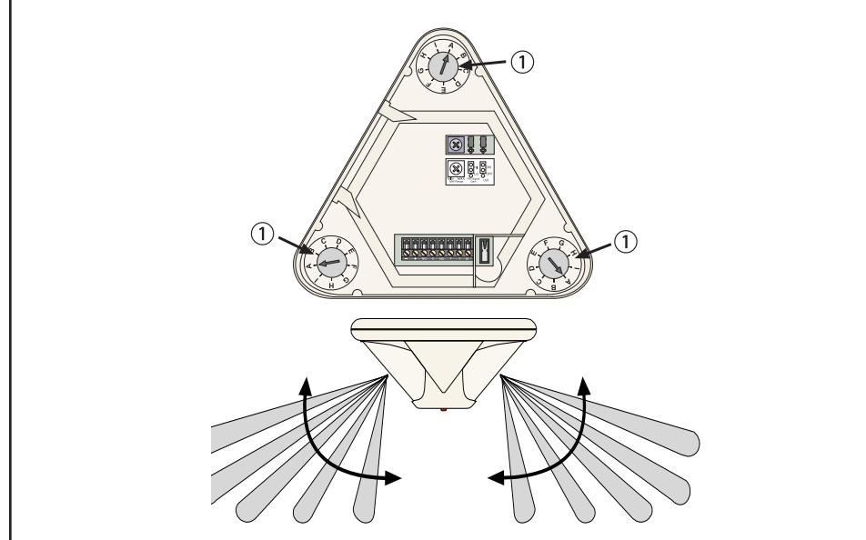

PIR-zonerna för DS939 delas in i tre grupper. Var och en av de 3 grupperna kan oberoende justeras vertikalt för att ge bästa möjliga täckning i rummet. För tydlighets skull visas endast två täckningsmönster. Se *bild 10.1*.

Se *Tabell 10.1* för justering av de optiska modulerna baserat på detektorns monteringshöjd. Räckvidden som visas är avståndet från detektorn till ytterkanten av täckningsmönstret.

| rin Mo nte gs  hö j d | xim al räc kv idd i m Ma ete r |     |     |     |     |          |
|--------------------------------------------|--------------------------------------------------------|-----|-----|-----|-----|----------|
| M                                          | 3                                                      | 4.6 | 6.1 | 7.6 | 9.1 | 10 .7 |
| 2.4                                        | C                                                      | G   | I   |     |     |          |
| 3                                          | A                                                      | D   | G   | I   |     |          |
| 3.7                                        |                                                        | A   | D   | F   | H   | I        |
| 4.3                                        |                                                        | A   | B   | E   | F   | G        |
| 4.6                                        |                                                        |     | A   | D   | E   | G        |
| 4.9                                        |                                                        |     | A   | C   | E   | F        |
| 5.5                                        |                                                        |     |     | A   | C   | E        |
| 6.1                                        |                                                        |     |     | A   | B   | C        |
| 6.7                                        |                                                        |     |     |     | A   | B        |
| 7.3                                        |                                                        |     |     |     |     | A        |
| 7.6                                        |                                                        |     |     |     |     | A        |

Tabell 10.1: Rekommendationer för justering av optisk modul

Vi rekommenderar inte montering i löstagbara takplattor om det inte förbereds genom att basen, takplattan och en fästplatta bakom takplattan monteras ihop.

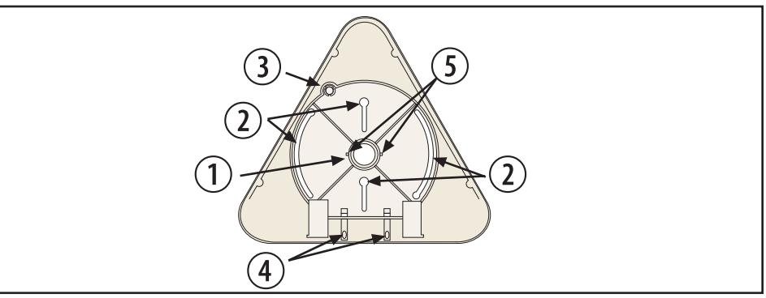

Bild 3.3: Monteringsbas

| i B l d te t x | ivn ing Be kr s                                                                           |
|----------------------------------|-------------------------------------------------------------------------------------------------------|
| 1                                | ån be l ing h /e l ler ing Ka E M T- nt g oc mo er |
| 2                                | å Mo ing h l nt er s                                                             |
| 3                                | bo l de Sa in ta g ec y r                                                  |
| 4                                | be l ån f Ka ing ör ing tm te g on r y                         |
| 5                                | å l f bu ba d H ör nt n                                                    |

# **OBSERVERA!**

 Med de svängda monteringsspåren kan detektorn roteras upp till 60° för att få önskad täckning. *Se bildtexten (2) till Bild 3.3 Monteringsbas*.

- Om du vill montera sabotageskydd för tak ska sabotagecylindern lossas genom att de 3 fl ikarna (6) kapas och därefter ska cylindern monteras i taket med en #8-skruv (7). *Se Bild 3.4 Sabotageskydd för tak.*
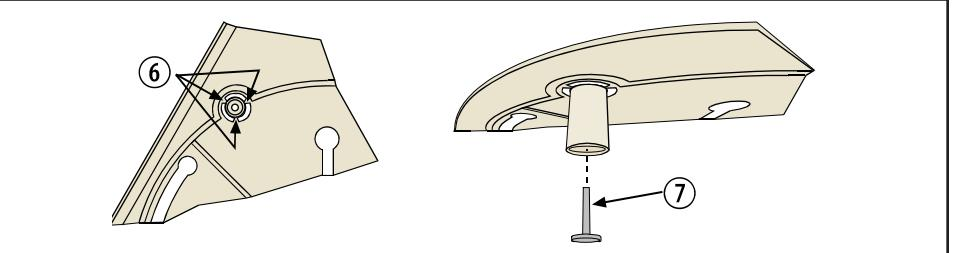

Bild 3.4: Sabotageskydd för tak

## **4 Kabeldragning**

#### **VAR FÖRSIKTIG!**

Koppla inte på strömmen förrän alla anslutningar har gjorts och kontrollerats. Rulla inte ihop överfl ödiga kablar i detektorn. Använd en kabel som är minst 0,8 mm (#22 AWG) i kopplingsplinten.

#### **OBSERVERA!**

Strömförsörjning måste ske från en godkänd strömbegränsad strömkälla. I en del länder får larm- och sabotagekontakterna endast anslutas till en SELV-krets (Safety Extra-Low Voltage).

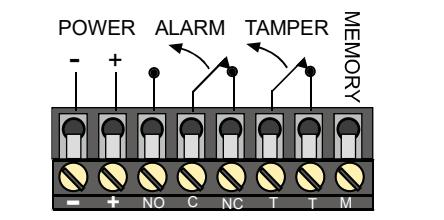

Bild 4.1: Anslutning av kablage

#### **4.1 Terminalerna 1 (-) och 2 (+):**

Ström. Använd ett ledningspar på minst 0,8 mm mellan enheten och strömkällan.

#### **4.2 Terminalerna 3 (NO), 4 (C) och 5 (NC):**

Använd terminalerna 4 och 5 för normalt slutna kretsar. Använd inte kapacitiv eller induktiv belastning.

#### **4.3 Terminalerna 6 (T) och 7 (T):**

Normalt slutna sabotagekontakter för max 125 mA vid 28 V DC.

#### **4.4 Terminal 8 (M):**

För minnesläget krävs att försörjningsspänningen till Terminal 8 aktiveras. I *Avsnitt 7.1* fi nns information om drift och kabeldragning.

## **9 Täckningsmönstermaskering**

DS939 levereras med ett antal maskeringar som används för att maskera oönskade områden. Maskeringssatsen innehåller två 120° och två 90° maskeringar. Maskeringarna är konstruerade för att sättas utanpå detektorn. Försök inte öppna detektor och placera maskeringarna på insidan.

Med de medföljande maskeringarna kan du maskera 90°, 120°, 180°, 210° 240° eller 330°. Några exempel visas nedan.

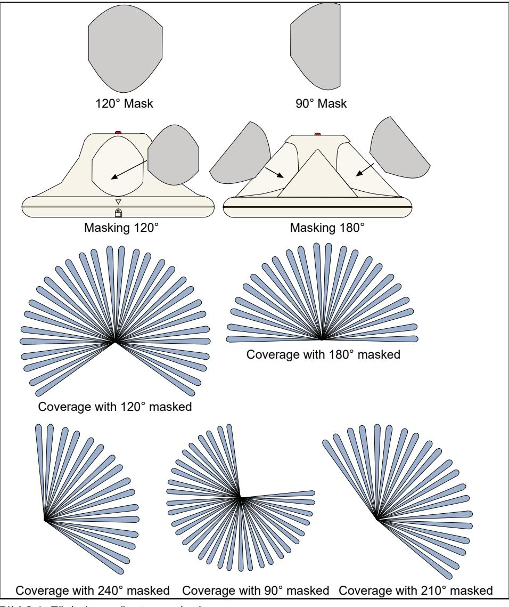

Bild 9.1: Täckningsmönstermaskering

## **8 Täckningsmönster**

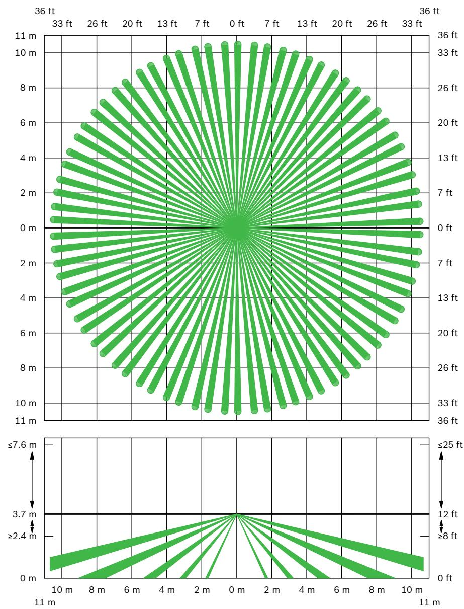

Bild 8.1: 3,7 m monteringshöjd

## **5 Funktionsval**

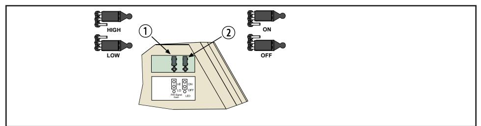

Bild 5.1: Funktionsval

#### **5.1 Stift för PIR-känslighetsval**

Se *Bild 5.1*. För att välja placerar du kontakten över lämpliga stift (1). Om ingen bygelkontakt sätts över "HÖG/LÅG"-stiften ställs detektorn in på "Hög". Låg känslighet (LO): Det är den rekommenderade inställningen för de fl esta installationer. Den här inställningen klarar utsatta miljöer. **Detektorn levereras i känslighetsläget "Låg". Hög känslighet (HI):** Används på platser där låg känslighet inte ger tillräcklig detektionsnivå. Den här inställningen klarar endast små miljömässiga förändringar. 

#### **OBSERVERA!**

Enligt UL-kraven ska PIR-känsligheten ställas in på HÖG när detektorn installeras på 3,7 m höjd eller högre.

För EN50131-installationer ska PIR-känsligheten vara HÖG.

## **6 Lysdiodsdrift**

Detektorn använder en blå lysdiod för att indikera ett aktuellt eller lagrat larmtillstånd.

#### **6.1 Stift för lysdiod på/av**

Se Bild 5.1. Positionen ON möjliggör drift av lysdioden (2). Om du inte vill använda lysdiodsindikationer efter konfi guration och gångtest ska positionen anges till OFF. **Om ingen bygelkontakt sätts över "ON/OFF"-stiften inaktiveras lysdioden.**

Utför gångtest på enheten från alla riktningar för att avgöra alla detektionsområdesgränser.

#### **OBSERVERA!**

Vänta minst 2 min efter start innan gångtestet inleds.

## **7 Övrig Information**

## **7.1 Minne, dagläge, nattläge och fjärrstyrt gångtest**

#### **OBSERVERA!**

För minnesläge, nattläge och fjärrstyrt gångtest måste försörjningsspänningen till Terminal 8 aktiveras. Försörjningsspänningen måste vara mellan 6 och 18 V DC. Du kan använda en omkopplare enligt nedan:

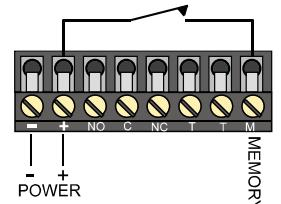

Du kan också använda en extern strömförsörjningsenhet enligt nedan:

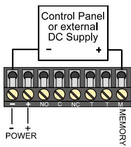

## **OBSERVERA!**

Kontrollera spänning: +6 till +18 V DC = PÅ (omkopplare stängd) 0 V DC = AV (omkopplare öppen)

**Dagläge:** I dagläget inaktiveras larmminnet och lysdioden fungerar som vanligt (om den är aktiverad).

**Minne:** När DS939 är i nattläge aktiveras minnet. På så sätt kan detektorn lagra ett larm och visa det senare.

#### **OBSERVERA!**

För minnesläget måste bygelkontakten för lysdiod vara i position PÅ. **Nattläge:** I nattläget aktiveras larmminnet och lysdioden inaktiveras.

**Fjärrstyrt gångtest:** Med den här funktionen kan lysdiodsdriften aktiveras på avstånd via terminal M före gångtest. Den här funktionen används när lysdiodsdriften är inaktiverad genom att bygelkontakten för lysdiod är i position AV.

| Ön å ka d är d tg s                                                                          | l le än ing Ko tro n ra s p n ( in l ) Te M rm a                    | d io ds by l Ly s g e |
|-------------------------------------------------------------------------------------------------------------------|---------------------------------------------------------------------------------------------------------------------------|-----------------------------------------------|
| Å å S l P l äg t t na e                                                             | Å ( ) P i m än 2 0 k er se                                                                  | Å P                                        |
| l å l / S A V äg t t na e lag lar V isa t ra m              | ( fr ån l ) A V äg t t n a e                                                          | Å P                                        |
| Å Ä S lag T E R T L L t ra lar m                                           | Å ( i m än k e l ler kt ive P 5 er se a ra ) l äg t t na e | Å P                                        |
| Å l å f S P j är ty rt rs ån (o ) A V te t g g s m | Å ( k m dr P i m än 5 in än 2 0 er se en m e k ) se              | A V                                        |
| å S l f j är A V ty rt rs Å ån (o ) te t P g g s m | Å ( i m än 1 s k m in dr än 2 0 P er e en m e ) k se             | A V                                        |

Tabell 7.1: Kontrollera spänning

### **7.2 Antisabotageskruv**

När kåpan har stängts kan hela installationen säkras med den medföljande antisabotageskruven. Se bildtexten (1) till *Bild 7.1 Antisabotageskruv*.

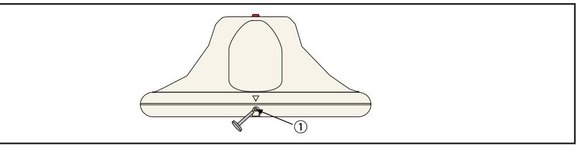

Bild 7.1: Antisabotageskruv

# **7.3 Underhåll**

Minst en gång om året bär räckvidd och täckning kontrolleras. För att garantera en kontinuerlig daglig drift bör slutanvändaren instrueras att gå igenom den bortre delen av täckningsområdet. På så sätt garanteras en larmutgång innan systemet aktiveras.