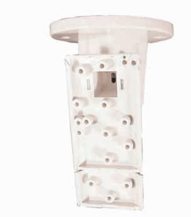

## **B338 Takfäste**

Ytmontera det vridbara takfästet B338 på innertaket. Det kan användas för många olika typer av detektorer. Den vertikala vridningen är +7° till -16°, och den horisontella vridningen är ±45°.

- **Obs!** Husdjursimmunitet kan inte längre säkerställas när du använder det här fästet.
## **Certifikat och godkännanden**

| Region  | Certifiering |              |
|---------|--------------|--------------|
| Belgien | INCERT       | B-509-0021/b |

## **Beställningsinformation**

**B338 Takfäste** Takfäste monteras på innertak. Den vertikala vridningen är +7° till -16°, och den horisontella vridningen är ±45°. **B338**

**Sweden:** Bosch Security Systems AB Vestagatan 2 416 64 Göteborg Phone: +46 31 722 5300 Fax: +46 31 722 5340 se.securitysystems@bosch.com www.boschsecurity.se

**Represented by**

© Bosch Security Systems AB 2010 | data kan ändras utan föregående meddelande T1629949579 | Cur: sv-SE, V2, 2 Dec 2010 | Src: sv_SE, V0, 7 Jul 2006