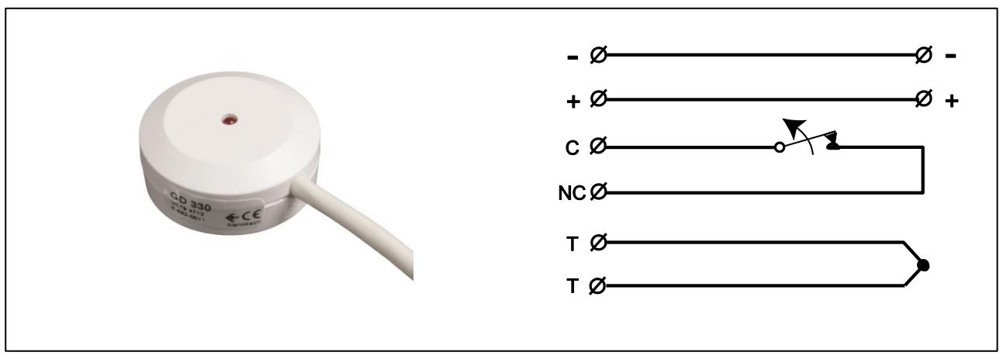
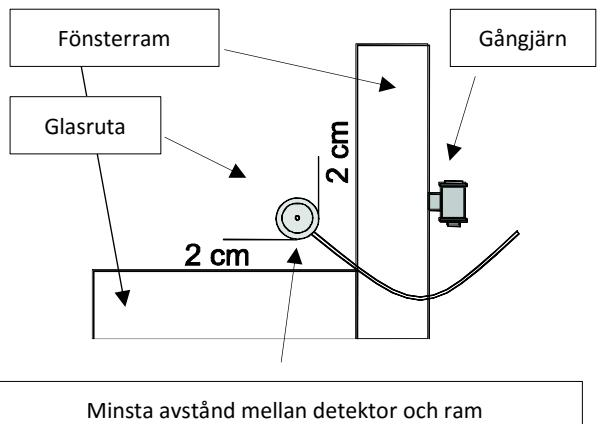
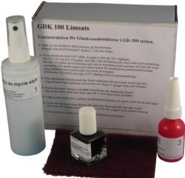

# **Datablad och Installationsanvisning GD 330**

# **BESKRIVNING**

GD 330 är en passiv glaskrossdetektor som limmas på ett vanligt fönsterglas och som ger larm då rutan krossas. Detektorn har ett relä på utgången som ger avbrott vid larm och en lysdiod tänds och indikerar att den löst ut.

Exempel på tillämpningar:

- Fönsterrutor i hus och affärer
- Glasdörrar
- Andra skyddsvärda föremål i vanligt fönsterglas

#### **GD 330 uppfyller kraven:**

- EN 50131-2-7-2:2012/A1:2013 Grad 2
- EN 50130-5:2011, VdS 2110 miljöklass IIIA
- SSF1014:4 2011, SBSC Säkerhetsklass 2

# **EGENSKAPER**

- Detekterar vanligt fönsterglas
- Stor täckningsradie
- Motståndskraftig mot störningar i glaset
- Ingen känslighetsinställning
- Lämplig för 24 timmars övervakning
- Låg strömförbrukning
- Ingjuten detector i IP 67

# **FUNKTION**

GD 330 har en piezoelektrisk sensor som detekterar de speciella vibrationer i rutan som uppstår då den krossas. Signalen har en speciell signatur med ett brett spectrum och stor amplitud. Elektroniken känner av krosssignalen och styr ut reläet som öppnar reläkontakten och tänder uppenlysdiod.

| # | Signal | Ledarens färg | Funktion         | Beskrivning                                                          |
|---|--------|---------------|------------------|----------------------------------------------------------------------|
| 1 | (-)    | Svart         | 8-15V DC (-)     | Strömförsörjning                                                     |
| 2 | (+)    | Röd           | 8-15V DC (+)     |                                                                      |
| 3 | C      | Vit           | Alarmreläkontakt | Larmrelä                                                             |
| 4 | NC     | Vit           | Alarmreläkontakt |                                                                      |
| 5 | T      | Vit           | Sabotage         | De två ledarna är hoplödda inuti detektorn och                       |
| 6 | T      | Vit           | Sabotage         | bildar en slinga för att skydda kabeln och bryts om den klipps av |

## **ANSLUTNINGAR**

Tips hur man identifierar ledarna:

- De två vita ledarna för reläkontakten är öppna om detektorn inte är ansluten till en spänning
- De två vita ledarna för sabotage är slutna om detektorn inte är ansluten till en spänning

# **KRETSSCHEMA**

### **INSTALLATION**

**Varning #1: Limningen är väsentlig för detektorns funktion. Följ noggrant limanvisningarna** 

**Varning #2: GDK 100 Limsats måste användas för säker funktion** 

Anvisningar:

- 1. Innan limning testa detektorn med testaren GVT 500 eller GVT 5000. Använd 12V utgången på GVT 5000 eller annan strömkälla för att strömförsörja detektorn.
- 2. Välj ut ett område på rutan som ligger ca 5cm från ramen men inte mindre än 2 cm.

- 3. Rengör området med innehållet I Flaska nr. 1.
**TEKNISKA DATA** 

- 4. Använd den vita klisterlappen I förbackningen för att komma ihåg var detektorn skall placeras och spara tid för rengöringen av limrester efteråt.
- 5. Vid behov slipa bort fettrester och smuts på detektorns baksida med den bruna sliplappen.
- 6. Viktigt! Lägg på aktivatorn på både detektor och glasyta med penseln i Flaska nr. 2. Den vita paperslappen vihjälper nu till att visa var aktivatorn skall anbringas och hindrar spill från att spridas. Låt aktivatorn torka 1-2 minuter.
- 7. Placera en liten droppe lim ur flaska nr. 3 i mitten på detektorns baksida och sprid ut det till ett jämt lager över hela ytan med den medföljande triangelformade spateln. Ett tunt lager är viktigt för att detektorn skall limmas bra och snabbt.
- 8. Placera detektorn på rutan och tryck hårt för att pressa ut luften i limfogen. Limet härdar i frånvaro av syre med aktivatorn. Pressa och håll fast i ca 10 sek. Vicka lite svagt så känns det när härdningen skett.
- 9. Ta bort överflödigt lim runt detektorn som uppstått när detektorn pressats mot glaset. Använd spateln. Därefter ta bort den vita klisterlappen och nu märk det att man sparat tid för det blir rent direkt.

| Typ av glas                                             | Fönsterglas (float glas)                                   |
|---------------------------------------------------------|------------------------------------------------------------|
| Glastjocklek                                            | 4 mm, 6 mm                                                 |
| Detektionsradie                                         | 2 m                                                        |
| Inspänning                                              | 8 – 15 VDC                                                 |
| Max. rippel                                             | 2 Vpp at 12 V                                              |
| Strömförbrukning I vila                                 | 5 mA                                                       |
| Strömförbrukning I larm                                 | 12 mA                                                      |
| Larmutgång                                              | Reläkontakt normalt sluten (NC)                            |
| Kontaktdata                                             | max. 100 mA, max. 50 VDC/peak AC, Rs 30 Ω                  |
| Larmindikering                                          | LED                                                        |
| Larmtid                                                 | Låser I larmläge                                           |
| Återställning av larm                                   | Bryt spänningen                                            |
| Kabel                                                   | Längd 3 m, 6m, 10m eller spiral, dim. ф 3,7 mm, 6x0,14 mm2 |
| Miljöklass (EN50130-5:2011), VdS 2110                   | IIIA                                                       |
| Temperaturområde                                        | -40°C till +55°C                                           |
| Fuktålighet                                             | max. 95% RH                                                |
| Material I höljet                                       | ABS Plast I vit, brun eller svart färg                     |
| Storlek                                                 | Ф 35x15 mm                                                 |
| Testade enligt normerna VdS 2311 och EN50131-2-7-2:2012 | Grade 2, Class B, SSF 1410-4 larmklass 2                   |
| Godkännanden                                            | VdS G 192531, SBSC , F&P, FG,                              |

Vi reserverar oss för eventuella ändringar