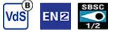
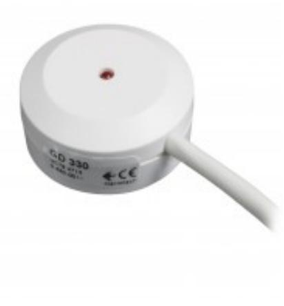
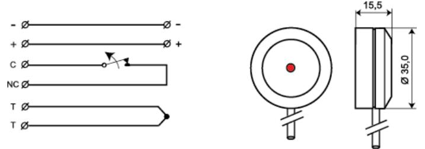
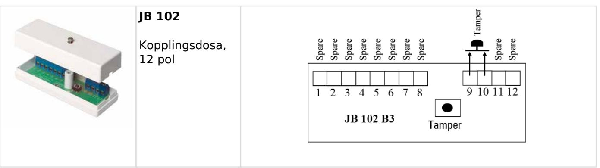

# GD 330

# Glaskrossdetektor med reläutgång, limmad

#### **Produktdetajler:**

| 2 m radie (standard 3 mm glas)                                                 |
|--------------------------------------------------------------------------------|
| EN 50131-2-7-2:2013 Grade 2, VdS class B - G192531, SBSC 10-31 Klass 1/2 |
| 8-15 VDC                                                                       |
| 5 mA (17 mA vid larm)                                                          |
| Relä, NC                                                                       |
| 48 VDC / 100 mA                                                                |
| LED                                                                            |
| Ja                                                                             |
| Kvarstående                                                                    |
| Brytning av spänningen                                                         |
| Kabel                                                                          |
| ABS Plast                                                                      |
| Vit                                                                            |
| -40 - +70°C                                                                    |
| IP 67                                                                          |
| 16 x 35                                                                        |
|                                                                                |

GD 330 är en glaskrossdetektor med reläutgång som kan anslutas direkt på en ingång i centralapparaten. Den är speciellt framtagen för övervakning av butiksfönster, skjutdörrar med glas, vanliga fönster och andra utsatta glaspartier i offentlig miljö eller i privata hem.

Den kan användas på fönster med skyddsfilm om detektorn monteras direkt på glaset och inte på filmen (ett hål på ca 5–10 cm skärs ut i filmen). Den kan även användas på glasskåp för att skydda olika typer av utrustning.

GD 330 glaskrossdetektorn aktiveras när glaset krossas och är mycket tålig mot störningar på glaset eller i dess omgivning och är därför idealisk för 24-timmars övervakning.

Designen på detektorn är rund, vilket gör att den alltid sitter rakt.

GD 330 skall limmas på glaspartiet och till varje detektor medlevereras en schablon, paddel för limmet och kabelavlastning för snabb och enkel installation.

GD 330 är inte lämplig för laminerat glas.

| BESTÄLLINGSINFORMATION |         |                                                      |  |
|------------------------|---------|------------------------------------------------------|--|
| Model                  | E-nr    | Beskrivning                                          |  |
| GD 330                 | 6332520 | Glaskrossdetektor med reläutgång, limmad, 3 m kabel  |  |
| GD 330-6               | 6332521 | Glaskrossdetektor med reläutgång, limmad, 6 m kabel  |  |
| GD 330-10              | 6332522 | Glaskrossdetektor med reläutgång, limmad, 10 m kabel |  |

## **ALARMTECH SWEDEN AB**

### **Relaterade produkter och tillbehör:**

| IU 370 Analysatorenhet för GD 330 / GD 370         |
|-------------------------------------------------------------|
| CG 100 Kabelgenomföring för skydd av kabeln              |
| GDK 100 Limsats för GD glaskrossdetektorer               |
| GVT 500 Testenhet för GD 300/GD 400 glaskrossdetektorer  |
| GVT 5000 Testenhet för glaskrossoch vibrationsdetektorer |

### **Relaterade produkter och tillbehör:**

Powered by TCPDF (www.tcpdf.org)