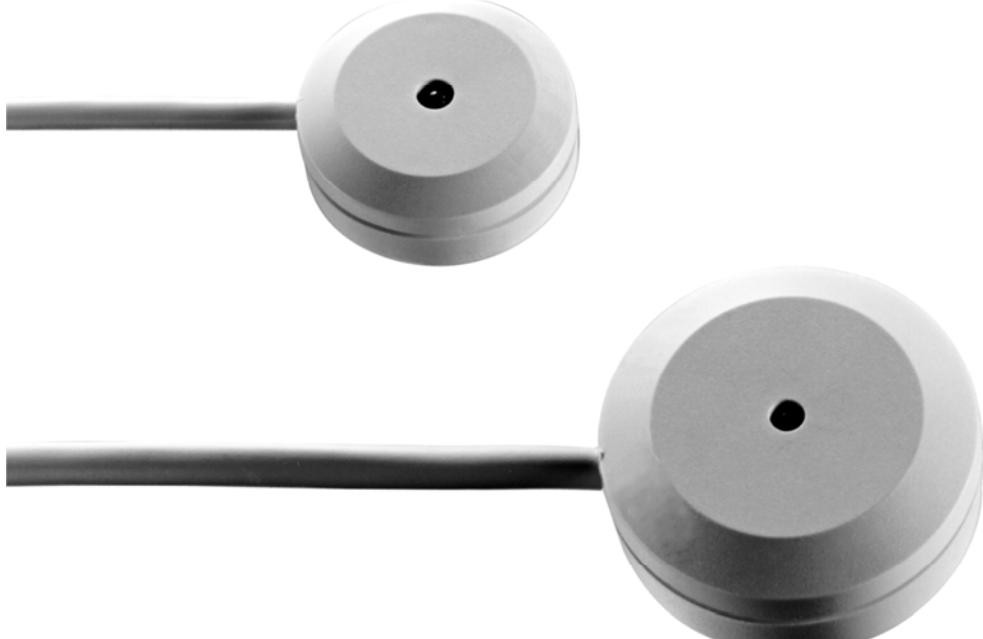
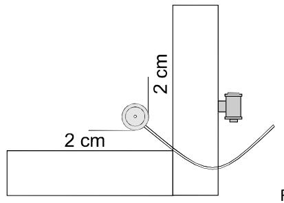
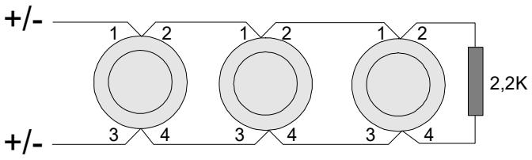
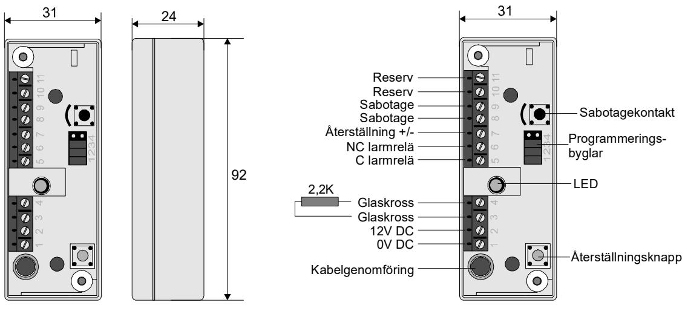
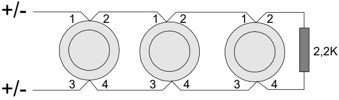
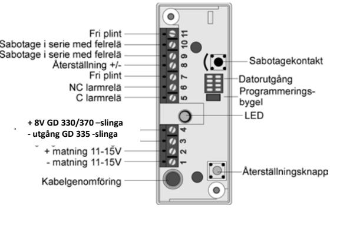
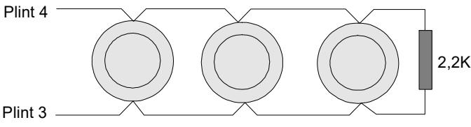
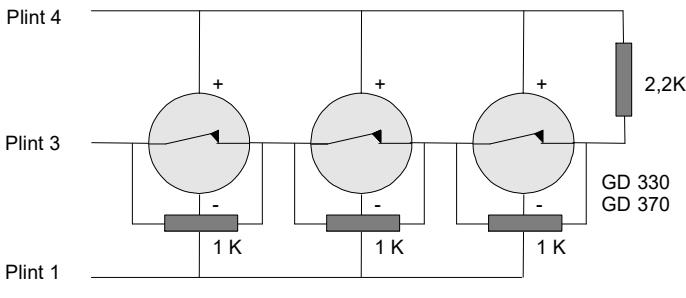
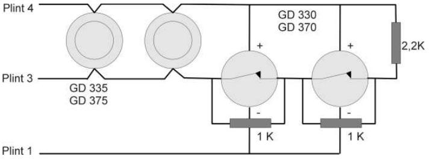

**GD 300 Serien** 

# INSTALLATIONSANVISNING OCH HANDHAVANDEINSTRUKTION FÖR GD 300-SERIEN GLASKROSSDETEKTORER

# **1. GENERELL INFORMATION**

## **Grundfunktioner**

- Detekterar krossning av glas.
- Stort bevakningsområde.
- Känner av de många frekvenser som alstras vid glaskrossning.
- Mycket tålig mot yttre störningar på glaset.
- Inga känslighetsinställningar.
- Detektorn är synlig utifrån i preventivt syfte.
- Väl utprovad och säker produkt.
- Ersätter fönsterfolie och äldre typer av mekaniska vibrationsdetektorer.
- Idealisk för 24-timmars bevakning.
- Låg strömförbrukning.
- Visuell larmindikering.
- Inbyggd LED-minnesfunktion.
- Helt tät plast kapsling.
- Rund konstruktion underlättar montaget, då detektorn alltid hamnar rakt.

# **2. ANVÄNDNINGSOMRÅDE**

De passiva elektroniska glaskrossdetektorerna i GD 300-serien är konstruerade att detektera själva splittrandet av vanligt glas, härdat glas och trådglas samt i GD 370´s fall även laminerat glas. Detektorn kan användas i alla typer av applikationer som fönster, skyltfönster, utställningsmontrar och glasdörrar.

# **3. FUNKTION**

GD 300-seriens detektorer med undantag för GD 370 är konstruerade för vanligt glas, härdat glas och trådglas. GD 370 är en universell detektor alla typer av glas inklusive plastglas och folierat glas.

GD 330 och GD 335 detekterar de vibrationsfrekvenser som bildas inuti glaset när det krossas. Detta är en väldigt kort vibrationspuls med hög amplitud och väldigt hög frekvens som fortplantar sig med mycket hög hastighet i glaset. Sensorn i GD 300-serien är ett piezoelektriskt element som har förmågan att fånga upp denna puls. Elektroniken är designad att känna av denna höga frekvens och särskilja den från riktigt glaskrossljud och andra ljud. Det är en väldigt pålitlig och säker metod att detektera glaskrossning som kan användas i väldigt bullrig miljö utan att den för den sakens skull ställer ut obefogade larm. GD 300-seriens detektorer lämpar sig utmärkt för 24-timmars bevakning.

GD 370 detektorn arbetar med tre olika detektionskanaler, integrations-, räkne- och explosionskanal. Den detekterar angrepp från alla idag kända angreppsmetoder såsom:

- Slägga, yxa, stora stenar eller andra grova metoder att krossa glas.
- Borrning med stenborr
- Skärning med diamantskiva
- Smältande metoder med svets- eller gasollåga
- Skott från handeldvapen.

# **4. RÄCKVIDD**

## **GD 300-serien**

Räckvidden är cirka 2 meter på ett normalt 3 mm glas men räckvidden ökar något ju tjockare glaset är beroende på att en större kraft behövs för att krossa glaset. Detektorn monteras på den innersta glasskivan i ett hörn eller nära ramen.

Räckvidd är normalt 2 m för alla detektorer

GD 300-SERIEN_1212se (2012-03-23CB) 2 ©2012 Alarmtech Med reservation för tryckfel och eventuella framtida produktmodifieringar

- På normalt planglas 4 mm tjockt är bevakningsradien är ca 2 m.
- På trådglas är bevakningsradien ca hälften av normalt planglas då trådarna håller ihop glaset och dämpar signalen.
- På härdat glas är räckvidden ca dubbelt så stor som på normalt planglas därför att hela skivan bryts ner som en explosion och ca 2 m om det är folierat.
- Maximal glastjocklek för vanligt glas bör inte överstiga 7 mm därför att glaset inte krossas.
- Minst en detektor per glasskiva.
- Ingen känslighets eller räckviddsinställning är nödvändig.

## **GD 370**

Räckvidden är cirka 2 meter på ett laminerat glas oberoende av antal skikt i laminatet. Detektorn monteras på samma sätt som GD 300-detektorerna på innersta glasskivan i ett hörn eller nära ramen.

- 2 m bevakningsradie.
- Ingen begränsning i tjocklek eller antal glas i lamineringen.
- Minst en detektor per glasskiva.
- Ingen känslighets eller räckviddsinställning är nödvändig.

# **5. ANVÄNDNING PÅ OLIKA GLASTYPER**

Det finns många olika glastyper varav de vanligaste är:

## **Planglas**

Detta är vad vi kallar vanligt glas som används i de flesta fönster. Detta glas är perfekt för GD 300-serien med en räckvidd på 2 meter i minsta fall och stor säkerhet mot obefogade larm. 24-timmars bevakning är möjlig även i väldigt bullrig miljö. Ju tjockare glas desto större bevakningsområde eftersom det kräver mer kraft för att krossa glaset och det ger en större och bättre signal att detektera.

## **Härdat glas**

Glas som är härdat faller sönder i "tusen små bitar" när det krossas. Det behövs en avsevärt större kraft att ha sönder ett härdat glas jämfört med ett vanligt glas. Detta glas är perfekt för GD 300-serien med dubblerad räckvidd upp till 4 meter och stor säkerhet mot obefogade larm. 24-timmars bevakning är möjlig även i väldigt bullrig miljö. Kännetecken att känna igen en härdad glasruta är att de alltid märks med en stämpel från tillverkaren.

## **Trådglas**

Det är ett planglas med trådnät ingjutet som förstärkning och används normalt i branddörrar. Glasytan är oftast ojämn och ger inte så mycket ljud när det krossas eftersom trådnätet håller ihop det. Trådarna dämpar glaskrossljudet men GD 300-detektorerna fungerar på denna typ av glas dock med en räckviddsreducering på cirka 50 %.

## **Laminerat standarglas**

Två eller flera lager av vanligt glas som i vakuumkammare vid hög temperatur sammanfogas med hjälp av en tunn plastfilm som lim. Denna plastfilm håller ihop glaset och dämpar därmed ljudet vid krossning. För att forcera en laminerad glasruta krävs det mycket stor och upprepad kraft. Till laminerat vanligt glas är det enbart GD 370 som är användbar eftersom den känner av de vibrationer och knackningar som genereras vid bearbetning av denna typ av glas. Ett sett att se om det är ett laminerat glas är att använda en vanlig laserpekare och med 30 graders vinkel lysa mot glaset. Man ser då i reflexerna antalet skivor.

*GD 370 är den enda detektorn som kan användas på detta glas.* 

## **Laminerat härdglas**

Två eller flera lager av glas, där minst en glasskiva är härdad, som i vakuumkammare vid hög temperatur sammanfogas med hjälp av en tunn plastfilm som lim. Detta glas blir mycket starkt och det blir inga vassa glasbitar, om det krossas, som kan skada personal på insidan om den härdade sidan vänds inåt objektet, vilket är önskvärt när laminerat glas används för att skydda personal.

Om det härdade glaset är vänt utåt och vanligt planglas inåt, vilket är vanligt i skyltfönster, då det härdade glaset tål repor. Den inre planglasskivan kommer då inte att krossas på det sätt som GD 300-detektorerna kräver för att kunna aktiveras.

## *För dessa båda glastyper rekommenderar vi GD 370.*

## **Plexiglas**

Plexiglas lamineras ofta ihop med vanligt glas eftersom det är väldigt känsligt för repor. Denna typ av glas kan endast skyddas med GD 370.

## **Skyddsfilm**

Det är ganska vanligt med solfilm eller skyddsfilm, typ Profilon, på fönstren. Denna skyddsfilm dämpar glaskrossljudet som GD 300-detektorerna lyssnar efter och därför reduceras räckvidden med 50 %. Vid montering av skyddsfilm eller vid montering av detektorer på skyddsfilmsförsedda fönster skall ett 5 - 10 cm, i diameter, stort hål tas upp i filmen där detektorn skall monteras. Detektorn får aldrig monteras direkt på skyddsfilmen. GD 300-detektorerna är lämpliga att användas i dessa applikationer dock med 50 % reducerat bevakningsområde. Med GD 370 är räckvidden 2 m.

# **6. PROJEKTERING INNAN MONTAGE**

GD 330 och GD 335 är konstruerade att monteras på vanligt eller härdat glas. Varje detektor kan endast skydda en glasruta som inte har några sprickor. I fönsterpartier med flera rutor måste varje enskild ruta skyddas med en egen detektor.

För laminerat glas eller plastglas kan bara GD 370 användas som detektor. Samma förutsättningar som ovan gäller för monteringen att det skall vara minst en detektor per glasruta. Räckvidden är 2 meter i radie oavsett hur många lager laminatet består av.

GD 330-serien och GD 370 har ett inbyggt relä som normalt är slutet och behöver inte något reläinterface.

GD 335-serien har transistorutgång och drar ingen ström i viloläge. Dessa detektorer måste anslutas till ett reläinterface, IU 300 eller IU 370 med balanserad slinga eller direkt på slingan om den är konstruerad för att matningsspänningen kan brytas ner till 0 Volt. Vi rekommenderar att inte fler än 20 st detektorer ansluts till ett och samma interface.

# **7. MONTERING**

*OBS: Använd endast det rekommenderade limmet. De flesta andra lim klarar inte av fukten som bildas på rutan vid kondens eller rengöring. I mer än 30 år har vi använt Loctite 326 med säkert resultat och vi har gjort en liten limsats för ca 100 detektorer (GDK 100). Loctite standardförpackning räcker till mer än 1 000 detektorer. Förvara limmet kallt så håller det ca 2 år. Vid användning av antra typer av lim upphör alla funktionsgarantier att gälla.* 

## *Testa alltid detektorn innan montering.*

## **Montageplats**

Detektorn bör helst monteras på en inre glasskiva för att undvika obefogade knackningar och angrepp. Detektorn tål ganska hårda knackningar på rutan men det finns en gräns för störtåligheten varför man i varje enskilt fall bör tänka igenom vilka störbild som kan uppstå.

Detektorn skall limmas med limsatsen GDK 100 eller LOCTITE 326 med accelerator och absolut inget annat lim. Limmet i limsatsen är ett tvåkomponentslim som består av bas och accelerator. Härdningsprocessen aktiveras vid avsaknad av syre och med hjälp av acceleratorn. Limmet kan endast härda upp till en tjocklek av 0,5 mm lim varför vi rekommenderar att det sprids ut till ett tunt lager.

#### **Limma på följande sätt:**

- 1. Rengör, rugga upp, detektorns fästyta med Scotch-Brite slipdynan. Lägg detektorn på slipdynan och pressa och drag fram och tillbaka 2 - 3 gånger.
- 2. Märk ut var detektorn skall sitta och rengör glasytan med rengöringssprayen GLL 7063 (flaska 1). Låt ytan torka.
- 3. Applicera aktivator GLL 7649 (flaska 2) på både fönsterskivan och detektorns limyta. Låt det torka och limma därefter inom 15 min.
- 4. Klicka ut lite lim GLL 326 (flaska 3) på detektorn. Sprid ut det till ett tunt jämt skikt.
- 5. Tryck fast detektorn mot glasytan och håll tills limmet härdat. Det tar cirka 10 sekunder. Tänk på att det tar längre tid om ytan är kall. Tänk på att ju mindre lim desto starkare fog och kortare härdningstid. En kall yta härdar långsammare än en varm.
- 6. Låt limmet härda ytterligare 5 minuter innan du börjar bearbeta kabeln.
- 7. Testa detektorn med testaren GVT 500 eller GVT 5000 efter slutförd montering. Se funktionsprov.

# **8. INKOPPLING**

Alla detektorer har en ingjuten flertrådig kabel. Nedan beskrivs vilka trådar som är vad.

| GD 330     |               | GD 335                       | GD 370     |               | GD 375                       |
|------------|---------------|------------------------------|------------|---------------|------------------------------|
| Röd:       | + spänning    | Polaritetsoberoende          | Röd:       | + spänning    | Polaritetsoberoende          |
| Svart:     | - spänning    | 2 kortslutna par             | Svart:     | - spänning    | 2 kortslutna par             |
| Kortslutet |               | Övrig inkoppling se IU 300 / | Kortslutet |               | Övrig inkoppling se IU 300 / |
| par:       | Sabotage      | IU 370 instruktionen         | par:       | Sabotage      | IU 370 instruktionen         |
| Öppet par: | Reläutgång NC |                              | Öppet par: | Reläutgång NC |                              |
|            |               |                              |            |               |                              |

#### **Inkoppling av GD 330 och GD 370**

Dessa detektorer ansluts till en matningsspänning och har en reläutgång som ansluts till larmslingan på vanligt sätt. Kabeln har 6 ledare med följande funktion:

- Röd = +
- Svart = -
- 2 st vita med förtennade ledare = reläutgång
- 2 st vita med förtennade ledare = sabotageslinga

#### **Inkoppling av GD 335/GD 375**

Dessa detektorer är inte polaritetsberoende. Ledarna är parvis sammanlödda inuti detektorn. Koppla in detektorn enligt figuren. Ändmotståndet gäller för våra interfaceenheter IU 300 / IU 370.

Kabeln har 4 vita ledare med följande funktion:

- 2 st vita med förtennade ledare som är sammanlödda inuti (1,2)
- 2 st vita med förtennade ledare som är sammanlödda inuti. (3,4)

# **9. FUNKTIONSPROV**

Vi rekommenderar att funktionsprovet görs med GVT 500 eller GVT 5000-testaren och absolut inte 5-kronor, bågfilsblad eller nyckelknippor som kan spräcka glaset.

Den enkla handhållna batteridrivna testaren GVT 5000 gör funktionsproven snabba och säkra vid installationen och vid den årliga revisionen. Testa på följande sätt:

#### **Innan montering**

Innan limning kan man alltid testa detektorn även om det inte är nödvändigt eftersom den i tillverkningen har genomgått omfattande datorstyrda tester. Spänningsmata detektorn från testarens spänningsutgång och ställ testaren i rätt läge beroende på vilken typ av detektor som skall testas, GD 300 eller GD 370.

Håll detektorn mot testhuvudet och tryck på testknappen. Detektorn skall tända upp dioden om allt är i sin ordning.

## **Efter montering**

Efter limning, spänningssätt detektorn och ställ testaren i rätt läge beroende på vilken typ av detektor som skall testas, GD 300 eller GD 370.

Fukta testhuvudet med testgel eller vatten för att ge en bra kontakt till glaset och håll det mot glasytan och tryck på testknappen. Placera testhuvudet ca 10 cm från detektorn. När knappen trycks in sänder testaren ut en signal som simulerar den signal som alstras vid glaskrossning. Se till att testhuvudet är ordentligt fuktat. Det är viktigare än att trycka hårt. Rör på testhuvudet lite för att ändra det stående-våg förhållande som bildas av testaren.

Detektorn skall tända upp dioden och ett larm bör registreras i centralapparaten.

**OBS!** Testaren kan inte användas för att testa detektorns räckvidd eftersom signalen som den avger är mycket svagare än vad en riktig glaskrossning avger.

## **10. ANALYSATOR IU 300**

## **Beskrivning**

IU 300 är en analysatorenhet med larmrelä som används tillsammans med glaskrossdetektorerna ur GD 335 / GD 375 -serien i inbrottslarmanläggningar. Till en IU 300 kan upp till 20 stycken glaskrossdetektorer anslutas. Vid utlöst larm lämnar IU 300 analysatorn en fri reläbrytning som ansluts till valfri centralapparat.

## **Funktion**

IU 300 övervakar resistansförändringar i en balanserad larmslinga med ändmotståndet 2.2 Kohm. Vid en förändring på +/- 40% och en varaktighet på mer än 200 ms kommer larm att ställas ut. Larmreläet som normalt är slutet bryter under 2 - 3 sekunder eller förblir brutet tills dess att manuell återställning görs. Detta är beroende på hur enheten programmerats. Återställning kan ske på plats med återställningsknappen, styrning via ingång 7 eller genom att bryta spänningen till enheten.

IU 300 är försedd med en sabotagekontakt för skydd mot öppning.

## **Programmering**

IU 300 har 4 stycken programmeringsbyglar, se figur, med vilka enhetens grundfunktioner programmeras.

- **S1** Byglad Larmreläet förblir öppet tills manuell återställning sker. Lysdioden visar att larm löst ut, släcks vid återställning. Öppen Larmreläet öppnar i 2-3 sekunder och återställs automatiskt. Lysdioden visar att larm löst ut, indikeringen återställs manuellt. **S2** Byglad Matningsspänningen 9 – 15 VDC. Öppen Matningsspänningen 15 – 30 VDC. **S3** Byglad Fjärrstyrd återställning med - spänning. Öppen Skall vara öppen om S4 är byglad. **S4** Byglad Fjärrstyrd återställning med + spänning. Öppen Skall vara öppen om S3 är byglad.
OBS! S3 och S4 skall aldrig sitta monterade samtidigt. IU 300 levereras med byglarna S1-S3 monterade.

## **Montering av IU 300**

- 1. Välj en lämplig montageplats på ett jämt underlag. Fäst enheten med de medföljande skruvarna.
- 2. Anslut glaskrossdetektorerna till plint 3 och 4. Anslut ändmotståndet på 2,2 Kohm.
- 3. Följ inkopplingen enligt bilden nedan.
- 4. Programmera enheten med byglarna S1 S4.
- 5. Anslut matningsspänningen.
- 6. Gör ett provlarm från en detektor i taget för att kontrollera att alla detektorer fungerar. Använd GVT 500 / GVT 5000.

# **11. ANALYSATOR IU 370**

## **Beskrivning**

IU 370 är en analysatorenhet med ett larm- och ett felrelä för anslutning av glaskrossdetektorerna ur GD 300 serien i inbrottslarmanläggningar. Den har en återställningsknapp. Till en IU 370 kan upp till 10 stycken glaskrossdetektorer GD 330/GD 370 eller upp till 20 st GD 335/GD 375 anslutas.

## **Funktion**

IU 370 övervakar resistansförändringar i en balanserad larmslinga med ändmotståndet 2.2 Kohm. Vid en förändring på > +/- 20 % och en varaktighet på mer än 800 ms kommer larm att ställas ut. Larmreläet som normalt är slutet bryter under 2 - 3 sekunder eller förblir brutet tills återställning gjorts beroende på hur enheten programmerats.

IU 370 övervakar också slingan. Om slingresistansen understiger 300 ohm eller överstiger 20 kohm så signaleras sabotage och lysdioden börjar blinka.

IU 370 är försedd med en sabotagekontakt för skydd mot öppning.

Återställning av detektorerna kan ske på plats med återställningsknappen, styrning via ingång 8 eller genom att bryta spänningen till enheten. Återställningen bryter spänningsmatningen till detektorerna. Återställning kan endast ske om Larm eller Fel råder. Utgående Larm eller Fel kan inte blockeras genom att hålla återställningsknappen intryckt.

IU 370 har ett händelseminne med tidsangivelser som kan avläsas med en PC inkopplad på den röda kontakten via ett USB-modem.

## **Programmering**

IU 370 har en programmeringsbygel för programmering av larmreläet och felreläet samtidigt.

- **S1** Öppen Larmreläet och Felreläet förblir öppet tills återställning skett. LED tänds vid larm och släcks vid återställning. Vid fel blinkar lysdioden till återställning.
- **S1** Byglad Larmreläet öppnar i 2 3 sekunder och återställs automatiskt. Felreläet förblir öppet till återställning sker. LED tänds vid larm och släcks vid återställning. Vid fel blinkar LED till återställning.

#### **Montering av IU 370**

- 1. Välj en lämplig montageplats på ett jämt underlag. Fäst enheten med de medföljande skruvarna.
- 2. Slingan ligger mellan plint 3 och 4.
- 3. + spänningen till GD 330 och GD 370 ligger på plint 4.
- 4. Följ inkopplingen enligt bilderna nedan.
- 5. Anslut matningsspänningen för IU 370 med till plint 1 och + till plint 2.
- 6. Gör ett provlarm från en detektor i taget för att kontrollera att alla detektorer fungerar. Använd GVT 500 / GVT 5000.

#### **Inkoppling av IU 370**

- 1. matning 11 15 VDC
- 2. + matning 11 15 VDC
- 3. utgång för balanserad larmslinga
- 4. + utgång till balanserad slinga samt + 8 V matning till GD 330, GD 370
- 5. Larmrelä med 30 ohm i serie
- 6. Larmrelä med 30 ohm i serie
- 7. Fri plint
- 8. Återställningsingång för fjärråterställning
- 9. Sabotagekontakt i serie med felrelä med 30 ohm i serie
- 10. Sabotagekontakt i serie med felrelä med 30 ohm i serie
- 11. Fri plint

## **Inkoppling av GD 335 och GD 375 till IU 370**

Detektorerna i GD 335/375-serien är polaritetsoberoende. Alla ledare i detektorn är förtennade och det är kontakt mellan dem parvis. Koppla in detektorerna enligt figuren mellan plint 3 och 4. Max 20 st.

## **Inkoppling av GD 330 och GD 370 till IU 370**

Detektorerna GD 330 och GD 370 spänningsmatas med + från plint 4 och – från plint 1. Detektorernas relä kopplas i serie på slingan som ligger över plint 3 och 4 med ett ändmotstånd på 2,2 kohm. **OBS**. Det är viktigt att reläerna ligger i den del av slingan som utgår från plint 3 och med ett motstånd på 1 kohm parallellt över varje larmrelä. Max 10 st. Se figur nedan.

#### **Inkoppling vid kombination av GD 335/375 och GD 330/370 till IU 370**

# **12. FELSÖKNING**

Vid installation och felsökning bör man tänka på att GD 300-seriens detektorer känner av korta snabba pulser. Krossning av ett glas sker snabbt och ger upphov till en kort vibrationspuls. Elektriska störningar ger också upphov till korta snabba pulser därför har detektorerna försetts med kraftfulla störningsskydd. Men det finns en gräns för vad de tål. Tänk därför på vid installation och vid felsökning på följande:

- Lägg aldrig oskärmad kabel till detektorerna parallellt med en nätspänningskabel.
- Tänk på att en lysrörsarmatur kan ge en strömstöt i start eller släckögonblicket på över 20A på nätspänningen. Multiplicera detta med antalet armaturer och det kan bli stora strömstötar som kan störa detektorerna.
- Dimmningsanläggningar för lysrör arbetar ibland på samma frekvenser som detektorerna. Om ljuset dimmas upp och ned kan detta störa detektorerna om kabeln till dem ligger parallellt med nätspänningen
- Start och stopp av tunga maskiner och fläktar ger också upphov till kraftiga störningar som störa detektorerna om kabeln till dem ligger parallellt med nätspänningen.
- Limma inte detektorerna på fönster med inbyggda värmeslingor.

#### **13. TEKNISKA DATA**

|                         | IU 300               | IU 370               | GD 330               | GD 335               | GD 370               | GD 375               |
|-------------------------|----------------------|----------------------|----------------------|----------------------|----------------------|----------------------|
| Räckvidd på 3 mm        |                      |                      | 2 m radie            | 2 m radie            | 2 m radie oavsett    | 2 m radie            |
| normalt glas            |                      |                      |                      |                      | antal lager          |                      |
| Matningsspänning        | 9-15/15-30 VDC       | 9-15 VDC             | 8-15 VDC             | 4-15 VDC             | 8-15 VDC             | 4-15 VDC             |
| Strömförbrukning i vila | 10 mA                | 16 mA                | 5 mA                 | Max 5 µA             | 7 mA                 | Max 5 µA             |
| - vid larm              | 16 mA                | 19 mA                | 17 mA                | 7 mA                 | 9 mA                 | 7 mA                 |
| Larmslinga              |                      |                      | -                    | -                    | -                    | -                    |
| - ändmotstånd           | 2,2kohm, 1%          | 2,2kohm, 1%          |                      |                      |                      |                      |
| - slingspänning         | 9 V DC               | 9 V DC               |                      |                      |                      |                      |
| - max antal detektorer  | max 20 st            | max 20 st GD         |                      |                      |                      |                      |
| per slinga              |                      | 335/375, max 10      |                      |                      |                      |                      |
|                         |                      | st GD 330/370        |                      |                      |                      |                      |
| Sabotageskydd           | Öppningskontakt      | Öppningskontakt      | Ja, 2 trådar         | Ja, 2 trådar         | Ja, 2 trådar         | Ja, 2 trådar         |
| - kontaktdata           | 35 V / 50 mA         | 35 V / 50 mA         | -                    | -                    | -                    | -                    |
| Larmutgång              | Relä                 | Relä                 | Relä                 | Transistor           | Relä                 | Transistor           |
| - kontaktdata           | 100 mA / 50 V        | 100 mA /50 V         | 100 mA / 50 V        | -                    | 100 mA / 50 V        | -                    |
| - reläets hålltid       | Auto 2s/Hållande     | Auto 2s/Hållande     | Hållande             | Hållande             | Hållande             | Hållande             |
| - larmindikering        | LED                  | LED                  | LED                  | LED                  | LED                  | LED                  |
| - larmåterställning     | tryckknapp           | tryckknapp           | Spänningsavbrott     | Spänningsavbrott     | Spänningsavbrott     | Spänningsavbrott     |
| Miljöförhållanden       |                      |                      |                      |                      |                      |                      |
| - arbetstemperatur      | -40 to +70 ºC        | -40 to +70 ºC        | -25 to +55 ºC        | -25 to +55 ºC        | -25 to +70 ºC        | -25 to +55 ºC        |
| - lagringstemperatur    | -40 to +70 ºC        | -40 to +70 ºC        | -25 to +55 ºC        | -25 to +55 ºC        | -25 to +70 ºC        | -25 to +55 ºC        |
| - luftfuktighet, DIN    | < 95 % rel., klass F | < 95 % rel., klass F | < 95 % rel., klass F | < 95 % rel., klass F | < 95 % rel., klass F | < 95 % rel., klass F |
| 40040                   |                      |                      |                      |                      |                      |                      |
| - kapslingsklass, IEC   | IP 41                | IP 41                | IP 67                | IP 67                | IP 67                | IP 67                |
| 529.                    |                      |                      |                      |                      |                      |                      |
|                         |                      |                      |                      |                      |                      |                      |
| Mått i mm               | L 91 x B 31 x H 23   | L 91 x B 31 x H 23   | Ø 35 x H 16          | Ø 27 x H 11          | Ø 35 x H 16          | Ø 27 x H 11          |
|                         |                      |                      |                      |                      |                      |                      |

## **14. BESTÄLLNINGSINFORMATION**

| Beskrivning                                                                                                                   | Artikel nr. | E-nr    |
|-------------------------------------------------------------------------------------------------------------------------------|-------------|---------|
| Detektorer med relä för vanligt glas                                                                                          |             |         |
| Glaskrossdetektor med reläutgång, limmad, 3 m kabel, vit                                                                      | GD 330      | 6332520 |
| Glaskrossdetektor med reläutgång, limmad, 6 m kabel, vit                                                                      | GD 330-6    | 6332521 |
| Glaskrossdetektor med reläutgång, limmad, 10 m kabel, vit                                                                     | GD 330-10   | 6332522 |
| Glaskrossdetektor med reläutgång, limmad, spiralsladd, vit                                                                    | GD 330-S    | 6332523 |
| Glaskrossdetektor med reläutgång, limmad, spiralsladd och dosa JB 103-6, vit                                                  | GD 330-SJ   | 6332524 |
|                                                                                                                               |             |         |
| Detektorer för vanligt glas, inkoppling via analysator                                                                        |             |         |
| Glaskrossdetektor med transistorutgång, limmad, 3 m kabel, vit                                                                | GD 335      | 6332525 |
| Glaskrossdetektor med transistorutgång, limmad, 6 m kabel, vit                                                                | GD 335-6    | 6332526 |
| Glaskrossdetektor med transistorutgång, limmad, 10 m kabel, vit                                                               | GD 335-10   | 6332527 |
| Glaskrossdetektor med transistorutgång, limmad, spiralsladd, vit                                                              | GD 335-S    | 6332528 |
| Glaskrossdetektor med transistorutgång, limmad, spiralsladd och dosa JB 103-4, vit                                            | GD 335-SJ   | 6332529 |
|                                                                                                                               |             |         |
| Detektorer med relä för laminerat och vanligt glas                                                                            |             |         |
| Glaskrossdetektor för laminerat glas och vanligt fönsterglas, reläutgång, limmad, 3 m kabel, vit                           | GD 370      | 6332530 |
| Glaskrossdetektor för laminerat glas och vanligt fönsterglas, reläutgång, limmad, 6 m kabel, vit                           | GD 370-6    | 6332531 |
| Glaskrossdetektor för laminerat glas och vanligt fönsterglas, reläutgång, limmad, 10 m kabel, vit                          | GD 370-10   | 6332532 |
| Glaskrossdetektor för laminerat glas och vanligt fönsterglas, reläutgång, limmad, spiral sladd, vit                        | GD 370-S    | 6332533 |
| Glaskrossdetektor för laminerat glas och vanligt fönsterglas, reläutgång, limmad, spiral sladd och dosa JB 103-6, vit      | GD 370-SJ   | 6332534 |
|                                                                                                                               |             |         |
| Detektorer för vanligt och laminerat glas, inkoppling via analysator                                                          |             |         |
| Glaskrossdetektor för laminerat glas och vanligt fönsterglas, transistorutgång, limmad, 3 m kabel, vit                     | GD 375      | 6332535 |
| Glaskrossdetektor för laminerat glas och vanligt fönsterglas, transistorutgång, limmad, 6 m kabel, vit                     | GD 375-6    | 6332536 |
| Glaskrossdetektor för laminerat glas och vanligt fönsterglas, transistorutgång, limmad, 10 m kabel, vit                    | GD 375-10   | 6332537 |
| Glaskrossdetektor för laminerat glas och vanligt fönsterglas, transistorutgång, limmad, spiralsladd, vit                   | GD 375-S    | 6332538 |
| Glaskrossdetektor för laminerat glas och vanligt fönsterglas, transistorutgång, limmad, spiralsladd och dosa JB 103-4, vit | GD 375-SJ   | 6332539 |
|                                                                                                                               |             |         |
| Analysatorer                                                                                                                  |             |         |
| Analysatorenhet för GD 335 / GD 375 serien, vit                                                                               | IU 300      | 6332540 |
| Analysatorenhet för GD 335 / GD 375 serien, grå metall                                                                        | IU 300-M    | 6332541 |
| Analysatorenhet för GD 330 och GD 370 serien, vit                                                                             | IU 370      | 6332542 |
| Analysatorenhet för GD 330 och GD 370 serien, grå metall                                                                      | IU 370-M    | 6332543 |
|                                                                                                                               |             |         |
| Testutrustning & Limsats                                                                                                      |             |         |
| Testutrustning för GD 330/335 och GD 370/375                                                                                  | GVT 5000    | 6332545 |
| Testutrustning för GD 330/335                                                                                                 | GVT 500     | 6332546 |
| Limsats för ca 100 detektorer                                                                                                 | GDK 100     | 1647200 |
| Kopplingsdosor                                                                                                                |             |         |
| Kopplingsdosa, 6 pol (varav 2 för sab), skruvplint, sabotagekontakt                                                           | JB 6        | 6332865 |
| Kopplingsdosa, 12 pol (varav 2 för sab), skruvplint, sabotagekontakt med mi                                                   | JB 12       | 6332866 |
| krobrytare                                                                                                                    |             |         |
| Kopplingsdosa, 22 pol (varav 2 för sab), skruvplint, sabotagekontakt med mi krobrytare                                     | JB 22       | 6332867 |
| Kopplingsdosa, 12 pol (varav 2 för sab), skruvplint, sabotagekontakt                                                          | JB 102      | 6332868 |
| Kopplingsdosa, 4 pol modular och 8 pol skruvplint, sabotagekontakt                                                            | JB 103-4    | 6332869 |
| Kopplingsdosa, 6 pol modular och 8 pol skruvplint, sabotagekontakt                                                            | JB 103-6    | 6332870 |