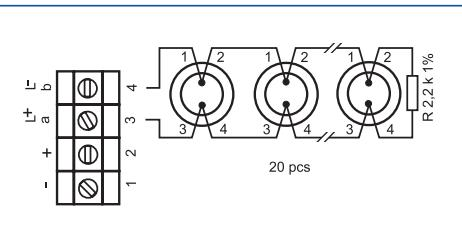
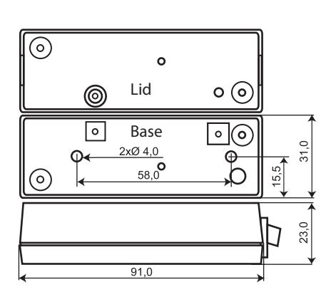

## **IU 300 INTERFACEENHET FÖR GD 335 OCH GD 375**

## **Fördelar**

- Analysator- och reläenhet med reläutgång
- Anpassad för de flesta centralapparater
- Upp till 20 detektorer kan anslutas
- Programmerbart relä för latch eller auto-reset
- 9-30 VDC

IU 300 är en analysator- och reläenhet till GD 335 och GD 375 serien glaskrossdetektorer för anslutning till en centralapparat. Upp till 20 detektorer kan anslutas till en analysatorenhet. IU 300 övervakar resistansförändringar i en balanserad larmslinga. Den är programmerbar till Latch för manuell återställning eller Auto-reset efter 2 sekunder.

Anmärkning: Larm från en detektor aktiverar larmreläet på analysatorenheten.

| Matningsspänning  9 - 15 VDC / 15 – 30 VDC                        |  |
|-------------------------------------------------------------------|--|
| Strömförbrukning  10 mA (16 mA vid larm)                          |  |
| LarmutgångRelä, NC                                                |  |
| Kontaktdata48 VDC / 100 mA                                        |  |
| Larmindikering  LED                                               |  |
| Sabotageskydd Ja                                                  |  |
| Larmtid 2 sek / kvarhållande                                      |  |
| Larmåterställning  Brytning av spänningen / Styringång / Manuellt |  |
| AnslutningSkruvplint                                              |  |
| Kapsling, Färg  IU 300 ABS plast, Vit                             |  |
| Kapsling, Färg  IU 300-M Metall, Grå                              |  |
| Arbetstemperatur –40 – +70°C                                      |  |
| Kapslingsklass IP 41                                              |  |
| Mått (L x B x H) mm 91 x 31 x 23                                  |  |
|                                                                   |  |

## **Beställningsinformation**

| Typ      | E-nr    | Beskrivning                                             | Paket |
|----------|---------|---------------------------------------------------------|-------|
| IU 300   | 6332540 | Analysatorenhet för GD 335 / GD 375, vit plastkapsling  | 1st   |
| IU 300-M | 6332541 | Analysatorenhet för GD 335 / GD 375, grå metallkapsling | 1st   |