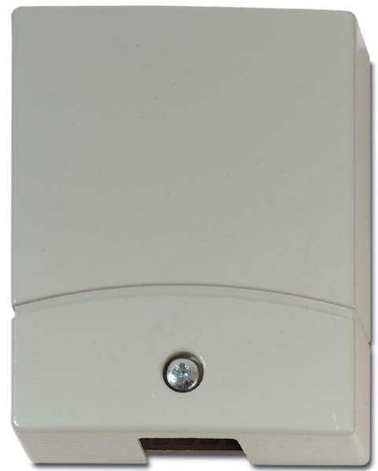

### **Produktblad**

## **VV600-PLUS**

Seismisk detektor för valv och kassaskåp

#### **Överlägsen detektering**

De seismiska detektorerna i VV600-Plus serien är konstruerade för att upptäcka försök till inbrott i valv, kassaskåp, serviceboxar, uttagsautomater och andra säkerhetsklassade objekt, såsom dataoch arkivskåp. De seismiska detektorerna reagerar på vibrationsmönster som är typiska för alla inbrottsverktyg, som hammare, borrar, diamantsågar, hydrauliska och termiska verktyg, som skärbrännare och termiska lansar. De uppfattar vibrationer som uppträder inom en radie på 3 - 14 meter från monteringsstället, beroende på det skyddade objektets konstruktion och material.

#### **Utmärkt skydd mot falsklarm**

VV600-Plus serien tillåter samtidigt fri rörelse runt det skyddade området utan risk för oönskade larm. För att uppnå denna höga grad av precision har samtliga detektorer "tre detektorer i en". För att skilja mellan störningar i omgivningen och verkliga angrepp av inkräktare analyseras signalfrekvens, varaktighet och amplitud via alla tre kanalerna (räkning, integrering och explosion). I slutändan ger det detektorer med enastående detektering och skydd mot falsklarm.

#### **Testning och tillbehör**

VV600 Plus-serien är försedd med två olika testfunktioner. Du kan välja mellan ett internt test av elektroniken i detektorn eller, med hjälp av testsändaren VT705P, funktionstesta detektorn och dess fysiska förbindelse med skyddsobjektet. För att uppnå högsta möjliga säkerhet finns ett komplett sortiment tillbehör för alla slags tillämpningar.

#### **Standardprestanda**

- E**Reagerar på alla kända typer av angrepp**
- **Avancerad signalbehandling skiljer mellan naturligt bakgrundsljud och verkliga angrepp** E
- E**Mycket låg strömförbrukning**
- E**Två testalternativ**
- E**Justerbar känslighet**
- E**Fullständigt ingreppskydd**
- E**Fullständigt tillbehörssortiment**
- E**Lätt att installera**

# **VV600-PLUS**

Seismisk detektor för valv och kassaskåp

#### **Tekniska data**

| Matningsspänning        | 9-15 VDC, max 2 Vpp                                                       |
|-------------------------|---------------------------------------------------------------------------|
| Strömförbrukning        | 8.6 mA nominellt                                                          |
| Larmutgång              | Halvledarrelä NC, max resistans 35 Ohm                                    |
| Larmindikation          | LED-indikering, skruv nr 3                                                |
| Justering av känslighet | 5 steg på omkring 6 dB vardera                                            |
| Testutgång              | Skruv nr 4, för att mäta nivån på omgivande ljud                          |
| Intervall               | 3 - 14 m radie. Se monteringsanv. före montering                          |
| Sabotageskydd           | Temperatur +84 °C, borrskydd, öppningskontakt, ingreppsskyddad kontakt |
| Underspänningslarm      | 7.5 V                                                                     |
| Kapslingsklass          | IP30                                                                      |
| Drifttemperatur         | -20 °C till +55 °C                                                        |
| Relativ fuktighet       | 90% vid +30 °C                                                            |
| Mått                    | 81 x 101 x 28 mm                                                          |
| Färg                    | Grå, RAL 7035                                                             |
| Vikt                    | 380 g                                                                     |
| SBSC intyg              | 1-1534                                                                    |
|                         |                                                                           |

### **Order data**

| Beskrivning                                            |
|--------------------------------------------------------|
| Movable Mounting Kit                                   |
| Key-hole protection kit                                |
| Spacer for VM652P, 5mm                                 |
| Tamper-proof Metal Junction Box                        |
| Test Transmitter                                       |
| Seismisk detektor för valv och kassaskåp               |
| Cable insert for double conduit                        |
| Weather protection box                                 |
| Recess mounting box, Floors                            |
| Recess mounting box, wall                              |
| Seismic detector for ATMs and night safe deposit boxes |
| Cable insert for round conduit                         |
| Monteringsplatta för betong                            |
| Armed Cable Kit                                        |
| Steel plate for tack welding                           |
|                                                        |

