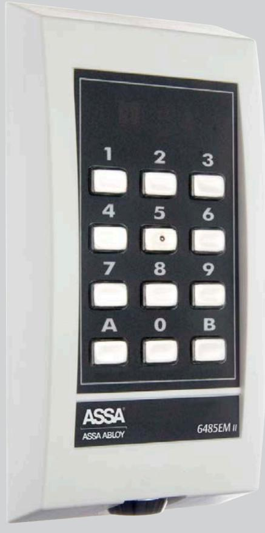
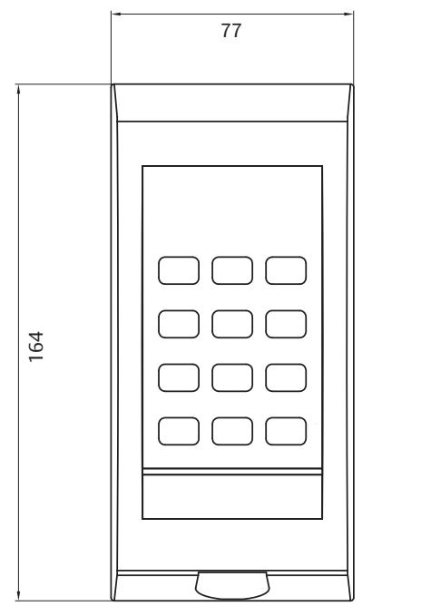
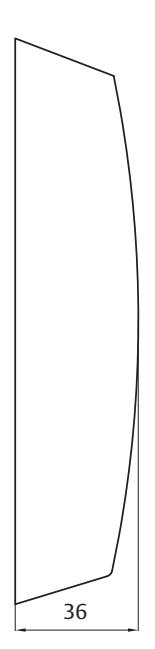

# ASSA 6485EM Beröringsfri läsare med knappsats

6485EM är en beröringsfri läsare med knappsats med belyst bakgrund.

Knapparna har en distinkt tryckkänsla. 6485EM kan även användas som larmförbikopplare eller kodlås.

6485EM har tydliga upplysta symboler, såsom grön/röd gubbe, larmstatus, slå kod och presentera kodbärare.

Läsaren passar både för inom- och utomhusbruk då den uppfyller kraven för IP54. Den används lämpligen i miljöer som t ex garage, kontor eller i offentliga lokaler.

# ASSA 6485EM Beröringsfri läsare med knappsats

## **Indikeringar**

- • Kortläsare i drift/redo
- • Dörr olåst
- • Dörrkod/kodlåsfunktion
- • Kort/tag + PIN-kod
- • Spärrad för passage
- • Visar larmstatus för larmbehörigt kort/tag
- • Ogiltigt kort/tag

### **Material**

- • Halon/Halogenfri
- • Gjuten bottenplatta

### **Data**

- • Matningsspänning: 12 V DC
- • Strömförbrukning: 100 mA
- • Vikt: 0,4 kg
- • Temperaturområde läsare: -25ºC till +70ºC
- • Lästeknologi: EM4102
- **Tillbehör**
- • 6160RS Regnskydd

#### **Kan anslutas till**

- • ARX och RiTA system
#### **Övrigt**

- • Har inbyggd sabotagekontakt
- • Uppfyller kraven för IP54
- • Läsavstånd 5-10 cm
- • Snabb avläsning
- • Antenntestläge
- • Låsbar kapsling
- • Belyst knappsats

#### **Artikelnummer**

- • Läsare 6485EM Vit S556 485 085 E58 760 74
- • Läsare 6485EM Svart S556 485 084 E58 760 73

www.assa.se

phone +46 (0)16 17 70 00 fax +46 (0)16 17 72 10 Customer support: phone +46 (0)771 640 640 fax +46 (0)16 17 73 72 e-mail: helpdesk@assa.se

ASSA ABLOY, the global leader in door opening solutions, dedicated to satisfying end-user needs for security, safety and

ASSA AB P.O. Box 371 SE-631 05 Eskilstuna Sweden

convenience.