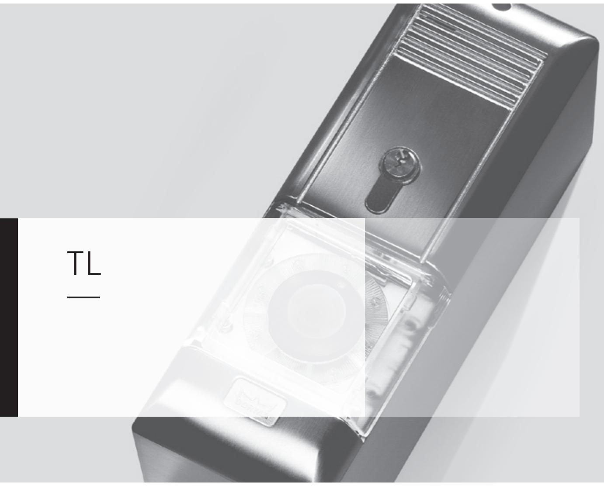
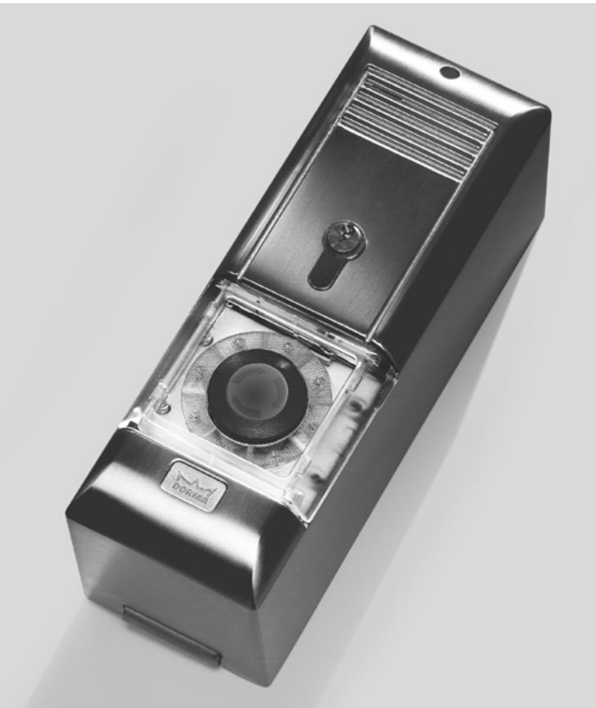
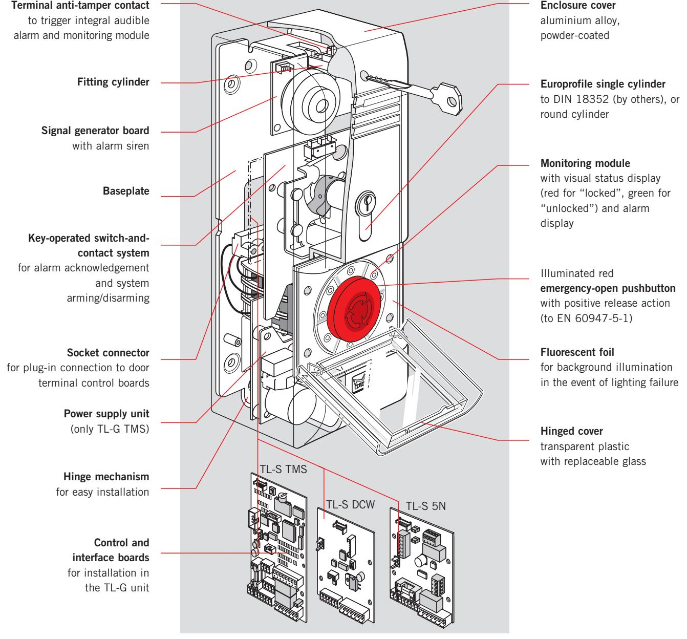
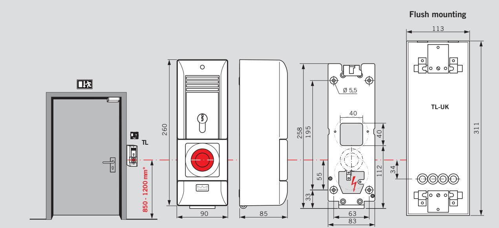
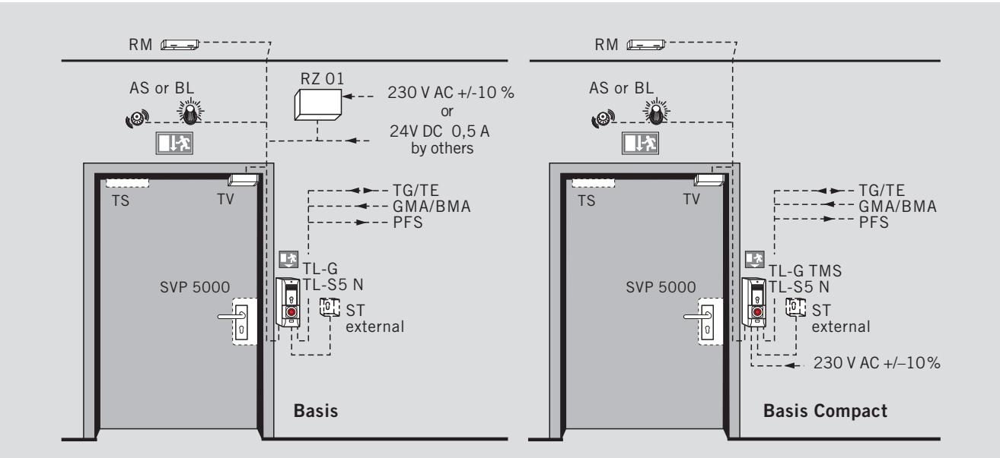
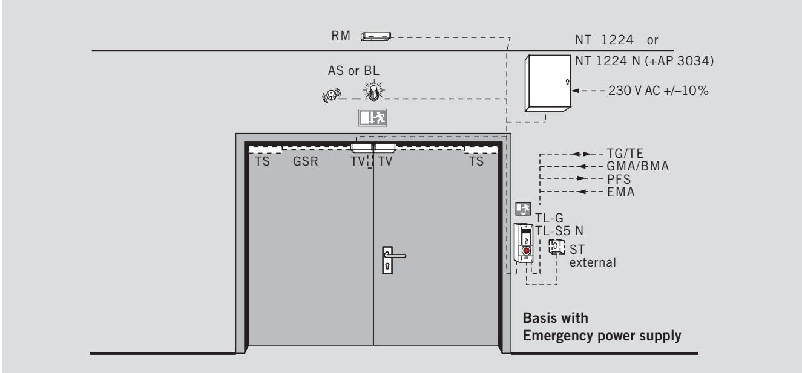
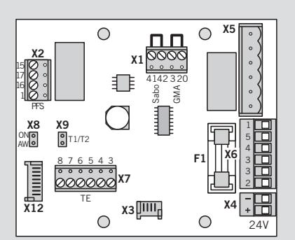
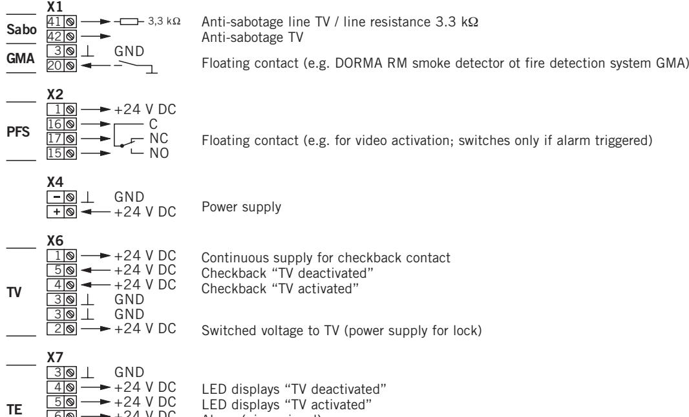
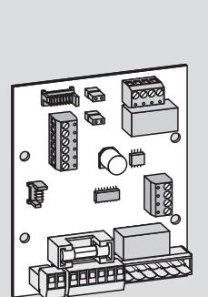
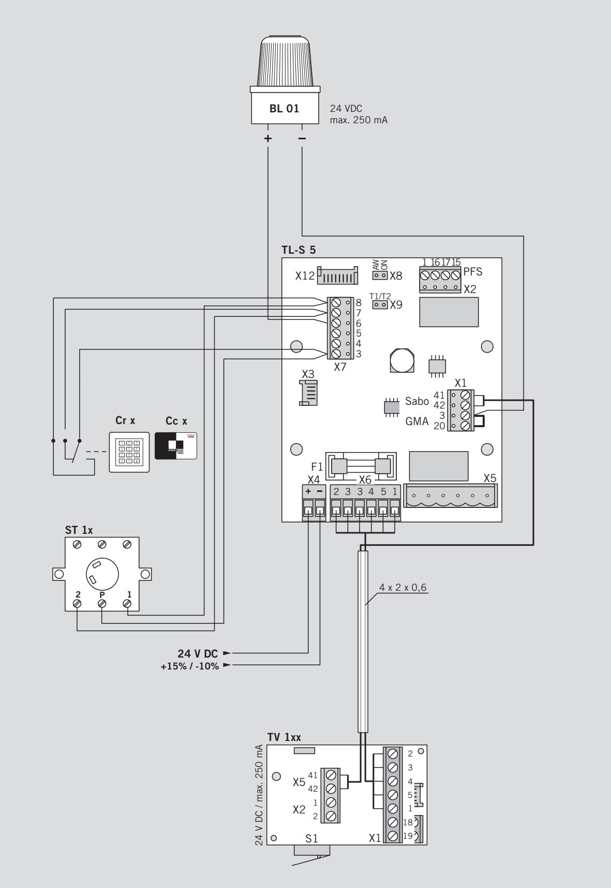

Door Terminal Tl-G+Tl-S5N

WN 052 237 51532, 12/12, Tl, GB, x. DMS. xx/12

Subject to change without notice

DORMA GmbH+Co. KG DORMA Platz 1 58256 EnnEPEtAl

Phone +49 2333 793-0 Fax +49 2333 793-4950

DORMA_U4-Adressen_CI-2012.indd 6 31.10.12 12:42

GERMAny

**Layout S. 6 – DORMA CI-2012 • Englisch • Stand 11.09.2012**

www.dorma.com

### Door terminal for emergency exit control systems —

### Quite simply safer —

Normally securely locked, but quick and easy to open in an emergency. These are the most important requirements for doors in emergency exits and escape routes. Electronic emergency exit control systems are the best solution for these conflicting requirements.

#### **Approval certification**

DORMA emergency exit control systems meet the provisions of the German Building Inspectorate code of practice entitled "Requirements for electrical

locking systems on doors in emergency escape routes" (EltVTR), and also the draft standard DIN EN 13637.

## The modular alarm unit for everyday security —

With improved ergonomic features and a range of innovative technical solutions, the DORMA TL door terminal offers increased safety and optimal protection against misuse.

#### **The advantages in detail**

- **.** Aluminium alloy enclosure with anti-tamper contact ensures protection from intentional and unintentional misuse.
- **.** Suitable for surface or flush mounting and for round or Europrofile cylinder.
- **.** Easy and rapid installation by means of fixing lock cylinder and integral hinge mechanism.
- **.** Monitoring module provides a visual indication of the lock status.
- **.** Locking/unlocking by means of integrated key-operated switch-and-contact system.
- **.** Illuminated emergency-open pushbutton with protective cover and anti-tamper contact.

#### **Data and features**

|                                                                                                               | TL-G + TL-S5N | TL-G NT + TL-S5N |
|---------------------------------------------------------------------------------------------------------------|---------------|------------------|
| Connection to 24 V DC supply                                                                                  | 3             | –                |
| Connection to 230 V AC supply                                                                                 | –             | 3                |
| Door opening in emergency via emergency-open pushbutton                                                       | 3             | 3                |
| Permanent deactivation                                                                                        | 3             | 3                |
| Short-time deactivation, 5 or 10 sec                                                                          | 3             | 3                |
| Visual and audible status messages                                                                            | 3             | 3                |
| Emergency unlocking via fire alarm (BMA), hazard warning system (GMA), smoke detector (RM), sprinkler etc. | 3             | 3                |
| Passage from inside to outside via door terminal (TL)                                                         | 3             | 3                |
| Passage from outside to inside via key switch (ST)                                                            | §             | §                |
| TL anti-tamper monitoring                                                                                     | 3             | 3                |
| TV anti-tamper monitoring                                                                                     | 3             | 3                |
| Emergency power supply                                                                                        | §             | §                |
| Access control system                                                                                         | §             | §                |
| Connection to intruder alarm system (EMA)                                                                     | 3             | 3                |
| Connection to external alarm                                                                                  | 3             | 3                |
| Remote monitoring / control                                                                                   | §             | §                |

3 Standard § Optional – Not available

#### **Note**

According to the "Guidelines on electric locking systems for doors used in emergency exits and escape routes" (EltVTR) issued by the German Institute for Building Technology (DIBt), Berlin, the emergency

pushbutton for release/ emergency opening of door must be not be installed at a height of more than 1200 mm above finished floor level. A height of 850 mm is recommended.

### System examples —

| Recommended cabling Mains feeder: NYM - I 3 x 1,5 Recommended cabling |                                                                                                                               |                                                        |  |
|-----------------------------------------------------------------------------|-------------------------------------------------------------------------------------------------------------------------------|--------------------------------------------------------|--|
| Mains feeder TL                                                          | Recommended cabling System cabling: I - Y (ST) Y NYM-I 3 x 1.5 Mains feeder: NYM - I 3 x 1,5 GMA = 2 x 2 x 0,6 | max. 1000 m                                            |  |
| System cabling TL                                                        | System cabling: I - Y (ST) Y TV I - Y (ST) Y = 4 x 2 x 0,6                                                           |                                                        |  |
| TL TL TL GMA TL TL                                           | GMA = 2 x 2 x 0,6 ST = 4 x 2 x 0,6 2 x 2 x 0.6 TV = 4 x 2 x 0,6 TG/TE = 4 x 2 x 0,6                      | max. 1000 m max. 50 m max. 1000 m max. 1500 m |  |
| TL TL TV TL                                                        | ST = 4 x 2 x 0,6 4 x 2 x 0.6 BL = 2 x 2 x 0,6                                                                     | max. 50 m max. 50 m                                 |  |
| TL TL TL ST TL                                                  | TG/TE = 4 x 2 x 0,6 AS = 2 x 2 x 0,6 4 x 2 x 0.6 BL = 2 x 2 x 0,6                                              | max. 1500 m max. 50 m max. 50 m max. 50 m  |  |
| RZ TL TG/TE TL                                                     | TL = 2 x 2 x 0,6 AS 4 x 2 x 0.6 = 2 x 2 x 0,6                                                                     | max. 100 m max. 50 m max. 1500 m                 |  |
| RZ TL BL                                                              | TL = 2 x 2 x 0,6 2 x 2 x 0.6                                                                                            | max. 100 m max. 50 m                             |  |
| TL AS                                                                    | 2 x 2 x 0.6                                                                                                                   | max. 50 m                                           |  |
| RZ TL                                                                    | 2 x 2 x 0.6                                                                                                                   | max. 100 m                                             |  |

## TL-G Door Terminal —

#### **Specification text Order No.**

| TL-G 3xx/5xx                                                                                     |                                                                        |          |
|--------------------------------------------------------------------------------------------------|------------------------------------------------------------------------|----------|
| Anti-tamper door terminal of powder-coated aluminium alloy, degree                               |                                                                        |          |
| of protection IP 40, for receiving the TL-S control and interface                                |                                                                        |          |
|                                                                                                  | boards, with LED-illuminated, red emergency pushbutton to EN           |          |
|                                                                                                  | 60947-1-1, positive opening action, and integrated alarm siren with    |          |
| adjustable volume > 100 dB.                                                                      |                                                                        |          |
|                                                                                                  | High-intensity illuminated emergency pushbutton surround with          |          |
|                                                                                                  | visual indication of the lock status (unlocked = green, locked = red), |          |
|                                                                                                  | and visual alarm by yellow flashing light in the event of tamper or    |          |
| authorised operation of the emergency pushbutton. Easy fitting of                                |                                                                        |          |
|                                                                                                  | the terminal top section and bottom section by means of fixing lock    |          |
| cylinder accessible from the front, and hinged upper section.                                    |                                                                        |          |
|                                                                                                  | Lockable hinged emergency pushbutton cover with anti-tamper            |          |
|                                                                                                  | contact and transparent lens of safety glass. Breakable safety glass   |          |
|                                                                                                  |                                                                        |          |
| with protective film optionally available. Integrated key-operated switch-and-contact system. |                                                                        |          |
| Dimensions (W x H x D): approx. 90 x 260 x 84 mm                                                 |                                                                        |          |
|                                                                                                  |                                                                        |          |
| Y Prepared for single Europrofile cylinder by others to DIN 18252                                |                                                                        |          |
|                                                                                                  | (locking cam centre 30–32.5 mm, overall length 40.5–43.5 mm),          |          |
| locking cam position bottom left (max. 45°)                                                      |                                                                        |          |
| Y TL-G 320                                                                                       | green (similar to RAL 6001)                                            | 56010320 |
| Y TL-G 311                                                                                       | white (similar to RAL 9016)                                            | 56010311 |
| Y TL-G 304                                                                                       | stainless steel, "Design" finish                                       | 56010304 |
| Y TL-G 399                                                                                       | special colour                                                         | 56510399 |
| Y Prepared for single round cylinder, 22 mm dia., by others                                      |                                                                        |          |
|                                                                                                  | (locking cam centre 30–32.5 mm, overall length 40.5–43.5 mm),          |          |
| locking cam position bottom left (max. 45°)                                                      |                                                                        |          |
| Y TL-G 520                                                                                       | green (similar to RAL 6001)                                            | 56010520 |
| Y TL-G 511                                                                                       | white (similar to RAL 9016)                                            | 56010511 |
| Y TL-G 504                                                                                       | stainless steel, "Design" finish                                       | 56010504 |
| Y TL-G 599                                                                                       | special colour                                                         | 56510599 |
| TL-G 3xx/5xx NT                                                                                  |                                                                        |          |
| like TL-G 3xx/5xx, but with integrated power supply.                                             |                                                                        |          |
| Power supply:                                                                                    | 230 V AC, +/– 10%                                                      |          |
| Output voltage:                                                                                  | 24 V DC                                                                |          |
| Current input, max.:                                                                             | 1 A                                                                    |          |
| Temperature range:                                                                               | –20 to +50 °C                                                          |          |
|                                                                                                  |                                                                        |          |
|                                                                                                  | Y Prepared for single Europrofile cylinder by others to DIN 18252      |          |
|                                                                                                  | (locking cam centre 30–32.5 mm, overall length 40.5 – 43.5 mm),        |          |
| locking cam position bottom left (max. 45°)                                                      |                                                                        |          |
| Y TL-G 320 NT                                                                                    | green (similar to RAL 6001)                                            | 56310320 |
| Y TL-G 311 NT                                                                                    | white (similar to RAL 9016)                                            | 56310311 |
| Y TL-G 304 NT                                                                                    | stainless steel, "Design" finish                                       | 56310304 |
| Y TL-G 399 NT                                                                                    | special colour                                                         | 56310399 |
|                                                                                                  |                                                                        |          |
| Y Prepared for single round cylinder, 22 mm dia., by others                                      |                                                                        |          |
|                                                                                                  | (locking cam centre 30–32.5 mm, overall length 40.5 – 43.5 mm),        |          |
| locking cam position bottom left (max. 45°)                                                      |                                                                        |          |
| Y TL-G 520 NT                                                                                    | green (similar to RAL 6001)                                            | 56310520 |
| Y TL-G 511 NT                                                                                    | white (similar to RAL 9016)                                            | 56310511 |
| Y TL-G 504 NT                                                                                    | stainless steel, "Design" finish                                       | 56310504 |
| Y TL-G 599 NT                                                                                    | special colour                                                         | 56310599 |

|            | Specification text                                                                                                                                                                                                                                           | Order No.                        |
|------------|--------------------------------------------------------------------------------------------------------------------------------------------------------------------------------------------------------------------------------------------------------------|----------------------------------|
|            |                                                                                                                                                                                                                                                              |                                  |
|            | TL-UK Zinc-plated recess box for flush installation of the door terminal, with attachment collars as wall anchors. Adjustable baseplate for correction of vertical installation tolerances. Prepared for cable entry at front and rear.          |                                  |
|            | Dimensions (W x H x D): approx. 113 x 311 x 77 mm. TL-BR Trim, adjustable for adaptation to depth of installation. Dimensions (W x H x D): approx. 130 x 331 x 4 mm. Surface finish:                                                             | 56510512                         |
|            | Y TL-BR 08 yellow green fluorescent Y TL-BR 11 white powder-coated (similar to RAL 9016) Y TL-BR 04 stainless steel, "Design" finish                                                                                                          | 56510408 56510411 56510404 |
| 10,5 30 | TL-Z 03 Single Europrofile cylinder with 3 keys, with adjustable locking cam (lever), suitable for use with DORMA TL-G, TE, ST and lockable sheet steel enclosures for NT 1224 N, SVP-S 25 (not suitable for master key or keyed alike systems). | 56510300                         |
|            | TL-Z 04 Replacement lens for emergency pushbutton cover TL-G 3xx/5xx. Breakable safety glass with protective film. Supplied in packs of 5                                                                                                           | 56510400                         |
|            | TL-Z 05 Replacement lens for emergency pushbutton cover, 2 mm, not breakable.                                                                                                                                                                          | 35568501140                      |

# TL-S5N Control and Interface Board —

#### **The proven solution in DORMA emergency exit control systems**

Particularly suitable for single-door solutions with no special requirements for subsequent system expansion.

| Technical data      |                               |
|---------------------|-------------------------------|
| Power supply        | 24 V DC +/–10% stabilised     |
| Current input, max. | ca. 95 mA                     |
|                     | ca. 143 mA if alarm triggered |
| Contact rating      | 24 V DC, 0.5 A induktive      |
|                     | 1.0 A ohmic                   |
| Fuse F1             | 1 A T                         |

#### **Terminal assignment and functions**

- **X3** Connection to key switch
- **X4** Connection to emergency pushbutton
- **X8** Jumper "automatic re-activation" Jumper inserted (ON) = with automatic re-activation Jumper removed (OFF) = without automatic re-activation
- **X9** Jumper "Timer setting automatic re-activation" Jumper inserted (ON) = 5 seconds Jumper removed (OFF) = 10 seconds
- **X11** Connection to TL-OM / lighting modul

+24 V DC

Power supply

Continuous supply for checkback contact Checkback "TV deactivated" Checkback "TV activated"

Switched voltage to TV (power supply for lock)

LED displays "TV deactivated" LED displays "TV activated" Alarm (piezo signal) Key switch "activate TV", pulse signal GND Key switch "deactivate TV", pulse signal GND

6

7

8

#### **Specification text Order No.**

#### **Control and interface board DORMA TL-S5 N**

Control and interface board for installation in TL-G TMS with integrated power supply or TL-G in conjunction with the DORMA RZ 01/NT 1224 power supply units or 24 V DC +/– 10 % power supply source by others. Designed for connection of max. two TV electro-mechanical locking elements, ST key switch or access control system by others, TG/TE monitoring and control unit, BL flashing lamp or AS external alarm siren, hazard warning system (GMA) and/or fire alarm system (BMA), or RM smoke detector for activation via floating (no-volt) NC contact. Emergency release activates PFS floating (no-volt) switch output, also suitable for operation of CCTV etc. Automatic reactivation following power failure. Activation of the integrated permanent disarming function via key-operated momentary contact device. Short-term release with automatic activation (5/10 seconds) instead permanent release via bridge on controlboard possible.

| Power supply:        | 24 V DC, +/– 10% stabilised     |          |
|----------------------|---------------------------------|----------|
| Current input, max.: | approx. 95 mA                   |          |
|                      | approx. 143 mA (alarm emission) |          |
| Contact rating:      | 24 V DC,                        |          |
|                      | 0,5 A inductive / 1,0 A ohmic   | 56030055 |

## Connection diagram —

## Safety information —

DORMA emergency exit systems are designed, developed and manufactured in accordance with the latest state of the art and in line with recognised technical safety regulations and standards. They meet the requirements of the code of practice entitled "Requirements for electrical locking systems on doors in emergency escape routes" (EltVTR, December 1997 edition) published in Bulletin 5/98 of the German Institute for Building Technology, Berlin. Test and approval certificates issued by the MPA NRW (Material Testing Authority) and VdS Cologne (Association of Property Insurers) are available.

**Compliance with the following instructions by the installer and operator is imperative to ensuring that these devices do not impede unhindered escape of persons in the event of a hazard-related emergency.**

#### **Usage**

Emergency exit systems are electrical locking systems for doors in emergency exits and escape routes. They are designed in order to prevent improper or unauthorised usage of the associated access points. When installing and using DORMA emergency exit systems, compliance with the technical data and the requirements emanating from prevailing local conditions is essential.

#### **Preliminary building enquiry / Planning application / Approval procedure – The German example –**

Emergency exit systems do not fall under the compass of current building law and approval is subject to a discretionary exemption in the sense of § 67 Musterbauordnung [Outline building regulations]. In addition, the requirements according to DIBt 5/98 should also be regarded as ancillary regulations that need to be incorporated within the building approval process for the project in hand.

#### **Planning and installation**

A DORMA emergency exit system consists at least of the components TMS door terminal/central control station and TV electrical door locking element. Depending on the design of the emergency exit control, the following components may also be connected to the system: Key switch or access control system, monitoring and control unit, emergency escape lock with automatic locking action (switch-monitored or motor lock), flashing lamp or external alarm siren, automatic swing door operator, power pack with emergency power supply, fire alarm and/or hazard alert system, smoke switch.

#### **The electrical door locking element may only be used on emergency exit doors in conjunction with products approved by DORMA.**

The door terminal (local system release/emergency opening of door) should be mounted in the immediate vicinity of the door handle so that the centre of the emergency pushbutton is at a height of 850 mm to max. 1200 mm above the finished floor level.

The emergency pushbutton must be indicated with an adhesive label showing the inscription "Emergency Exit". The adhesive label should be attached such that the arrow points to the emergency pushbutton.

In buildings with automatic fire extinguishing equipment, fire alarm or other hazard alert systems, the emergency exit doors with electrical anti-tamper protection must be automatically released for escape on response or activation of these systems.

If, during building usage, there is a constantly manned central control centre with a direct view of the emergency exit doors, the emergency exit release/de-activation switching operation can also be performed from this position.

The properties and characteristics of the fire and smoke rated doors (fire resistance time, smoke retention/sealing function and automatic closing action) must not be impaired by the installation of the electrical door locking device.

In Germany, modifications to fire doors or other fire barriers which are necessary for the installation of an electrical door locking element and which go beyond the modifications indicated as permissible in Bulletin 1/1996 of the DIBt, require general building approval and/or agreement of the authorities responsible in each individual case. Consult local/national authorities for guidance.

#### **Only use DORMA spare parts or DORMA approved accessories.**

**Any work on electrical equipment not operating on protective low voltage must always be performed by suitably qualified electricians.**

**Installation, commissioning and maintenance work may only be performed by qualified personnel authorised by DORMA.**

**The keys for the door terminal and emergency exit control box must be kept secure. Keys for products not operating on protective low voltage may only be handed over to suitably qualified electricians.**

#### **Standards and regulations**

Compliance with all relevant national or regional regulations, standards, guidelines and directives (latest edition in each case) must be ensured.

The following publications provide a useful general regulatory framework for ensuring system safety:

- **.** DIBt bulletin 5/98 "Requirements for electrical locking systems on doors in emergency escape routes" (EltVTR),
- **.** DIBt bulletin 1/96 Modifications to fire doors and fire rated barriers.
- **.** DIN VDE 0100, 0800, 0815
- **.** Regulations governing the installation of electrical equipment
- **.** DIN 0833 Part 1-3
- **.** Regulations governing hazard alert systems for fire, burglary and robbery detection and alarm
- **.** German building regulations list A, Part 1
- **.** Special building regulations
- **.** prEN 13637 Building Hardware Electrically controlled emergency exit systems

Country-specific regulations, standards and guidelines must be observed.

**Layout S. 6 – DORMA CI-2012 • Englisch • Stand 11.09.2012**

DORMA GmbH +Co. KG DORMA Platz 1 58256 EnnEPE tA l GERMAny Phone +49 2333 793-0 Fax +49 2333 793-4950 www.dorma.com

DORMA_U4-Adressen_CI-2012.indd 6 31.10.12 12:42