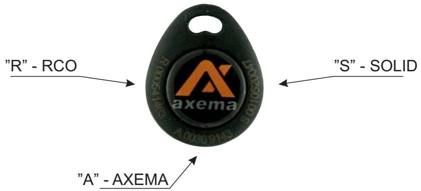

## **Olika ID koder på PR4**

## **Beröringsfri Bricka PR4**

På PR4 brickan finns nu tre olika ID koder (sifferkombinationer) graverade, som anger EM chipets identitet anpassat för de flesta Svenska läsarfabrikat.

ID koderna är märkta med "R" för RCO, "A" för Axema samt "S" för Solid.

ID koden behövs när man manuellt skall ange brickans identitet i ett Passersystem via PCmjukvaran, och inte använder en separat läsare vid PC'n (USB-läsare o dyl.).

OBS! ID koden är mycket viktig när man använder så kallade Stand Alone läsare (kompaktläsare) utan PC-mjukvara. Här anges brickans identitet manuellt direkt till läsarens minne, och sifferkombinationen måste noteras för att det skall vara möjligt att senare radera en borttappad bricka. Om detta inte följs finns endast möjligheten att radera samtliga inloggade brickor.

För Axemas läsare och system skall således siffrorna efter "A" användas, för RCO skall "R" användas och för Solid/ASSA gäller siffrorna efter "S".

ID koden För övriga typer av läsare och system kan man prova "A" kodningen. **"A" passar även Bewator/Siemens, Tidomat och Aptus.**

Nummerföljd: Axema levererar PR-4 brickor med i nummerföljd (gäller EJ Solid). Detta innebär stora fördelar i synnerhet när ditt passersystem har stöd för programmering av brickor/kort i nummerföljd, genom att t ex ange första ID koden i en serie och därefter antalet brickor i serie. Det tar bara några sekunder att på detta sätt programmera 100-tals brickor.