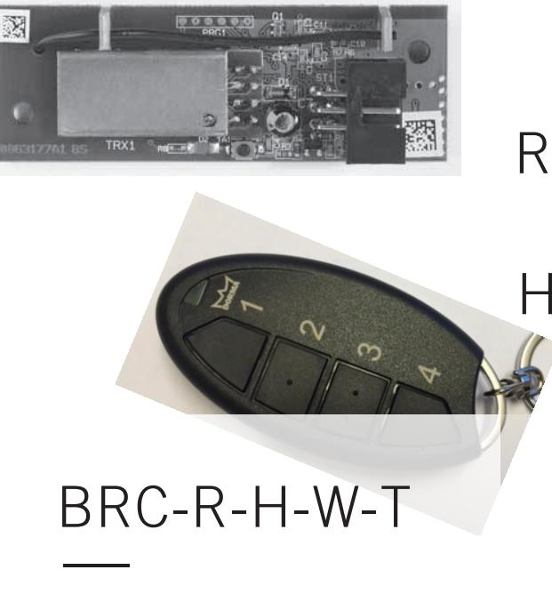
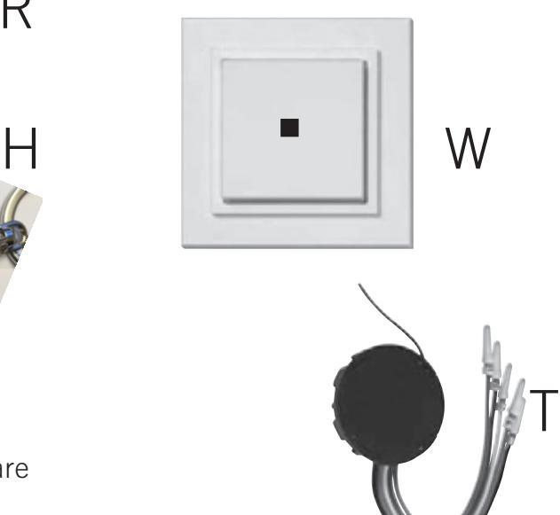
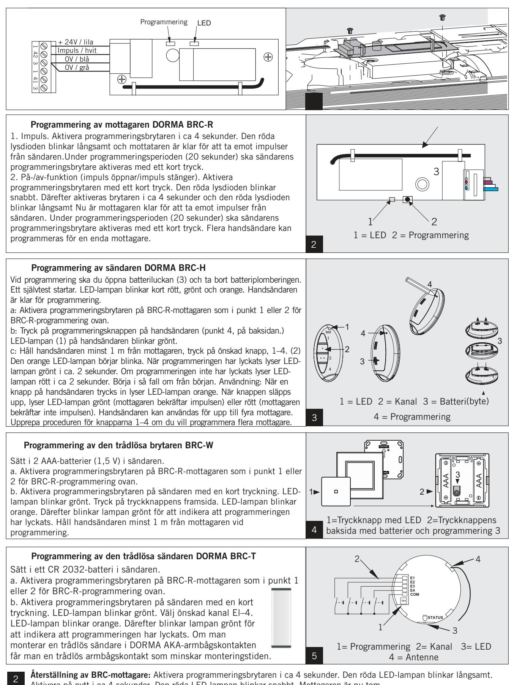

Integrerad radiomottagare och sändare

#### DORMA BRC-systemet består av olika komponenter för trådlös användning av dörrautomatik.

## Mottagaren BRC-R

Radiomottagare med transistorutgång avsedd för montering i DORMAs dörrautomatiker. Den här mottagaren kan användas av flera olika sändare: handsändare, trådlös sändare och trådlös brytare. Upp till 1 024 sändare kan programmeras för mottagaren. Driftspänning: 24 V DC stabiliserat. Vid användning tillsammans med ED200 måste spännings-regulator användas (art.nr. 7005701423009).

#### Handsändaren BRC-H

Ny radiosändare med 4 kanaler. Sändaren har en räckvidd på upp till 80 meter (beroende på byggnadskonstruktion). Drivs med ett AAA-batteri av standardtyp med en livslängd på upp till 5 år vid 10

användningstillfällen/dag. Sändaren har en integrerad statuslampa (LED) som indikerar om signalen når fram.

#### Den trådlösa brytaren BRC-W

Trådlös brytare med inbyggd radiosändare. Sändaren har en räckvidd på upp till 80 meter (beroende på byggnads-konstruktion). Drivs med två AAA-batterier av standard-typ med en livslängd på upp till 5 år vid 10 användningstillfällen/dag. Sändaren har en integrerad statuslampa (LED) som indikerar om signalen når fram. Levereras med dubbelsidig tejp för montering på till exempel glasytor eller skruvas direkt i väggen.

## Den trådlösa sändaren BRC-T

 Ny radiosändare med 4 kanaler. Sändaren kan integreras i t.ex. en AKAarmbågskontakt. Sändaren har en räckvidd på

| Utförande | Art. nr |
|-----------|---------|
|           |         |

BRC-R kretskort 29302002 Frekvens 868,3 MHz. Mått i mm: 70x24x13,2 Driftspänning 24 V DC ± 10 %

 BRC-H Sort ABS 29304001 Frekvens 868,3 MHz. Mått i mm: 38x75x14. IP20. Vikt: 26 g utan batteri: 1 x 1,5 V LR03/AAA

 BRC-W Hvit RAL 9016 29301002 Frekvens 868,3 MHz. Mått i mm: 83x83x12 Batteri: 2 x 1,5 V LR03/AAA

BRC-T Sort 29301003 Frekvens 868,3 MHz. Mått i mm: Ø58 dybde 9. IP20. Batteri: Lithium 1 x 3 V CR2032

upp till 80 meter (beroende på byggnadskonstruktion). Drivs med ett litiumbatteri av typen CR2032 med en livslängd på upp till 5 år vid 10 användningstillfällen/dag. Sändaren har en integrerad statuslampa (LED) som indikerar om signalen når fram.

Mer information om installation, certifieringar och godkännanden, tillbehör och monteringslösningar finns på våra webbsidor.

DORMA Sverige AB F O Petersons gata 28 421 31 Västra Frölunda Telefon 031-355 20 00 info@dorma.com www.dorma.com

# DORMA BRC – integrerad radiomottagare och sändare

Aktivera på nytt i ca 4 sekunder. Den röda LED-lampan blinkar snabbt. Mottagaren är nu tom. Återställning av BRC-sändare: Aktivera programmeringsbrytaren i ca 5 sekunder. Den röda LED-lampan blinkar

- www.dorma.se

långsamt. Aktivera på nytt i ca 5 sekunder. Den röda LED-lampan blinkar snabbt. Därefter lyser LED-lampan i ca 3 sekunder. Sändaren är nu tom.