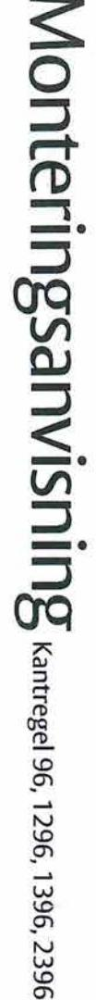

## 96 |อ8 อ้าง

- າງການ ການປະກວດ າລອຍຊາຍ າວໄປ ເປັນປຸກ ແລະ ສອງກາຣາ ເດີ ແດງ ແຂວງ ສະຫຼຸບ ແລະ ແລະ ເ
- urtaget för kantregeln i dörrblader
- eln i dörren mha medföljande skruv (3 st 4
- centrumpunkten för kolven i underk gast genom att forst markers centrum för
- ương xã bịi tây trên xem tại nên trên mang min và máy của và là một và là một và là 191 let till centrum på kolven enligt mått B i tal
- tera slutblecket mha medföljande skruv (2 st 4 x 7

## tregel 1296, 1396 & 2396

- Kantregel 2396 monteras med glidbleck på motsatt sida av dörrens oppr นาธ เวลาวอิตไทย วงศ์ เทธ เครื่องราช เร็ก ทรงเป็นไม้มากัน เป็นที่ตำบล สิทคาวิที่ทำลายที่การใช้ risk för fukt i dörren som orsaker svällande tra eller när dörrblader är
- urtage för kantregeln i dördbladet mina tabell och ritning till höger. On las fräses även den i dörrbladet
- ers eventuell styrhylse mha medioliande skruv ( 2 st
- a kantregel mha medfoljande skruv (2 st 4 x 2)
- sera ut centrumpunkten för kolven i underkant ochfeller öve € blid 18ilns ຊຸດ​​​​​​​​​​​​​​​​​​​​​​​​​​​​​​​​​​​​​​​​​​​​​​​​​​​​​​​​​​​​​​​​​​​​​​​​​​​​​​​​​​​​​​​​​​​​​​​​​​​​​​​​​​​​​​​​​​​​​​​​​​​​​​​​​​​​​​​​​​​​​​​​​​​​​​​​​​​​​
- ståndet till sentrum på kolven enligt mått B i tabellen samt ! ligast genom att först markera centrum för stolpen i fra
- Free market for det tillhönende skudplerket med urgangsponikt från den m hken för fallkolven, justerman ±7 mm enligt bild 2. Kontrollera at
- ntera slutblecket mha medföljande skruv (2 st 4 x 12) eln inte rar i botten på urfräsningen. Kolven kan justeras från 17 mm till

## nderar 3 mm mellan stolpe & sl

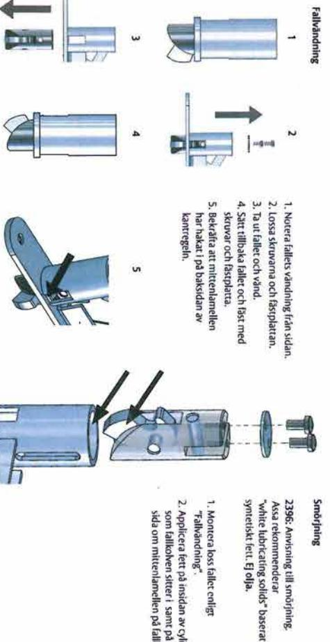

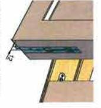

າມເມ Z I ມະຫາປຸລັງ ເຖິງ ກັບຊົນແມ່ນ ( L Pl)
 ເມເມ Z I ມິຖຸພາປຸດັດ L Plat 2: Slutbleck kan pl: m i sidled

ven for placering a

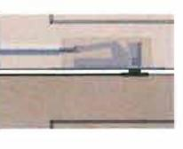

Id 3: Styrhylsa

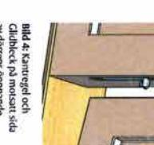

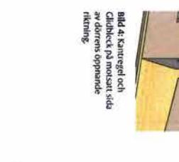

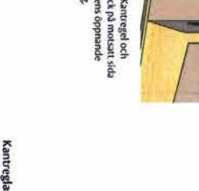

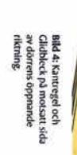

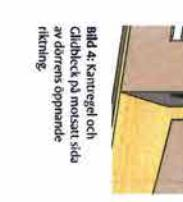

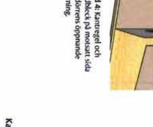

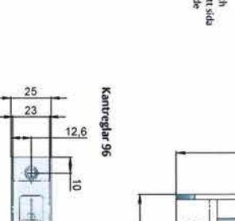

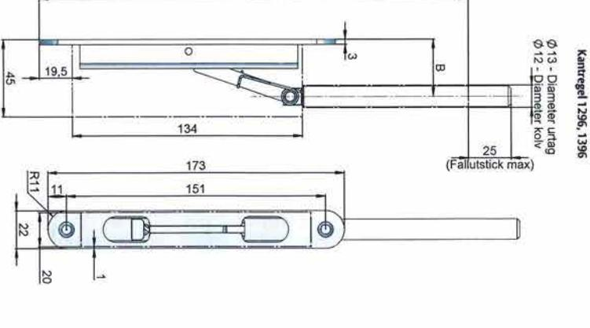

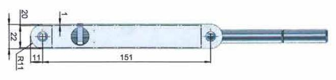

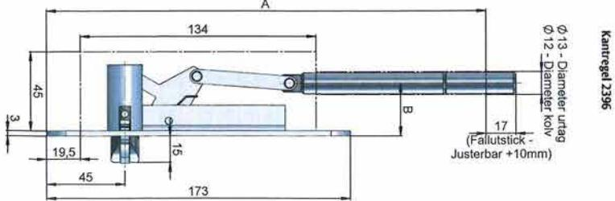

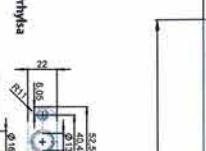

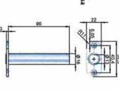

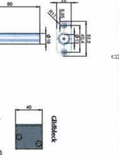

surpleck

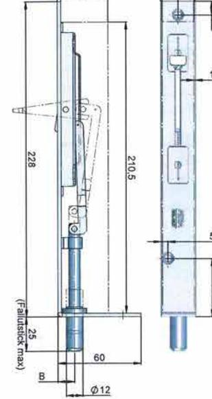

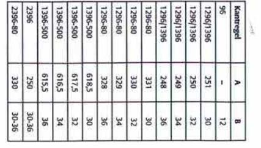

SSA ABI ການຣ ສິນແລະໄດ້ ມິສເຕີອິນເຕີຣ໌ເນຊັນ
ຊາຍຊື້ສັງຊາ ປຸດຕິສັງ ນ

FATTE