# Instruktion fjädergångjärn 279 och 280

#### **Uppspänning**

**Spänn ett gångjärn i taget, börja uppifrån och gå neråt. Använd bara medföljande pinnar för att spänna gångjärnen.**

- Ta bort spännstiftet helt.
- Spänn upp till första spännbara läget på båda sidor.
- Spänn ytterligare ett läge på båda sidor.
- Dra dörren framåt. Går dörren tillbaka lätt så är det bra uppspänt, om dörren stannar (hänger) kvar ute så spänn ett läge till. Om dörren inte stannar i läge med karmen så måste balans uppnås genom att man släpper (ev. spänner) på bara en sida. Prova att spänna lite så ser man åt vilket håll dörren strävar.
- Om det börjar knaka och "läcka" olja ur gångjärnen efter en längre tid så är det ett tydligt tecken på att de är för hårt spända.

#### **Smörjning**

Om gångjärnen behövs smörjas så använd helst ett teflonbaserat smörjmedel med mycket god vidhäftning. Använd ej lättflyktiga oljor som symaskinsolja eller låsolja. Smörjes i genomgående hål enligt "K".

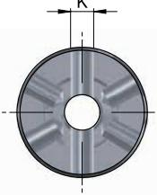

| Art.bet | Mått i mm |    |      |    |    |       |    |      |   | Skruv     |           | Max dörr tjocklek |
|---------|-----------|----|------|----|----|-------|----|------|---|-----------|-----------|----------------------|
|         | H         | B  | C    | D  | E  | M     | G  | R    | T | Antal Dim |           |                      |
|         |           |    |      |    |    |       |    |      |   |           |           |                      |
| 279-100 | 101       | 38 | -    | 22 | 15 | 50,5  | 9  | 14   | 4 | 8         | 4 × 25 | -                    |
| 279-150 | 153,5     | 48 | -    | 28 | 20 | 76,75 | 9  | 18   | 4 | 10        | 5 × 30 | -                    |
|         |           |    |      |    |    |       |    |      |   |           |           |                      |
| 280-75  | 76        | 33 | 48   | 22 | 15 | 38    | 9  | 13,5 | 4 | 8         | 4 × 25 | 25                   |
| 280-100 | 101       | 38 | 54,5 | 22 | 15 | 50,5  | 11 | 14   | 5 | 8         | 4 × 25 | 30                   |
| 280-150 | 153,5     | 48 | 73,5 | 28 | 20 | 76,75 | 11 | 18   | 5 | 10        | 5 × 30 | 42                   |

### **Rekommendationstabell för bestyckning**

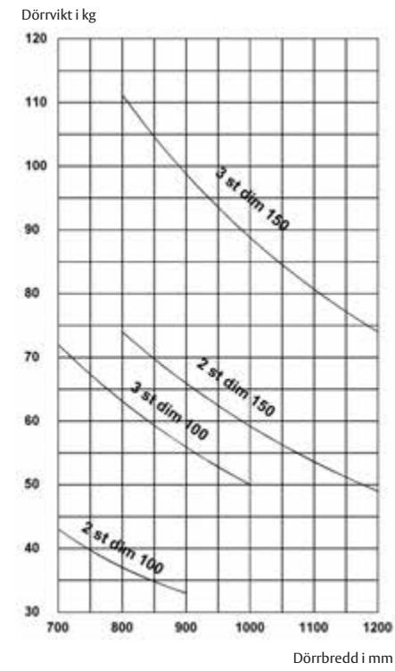

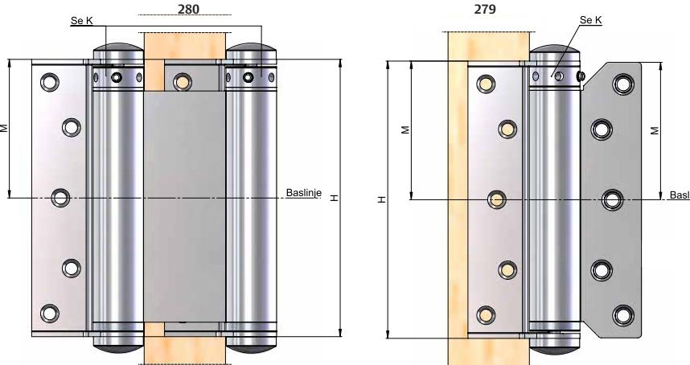

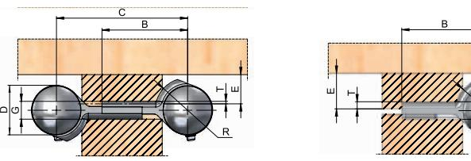

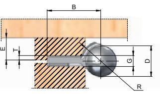

Vid inbyggnad se till att hattarna har fri gång från karm och dörr

in door opening solutions

M2395.1412

# Instruktion fjädergångjärn 2220/2228/2248 och 2466

### **Uppspänning**

- Ta bort spännstiftet helt.
- Spänn upp till första spännbara läget.
- Dra dörren framåt. Går dörren tillbaka lätt så är det bra uppspänt. Om dörren stannar (hänger) kvar ute så spänn ett läge till.
- Om det börjar knaka och "läcka" smörjmedel är det ett tydligt tecken på att det är för hårt spänt.

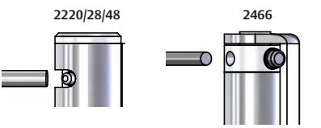

## **Smörjning 2220/2228/2248**

- Spänn upp gångjärnet med hjälp av spännpinnen och ta bort spännstiftet enligt bilden.
- Dra ut spännpinnen och lyft av spännknappen. Om fjädern är hårt spänd kan det vara bra att hålla emot spännknappen med tummen när pinnen lossas.
- Smörj fjädern godtyckligt.
- Sätt tillbaka spännknappen på fjädern. En bra metod är att placera knappen mot fjädern och rotera tills fjädern går ner i spåret. Alternativt använd hålet på sidan att se fjäderns position i spåret på spännknappen.
- Spänn gångjärnet enligt instruktion "Uppspänning".

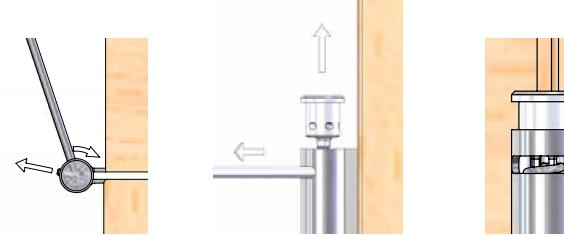

| Modell | Mått i mm |    |    |    |      |     |     |      |  |  |  |  |
|--------|-----------|----|----|----|------|-----|-----|------|--|--|--|--|
|        | A         | B  | C  | D  | E    | F   | G   | R    |  |  |  |  |
| 2220   | 98        | 22 | 49 | 41 | 19   | 2,7 | 2,1 | 11   |  |  |  |  |
| 2228   | 110       | 25 | 55 | 49 | 18,7 | 4,1 | 2,1 | 12,5 |  |  |  |  |
| 2248   | 110       | 36 | 55 | 49 | 18,7 | 4,2 | 2   | 12,5 |  |  |  |  |

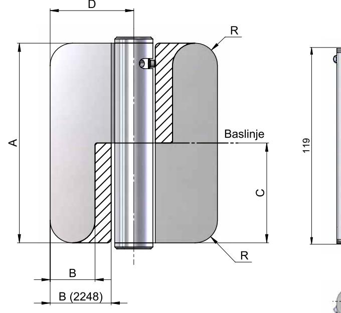

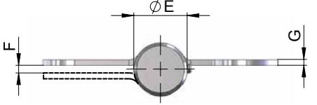

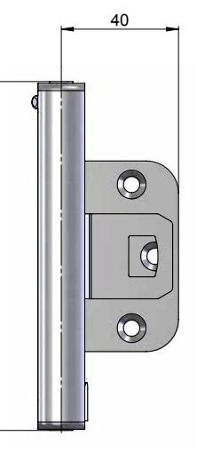

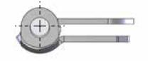

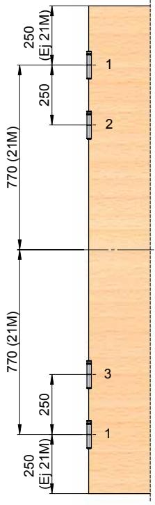

Måtten från dörrens centrum avser dörrar efter svensk standard SS 817052 21M (Modul). Vid andra Modul används mått från över- och underkant enligt ritning. Prioritering av gångjärnens position enligt numrering 1-3 beroende på hur många som används.

ASSA ABLOY, the global leader in door opening solutions