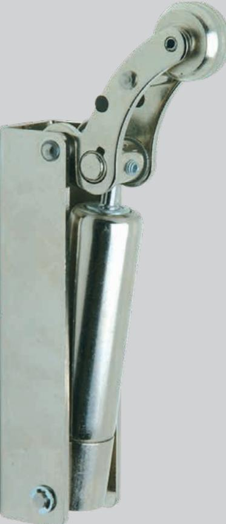
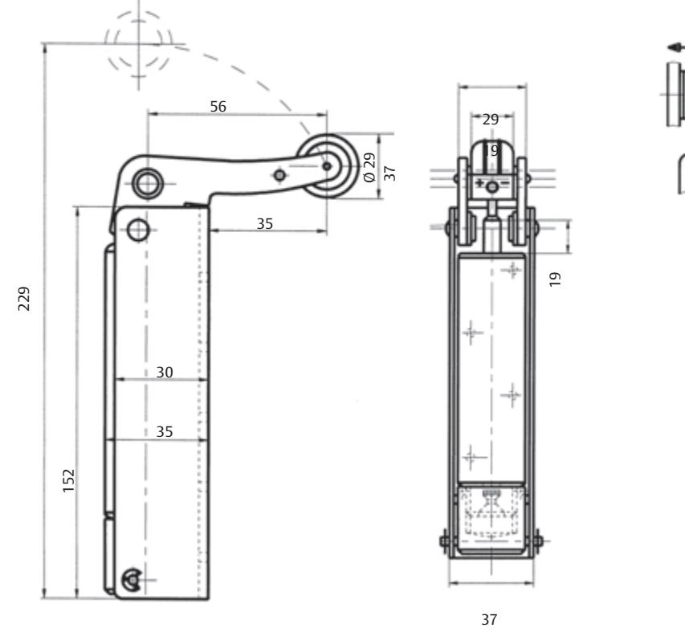
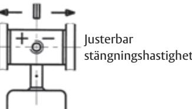
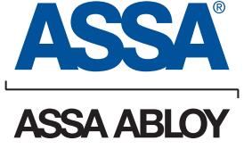
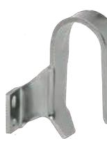
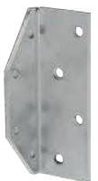
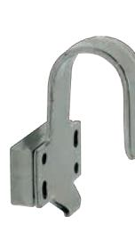
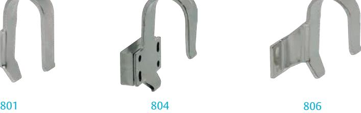
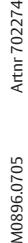

#### **Användningsområde**

För dörrar i skolor, sjukhus, hotell, kontorslokaler etc. Rekommenderas för brandklassade dörrar.

#### **Egenskaper**

- • Används tillsammans med fångkrok 801, 804 och 806
- • Kan monteras med fästplatta 802 vid vinkelmontage på anslagssidan
- • Levereras i förnicklat utförande, kan också fås i vitlackerat utförande
- • Lackerat utförande rekommenderas i fuktiga miljöer
- • Stängningskraft 60 N standard
- • ASSA 1500 är typgodkänd för brandklassade dörrar E30 och EI30 tillsammans med dörrstängare utan lås

#### **Funktion**

- • Ger en mjuk och effektiv stängning av dörren
- • Justerbar stängningshastighet
- • Håller dörren i stängd position även utan lås

# **Tillbehör för ASSA 1500**

## **Fångkrok 801**

Avsedd för dörrtillslutare vid horisontell montering.

### **Fångkrok 804**

Avsedd för montage då dörrfodret är djupare än dörrbladet. Nivåskillnad 3 -18 mm = med distans Nivåskillnad 18 - 28 mm = utan distans

#### **Fångkrok 806**

Avsedd för plan montering och dörrfoder upp till 3 mm.

#### **Vinkelfäste 802**

För komplettering vid vinkelmontage på anslagssidan.

# ASSA 1500 Dörrtillslutare

**Dörrtillslutare** 

**Tillbehör för ASSA 1500**

ASSA ABLOY, the global leader in door opening solutions, dedicated to satisfying end-user needs for security, safety and convenience.

ASSA AB P.O. Box 371 SE-631 05 Eskilstuna Sweden

phone +46 (0)16 17 70 00 fax +46 (0)16 17 70 49

Customer support: phone intl. +46 (0)16 17 71 00 phone nat. 0771-640 640 fax +46 (0)16 17 73 72 e-mail: helpdesk@assa.se

# **Vinkelfäste**

802

Karm Nivåskillnad

Dörr

