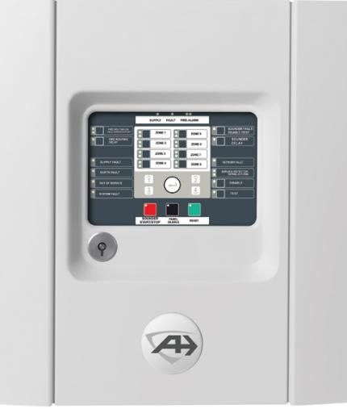
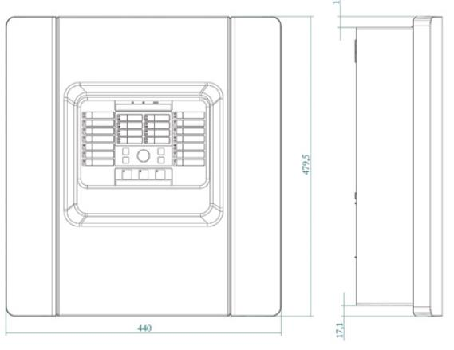
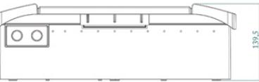

## Produktblad

# 1X-F8-SC-06

Konventionell brandlarmscentral med skandinavisk nyckel – 8 sektioner

#### 1X-F8-SC-06

1X-F8-SC-06 är en konventionell brandlarmcentral. Den levereras med åtta sektioner som stöder upp till 20 enheter per sektion, tre övervakade utgångar för larmdon samt en för övervakad larmöverföring. Dessutom två konventionella utgångar för brand och fel, samt två konfigurerbara ingångar för övervakning och kontroll.

Med stöd för flera konventionella detektorer och tillbehör, som snabbt kan konfigureras, erbjuder systemet en mångsidighet som gynnar fastighetsägare och installationsföretag.

#### Tillval

Centralen stöder två typer av utgångskort; ett med fyra stycken standardreläer och ett med fyra stycken övervakade utgångar för larmdon. Med dessa kort kan centralen expanderas med upp till 16 extra utgångar. Dessa utgångar kan fritt programmeras för olika funktioner.

#### Enkelt handhavande

Centralen är grundprogrammerad men kan enkelt programmeras för övriga tillkommande funktioner. Centralens in- och utgångsfunktioner programmeras på centralens front. Larmdon och larmöverföring kan fördröjas upp till 10 minuter.

#### Passar alla miljöer och användare

1X-systemets mångsidighet gynnar fastighetsägare och installatörer. Centralen har en tilltalande design som passar med all inredning.

#### Skandinavisk brankårsnyckel

Samtliga modeller levereras med skandinavisk brandkårsnyckel.

#### Avancerad teknik

1X brandlarmcentral erbjuder senaste teknik för konventionella centraler för små till medelstora brandlarmsystem.

Centralen indikerar då någon detektor är smutsig och behöver bytas. Detektorns kammaren byts lätt på plats och med detta är systemet åter snabbt i normal drift.

#### Godkännanden

Produktlinjen har följande ackrediteringar: • SBSC-intygad

#### Standardprestanda

- EAvtagbara delar för snabb och enkel installation
- EÖvervakad larmsändarutgång
- EEN54-godkända potentialfria reläer för brand och fel
- E Statusändring av dag-/nattfunktion
- EExtern 24 VDC-utgång med återställningsmöjligheter
- EExtern ingångsstyrning
- EProgrammerbara utgångar med eller utan övervakning
- EMixade sektioner (detektor och larmknapp på samma sektion)
- EInbygd synkronisering av larmdon och blixtljus
- EDiagnostest på fronten
- EEnmanstest
- ECleanMe™
- EFörsedd med skandinavisk brandkårsnyckel
- ESBSC-intygad
- EEN54-godkänd

# 1X-F8-SC-06

### Konventionell brandlarmscentral med skandinavisk nyckel – 8 sektioner

- EN54:2, EN54:4 och CE godkänd
- CPD certifierad
- NEN2535, NBNS21-100 och BS5839-1 kompatibel
- WEEE kompatibel
- RoHS kompatibel

### Tekniska data

| Driftspänning                                | 110 VAC/60 Hz eller 240 VAC/50 Hz |
|----------------------------------------------|-----------------------------------|
| Tolerans                                     | +10% / -15%                       |
| Strömförbrukning (max)                       | 3.15 A @ 110/< 1.5 A @ 240 VAC    |
| Kabel specifikation                          | 3 x 1.5 mm² (fas, nolla, jord)    |
| Batterier                                    | 2 x 12V - 7.2 eller 12 Ah (SLA)   |
| Centralens spänning                          | 4A @ 24 VDC                       |
| Strömförbrukning i vila (inga enheter)    |                                   |
| Strömförbrukning vid larm (inga eneheter) |                                   |
| Sektioner                                    | 8                                 |
| Spänning ut                                  | 22 VDC (18-24 VDC)                |
| Belastning (max)                             | 65 mA                             |
| Kabel resistens (max)                        | 40 ohm                            |
| Kabel kapacitans (max)                       | 500 nF                            |
| Enheter per sektion (max)                    | 32 (beroende på detektorval)      |
| Ingångar                                     | 2                                 |
| Kabel resistens (max)                        | 100 ohm                           |
| Övervakade utgångar                          | 4                                 |
| Spänning ut                                  | 15 till +28 VDC                   |
| Belastning (max)                             | 500 mA                            |
| Utgångar                                     | 2                                 |
| Belastning                                   | 2 A @ 30 VDC                      |
| Auxilliary spänningsutgång                   |                                   |
| Spänning ut                                  | 21 till 28 VDC                    |
| Belastning (max)                             | 250 mA @ 25 °C/195 mA @ 40 °C     |
| Miljö                                        |                                   |
| Lagringstemperatur                           | -10 till +70°C                    |
| Drifttemperatur                              | -10 till +40°C                    |
| Luftfuktighet (icke kondenserande)        | 10 till 95%                       |
| IP klass                                     | IP30                              |
| Mått                                         |                                   |
| Storlek                                      | 480 x 440 x 140 mm                |
| Vikt (utan batterier)                        | 3.9 kg                            |
| Färg                                         | RAL7035                           |
| Kabelgenomföring (topp/ botten/baksida)   | Ø 20 mm - 20 / 2 / 26             |

|  | Order data |  |
|--|------------|--|
|  |            |  |

| Artikelnummer | Beskrivning                                                                 |
|---------------|-----------------------------------------------------------------------------|
| 1X-F8-SC-06   | Konventionell brandlarmscentral med skandinavisk nyckel – 8 sektioner    |
| 2010-1-RB     | Reläkort – icke övervakad (tillbehör konventionell brandlarmscentral)    |
| 2010-1-SB     | Kort med övervakade utgångar (tillbehör konventionell brandlarmscentral) |
| BS127N        | Underhållsfri ackumulator 12 V, 7,2 Ah                                      |
| BS130N        | Underhållsfri ackumulator 12 V, 12 Ah                                       |

Reservationer för produktförändringar. För uppdatering av produktdata, gå in på www. utcfssecurityproducts.se eller kontakta din lokala UTC Fire & Security återförsäljare. 1X-F8-SC-06-2017-01-20 08:42:45 Released :20-OCT-14