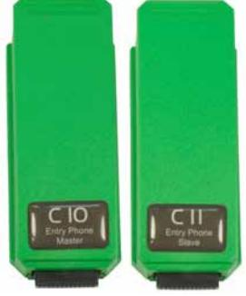

## **Produktblad**

Uppdaterad 2018-07-31

## **C10 Porttelefon master och C11 Porttelefon slave**

Moduler för VAKA med porttelefoni

## **Funktionalitet och användningsområden**

- l Mastermodulen C10 installerar du vid första porten. Slavmodulen C11 behövs vid övriga dörrar med porttelefon
- l Portsamtalen går via IP-telefoni, vilket innebär att du ringer via nätverket och Internet till mottagarens mobiltelefon, hemtelefon eller företagsväxel.
- l Du behöver endast 1 st. IP-telefonabonnemang (!) för alla porttelefoner. Systemet klarar 5 samtidiga samtal. Axema hjälper dig att skaffa ett IPnummerabonnemang.
- l Anslut VAKA systemet till Gigaset så får du bärbara svarsapparater helt utan samtalskostnader.
- l Om man vill använda befintligt analogt telefonabonnemang. Komplettera med en ATA-box som omvandlar IP-telefoni till det analoga telenätet
- l Internetanslutning med VoIP abonnemang.
- l VoIP via standard SIP protokoll.

## **Teknisk Data**

| Attribut         | C10              | C11              |
|------------------|------------------|------------------|
| Mått (HxBxD)     | 86x32,5x20 mm    | 86x32,5x20 mm    |
| Strömförsörjning | Från dörrcentral | Från dörrcentral |
| Temperaturområde | 0° till +55°C    | 0° till +55°C    |
| Artikelnummer    | 2-3100           | 2-3110           |
| E-nummer         | E5877475         | E5877476         |