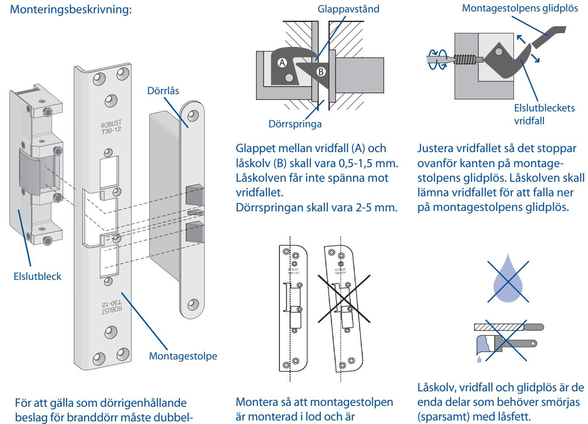

## Elslutbleck serie 200.

| Tekniska data: | Normal funktion (rättvänd), med eller utan kolvkontakt.                                   |
|----------------|-------------------------------------------------------------------------------------------|
|                | Omvänd funktion (omvänd), med eller utan kolvkontakt.                                     |
|                | Multispänning 12-24V AC/DC, max +/- 10% avvikelse från märkspänning.                      |
|                | Polfri anslutning med inbyggt transientskydd, skyddsdiod behövs ej kopplas in.            |
|                | Brythållfastheten för tryck på vridfallet är 1.200 kg (12.000 N).                         |
|                | För enkelfallås eller dubbelfallås med eller utan förregling, även för lås med regelkolv. |
|                | Uppfyller BoVerkets byggregler för branddklassade dörrar med dubbelfallås.                |
|                | Passar ROBUST montagstolpar serie T-.                                                     |
|                |                                                                                           |

är monterad i lod och är ordentligt fastsatt i dörrkarmen. Rätt val av montagestolpe är avgörande för en bra funktion.

(sparsamt) med låsfett. Borr-, fil- och slipspån är skadligt för elslutbleck. Elslutblecket är inte vattentätt.

fallås användas. Tryckeskolven måste sticka in minst 7 mm i stolpen.

| = ~ | 12 - 24V AC/DC                 |
|--------|--------------------------------|
|        | opåverkat läge (dörr öppen) |

Kopplingsschema: Polfri anslutning, polaritetsskyddat. Multispänning 12-24 V lik- eller växelspänning. Max 10% +/- avikelse från märkspänning.

| Typbeteckning: | Funktion: | Märkspänning:                          | Kolvkontakt: |
|----------------|-----------|----------------------------------------|--------------|
| 280            | rättvänd  | 12-24V likspänning eller växelspänning | nej          |
| 281D           | omvänd    | 12-24V likspänning eller växelspänning | nej          |
| 290            | rättvänd  | 12-24V likspänning eller växelspänning | ja           |
| 291D           | omvänd    | 12-24V likspänning eller växelspänning | ja           |