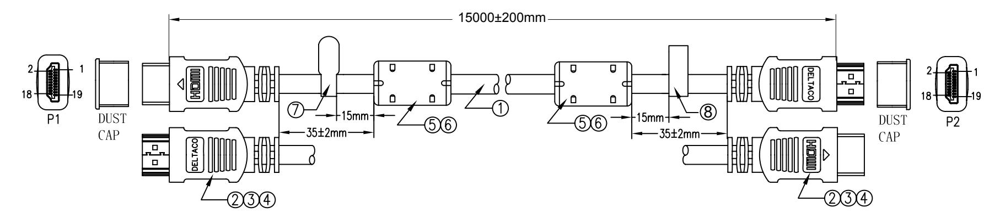
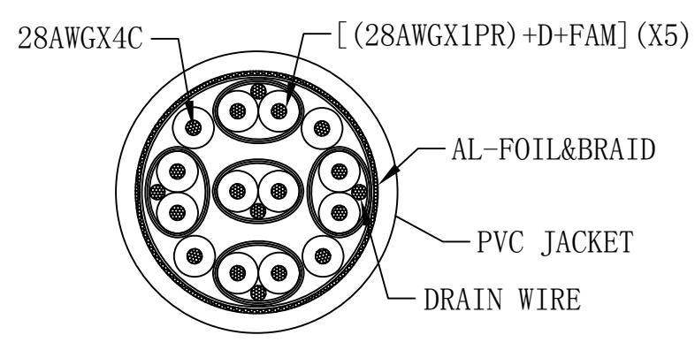

| PIN OUT  |                | 10 10         | BLUE           |
|----------|----------------|------------------|----------------|
| P1 P2 |                | 12 12         | BROWN WHITE |
|          | BLUE RED    | 11 11         | FAM DRAIN   |
| :3       | WHITE FAM   | 13 13         | GREEN          |
| 2        | DRAIN          | 15 15         | WHITE          |
|          | BLUE SILVER | 16 16         | BLUE           |
| 6 6   | WHITE FAM   | 14 1 के       | BLUE GREEN  |
| 5        | DRAIN          | 19 19         | WHITE FAM   |
|          | BLUE BLUE   | 17 17         | DRAIN          |
| 9        | WHITE          | 18 18         | RED            |
| ರ ರ   | FAM DRATN   | DRATN CITTY T |                |

|  |   |              |      | NO. PARTS NAME Q'TY SPECIFICATION                                  |  |
|--|---|--------------|------|--------------------------------------------------------------------|--|
|  | 8 | TAG          | 1PCS | HIGH SPEED WITH ETHERNET TAG                                       |  |
|  | 7 | TAG          | 1PCS | DELTACO TAG                                                        |  |
|  | 6 | CORE MOLD    | 2PCS | BLACK PVC                                                          |  |
|  | 5 | CORE         | 2PCS | OD*ID*L:14.3*9.0*28.5mm                                            |  |
|  | 4 | HOOD MOLD    | 2PCS | BLACK PVC                                                          |  |
|  | 3 | INNER MOLD   | 2PCS | PE                                                                 |  |
|  | 2 | HDMI 19M     | 2PCS | GOLD PLATED SHELL                                                  |  |
|  | 1 | CABLE        | 1PCS | (28AWG*1P+D+FAM)*5+28AWG*4C+AEB OD:7.3mm±0.2mm BLACK PVC JACKET |  |
|  |   | DESCRIPTION: |      |                                                                    |  |
|  |   |              |      |                                                                    |  |
|  |   |              |      |                                                                    |  |

|  | 1080P |
|--|-------|
|  |       |
|  |       |
|  |       |

- 

|           | CUSTOMER: | DRAWN | CHECKED | APPROVED |
|-----------|-----------|-------|---------|----------|
| HDMI-1080 | ITEM NO.  |       |         |          |
|           | DRAW NO.  |       |         |          |
| mm        | UNIT      |       |         |          |
| NONE      | SCALE     |       |         |          |

HDMI 19PIN/M-HDMI 19PIN/M

