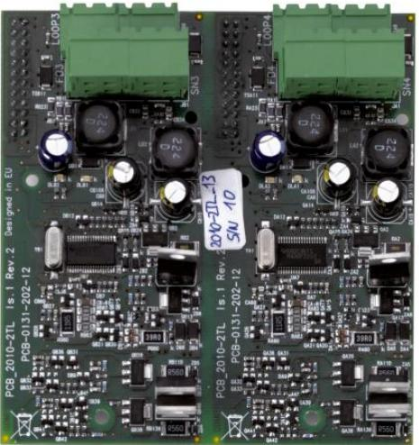

# 2X-LB

Produktblad

Utökningskort med 2 slingor till 2X-centralerna

### Allmänt

Utökningskort med 2 slingor, 128 adresser per slinga. Tillsammans med fyra övervakade larmdon/ larmöverföringsutgångar som kan användas för fri programmering.

#### Installation

Utökningskortet installeras direkt på moderkortet i centralapparaten.

#### Standardprestanda

- E2 slingor 128 adresser per slinga
- E 4 programmerbara utgångar
- EJackningsbara anslutningsplintar
- EAnsluts direkt på moderkortet i centralen

# 2X-LB

Utökningskort med 2 slingor till 2X-centralerna

### Tekniska data

| Utgångar                     |                                          |
|------------------------------|------------------------------------------|
| Övervakade programmerbara | 4 x700 mA/19,5-28 VDC (24 VDC nominelll) |
| Kabeltyp                     | Rekommenderad 1,5 mm² partvinad          |
| Ändmottstånd                 | 15 kohm                                  |
| Slingor                      |                                          |
| Utgång                       | 2,250 mA/29 VDC (29 VDC till 36 VDC )    |
| Kabellängd                   | 56ohm / 1 µF max 4 km                    |
| Kabeltyp                     | Rekommenderad 1,5 mm² partvinnad         |
| Miljö                        |                                          |
| Lagringstemperatur           | -10 till +50 °C                          |
| Drifttemperatur              | -8 till +42 °C                           |
| Luftfuktighet                | max 95 % (icke kondenserande)            |
| Tekniska data                |                                          |
| Vikt                         | 0,12 kg                                  |

Order data

Artikelnummer Beskrivning 2X-LBUtökningskort med 2 slingor till 2X-centralerna

