4

1 1

2

A3

B2 B3 B4

No

mm), and gradienter.

Make sure all the related equipment is power-off during the install a�on. Make sure you have co nfigured the sub module address before install a�on. Valid sub module address range is 1 to 8. The No. should be unique for sub modules that connected to the same main unit. The sub module address and corresponding swi tch

| status is shown as the figure. |  |  |  |  |  |  |  |  |
|--------------------------------|--|--|--|--|--|--|--|--|
|                                |  |  |  |  |  |  |  |  |
|                                |  |  |  |  |  |  |  |  |
|                                |  |  |  |  |  |  |  |  |
|                                |  |  |  |  |  |  |  |  |
|                                |  |  |  |  |  |  |  |  |
|                                |  |  |  |  |  |  |  |  |
|                                |  |  |  |  |  |  |  |  |
|                                |  |  |  |  |  |  |  |  |
|                                |  |  |  |  |  |  |  |  |
|                                |  |  |  |  |  |  |  |  |

#### Three-Module Flush Mou n�ng

1. Cave the install a�on hole, and pull the cable out. Note: The su g gested dimension of the installa�on hole is 321.8(W) × 108(H) × 45.5(D) mm. The su g g e len gth of the cables le� outside is 270 mm.

sted

2. Select a cable e ntry and remo ve the pla s�c sheet. Rou te the cables th rough the gang box hole. Insert the gang box into the install a�on hole. Mark the gang box scr ew holes' posi�on with a marker, and take out the gang box.

3. Drill 4 holes according to the marks on the wall, and insert the expansion sle e ves into the scr ew holes. Fix the gang box with 4 expansion bolts.

4. Fill the gap b e t ween the gang box and wall with concr e te or Silicone sealant. Remove the mou n�ng ea rs with tool a �er conc r e te is dry.

5. Connect cables and insert the modules.

a.Connect Cable 1 and one end of Cable 2 to the corresponding interfaces of the main unit, then insert the main unit into the upper grid.

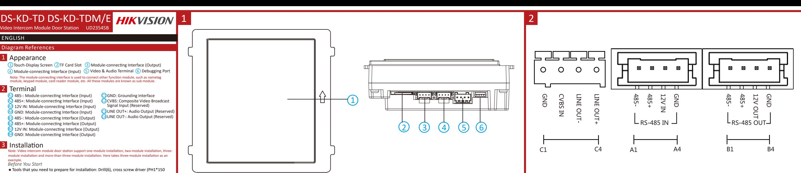

b.Connect the other end of Cable 2 to the input interface of Sub Module 1. Connect one end of Sub Module 1 and insert it into the middle grid.

c.Connect the other end of Cable 3 to the input interface of Sub Module 2. Insert it into the bo �om grid.

6. Fix the c o ver and the main unit with 2 soc ket head cap sc r e ws by using a hexagon wrench.

Surface Mou n�ng with Protec�ve Shield

1. Paste the install a�on s�cker 1 onto the wall. Make sure the s�cker is placed horizontally via measuring with the gradienter. Drill 4 holes according to the scr ew holes

on the s�cker. No te: The suggested si ze of hole is 6(diame ter) × 25(depth) mm. The suggested len gth of the cables le� outside is 270 mm.

2. Remo ve the s�cker and insert the expansion sle e ves into the screw holes. Fix the mou n�ng frame

onto the wall with 4 expansion bolts.

3. Thread the module-connec�ng line across the thread holes of the frame. Pass the main unit

connec�ng line across the thread hole to the top grid and connect the cables. a.Connect the lines and module-connec�ng line 1 to the corresponding interfaces of the main unit,

then place the main unit into the upper grid.

b.Connect the other end of the module-connec�ng line 1 to the input interface of the sub modules via module-connec�ng line 2.

c.Organize the cables with cable �e in the package.

4. Insert the modules into the frame a �er wiring. The main unit must be placed in the top grid.

5. Use the hexa gon w rench in the package to fix the cover onto the frame.

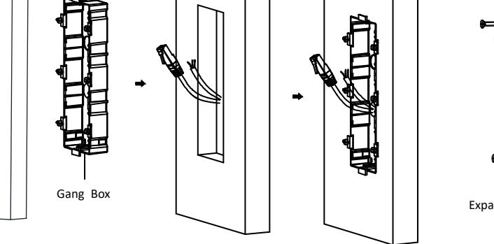

1

2

3

13

1

2

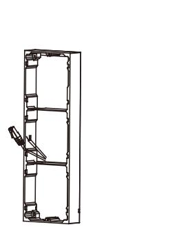

3

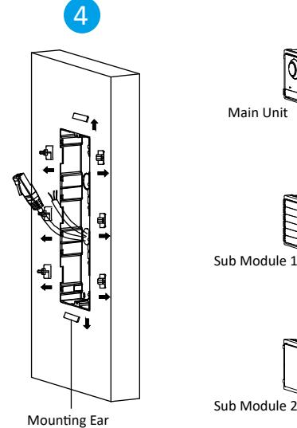

Main Unit

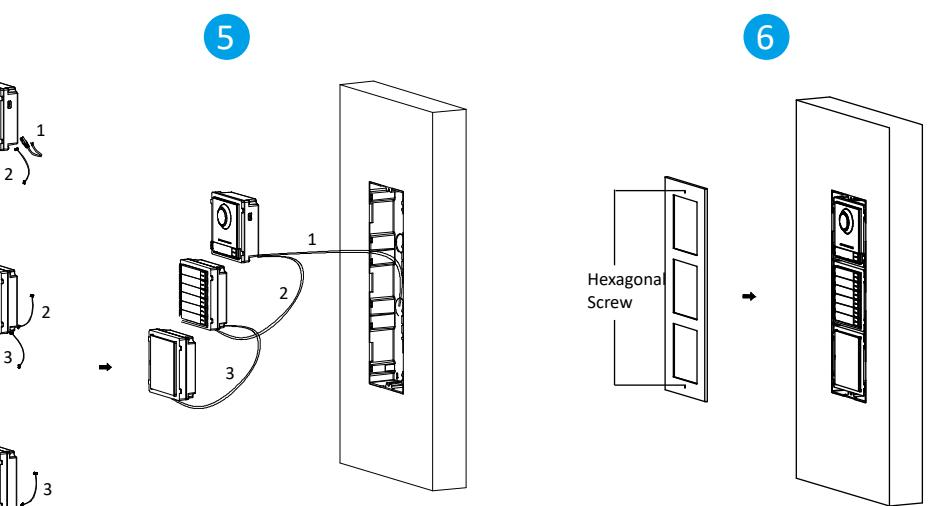

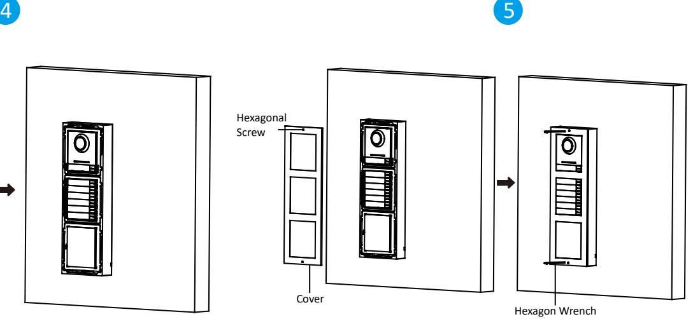

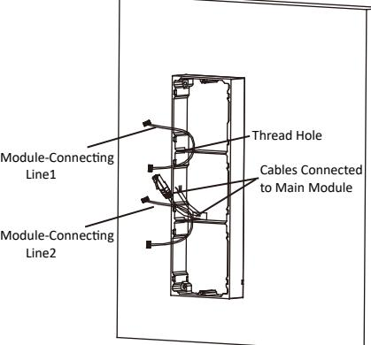

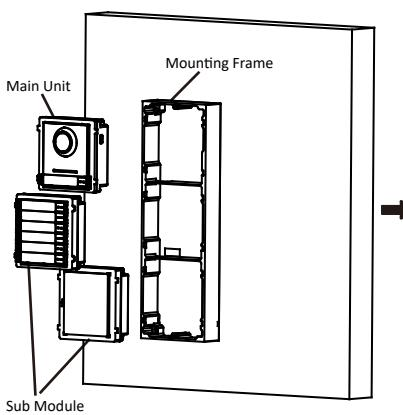

13

Remarque : la sta�on de porte avec module d'interphone vidéo prend en charge l'installa�on d'un à plus de trois modules. Nous prenons ci-après, à �tre d'exemple, l'installa�on de trois modules. Avant de commencer :

1.Préparez les ou�ls nécessaires à l'installa�on : forêt (Ø 6 mm), tournevis cruciforme (PH1 x 150 mm) et niveau à bulle.

2.Assurez-vous que l'équipement connexe est bien hors tension pendant l'installa�on. 3.Assurez-vous d'avoir configuré l'adresse du sous-module avant installa�on. La plage d'adresse correcte d'un sousmodule est comprise entre 1 et 8. Chaque adresse doit être unique pour les sous-modules connectés à une même unité principale. L'adresse du sous-module et l'état des microcommutateurs correspondants sont illustrés dans la figure.

### Montage encastré à trois modules

1.Creusez le trou d'installa�on et faites sor�r le câble.

Remarque : les dimensions conseillées du trou d'installa�on sont de 321,8 × 108 × 45,5 mm (L × H × P). La longueur conseillée des câbles laissés dehors est de 270 mm.

2.Sélec�onnez une entrée de câble et re�rez le film plas�que. Faites passer les câbles à travers le trou du boî�er de raccordement. Insérez le boî�er de raccordement dans le trou d'installa�on. Marquez la posi�on des trous de vis du boî�er de raccordement avec un marqueur, puis enlevez le boî�er de raccordement.

3.Percez les 4 trous en fonc�on des repères sur le mur, puis insérez les chevilles d'expansion dans les trous de vis. Fixez le boî�er de raccordement avec les 4 boulons expansibles. 4.Remplissez l'espace entre le boî�er de raccordement et le mur avec du béton ou du mas�c silicone. Re�rez les

oreilles de montage à l'aide d'un ou�l, une fois le béton sec. 5.Connectez les câbles et insérez les modules.

a.Connectez le câble 1 et l'une des extrémités du câble 2 aux interfaces correspondantes de l'unité principale, puis

insérez l'unité principale dans la grille du haut. b.Connectez l'autre extrémité du câble 2 à l'entrée de l'interface du sous-module 1. Connectez une des extrémités du sous-module 1 et l'insérez dans la grille du milieu.

#### Installa�on 3 Instalação

c.Connectez l'autre extrémité du câble 3 à l'entrée de l'interface du sous-module 2. Insérez-le dans la grille du bas. 6.Fixez le couvercle et l'unité principale avec 2 vis d'assemblage à tête hexagonale à l'aide d'une clé 6 pans.

### Montage en surface à trois modules

1.Collez l'adhésif d'installa�on 1 sur le mur. Assurez-vous que l'adhésif est placé horizontalement en u�lisant le niveau à bulle. Percez les 4 trous en fonc�on des trous de vis sur l'adhésif.

Remarque : les dimensions conseillées du trou sont de 6 × 25 mm (diamètre × profondeur). La longueur conseillée des câbles laissés dehors est de 270 mm. 2.Re�rez l'adhésif et insérez les chevilles d'expansion dans les trous de vis. Fixez le cadre de montage au mur à l'aide

des 4 boulons expansibles. 3.Enfilez la ligne de connexion de module dans les trous filetés du cadre. Faites passer la ligne de connexion de l'unité

principale dans le trou fileté de la grille du haut et connectez les câbles. a.Connectez les lignes et la ligne 1 de connexion de module aux interfaces correspondantes de l'unité principale, puis placez l'unité principale dans la grille du haut.

b.Connectez l'autre extrémité de la ligne 1 de connexion de module à l'interface d'entrée des sous-modules via la ligne 2 de connexion de module. c.Rangez les câbles à l'aide du serre-câble fourni dans l'emballage.

4.Insérez les modules dans le cadre après câblage. L'unité principale doit être placée dans la grille du haut. 5.U�lisez la clé 6 pans fournie dans l'emballage pour fixer le couvercle au cadre..

## FRANÇAIS Références du schéma

#### 1 Apparence

Remarque : l'interface de connexion de module permet de connecter d'autres modules fonc�onnels, par exemple module portenom, module clavier, module lecteur de carte, etc. Tous ces modules sont désignés comme sous-modules.

2 Borne Remarque : reportez-vous au « Manuel d'u�lisa�on » pour une descrip�on du câblage.

> Nota: A estação de porta com módulo de videoporteiro suporta a instalação de um módulo, de dois módulos, de três módulos e de mais de três módulos. Aqui assumimos como exemplo uma instalação de três módulos.

### Antes de começar:

1.Ferramentas necessárias para se preparar para a instalação: Berbequim (ø6), chave de fendas de cabeça cruzada (PH1*150 mm) e instrumento de medição de gradiente.

2.Cer�fique-se de que, durante a instalação, todo o equipamento relacionado se encontra desligado. 3.Cer�fique-se de que configura o endereço do submódulo antes da instalação. O intervalo válido do endereço do submódulo é de 1 a 8. O N.º deve ser único para os submódulos ligados à mesma unidade principal. O endereço do

## submódulo e o respe�vo estado de comutação são apresentados na figura.

## Montagem nivelada com três módulos

#### 1.Perfure o ori�cio de instalação e puxe o cabo para fora. Nota: A dimensão sugerida do ori�cio de instalação é de 321,8 (L) × 108 (A) × 45,5 (D) mm. O comprimento sugerido dos cabos

deixados de fora é de 270 mm. 2.Selecione uma entrada de cabo e remova a película de plás�co. Encaminhe os cabos pelo ori�cio da caixa. Insira a caixa no ori�cio de instalação. Marque a posição dos ori�cios dos parafusos da caixa com um marcador, e re�re a caixa

para fora. 3.Faça 4 ori�cios com o berbequim de acordo com as marcações na parede, e insira as mangas de expansão nos

ori�cios dos parafusos. Fixe a caixa com 4 parafusos de expansão. 4.Encha o espaço entre a caixa e a parede com cimento ou vedante de silicone. Remova as abas de montagem com a ferramenta depois de o cimento secar.

5.Ligue os cabos e insira os módulos.

#### a.Ligue o Cabo 1 e uma extremidade do Cabo 2 às interfaces correspondentes da unidade principal, e em seguida insira a unidade principal na grelha superior.

b.Ligue a outra extremidade do Cabo 2 à interface de entrada do Submódulo 1. Ligue uma extremidade do Submódulo

1 e insira-a na grelha central. c.Ligue a outra extremidade do Cabo 3 à interface de entrada do Submódulo 2. Insira-a na grelha inferior.

6.Fixe a tampa e a unidade principal com os 2 parafusos cilíndricos sextavados u�lizando uma chave de Allen (sextavada).

### Montagem em super�cie com três módulos

1.Cole o autocolante de instalação 1 na parede. Cer�fique-se de que o autocolante se encontra colocado numa posição horizontal medindo com o medidor de gradientes. Perfure 4 ori�cios de acordo com os ori�cios dos parafusos indicados no autocolante.

Nota: A dimensão sugerida do ori�cio é de 6 mm (diâmetro) × 25 mm (profundidade). O comprimento sugerido dos cabos deixados de fora é de 270 mm. 2.Remova o autocolante e insira as mangas de expansão nos ori�cios dos parafusos. Fixe a estrutura de montagem na

parede com os 4 parafusos de expansão. 3.Passe a linha de ligação dos módulos pelos ori�cios do fio da estrutura. Passe a linha de ligação da unidade principal

pelo ori�cio do fio até à grelha superior e ligue os cabos. a.Ligue as linhas e a linha de ligação dos módulos 1 às interfaces correspondentes da unidade principal e, em seguida,

coloque a unidade principal na grelha superior. b.Ligue a outra extremidade da linha de ligação dos módulos 1 à interface de entrada dos submódulos através da linha de ligação de módulos 2.

c.Organize os cabos com a braçadeira no pacote.

4.Insira os módulos na estrutura após a ligação dos fios. A unidade principal tem de ser colocada na grelha superior. 5.U�lize a chave sextavada no pacote para fixar a tampa na estrutura.

Nota: el módulo de estación de vídeo intercomunicador para puerta es compa�ble con la instalación de un módulo, dos módulos, tres módulos o más módulos. Aquí tomamos la instalación de tres módulos como ejemplo.

Antes de empezar:

1.Herramientas que necesita para la instalación: Taladro (ø6), destornillador de estrella (PH1 × 150 mm) y nivel. 2.Asegúrese de que el equipo relacionado esté apagado durante la instalación.

3.Asegúrese de haber configurado la dirección del módulo secundario antes de la instalación. La dirección válida del módulo secundario oscila entre 1 y 8. El número debe ser dis�nto para cada módulo secundario conectado a la misma unidad principal. La dirección del módulo secundario y el interruptor correspondiente aparece en la figura.

### Montaje empotrado de tres módulos

#### 1.Repase el orificio de montaje y saque el cable.

Nota: las dimensiones aconsejadas para el orificio de montaje son de 321,8 (ancho) × 108 (alto) × 45,5 (largo) mm. La longitud aconsejada para los cables que quedan fuera es de 270 mm. 2.Seleccione una entrada de cable y re�re la lámina de plás�co. Pase los cables a través del orificio de la caja de

fusibles. Inserte la caja de fusibles en el orificio de montaje. Marque la posición de los orificios para los tornillos de la caja de fusibles con un rotulador y re�re la caja de fusibles.

3.Taladre 4 agujeros según las marcas realizadas en la pared e inserte los tacos de expansión en los agujeros para los tornillos. Fije la caja de fusibles con 4 tornillos de expansión.

4.Rellene el hueco entre la caja de fusibles y la pared con cemento o silicona. Re�re los soportes con una herramienta cuando el cemento se haya secado.

5.Conecte los cables e inserte los módulos.

a.Conecte el cable 1 y un extremo del cable 2 a las interfaces correspondientes de la unidad principal, luego inserte la

unidad principal en el cuadro superior. b.Conecte el otro extremo del cable 2 a la interfaz de entrada del módulo secundario 1. Conecte un extremo del

módulo secundario 1 e insértelo en el cuadro medio. c.Conecte el otro extremo del cable 3 a la interfaz de entrada del módulo secundario 2. Insértelo en el cuadro inferior.

## 6.Fije la tapa y la unidad principal con 2 tornillos hexagonales u�lizando una llave Allen.

Montaje en superficie de tres módulos

1.Pegue el adhesivo de montaje 1 en la pared. Asegúrese de colocar el adhesivo de forma horizontal con el nivel. Taladre4 orificios en lo s agujeros para los tornillos del adhesivo. Nota: el tamaño aconsejado para el orificio es de 6 mm (diámetro) × 25 mm (profundidad). La longitud aconsejada para los cables que quedan fuera es de 270 mm.

2.Re�re el adhesivo e inserte los tacos de expansión en los orificios de los tornillos. Fije el marco de montaje en la pared con los 4 tornillos de expansión. 3.Pase la línea de conexión de módulo por los agujeros del marco. Pase la línea de conexión de la unidad principal por

el agujero hasta el cuadro superior y conecte los cables. a.Conecte las líneas y la línea de conexión de módulo 1 a las interfaces correspondientes de la unidad principal, luego coloque la unidad principal en el cuadro superior. b.Conecte el otro extremo de la línea de conexión de módulo 1 a la interfaz de entrada de los módulos secundarios a

través de la línea de conexión de módulo 2. c.Organice los cables con el sujetacables incluido.

4.Inserte los módulos en el marco tras completar el cableado. La unidad principal debe colocarse en el cuadro

superior.

5.U�lice la llave Allen incluida para fijar la tapa en el marco.

Installa�on

Hinweis: Das Türsta�on-Video-Gegensprechmodul unterstützt die Montage mit Einfachmodul, Zweifachmodul, Dreifachmodul und mit mehr als drei Modulen. Hier als Beispiel die Montage mit Dreifachmodul.

Bevor Sie beginnen:

1.Werkzeuge, die Sie für die Montage vorbereiten müssen: Bohrer (ø6), Kreuzschlitz-Schraubendreher (PH1 x 150 mm)

und Wasserwaage.

2.Achten Sie darauf, dass die Geräte während der Montage ausgeschaltet sind. 3.Achten Sie darauf, dass Sie die Untermoduladresse vor der Installa�on konfiguriert haben. Der gül�ge Adressbereich des Untermoduls liegt zwischen 1 und 8. Die Nr. der Untermodule, die an dieselbe Haupteinheit angeschlossen wurden, muss eindeu�g sein. Die Untermoduladresse und der entsprechende Schalterstatus sind in der Abbildung

dargestellt.

Dreifachmodul-Unterputzmontage

#### 1.Stemmen Sie die Montageöffnung aus und ziehen Sie das Kabel heraus.

Hinweis: Die vorgeschlagenen Abmessungen der Montageöffnung betragen 321,8 (B) x 108 (H) x 45,5 (T) mm. Die empfohlene

Kabellänge außerhalb beträgt 270 mm.

2.Wählen Sie einen Kabeleintri� und en�ernen Sie die Kunststoffpla�e. Führen Sie die Kabel durch die Öffnung der Anschlussdose. Setzen Sie die Anschlussdose in die Montageöffnung ein. Markieren Sie die Posi�on der Schraubenlöcher der Anschlussdose mit einem Marker. Nehmen Sie die Anschlussdose wieder heraus. 3.Bohren Sie 4 Löcher gemäß den Markierungen an der Wand und setzen Sie die Dehnhülsen in die Schraubenlöcher

ein. Befes�gen Sie die Anschlussdose mit 4 Dehnschrauben.

4.Füllen Sie den Spalt zwischen Anschlussdose und Wand mit Beton- oder Silikondichtmi�el. En�ernen Sie die Montagehalterungen mit einem Werkzeug, nachdem der Beton hart ist.

5.Schließen Sie die Kabel an und setzen Sie die Module ein.

a.Schließen Sie Kabel 1 und ein Ende von Kabel 2 an die entsprechenden Schni�stellen der Haupteinheit an und setzen

Sie die Haupteinheit in das obere Raster ein.

b.Schließen Sie das andere Ende des Kabels von Kabel 2 an die Eingangsschni�stelle von Untermodul 1 an. Schließen Sie ein Ende des Kabels von Untermodul 1 an und setzen Sie es in das mi�lere Raster ein. c.Schließen Sie das andere Ende von Kabel 3 an die Eingangsschni�stelle von Untermodul 2 an. Setzen Sie es in das

untere Raster ein.

#### Instalación 3

6.Befes�gen Sie die Abdeckung und die Haupteinheit mit 2 Innen-Sechskantschrauben und einem Innen-

Sechskantschlüssel.

Dreifachmodul-Aufputzmontage

1.Kleben Sie Bohrschablone 1 an die Wand. Stellen Sie sicher, dass die Schablone durch Messung mit der Wasserwaage waagerecht platziert wurde. Bohren Sie 4 Löcher entsprechend den Schraubenlöchern auf der

Schablone.

Hinweis: Die empfohlene Bohrlochgröße beträgt 6 (Durchmesser) x 25 (Tiefe) mm. Die empfohlene Länge der Kabel außerhalb

beträgt270 mm.

2.En�ernen Sie die Schablone und stecken Sie die Dehnhülsen in die Schraubenlöcher. Befes�gen Sie den

Montagerahmen mit 4 Dehnschrauben an der Wand.

3.Führen Sie die Modulverbindungsleitung durch die Gewindelöcher des Rahmens. Führen Sie die Verbindungsleitung der Haupteinheit durch das Gewindeloch zum oberen Raster und schließen Sie die Kabel an.

a.Verbinden Sie die Leitungen und Modulverbindungsleitung 1 mit den entsprechenden Schni�stellen der Haupteinheit und platzieren Sie die Haupteinheit im oberen Raster.

b.Verbinden Sie das andere Ende der Modulverbindungsleitung 1 über Modulverbindungsleitung 2 mit der

Eingangsschni�stelle der Untermodule.

c.Ordnen Sie die Kabel mit Kabelbindern aus der Verpackung.

4.Setzen Sie die Module nach der Verkabelung in den Rahmen ein. Die Haupteinheit muss im oberen Raster eingesetzt 5.Befes�gen Sie die Abdeckung mit dem mitgelieferten Innen-Sechskantschlüssel am Rahmen.

werden.

Nota: la postazione porta del modulo videocitofono supporta l'installazione di uno, due e tre moduli e l'installazione di più di tre moduli. Qui si considera a �tolo di esempio l'installazione di tre moduli.

### Prima di cominciare:

1.A�rezzi da preparare per l'installazione: trapano (ø6), cacciavite a stella (PH1x150 mm) e misuratore di pendenza. 2.Verificare che durante l'installazione tu�e le apparecchiature correlate siano spente.

3.Assicurarsi di aver configurato l'indirizzo dei moduli secondari prima dell'installazione. L'intervallo di indirizzi validi per i moduli secondari è compreso tra 1 e 8. Il numero di ciascun modulo secondario connesso alla stessa unità principale deve essere univoco. L'indirizzo del modulo secondario e lo stato dell'interru�ore corrispondente sono mostra� nella figura.

## Montaggio a incasso di tre moduli

1.Pra�care il foro di installazione ed estrarre il cavo. Nota: La dimensione suggerita del foro di installazione è di 321,8 (L) × 108 (A) × 45,5 (P) mm. La lunghezza suggerita per la porzione di cavo che resta all'esterno è di 270 mm.

2.Scegliere un ingresso del cavo e rimuovere la protezione di plas�ca. Far passare il cavo a�raverso il foro della scatola portafru�. Inserire la scatola portafru� nel foro di installazione. Segnare le posizioni dei fori per le vi� della scatola portafru� ed estrarre la scatola.

3.Pra�care 4 fori in corrispondenza delle posizioni segnate sulla parete e inserirvi le guaine a espansione. Fissare la scatola portafru� con 4 bulloni a espansione.

4.Riempire eventuali vuo� tra la scatola portafru� e la parete con cemento o silicone sigillante. Rimuovere le lingue�e di montaggio con un a�rezzo dopo che il cemento si è asciugato.

5.Collegare i cavi e inserire I moduli. a.Collegare il cavo 1 e un'estremità del cavo 2 alle corrisponden� interfacce sull'unità principale, quindi inserire l'unità principale nella griglia superiore.

b.Collegare l'altra estremità del cavo 2 all'interfaccia di ingresso del modulo secondario 1. Collegare un'estremità del

modulo secondario 1 e inserirlo nella griglia centrale. c.Collegare l'altra estremità del cavo 3 all'interfaccia di ingresso del modulo secondario 2. Inserirlo nella griglia inferiore.

6.Fissare il coperchio e l'unità principale con 2 vi� a brugola usando una chiave inglese esagonale.

### Montaggio su superficie di tre moduli

1.Applicare l'adesivo di installazione 1 sulla parete. Assicurarsi che l'adesivo sia sistemato in posizione orizzontale con il misuratore di pendenza. Pra�care 4 fori in corrispondenza dei fori per le vi� sull'adesivo. Nota: La dimensione suggerita del foro è di 6 (diametro) × 25 (profondità) mm. La lunghezza suggerita per la porzione di cavo che

#### Installazione 3

resta all'esterno è di 270 mm. 2.Rimuovere l'adesivo e inserire le guaine a espansione nei fori per le vi�. Fissare il telaio di montaggio alla parete con 4 bulloni a espansione.

3.Far passare la linea di collegamento al modulo a�raverso i fori file�a� del telaio. Far passare la linea di collegamento all'unità di principale a�raverso il foro file�ato fino alla griglia superiore e collegare i cavi. a.Collegare le linee e la linea 1 di collegamento al modulo alle corrisponden� interfacce sull'unità principale, quindi

inserire l'unità principale nella griglia superiore. b.Collegare l'altra estremità della linea 1 di collegamento al modulo all'interfaccia di ingresso dei moduli secondari

tramite la linea 2 di collegamento al modulo. c.Sistemare i cavi con la fasce�a in dotazione.

4.Dopo il cablaggio, inserire i moduli nel telaio. L'unità principale deve essere collocata nella griglia superiore. 5.Servendosi della chiave esagonale in dotazione, fissare il coperchio sul telaio.

## PORTUGUÊS Referências do diagrama

#### 1 Aspeto

Nota: A interface de ligação dos módulos é u�lizada para ligar outro módulo de função, como o módulo de e�queta de nome, o módulo de teclado, o módulo do leitor de cartões, etc. Todos estes módulos são conhecidos por "submódulo".

2 Terminal Nota: A descrição da cablagem está descrita no Manual do U�lizador.

## 3

## ESPAÑOL Referencias del diagrama

#### 1 Apariencia

Nota: la interfaz de conexión de módulo sirve para conectar otro módulo funcional, como el módulo de credencial, el módulo de teclado, el módulo de lector de tarjetas, etc. Todos estos módulos son conocidos como módulos secundarios.

2 Terminal Nota: para ver una descripción del cableado, consulte el manual de usuario. DEUTSCH

1

Verweise auf Schaubilder Op�k

Hinweis: Die Modulverbindungsschni�stelle wird verwendet, um andere Funk�onsmodule wie das Namensschildmodul, Tastenmodul, Kartenlesemodul usw. anzuschließen. Alle diese Module werden als Untermodul bezeichnet.

2 Anschlussklemmen

Hinweis: Die Beschreibung der Verkabelung bezieht sich auf das Benutzerhandbuch.

3

## ITALIANO

Riferimento schemi

#### 1 Aspe�o

Nota: l'interfaccia di collegamento al modulo è usata per conne�ere altri moduli funzionali, quali il modulo nametag, il modulo tas�erino, il modulo le�ore di schede ecc. Tali moduli sono de� moduli secondari.

2 Terminale Nota: la descrizione del cablaggio fa riferimento al manuale d'uso.

Poznámka: Dveřní stanice s modulem pro videokomunikaci podporuje instalaci jednoho modulu, instalaci dvou modulů, instalaci tří modulů a instalaci více než tří modulů. Zde je jako příklad instalace tří modulů. Dříve než začnete:

1.Nástroje, které si musíte připravit na instalaci: Vrták (ø 6), křížový šroubovák (PH1*150 mm) a sklonoměr. 2.Během instalace se ujistěte, že všechna související zařízení jsou vypnutá. 3.Před instalací se ujistěte, že jste nakonfigurovali adresu dílčího modulu. Platný rozsah adres dílčích modulů je 1 až 8. Číslo by mělo být pro dílčí moduly připojené ke stejné hlavní jednotce jedinečné. Adresa dílčího modulu a odpovídající stav přepínače jsou zobrazeny jako obrázek.

## Zapuštěná montáž tří modulů

1.Vyhlubte instalační otvor a vytáhněte kabel ven.

Poznámka: Doporučený rozměr instalačního otvoru je 321,8 (Š) × 108 (V) × 45,5 (H) mm. Navrhovaná délka vnějších kabelů je 270 mm. 2.Vyberte kabelový vstup a odstraňte plastovou fólii. Kabely protáhněte otvorem v přístrojové krabici. Vložte

přístrojovou krabici do instalačního otvoru. Označte polohu otvorů na šrouby přístrojové krabice značkovačem a vyjměte přístrojovou krabici. 3.Vyvrtejte 4 otvory podle značek na zdi a zasuňte rozpěrná pouzdra do otvorů na šrouby. Upevněte přístrojovou

krabici pomocí 4 rozpěrných šroubů. 4.Vyplňte mezeru mezi přístrojovou krabicí a zdí betonem nebo silikonovým tmelem. Po zaschnu� betonu vyjměte pomocí nástroje montážní ouška.

5.Připojte kabely a vložte moduly.

a.Připojte kabel 1 a jeden konec kabelu 2 k odpovídajícím rozhraním hlavní jednotky a poté vložte hlavní jednotku do horní mřížky. b.Připojte druhý konec kabelu 2 ke vstupnímu rozhraní dílčího modulu 1. Připojte jeden konec dílčího modulu 1

### Montáž 3

a vložte jej do střední mřížky. c.Připojte druhý konec kabelu 3 ke vstupnímu rozhraní dílčího modulu 2. Vložte jej do spodní mřížky.

6.Pomocí šes�hranného klíče upevněte kryt a hlavní jednotku pomocí 2 šroubů s víčkovou hlavou.

## Montáž tří modulů na povrchu

1.Nalepte instalační samolepku 1 na zeď. Ujistěte se pomocí měření sklonoměrem, že je nálepka umístěna vodorovně. Vyvrtejte 4 otvory podle otvorů na samolepce. Poznámka: Doporučená velikost otvoru je 6 (průměr) × 25 (hloubka) mm. Navrhovaná délka vnějších kabelů je 270 mm.

2.Odstraňte samolepku a vložte rozpěrná pouzdra do otvorů na šrouby. Upevněte montážní rám na zeď pomocí 4 rozpěrných šroubů. 3.Navlékněte vedení pro připojení modulu přes závitové otvory pro rám. Propojte spojovací vedení hlavní jednotky

přes závitový otvor do horní mřížky a připojte kabely. a.Připojte vedení a vedení 1 pro připojení modulu k odpovídajícím rozhraním hlavní jednotky a umístěte hlavní

- jednotku do horní mřížky. b.Připojte druhý konec vedení 1 pro připojení modulu ke vstupnímu rozhraní dílčích modulů pomocí vedení 2 pro připojení modulu.
c.Uspořádejte kabely pomocí kabelové pásky, která se nachází v balení.

4.Po zapojení vložte moduly do rámu. Hlavní jednotka musí být umístěna v horní mřížce. 5.K upevnění krytu k rámu použijte šes�hranný klíč, který se nachází v balení.

## ČEŠTINA Odkazy na schéma

#### 1 Vzhled

Poznámka: Rozhraní pro připojení modulu se používá k připojení dalších funkčních modulů, jako je modul jmenovky, modul klávesnice, modul pro čtení karet atd. Všechny tyto moduly se nazývají dílčí moduly.

2 Svorka

Poznámka: Popis zapojení odkazuje na uživatelskou příručku.

Instalacja

Uwaga: Panel wejściowy wideodomofonu jest przystosowany do instalacji z jednym modułem, dwoma modułami, trzema modułami

lub więcej niż trzema modułami. Poniżej omówiono jako przykład instalację z trzema modułami.

Zanim rozpoczniesz:

1.Przed instalacją przygotuj następujące narzędzia: wiertło (ø6), wkrętak krzyżowy (PH1*150 mm) i poziomica.

2.Podczas montażu wszystkie powiązane urządzenia powinny być odłączone od zasilania.

3.Przed instalacją upewnij się, że adres modułu podrzędnego został skonfigurowany. Adres modułu podrzędnego musi należeć do zakresu 1–8. Numery modułów podrzędnych, podłączonych do określonej jednostki głównej, powinny być unikatowe. Na rysunku przedstawiono adres modułu podrzędnego i odpowiedni stan przełącznika.

Montaż podtynkowy z trzema modułami 1.Wykonaj wnękę instalacyjną i przeciągnij przewody.

Uwaga: Zalecane są wymiary wnęki instalacyjnej 321,8 (szer.) × 108 (wys.) × 45,5 (gł.) mm. Zalecana długość odcinka przewodów

znajdującego się na zewnątrz wnęki to 270 mm.

2.Wybierz wlot przewodu i usuń arkusz z tworzywa sztucznego. Przełóż przewody przez otwór w puszcze montażowej. Umieść puszkę montażową we wnęce instalacyjnej. Oznacz markerem położenie otworów na wkręty w puszce

montażowej, a następnie wyjmij puszkę z wnęki.

3.Wywierć cztery otwory w miejscach oznaczonych na ścianie i włóż kołki rozporowe do otworów. Przymocuj puszkę

montażową przy użyciu czterech wkrętów w kołkach rozporowych.

4.Wypełnij betonem lub szczeliwem silikonowym szczelinę między puszką montażową a ścianą. Usuń zaczepy

montażowe odpowiednim narzędziem po wyschnięciu betonu.

5.Podłącz przewody i włóż moduły.

a.Podłącz przewód nr 1 i jedno z zakończeń przewodu nr 2 do odpowiednich złączy modułu głównego, a następnie

umieść moduł główny w górnym gnieździe.

b.Podłącz drugi koniec przewodu nr 2 do złącza wejściowego modułu podrzędnego nr 1. Podłącz jedno z zakończeń

przewodu modułu podrzędnego nr 1 i umieść ten moduł w środkowym gnieździe.

c.Podłącz drugi koniec przewodu nr 3 do złącza wejściowego modułu podrzędnego nr 2. Umieść moduł w dolnym

gnieździe.

6.Przymocuj pokrywę i moduł główny dwoma wkrętami z łbem gniazdowym, korzystając z klucza imbusowego.

Montaż natynkowy z trzema modułami

1.Umieść naklejkę instalacyjną nr 1 na ścianie. Upewnij się, że naklejka jest ułożono poziomo, korzystając z poziomicy.

Wywierć cztery otwory zgodnie z oznaczeniami na naklejce.

Uwaga: Zalecane są wymiary otworów 6 (średnica) × 25 (głębokość) mm. Zalecana długość odcinka przewodów znajdującego się

na zewnątrz wnęki to 270 mm.

2.Usuń naklejkę i włóż kołki rozporowe do otworów na wkręty. Przymocuj wspornik montażowy na ścianie czterema

wkrętami w kołkach rozporowych.

3.Przełóż przewody połączeniowe modułów przez otwory we wsporniku. Przełóż przewód wejściowy modułu

głównego przez otwór w górnym gnieździe i podłącz ten przewód.

a.Podłącz przewód wejściowy i przewód połączeniowy modułów nr 1 do odpowiednich złączy modułu głównego,

a następnie umieść moduł główny w górnym gnieździe.

b.Podłącz drugi koniec przewodu połączeniowego modułów nr 1 do złącza wejściowego pierwszego modułu

podrzędnego i podłącz następny moduł przewodem nr 2. c.Przymocuj przewody opaską dostarczoną w pakiecie.

4.Po podłączeniu przewodów umieść moduły we wsporniku. Moduł główny należy umieścić w górnym gnieździe. 5.Korzystając z klucza imbusowego dostarczonego w pakiecie, przymocuj pokrywę na wsporniku.

Installa�e

Opmerking: De module video-intercom deursta�on ondersteunt installa�e van één twee, drie en meer dan drie modules. In dit

voorbeeld wordt de installa�e met drie modules gebruikt.

Voordat u begint:

1.Gereedschap dat u nodig hebt voor de installa�e: Boor (ø6), kruisschroevendraaier (PH1 * 150 mm) en hoekmeter.

2.Zorg ervoor dat alle gerelateerde apparatuur �jdens de installa�e is uitgeschakeld. 3.Zorg ervoor dat u de adressen van de submodules vóór de installa�e hebt geconfigureerd. Het geldige adressenbereik voor submodules is 1 t/m 8. Het nummer moet uniek zijn voor submodules die op dezelfde hoofdeenheid zijn aangesloten. Het adres van de submodule en de overeenkoms�ge schakelstatus wordt in de

a�eelding getoond.

Verzonken beves�ging drie modules 1.Vorm de installa�eopening en trek de kabel naar buiten.

Opmerking: De aanbevolen afme�ngen van de opening voor de installa�e is 321,8 (b) × 108 (h) × 45,5 (d) mm. De aanbevolen lengte

van de uitstekende kabels is 270 mm.

2.Selecteer een kabelinvoer en verwijder het kunststof plaatje. Voer de kabels door het gat van de inbouwdoos. Plaats de inbouwdoos in de installa�eopening. Markeer de posi�e van de schroefgaten van de inbouwdoos met een

markeers�� en verwijder de inbouwdoos.

3.Boor 4 gaten volgens de markeringen op de wand en steek de pluggen in de schroefgaten. Beves�g de inbouwdoos

met4 pluggen.

4.Vul de opening tussen de inbouwdoos en de wand met beton of siliconenkit. Verwijder na het drogen van het beton

de beves�gingslippen met gereedschap. 5.Sluit de kabels aan en plaats de modules.

a.Sluit kabel 1 en één eind van kabel 2 aan op de overeenkoms�ge interfaces van de hoofdeenheid en plaats dan de

hoofdeenheid in het bovenste raster.

b.Sluit het andere eind van kabel 2 aan op de ingangsinterface van submodule 1. Sluit één eind van submodule 1 aan

en plaats hem in het middelste raster.

c.Sluit het andere eind van kabel 3 aan op de ingangsinterface van submodule 2. Plaats hem in het onderste raster.

6.Beves�g de afdekking en de hoofdeenheid met 2 inbusschroeven en een inbussleutel.

Oppervlaktebeves�ging drie modules

1.Plak installa�es�cker 1 op de wand. Zorg ervoor dat de s�cker horizontaal wordt geplaatst door dit met de

hoekmeter te meten. Boor 4 gaten volgens de schroefgaten op de s�cker.

Opmerking: De aanbevolen maat van het gat is 6 (diameter) × 25 (diepte) mm. De aanbevolen lengte van de uitstekende kabels is 270

mm.

2.Verwijder de s�cker en steek de pluggen in de schroefgaten. Beves�g het beves�gingsframe met 4 pluggen aan de

wand.

3.Voer de lijn voor het verbinden van de modules door de draaddoorvoeren van het frame. Voer de verbindingsleiding

van de hoofdeenheid door de kabelinvoer naar het bovenste raster en sluit de kabels aan.

a.Sluit de lijnen en lijn 1 voor aansluiten van de modules aan op de overeenkoms�ge interfaces van de hoofdeenheid

en plaats dan de hoofdeenheid in het bovenste raster.

b.Sluit het andere eind van lijn 1 voor aansluiten van de modules via lijn 2 voor aansluiten van de modules aan op de

ingangsinterface van de submodules. c.Zet de kabels vast met kabelbinders uit het pakket.

4.Plaats de modules na het bedraden in het frame. De hoofdeenheid moet in het bovenste raster worden geplaatst.

5.Gebruik de inbussleutel in het pakket om de afdekking op het frame te beves�gen.

Postavljanje

Napomena: Stanica za vrata s modulom videointerfona podržava postavljanje jednog modula, postavljanje dvaju modula, postavljanje triju modula te postavljanje više od triju modula. Ovdje je za primjer uzeto postavljanje triju modula.

Prije početka:

1.Ala� koje trebate pripremi� za postavljanje: Bušilica (ø6), križni odvijač (PH1*150 mm) i libela. 2.Provjerite je li sva pripadajuća oprema isključena �jekom postavljanja.

3.Provjerite jeste li konfigurirali adresu podmodula prije postavljanja. Valjana adresa podmodula je u rasponu od 1 do 8. Broj bi trebao bi� jedinstven za podmodule koji su povezani s istom glavnom jedinicom. Adresa podmodula i

pripadajući status prekidača prikazani su kao broj. Ugradbeno mon�ranje triju modula 1.Izdubite otvora za postavljanje te izvucite kabel.

### Napomena: Predložene dimenzije otvora za postavljanje iznose 321,8 (Š) × 108 (V) × 45,5 (D) mm. Predložena duljina kablova koji

ostaju vani iznosi 270 mm.

2.Odaberite ulaz za kabel i uklonite plas�ku. Usmjerite kablove kroz rupu razvodne ku�je. Umetnite razvodnu ku�ju u otvor za postavljanje. Označite položaj rupa za vijke razvodne ku�je markerom te izvadite razvodnu ku�ju. 3.Izbušite 4 rupe prema oznakama na zidu te umetnite ekspanzijske čahure u izbušene rupe. Učvrs�te razvodnu ku�ju

s4 ekspanzijska vijka.

4.Ispunite razmak između razvodne ku�je i zida betonom ili silikonskim brtvilom. Uklonite montažne nosače pomoću

alata nakon što se beton osuši. 5.Spojite kabele i umetnite module.

a.Spojite kabel 1 i jedan kraj kabela 2 na pripadajuća sučelja glavne jedinice te za�m umetnite glavnu jedinicu u gornju

rešetku.

b.Spojite drugi kraj kabela 2 na ulazno sučelje podmodula 1. Spojite jedan kraj podmodula 1 i umetnite ga u srednju

rešetku.

c.Spojite drugi kraj kabela 3 na ulazno sučelje podmodula 2. Umetnite ga u donju rešetku. 6.Učvrs�te poklopac i glavnu jedinicu pomoću 2 imbus vijka koristeći imbus ključ.

Površinsko mon�ranje triju modula

### 1.Zalijepite naljepnicu za postavljanje 1 na zid. Libelom provjerite je li naljepnica postavljena vodoravno. Izbušite 4

rupe prema rupama za vijke koje se nalaze na naljepnici.

Napomena: Predložene dimenzije rupe iznose 6 (promjer) × 25 (dubina) mm. Predložena duljina kablova koji ostaju vani iznosi 270

mm.

2.Uklonite naljepnicu i umetnite ekspanzijske čahure u rupe za vijke. Učvrs�te montažni okvir na zid pomoću4

ekspanzijska vijka.

3.Navijte vod koji povezuje module preko provrta s navojima okvira. Provedite vod koji povezuje glavnu jedinicu preko

provrta s navojima do gornje rešetke i spojite kablove.

a.Spojite vodove i vod 1 koji povezuje module na pripadajuća sučelja glavne jedinice te za�m postavite glavnu jedinicu

u gornju rešetku.

b.Spojite drugi kraj voda 1 koji povezuje module s ulaznim sučeljem podmodula pomoću voda 2 koji povezuje module. c.Organizirajte kablove pomoću vezice za kablove koja se nalazi u pakiranju.

4.Umetnite module u okvir nakon ožičenja. Glavnu je jedinicu potrebno postavi� u gornju rešetku. 5.Upotrijebite imbus ključ koji se nalazi u pakiranju kako biste učvrs�li poklopac na okvir.

Napomena: Video-interfon modul za vrata podržava montažu jednog, dva, tri ili više od tri modula. Ovde ćemo kao primer koris�� montažu tri modula.

### Pre nego što počnete:

1.Alat koji je potrebno da pripremite: Bušilica (ø6), krstas� odvijač (PH 1*150 mm) i gradijenter.

2.Vodite računa da sva relevantna oprema bude isključena prilikom montaže. 3.Pre montaže proverite da li ste konfigurisali adresu podmodula. Važeći opseg adresa podmodula je od 1 do 8. Svaki

podmodul povezan na istu glavnu jedinicu treba da ima svoju jedinstvenu adresu. Adresa podmodula i odgovarajući status prekidača prikazani su na slici.

## Mon�ranje tri modula u ravni

1.Izbušite otvor u zidu i provucite kablove. Napomena: Predložene dimenzije otvora su 321,8 x 108 x 45,5 mm (ŠxVxD). Predložena dužina izvučenih kablova van otvora je 270 mm.

2.Odaberite ulaz za kablove i skinite plas�čnu masku. Provucite kablove kroz otvor na ugradnoj ku�ji. Ubacite ugradnu ku�ju u otvor za montažu. Markerom označite otvore za vijke, za�m odložite ugradnu ku�ju.

3.Izbušite 4 otvora u zidu prema oznakama, za�m ugurajte ekspanzijske �plove u njih. Fiksirajte ugradnu ku�ju sa4 ekspanzijska vijka.

4.Ispunite procep između ugradne ku�je i zida betonom ili silikonskim zap�vačem. Nakon što se beton osuši, alatom uklonite L nosače.

5.Povežite kablove i umetnite module.

a.Povežite Kabl 1 i jedan kraj Kabla 2 sa odgovarajućim delovima na glavnoj jedinici, za�m jedinicu umetnite u gornje polje. b.Povežite drugi kraj Kabla 2 sa ulazom Podmodula 1. Povežite jedan kraj Podmodula 1 i umetnite ga u srednje polje.

c.Povežite drugi kraj Kabla 3 sa ulazom Podmodula 2. Umetnite ga u donje polje. 6.Pričvrs�te poklopac glavne jedinice koristeći 2 imbus vijka, zategnite ih ključem.

### Površinska montaža tri modula

1.Nalepite montažnu nalepnicu 1 na zid. Gradijenterom proverite nagib i vodite računa da nalepnicu nalepite horizontalno. Izbušite 4 otvora za vijke prema oznakama na nalepnici. Napomena: Predložena veličina otvora je 6 × 25 mm (prečnik I dubina). Predložena dužina izvučenih kablova van otvora je 270 mm.

### Montaža 3

2.Uklonite nalepnicu i ugurajte ekspanzijske �plove u otvore za vijke. Pričvrs�te montažni ram za zid koristeći4 ekspanziona �pla.

3.Provucite žicu za povezivanje modula kroz otvore na ramu. Provucite žicu za povezivanje glavne jedinice kroz gornje polje i povežite kablove. a.Povežite žice i žicu za povezivanje modula 1 sa odgovarajućim delovima na glavnoj jedinici, za�m umetnite glavnu

jedinicu u gornje polje. b.Povežite drugi kraj žice za povezivanje modula 1 sa ulazom podmodula preko žice za povezivanje modula 2.

- c.Grupišite kablove u snop vezicom.
- 4.Nakon povezivanja žica umetnite module u ram. Glavna jedinica mora bi� u gornjem polju. 5.Imbus ključem iz paketa pričvrs�te poklopac za ram.

- 
POLSKI

1

Opis diagramu

Elementy urządzenia

Uwaga: Złącze modułu umożliwia podłączenie innych modułów funkcyjnych, takich jak panel z etykietami z nazwiskami/nazwami,

panel sterowania, czytnik kart itp. Wszystkie moduły tego typu są zwane modułami podrzędnymi.

2 Zaciski

Uwaga: opis połączeń jest zgodny z Podręcznikiem użytkownika.

3

NEDERLANDS

1

Schemaverwijzingen Uiterlijk

> Opmerking: De interface die wordt gebruikt voor het aansluiten van de modules op andere func�emodules, zoals naamplaatjesmodule, toetsenpaneelmodule, kaartlezermodule enz. Al deze modules (behalve de hoofdeenheid) staan bekend als

submodules. 2 Aansluitklem

Opmerking: De omschrijving van de bedrading verwijst naar de gebruiksaanwijzing.

3

HRVATSKI

1

Grafički prikazi Izgled

Napomena: Sučelje koje povezuje module koris� se za povezivanje s modulima drugih funkcija, kao što su modul kar�ce s imenom,

modul �pkovnice, modul čitača kar�ca itd. Svi su � moduli pozna� kao podmoduli.

2 Terminal

Napomena: Opis ožičenja odnosi se na korisnički priručnik.

3

SRPSKI

### Reference dijagrama

#### 1 Izgled

2 Klema Napomena: Opis povezivanja žica odnosi se na korisničko uputstvo.

## DANSK

## Diagramoversigt

Bemærk: S�kket �l �lslutning af moduler bruges �l at �lslu�e et andet funk�onsmodul, f.eks. modulet �l navneskilt, modulet �l tastatur, modulet �l kortlæser osv. Alle disse moduler kendes som sekundære moduler.

# 1 Beskrivelse

# 2 Terminal

# 3 Installa�on

Bemærk: Dørsta�on med modul �l videosamtaleanlæg understø�er installa�on af ét, to, tre og mere end tre moduler. I de�e �lfælde bruges installa�on af tre moduler som eksempel.

### *Før du starter*

● Værktøjer, der kræves for at gøre klar �l installa�on: Bor (6), stjerneskruetrækker (PH1*150 mm) og nivelleringsinstrument.

- Kontrollér, at alt �lkny�et udstyr er slukket under installa�onen.
- Kontrollér, at du har konfigureret adressen for det sekundære modul før installa�onen. Det gyldige interval for adressen for det sekundære modul er 1-8. Nummeret skal være entydigt �l sekundære moduler, der er slu�et �l den samme hovedenhed. Adressen for det sekundære modul og de�es �lsvarende kontaktstatus vises i figuren.

## Skjult indbygning af tre moduler

### 1. Bor installa�onshullet, og træk kablet ud.

Bemærk: Det foreslåede mål på installa�onshullet er 321,8 (B) × 108 (H) × 45,5 (D) mm. Den foreslåede kabellængde, der e�erlades udenfor, er 270 mm.

- 2. Vælg en kabelindgang, og �ern plas�kpladen. Før kablerne gennem hullet på indbygningsdåsen. Sæt indgangsdåsen ind i installa�onshullet. Markér posi�onen for indbygningsdåsens skruehuller med en tusch, og tag indbygningsdåsen ud. 3. Bor 4 huller i henhold �l mærkerne på væggen, og indsæt ekspansionsbøsningerne i skruehullerne. Fastgør
- indbygningsdåsen med 4 ekspansionsbolte. 4. Fyld mellemrummet mellem indbygningsdåsen og væggen med beton eller silikonetætningsmiddel. Fjern monteringsbeslagene med et værktøj, når betonen er tør.
- 5. Tilslut kablerne, og indsæt modulerne.
- a. Slut kabel 1 og den ene ende af kabel 2 �l de �lhørende s�k på hovedenheden, og indsæt dere�er hovedenheden i øverste gi�er.
- b. Slut den anden ende af kabel 2 �l indgangss�kket på det sekundære modul 1. Slut den ene ende af kabel 3 �l udgangss�kket på det sekundære modul 1, og indsæt det i midterste gi�er.
- c. Slut den anden ende af kabel 3 �l indgangss�kket på det sekundære modul 2. Indsæt det i nederste gi�er. 6. Fastgør dækslet og hovedenheden med 2 skruer med indvendig sekskant med en sekskantet inds�ksnøgle.

### Overflademontering med besky�elsesskærm

1. Klæb installa�onsklistermærket 1 på væggen. Kontrollér, at klistermærket er sat vandret ved at måle med nivelleringsinstrumentet. Bor 4 huller i henhold �l skruehullerne på klistermærket.

Bemærk: Den foreslåede hulstørrelse er 6 (diameter) × 25 (dybde) mm. Den foreslåede kabellængde, der e�erlades udenfor, er 270 mm.

- 2. Fjern klistermærket, og indsæt ekspansionsbøsningerne i skruehullerne. Fastgør monteringsrammen på væggen med 4 ekspansionsbolte.
- 3. Før ledningen �l �lslutning af moduler gennem gevindhullerne på rammen. Før �lslutningsledningen på hovedenheden gennem gevindhullet �l øverste gi�er.
- a. Slut kablerne og ledningen �l �lslutning af moduler 1 �l de �lhørende s�k på hovedenheden, og sæt dere�er hovedenheden i øverste gi�er. b. Slut den anden ende af ledningen �l �lslutning af moduler 1 �l indgangss�kket på det sekundære modul. Slut to
- sekundære moduler med ledningen �l �lslutning af moduler 2. c. Kablerne skal samles med de medfølgende kabelbindere.
- 4. Indsæt modulerne i rammen, når ledningsføringen er udført. Hovedenheden skal anbringes i øverste gi�er.
- 5. Brug den medfølgende sekskantede inds�ksnøgle �l at fastgøre dækslet på rammen.

Bemærk: Find beskrivelse af terminaler og ledningsføring i figuren og brugervejledningen.

# SLOVENČINA

## Referenčné schémy

- Poznámka: Rozhranie na pripojenie modulu sa používa na pripojenie modulu s inou funkciou, napríklad modulu menovky, moduly klávesnice, modulu čítačky kariet, atď. Všetkým týmto modulom hovoríme podriadené moduly.
## 1 Vzhľad

# 2 Svorkovnica

## 3 Montáž

- Poznámka: Modul videotelefónu na dverovej stanici podporuje zostavu s jedným modulom, zostavu s dvomi modulmi, zostavu s tromi modulmi a zostavu s viac ako tromi modulmi. Tu ako príklad uvádzame zostavu s tromi modulmi. *Skôr, ako začnete*
- 

#### ● Nástroje, ktoré potrebujete, keď sa pripravujete na montáž: Vrták (6), krížový skrutkovač (PH 1 x 150 mm) a vodováha. ● Počas montáže dbajte na to, aby všetky súvisiace zariadenia boli odpojené od napájania.

- Pred montážou skontrolujte, či máte nakonfigurované adresy podriadených modulov. Platné adresy podriadených modulov sú v rozsahu od 1 do 8. Toto číslo musí byť jedinečné pre každý podriadený modul, ktorý je pripojený k tej istej základnej jednotke. Adresa podriadeného modulu a jej zodpovedajúci stav prepínača sú zobrazené na obrázku.
### Montáž do omietky, s tromi modulmi

1. Vyhĺbte montážnu priehlbinu vy�ahnite káble von.

- Poznámka: Odporúčané rozmery montážnej priehlbiny sú 321,8 (šírka) × 108 (výška) × 45,5 (hĺbka) mm. Odporúčaná dĺžka káblov ponechaných vonku je 270 mm.
- 2. Vyberte koncovku kábla a zložte z neho plastový kryt. Prevlečte �eto káble cez otvor v gangovej skrinke. Vložte gangovú skrinku do montážnej priehlbiny. Popisovačom si označte polohy otvorov na skrutky na gangovej skrinke a gangovú skrinku vyberte von.
- 3. Vyvŕtajte 4 otvory podľa značiek na stene a do otvorov na skrutky vložte expanzné hmoždinky. Pripevnite gangovú skrinku pomocou 4 expanzných skru�ek.
- 4. Medzeru medzi gangovou skrinkou a stenou vyplňte maltou alebo silikónovým tmelom. Po zaschnu� malty odstráňte montážne ušká pomocou vhodného nástroja.
- 5. Pripojte káble a zasuňte moduly. a.Pripojte kábel č. 1 a jeden z koncov kábla č. 2 k zodpovedajúcim rozhraniam na hlavnej jednotke, potom zasuňte
- hlavnú jednotku do hornej mriežky. b.Pripojte druhý koniec kábla č. 2 k vstupnému rozhraniu podriadeného modulu č. 1. Pripojte jeden koniec kábla č. 3 k výstupnému rozhraniu podriadeného modulu č. 1 a zasuňte ho do prostrednej mriežky.
- c. Pripojte druhý koniec kábla č. 3 k vstupnému rozhraniu podriadeného modulu č. 2. Zasuňte ho do dolnej mriežky. 6. Pomocou ma�cového kľúča pripevnite kryt a hlavnú jednotku 2 skrutkami so šesťhrannou hlavou do príslušných otvorov.

## Povrchová montáž s ochranným š�tom

- 1. Prilepte montážnu nálepku č. 1 na stenu. Pomocou vodováhy si overte, že je nálepka umiestnená správne vodorovne. Vyvŕtajte 4 otvory podľa otvorov na skrutky vyznačených na nálepke.
- Poznámka: Odporúčaná veľkosť otvoru je 6 (priemer) × 25 (hĺbka) mm. Odporúčaná dĺžka káblov ponechaných vonku je 270 mm. 2. Odstráňte nálepku a do otvorov na skrutky vložte expanzné hmoždinky. Pripevnite montážny rám na stenu pomocou 4 expanzných skru�ek.
- 3. Prevlečte vodič na prepojenie modulov cez otvory vyvŕtané v ráme. Vodič na pripojenie hlavnej jednotky prevlečte cez otvor vyvŕtaný v ráme do hornej mriežky a pripojte káble.
- a. Posledný prevlečený kábel a vodič na prepojenie modulov č. 1 pripojte k zodpovedajúcim rozhraniam na hlavnej jednotke, potom vložte hlavnú jednotku do hornej mriežky.
- b. Druhý koniec vodiča na prepojenie modulov č. 1 pripojte k vstupnému rozhraniu podriadených modulov. Podriadené moduly prepojte vodičom na prepojenie modulov č. 2. c. Usporiadajte káble pomocou pútka na káble, ktoré nájdete v balení.
- 4. Zasuňte do rámu najskôr vodiče a potom moduly. Hlavná jednotka sa musí nachádzať v hornej mriežke.
- 5. Pomocou šesťhranného ma�cového kľúča, ktorý nájdete v balení, pripevnite na rám kryt.

မွတ္ခ်က္- တာမီနယ္ႏွင့္ ၀ါယာသြယ္တန္းမႈ ေဖာ္ျပခ်က္မ်ား အတြက္ ႐ုပ္ပံုႏွင့္ အသံုးျပဳသူလက္စြဲတြင္ ၾကည့္႐ႈပါ။

Poznámka: Popisy svorkovnice a zapojenia vodičov nájdete na obrázku a v používateľskej príručke.

## BAHASA INDONESIA

# Referensi Diagram 1 Tampilan

Catatan: Antarmuka penghubung modul digunakan untuk menghubungkan modul fungsi lainnya, seper� modul tanda pengenal, modul papan tombol, modul pembaca kartu, dll. Semua modul ini dikenal sebagai sub-modul.

## 2 Terminal

## 3 Pemasangan

- Catatan: Stasiun pintu modul interkom video mendukung pemasangan satu modul, pemasangan dua modul, pemasangan �ga modul, dan pemasangan lebih dari �ga modul. Berikut contoh pemasangan �ga modul.
- *Sebelum Anda Memulai*
- Alat yang Anda perlukan untuk persiapan pemasangan: Bor(6), obeng kembang (PH1*150mm), dan gradienter. ● Pas�kan daya semua peralatan dima�kan selama pemasangan. ● Pas�kan Anda telah mengonfigurasi alamat sub-modul sebelum pemasangan. Alamat
- sub-modul yang valid berkisar antara 1 hingga 8. Nomor sub-modul yang terhubung ke unit utama yang sama harus unik. Alamat sub-modul dan status switch yang sesuai ditunjukkan seper� pada gambar.

## Pemasangan Flush Tiga Modul

- 1. Buat lubang pemasangan, lalu tarik keluar kabel.
#### Catatan: Dimensi lubang pemasangan yang disarankan adalah 321,8(P) × 108(T) × 45,5(L) mm. Panjang kabel yang tersisa di luar yang disarankan adalah 270 mm.

- 2. Pilih entri kabel lalu lepas lembar plas�knya. Rutekan kabel melalui lubang kotak bingkai. Masukkan kotak bingkai ke
- dalam lubang pemasangan. Tandai posisi lubang sekrup kotak bingkai dengan spidol, lalu keluarkan kotak bingkai. 3. Bor 4 lubang pada dinding sesuai tanda, lalu masukkan selubung ekspansi ke dalam lubang sekrup. Pasang kotak bingkai
- dengan keempat baut ekspansi. 4. Isi celah antara kotak bingkai dan dinding dengan beton atau perapat Silikon. Lepas telinga pemasangan dengan alat
- setelah beton mengering. 5. Hubungkan kabel dan masukkan modul.
- a. Hubungkan Kabel 1 dan salah satu ujung Kabel 2 ke antarmuka unit utama yang sesuai, kemudian masukkan unit utama ke dalam kisi atas.
- b. Hubungkan ujung satunya lagi dari Kabel 2 ke antarmuka input Sub-Modul 1. Hubungkan salah satu ujung Sub-Modul 1, lalu masukkan ke dalam kisi tengah.
- c. Hubungkan ujung satunya lagi dari Kabel 3 ke antarmuka input Sub-Modul 2. Masukkan ke dalam kisi bawah. 6. Pasang penutup dan unit utama dengan 2 sekrup sungkup kepala soket dengan menggunakan kunci pas segi enam.
- Pemasangan Permukaan dengan Perisai Pelindung

- 1. Lekatkan s�ker pemasangan 1 pada dinding. Pas�kan s�ker terpasang horizontal lewat pengukuran dengan gradienter. Bor 4 lubang sesuai lubang sekrup pada s�ker. Catatan: Ukuran lubang yang disarankan adalah 6(diameter) × 25(kedalaman) mm. Panjang kabel yang tersisa di luar yang
disarankan adalah 270 mm.

2. Lepas s�ker lalu masukkan selubung ekspansi ke dalam lubang sekrup. Pasang rangka pemasangan pada dinding dengan

empat baut ekspansi.

3. Ulirkan jalur penghubung modul melintasi lubang ulir rangka. Lewatkan unit utama jalur penghubung melintasi lubang

ulir ke kisi atas.

a. Hubungkan kabel dan jalur penghubung modul 1 ke antarmuka unit utama yang sesuai, kemudian pasang unit utama

ke dalam kisi atas.

b.Hubungkan ujung satunya lagi dari jalur penghubung modul 1 ke antarmuka input sub-modul. Hubungkan kedua sub-modul melalui jalur penghubung modul 2. c. Atur kabel dengan pengikat kabel yang tersedia dalam kemasan. 4. Masukkan modul ke dalam rangka setelah pengabelan. Unit utama harus dipasang di kisi atas. 5. Gunakan kunci pas segi enam dalam kemasan untuk memasang penutup pada rangka.

ျမန္မာ ပံုအညြန္း

> မွတ္ခ်က္- ေမာ္ဂ်ဴး ခ်ိတ္ဆက္ျခင္း အင္တာေဖ့စ္ကို အမည္စာတမ္းေမာ္ဂ်ဴး၊ ကီးပက္ေမာ္ဂ်ဴး၊ ကတ္ဖတ္ေမာ္ဂ်ဴး အစရွိသည့္ အျခားေသာ လုပ္ေဆာင္ခ်က္ ေမာ္ဂ်ဴးမ်ားႏွင့္ ခ်ိတ္ဆက္ရာတြင္ အသုံးျပဳသည္။ ဤေမာ္ဂ်ဴးမ်ားကို ေမာ္ဂ်ဴးအခြဲမ်ားဟု ေခၚသည္။

1 ပုံသ႑ာန္

2 တာမီနယ္ 3 တပ္ဆင္ျခင္း

မွတ္ခ်က္- ဗီဒီယို အင္တာကြန္း ေမာ္ဂ်ဴးတပ္ တံခါးသည္ ေမာ္ဂ်ဴးတစ္ခု တပ္ဆင္မႈ၊ ေမာ္ဂ်ဴးႏွစ္ခု တပ္ဆင္မႈ၊ ေမာ္ဂ်ဴးသုံးခု တပ္ဆင္မႈႏွင့္ ေမာ္ဂ်ဴး သုံးခုထပ္ပို၍

တပ္ဆင္မႈမ်ားကို ေထာက္ပံ့ႏိုင္သည္။ ေမာ္ဂ်ဴးသုံးခု တပ္ဆင္မႈကို နမူနာအေနျဖင့္ ျပသထားသည္။

မစတင္မီ

● ကိရိယာတန္ဆာပလာမ်ားကို တပ္ဆင္ျခင္းအတြက္ အသင့္ျပင္ဆင္ထားပါ- ေဖာက္ဆူး (6)၊ ၾကက္ေျခဝက္အူလွည့္ (PH1*150 mm) ႏွင့္

gradienter။

● တပ္ဆင္ေနစဥ္အတြင္း သက္ဆိုင္ေသာ ပစၥည္းကိရိယာမ်ားကို ပါဝါပိတ္ထားေၾကာင္း ေသခ်ာပါေစ။

● ေမာ္ဂ်ဴးအခြဲ လိပ္စာကို တပ္ဆင္ျခင္းမျပဳမီကတည္းက ဖြဲ႕စည္းပံုစံခ်ထားေၾကာင္း ေသခ်ာပါေစ။ မွန္ကန္ေသာ ေမာ္ဂ်ဴးလိပ္စာ အပိုင္းအျခားမွာ 1 မွ 8 အထိျဖစ္သည္။ တူညီေသာ ပင္မယူနစ္သို႔ တပ္ဆင္ထားသည့္ ေမာ္ဂ်ဴးအခြဲမ်ားအတြက္ နံပါတ္သည္ ဆင္တူမျဖစ္သင့္ပါ။ ေမာ္ဂ်ဴးအခြဲလိပ္စာမ်ားႏွင့္ ၎၏

သက္ဆိုင္ရာ switch အေျခအေနမ်ားသည္ ပံုတြင္ျပသထားသကဲ့သို႔ျဖစ္သည္။ ေမာ္ဂ်ဴးသုံးခု နံရံအေပါက္ျဖင့္ တပ္ဆင္ျခင္း 1. တပ္ဆင္ရန္ အေပါက္ကို ေဖာက္ၿပီးေနာက္ ေကဘယ္ႀကိဳးကို ဆြဲထုတ္ပါ။

မွတ္ခ်က္- တပ္ဆင္ရန္ အေပါက္အတြက္ အႀကံျပဳလိုသည့္ အတိုင္းအတာမ်ားမွာ 321.8(အက်ယ္) × 108(အျမင့္) × 45.5(အနက္) mm ျဖစ္သည္။ အျပင္တြင္

ခ်န္ထားရမည့္ ေကဘယ္ႀကိဳး အရွည္မွာ 270 mm ျဖစ္သည္။

2. ေကဘယ္အဝင္ေပါက္ကို ေ႐ြးခ်ယ္ၿပီးေနာက္ ပလပ္စတစ္ အကာကို ဖယ္လိုက္ပါ။ ေကဘယ္ႀကိဳးမ်ားကို gang ဘူး အေပါက္မွ ျဖတ္သြင္းပါ။ တပ္ဆင္ရန္ အေပါက္အတြင္းသို႔ gang ဘူးကို ထည့္သြင္းပါ။ gang ဘူး ဝက္အူေပါက္ ေနရာမ်ားကို မာကာျဖင့္ မွတ္သားၿပီးေနာက္ gang

ဘူးကို ထုတ္ပါ။

3. အမွတ္မ်ားအလိုက္ နံရံတြင္ အေပါက္ 4 ေပါက္ ေဖာက္ၿပီး ဝက္အူေပါက္မ်ား အတြင္းသို႔ အခ်ဲ႕ကြင္းမ်ား ထည့္သြင္းပါ။ gang ဘူးကို

အခ်ဲ႕ဝက္အူေခါင္း 4 ခုျဖင့္ တပ္ဆင္ပါ။

4. gang ဘူးႏွင့္ နံရံအၾကား ဟေနသည့္ ေနရာတြင္ ကြန္ကရစ္ သို႔မဟုတ္ ဆီလီကြန္ဆီးလ္ျဖင့္ ျဖည့္လိုက္ပါ။ ကြန္ကရစ္ ေျခာက္သြားခ်ိန္တြင္

တပ္ဆင္ကြင္းမ်ားကို ကိရိယာမ်ားသုံး၍ ဖယ္ရွားပါ။ 5. ႀကိဳးမ်ားကို ခ်ိတ္ဆက္ၿပီး ေမာ္ဂ်ဴးမ်ားသို႔ ထည့္သြင္းပါ။

a.ေကဘယ္ႀကိဳး 1 ႏွင့္ ေကဘယ္ႀကိဳး 2 ၏ အဆုံးတစ္ဖက္ကို ပင္မယူနစ္မွ သက္ဆိုင္ရာ အင္တာေဖ့စ္တြင္ ခ်ိတ္ဆက္ၿပီးေနာက္ ပင္မယူနစ္ကို

အေပၚဂရစ္တြင္ တပ္ဆင္ပါ။

b.ေကဘယ္ႀကိဳး 2 ၏ အျခားတစ္ဖက္ကို ေမာ္ဂ်ဴးခြဲ 1 ၏ အဝင္အင္တာေဖ့စ္တြင္ တပ္ဆင္ပါ။ ေကဘယ္ႀကိဳး 3 ၏ တစ္ဖက္စြန္းကို ေမာ္ဂ်ဴးခြဲ 1

၏ အထြက္ အင္တာေဖ့စ္တြင္ ခ်ိတ္ဆက္ၿပီး ၎ကို အလည္ဂရစ္အတြင္း ထည့္သြင္းပါ။

c.ေကဘယ္ႀကိဳး 3 ၏ အျခားတစ္ဖက္စြန္းကို ေမာ္ဂ်ဴးခြဲ 2 ၏ အဝင္အင္တာေဖ့စ္ႏွင့္ ခ်ိတ္ဆက္ပါ။ ၎ကို ေအာက္ေျခအကြက္သို႔ ထည့္သြင္းပါ။

6. အဖုံးႏွင့္ ပင္မယူနစ္ကို ဝက္အူေပါက္ အဖုံးပါ ဝက္အူ 2 ခုျဖင့္ ေျခာက္ေထာင့္ ဝက္အူလွည့္သုံး၍ တပ္ဆင္ပါ။

မ်က္နွာျပင္ကို အကာအကြယ္ တပ္ဆင္ျခင္း

1. တပ္ဆင္ျခင္း စတစ္ကာ 1 ကို နံရံတြင္ကပ္ပါ။ Gradienter အသုံးျပဳ၍ စတစ္ကာကို အလ်ားလိုက္ ကပ္ထားမထား စစ္ေဆး၍ ကပ္ပါ။

စတစ္ကာေပၚမွ ဝက္အူေပါက္မ်ားအတိုင္း အေပါက္ 4 ေပါက္ ေဖာက္ပါ။

မွတ္ခ်က္- အေပါက္အတြက္ အႀကံျပဳလိုသည့္ အ႐ြယ္အစားမွာ 6(အခ်င္း) × 25(အနက္) mm ျဖစ္သည္။ အျပင္တြင္ ခ်န္ထားရမည့္ ေကဘယ္ႀကိဳး အလ်ားမွာ 270

mm ျဖစ္သည္။

2. စတစ္ကာကို ျပန္ခြာၿပီးေနာက္ ဝက္အူေပါက္မ်ား အတြင္းသို႔ အခ်ဲ႕ကြင္းမ်ား ထည့္သြင္းပါ။ တပ္ဆင္ဖရိမ္ကို အခ်ဲ႕ဝက္အူေခါင္း 4 ခုျဖင့္ နံရံတြင္

တပ္ဆင္ပါ။

3. ဖရိမ္မွ thread အေပါက္မ်ား တစ္ေလ်ာက္တြင္ ေမာ္ဂ်ဴးခ်ိတ္ဆက္ရန္ မ်ဥ္းေၾကာင္းဆြဲပါ။ ပင္မယူနစ္ႏွင့္ ခ်ိတ္ဆက္ရန္မ်ဥ္းကို thread

အေပါက္ကိုျဖတ္၍ အေပၚဂရစ္သို႔ ခ်ိတ္ဆက္ပါ။

a.ေကဘယ္ႀကိဳးမ်ားႏွင့္ ေမာ္ဂ်ဴးခ်ိတ္ဆက္မႈ မ်ဥ္း 1 တို႔ကို ပင္မယူနစ္၏ သက္ဆိုင္ရာ အင္တာေဖ့စ္မ်ားသို႔ ခ်ိတ္ဆက္ၿပီးေနာက္ ပင္မယူနစ္ကို

အေပၚဂရစ္တြင္ ထည့္သြင္းပါ။

b.ေမာ္ဂ်ဴးခ်ိတ္ဆက္မ်ဥ္း 1 ၏ အျခားတစ္ဖက္စြန္းကို ေမာ္ဂ်ဴးခြဲ၏ အဝင္အင္တာေဖ့စ္တြင္ ခ်ိတ္ဆက္ပါ။ ေမာ္ဂ်ဴးခြဲ ႏွစ္ခုကို

ေမာ္ဂ်ဴးခ်ိတ္ဆက္မ်ဥ္း 2 ျဖင့္ ခ်ိတ္ဆက္ပါ။ c.ေကဘယ္ႀကိဳးမ်ားကို ဘူးအတြင္းမွ ေကဘယ္ tie ျဖင့္ ခ်ိတ္ဆက္ပါ။

4. ဝါယာတပ္ဆင္ၿပီးေနာက္ ေမာ္ဂ်ဴးမ်ားကို ဖရိမ္သို႔ ထည့္သြင္းပါ။ ပင္မယူနစ္ကို ထိပ္ဆံုးအကြက္တြင္ ထားရပါမည္။

5. ဘူးအတြင္းမွ ေျခာက္ေထာင့္ဝက္အူလွည့္ အသုံးျပဳ၍ ဖရိမ္ေပၚတြင္ အဖုံးကို တပ္ဆင္ပါ။

TÜRKÇE

Şema Referansları

Not: Modül bağlan� arabirimi, isim e�ke� modülü, tuş takımı modülü, kart okuyucu modülü gibi diğer işlev modüllerini bağlamak için kullanılır. Tüm bu modüller alt modül olarak bilinir.

1 Görünüm

2 Terminal 3 Kurulum

> Not: Görüntülü interkom modülü kapı istasyonu, bir modül kurulumunu, iki modül kurulumunu, üç modül kurulumunu ve üç modülden daha fazla kurulumu destekler. Burada üç modüllü kurulum örnek olarak verilmiş�r.

*Başlamadan Önce*

● Kurulum için hazırlamanız gereken araçlar: Matkap (6), yıldız tornavida (PH1 * 150 mm) ve eğim ölçer.

● Kurulum esnasında ilgili tüm ekipmanın kapalı olduğundan emin olun. ● Kurulumdan önce alt modülün adresini yapılandırdığınızdan emin olun. Geçerli alt modül adres aralığı 1 ile 8 arasındadır. No., aynı ana üniteye bağlı alt modüller için benzersiz olmalıdır. Alt modül adresi ve karşılık gelen anahtar durumu

şekilde gösterilmiş�r.

Üç Modül Gömme Montaj 1. Kurulum deliğini açın ve kabloyu çekin.

### Not: Kurulum deliğinin önerilen boyutu 321,8 (G) × 108 (Y) × 45,5 (D) mm'dir. Dışarıda bırakılan kabloların önerilen

uzunluğu 270 mm'dir.

2. Bir kablo girişi seçin ve plas�k tabakayı çıkarın. Kabloları muhafaza kutusunun deliğinden geçirin. Muhafaza kutusunu montaj yuvasına yerleş�rin. Muhafaza kutusunun vida deliklerinin konumunu bir işaretleyici ile işaretleyin ve muhafaza

kutusunu çıkarın.

3. Duvardaki işaretlere göre 4 delik açın ve esnetme bileziklerini vida deliklerine yerleş�rin. Muhafaza kutusunu 4 dübel ile

sabitleyin.

4. Muhafaza kutusu ve duvar arasındaki boşluğu beton veya Silikon dolgu macunu ile doldurun. Beton kuruduktan sonra

montaj kulaklarını aletle çıkarın. 5. Kabloları bağlayın ve modülleri takın.

a. Kablo 1'i ve Kablo 2'nin bir ucunu ana ünitenin ilgili arayüzlerine bağlayın, ardından ana üniteyi üst ızgaraya takın. b. Kablo 2'nin diğer ucunu Alt Modül 1'in giriş arayüzüne bağlayın. Kablo 3'ün bir ucunu Alt Modül 1'in çıkış arabirimine

bağlayın ve orta ızgaraya takın.

c. Kablo 3'ün diğer ucunu Alt Modül 2'nin giriş arayüzüne bağlayın. Alt ızgaraya yerleş�rin. 6. Al�gen anahtar kullanarak kapağı ve ana üniteyi 2 lokma başlı vida ile sabitleyin.

Koruyucu Kalkanlı Yüzey Montajı

1. Montaj e�ke� 1'i duvara yapış�rın. Eğim ölçer ile ölçüm yaparak e�ke�n yatay olarak yerleş�rildiğinden emin olun.

E�ke�eki vida deliklerine göre 4 delik açın.

Not: Önerilen delik boyutu 6 (çap) × 25 (derinlik) mm'dir. Dışarıda bırakılan kabloların önerilen uzunluğu 270 mm'dir. 2. E�ke� çıkarın ve esnetme bileziklerini vida deliklerine yerleş�rin. Montaj çerçevesini

4 dübel ile duvara sabitleyin.

3. Modül bağlan� ha�nı çerçevenin diş deliklerine geçirin. Ana ünite bağlan� hatlarını diş deliğinden üst ızgaraya geçirin. a. Kabloları ve modül bağlan� ha� 1'i ana ünitenin karşılık gelen arayüzlerine bağlayın, ardından ana üniteyi üst

ızgaraya yerleş�rin.

b. Modül bağlan� ha� 1'in diğer ucunu alt modülün giriş arayüzüne bağlayın. İki alt modülü modül bağlan� ha� 2'ye

bağlayın.

c. Kabloları pake�eki kablo bağıyla düzenleyin.

4. Kablolamadan sonra modülleri çerçeveye yerleş�rin. Ana ünite üst ızgaraya yerleş�rilmelidir. 5. Kapağı çerçeveye sabitlemek için pake�eki al�gen anahtarı kullanın.

## УКРАЇНСЬКА

### Пояснення схем

Примітка. Роз'єм для з'єднання модулів використовується для під'єднання інших функціональних модулів, наприклад модуля розпізнавання бейджів, модуля цифрової клавіатури, модуля зчитувача карток тощо. Усі ці модулі називаються підпорядкованими.

## 1 Зовнішній вигляд

## 2 Термінал

## 3 Установлення

Примітка. Дверна станція з модулями відеодомофона підтримує встановлення з одним, двома, трьома й більше модулями. Тут для прикладу розглянуто встановлення з трьома модулями.

- *Перш ніж почати*
- Інструменти, що знадобляться для підготовки до встановлення: дриль (6), хрестова викрутка (PH1*150 мм) і нівелір.
- Переконайтеся, що під час установлення все відповідне обладнання вимкнене.
- Переконайтеся, що перед установленнямзадано адресу підпорядкованогомодуля. Адреса підпорядкованогомодуля може бути в діапазоні від 1 до 8. Номермає бути унікальнимдля підпорядкованихмодулів, підключених до одного головногомодуля. Адреса підпорядкованогомодуля та статус відповідного перемикача відображаються як цифра.

## Прихований монтаж із трьома модулями

## 1. Зробіть заглиблений отвір для монтажу й випустіть назовні кабель.

- Примітка. Рекомендований розмір монтажного отвору: 321,8 (Ш) × 108 (В) × 45,5 (Г) мм. Рекомендована довжина випущених назовні кінців кабелю — 270 мм.
- 2. Виберіть кабельний ввід і зніміть пластмасову кришку. Проведіть кабелі через отвір у монтажній коробці. Вставте монтажну коробку в монтажний отвір. Позначте маркером положення отворів під гвинти в монтажній коробці, а тоді вийміть монтажну коробку.
- 3. Просвердліть 4 отвори відповідно до позначок на стіні та вставте закладні втулки в отвори під гвинти. Закріпіть монтажну коробку чотирма розпірними болтами.
- 4. Простір між монтажною коробкою та стіною заповніть бетоном або силіконовим герметиком. Після висихання бетону зніміть монтажні провушини спеціальним інструментом.
- 5. Під'єднайте кабелі та вставте модулі. a. Під'єднайте кабель 1 і один кінець кабелю 2 до відповідних роз'ємів головного модуля, а тоді вставте
- головний модуль у верхню решітку. b. Під'єднайте інший кінець кабелю 2 до вхідного роз'єму підпорядкованого модуля 1. Під'єднайте один кінець
- кабелю 3 до вихідного роз'єму підпорядкованого модуля 1 і вставте його в середню решітку. с. Під'єднайте інший кінець кабелю 3 до вхідного роз'єму підпорядкованого модуля 2. Вставте його в нижню решітку.
- 6. Зафіксуйте кришку та головний модуль двома гвинтами із заглибленням під ключ за допомогою шестигранного ключа.

### Зовнішній монтаж із захисним екраном

- 1. Наклейте монтажну наліпку 1 на стіну. За допомогою нівеліра переконайтеся, що наліпка розташована горизонтально. Просвердліть 4 отвори відповідно до позначень отворів під гвинти на наліпці.
- Примітка. Рекомендований розмір отвору: 6 (діаметр) × 25 (глибина) мм. Рекомендована довжина випущених назовні кінців кабелю — 270 мм.
- 2. Зніміть наліпку та вставте закладні втулки в отвори під гвинти. Прикріпіть монтажну рамку на стіні чотирма розпірними болтами. 3. Пропустіть лінії з'єднання модулів крізь нарізні отвори рамки. Пропустіть лінії з'єднання головного модуля крізь
- нарізний отвір у верхній решітці та з'єднайте кабелі. a. Під'єднайте кабелі та лінію з'єднання модулів 1 до відповідних роз'ємів головного модуля, а тоді вставте
- головний модуль у верхню решітку. b. Під'єднайте інший кінець лінії з'єднаннямодулів 1 до вхідного роз'єму підпорядкованогомодуля. З'єднайте два
- підпорядкованімодулі лінією з'єднаннямодулів 2. c. Упорядкуйте кабелі за допомогою кабельної стяжки з комплекту поставки.
- 4. Після під'єднання кабелів вставте модулі в рамку. Головний модуль потрібно вставити у верхню решітку.
- 5. За допомогою шестигранного ключа з комплекту поставки закріпіть кришку на рамці.

Megjegyzés: A video-kaputelefon moduljának ajtóállomása egymodulos, kétmodulos, hárommodulos vagy három modult meghaladó telepítést tesz lehetővé. Az alábbi példa egy hárommodulos telepítést szemléltet. Mielő� belekezd:

1.Szerszámok, amelyekre a telepítés során szüksége lesz: Fúrógép (ø6), csillagcsavarhúzó (PH1*150 mm) és vízmérték. 2.A telepítés elő� ellenőrizze, hogy az összes kapcsolódó berendezés ki van-e kapcsolva. 3.A telepítés elő� ellenőrizze, hogy konfigurálta-e az almodul címét. Az érvényes almodulok 1-től 8-ig terjednek. Az

ugyanahhoz a főegységhez csatlakozó almodulok számának egyedinek kell lennie. Az almodulok címének és a hozzájuk tartozó kapcsolók állapotának az elrendezését az ábra mutatja.

## Hárommodulos síkba szerelés

1.Vésse ki a telepítési üreget, és húzza ki a kábelt. Megjegyzés: Az üreg javasolt mérete: 321,8 mm (szélesség) × 108 mm (magasság) × 45,5 mm (mélység). A vezetékek javasolt hossza a

lyukon kívül: 270 mm. 2.Válassza ki a vezeték bemenetét, és távolítsa el a műanyag borítást. Bújtassa át a vezetékeket a kötődoboz nyílásán. Illessze be a kötődobozt a telepítés számára vése� üregbe. Jelölje meg a csavaroknak szánt lyukak pozícióját egy

filctollal, majd vegye ki a kötődobozt. 3.A falon látható jelzések alapján fúrjon 4 lyukat, és illessze be a dübeleket a csavaroknak szánt lyukakba. Rögzítse a kötődobozt 4 csavarral.

4.Töltse fel a kötődoboz és a fal közö� rést betonnal vagy szilikon tömítőanyaggal. Távolítsa el a szerelőfüleket egy szerszámmal, amikor a beton megkötö�. 5.Kösse össze a kábeleket, és illessze be a modulokat.

a.Csatlakoztassa az 1. vezetéket és a 2. vezeték egyik végét a főegység megfelelő csatlakozójához, majd illessze be a főegységet a felső cellába. b.Csatlakoztassa a 2. vezeték másik végét az 1. almodul bemene� csatlakozójához. Csatlakoztassa az 1. almodul egyik

#### Telepítés 3

végét, majd illessze be a középső cellába. b.Csatlakoztassa a 3. vezeték másik végét a 2. részmodul bemene� csatlakozójához. Illessze be az alsó cellába. 6.Egy hatszögletű csavarkulcsot használva rögzítse a borítást és a főegységet 2 hatlapfejű csavarral.

### Hárommodulos felületre felszerelés

1.Ragassza fel az 1. telepítési matricát a falra. Egy vízmérték segítségével ellenőrizze, hogy a matrica vízszintesen van-e felragasztva. Fúrjon 4 lyukat a matricán feltüntete� csavarlyukaknál. Megjegyzés: A lyuk javasolt mérete: 6 mm (átmérő) × 25 mm (mélység). A vezetékek javasolt hossza a lyukon kívül: 270 mm. 2.Távolítsa el a matricát, majd illessze be a dübeleket a csavaroknak szánt lyukakba. Rögzítse a szerelőkeretet a falra4

csavarral. 3.Fűzze át a modulcsatlakozó vezetékét a keret furatain. Fűzze be a főegységhez csatlakozó vezetéket a furaton

keresztül a felső cellába, majd kapcsolja össze a vezetékeket. a.Csatlakoztassa a vezetékeket és az 1. modulcsatlakozó vezetékét a főegység megfelelő csatlakozójához, majd helyezze a főegységet a felső cellába.

b.Csatlakoztassa az 1. modulcsatlakozó vezetékének másik végét a részmodulok bemene� csatlakozójához a 2. modulcsatlakozó vezeték segítségével.

c.Rendezze el a vezetékeket a csomagban található kábelkötegelővel.

4.Huzalozás után illessze be a modulokat a keretbe. A főegységet a felső cellába kell helyezni. 5.A csomagban található hatszögletű csavarkulccsal rögzítse a borítást a kerethez.

1

## ANGOL Ábra jelölései

Kinézet Megjegyzés: A modulcsatlakozó az egyéb funkciómodulok (pl. névcímkemodul, billentyűzetmodul, kártyaolvasó modul stb.) csatlakoztatásához használatos. Ezeket a modulokat almoduloknak nevezzük.

2 Csatlakozó

### Megjegyzés: A huzalozás leírása a használa� útmutatóban leírtakra hivatkozik.

#### Notă: Stația de ușă a modulului de intercomunicare video acceptă instalarea cu un modul, instalarea cu două module, instalarea cu trei module și mai mult de trei module. Aici este nevoie de exemplu precum este instalarea cu trei module.

Înainte de a începe:

1.Instrumente de care aveți nevoie pentru a vă pregă� pentru instalare: Burghiu (ø6), șurubelniță în cruce (PH1*150 mm), și gradient.

2.Asigurați-vă că toate echipamentele aferente sunt oprite în �mpul instalării. 3.Asigurați-vă că ați configurat adresa modulului secundar înainte de instalare. Intervalul valabil de adrese a modulului secundar este de la 1 la 8. Nr. ar trebui să fie unic pentru modulele secundare care s-au conectat la aceeași unitate principală. Adresa modulului secundar și starea comutatorului corespunzător sunt prezentate ca în figură.

## Montare în trei canale

1.Scobiți gaura de instalare și trageți cablul afară. Notă: Dimensiunea sugerată a orificiului de instalare este 321,8 (G) × 108 (H) × 45,5 (D) mm. Lungimea sugerată a cablurilor lăsate în

exterior este de 270 mm. 2.Selectați o intrare de cablu și scoateți foaia de plas�c. Rutați cablurile prin orificiul cu�ei pentru montaj îngropat. Introduceți cu�a pentru montaj îngropat în orificiul de instalare. Marcați poziția orificiilor șurubului cu�ei pentru montaj

îngropat cu un marker și scoateți cu�a pentru montaj îngropat. 3.Forați 4 găuri conform marcajelor de pe perete și introduceți mânecile de expansiune în orificiile șuruburilor. Fixați cu�a pentru montaj îngropat cu 4 șuruburi de expansiune.

4.Umpleți golul dintre cu�a pentru montaj îngropat și perete cu beton sau sigilant siliconic. Îndepărtați urechile de montare cu instrumentul după ce betonul s-a uscat.

5.Conectați cablurile și introduceți modulele.

a. Conectați cablul 1 și un capăt al cablului 2 la interfețele corespunzătoare ale unității principale, apoi introduceți unitatea principală în rețeaua superioară.

b. Conectați celălalt capăt al cablului 2 la interfața de intrare a modulului secundar 1. Conectați un capăt al modulului secundar 1 și introduceți-l în grila din mijloc.

c. Conectați celălalt capăt al cablului 3 la interfața de intrare a modulului secundar 2. Introduceți-l în grila de jos. 6.Fixați capacul și unitatea principală cu 2 șuruburi cu cap de cheie frontală cu ajutorul unei chei hexagonale.

### Montare pe suprafețe cu trei module

1.Lipiți autocolantul de instalare 1 pe perete. Asigurați-vă că autocolantul este așezat orizontal prin măsurarea cu gradientul. Forați 4 găuri în funcție de orificiile șuruburilor de pe autocolant.

Notă: Dimensiunea sugerată a orificiului de instalare este 6 (diametrul) × 25 (adâncimea) mm. Lungimea sugerată a cablurilor lăsate în exterior este de 270 mm.

2.Scoateți autocolantul și introduceți mânecile de expansiune în orificiile șuruburilor. Fixați cadrul de fixare pe perete cu 4 șuruburi de expansiune. 3.Filetați linia de conectare a modulului pe orificiile filetului cadrului. Treceți linia de conectare a unității principale de-a

lungul orificiului firului la grila superioară și conectați cablurile. a. Conectați liniile și linia de conectare a modulului 1 la interfețele corespunzătoare ale unității principale, apoi plasați

unitatea principală în grila superioară. b. Conectați celălalt capăt al liniei de conectare a modulului 1 la interfața de intrare a modulelor secundare prin intermediul liniei 2 de conectare a modulelor.

c. Organizați cablurile cu legătura de cablu din ambalaj.

4.Introduceți modulele în cadru după cablare. Unitatea principală trebuie plasată în grila superioară. 5.Folosiți cheia hexagonală din ambalaj pentru a fixa capacul pe cadru.

## ROMÂNĂ Referințe diagramă

#### 1 Aspect

Notă: Interfața de conectare a modulului este u�lizată pentru conectarea unui alt modul funcțional, cum ar fi modulul nametag, modulul tastaturii, modulul ci�tor de carduri etc. Toate aceste module sunt cunoscute ca module secundare.

2 Terminal Notă: Descrierea cablajului se referă la manualul de u�lizare.

## 3

Σημείωση: Υποστήριξη σταθμός πόρτας μονάδας ενδοεπικοινωνίας βίντεο, εγκατάσταση μίας μονάδας, εγκατάσταση δύο μονάδων, εγκατάσταση τριών μονάδων και εγκατάσταση περισσότερων από τριών μονάδων. Στη συγκεκριμένη περίπτωση χρησιμοποιείται ως παράδειγμα η

εγκατάσταση τριών μονάδων. Πριν ξεκινήσετε:

1.Εργαλεία που θα χρειαστείτε για την εγκατάσταση: Τρυπάνι (ø6), σταυροκατσάβιδο (PH1*150 mm) και αλφάδι. 2.Βεβαιωθείτε ότι όλος ο σχετικός εξοπλισμός είναι απενεργοποιημένος κατά τη διάρκεια της εγκατάστασης.

3.Βεβαιωθείτε ότι έχετε ρυθμίσει τη διεύθυνση της δευτερεύουσας μονάδας πριν από την εγκατάσταση. Το έγκυρο εύρος διευθύνσεων για τη δευτερεύουσα μονάδα είναι 1 έως 8. Ο αριθμός θα πρέπει να είναι μοναδικός για τις δευτερεύουσες μονάδες που συνδέονται στην ίδια κεντρική

μονάδα. Η διεύθυνση της δευτερεύουσας μονάδας και η αντίστοιχη κατάσταση διακόπτη εμφανίζονται στην εικόνα.

Εντοιχισμένη τοποθέτηση τριών μονάδων 1.Ανοίξτε την οπή εγκατάστασης και τραβήξτε έξω το καλώδιο.

Σημείωση: Οι προτεινόμενες διαστάσεις της οπής εγκατάστασης είναι 321,8 (Π) × 108 (Υ) × 45,5 (Β) mm. Το προτεινόμενο μήκος του καλωδίου που

μένει έξω είναι 270 mm.

2.Επιλέξτε μια είσοδο καλωδίου και αφαιρέστε το πλαστικό περίβλημα. Περάστε τα καλώδια μέσα από την οπή του κουτιού. Τοποθετήστε το κουτί στην οπή εγκατάστασης. Σημειώστε τη θέση των οπών βιδών του κουτιού με έναν μαρκαδόρο και

αφαιρέστε το κουτί.

3.Ανοίξτε 4 οπές σύμφωνα με τις ενδείξεις στον τοίχο και τοποθετήστε τα περιβλήματα επέκτασης στις οπές βιδών. Στερεώστε το

κουτί με 4 βίδες επέκτασης.

4.Γεμίστε το κενό ανάμεσα στο κουτί και τον τοίχο με τσιμέντο ή σιλικόνη σφραγίσματος. Αφαιρέστε τα πτερύγια τοποθέτησης με

το εργαλείο αφού στεγνώσει το τσιμέντο. 5.Συνδέστε τα καλώδια και τοποθετήστε τις μονάδες.

α.Συνδέστε το Καλώδιο 1 και ένα άκρο του Καλωδίου 2 στις αντίστοιχες διεπαφές της κεντρικής μονάδας. Στη συνέχεια,

τοποθετήστε την κεντρική μονάδα στο επάνω πλέγμα.

β.Συνδέστε το άλλο άκρο του Καλωδίου 2 στη διεπαφή εισόδου της Δευτερεύουσας μονάδας 1. Συνδέστε το ένα άκρο της

Δευτερεύουσας μονάδας 1 και τοποθετήστε τη στο μεσαίο πλέγμα.

γ.Συνδέστε το άλλο άκρο του Καλωδίου 3 στη διεπαφή εισόδου της Δευτερεύουσας μονάδας 2. Τοποθετήστε το στο κάτω πλέγμα. 6.Στερεώστε το κάλυμμα και την κεντρική μονάδα με 2 βίδες σύσφιξης με εσωτερική υποδοχή, χρησιμοποιώντας ένα εξαγωνικό

κλειδί.

Επιφανειακή τοποθέτηση τριών μονάδων

1.Κολλήστε το αυτοκόλλητο εγκατάστασης 1 στον τοίχο. Βεβαιωθείτε ότι το αυτοκόλλητο έχει τοποθετηθεί οριζόντια, μετρώντας

με το αλφάδι. Ανοίξτε 4 οπές σύμφωνα με τις οπές βιδών στο αυτοκόλλητο.

Σημείωση: Το προτεινόμενο μέγεθος της οπής είναι 6 (διάμετρος) × 25 (βάθος) mm. Το προτεινόμενο μήκος των καλωδίων που μένουν έξω είναι

270 mm.

2.Αφαιρέστε το αυτοκόλλητο και τοποθετήστε τα περιβλήματα επέκτασης στις οπές βιδών. Στερεώστε το πλαίσιο τοποθέτησης

στον τοίχο, με τις 4 βίδες επέκτασης.

3.Βιδώστε τη γραμμή σύνδεσης μονάδας κατά μήκος των οπών βιδώματος του πλαισίου. Περάστε τη γραμμή σύνδεσης της

κεντρικής μονάδας κατά μήκος της οπής βιδώματος στο επάνω πλέγμα και συνδέστε τα καλώδια.

α.Συνδέστε τις γραμμές και τη γραμμή σύνδεσης μονάδας 1 με τις αντίστοιχες διεπαφές της κεντρικής μονάδας και, στη συνέχεια,

τοποθετήστε την κεντρική μονάδα στο επάνω πλέγμα.

β.Συνδέστε το άλλο άκρο της γραμμής σύνδεσης μονάδας 1 στη διεπαφή εισόδου των δευτερευουσών μονάδων μέσω της γραμμής σύνδεσης μονάδας 2. γ.Οργανώστε τα καλώδια με το δεματικό καλωδίων που περιλαμβάνεται στη συσκευασία. 4.Τοποθετήστε τις μονάδες στο πλαίσιο μετά από την καλωδίωση. Η κεντρική μονάδα πρέπει να τοποθετηθεί στο επάνω πλέγμα.

5.Χρησιμοποιήστε το εξαγωνικό κλειδί που παρέχεται για να στερεώσετε το κάλυμμα στο πλαίσιο.обки.

1

ές διαγράμματος

Εμφάνιση

Σημείωση: Η διεπαφή σύνδεσης μονάδας χρησιμοποιείται για τη σύνδεση άλλων μονάδων λειτουργίας, όπως μονάδα ετικέτας ονόματος, μονάδα πληκτρολογίου, μονάδα συσκευής ανάγνωσης καρτών κ.λπ. Όλες αυτές οι μονάδες είναι γνωστές ως

δευτερεύουσες μονάδες. 2 Τερματικό

ίωση: Η περιγραφή καλωδίωσης αναφέρεται στο Εγχειρίδιο χρήσης.

3

Примечание: Дверная станция видеодомофона может быть установлена с одним, двумя, тремя и более расширительными модулями. В качестве примера здесь описана установка с тремя модулями.

Прежде чем начать:

1.Инструменты, которые нужно подготовить для установки: дрель со сверлом (ø6), крестовая отвертка (PH1 *

150 мм) и уровень.

2.Убедитесь, что во время монтажных работ все оборудование выключено. 3.Перед установкой убедитесь, что адрес субмодуля задан. Допустимые адреса субмодулей: от 1 до 8. Номера субмодулей, подключаемых к одному основному блоку, должны быть разными. Адреса субмодулей и соответствующие им состояния переключателей показаны на рисунке.

Скрытый монтаж c тремя модулями

1.Подготовьте монтажное отверстие и протяните кабель.

#### Примечание: Рекомендуемые размеры монтажного отверстия: 321,8 (Ш) × 108 (В) × 45,5 (Г) мм. Рекомендуемая длина

выступающих концов кабелей: 270 мм.

2.Выберите кабельный ввод и удалите пластиковую заглушку. Проведите кабели через отверстие в монтажной коробке. Вставьте монтажную коробку в монтажное отверстие. Отметьте положение отверстий для винтов в

монтажной коробке с помощью маркера и выньте коробку.

3.Просверлите в стене 4 отверстия по отметкам и вставьте в них дюбели. Закрепите монтажную коробку с

помощью4 расширительных болтов.

4.Заполните зазор между монтажной коробкой и стеной бетоном или силиконовым герметиком. После затвердевания бетона удалите крепежные ушки с помощью соответствующего инструмента.

5.Подключите кабели и вставьте модули.

a.Подключите кабель 1 и один конец кабеля 2 к соответствующим интерфейсам основного блока, а затем

вставьте основной блок в верхний отсек.

б.Подключите другой конец кабеля 2 к входному интерфейсу субмодуля 1. Подключите один конец кабеля

субмодуля 1 и вставьте его в средний отсек.

в.Подключите другой конец кабеля 3 к входному интерфейсу субмодуля 2. Вставьте его в нижний отсек. 6.Прикрутите крышку и основной блок 2-мя винтами с цилиндрической головкой с помощью шестигранного

ключа.

### Поверхностный монтаж с тремя модулями

1.Приклейте монтажную наклейку 1 к стене. Используя уровень, убедитесь, что наклейка расположена горизонтально. Просверлите 4 отверстия для винтов по шаблону наклейки.

Примечание: Рекомендуемые размеры отверстия: 6 мм (диаметр) х 25 мм (глубина). Рекомендуемая длина выступающих

концов кабелей: 270 мм.

2.Удалите наклейку и вставьте дюбели в отверстия для винтов. Прикрепите монтажное основание к стене с

помощью 4-х расширительных болтов.

3.Пропустите соединительный кабель модулей через отверстия коробки. Пропустите соединительный кабель основного блока через отверстие в верхней секции и подключите кабели. a.Подключите соединительную линию модулей 1 к соответствующим интерфейсам основного блока, затем

вставьте основной блок в верхний отсек.

б.Подключите другой конец соединительной линии модулей 1 к входному интерфейсу субмодулей с помощью

соединительной линии модулей 2. в.Соберите кабели в жгут с помощью стяжек.

4.После подключения вставьте модули в монтажную коробку. Основной блок должен быть размещен в верхней

секции.

5.Используя прилагаемый шестигранный ключ, закрутите винты крышки коробки.

1

2

3

Not: Cihazın görünümü farklı modellere göre değişiklik gösterir. Asıl cihaza bakın.

©2021Hangzhou Hikvision Digital Technology Co., Ltd. Tous droits réservés. À propos de ce manuel

Ce manuel fournit des instruc�ons d'u�lisa�on et de ges�on du produit. Les images, les tableaux, les figures et toutes les autres informa�ons ci-après ne sont donnés qu'à �tre de descrip�on et d'explica�on. Les informa�ons contenues dans ce manuel sont modifiables sans préavis, en raison d'une mise à jour d'un micrologiciel ou pour d'autres raisons. Veuillez trouver la dernière version de ce manuel sur le site Internet de Hikvision (h�ps://www.hikvision.com/). Veuillez u�liser ce mode d'emploi avec les conseils et l'assistance de professionnels spécialement formés dans la prise en charge de ce produit. et les autres marques et logos de Hikvision sont la propriété de Hikvision dans diverses juridic�ons. Toutes les autres marques et tous les logos men�onnés

appar�ennent à leurs propriétaires respec�fs. Clause d'exclusion de responsabilité DANS LES LIMITES AUTORISÉES PAR LA LOI EN VIGUEUR, LE PRÉSENT MANUEL ET LE PRODUIT DÉCRIT, AINSI QUE SON MATÉRIEL, SES LOGICIELS ET SES MICROLOGICIELS, SONT FOURNIS « EN L'ÉTAT » ET « AVEC TOUS LES DÉFAUTS ET ERREURS ». HIKVISION NE FAIT AUCUNE GARANTIE, EXPLICITE OU IMPLICITE, Y COMPRIS, MAIS SANS S'Y LIMITER, DE QUALITÉ MARCHANDE, DE QUALITÉ SATISFAISANTE, OU D'ADÉQUATION À UN USAGE PARTICULIER. VOUS UTILISEZ LE PRODUIT À VOS PROPRES RISQUES. EN AUCUN CAS HIKVISION NE SERA TENU RESPONSABLE POUR TOUT DOMMAGE SPÉCIAL, CONSÉCUTIF, ACCESSOIRE OU INDIRECT, Y COMPRIS, ENTRE AUTRES, LES DOMMAGES RELATIFS À LA PERTE DE PROFITS D'ENTREPRISE, À L'INTERRUPTION D'ACTIVITÉS COMMERCIALES, OU LA PERTE DES DONNÉES, LA CORRUPTION DES SYSTÈMES, OU LA PERTE DES DOCUMENTS, S'ILS SONT BASÉS SUR UNE VIOLATION DE CONTRAT, UNE FAUTE (Y COMPRIS LA NÉGLIGENCE), LA RESPONSABILITÉ EN MATIÈRE DE PRODUITS, OU AUTRE, EN RAPPORT AVEC L'UTILISATION DU PRODUIT, MÊME SI HIKVISION A ÉTÉ INFORMÉ DE LA POSSIBILITÉ D'UN TEL DOMMAGE OU D'UNE TELLE PERTE. VOUS RECONNAISSEZ QUE LA NATURE D'INTERNET EST SOURCE DE RISQUES DE SÉCURITÉ INHÉRENTS, ET HIKVISION SE DÉGAGE DE TOUTE RESPONSABILITÉ EN CAS DE FONCTIONNEMENT ANORMAL, DIVULGATION D'INFORMATIONS CONFIDENTIELLES OU AUTRES DOMMAGES DÉCOULANT D'UNE CYBERATTAQUE, D'UN PIRATAGE INFORMATIQUE, D'UNE INFECTION PAR DES VIRUS, OU AUTRES RISQUES DE SÉCURITÉ LIÉS À INTERNET ; TOUTEFOIS, HIKVISION FOURNIRA UNE ASSISTANCE TECHNIQUE DANS LES DÉLAIS, LE CAS ÉCHÉANT. VOUS ACCEPTEZ D'UTILISER CE PRODUIT CONFORMÉMENT À L'ENSEMBLE DES LOIS EN VIGUEUR. IL EST DE VOTRE RESPONSABILITÉ EXCLUSIVE DE VEILLER À CE QUE VOTRE UTILISATION SOIT CONFORME À LA LOI APPLICABLE. IL VOUS APPARTIENT SURTOUT D'UTILISER CE PRODUIT D'UNE MANIÈRE QUI NE PORTE PAS ATTEINTE AUX DROITS DE TIERS, Y COMPRIS, MAIS SANS S'Y LIMITER, LES DROITS DE PUBLICITÉ, LES DROITS DE PROPRIÉTÉ INTELLECTUELLE, OU LA PROTECTION DES DONNÉES ET D'AUTRES DROITS À LA VIE PRIVÉE. VOUS NE DEVEZ PAS UTILISER CE PRODUIT POUR TOUTE UTILISATION FINALE INTERDITE, NOTAMMENT LA MISE AU POINT OU LA PRODUCTION D'ARMES DE DESTRUCTION MASSIVE, LA MISE AU POINT OU LA FABRICATION D'ARMES CHIMIQUES OU BIOLOGIQUES, LES ACTIVITÉS DANS LE CONTEXTE LIÉ AUX EXPLOSIFS NUCLÉAIRES OU AU CYCLE DU COMBUSTIBLE NUCLÉAIRE DANGEREUX, OU SOUTENANT LES VIOLATIONS DES DROITS DE L'HOMME. EN CAS DE CONFLIT ENTRE CE MANUEL ET LES LOIS EN VIGUEUR, CES DERNIÈRES PRÉVALENT.

Ce produit et, le cas échéant, les accessoires qui l'accompagnent, sont estampillés « CE » et sont donc conformes aux normes européennes harmonisées en vigueur répertoriées sous la direc�ve rela�ve aux équipements radioélectriques 2014/53/UE, la direc�ve sur les émissions électromagné�ques 2014/30/UE et la direc�ve RoHS 2011/65/UE. 2012/19/UE (direc�ve DEEE) : Dans l'Union européenne, les produits portant ce pictogramme ne doivent pas être déposés dans une décharge municipale où le tri des déchets n'est pas pra�qué. Pour un recyclage adéquat, reme�ez ce produit à votre revendeur lors de l'achat d'un nouvel équipement équivalent, ou déposez-le dans un lieu de collecte prévu à cet effet. Pour de plus amples informa�ons, consultez : www.recyclethis.info. 2006/66/CE (direc�ve sur les ba�eries) : Ce produit renferme une ba�erie qui ne doit pas être déposée dans une décharge municipale où le tri des déchets n'est pas pra�qué, dans l'Union européenne. Pour plus de précisions sur la ba�erie, reportez-vous à sa documenta�on. La ba�erie porte le pictogramme ci-contre, qui peut inclure la men�on Cd

(cadmium), Pb (plomb) ou Hg (mercure). Pour la recycler correctement, renvoyez la ba�erie à votre revendeur ou déposez-la dans un point de collecte prévu à cet effet. Pour de plus amples informa�ons, visitez le site Web : www.recyclethis.info. Aver�ssements : ●Tous les éléments électroniques doivent respecter à la le�re la réglementa�on locale sur la sécurité des installa�ons électriques, sur la préven�on des incendies et des réglementa�ons connexes en vigueur. ●Ne branchez pas plusieurs appareils sur un même adaptateur ; toute surcharge de l'adaptateur pouvant entraîner sa surchauffe ou provoquer un incendie.

●Veillez à bien déconnecter la source d'alimenta�on avant de câbler, installer ou démonter l'appareil. ●Lors de l'installa�on au mur ou au plafond, assurez-vous que l'appareil est bien fixé. ●Si l'appareil dégage de la fumée ou une odeur suspecte, ou s'il émet des bruits inhabituels, éteignez-le et débranchez le câble d'alimenta�on, puis contactez le SAV. ●Si le produit ne fonc�onne pas correctement, contactez votre revendeur ou le SAV le plus proche. Vous ne devez en aucun cas essayer de démonter le produit vous-même. (Nous déclinons toute responsabilité en cas de problèmes découlant d'une interven�on ou d'une répara�on effectuée sans autorisa�on.) Précau�ons

●Évitez de faire tomber l'appareil, de le heurter et de l'exposer à des rayonnements électromagné�ques de forte intensité. Évitez d'installer l'équipement sur des surfaces vibrantes ou à des emplacements subissant des chocs fréquents (au risque de l'endommager). ●N'installez pas l'appareil à un emplacement trop chaud ou trop froid (reportez-vous à la spécifica�on de l'appareil pour connaître la température de fonc�onnement précise), poussiéreux ou humide. Ne l'exposez pas non plus à des rayonnements électromagné�ques élevés. ●Le capot de l'appareil pour installa�on intérieure ne doit pas être exposé à la pluie, ni à l'humidité.

●Il est formellement interdit d'exposer l'équipement directement au soleil, à un environnement mal ven�lé ou à une source de chaleur telle qu'une chaudière ou un radiateur (au risque de provoquer un incendie). ●N'orientez pas l'appareil vers le soleil ou des sources de lumière très vive. Dans le cas contraire, un voile ou des traînées risquent de se former (ce qui ne cons�tue toutefois pas un dysfonc�onnement) et la résistance du capteur peut également être affectée. ●U�lisez un chiffon doux et sec pour ne�oyer les surfaces intérieures et extérieures du capot de l'appareil. N'u�lisez pas de détergents alcalins. ●Conservez tous les emballages ; ils pourront vous resservir ultérieurement. En cas de panne, renvoyez l'appareil à l'usine dans son emballage d'origine. Si l'appareil est transporté hors de son emballage d'origine, il risque d'être abîmé, entraînant des frais supplémentaires.

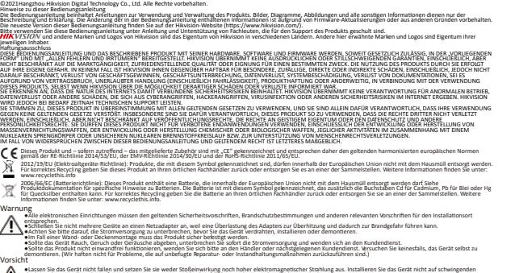

Flächen oder an Stellen, die Stoßeinwirkungen ausgesetzt sind (andernfalls könnte das Gerät beschädigt werden).

●Schützen Sie das Gerät vor extrem heißen oder kalten Temperaturen (genaue Angaben hierzu enthält das technische Datenbla�), staubigen oder feuchten

Umgebungsbedingungen sowie hoher elektromagne�scher Strahlung. ●Die Geräteabdeckung für Inneninstalla�onen muss vor Regen und Feuch�gkeit geschützt werden.

●Schützen Sie das Gerät vor direkter Sonneneinstrahlung, geringer Lu�zirkula�on oder Wärmequellen wie Heizstrahlern oder Heizkörpern (andernfalls besteht Brandgefahr). ●Richten Sie das Gerät nicht auf die Sonne oder besonders helle Stellen aus. Es kann dadurch zu Spiegelungseffekten oder Bildschlieren kommen (was im Übrigen keine

Fehlfunk�on darstellt), wobei möglicherweise auch der Sensor in seiner Funk�onsdauer beeinträch�gt wird.

●Benutzen Sie bi�e keine alkalischen Reinigungsmi�el, sondern ein weiches, trockenes Tuch, um die Innen- und Außenflächen der Geräteabdeckung zu reinigen. ●Bewahren Sie bi�e das gesamte Verpackungsmaterial für zukün�ige Zwecke auf. Im Fall einer Fehlfunk�on schicken Sie das Gerät bi�e in der Originalverpackung an den

Hersteller zurück. Der Transport ohne die Originalverpackung kann zu Schäden am Gerät führen und zusätzliche Kosten nach sich ziehen.

©2021Hangzhou Hikvision Digital Technology Co., Ltd. Todos los derechos reservados.

Sobre este manual

Este manual incluye las instrucciones de u�lización y ges�ón del producto. Las figuras, gráficos, imágenes y cualquier otra información que encontrará en lo sucesivo �enen únicamente fines descrip�vos y aclaratorios. La información incluida en el manual está sujeta a cambios, sin aviso previo, debido a las actualizaciones de so�ware u otros mo�vos. Visite el si�o web de

Hikvision —h�ps://www.hikvision.com/— para acceder a la úl�ma versión de este manual. U�lice este manual con la guía y asistencia de profesionales capacitados en el soporte del producto.

y otras marcas comerciales y logo�pos de Hikvision son propiedad de Hikvision en diferentes jurisdicciones. Las demás marcas comerciales y logo�pos mencionados son

propiedad de sus respec�vos dueños. Descargo de responsabilidad

EN LA MEDIDA MÁXIMA PERMITIDA POR LAS LEYES APLICABLES, ESTE MANUAL Y EL PRODUCTO DESCRITO —INCLUIDOS SU HARDWARE, SOFTWARE Y FIRMWARE— SE SUMINISTRAN «TAL CUAL» Y «CON TODOS SU FALLOS Y ERRORES». HIKVISION NO OFRECE GARANTÍAS, EXPLÍCITAS O IMPLÍCITAS, INCLUIDAS, A MODO ENUNCIATIVO, COMERCIABILIDAD, CALIDAD SATISFACTORIA O IDONEIDAD PARA UN PROPÓSITO EN PARTICULAR. EL USO QUE HAGA DEL PRODUCTO CORRE BAJO SU ÚNICO RIESGO. EN NINGÚN CASO, HIKVISION PODRÁ CONSIDERARSE RESPONSABLE ANTE USTED DE NINGÚN DAÑO ESPECIAL, CONSECUENTE, INCIDENTAL O INDIRECTO, INCLUYENDO, ENTRE OTROS, DAÑOS POR PÉRDIDAS DE BENEFICIOS COMERCIALES, INTERRUPCIÓN DE LA ACTIVIDAD COMERCIAL, PÉRDIDA DE DATOS, CORRUPCIÓN DE LOS SISTEMAS O PÉRDIDA DE DOCUMENTACIÓN, YA SEA POR INCUMPLIMIENTO DEL CONTRATO, AGRAVIO (INCLUYENDO NEGLIGENCIA), RESPONSABILIDAD DEL PRODUCTO O EN RELACIÓN CON EL USO DEL PRODUCTO, INCLUSO CUANDO HIKVISION HAYA RECIBIDO UNA USTED RECONOCE QUE LA NATURALEZA DE INTERNET IMPLICA RIESGOS DE SEGURIDAD INHERENTES Y HIKVISION NO TENDRÁ NINGUNA RESPONSABILIDAD POR EL FUNCIONAMIENTO

NOTIFICACIÓN DE LA POSIBILIDAD DE DICHOS DAÑOS O PÉRDIDAS.

ANORMAL, FILTRACIONES DE PRIVACIDAD U OTROS DAÑOS RESULTANTES DE ATAQUES CIBERNÉTICOS, ATAQUES DE HACKERS, INFECCIONES DE VIRUS U OTROS RIESGOS DE SEGURIDAD DE INTERNET; SIN EMBARGO, HIKVISION PROPORCIONARÁ APOYO TÉCNICO OPORTUNO DE SER NECESARIO. USTED ACEPTA USAR ESTE PRODUCTO DE CONFORMIDAD CON TODAS LAS LEYES APLICABLES Y SOLO USTED ES EL ÚNICO RESPONSABLE DE ASEGURAR QUE EL USO CUMPLA CON DICHAS LEYES. EN ESPECIAL, USTED ES RESPONSABLE DE USAR ESTE PRODUCTO DE FORMA QUE NO INFRINJA LOS DERECHOS DE TERCEROS, INCLUYENDO, DE MANERA ENUNCIATIVA MAS NO LIMITATIVA, DERECHOS DE PUBLICIDAD, DERECHOS DE PROPIEDAD INTELECTUAL, DERECHOS RELATIVOS A LA PROTECCIÓN DE DATOS Y OTROS DERECHOS RELATIVOS A LA PRIVACIDAD. NO UTILIZARÁ ESTE PRODUCTO PARA NINGÚN USO FINAL PROHIBIDO, INCLUYENDO EL DESARROLLO O LA PRODUCCIÓN DE ARMAS DE DESTRUCCIÓN MASIVA, EL DESARROLLO O PRODUCCIÓN DE ARMAS QUÍMICAS O BIOLÓGICAS, NINGUNA ACTIVIDAD EN EL CONTEXTO RELACIONADO CON ALGÚN EXPLOSIVO NUCLEAR O EL CICLO DE COMBUSTIBLE NUCLEAR INSEGURO O EN EN CASO DE HABER CONFLICTO ENTRE ESTE MANUAL Y LA LEGISLACIÓN VIGENTE, ESTA ÚLTIMA PREVALECERÁ.

APOYO DE ABUSOS DE LOS DERECHOS HUMANOS.

Este producto, y en su caso también los accesorios suministrados, �enen la marca "CE" y por tanto cumplen con las normas europeas armonizadas aplicables enumeradas en la Direc�va de equipos de radio 2014/53/UE, la Direc�va de compa�bilidad electromagné�ca 2014/30/UE y la Direc�va de restricción del uso de sustancias peligrosas 2011/65/UE. 2012/19/UE (direc�va RAEE, residuos de aparatos eléctricos y electromagné�cos): En la Unión Europea, los productos marcados con este símbolo no pueden ser desechados en el sistema de basura municipal sin recogida selec�va. Para un reciclaje adecuado, entregue este producto en el lugar de compra del equipo nuevo equivalente o deshágase de él en el punto de recogida designado a tal efecto. Para ver más información, visite: www.recyclethis.info 2006/66/CE (direc�va sobre baterías): Este producto lleva una batería que no puede ser desechada en el sistema municipal de basuras sin recogida selec�va dentro de la Unión Europea. Consulte la documentación del producto para ver la información específica de la batería. La batería lleva marcado este símbolo, que incluye unas letras indicando si con�ene cadmio (Cd), plomo (Pb), o mercurio (Hg). Para un reciclaje adecuado, entregue la batería a su vendedor o llévela al punto de recogida de basuras designado a tal efecto.

Para más información visite: www.recyclethis.info.

Advertencias:

rela�vas de su región.

●Todas las operaciones de electrónica deben respetar estrictamente los reglamentos de seguridad eléctrica, los reglamentos de prevención de incendios y otras norma�vas ●No conecte varios disposi�vos en un solo adaptador de corriente ya que la sobrecarga del adaptador podría provocar un sobrecalentamiento y producirse riesgo de incendio. ●Asegúrese de que ha desconectado la alimentación antes de colocar los cables, instalar o desmontar el disposi�vo.

●Cuando el producto se instale en la pared o en el techo, debe fijar el disposi�vo firmemente. ●Si el disposi�vo despide humo, olores o ruido, apáguelo de inmediato y desenchufe el cable de alimentación; a con�nuación, póngase en contacto con el centro de servicio. ●Si este producto deja de funcionar con normalidad, póngase en contacto con el proveedor o el servicio técnico más cercano. Nunca intente desmontar el disposi�vo por su cuenta. (No asumiremos ningún �po de responsabilidad por problemas provocados por una reparación o mantenimiento no autorizados).

Precauciones

●No deje caer el disposi�vo ni lo someta a golpes fuertes y no lo exponga a radiación electromagné�ca elevada. Evite la instalación del equipo sobre superficies vibratorias o en lugares some�dos a golpes (pasar por alto esta precaución podría provocar daños en el equipo). ●No coloque el disposi�vo en lugares extremadamente cálidos (consulte las especificaciones del disposi�vo para ver la temperatura de funcionamiento detallada), fríos, ni en ●La cubierta del disposi�vo para uso en interiores debe mantenerse alejada de la lluvia y la humedad.

lugares con polvo o humedad y No lo exponga a radiación electromagné�ca intensa.

esta precaución podría provocar un incendio).

●No se permite exponer el equipo a la luz solar directa, en zonas de poca ven�lación o cerca de una fuente de calor como, por ejemplo, un calentador o un radiador (pasar por alto ●No dirija el disposi�vo hacia el sol o hacia fuentes de luz muy intensa. De lo contrario se podría producir un deslumbramiento o emborronamiento (que, no obstante, no es una ●U�lice un trapo seco y suave para limpiar las superficies internas y externas de la cubierta del disposi�vo, no u�lice detergentes alcalinos.

avería) y, al mismo �empo, afectar a la resistencia del sensor.

Se recomienda conservar todos los envoltorios después del desembalaje para su uso futuro. En caso de que se haya producido alguna avería, �ene que devolver el disposi�vo a la fábrica con el envoltorio original. El transporte sin el envoltorio original podría producir daños en el disposi�vo y suponer un recargo adicional. ●Se recomienda conservar todos los envoltorios después del desembalaje para su uso futuro. En caso de que se haya producido alguna avería, �ene que devolver el disposi�vo a la fábrica con el envoltorio original. El transporte sin el envoltorio original podría producir daños en el disposi�vo y suponer un recargo adicional.

#### ©2021Hangzhou Hikvision Digital Technology Co., Ltd. Tu� i diri� riserva�. Informazioni sul presente Manuale

Il presente Manuale con�ene le istruzioni per l'uso e la ges�one del prodo�o. Le illustrazioni, i grafici e tu�e le altre informazioni di seguito riportate hanno solo scopi illustra�vi ed esplica�vi. Le informazioni contenute nel Manuale sono sogge�e a modifiche senza preavviso in seguito ad aggiornamen� del firmware o per altri mo�vi. Scaricare la versione più recente del presente Manuale dal sito web di Hikvision (h�ps://www.hikvision.com/). U�lizzare il presente Manuale con la supervisione e l'assistenza di personale qualificato nel supporto del prodo�o. e gli altri marchi e loghi di Hikvision sono di proprietà di Hikvision in varie giurisdizioni. Gli altri marchi registra� e loghi menziona� appartengono ai rispe�vi �tolari. Esclusione di responsabilità NELLA MISURA MASSIMA CONSENTITA DALLA LEGGE VIGENTE, QUESTO MANUALE E IL PRODOTTO DESCRITTO, CON IL SUO HARDWARE, SOFTWARE E FIRMWARE, SONO FORNITI "COSÌ

COME SONO" E "CON TUTTI I DIFETTI E GLI ERRORI". HIKVISION NON RILASCIA ALCUNA GARANZIA, NÉ ESPRESSA NÉ IMPLICITA COME, SOLO A TITOLO DI ESEMPIO, GARANZIE DI COMMERCIABILITÀ, QUALITÀ SODDISFACENTE O IDONEITÀ PER UN USO SPECIFICO. L'UTENTE UTILIZZA IL PRODOTTO A PROPRIO RISCHIO. HIKVISION DECLINA QUALSIASI RESPONSABILITÀ VERSO L'UTENTE IN RELAZIONE A DANNI SPECIALI, CONSEQUENZIALI E INCIDENTALI, COMPRESI, TRA GLI ALTRI, I DANNI DERIVANTI DA MANCATO PROFITTO, INTERRUZIONE DELL'ATTIVITÀ O PERDITA DI DATI, DANNEGGIAMENTO DI SISTEMI O PERDITA DI DOCUMENTAZIONE, DERIVANTI DA INADEMPIENZA CONTRATTUALE, ILLECITO (COMPRESA LA NEGLIGENZA), RESPONSABILITÀ PER DANNI AI PRODOTTI O ALTRIMENTI IN RELAZIONE ALL'USO DEL PRODOTTO, ANCHE QUALORA HIKVISION SIA STATA INFORMATA DELLA POSSIBILITÀ DI TALI DANNI O PERDITE. L'UTENTE RICONOSCE CHE LA NATURA DI INTERNET PREVEDE RISCHI DI SICUREZZA INTRINSECHI E CHE HIKVISION DECLINA QUALSIASI RESPONSABILITÀ IN RELAZIONE A FUNZIONAMENTI ANOMALI, VIOLAZIONE DELLA RISERVATEZZA O ALTRI DANNI RISULTANTI DA ATTACCHI INFORMATICI, INFEZIONE DA VIRUS O ALTRI RISCHI LEGATI ALLA SICUREZZA SU INTERNET; TUTTAVIA, HIKVISION FORNIRÀ TEMPESTIVO SUPPORTO TECNICO, SE NECESSARIO. L'UTENTE ACCETTA DI UTILIZZARE IL PRODOTTO IN CONFORMITÀ A TUTTE LE LEGGI VIGENTI E DI ESSERE IL SOLO RESPONSABILE DI TALE UTILIZZO CONFORME. IN PARTICOLARE, L'UTENTE È RESPONSABILE DEL FATTO CHE L'UTILIZZO DEL PRODOTTO NON VIOLI DIRITTI DI TERZI COME, SOLO A TITOLO DI ESEMPIO, DIRITTI DI PUBBLICITÀ, DIRITTI DI PROPRIETÀ INTELLETTUALE O DIRITTI RELATIVI ALLA PROTEZIONE DEI DATI E ALTRI DIRITTI RIGUARDANTI LA PRIVACY. L'UTENTE NON UTILIZZERÀ IL PRODOTTO IN MODI PROIBITI, COME, TRA GLI ALTRI, LA PRODUZIONE DI ARMI DI DISTRUZIONE DI MASSA, LO SVILUPPO O LA PRODUZIONE DI ARMI CHIMICHE O BIOLOGICHE, QUALSIASI ATTIVITÀ SVOLTA IN CONTESTI CORRELATI A ESPLOSIVI NUCLEARI O COMBUSTIBILI NUCLEARI NON SICURI O ATTIVITÀ CHE CAUSINO VIOLAZIONI DEI DIRITTI UMANI.

IN CASO DI CONFLITTO TRA IL PRESENTE MANUALE E LA LEGGE VIGENTE, PREVARRÀ QUEST'ULTIMA. Questo prodo�o e gli eventuali accessori in dotazione sono contrassegna� con il marchio "CE" e sono quindi conformi alle norme europee armonizzate vigen� di cui alla Dire�va RE 2014/53/UE, alla Dire�va EMC 2014/30/UE, alla Dire�va RoHS 2011/65/UE. 2012/19/UE (Dire�va RAEE): i prodo� contrassegna� con il presente simbolo non possono essere smal�� come rifiu� domes�ci indifferenzia� nell'Unione europea. Per lo smal�mento corre�o, res�tuire il prodo�o al rivenditore in occasione dell'acquisto di un nuovo disposi�vo o smal�rlo nei pun� di raccolta autorizza�. Ulteriori informazioni sono disponibili sul sito www.recyclethis.info 2006/66/CE (Dire�va ba�erie): questo prodo�o con�ene una ba�eria e non è possibile smal�rlo con i rifiu� domes�ci indifferenzia� nell'Unione europea. Fare riferimento alla documentazione del prodo�o per le informazioni specifiche sulla ba�eria. La ba�eria è contrassegnata con il presente simbolo, che potrebbe includere le sigle di cadmio (Cd), piombo (Pb) o mercurio (Hg). Per lo smal�mento corre�o, res�tuire la ba�eria al rivenditore locale o smal�rla nei pun� di raccolta autorizza�. Ulteriori informazioni sono disponibili sul sito: www.recyclethis.info

Avvertenze:

●L'installazione ele�rica deve essere rigorosamente conforme alle disposizioni di sicurezza ele�rica, alle norme per la prevenzione incendi e a qualsiasi ulteriore norma in vigore nella propria regione. ●Non collegare più disposi�vi allo stesso alimentatore, per evitare di sovraccaricarlo e causare un surriscaldamento o il rischio di incendio. ●Assicurarsi di aver scollegato l'alimentazione prima di cablare, installare o smontare il disposi�vo. ●Fissare saldamente il prodo�o in caso di montaggio a parete o soffi�o. ●Se il disposi�vo eme�e fumo, odore o rumore anomalo, interrompere immediatamente l'alimentazione e scollegare il cavo di alimentazione, poi conta�are il centro assistenza. ●Se il prodo�o non funziona corre�amente, si prega di conta�are il proprio rivenditore o il centro assistenza di zona. Non tentare di smontare personalmente il disposi�vo. (Il produ�ore non si assume alcuna responsabilità per problemi derivan� da riparazioni o manutenzioni non autorizzate.) ●Fare non far cadere il disposi�vo né so�oporlo a impa� e non esporlo a radiazioni ele�romagne�che intense. Evitare l'installazione di disposi�vi su superfici sogge�e a vibrazioni o in luoghi a rischio di impa� (l'inosservanza di questo avviso può causare danni all'apparecchio). ●Non esporre il disposi�vo a temperature estreme (fare riferimento alle specifiche del disposi�vo per informazioni de�agliate sulla temperatura opera�va), ambien� polverosi o

Precauzioni

rischi di incendio).

umidi e a radiazioni ele�romagne�che intense. ●Il coperchio del disposi�vo è per uso in interni e non deve essere esposto a pioggia e umidità. ●Non esporre in alcun caso l'apparecchio alla luce solare dire�a, a bassa ven�lazione o fon� di calore come radiatori o caloriferi (l'inosservanza di questo avviso può causare ●Non puntare il disposi�vo verso il sole o for� fon� di luce. Ciò potrebbe causare una sovraesposizione o la comparsa di aloni (non si tra�a di un malfunzionamento) ed influenzare contemporaneamente la durata del sensore. ●U�lizzare un panno morbido e asciu�o per pulire le superfici interne ed esterne del disposi�vo, non usare detergen� alcalini. ●Conservare tu�e le confezioni una volta aperte per riu�lizzarle eventualmente in futuro In caso di guasto, è necessario inviare spedire il disposi�vo in fabbrica, nella sua confezione originale. Il trasporto senza la confezione originale può provocare danni al disposi�vo e comportare cos� aggiun�vi.

©2021Hangzhou Hikvision Digital Technology Co., Ltd. Todos os direitos reservados. Acerca deste Manual O Manual inclui instruções para u�lizar e gerir o produto. As fotografias, os gráficos, as imagens e todas as outras informações doravante apresentadas des�nam-se apenas a fins de descri�vos e informa�vos. As informações que constam do Manual estão sujeitas a alteração, sem aviso prévio, devido a atualizações de firmware ou a outros mo�vos. Pode encontrar a versão mais recente deste Manual no website da Hikvision (h�ps://www.hikvision.com/). U�lize este Manual sob orientação e com a assistência de profissionais formados neste Produto.

Aviso legal

e outros logó�pos e marcas comerciais da Hikvision são propriedade da Hikvision em vários territórios. Outras marcas comerciais e logó�pos mencionados são propriedade dos respe�vos proprietários. NA MEDIDA MÁXIMA PERMITIDA PELA LEI APLICÁVEL, ESTE MANUAL E O PRODUTO DESCRITO, COM O SEU HARDWARE, SOFTWARE E FIRMWARE, SÃO FORNECIDOS "TAL COMO ESTÃO" E "COM TODAS AS SUAS FALHAS E ERROS". A HIKVISION EXCLUI, DE FORMA EXPLÍCITA OU IMPLÍCITA, GARANTIAS DE, INCLUINDO E SEM LIMITAÇÃO, COMERCIABILIDADE, QUALIDADE DO SERVIÇO OU ADEQUAÇÃO A UMA FINALIDADE ESPECÍFICA. A SUA UTILIZAÇÃO DESTE PRODUTO É FEITA POR SUA CONTA E RISCO. EM NENHUMA CIRCUNSTÂNCIA, A HIKVISION SERÁ RESPONSÁVEL POR SI EM RELAÇÃO A QUAISQUER DANOS ESPECIAIS, CONSEQUENCIAIS, INCIDENTAIS OU INDIRETOS, INCLUINDO, ENTRE OUTROS, DANOS PELA PERDA DE LUCROS COMERCIAIS, INTERRUPÇÃO DA ATIVIDADE, PERDA DE DADOS, CORRUPÇÃO DE SISTEMAS OU PERDA DE DOCUMENTAÇÃO SEJA COM BASE NUMA VIOLAÇÃO DO CONTRATO, ATOS ILÍCITOS (INCLUÍNDO NEGLIGÊNCIA), RESPONSABILIDADE PELO PRODUTO OU, DE OUTRO MODO, RELACIONADA COM A UTILIZAÇÃO DO PRODUTO, AINDA QUE A HIKVISION TENHA SIDO AVISADA SOBRE A POSSIBILIDADE DE TAIS DANOS OU PERDAS. O UTILIZADOR RECONHECE QUE A NATUREZA DA INTERNET OFERECE RISCOS DE SEGURANÇA INERENTES E QUE A HIKVISION NÃO SERÁ RESPONSABILIZADA POR UM FUNCIONAMENTO ANORMAL, PERDA DE PRIVACIDADE OU OUTROS DANOS RESULTANTES DE ATAQUES INFORMÁTICOS, ATAQUES DE PIRATARIA, INFEÇÃO POR VÍRUS OU OUTROS RISCOS ASSOCIADOS À SEGURANÇA DA INTERNET. NO ENTANTO, A HIKVISION PRESTARÁ APOIO TÉCNICO ATEMPADO, SE SOLICITADO. O UTILIZADOR ACEITA UTILIZAR ESTE PRODUTO EM CONFORMIDADE COM TODAS AS LEIS APLICÁVEIS E SER O ÚNICO RESPONSÁVEL POR GARANTIR QUE A SUA UTILIZAÇÃO É

CONFORME À LEI APLICÁVEL. PARTICULARMENTE, O UTILIZADOR É O RESPONSÁVEL PELA UTILIZAÇÃO DESTE PRODUTO DE MODO QUE NÃO INFRINJA OS DIREITOS DE TERCEIROS, INCLUINDO, ENTRE OUTROS, OS DIREITOS DE PUBLICIDADE, DIREITOS DE PROPRIEDADE INTELECTUAL OU DE PROTEÇÃO DE DADOS, OU QUAISQUER OUTROS DIREITOS DE PRIVACIDADE. O UTILIZADOR NÃO PODERÁ UTILIZAR ESTE PRODUTO PARA QUAISQUER UTILIZAÇÕES FINAIS PROIBIDAS, INCLUINDO O DESENVOLVIMENTO OU PRODUÇÃO DE ARMAS DE DESTRUIÇÃO MACIÇA, DESENVOLVIMENTO OU PRODUÇÃO DE QUÍMICOS OU ARMAS BIOLÓGICAS, QUAISQUER ATIVIDADES DESENVOLVIDAS NO ÂMBITO DE EXPLOSIVOS NUCLEARES OU CICLOS DE COMBUSTÍVEL NUCLEAR INSEGURO OU PARA APOIAR ABUSOS AOS DIREITOS HUMANOS. NA EVENTUALIDADE DA OCORRÊNCIA DE ALGUM CONFLITO ENTRE ESTE MANUAL E A LEGISLAÇÃO APLICÁVEL, ESTA ÚLTIMA PREVALECE. Este produto e, se aplicável, os acessórios fornecidos, apresentam a marcação "CE" e, por isso, cumprem as normas europeias harmonizadas aplicáveis listadas na Dire�va 2014/53/UE rela�va aos equipamentos de rádio, na Dire�va 2014/30/UE sobre compa�bilidade eletromagné�ca (CEM) e na Dire�va 2011/65/UE rela�va à restrição do uso de determinadas substâncias perigosas em equipamentos elétricos e eletrónicos (EEE). 2012/19/UE (Dire�va REEE): Os produtos com este símbolo não podem ser eliminados como resíduos urbanos indiferenciados na União Europeia. Para uma reciclagem

adequada, devolva este produto ao seu fornecedor local quando adquirir um novo equipamento equivalente ou elimine-o através dos pontos de recolha adequados. Para mais informações, consulte: www.recyclethis.info. 2006/66/CE (dire�va rela�va a baterias): Este produto contém uma bateria que não pode ser eliminada como resíduo urbano indiferenciado na União Europeia. Consulte a documentação do produto para obter informações específicas acerca da bateria. A bateria está marcada com este símbolo, que poderá incluir inscrições para indicar a presença de cádmio (Cd), chumbo (Pb), ou mercúrio (Hg). Para reciclar o produto de forma adequada, devolva a bateria ao seu fornecedor ou coloque-a num ponto de recolha apropriado. Para mais informações, consulte: www.recyclethis.info.

Aviso: ●Todas as operações eletrónicas devem encontrar-se em rigorosa conformidade com os regulamentos de segurança elétrica, regulamentos de prevenção de incêndio e outros regulamentos relacionados na sua região. ●Não ligue vários disposi�vos a um único adaptador de energia, pois a sobrecarga do mesmo pode provocar um sobreaquecimento ou risco de incêndio. ●Cer�fique-se de que a energia foi desligada antes de ligar, instalar ou desmontar o disposi�vo. ●Se o produto for instalado numa parede ou no teto, o disposi�vo deve ficar bem fixo. ●Se o disposi�vo deitar fumo ou emi�r odores ou ruídos, desligue-o de imediato, re�re o cabo de alimentação e contacte o centro de assistência.

●Se o produto não funcionar corretamente, contacte o seu fornecedor ou o seu centro de serviços local. Nunca tente desmontar o disposi�vo sem assistência. (Não assumimos qualquer responsabilidade por problemas causados por reparações ou manutenções não autorizadas.) Advertência ●Não deixe cair o disposi�vo nem o sujeite a impactos �sicos e não o exponha a radiações eletromagné�cas elevadas. Evite a instalação do equipamento em super�cies com vibração ou em locais sujeitos a impacto (ignorar esta instrução pode provocar danos no equipamento). ●Não coloque o disposi�vo em locais extremamente quentes (consulte as especificações do disposi�vo para obter informações detalhadas sobre a temperatura de funcionamento), frios, poeirentos ou húmidos, nem o exponha a radiações eletromagné�cas elevadas. ●A cobertura do disposi�vo para u�lização interna deve ser man�da afastada de chuva e de humidade. ●É proibido expor o equipamento a luz solar direta, baixa ven�lação ou a fonte de calor como, por exemplo, aquecedores ou radiadores (ignorar esta instrução pode provocar risco de incêndio). ●Não direcione o disposi�vo para o sol nem para locais extremamente brilhantes. Caso contrário, podem ocorrer brilhos ou manchas (não se tratando, contudo, de nenhuma avaria), que afetam também a resistência do sensor. ●U�lize um pano seco e macio para limpar as super�cies interiores e exteriores da cobertura do disposi�vo; não u�lize detergentes alcalinos. ●Guarde todos os invólucros depois de os desembalar, para u�lização futura. Em caso de qualquer avaria, deve devolver o disposi�vo à fábrica com o invólucro original. O

transporte sem o invólucro original pode resultar em danos no disposi�vo e acarretar custos adicionais.

©2021Hangzhou Hikvision Digital Technology Co., Ltd. Alle rechten voorbehouden. Over deze handleiding

De handleiding bevat instruc�es voor het gebruik en beheer van het product. Foto's, grafieken, a�eeldingen en alle andere informa�e hierna worden verstrekt voor beschrijving en uitleg. De informa�e in de handleiding is onderhevig aan verandering, zonder voorafgaande kennisgeving, als gevolg van firmware-updates of andere redenen. U kunt de nieuwste versie van deze handleiding vinden op de Hikvision-website (h�ps://www.hikvision.com/). Gebruik deze handleiding onder begeleiding en ondersteuning van professionals die zijn opgeleid voor het ondersteunen van het product. en andere handelsmerken en logo's van Hikvision zijn eigendom van Hikvision in de verschillende jurisdic�es. Andere handelsmerken en logo's zijn het eigendom van hun respec�eve eigenaren. Vrijwaringsclausule

VOOR ZOVER MAXIMAAL TOEGESTAAN OP GROND VAN HET TOEPASSELIJK RECHT, WORDEN DEZE HANDLEIDING EN HET OMSCHREVEN PRODUCT, INCLUSIEF HARDWARE, SOFTWARE EN FIRMWARE, GELEVERD 'ZOALS ZE ZIJN', INCLUSIEF 'FOUTEN EN GEBREKEN'. HIKVISION GEEFT GEEN GARANTIES, EXPLICIET NOCH IMPLICIET, INCLUSIEF ZONDER BEPERKING OMTRENT VERKOOPBAARHEIED, TEVREDENHEID OMTRENT KWALITEIT OF GESCHIKTHEID VOOR EEN BEPAALD DOEL. HET GEBRUIK VAN HET PRODUCT DOOR U IS OP EIGEN RISICO. IN GEEN GEVAL IS HIKVISION VERANTWOORDELIJK VOOR SPECIALE, BIJKOMENDE, INCIDENTELE OF INDIRECTE SCHADE, WAARONDER, ONDER ANDERE, SCHADE VAN VERLIES AAN ZAKELIJKE WINST, ZAKELIJKE ONDERBREKING OF VERLIES VAN GEGEVENS, CORRUPTIE OF SYSTEMEN, OF VERLIES VAN DOCUMENTATIE, ONGEACHT OF DIT VOORTVLOEIT UIT CONTRACTBREUK, BENADELING (INCLUSIEF NALATIGHEID), PRODUCTAANSPRAAKELIJKHEID OF ANDERS, MET BETREKKING TOT HET PRODUCT, ZELFS ALS HIKVISION OP DE HOOGTE IS GEBRACHT VAN ZULKE SCHADE OF VERLIES. U ERKENT DAT DE AARD VAN INTERNET INHERENTE VEILIGHEIDSRISICO'S MET ZICH MEE BRENGT, EN HIKVISION GEEN ENKELE VERANTWOORDELIJKHEID NEEMT VOOR ABNORMALE WERKING, PRIVACYLEKKEN OF ANDERE SCHADE DIE VOORTVLOEIT UIT CYBERAANVAL, HACKERAANVAL, VIRUSINFECTIE, OF ANDERE INTERNETVEILIGHEIDSRISICO'S; HIKVISION BIEDT INDIEN NODIG ECHTER TIJDELIJK TECHNISCHE ONDERSTEUNING. U GAAT AKKOORD MET HET GEBRUIK VAN DIT PRODUCT IN OVEREENSTEMMING MET ALLE TOEPASBARE WETTEN EN UITSLUITEND U BENT VERANTWOORDELIJK VOOR DE GARANTIE DAT UW GEBRUIK OVEREENSTEMT MET DE TOEPASBARE WET. U BENT VOORAL VERANTWOORDELIJK DAT HET GEBRUIK VAN DIT PRODUCT GEEN INBREUK MAAKT OP DE RECHTEN VAN DERDEN, INCLUSIEF EN ZONDER BEPERKING DE RECHTEN VAN PUBLICITEIT, INTELLECTUEEL EIGENDOM, OF GEGEVENSBESCHERMING EN ANDERE PRIVACYRECHTEN. U MAG DIT PRODUCT

NIET GEBRUIKEN VOOR ENIGE ONWETTIG EINDGEBRUIK, MET INBEGRIP VAN DE ONTWIKKELING OF DE PRODUCTIE VAN MASSAVERNIETIGINGSWAPENS, DE ONTWIKKELING OF DE PRODUCTIE VAN CHEMISCHE OF BIOLOGISCHE WAPENS, ALLE ACTIVITEITEN IN HET KADER VAN EVENTUELE NUCLEAIRE EXPLOSIEVEN OF ONVEILIGE NUCLEAIRE BRANDSTOFCYCLUS, OF TER ONDERSTEUNING VAN MENSENRECHTENSCHENDINGEN. IN HET GEVAL VAN ENIGE CONFLICTEN TUSSEN DEZE HANDLEIDING EN DE TOEPASSELIJKE WETGEVING, PREVALEERT DE LAATSTE. Dit product en, indien van toepassing, de meegeleverde accessoires, zijn gemarkeerd met "CE" en voldoen daardoor aan de toepasbare geharmoniseerde Europese normen zoals vermeld onder de RE-richtlijn 2014/53/EU, de EMC-richtlijn 2014/30/EU, de RoHS-richtlijn 2011/65/EU.

2012/19/EU (WEEE-richtlijn): Producten die met dit symbool zijn gemarkeerd mogen binnen de Europese Unie niet worden weggegooid als ongesorteerd huishoudelijk afval. Lever dit product voor een juiste recycling in bij uw plaatselijke leverancier bij aankoop van soortgelijke nieuwe apparatuur, of breng het naar daarvoor aangewezen inzamelpunten. Raadpleeg www.recyclethis.info voor meer informa�e 2006/66/EG (Ba�erijrichtlijn): Dit product bevat een ba�erij die binnen de Europese Unie niet mag worden weggegooid als ongesorteerd huishoudelijk afval. Zie de productdocumenta�e voor specifieke informa�e over de ba�erij. De ba�erij is gemarkeerd met dit symbool, dat le�ers kan beva�en die cadmium (Cd), lood (Pb) of kwik (Hg)

aanduiden. Lever de ba�erij voor een juiste recycling in bij uw leverancier of bij een daarvoor aangewezen inzamelpunt. Raadpleeg www.recyclethis.info voor meer informa�e Waarschuwingen ●Elk gebruik van elektronische apparatuur moet exact voldoen aan de lokale voorschri�en voor elektrische veiligheid, de voorschri�en ter voorkoming van brand en andere op de loca�e geldende regels. ●Sluit niet meerdere apparaten aan op één voedingsadapter. Overbelas�ng van de adapter kan leiden tot oververhi�ng en brandgevaar. ●Zorg dat de voeding is losgekoppeld voordat u de bedrading aansluit of het apparaat installeert of verwijdert.

●Wanneer het product op een muur of plafond wordt geplaatst, moet het apparaat stevig worden vastgezet. ●Als het apparaat rook, geurtjes of geluid produceert, moet u het direct uitschakelen en de voedingskabel verwijderen. Neem vervolgens contact op met het servicecentrum. ●Als het product niet naar behoren werkt, neemt u contact op met uw dealer of het dichtstbijzijnde servicecentrum. Probeer nooit zelf het apparaat uit elkaar te halen. (Wij nemen geen verantwoordelijkheid voor problemen die zijn veroorzaakt door ongeautoriseerde repara�es of onderhoudswerkzaamheden.) Voorzich�gheden

●Laat het apparaat niet vallen en stel het niet bloot aan schokken of sterke elektromagne�sche straling. Installeer de apparatuur nooit op een trillend oppervlak of plaatsen waar trillingen kunnen optreden (hierdoor kan de apparatuur beschadigd raken). ●Plaats het apparaat niet op extreem warme (raadpleeg de specifica�e van het apparaat voor meer informa�e over de bedrijfstemperatuur), koude, stoffige of voch�ge loca�es en stel het niet bloot aan sterke elektromagne�sche straling. ●De apparaatkap voor gebruik binnenshuis mag niet worden blootgesteld aan regen en vocht. ●Stel de apparatuur niet bloot aan direct zonlicht, slechte ven�la�e of hi�ebronnen (zoals hi�ebranders en radiotoren). Als deze meldingen worden genegeerd, kan dit brandgevaar veroorzaken. ●Richt het apparaat niet op de zon of extreem heldere lichtbronnen. Als u dat wel doet, kan dit leiden tot overbelich�ng of vlekken (wat niet betekent dat het product niet goed werkt) en kan dit een nadelige invloed hebben op de levensduur van de sensor. ●Gebruik een zachte en droge doek om het binnen- en buitenoppervlak van de apparaatkap schoon te maken. Gebruik geen basische schoonmaakmiddelen. Bewaar alle verpakkingsmaterialen. U hebt deze nodig om bij een eventueel defect het apparaat in de originele verpakking terug te sturen naar de fabrikant. Transport zonder de

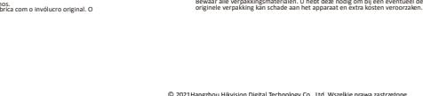

©2021Hangzhou Hikvision Digital Technology Co., Ltd. Všechna práva vyhrazena.

Informace o tomto návodu

V návodu jsou obsaženy pokyny k používání a obsluze výrobku. Obrázky, schémata, snímky a veškeré ostatní zde uvedené informace slouží pouze jako popis a vysvětlení. Informace obsažené v tomto návodu podléhají vzhledem k aktualizacím firmwaru nebo z jiných důvodů změnám bez upozornění. Nejnovější verzi tohoto návodu naleznete na webových stránkách společnos�

a ostatní ochranné známky a loga společnos� Hikvision jsou vlastnictvím společnos� Hikvision v různých jurisdikcích. Ostatní ochranné známky a loga uvedené v této

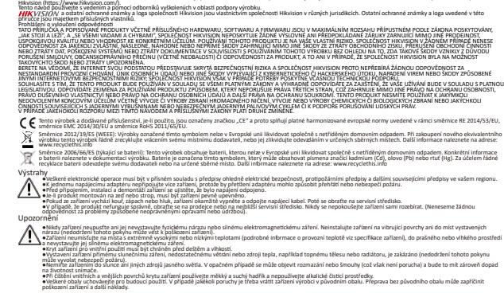

©2021Hangzhou Hikvision Digital Technology Co., Ltd. Alle re�gheder forbeholdes. Om denne vejledning Vejledningen indeholder anvisninger om brug og håndtering af produktet. Billeder, diagrammer, illustra�oner og alle øvrige oplysninger here�er tjener kun som beskrivelse og forklaring. Oplysningerne i vejledningen er med forbehold for ændring uden varsel på grund af opdateringer af firmware eller andre årsager. Du kan finde den seneste udgave af vejledning på Hikvisions websted (h�ps://www.hikvision.com/). Brug brugervejledningen under vejledning af og med hjælp fra fagfolk, der er uddannet i understø�else af produktet. og andre af Hikvisions varemærker og logoer �lhører Hikvision i forskellige jurisdik�oner. Andre nævnte varemærker og logoer �lhører deres respek�ve ejere. Ansvarsfraskrivelse VEJLEDNINGEN OG DET HERI BESKREVNE PRODUKT, INKL. HARDWARE, SOFTWARE OG FIRMWARE, LEVERES I STØRST MULIGT OMFANG, DER ER TILLADT VED LOV, "SOM DET ER OG FOREFINDES" OG "MED ALLE DEFEKTER OG FEJL". HIKVISION UDSTEDER INGEN GARANTIER, UDTRYKKELIGE ELLER UNDERFORSTÅEDE, INKL. UDEN BEGRÆNSNING, VEDRØRENDE SALGBARHED, TILFREDSSTILLENDE KVALITET ELLER EGNETHED TIL ET BESTEMT FORMÅL. DIN BRUG AF PRODUKTET SKER PÅ DIN EGEN RISIKO. UNDER INGEN OMSTÆNDIGHEDER ER HIKVISION ANSVARLIG OVER FOR DIG FOR SÆRLIGE SKADER, HÆNDELIGE SKADER, FØLGESKADER ELLER INDIREKTE SKADER, INKL. BL.A., SKADER SOM FØLGE AF DRIFTSTAB, DRIFTSFORSTYRRELSER ELLER TAB AF DATA, BESKADIGELSE AF SYSTEMER ELLER TAB AF DOKUMENTATION, UANSET OM DET ER BASERET PÅ KONTRAKTBRUD, SKADEVOLDENDE HANDLINGER (HERUNDER UAGTSOMHED), PRODUKTANSVAR ELLER PÅ ANDEN MÅDE I FORBINDELSE MED BRUGEN AF PRODUKTET, SELVOM HIKVISION ER BLEVET UNDERRETTET OM MULIGHEDEN FOR SÅDANNE SKADER. DU ANERKENDER, AT INTERNETTET INDEHOLDER INDBYGGEDE SIKKERHEDSRISICI. HIKVISION PÅTAGER SIG INTET ANSVAR FOR UNORMAL DRIFT, LÆKAGE AF PERSONLIGE OPLYSNINGER ELLER ANDRE SKADER SOM FØLGE AF CYBERANGREB, HACKERANGREB, VIRUSANGREB ELLER ANDRE INTERNETSIKKERHEDSRISICI. HIKVISION VIL DOG YDE EVENTUEL NØDVENDIG OG RETTIDIG TEKNISK BISTAND. DU ERKLÆRER DIG INDFORSTÅET MED AT BRUGE PRODUKTET I OVERENSSTEMMELSE MED ALLE GÆLDENDE LOVE, OG DU ER ENEANSVARLIG FOR AT SIKRE, AT DIN BRUG OVERHOLDER AL GÆLDENDE LOVGIVNING. DU ER ISÆR ANSVARLIG FOR AT BRUGE PRODUKTET PÅ EN MÅDE, DER IKKE KRÆNKER TREDJEPARTERS RETTIGHEDER, HERUNDER, UDEN BEGRÆNSNINGER, RETTIGHEDER VEDRØRENDE OFFENTLIG OMTALE, INTELLEKTUELLE EJENDOMSRETTIGHEDER ELLER RETTIGHEDER VEDRØRENDE DATABESKYTTELSE OG ANDRE RETTIGHEDER VEDRØRENDE PERSONLIGE OPLYSNINGER. DU MÅ IKKE BRUGE PRODUKTET TIL FORBUDTE SLUTANVENDELSER, HERUNDER UDVIKLING ELLER FREMSTILLING AF MASSEØDELÆGGELSESVÅBEN, UDVIKLING ELLER PRODUKTION AF KEMISKE ELLER BIOLOGISKE VÅBEN, AKTIVITETER I DEN KONTEKST, DER ER KNYTTET TIL ATOMBOMBER ELLER USIKKERT REAKTORBRÆNDSEL, ELLER SOM STØTTE TIL OVERTRÆDELSE AF MENNESKERETTIGHEDER. I TILFÆLDE AF UOVERENSSTEMMELSE MELLEM VEJLEDNINGEN OG GÆLDENDE LOVGIVNING GÆLDER SIDSTNÆVNTE. Produktet og eventuelt medfølgende �lbehør er mærket "CE" og opfylder derfor gældende harmoniserede europæiske standarder anført i RE-direk�vet 2014/53/EU, EMCdirek�vet 2014/30/EU og RoHS-direk�vet 2011/65/EU. 2012/19/EU (WEEE-direk�vet): Produkter, der er mærket med de�e symbol, kan ikke bortskaffes som almindeligt husholdningsaffald i EU. Med henblik på korrekt genbrug skal du aflevere produktet �l din lokale leverandør ved køb af �lsvarende nyt udstyr eller aflevere det på et der�l indre�et indleveringssted. For yderligere oplysninger se: www.recyclethis.info. 2006/66/EF (ba�eridirek�vet): De�e produkt indeholder et ba�eri, som ikke kan bortskaffes sammen med almindeligt husholdningsaffald i EU. Find specifikke oplysninger om

ba�eriet i produktdokumenta�onen. Ba�eriet er mærket med de�e symbol, som kan indeholde bogstaver, der indikerer indhold af kadmium (Cd), bly (Pb) eller kviksølv (Hg). Med henblik på korrekt genbrug skal du aflevere ba�eriet �l din leverandør eller �l et der�l indre�et indleveringssted. Du kan få flere oplysninger her: www.recyclethis.info Advarsler ●Al dri� af elektronisk udstyr skal finde sted under nøje overholdelse af elektriske sikkerhedsbestemmelser, bestemmelser om brandforebyggelse og øvrige relevante bestemmelser i dit lokalområde. ●Slut ikke flere enheder �l én strømadapter. Overbelastning af adapteren kan forårsage overophedning eller fare for brand. ●Kontrollér, at strømmen er a�rudt, før du trækker ledninger �l, installerer eller afmonterer enheden.

●Enheden skal fastgøres forsvarligt, hvis den installeres på en væg eller i lo�et. ●Hvis enheden afgiver røg, lugt eller støj, skal du straks slukke for strømmen og trække netledningen ud. Dere�er skal du kontakte servicecentret. ●Hvis produktet ikke virker korrekt, skal du kontakte din forhandler eller dit nærmeste servicecenter. Forsøg ikke selv at adskille enheden. (Vi påtager os ikke noget ansvar for problemer, der er forårsaget af uautoriseret repara�on eller vedligeholdelse). Forsig�g ●Udstyret må ikke tabes eller udsæ�es for fysiske stød. Udsæt ikke udstyret for høj elektromagne�sk stråling. Undgå at installere enheden på overflader med vibra�oner eller

steder, der udsæ�es for stød. Manglende overholdelse kan forårsage skade på enheden. ●Placér ikke enheden på steder med stærk varme (se specifika�onerne for enheden med oplysninger om dri�stemperatur), kulde, støv eller fug�ghed. Udsæt ikke enheden for høj elektromagne�sk stråling. ●Udsæt ikke kabine�et �l enheden �l indendørs brug for regn og fugt. ●Udsæt ikke enheden for direkte sollys eller varmekilder såsom varmeapparater eller radiatorer. Anbring ikke enheden et sted med ringe udlu�ning. Manglende overholdelse kan forårsage brandfare. ●Ret ikke enheden mod solen eller stærkt oplyste steder. Der kan opstå reflekser eller sløring (de�e er ikke en fejl), og endvidere kan sensorens leve�d påvirkes. ●Brug en blød og tør klud �l indvendig og udvendig rengøring af kabine�et. Brug ikke alkaliske rengøringsmidler. ●Gem al emballage e�er udpakningen �l senere brug. Du skal bruge den originale emballage �l at returnere enheden �l fabrikken, hvis der opstår fejl. Forsendelse uden den originale emballage kan forårsage skade på enheden og medføre øgede udgi�er.

©2021Hangzhou Hikvision Digital Technology Co., Ltd. Minden jog fenntartva. Az útmutatóval kapcsolatos tudnivalók Az útmutató a termék használatára és kezelésére vonatkozó utasításokat tartalmaz. Az i� szereplő képek, diagramok, ábrák és minden további információ csupán leírásként és magyarázatként szolgál. Az Útmutatóban szereplő információk a firmware-frissítések és egyéb okok mia� előzetes értesítés nélkül változhatnak. Az Útmutató legfrissebb változatáért keresse fel a Hikvision weboldalát (h�ps://www.hikvision.com/). Az Útmutatót a termékkel kapcsolatos támogatáshoz megfelelő képesítéssel rendelkező szakemberek támogatásával és útmutatásával együ� használja. A(z) , valamint a Hikvision egyéb védjegyei és logói a Hikvision tulajdonát képezik különböző joghatóságokban. Az említe� egyéb védjegyek és logók a megfelelő tulajdonosok tulajdonát képezik.

Felelősségkizárás EZT A KÉZIKÖNYVET, VALAMINT A BENNE SZEREPLŐ TERMÉKET ANNAK HARDVER-, SZOFTVER-ÖSSZETEVŐIVEL ÉS FIRMWARE-ÉVEL EGYÜTT "EREDETI FORMÁBAN" BIZTOSÍTJUK, "BELEÉRTVE AZOK ÖSSZES ESETLEGES HIBÁJÁT". A HIKVISION NEM VÁLLAL SEM KIFEJEZETT, SEM TÖRVÉNY ÁLTAL VÉLELMEZETT JÓTÁLLÁST, TÖBBEK KÖZÖTT – DE NEM KORLÁTOZVA – A TERMÉK ÉRTÉKESÍTHETŐSÉGÉRE, MEGFELELŐ MINŐSÉGÉRE, VALAMINT ADOTT CÉLRA VALÓ ALKALMASSÁGÁRA. A TERMÉKET KIZÁRÓLAG SAJÁT FELELŐSSÉGÉRE HASZNÁLHATJA. A HIKVISION SEMMILYEN ESETBEN SEM VÁLLAL FELELŐSSÉGET ÖN FELÉ SEMMILYEN KÜLÖNLEGES, KÖVETKEZMÉNYES, JÁRULÉKOS VAGY KÖZVETETT KÁRÉRT, BELEÉRTVE TÖBBEK KÖZÖTT A TERMÉK HASZNÁLATÁVAL ÖSSZEFÜGGÉSBEN AZ ÜZLETI HASZON ELVESZTÉSÉBŐL, AZ ÜZLETMENET MEGSZAKADÁSÁBÓL, VALAMINT AZ ADATOK VAGY DOKUMENTUMOK ELVESZTÉSÉBŐL EREDŐ KÁROKAT, TÖRTÉNJEN EZ SZERZŐDÉSSZEGÉS VAGY KÁROKOZÁS (BELEÉRTVE A GONDATLANSÁGOT) EREDMÉNYEKÉNT, MÉG AKKOR SEM, HA A HIKVISION VÁLLALATOT TÁJÉKOZTATTÁK AZ ILYEN KÁROK BEKÖVETKEZÉSÉNEK LEHETŐSÉGÉRŐL. ÖN TUDOMÁSUL VESZI, HOGY AZ INTERNET TERMÉSZETÉBŐL FAKADÓAN REJT KOCKÁZATOKAT, ÉS A HIKVISION SEMMILYEN FELELŐSSÉGET NEM VÁLLAL A RENDELLENES MŰKÖDÉSÉRT, A SZEMÉLYES ADATOK KISZIVÁRGÁSÁÉRT VAGY MÁS OLYAN KÁROKÉRT, AMELYEKET KIBERTÁMADÁSOK, HACKERTÁMADÁSOK, VÍRUSFERTŐZÉSEK VAGY MÁS INTERNETES BIZTONSÁGI VESZÉLYEK OKOZTAK; A HIKVISION AZONBAN KÉRÉSRE IDŐBEN MŰSZAKI TÁMOGATÁST NYÚJT. ÖN ELFOGADJA, HOGY EZT A TERMÉKET KIZÁRÓLAG A VONATKOZÓ TÖRVÉNYI ELŐÍRÁSOK BETARTÁSÁVAL HASZNÁLJA, ÉS HOGY A VONATKOZÓ TÖRVÉNYEKNEK MEGFELELŐ HASZNÁLAT KIZÁRÓLAG AZ ÖN FELELŐSSÉGE. KÜLÖNÖSKÉPPEN AZ ÖN FELELŐSSÉGE, HOGY A TERMÉK HASZNÁLATA SORÁN NE SÉRTSE HARMADIK FÉL JOGAIT, BELEÉRTVE, DE NEM KORLÁTOZVA A NYILVÁNOSSÁGRA, SZELLEMI TULAJDONRA, ADATOK VÉDELMÉRE ÉS EGYÉB SZEMÉLYES ADATOKRA VONATKOZÓ JOGOKAT. A TERMÉKET NEM HASZNÁLHATJA TILTOTT CÉLRA, BELEÉRTVE A TÖMEGPUSZTÍTÓ FEGYVEREK FEJLESZTÉSÉT VAGY GYÁRTÁSÁT, A VEGYI VAGY BIOLÓGIAI FEGYVEREK FEJLESZTÉSÉT VAGY GYÁRTÁSÁT, VALAMINT BÁRMILYEN, ROBBANÁSVESZÉLYES VAGY NEM BIZTONSÁGOS NUKLEÁRIS HASADÓANYAG-CIKLUSSAL KAPCSOLATOS TEVÉKENYSÉGET, ILLETVE EMBERI JOGI VISSZAÉLÉSEKET TÁMOGATÓ MÓDON

TÖRTÉNŐ FELHASZNÁLÁST. HA A JELEN KÉZIKÖNYV ÉS A HATÁLYOS TÖRVÉNY KÖZÖTT ELLENTMONDÁS TAPASZTALHATÓ, AKKOR AZ UTÓBBI A MÉRVADÓ. Ez a termék és tartozékai (amennyiben vannak) "CE" jelöléssel vannak ellátva, ezáltal megfelelnek a következő irányelvekben foglalt harmonizált európai szabványoknak: 2014/53/EU (RE-irányelv), 2014/30/EU (EMC-irányelv), 2011/65/EU (RoHS-irányelv). 2012/19/EU (WEEE-irányelv): Az ezzel a jelzéssel elláto� termékeket nem lehet szelektálatlan kommunális hulladékként elhelyezni az Európai Unióban. A megfelelő újrahasznosítás érdekében vigye vissza ezt a terméket helyi beszállítójához, amikor új, egyenértékű berendezést vásárol, vagy adja le a kijelölt gyűjtőhelyeken. További információért keresse fel az alábbi honlapot: www.recyclethis.info 2006/66/EC (akkumulátorokról szóló irányelv): Ez a termék olyan akkumulátort tartalmaz, amelyet nem lehet szelektálatlan kommunális hulladékként elhelyezni az Európai Unióban. A termékdokumentációban további információkat talál az akkumulátorról. Az akkumulátor ezzel a jelzéssel van ellátva. A jelzésen megtalálhatók lehetnek a kadmiumot (Cd), ólmot (Pb) vagy higanyt (Hg) jelző betűjelek. A megfelelő újrahasznosítás érdekében vigye vissza ezt a terméket a beszállítójához, vagy vigye egy kijelölt gyűjtőhelyre. További információért keresse fel az alábbi honlapot: www.recyclethis.info

Figyelmeztetések: ●Az elektromosságot érintő műveleteket az elektromos érintésvédelmi előírások, tűzvédelmi előírások és más, hatályos helyi előírások szigorú figyelembe vételével kell elvégezni. ●Ne csatlakoztasson több eszközt egy tápegységhez, mert az túlterhelhe� a tápegységet, ami túlmelegedést vagy tüzet okozhat. ●Vezetékezés, telepítés, vagy szétszerelés elő� mindig áramtalanítsa a készüléket. ●Ha a terméket falra vagy mennyezetre szereli, stabilan rögzítse. ●Ha az eszköz füstöt, furcsa szagot vagy zajt bocsát ki, azonnal áramtalanítsa, húzza ki a tápkábelt, majd forduljon a szervizközponthoz. ●Ha a termék nem működik megfelelően, forduljon a kereskedőhöz vagy a legközelebbi szervizközponthoz. Soha ne próbálja meg saját maga szétszerelni a készüléket. (Nem

vállalunk felelősséget az illetéktelen javításból vagy karbantartásból eredő károkért.) Vigyázat! ●Ne ejtse le a készüléket és ne tegye ki fizikai rázkódásnak, valamint ne tegye kierős elektromágneses sugárzásnak. Ne szerelje a készüléket rezgő felületre, vagy olyan helyre, ahol rázkódás érhe� (ellenkező esetben a készülék károsodhat). ●Ne helyezze a készüléket rendkívül forró (az üzemi hőmérsékle�el kapcsolatban lásd a készülék műszaki adatait), hideg, poros vagy nedves helyre, és ne tegye ki erős elektromágneses sugárzásnak. ●A beltéri használatra terveze� készülék burkolatát ne tegye ki esőnek és nedvességnek. ●Ne tegye ki a készüléket közvetlen napfénynek, ne helyezze rosszul szellőző helyre vagy hőforrás, például fűtőtest közelébe (ennek be nem tartása tűzveszélyes). ●Ne irányítsa a készüléket a Nap, vagy rendkívül fényes felületek felé. Reflexfény vagy elmosódás lehet az eredmény (ez azonban nem hibát jelez), ami ugyanakkor hatással van az érzékelő éle�artamára is. ●A készülék belsejének és külsejének �sz�tásához használjon puha és száraz kendőt, ne használjon lúgos �sz�tószereket. ●Minden csomagolóelemet őrizzen meg, később szüksége lehet rá. Hiba esetén az erede� csomagolásában kell a készüléket visszaküldenie a gyártónak. Az erede�

csomagolás nélküli szállítás a készülék sérülését okozhatja, ami további költségekhez vezethet.

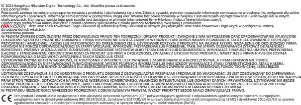

Dyrektywa 2012/19/UE w sprawie zużytego sprzętu elektrycznego i elektronicznego (WEEE): Produktów oznaczonych tym symbolem nie wolno utylizować na obszarze Unii Europejskiej jako niesegregowane odpady komunalne. Aby zapewnić prawidłowy recykling, należy zwrócić ten produkt do lokalnego dostawcy przy zakupie równoważnego nowego urządzenia lub utylizować go w wyznaczonym punkcie zbiórki. Aby uzyskać więcej informacji, skorzystaj ze strony internetowej www.recyclethis.info. Dyrektywa 2006/66/WE w sprawie baterii i akumulatorów: Ten produkt zawiera baterię, której nie wolno utylizować na obszarze Unii Europejskiej jako niesegregowane odpady komunalne. Szczegółowe informacje dotyczące baterii zamieszczono w dokumentacji produktu. Bateria jest oznaczona tym symbolem, który może także zawierać litery wskazujące na zawartość kadmu (Cd), ołowiu (Pb) lub rtęci (Hg). Aby zapewnić prawidłowy recykling, należy zwrócić baterię do dostawcy lub przekazać ją do wyznaczonego punktu zbiórki. Aby uzyskać więcej informacji, skorzystaj ze strony internetowej www.recyclethis.info.

Ostrzeżenia ●Wszelkie prace związane z podzespołami elektronicznymi należy wykonywać zgodnie z przepisami BHP dotyczącymi, między innymi, instalacji elektrycznych i ochrony przeciwpożarowej, obowiązującymi w danym regionie. ●Nie wolno podłączać kilku urządzeń do jednego zasilacza, ponieważ jego przeciążenie może spowodować przegrzanie lub zagrożenie pożarowe. ●Przed podłączeniem, instalowaniem lub demontażem urządzenia należy odłączyć zasilanie urządzenia. ●W przypadku instalacji ściennej lub sufitowej należy upewnić się, że urządzenie jest prawidłowo zamocowane. ●Jeżeli urządzenie wydziela dym lub intensywny zapach albo emituje hałas, należy niezwłocznie wyłączyć zasilanie i odłączyć przewód zasilający, a następnie skontaktować się z centrum serwisowym.

●Jeżeli urządzenie nie działa prawidłowo, należy skontaktować się z dystrybutorem lub najbliższym centrum serwisowym. Nie wolno samodzielnie demontować urządzenia. (Firma Hikvision nie ponosi żadnej odpowiedzialności za problemy spowodowane przez prace naprawcze lub konserwacyjne przeprowadzone przez nieautoryzowany serwis). Uwagi ●Należy chronić urządzenie przed upadkiem, udarami mechanicznymi i silnym promieniowaniem elektromagnetycznym. Nie wolno instalować urządzenia w lokalizacjach, w których występują wibracje lub udary mechaniczne (ignorowanie tego zalecenia może spowodować uszkodzenie wyposażenia). ●Należy chronić urządzenie przed bardzo wysokimi temperaturami (zalecaną temperaturę otoczenia w miejscu użytkowania urządzenia podano w specyfikacjach), niskimi

temperaturami, pyłem, wilgocią i silnym promieniowaniem elektromagnetycznym.

●Pokrywę urządzenia przeznaczoną do użytku w budynkach należy chronić przed deszczem i wilgocią. ●Należy chronić urządzenie przed bezpośrednim światłem słonecznym, niedostateczną wentylacją i źródłami ciepła, takimi jak grzejniki lub kaloryfery (ignorowanie tego zalecenia może spowodować zagrożenie pożarowe). ●Nie wolno kierować urządzenia w stronę słońca ani innego źródła intensywnego światła. Ignorowanie tego zalecenia może spowodować niedostateczną ostrość lub rozmycie wyświetlanego obrazu (nie oznacza to jednak nieprawidłowego funkcjonowania urządzenia) i ograniczenie trwałości czujnika. ●Wewnętrzne i zewnętrzne elementy pokrywy urządzenia należy czyścić miękką, suchą ściereczką. Nie wolno używać detergentów o odczynie zasadowym. ●Należy zachować opakowanie urządzenia. W przypadku wystąpienia usterki urządzenia należy zwrócić je do zakładu produkcyjnego w oryginalnym opakowaniu. Transport bez oryginalnego opakowania może spowodować uszkodzenie urządzenia i dodatkowe koszty.

©2021Hangzhou Hikvision Digital Technology Co., Ltd. Toate drepturile rezervate.

Despre acest manual

Manualul include instrucţiunile pentru u�lizarea şi ges�onarea produsului. Fotografiile, graficele şi imaginile, precum şi celelalte informaţii expuse în con�nuare sunt prezente exclusiv în scop descrip�v şi explica�v. Informaţiile din Manual pot fi modificate fără no�ficare, ca urmare a actualizărilor de firmware sau din alte mo�ve. Vă rugăm să găsiţi cea mai recentă versiune a Vă rugăm să u�lizaţi acest manual cu îndrumarea şi asistenţa profesioniş�lor instruiţi în asistenţa pentru acest produs. şi alte mărci comerciale şi logo-uri ale Hikvision sunt proprietăţile Hikvision în diferite jurisdicţii. Alte mărci comerciale şi logo-uri men ionate reprezintă proprietatea de

acestui manual pe site-ul web Hikvision (h�ps://www.hikvision.com/).

inătorilor resepc�vi. Declinarea răspunderii legale

> Acest produs şi, dacă este cazul, accesoriile furnizate sunt însemnate cu marcajul "CE" şi, drept urmare, este conform cu standardele europene armonizate aplicabile, enumerate în Direc�va 2014/53/UE privind echipamentele radio, Direc�va CEM 2014/30/UE şi Direc�va RoHS 2011/65/UE. 2012/19/UE (Direc�va WEEE): Produsele marcate cu acest simbol nu pot fi eliminate ca deşeu municipal nesortat în Uniunea Europeană. Pentru o reciclare adecvată, returna i acest produs furnizorului dvs. local la achizi ionarea unui nou echipament echivalent sau elimina i-l în punctele de colectare indicate. Pentru mai multe informaţii, a se vedea:

www.recyclethis.info

2006/66/CE (Direc�va pentru baterii): Acest produs con ine o baterie care nu poate fi eliminată ca deşeu municipal nesortat în Uniunea Europeană. Consulta i documenta ia produsului pentru informa ii specifice cu privire la baterie. Bateria este marcată cu acest simbol, care poate include litere pentru a indica substan ele cadmiu (Cd), plumb (Pb) sau mercur (Hg). Pentru o reciclare adecvată, returna i bateria furnizorului dvs. sau la un punct de colectare adecvat. Pentru mai multe informaţii, consultaţi:www.recyclethis.info

Aver�smente:

dvs. locală.

●Toate operaţiunile electronice trebuie să respecte cu stricteţe normele de siguranţă electrică, regulamentele de prevenire a incendiilor şi alte regulamente conexe din regiunea ●Nu conectaţi mai multe dispozi�ve la un adaptor de alimentare, deoarece supraîncărcarea adaptorului poate genera pericol de supraîncălzire sau de incendiu. ●Asiguraţi-vă că alimentarea a fost deconectată înainte de a vă conecta, instala sau demonta dispozi�vul.

●Când produsul este instalat pe perete sau pe tavan, dispozi�vul trebuie să fie bine fixat.

●Dacă aparatul emite fum, miros sau zgomot, decuplaţi imediat curentul electric şi scoateţi cablul de alimentare, iar apoi contactaţi centrul de service. ●Dacă produsul nu funcţionează corespunzător, vă rugăm să contactaţi distribuitorul sau cel mai apropiat centru de service. Nu încercaţi să dezasamblaţi dispozi�vul de sinestătător. (Nu ne asumăm responsabilitatea pentru problemele cauzate de lucrările de reparaţii sau întreţinere neautorizate).

Atenţionări

●Nu scăpaţi aparatul şi nu îl supuneţi şocului fizic şi nu-l expuneţi la radiaţii electromagne�ce ridicate. Evitaţi instalarea echipamentului pe suprafeţe cu vibraţii sau în locuri supuse ●Nu aşezaţi dispozi�vul la temperaturi extrem de ridicate (consultaţi specificaţiile dispozi�vului pentru temperatura de funcţionare detaliată), locuri cu temperatură scăzută, cu

şocului (ignoranţa poate cauza deteriorarea echipamentului).

praf sau umezeală şi nu îl expuneţi la radiaţii electromagne�ce ridicate. ●Capacul dispozi�vului pentru u�lizare în interior trebuie să fie ferit de ploaie şi umiditate.

pericol de incendiu).

●Expunerea echipamentului la lumina directă a soarelui, ven�laţie redusă sau sursă de căldură, cum ar fi încălzitorul sau radiatorul, este interzisă (ignoranţa poate provoca un ●Nu focalizaţi dispozi�vul la locurile de soare sau în locuri foarte strălucitoare. În caz contrar, poate apărea o pată sau o urmă (care totuşi nu reprezintă o defecţiune) şi afectează în ●Vă rugăm să folosiţi o cârpă moale şi uscată când curăţaţi suprafeţele interioare şi exterioare ale capacului dispozi�vului, nu u�lizaţi detergenţi alcalini. ●Păstraţi toate ambalajele după ce le despachetaţi pentru u�lizare ulterioară. În cazul în care a apărut vreun defect, trebuie să returnaţi dispozi�vul în fabrică cu ambalajul

acelaşi �mp rezistenţa senzorului.

original. Transportul fără ambalajul original poate duce la deteriorarea dispozi�vului şi poate duce la costuri suplimentare.

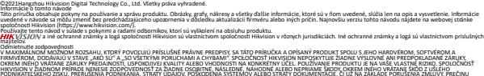

PODNIKATEĽSKÉHO ZISKU, PRERUŠENIA PODNIKANIA, STRATY ÚDAJOV, POŠKODENIA SYSTÉMOV ALEBO STRATY DOKUMENTÁCIE, ČI UŽ NA ZÁKLADE PORUŠENIA ZMLUVY, PREČINU (VRÁTANE NEDBALOSTI), ZODPOVEDNOSTI ZA PRODUKT ALEBO INAK V SÚVISLOSTI S POUŽÍVANÍM PRODUKTU, A TO ANI V PRÍPADE, AK BOLA SPOLOČNOSŤ HIKVISION UPOZORNENÁ NA MOŽNOSŤ TAKÝCHTO ŠKÔD. UZNÁVATE, ŽE POVAHA INTERNETU UMOŽŇUJE INHERENTNÉ BEZPEČNOSTNÉ RIZIKÁ A SPOLOČNOSŤ HIKVISION NENESIE ŽIADNU ZODPOVEDNOSŤ ZA NEŠTANDARDNÚ PREVÁDZKU, ÚNIK OSOBNÝCH ÚDAJOV ANI ZA INÉ ŠKODY V DÔSLEDKU KYBERNETICKÉHO ÚTOKU, HAKERSKÉHO ÚTOKU, VÍRUSOVEJ INFEKCIE ALEBO INÝCH BEZPEČNOSTNÝCH RIZÍK SIETE INTERNET; V PRÍPADE POTREBY VŠAK SPOLOČNOSŤ HIKVISION POSKYTNE VČASNÚ TECHNICKÚ PODPORU. SÚHLASÍTE S POUŽÍVANÍM TOHTO PRODUKTU V SÚLADE SO VŠETKÝMI PRÍSLUŠNÝMI ZÁKONMI A NESIETE VÝHRADNÚ ZODPOVEDNOSŤ ZA ZABEZPEČENIE, ABY VAŠE POUŽÍVANIE BOLO V SÚLADE S PRÍSLUŠNÝMI ZÁKONMI. STE OBZVLÁŠŤ ZODPOVEDNÍ ZA POUŽÍVANIE TOHTO PRODUKTU SPÔSOBOM, KTORÝ NEPORUŠUJE PRÁVA TRETÍCH STRÁN, OKREM INÉHO PRÁVA PUBLICITY, PRÁVA DUŠEVNÉHO VLASTNÍCTVA, PRÁVA NA OCHRANU ÚDAJOV A INÉ PRÁVA NA OCHRANU SÚKROMIA. TENTO PRODUKT NESMIETE POUŽÍVAŤ NA ŽIADNE ZAKÁZANÉ ÚČELY VRÁTANE VÝVOJA ALEBO VÝROBY ZBRANÍ HROMADNÉHO NIČENIA, VÝVOJA ALEBO VÝROBY CHEMICKÝCH ALEBO BIOLOGICKÝCH ZBRANÍ, AKÝCHKOĽVEK AKTIVÍT V SÚVISLOSTI S AKOUKOĽVEK JADROVOU VÝBUŠNINOU ALEBO NEBEZPEČNÝM CYKLOM JADROVÉHO PALIVA, ALEBO NA PODPORU ZNEUŽÍVANIA ĽUDSKÝCH PRÁV. V PRÍPADE AKÉHOKOĽVEK NESÚLADU MEDZI TOUTO PRÍRUČKOU A PRÍSLUŠNÝMI PRÁVNYMI PREDPISMI MAJÚ PREDNOSŤ PRÍSLUŠNÉ PRÁVNE PREDPISY.

Tento výrobok a dodané príslušenstvo, ak je to relevantné, sú takisto označené značkou "CE", takže sú v súlade s príslušnými harmonizovanými európskymi normami uvedenými v smernici o rádiových zariadeniach 2014/53/EÚ, smernici o elektromagne�ckej kompa�bilite 2014/30/EÚ a smernici o obmedzení používania určitých nebezpečných látok v elektrických a elektronických zariadeniach 2011/65/EÚ. 2012/19/EÚ (smernica o odpade z elektrických a elektronických zariadení): Produkty označené týmto symbolom sa v rámci Európskej únie nesmú likvidovať spolu s netriedeným komunálnym odpadom. Po zakúpení ekvivalentného nového zariadenia zrecyklujte produkt tým, že ho odovzdáte miestnemu dodávateľovi alebo ho zlikvidujete na určených zberných miestach. Ďalšie informácie nájdete na: www.recyclethis.info 2006/66/ES (smernica o batériách): Tento produkt obsahuje batériu, ktorá sa v rámci Európskej únie nesmie likvidovať spolu s netriedeným komunálnym odpadom. Konkrétne

informácie o batérii nájdete v dokumentácii produktu. Batéria je označená týmto symbolom, ktorý môže obsahovať písmená označujúce obsah kadmia (Cd), olova (Pb) alebo ortu� (Hg). Zrecyklujte batériu tým, že ju odovzdáte dodávateľovi alebo ju zlikvidujete na určenom zbernom mieste. Ďalšie informácie nájdete na: www.recyclethis.info Výstrahy: ●Akákoľvek prevádzka elektronických zariadení musí byť dôsledne v súlade s predpismi o elektrických zariadeniach, pro�požiarnymi predpismi a inými súvisiacimi predpismi vo vašom regióne. ●Nepripájajte viacero zariadení k jednému napájaciemu adaptéru. Mohlo byť dôjsť k preťaženiu adaptéra s rizikom prehria�a a vzniku požiaru. ●Pred pripájaním, inštaláciou alebo demontážou zariadenia sa uis�te, že je odpojené napájanie.

●Keď sa zariadenie inštaluje na stenu alebo strop, musí byť bezpečne upevnené. ●Ak zo zariadenia vychádza dym, zápach alebo hluk, ihneď vypnite napájanie a odpojte napájací kábel a potom sa obráťte na servisné stredisko. ●Ak produkt nepracuje správne, obráťte sa na predajcu alebo na najbližšie servisné stredisko. Nikdy sa nepokúšajte zariadenie sami rozoberať. (Nepreberáme žiadnu zodpovednosť za problémy spôsobené neoprávnenou opravou alebo údržbou.) Upozornenia ●Zabezpečte, aby zariadenie nespadlo ani nebolo vystavené fyzickým nárazom, a nevystavujete ho silnému elektromagne�ckému žiareniu. Zariadenie neinštalujte na

vibrujúcich povrchoch ani na miestach vystavených nárazom (v opačnom prípade môže dôjsť k poškodeniu zariadenia). ●Zariadenie neumiestňujte na miesta, ktoré sú mimoriadne horúce (podrobnos� o prevádzkovej teplote si pozrite v špecifikácii zariadenia), chladné, prašné alebo vlhké, a nevystavujete ho silnému elektromagne�ckému žiareniu. ●Kryt zariadenia na vnútorné použi�e chráňte pred dažďom a vlhkosťou. ●Je zakázané vystavovať zariadenie priamemu slnečnému žiareniu, prostrediu s nedostatočným vetraním alebo zdrojom tepla, ako je ohrievač alebo radiátor (v opačnom prípade môže vzniknúť riziko požiaru). ●Zariadením nemierte na slnko ani na veľmi jasné miesta. V opačnom prípade môže dôjsť k deformácii alebo vzniku škvŕn (nepredstavuje to však poruchu) a zároveň to môže ovplyvniť životnosť snímača. ●Pri čistení vnútorných a vonkajších povrchov krytu zariadenia používajte jemnú a suchú handričku a nepoužívajte alkalické čis�ace prostriedky. ●Po rozbalení si všetky obaly odložte na budúce použi�e. V prípade výskytu poruchy bude potrebné, aby ste zariadenie vrá�li do výrobcovi v pôvodnom obale. Pri preprave bez

pôvodného obalu môže dôjsť k poškodeniu zariadenia a vzniku dodatočných nákladov.

©2021Hangzhou Hikvision Digital Technology Co., Ltd. Hak cipta dilindungi undang-undang. Tentang Manual ini Manual ini berisi petunjuk untuk menggunakan dan mengelola produk. Foto, diagram, gambar, dan semua informasi lain di dalam dokumen ini hanya untuk gambaran dan penjelasan. Informasi yang ada di dalam Manual ini dapat berubah, tanpa pemberitahuan, akibat adanya pembaruan firmware atau sebab lain. Anda dapat menemukan versi terbaru Manual ini di situs web Hikvision (h�ps://www.hikvision.com/). Harap gunakan Manual ini dengan panduan dan bantuan tenaga profesional yang terla�h dalam mendukung Produk ini.

dan merek dagang serta logo Hikvision lainnya adalah milik Hikvision di berbagai wilayah hukum. Merek dagang dan logo lain yang disebutkan dalam dokumen ini adalah milik pemilik yang bersangkutan. Penafian SEPANJANG DIPERBOLEHKAN OLEH PERATURAN YANG BERLAKU, MANUAL INI DAN PRODUK YANG DIJELASKAN, BESERTA PERANGKAT KERAS, PERANGKAT LUNAK, DAN FIRMWARE, DISEDIAKAN "SEPERTI ADANYA" DAN "DENGAN SEMUA CACAT DAN KESALAHAN". HIKVISION TIDAK MEMBERIKAN JAMINAN TERSURAT ATAUPUN TERSIRAT, TERMASUK TIDAK TERBATAS PADA, JAMINAN KOMERSIAL, KUALITAS MEMUASKAN, ATAUPUN KECOCOKAN UNTUK TUJUAN TERTENTU. PENGGUNAAN PRODUK OLEH ANDA ADALAH ATAS RISIKO ANDA SENDIRI. DALAM SEGALA HAL, HIKVISION TIDAK BERTANGGUNG JAWAB KEPADA ANDA ATAS KERUSAKAN KHUSUS, IKUTAN, INSIDENTIL, ATAU TIDAK LANGSUNG, TERMASUK, ANTARA LAIN, KERUGIAN AKIBAT HILANGNYA LABA USAHA, TERGANGGUNYA USAHA, ATAU HILANGNYA DATA, KERUSAKAN SISTEM, ATAU HILANGNYA DOKUMEN, BAIK BERDASARKAN PELANGGARAN ATAS KONTRAK, TINDAKAN MELAWAN HUKUM (TERMASUK KELALAIAN), KEWAJIBAN PRODUK, ATAU LAINNYA, TERKAIT PENGGUNAAN PERANGKAT LUNAK, MESKIPUN HIKVISION SUDAH DIBERITAHU ADANYA POTENSI KERUSAKAN ATAU KERUGIAN SEMACAM ITU. ANDA MENGAKUI BAHWA SIFAT INTERNET MENGHADIRKAN RISIKO KEAMANAN TIDAK TERLIHAT, DAN HIKVISION TIDAK BERTANGGUNG JAWAB ATAS ABNORMALITAS PENGOPERASIAN, KEBOCORAN PRIVASI, ATAU KERUSAKAN LAIN AKIBAT SERANGAN SIBER, SERANGAN PERETAS, INFEKSI VIRUS, DAN RISIKO KEAMANAN INTERNET LAINNYA; AKAN TETAPI, KAMI AKAN MENYEDIAKAN DUKUNGAN TEKNIS SECARA BERKALA JIKA DIBUTUHKAN. ANDA SETUJU UNTUK MENGGUNAKAN PRODUK INI DENGAN MEMATUHI SEMUA PERATURAN YANG BERLAKU DAN ANDA SECARA PRIBADI BERTANGGUNG JAWAB MEMASTIKAN PENGGUNAAN OLEH ANDA MEMATUHI PERATURAN YANG BERLAKU. SECARA KHUSUS, ANDA BERTANGGUNG JAWAB MENGGUNAKAN PRODUK DENGAN CARA YANG TIDAK MELANGGAR HAK-HAK PIHAK KETIGA, TERMASUK TANPA BATASAN PADA, HAK PUBLISITAS, HAK KEKAYAAN INTELEKTUAL, ATAU PERLINDUNGAN DATA DAN HAK PRIVASI LAINNYA. ANDA DILARANG MENGGUNAKAN PRODUK UNTUK PENGGUNAAN AKHIR YANG DILARANG, TERMASUK PENGEMBANGAN ATAU PRODUKSI SENJATA PEMUSNAH MASSAL, PENGEMBANGAN ATAU PRODUKSI SENJATA KIMIA ATAU BIOLOGIS, AKTIVITAS YANG BERHUBUNGAN DENGAN BAHAN PELEDAK NUKLIR ATAU DAUR BAHAN BAKAR NUKLIR SECARA TIDAK AMAN ATAU UNTUK MENDUKUNG PELANGGARAN HAK ASASI MANUSIA.

JIKA TERJADI PERTENTANGAN ANTARA MANUAL INI DAN PERATURAN YANG BERLAKU, YANG DISEBUT TERAKHIR DIPRIORITASKAN. Produk ini - dan jika ada - aksesori yang disertakan bertanda "CE" dan oleh karena itu memenuhi standar kompa�bel Eropa yang disebutkan dalam RE Direc�ve 2014/53/EU, EMC Direc�ve 2014/30/EU, RoHS Direc�ve 2011/65/EU. 2012/19/EU (WEEE direc�ve): Produk yang bertanda simbol ini �dak boleh dibuang sebagai sampah umum yang �dak disor�r di wilayah Uni Eropa. Agar dapat didaur ulang sesuai ketentuan, kembalikan produk ini ke toko terdekat saat Anda membeli peralatan penggan� yang baru, atau buang pada ��k pengumpulan yang ditentukan. Untuk

informasi lebih lengkap, kunjungi: www.recyclethis.info 2006/66/EC (ketentuan baterai): Produk ini berisi baterai yang �dak boleh dibuang sebagai sampah umum yang �dak disor�r di wilayah Uni Eropa. Lihat dokumentasi produk untuk informasi spesifik tentang baterai. Baterai ini ditandai dengan simbol ini, yang mungkin disertai huruf untuk menandakan kadmium (Cd), �mbal (Pb), atau merkuri (Hg). Agar dapat didaur ulang sesuai ketentuan, kembalikan baterai ke toko atau ��k pengumpulan yang ditentukan. Untuk informasi lebih lengkap, kunjungi: www.recyclethis.info Peringatan

●Semua pengoperasian alat elektronik harus benar-benar mematuhi peraturan keselamatan listrik, peraturan pencegahan kebakaran, dan peraturan terkait lainnya di wilayah setempat Anda. ●Jangan hubungkan beberapa peralatan ke satu adaptor daya karena beban adaptor yang berlebih dapat menyebabkan panas berlebih atau bahaya kebakaran. ●Pas�kan daya telah terputus sebelum Anda menyambungkan kabel, memasang, atau membongkar peralatan. ●Peralatan harus dipasang kuat saat dipasang di dinding atau plafon. ●Jika muncul asap, bau, atau derau dari peralatan, segera ma�kan perangkat dan cabut kabel daya, lalu hubungi pusat servis.

●Jika produk �dak berfungsi dengan baik, hubungi dealer atau pusat servis terdekat. Jangan pernah mencoba membongkar sendiri peralatan. (Kami �dak bertanggung jawab atas masalah yang disebabkan oleh reparasi atau perawatan yang �dak resmi.) Perha�an ●Jangan sampai peralatan terjatuh atau terkena guncangan fisik, dan jangan paparkan peralatan terhadap radiasi elektromagne�k yang �nggi. Hindari pemasangan

peralatan di permukaan atau tempat bergetar atau yang rentan guncangan (kelalaian dapat menyebabkan kerusakan peralatan). ●Jangan letakkan peralatan di lokasi yang sangat panas (baca spesifikasi peralatan untuk suhu pengoperasian terperinci), dingin, berdebu, atau lembap, dan jangan paparkan peralatan terhadap radiasi eletromagne�k. ●Penutup peralatan untuk penggunaan dalam ruang harus dijauhkan dari hujan dan kelembapan. ●Dilarang memaparkan peralatan ke sinar matahari langsung, ven�lasi rendah, atau sumber panas seper� pemanas atau radiator (kelalaian dapat menyebabkan bahaya kebakaran). ●Jangan arahkan peralatan ke matahari atau tempat yang sangat terang. Blooming atau noda dapat terjadi (yang bukan merupakan malafungsi), dan sekaligus memengaruhi daya tahan sensor. ●Gunakan kain yang lembut dan kering saat membersihkan permukaan bagian dalam dan luar dari penutup peralatan, jangan gunakan detergen alkalin. ●Simpan semua pembungkus setelah pembukaan kemasan untuk penggunaan di masa mendatang. Jika terjadi kegagalan, Anda harus mengembalikan peralatan ke pabrik dengan pembungkus aslinya. Pengangkutan tanpa pembungkus asli dapat menyebabkan kerusakan pada peralatan dan dapat menimbulkan biaya tambahan.

©2021Hangzhou Hikvision Dijital Teknoloji Co, Ltd Tüm hakları saklıdır. Bu Kılavuz hakkında Kılavuz, Ürünün kullanımı ve yöne�mi ile ilgili talimatları içerir. Resimler, çizelgeler, görüntüler ve buradaki diğer tüm bilgiler, yalnızca tanımlama ve açıklama amaçlıdır. Kılavuzda bulunan bilgiler, yazılım güncellemeleri veya başka nedenlerden dolayı önceden haber verilmeksizin değiş�rilebilir. Bu Kılavuzun en son sürümünü Hikvision web sitesinde (h�ps://www.hikvision.com/) bulabilirsiniz. Lü�en bu Kılavuzu, Ürünü destekleme konusunda eği�lmiş profesyonellerin rehberliği ve yardımı ile kullanın. ve diğer Hikvision'un �cari markaları ve logoları Hikvision'un çeşitli yargı mercilerindeki mülkleridir. Bahsedilen diğer �cari markalar ve logolar ilgili sahiplerinin mülkiye�ndedir. Yasal Uyarı YÜRÜRLÜKTEKİ YASALARIN İZİN VERDİĞİ AZAMİ ÖLÇÜDE, BU KILAVUZ VE AÇIKLANAN ÜRÜN, DONANIMI, YAZILIMI VE ÜRÜN YAZILIMI İLE "OLDUĞU GİBİ" VE "TÜM ARIZALAR VE HATALAR

İLE " SAĞLANIR. HIKVISION, SINIRLANDIRMA, TİCARİ OLABİLİRLİK, MEMNUNİYET KALİTESİ VEYA BELİRLİ BİR AMACA UYGUN OLMAKSIZIN AÇIK VEYA ZIMNİ HİÇBİR GARANTİ VERMEZ. ÜRÜNÜN SİZİN TARAFINIZDAN KULLANIMI KENDİ SORUMLULUĞUNUZDADIR. HIKVISION HİÇBİR DURUMDA, BU ÜRÜNÜN KULLANIMI İLE BAĞLANTILI OLARAK, HIKVISION BU TÜR HASARLARIN OLASILIĞI HAKKINDA BİLGİLENDİRİLMİŞ OLSA BİLE, İŞ KARLARININ KAYBI, İŞ KESİNTİSİ, VERİ KAYBI, SİSTEM KESİNTİSİ, BELGE KAYBI, SÖZLEŞMENİN İHLALİ (İHMAL DAHİL), ÜRÜN SORUMLULUĞU GİBİ ZARARLAR DA DAHİL OLMAK ÜZERE, ÖZEL, SONUÇSAL, TESADÜFİ VEYA DOLAYLI ZARARLAR İÇİN SİZE KARŞI SORUMLU OLMAYACAKTIR. İNTERNETİN DOĞASININ DOĞAL GÜVENLİK RİSKLERİ BARINDIRDIĞINI KABUL EDİYORSUNUZ VE HIKVISION, SİBER SALDIRI, HACKER SALDIRISI, VİRÜS BULAŞMASI VEYA DİĞER İNTERNET GÜVENLİK RİSKLERİNDEN KAYNAKLANAN ANORMAL KULLANIM, GİZLİLİK SIZINTISI VEYA DİĞER ZARARLAR İÇİN HERHANGİ BİR SORUMLULUK KABUL ETMEZ; ANCAK, HIKVISION GEREKİRSE ZAMANINDA TEKNİK DESTEK SAĞLAYACAKTIR. BU ÜRÜNÜ GEÇERLİ TÜM YASALARA UYGUN OLARAK KULLANMAYI KABUL EDİYORSUNUZ VE KULLANIMINIZIN GEÇERLİ YASALARA UYGUN OLMASINI SAĞLAMAKTAN YALNIZCA SİZ SORUMLUSUNUZ. ÖZELLİKLE, BU ÜRÜNÜ, SINIRLAMA OLMAKSIZIN, TANITIM HAKLARI, FİKRİ MÜLKİYET HAKLARI VEYA VERİ KORUMA VE DİĞER GİZLİLİK HAKLARI DA DAHİL OLMAK

ÜZERE ÜÇÜNCÜ TARAFLARIN HAKLARINI İHLAL ETMEYECEK ŞEKİLDE KULLANMAKTAN SİZ SORUMLUSUNUZ. BU ÜRÜNÜ, KİTLE İMHA SİLAHLARININ GELİŞTİRİLMESİ VEYA ÜRETİMİ, KİMYASAL VEYA BİYOLOJİK SİLAHLARIN GELİŞTİRİLMESİ VEYA ÜRETİMİ, HERHANGİ BİR NÜKLEER PATLAYICI VEYA GÜVENLİ OLMAYAN NÜKLEER YAKIT DÖNGÜSÜ İLE İLGİLİ HERHANGİ BİR FAALİYETTE VEYA İNSAN HAKLARI İHLALLERİNİ DESTEKLEMEK DE DAHİL YASAKLANMIŞ SON KULLANIMLAR İÇİN KULLANAMAZSINIZ. BU KILAVUZ İLE İLGİLİ YASA ARASINDA HERHANGİ BİR ÇELİŞKİ OLMASI DURUMUNDA, YENİ OLAN GEÇERLİDİR. Bu ürün ve -varsa-birlikte verilen aksesuarlar "CE" ile işaretlenmiş�r ve bu nedenle RE Direk�fi 2014/53/EU, EMC Direk�fi 2014/30/EU, RoHS Direk�fi 2011/65/EU al�nda

listelenen geçerli uyumlaş�rılmış Avrupa standartlarına uygundur. 2012/19 / EU (WEEE direk�fi): Bu simgeyle işaretlenen ürünler, Avrupa Birliği'nde ayrış�rılmamış belediye a�ğı olarak yok edilemez. Doğru geri dönüşüm için, eşdeğer yeni ekipman sa�n aldıktan sonra bu ürünü yerel tedarikçinize iade edin veya belir�len toplama noktalarında imha edin. Daha fazla bilgi için bkz: www.recyclethis.info 2006/66/EC (pil direk�fi): Bu ürün, Avrupa Birliği'nde ayrış�rılmamış belediye a�ğı olarak imha edilemeyen bir pil içerir. Özel pil bilgileri için ürün belgelerine bakın. Pil, kadmiyum (Cd), kurşun (Pb) veya cıva (Hg) içerebildiğini belirtmek bu simgeyle işaretlenmiş�r. Doğru geri dönüşüm için pili tedarikçinize veya belirlenmiş bir toplama noktasına iade edin.

Daha fazla bilgi için bkz: www.recyclethis.info Uyarılar ●Tüm elektronik işlemler elektrik güvenliği düzenlemeleri, yangın önleme düzenlemeleri ve yerel bölgenizdeki diğer ilgili düzenlemelere tamamen uygun olmalıdır. ●Adaptörün aşırı yüklenmesi aşırı ısınma veya yangın tehlikesine neden olabileceği için tek bir güç adaptörüne birden fazla ekipman bağlamayın. ●Ekipmanı bağlamadan, kurmadan veya sökmeden önce lü�en güç bağlan�sının kesildiğinden emin olun. ●Ürün duvara veya tavana monte edildiğinde ekipman sıkıca sabitlenmelidir. ●Ekipmandan duman, koku veya gürültü geliyorsa derhal gücü kapa�p güç kablosunu çekin ve ardından lü�en servis merkeziyle ile�şime geçin. ●Ürün düzgün şekilde çalışmıyorsa lü�en sa�cınızla veya en yakın servis merkeziyle ile�şime geçin. Ekipmanı kendi başınıza sökmeye çalışmayın. (Yetkisiz onarım veya bakımdan

kaynaklanan sorunlar için herhangi bir sorumluluk kabul etmeyiz.) Dikkat ●Ekipmanı düşürmeyin veya fiziksel darbeye ve yüksek elektromanye�k radyasyona maruz bırakmayın. Ekipmanı, �treşimli yüzeylere veya darbelere açık yerlere takmaktan kaçının (aksi takdirde ekipmanda hasar oluşabilir).

●Ekipmanı aşırı sıcak (ayrın�lı çalış�rma sıcaklığı için ekipmanın teknik özelliklerine başvurun), soğuk, tozlu veya nemli yerlere yerleş�rmeyin ve ekipmanı yüksek elektromanye�k radyasyona maruz bırakmayın. ●İç mekanda kullanım için tasarlanmış ekipman kapağı yağmurdan ve nemden uzak tutulmalıdır. ●Ekipmanın doğrudan güneş ışığına, düşük havalandırma koşullarına ya da ısı�cı veya radyatör gibi ısı kaynaklarına maruz bırakılmasına izin verilmez (aksi takdirde yangın tehlikesi ortaya çıkabilir). ●Ekipmanı güneşe veya ekstra parlak yerlere doğrultmayın. Aksi takdirde ekranda parlama veya lekelenme meydana gelebilir (bu bir arıza değildir) ve aynı zamanda sensörün dayanıklılığı etkilenebilir. ●Ekipman kapağının iç ve dış yüzeylerini temizlerken yumuşak ve kuru bir bez kullanın, alkalin deterjanlar kullanmayın. ●Lü�en ambalajından çıkarılan tüm sargıları gelecekte kullanım için saklayın. Herhangi bir arıza meydana gelmesi durumunda ekipmanı orijinal sargısıyla birlikte fabrikaya iade etmeniz gerekir. Ekipmanın orijinal sargısı olmadan taşınması ekipmanda hasara yol açabilir ve ek maliyetlere neden olabilir.

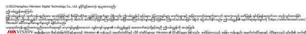

အမ်ဳိးမ်ဳိးေသာ စီရင္ဆံုးျဖတ္ပိုင္ခြင့္မ်ားတြင္Hikvision ၏ ကုန္သြယ္အမွတ္တံဆိပ္ႏွင့္လိုဂိုတံဆိပ္မ်ားမွာ Hikvision ၏ ပိုင္ဆိုင္မႈမ်ား ျဖစ္သည္။ ေဖာ္ျပထားသည့္အျခား ကုန္ပစၥည္း အမွတ္တံဆိပ္မ်ားႏွင့္လိုဂိုမ်ားသည္၎တို႔၏ သက္ဆိုင္ရာ

ပိုင္ရွင္မ်ား၏ ပိုင္ဆိုင္မႈမ်ား ျဖစ္ၾကပါသည္။

ÎN LIMITA LEGII APLICABILE, ACEST MANUAL ŞI PRODUSUL DESCRIS, ÎMPREUNĂ CU HARDWARE-UL, SOFTWARE-UL ŞI FIRMWARE-UL AFERENTE, SUNT OFERITE "AŞA CUM SUNT" ŞI "CU TOATE DEFEC IUNILE ŞI ERORILE". HIKVISION NU OFERA NICIO GARANTIE, NICI IN MOD EXPRES SI NICI IMPLICIT, IN CEEA CE PRIVESTE INCLUSIV, DAR FARA LIMITARE LA COMERCIABILITATEA, CALITATEA SATISFĂCĂTOARE, SAU UTILITATEA PENTRU UN ANUMIT SCOP. DVS. VEŢI UTILIZA ACEST PRODUS PE PROPRIUL DVS. RISC. ÎN NICIUN CAZ, HIKVISION NU VA FI RĂSPUNZĂTOARE FA Ă DE DVS. PENTRU ORICE DAUNE INDIRECTE, INCIDENTALE, SPECIALE, DAUNE PENTRU PIERDEREA PROFITULUI, INTRERUPEREA AFACERII SAU PIERDEREA DE DATE, DEFECTAREA SISTEMELOR SAU PIERDEREA DOCUMENTA IEI, PE BAZA ÎNCĂLCĂRII CONTRACTULUI, UNEI INFRAC IUNI (INCLUSIV NEGLIJEN Ă), RĂSPUNDEREA PENTRU PRODUSE SAU PRINTR-UN ALT MOD LEGAT DE UTILIZAREA PRODUSULUI, CHIAR DACĂ HIKVISION A FOST INFORMATĂ ÎN PREALABIL DESPRE POSIBILITATEA APARI IEI UNOR ASTFEL DE DAUNE SAU PIERDERI. SUNTEŢI DE ACORD CĂ INTERNETUL, PRIN NATURA SA, PRESUPUNE RISCURI INERENTE CU PRIVIRE LA SECURITATE, IAR HIKVISION NU ÎŞI ASUMĂ NICIO RESPONSABILITATE PENTRU OPERARE NESATISFACATOARE, ABATERI PRIVIND CONFIDENŢIALITATEA SAU ALTE DAUNE REZULTATE ÎN URMA UNUI ATAC CIBERNETIC, ATAC AL HACKERILOR, INFECŢII CU VIRUŞI SAU ALTOR RISCURI PRIVIND SECURITATEA PE INTERNET; CU TOATE ACESTEA, HIKVISION VA OFERI SUPORT TEHNIC ÎN TIMP UTIL, DACĂ ESTE NECESAR. SUNTEŢI I DE ACORD SĂ UTILIZA I ACEST PRODUS ÎN CONFORMITATE CU TOATE LEGILE APLICABILE, DEVENIND RESPONSABIL PENTRU UTILIZAREA ÎN CONFORMITATECU LEGEA APLICABILĂ. SUNTE I, DE ASEMENEA, RESPONSABIL PENTRU UTILIZAREA ACESTUI PRODUS FĂRĂ A ÎNCĂLCA DREPTURILE TER ILOR, INCLUSIV, DAR FĂRĂ A SE LIMITA LA DREPTURILE PUBLICITĂ II, DREPTURILE DE PROPRIETATE INTELECTUALĂ SAU DREPTUL LA PROTEC IA DATELOR ŞI ALTE DREPTURI PRIVATE. NU UTILIZA I ACEST PRODUS PENTRU UTILIZĂRI FINALE INTERZISE, INCLUSIV DEZVOLTAREA SAU PRODUC IA DE ARME DE DISTRUGERE ÎN MASĂ, DEZVOLTAREA SAU PRODUC IA DE ARME CHIMICE SAU BIOLOGICE, ACTIVITĂ I LEGATE DE ORICE EXPLOZIBIL NUCLEAR SAU CICLU DE COMBUSTIBIL NUCLEAR CARE AR PRODUCE LIPSĂ DE SIGURAN Ă SAU ÎN SPRIJINUL ABUZURILOR ASUPRA DREPTURILOR OMULUI. ÎN EVENTUALITATEA UNUI CONFLICT ÎNTRE ACEST MANUAL ŞI LEGISLA IA APLICABILĂ, VA AVEA PRIORITATE ULTIMA DINTRE ACESTEA. ENGLISH

ျငင္းဆိုခ်က္ အက်ဳံး ဝင္သည့္သက္ဆုိငေ္ သာဥပေဒက ခြငျ့္ပဳထားသည့္အျမငဆ့္ းုံအတုိငး္အတာျဖင့္ဤလက္စြဲစာအုပႏ္ ငွ ့္ေဖာျ္ပထားေသာ ထုတ္ကုန္ကို၎၏ စက္ပစညၥ း္မ်ား၊ ေဆာ့ဖ္ဝဲႏငွ ့္ဖမ္းဝဲမ်ားနွငအ့္ တူ"ယင္းအတုိငး္" ႏငွ ့္"အမွားအယြငး္မ်ားအားလးုံႏငွ အ့္ တူ" ေဖာျ္ပထားသည္။ HIKVISION သည္ကန႔္သတ္မႈ၊ ကုန္သြယႏ္ငုိ ္စြမး္၊ ေက်နပ္ေလာက္ဖြယ္အရည္အေသြး၊ သမ႔ို ဟုတ္သီးျခားရည္ရြယ္ခ်က္တစ္စတုံ စ္ခုအတြက္ၾကခံ့ ငို ္မႈမ်ား မရိွျခင္း အပါအဝင္မည္သည့္အာမခံခ်က္မ်ားကိုအတိအလင္းျဖစ္ေစ သြယ္ဝုိက၍္ ျဖစ္ေစ ေပးထားျခင္း မရိွပါ။ ကုန္ပစညၥ း္အား အသးုံျပဳပါက သငဘ့္ ာသာသင္တာဝန္ယူရမည္။ မည္သညအ့္ ေျခအေနတြင္မဆိုစာခ်ဳပ္ခ်ိဳးေဖာက္မႈေၾကာငျ့္ဖစ္ေစ၊ အက်ိဳးပ်က္စီး၍ျဖစ္ေစ (ေပါ့ေလ်ာ့မႈအပါအဝင္)၊ ထုတ္ကုန္ပစညၥ း္ ျပႆနာေၾကာငျ့္ဖစ္ေစ၊ သမ႔ို ဟုတ္ပါက ဤထုတ္ကုန္ပစညၥ း္အား အသုံးျပဳမႈေၾကာငျ့္ဖစ္ေစ စီးပြားေရးလုပ္ငန္း အက်ိဳးအျမတ္ဆုံးရးံႈမႈသမ႔ို ဟုတ္အခ်က္အလက္ဆုံးရးံႈမႈ၊ စနစ္မ်ား ယုိယငြ း္ပ်က္စီးမႈသမ႔ို ဟုတ္စာ႐ြက္စာတမ္း ပ်က္စီးေပ်ာက္ဆုံးမႈေၾကာင့္ထိခကို ္မႈမ်ား အပါအဝင္အထူးတလည္၊ အက်ိဳးဆက္စပ္၍၊ မေတာတ္ ဆ သမ႔ို ဟုတ္ တုိက႐္ကို ္ထိခကို ္မႈမ်ားအတြက္ထုိထခိကို ္မႈသမ႔ို ဟုတ္ဆုံးရးံႈမႈမ်ားအေၾကာင္း HIKVISION အား အႀကံပျ ဳ အသိေပးၿပီး ျဖစ္ေစကာမူHIKVISION မွတာဝန္ယူမည္မဟုတ္ပါ။ အင္တာနက္သေဘာသဘာဝအရ တည္ရွိဆဲ လံုၿခံဳေရး ေဘးအႏၱရာယ္မ်ား ေပးႏိုင္သည္ကိုသင္အသိအမွတ္ျပဳၿပီး ပံုမွန္မဟုတ္ေသာ လုပ္ငန္းလည္ပတ္မႈ၊ ပုဂၢိဳလ္ေရးဆိုင္ရာ အခ်က္အလက္ေပါက္ၾကားမႈသို႔မဟုတ္ဆိုင္ဘာ တိုက္ခိုက္မႈမ်ား၊ ဟက္ကာ တိုက္ခိုက္မႈမ်ား၊ ဗိုင္းရပ္စ္ကူးစက္မႈသို႔မဟုတ္အျခား အင္တာနက္လံုၿခံဳေရး အႏၱရာယ္မ်ား၏ ရလဒ္အျဖစ္ျဖစ္ေပၚလာေသာ အျခားပ်က္စီးမႈမ်ား၊ အေပၚ HIKVISION သည္တာဝန္ယူလိမ့္မည္မဟုတ္ပါ။ သို႔ရာတြင္HIKVISION သည္လိုအပ္ပါက နည္းပညာပံ့ပိုးမႈကိုအခ်ိန္ႏွင့္ တစ္ေျပးညီေပးသြားမည္။ သင္သည္အက်ံဳးဝင္ေသာ ဥပေဒမ်ားနွင့္အညီဤကုန္ပစၥည္းကိုအသံုးျပဳရန္သေဘာတူညီၿပီး သင္၏ အသံုးျပဳမႈသည္အက်ံဳးဝင္ေသာ ဥပေဒႏွင့္ကိုက္ညီေစရန္သင္က လံုးဝ တာဝန္ခံရမည္ျဖစ္သည္။ အထူးသျဖင့္သင္သည္ဤကုန္ပစၥည္းကိုအသံုးျပဳရာတြင္ အမ်ားျပည္သူ၏ အခြင့္အေရးမ်ား၊ အသိပညာ ပိုင္ဆိုင္မႈအခြင့္အေရးမ်ား သို႔မဟုတ္အခ်က္အလက္ကာကြယ္ေရး နွင့္အျခား ပုဂၢိဳလ္ေရး ဆိုင္ရာ အခ်က္အလက္လံုၿခံဳမႈအခြင့္အေရးမ်ား အပါအဝင္ျဖစ္ေသာ္လည္း ယင္းတို႔သာ အကန္႔အသတ္မဟုတ္ပဲ အျပင္အပ လူပုဂၢိဳလ္မ်ား၏ အခြင့္အေရးမ်ားကိုခ်ဳိးေဖာက္ေသာ ပံုစံျဖင့္အသံုးျပဳျခင္း မျပဳရန္သင့္တြင္တာဝန္ရွိသည္။ လူအစုအၿပံဳလိုက္ေသေၾကပ်က္စီးေစႏိုင္ေသာ လက္နက္မ်ား တီထြင္ဖန္တီးျခင္း သို႔မဟုတ္ထုတ္လုပ္ျခင္း၊ ဓါတုသို႔မဟုတ္ဇီဝ လက္နက္မ်ား တီထြင္ဖန္တီးျခင္း သို႔မဟုတ္ထုတ္လုပ္ျခင္း၊ မည္သည့္ေပါက္ကြဲေစတတ္ေသာ ႏ်ဴးကလီးယား လက္နက္သို႔မဟုတ္ေဘးကင္းလံုၿခံဳမႈမရွိေသာ ႏ်ဴကလီးယား ေလာင္စာ သံသရာတို႔ႏွင့္သက္ဆိုင္ေသာ အေျခအေနတြင္သို႔မဟုတ္လူ႔အခြင့္အေရး ခ်ဳိးေဖာက္မႈကိုပံ့ပိုးေသာ လုပ္ေဆာင္မႈ တစ္စံုတရာ တို႔အပါအဝင္မည္သည့္အဆံုးသတ္အသံုးျပဳမႈအတြက္ကိုမဆိုသင္သည္ဤကုန္ပစၥည္းကိုအသံုးျပဳျခင္း မျပဳရပါ။

ဤလမ္းၫႊန္ႏွင့္သက္ဆိုင္ရာ ဥပေဒတို႔အၾကား ကြဲလြဲမႈမ်ား ရွိခဲ့ပါက ဥပေဒပါ ျပဌာန္းခ်က္ကိုသာ အတည္ယူရမည္။ ဤထုတ္ကုန္ပစၥည္းႏွင့္ - သက္ဆိုင္ပါက- ေပးထားေသာ အပိုပစၥည္းမ်ားသည္လည္း "CE" အမွတ္အသား မွတ္သားထားေသာေၾကာင့္RE ညႊန္ၾကားခ်က္2014/53/EU၊ EMC ညႊန္ၾကားခ်က္2014/30/EU၊ RoHC ညႊန္ၾကားခ်က္2011/65/EU တို႔ေအာက္တြင္ ေဖာ္ျပထားေသာ သက္ဆိုင္ရာ ဟန္ခ်က္ညီဥေရာပ စံခ်ိန္စံညႊန္းမ်ားကိုလိုက္နာရမည္။ 2012/19/EU (WEEE ညႊန္ၾကားခ်က္)- ဤသေကၤတ ကပ္ထားသည့္ထုတ္ကုန္မ်ားကိုဥေရာပသမဂၢအတြင္း ေရာေႏွာစည္ပင္အမႈိက္အေနျဖင့္စြန႔္ပစ္ႏိုင္ျခင္း မရွိပါ။ ေသခ်ာစြာ ရီဆိုင္ကယ္လုပ္ရန္အတြက္ဤထုတ္ကုန္ပစၥည္းကိုအလားတူပစၥည္းအသစ္တစ္ခု

ဝယ္ယူခ်ိန္တြင္သင့္နယ္ခံပစၥည္းေရာင္းခ်သူထံျပန္ေပးပါ သို႔မဟုတ္သတ္မွတ္ထားသည့္ပစၥည္းစုေဆာင္းေသာ ေနရာမ်ား၌ စြန႔္ပစ္ပါ။ ပိုမိုသိရွိလိုပါက www.recyclethis.info တြင္ၾကည့္ပါ။

2006/66/EC (ဘက္ထရီဆိုင္ရာ ညႊန္ၾကားခ်က္)- ဤထုတ္ကုန္ပစၥည္းတြင္ဥေရာပသမဂၢအတြင္း ေရာေႏွာစည္ပင္အမႈိက္အေနျဖင့္စြန႔္ပစ္ႏိုင္ျခင္း မရွိသည့္ဘက္ထရီတစ္လုံး ပါဝင္ေနပါသည္။ ဘက္ထရီအတြက္သီးသန႔္အခ်က္အလက္မ်ားကို ထုတ္ကုန္ပစၥည္းပါ စာ႐ြက္စာတမ္းမ်ား၌ ၾကည့္ပါ။ ဤဘက္ထရီကိုကတ္ဒမီယမ္(Cd)၊ ခဲ (Pb) သို႔မဟုတ္ျပဒါး (Hg) ဟုၫႊန္ျပမည့္စြန္႔ပစ္ျခင္းပါဝင္ႏိုင္ေၾကာင္း ဤသေကၤတျဖင့္မွတ္သားထားပါသည္။ ေသခ်ာစြာ ရီဆိုင္ကယ္လုပ္ရန္အတြက္ဤဘက္ထရီကို သင့္နယ္ခံပစၥည္းေရာင္းခ်သူထံျပန္ေပးပါ သို႔မဟုတ္သတ္မွတ္ထားသည့္စုေဆာင္းေသာ ေနရာ၌ စြန႔္ပစ္ပါ။ ပိုမိုသိရွိလိုပါက www.recyclethis.info တြင္ၾကည့္ပါ။ သတိေပးခ်က္မ်ား

●အီလက္ထေရာနစ္လည္ပတ္အသုံးျပဳပုံအားလုံးသည္သင့္ေဒသတြင္းမွလွ်ပ္စစ္ပစၥည္းဆိုင္ရာေဘးကင္းလုံၿခဳံေရး စည္းမ်ဥ္းမ်ား၊မီးေဘးကာကြယ္ေရး စည္းကမ္းခ်က္မ်ားႏွင့္အျခားဆက္ႏြယ္ရာစည္းကမ္းခ်က္မ်ားႏွင့္အလုံးစုံကိုက္ညီရမည္။ ●ပါဝါအဒပ္ပတာ တစ္ခုတည္းတြင္ကိရိယာအမ်ားအျပား ထိုးထားပါကဝန္ပိုလြန္ကဲၿပီး အပူလြန္ျခင္းသို႔မဟုတ္မီးေလာင္ျခင္းမ်ား ျဖစ္ႏိုင္သည့္အတြက္ထိုသို႔ထိုးခ်ိတ္ျခင္းမျပဳပါႏွင့္။ ●ကိရိယာအား ဝါယာခ်ိတ္ဆက္ျခင္း၊တပ္ဆင္ျခင္း သို႔မဟုတ္ျဖဳတ္ျခင္းမ်ားမလုပ္မီပါဝါေသခ်ာျဖဳတ္ထားပါ။

●ကိရိယာကိုနံရံသို႔မဟုတ္မ်က္ႏွာက်က္တြင္တပ္ဆင္ထားပါကေသခ်ာခိုင္ၿမဲစြာ တပ္ဆင္ေပးရန္လိုအပ္ပါသည္။ ●ကိရိယာမွမီးခိုး၊ ေညႇာ္န/ံ႔ အျခားအနံ႔သို႔မဟုတ္ဆူညံသံမ်ားထြက္လာပါက ပါဝါခ်က္ခ်င္းပိတ္ၿပီး ပါဝါႀကိဳးကို ျဖဳတ္လိုက္ပါ၊ထို႔ေနာက္တြင္ႀကံ့ခိုင္မႈစစ္ေဆးေရးစင္တာသို႔ဆက္သြယ္ပါ။ ●ကိရိယာ ေသခ်ာအလုပ္မလုပ္ပါကအေရာင္းဆိုင္သို႔မဟုတ္အနီးဆုံး ႀကံ့ခိုင္မႈစစ္ေဆးေရး စင္တာသို႔ဆက္သြယ္ပါ။အစိတ္အပိုင္းမ်ားကိုသင္ကိုယ္တိုင္တပ္ဆင္ရန္ဘယ္ေသာအခါမွ်မႀကိဳးပမ္းပါႏွင့္။ (ခြင့္ျပဳခ်က္မရွိဘဲ ျပင္ဆင္ျခင္းသို႔မဟုတ္ ထိန္းသိမ္းျပင္ဆင္ျခင္းေၾကာင့္ျဖစ္ပြါးရသည့္မည္သည့္ျပႆနာအတြက္မဆိုလုံးဝတာဝန္ယူမည္မဟုတ္ပါ။)

သတိျပဳရန္ ●ကိရိယာကိုေအာက္လႊတ္ခ်ျခင္း သို႔မဟုတ္ထိခိုက္တုန္ခါေစျခင္း မလုပ္ပါႏွင့္၊ ၎ကိုအားေကာင္းေသာ လွ်ပ္စစ္သံလိုက္လႈိင္းမ်ားႏွင့္ထိေတြ႕မႈလုံးဝမရွိပါေစႏွင့္။ ကိရိယာအား တုန္ခါေနသည့္မ်က္ႏွာျပင္မ်ား သို႔မဟုတ္ထိခိုက္တုန္ခါမႈျဖစ္ႏိုင္ေသာ ေနရာမ်ားတြင္တပ္ဆင္ျခင္း မျပဳပါႏွင့္(လစ္လ်ဴရႈခဲ့ပါ ကိရိယာ ပ်က္စီးႏိုင္ပါသည)္ ။ ●ကိရိယာကိုအလြန္ပူေသာ (အသုံးျပဳရန္အပူခ်ိန္အေသးစိတ္ႏွင့္ပတ္သက္ၿပီး ကိရိယာဆိုင္ရာ အေသးစိတ္အခ်က္မ်ားတြင္ၾကည့္ရႈပါ)၊ အလြန္ေအးေသာ၊ ဖုန္ထူေသာ သို႔မဟုတ္စိုထိုင္းေသာ ေနရာမ်ားတြင္မထားပါႏွင့္။ ၎ကို လွ်ပ္စစ္သံလိုက္လႈိင္းျဖာထြက္မႈျမင့္မားသည့္ေနရာမ်ားတြင္မထားပါႏွင့္။ ●အခန္းတြင္း အသုံးျပဳမည့္ကိရိယာအဖုံးကိုမိုးေရႏွင့္ေရေငြ႕မ်ားမွေဝးရာတြင္ထားပါ။ ●ကိရိယာအား ေနေရာင္တိုက္႐ိုက္တြင္ထားျခင္း၊ ေလဝင္ေလထြက္နည္းေသာ ေနရာ သို႔မဟုတ္အပူေပးစက္၊ ေရဒီေယတာတို႔ကဲ့သို႔ေသာ အပူရင္းျမစ္မ်ား အနီးတြင္ထားျခင္းမ်ားကိုလုံးဝေရွာင္ရွားပါ (မလိုက္နာပါက မီးေဘးအႏၲရာယ္ျဖစ္ႏိုင္သည)္ ။ ●ကိရိယာကိုေနသို႔ျဖစ္ေစ၊ အလြန္ေတာက္ပေသာ ေနရာမ်ားသို႔ျဖစ္ေစ မခ်ိန္႐ြယ္ပါႏွင့္။ ထိုသို႔ခ်ိန္႐ြယ္မိပါက အလင္းကြက္သို႔မဟုတ္အေရာင္ပ်က္မႈမ်ား ျဖစ္ႏိုင္ၿပီး (၎သည္စက္ခ်ိဳ႕ယြင္းမႈမဟုတ္ပါ) တစ္ခ်ိန္တည္းမွာပင္အာ႐ုံခံဆင္ဆာ၏ သက္တမ္းကို ထိခိုက္ႏိုင္ပါသည္။ ●ပစၥည္းအဖံုး၏ မ်က္ႏွာျပင္အတြင္းႏွင့္အျပင္တုိ႔ကိုသန္႔ရွင္းေရးလုပ္ေသာအခါ ႏူးညံ့၍ ေျခာက္ေသြ႕ေသာ အဝတ္ကိုအသံုးျပဳၿပီး အယ္လ္ကာလိုင္းပါဝင္ေသာ ဆပ္ျပာရည္ကိုအသံုးမျပဳပါႏွင့္။

●အထုတ္အပိုးမ်ားကိုအထုတ္ေျဖၿပီးေနာက္တြင္ေနာင္တြင္သုံးႏိုင္ရန္ဆက္သိမ္းထားပါ။ ပ်က္စီးယိုယြင္းမႈရွိခဲ့ပါက ကိရိယာကိုမူရင္းအထုတ္အပိုးျဖင့္စက္႐ုံသို႔ျပန္ပို႔ရန္လိုအပ္ပါသည္။ မူရင္းအထုတ္မပိုး မပါဘဲ သယ္ယူပို႔ေဆာင္ခဲ့ပါက ကိရိယာ

ပ်က္စီးႏိုင္ၿပီး ထပ္တိုးကုန္က်စားရိတ္မ်ား ရွိလာႏိုင္ပါသည္။

#### About this Manual The Manual includes instruc�ons for using and managing the Product. Pictures, charts, images and all other informa�on hereina�er are for descrip�on and explana�on only. The informa�on contained in the Manual is subject to change, without no�ce, due to firmware updates or other reasons. Please find the latest version of this Manual at the Hikvision

website (h�ps://www.hikvision.com/). Please use this Manual with the guidance and assistance of professionals trained in suppor�ng the Product. and other Hikvision's trademarks and logos are the proper�es of Hikvision in various jurisdic�ons. Other trademarks and logos men�oned are the proper�es of their respec�ve owners. Disclaimer TO THE MAXIMUM EXTENT PERMITTED BY APPLICABLE LAW, THIS MANUAL AND THE PRODUCT DESCRIBED, WITH ITS HARDWARE, SOFTWARE AND FIRMWARE, ARE PROVIDED "AS IS" AND "WITH ALL FAULTS AND ERRORS". HIKVISION MAKES NO WARRANTIES, EXPRESS OR IMPLIED, INCLUDING WITHOUT LIMITATION, MERCHANTABILITY, SATISFACTORY

QUALITY, OR FITNESS FOR A PARTICULAR PURPOSE. THE USE OF THE PRODUCT BY YOU IS AT YOUR OWN RISK. IN NO EVENT WILL HIKVISION BE LIABLE TO YOU FOR ANY SPECIAL, CONSEQUENTIAL, INCIDENTAL, OR INDIRECT DAMAGES, INCLUDING, AMONG OTHERS, DAMAGES FOR LOSS OF BUSINESS PROFITS, BUSINESS INTERRUPTION, OR LOSS OF DATA, CORRUPTION OF SYSTEMS, OR LOSS OF DOCUMENTATION, WHETHER BASED ON BREACH OF CONTRACT, TORT (INCLUDING NEGLIGENCE), PRODUCT LIABILITY, OR OTHERWISE, IN CONNECTION WITH THE USE OF THE PRODUCT, EVEN IF HIKVISION HAS BEEN ADVISED OF THE POSSIBILITY OF SUCH DAMAGES OR LOSS. YOU ACKNOWLEDGE THAT THE NATURE OF THE INTERNET PROVIDES FOR INHERENT SECURITY RISKS, AND HIKVISION SHALL NOT TAKE ANY RESPONSIBILITIES FOR ABNORMAL OPERATION, PRIVACY LEAKAGE OR OTHER DAMAGES RESULTING FROM CYBER-ATTACK, HACKER ATTACK, VIRUS INFECTION, OR OTHER INTERNET SECURITY RISKS; HOWEVER, HIKVISION WILL PROVIDE TIMELY TECHNICAL SUPPORT IF REQUIRED. YOU AGREE TO USE THIS PRODUCT IN COMPLIANCE WITH ALL APPLICABLE LAWS, AND YOU ARE SOLELY RESPONSIBLE FOR ENSURING THAT YOUR USE CONFORMS TO THE APPLICABLE LAW. ESPECIALLY, YOU ARE RESPONSIBLE, FOR USING THIS PRODUCT IN A MANNER THAT DOES NOT INFRINGE ON THE RIGHTS OF THIRD PARTIES, INCLUDING WITHOUT LIMITATION, RIGHTS OF PUBLICITY, INTELLECTUAL PROPERTY RIGHTS, OR DATA PROTECTION AND OTHER PRIVACY RIGHTS. YOU SHALL NOT USE THIS PRODUCT FOR ANY PROHIBITED END-USES, INCLUDING THE DEVELOPMENT OR PRODUCTION OF WEAPONS OF MASS DESTRUCTION, THE DEVELOPMENT OR PRODUCTION OF CHEMICAL OR BIOLOGICAL WEAPONS, ANY ACTIVITIES IN THE CONTEXT RELATED TO ANY NUCLEAR EXPLOSIVE OR UNSAFE NUCLEAR FUEL-CYCLE, OR IN SUPPORT OF HUMAN RIGHTS ABUSES. IN THE EVENT OF ANY CONFLICTS BETWEEN THIS MANUAL AND THE APPLICABLE LAW, THE LATER PREVAILS.

This product and - if applicable - the supplied accessories too are marked with "CE" and comply therefore with the applicable harmonized European standards listed under the RE Direc�ve 2014/53/EU, the EMC Direc�ve 2014/30/EU, the RoHS Direc�ve 2011/65/EU. 2012/19/EU (WEEE direc�ve): Products marked with this symbol cannot be disposed of as unsorted municipal waste in the European Union. For proper recycling, return this product to your local supplier upon the purchase of equivalent new equipment, or dispose of it at designated collec�on points. For more informa�on see: www.recyclethis.info 2006/66/EC (ba�ery direc�ve): This product contains a ba�ery that cannot be disposed of as unsorted municipal waste in the European Union. See the product documenta�on for specific ba�ery informa�on. The ba�ery is marked with this symbol, which may include le�ering to indicate cadmium (Cd), lead (Pb), or mercury (Hg). For proper recycling, return the ba�ery to your supplier or to a designated collec�on point. For more informa�on see:www.recyclethis.info

WARNING ●All the electronic opera�on should be strictly compliance with the electrical safety regula�ons, fire preven�on regula�ons and other related regula�ons in your local region. ●Do not connect several devices to one power adapter as adapter overload may cause over-heat or fire hazard. ●Please make sure that the power has been disconnected before you wire, install or dismantle the device.

●When the product is installed on wall or ceiling, the device shall be firmly fixed. ●If smoke, odors or noise rise from the device, turn off the power at once and unplug the power cable, and then please contact the service center. ●If the product does not work properly, please contact your dealer or the nearest service center. Never a�empt to disassemble the device yourself. (We shall not assume any responsibility for problems caused by unauthorized repair or maintenance.) CAUTION ●Do not drop the device or subject it to physical shock, and do not expose it to high electromagne�sm radia�on. Avoid the equipment installa�on on vibra�ons surface or places

subject to shock (ignorance can cause equipment damage). ●Do not place the device in extremely hot (refer to the specifica�on of the device for the detailed opera�ng temperature), cold, dusty or damp loca�ons, and do not expose it to high electromagne�c radia�on. ●The device cover for indoor use shall be kept from rain and moisture. ●Exposing the equipment to direct low ven�la�on or heat source such as heater or radiator is forbidden (ignorance can cause fire danger). ●Do not aim the device at the sun or extra bright places. A blooming or smear may occur otherwise (which is not a malfunc�on however), and affec�ng the endurance of sensor at the same �me.

●Please use a so� and dry cloth when clean inside and outside surfaces of the device cover, do not use alkaline detergents. Please keep all wrappers a�er unpack them for future use. In case of any failure occurred, you need to return the device to the factory with the original wrapper. Transporta�on without the original wrapper may result in damage on the device and lead to addi�onal costs.

©2021Hangzhou Hikvision Digital Technology Co., Ltd. Все права защищены. О данном руководстве

В Руководстве содержатся инструкции по эксплуатации Изделия. Фотографии, схемы, иллюстрации и прочие материалы приведены исключительно в качестве описаний и пояснений. Информация, приведенная в Руководстве, может быть изменена без предварительного уведомления в связи с обновлением микропрограммы или по другим причинам. Используйте последнюю редакцию Руководства. Ее можно найти на веб-сайте компании Hikvision (h�ps://www.hikvision.com/). Используйте Руководство под наблюдением специалистов, обученных обслуживанию Изделия.

и другие товарные знаки и логотипы компании Hikvision являются собственностью компании Hikvision в различных юрисдикциях. Другие товарные знаки и логотипы, упоминаемые в Руководстве, являются собственностью соответствующих владельцев. Ограничение ответственности В МАКСИМАЛЬНОЙ СТЕПЕНИ, РАЗРЕШЕННОЙ ДЕЙСТВУЮЩИМ ЗАКОНОДАТЕЛЬСТВОМ, ДАННОЕ РУКОВОДСТВО И ОПИСАНИЕ ИЗДЕЛИЯ, ВМЕСТЕ С АППАРАТНОЙ ЧАСТЬЮ, ПРОГРАММНЫМ ОБЕСПЕЧЕНИЕМ И ВСТРОЕННОЙ МИКРОПРОГРАММОЙ ПРЕДОСТАВЛЯЕТСЯ «КАК ЕСТЬ» И «СО ВСЕМИ НЕПОЛАДКАМИ И ОШИБКАМИ». HIKVISION НЕ ДАЕТ НИКАКИХ ЯВНЫХ ИЛИ ПОДРАЗУМЕВАЕМЫХ ГАРАНТИЙ, В ТОМ ЧИСЛЕ, БЕЗ ОГРАНИЧЕНИЙ, ГАРАНТИЙ ТОВАРНОЙ ПРИГОДНОСТИ, УДОВЛЕТВОРИТЕЛЬНОГО КАЧЕСТВА ИЛИ ПРИГОДНОСТИ ДЛЯ КОНКРЕТНЫХ ЦЕЛЕЙ. ПОТРЕБИТЕЛЬ ИСПОЛЬЗУЕТ ИЗДЕЛИЕ НА СВОЙ СТРАХ И РИСК. НИ ПРИ КАКИХ ОБСТОЯТЕЛЬСТВАХ КОМПАНИЯ HIKVISION НЕ НЕСЕТ ОТВЕТСТВЕННОСТИ ПЕРЕД ПОТРЕБИТЕЛЕМ ЗА КАКОЙ-ЛИБО СЛУЧАЙНЫЙ ИЛИ КОСВЕННЫЙ УЩЕРБ, ВКЛЮЧАЯ, СРЕДИ ПРОЧЕГО, УБЫТКИ ИЗ-ЗА ПОТЕРИ ПРИБЫЛИ, ПЕРЕРЫВОВ В ДЕЯТЕЛЬНОСТИ, ПОТЕРИ ДАННЫХ ИЛИ ДОКУМЕНТАЦИИ, ПОВРЕЖДЕНИЯ СИСТЕМ, БУДЬ ТО ПО ПРИЧИНЕ НАРУШЕНИЯ ДОГОВОРА, ПРОТИВОПРАВНЫХ ДЕЙСТВИЙ (В ТОМ ЧИСЛЕ ХАЛАТНОСТИ), УЩЕРБА ВСЛЕДСТВИЕ ИСПОЛЬЗОВАНИЯ ИЗДЕЛИЯ ИЛИ ИНОГО В СВЯЗИ С ИСПОЛЬЗОВАНИЕМ ДАННОГО ИЗДЕЛИЯ, ДАЖЕ ЕСЛИ КОМПАНИИ HIKVISION БЫЛО

ИЗВЕСТНО О ВОЗМОЖНОСТИ ТАКОГО УЩЕРБА. ПОТРЕБИТЕЛЬ ОСОЗНАЕТ, ЧТО ИНТЕРНЕТ ПО СВОЕЙ ПРИРОДЕ ЯВЛЯЕТСЯ ИСТОЧНИКОМ ПОВЫШЕННОГО РИСКА БЕЗОПАСНОСТИ И КОМПАНИЯ HIKVISION НЕ НЕСЕТ ОТВЕТСТВЕННОСТИ ЗА СБОИ В РАБОТЕ ОБОРУДОВАНИЯ, УТЕЧКУ ИНФОРМАЦИИ И ДРУГОЙ УЩЕРБ, ВЫЗВАННЫЙ КИБЕРАТАКАМИ, ХАКЕРАМИ, ВИРУСАМИ ИЛИ СЕТЕВЫМИ УГРОЗАМИ; ОДНАКО НАША КОМПАНИЯ ОБЕСПЕЧИВАЕТ СВОЕВРЕМЕННУЮ ТЕХНИЧЕСКУЮ ПОДДЕРЖКУ, ЕСЛИ ЭТО НЕОБХОДИМО. ПОТРЕБИТЕЛЬ СОГЛАШАЕТСЯ ИСПОЛЬЗОВАТЬ ДАННОЕ ИЗДЕЛИЕ В СООТВЕТСТВИИ СО ВСЕМИ ПРИМЕНИМЫМИ ЗАКОНАМИ И НЕСЕТ ЛИЧНУЮ ОТВЕТСТВЕННОСТЬ ЗА СОБЛЮДЕНИЕ ВСЕХ ПРИМЕНИМЫХ ЗАКОНОВ. В ЧАСТНОСТИ, ПОТРЕБИТЕЛЬ НЕСЕТ ОТВЕТСТВЕННОСТЬ ЗА ИСПОЛЬЗОВАНИЕ ЭТОГО ИЗДЕЛИЯ ТАКИМ СПОСОБОМ, КОТОРЫЙ НЕ НАРУШАЕТ ПРАВА ТРЕТЬИХ ЛИЦ, В ТОМ ЧИСЛЕ, БЕЗ ОГРАНИЧЕНИЙ, ПРАВА ПУБЛИЧНОСТИ, ИНТЕЛЛЕКТУАЛЬНОЙ СОБСТВЕННОСТИ И ЗАЩИТЫ ДАННЫХ. ПОТРЕБИТЕЛЬ ОБЯЗУЕТСЯ НЕ ИСПОЛЬЗОВАТЬ ЭТО ИЗДЕЛИЕ В ЗАПРЕЩЕННЫХ ЦЕЛЯХ, В ТОМ ЧИСЛЕ ДЛЯ РАЗРАБОТКИ ИЛИ ПРОИЗВОДСТВА ОРУЖИЯ МАССОВОГО УНИЧТОЖЕНИЯ, ХИМИЧЕСКОГО ИЛИ БИОЛОГИЧЕСКОГО ОРУЖИЯ, ОСУЩЕСТВЛЕНИЯ КАКОЙ-ЛИБО ДЕЯТЕЛЬНОСТИ В КОНТЕКСТЕ ЯДЕРНОГО ОРУЖИЯ, НЕБЕЗОПАСНЫХ ОПЕРАЦИЙ С ЯДЕРНЫМ ТОПЛИВОМ ИЛИ ДЛЯ ПОДДЕРЖКИ НАРУШЕНИЙ ПРАВ ЧЕЛОВЕКА.

В СЛУЧАЕ РАЗНОЧТЕНИЙ МЕЖДУ НАСТОЯЩИМ РУКОВОДСТВОМ И ДЕЙСТВУЮЩИМ ЗАКОНОДАТЕЛЬСТВОМ, ПОСЛЕДНЕЕ ИМЕЕТ ПРИОРИТЕТ. Этот продукт и (если применимо) поставляемые аксессуары имеют маркировку "CE" и соответствуют применимым согласованным стандартам, перечисленным в Директиве по радиооборудованию 2014/53/EU RE, Директиве по электромагнитной совместимости 2014/30/EU EMC и Директиве по ограничению использования опасных веществ 2011/65/EU RoHS.

ДИРЕКТИВА WEEE 2012/19/EU (по утилизации отходов электрического и электронного оборудования): продукты, отмеченные этим символом, запрещено утилизировать в Европейском союзе в качестве несортированных муниципальных отходов. Для надлежащей переработки возвратите этот продукт местному поставщику после покупки эквивалентного нового оборудования или утилизируйте его в предназначенных для этого пунктах сбора отходов. Для получения дополнительной информации посетите веб-сайт www.recyclethis.info

Директива 2006/66/EC по обращению с батареями: этот продукт содержит батарею, которую запрещено утилизировать в Европейском союзе в качестве несортированных муниципальных отходов. Для получения точной информации о батарее см. документацию к продукту. Маркировка батареи может включать символы, которые определяют ее химический состав: кадмий (CD), свинец (Pb) или ртуть (Hg). Для надлежащей утилизации отправьте батарею местному поставщику или утилизируйте ее в специальных пунктах приема отходов. Для получения дополнительной информации посетите веб-сайт www.recyclethis.info

Меры предосторожности ●Все операции c электронным оборудованием должны выполняться при строгом соблюдении правил техники безопасности, правил пожарной безопасности и других нормативов, действующих в вашем регионе. ●Не подключайте несколько устройств к одному адаптеру питания, поскольку перегрузка может привести к его перегреву или возгоранию.

●Перед подключением кабелей, установкой или демонтажем устройства убедитесь, что питание отключено. ●Устройство, установленное на стене или потолке, должно быть надежно закреплено. ●Если устройство издает дым или шум, немедленно отключите питание, извлеките вилку кабеля из розетки и свяжитесь с сервисным центром. ●Если изделие не работает должным образом, обратитесь к дилеру или к специалистам ближайшего сервисного центра. Не пытайтесь разбирать устройство

самостоятельно. (Компания-изготовитель не несет ответственности за неисправности, возникшие в результате несанкционированного ремонта или технического обслуживания). Предостережения

●Не роняйте устройство, не подвергайте его механическим ударам или воздействию сильного электромагнитного излучения. Не устанавливайте оборудование на вибрирующих поверхностях или в местах, подверженных воздействию ударов (это может привести к повреждению прибора). ●Не устанавливайте устройство в помещениях с очень высокой или очень низкой температурой (см. спецификацию устройства для получения сведений о рабочей температуре), а также в местах с повышенной влажностью. Не подвергайте устройство воздействию сильного электромагнитного излучения. ●Крышка устройства, предназначенного для использования в помещении, не должна подвергаться воздействию дождя или влаги. ●Не допускайте воздействия на оборудование прямых солнечных лучей или источников тепла, таких как нагреватели или радиаторы. Кроме того, запрещено использовать изделие при недостаточной вентиляции (несоблюдение этих правил может привести к пожару). ●Не направляйте объектив устройства на солнце или на очень яркие источники света. Яркий свет может привести к потере четкости изображения (что, впрочем, не является признаком неисправности), а также повлиять на долговечность матрицы. ●Для очистки внутренних и внешних поверхностей крышки устройства используйте мягкую сухую ткань,

не используйте щелочные моющие средства. ●Сохраните все упаковочные материалы для последующего использования. В случае неисправности вам потребуется вернуть устройство на завод в оригинальной упаковке. Транспортировка без оригинальной упаковки может привести к повреждению устройства и к дополнительным расходам.

#### ©2021Hangzhou Hikvision Digital Technology Co., Ltd. Усі права захищені. Про цю Інструкцію

Ця Інструкція містить вказівки з використання Виробу та керування ним. Рисунки, діаграми, зображення та вся інша інформація в цьому документі надається лише для опису та пояснення. Інформація, що міститься в Інструкції, може змінюватися без попередження внаслідок оновлення прошивки чи з інших причин. Використовуйте останню редакцію Інструкції. Її можна знайти на веб-сайті компанії Hikvision (h�ps://www.hikvision.com/). Використовуйте Інструкцію під наглядом фахівців, які навчені обслуговувати Виріб. та інші торгові марки й логотипи компанії Hikvision є власністю компанії Hikvision у різних юрисдикціях. Інші наведені торгові марки та логотипи є власністю їх

відповідних власників. Обмеження відповідальності В МАКСИМАЛЬНИХ МЕЖАХ, ДОЗВОЛЕНИХ ЗАСТОСОВУВАНИМ ЗАКОНОМ, ЦЕ КЕРІВНИЦТВО ТА ОПИСАНИЙ ВИРІБ, З ЙОГО АПАРАТНИМ, ПРОГРАМНИМ ТА МІКРОПРОГРАМНИМ ЗАБЕЗПЕЧЕННЯМ, НАДАЮТЬСЯ «ЯК Є» ТА «ЗІ ВСІМА НЕДОЛІКАМИ ТА ПОМИЛКАМИ». HIKVISION НЕ НАДАЄ ЖОДНИХ ГАРАНТІЙ, ЯВНИХ АБО ОЧІКУВАНИХ, ВКЛЮЧАЮЧИ, БЕЗ ОБМЕЖЕНЬ, КОМЕРЦІЙНІ ЯКОСТІ, ЗАДОВІЛЬНУ ЯКІСТЬ АБО ПРИДАТНІСТЬ ДЛЯ ХАРАКТЕРНОЇ МЕТИ. ВИКОРИСТАННЯ ВИРОБУ ВІДБУВАЄТЬСЯ НА ВАШ ВЛАСНИЙ РИЗИК. КОМПАНІЯ HIKVISION НІ В ЯКОМУ РАЗІ НЕ НЕСЕ ВІДПОВІДАЛЬНОСТІ ПЕРЕД ВАМИ ЗА БУДЬ-ЯКІ СПЕЦІАЛЬНІ, ЛОГІЧНО ВИТІКАЮЧІ, ВИПАДКОВІ АБО НЕПРЯМІ ЗБИТКИ, ВКЛЮЧАЮЧИ, КРІМ ІНШОГО, ПОШКОДЖЕННЯ, ЩО ВЕДУТЬ ДО ВТРАТИ КОМЕРЦІЙНОГО ПРИБУТКУ, ПЕРЕРИВАННЯ ДІЛОВОЇ АКТИВНОСТІ АБО ВТРАТИ ДАНИХ, ПСУВАННЯ СИСТЕМ АБО ВТРАТИ ДОКУМЕНТАЦІЇ, НЕВАЖЛИВО, ЧИ ВНАСЛІДОК ПОРУШЕННЯ КОНТРАКТУ, ЦИВІЛЬНОГО ПРАВОПОРУШЕННЯ (ВКЛЮЧАЮЧИ НЕДБАЛСТЬ), ВІДПОВІДАЛЬНОСТІ ЗА ВИРІБ, АБО ІНШИМ ЧИНОМ, ПОВ'ЯЗАНИХ З ВИКОРИСТАННЯМ ВИРОБУ, НАВІТЬ ЯКЩО КОМПАНІЯ HIKVISION ПОВІДОМЛЯЛА ПРО МОЖЛИВІСТЬ ТАКИХ ЗБИТКІВ АБО ВТРАТ. ВИ УСВІДОМЛЮЄТЕ, ЩО ПРИРОДА ІНТЕРНЕТУ НЕСЕ ПРИТАМАННІ РИЗИКИ ДЛЯ БЕЗПЕКИ, І КОМПАНІЯ HIKVISION НЕ БЕРЕ НА СЕБЕ НІЯКОЇ ВІДПОВІДАЛЬНОСТІ ЗА НЕНОРМАЛЬНУ РОБОТУ, ВТРАТУ КОНФІДЕНЦІЙНОСТІ АБО ІНШІ ЗБИТКИ В РЕЗУЛЬТАТІ КІБЕР-АТАК, ХАКЕРСЬКИХ АТАК, ЗАРАЖЕНЬ ВІРУСАМИ АБО ІНШИХ РИЗИКІВ ДЛЯ БЕЗПЕКИ В ІНТЕРНЕТІ, ОДНАК, КОМПАНІЯ HIKVISION В РАЗІ НЕОБХІДНОСТІ НАДАСТЬ СВОЄЧАСНУ ТЕХНІЧНУ ПІДТРИМКУ. ВИ ПОГОДЖУЄТЕСЬ ВИКОРИСТОВУВАТИ ЦЕЙ ВИРІБ У ВІДПОВІДНОСТІ ДО ВСІХ ЗАСТОСОВУВАНИХ ЗАКОНІВ, І ВИ НЕСЕТЕ ОДНООСІБНУ ВІДПОВІДАЛЬНІСТЬ ЗА ЗАБЕЗПЕЧЕННЯ ВИКОРИСТАННЯ ВИРОБУ ВІДПОВІДНО ДО ЗАСТОСОВУВАНОГО ЗАКОНУ. ЗОКРЕМА, ВИ НЕСЕТЕ ВІДПОВІДАЛЬНСТЬ ЗА ВИКОРИСТАННЯ ЦЬОГО ВИРОБУ СПОСОБОМ, ЯКИЙ НЕ ПОРУШУЄ ПРАВА ТРЕТІХ СТОРІН, ВКЛЮЧАЮЧИ, БЕЗ ОБМЕЖЕНЬ, ПРАВА РОЗГОЛОШЕННЯ, ПРАВА ІНТЕЛЕКТУАЛЬНОЇ ВЛАСНОСТІ ТА ІНШІ ПРАВА ЩОДО КОНФІДЕНЦІЙНОСТІ. ВИ НЕ ПОВИННІ ВИКОРИСТОВУВАТИ ЦЕЙ ВИРІБ ДЛЯ БУДЬ-ЯКОГО ЗАБОРОНЕНОГО КІНЦЕВОГО ПРИЗНАЧЕННЯ, ВКЛЮЧАЮЧИ РОЗРОБКУ ВИРОБНИЦТВА ЗБРОЇ МАСОВОГО ЗНИЩЕННЯ, РОЗРОБКУ ВИРОБНИЦТВА ХІМІЧНОЇ АБО БІОЛОГІЧНОЇ ЗБРОЇ, БУДЬ-ЯКІ ДІЇ В КОНТЕКСТІ, ПОВ'ЯЗАНОМУ З ЯДЕРНОЮ ВИБУХОВОЮ РЕЧОВИНОЮ АБО НЕБЕЗПЕЧНИМ ЯДЕРНИМ

ПАЛИВНИМ ЦИКЛОМ, АБО НА ПІДТРИМКУ ПОРУШЕНЬ ПРАВ ЛЮДИНИ. У РАЗІ БУДЬ-ЯКИХ ПРОТИРІЧЬ МІЖ ЦИМ КЕРІВНИЦТВОМ ТА ЗАСТОСОВУВАНИМ ЗАКОНОМ, ОСТАННІЙ МАЄ ПЕРЕВАГУ. Цей виріб і аксесуари до нього (у разі їх постачання) мають маркування «CE», що означає відповідність застосовуваним узгодженим Європейським стандартам,

переліченим у директиві щодо радіообладнання (RE) 2014/53/ЄС, директиві щодо електромагнітної сумісності (EMC) 2014/30/ЄС та директиві щодо обмеження використання шкідливих речовин (RoHS) 2011/65/ЄС. 2012/19/EU (Директива з утилізації електричного й електронного обладнання, WEEE): Вироби, помічені цим символом, не можна утилізувати у Європейському Союзі як

несортовані побутові відходи. Щоб забезпечити правильну переробку цього виробу, поверніть його місцевому постачальнику під час придбання аналогічного нового обладнання, або здайте його до спеціально призначеного пункту збирання відходів. Більше інформації див. на сайті: www.recyclethis.info 2006/66/EC (Директива щодо акумуляторів). Цей виріб містить батарейку, яку не можна утилізувати у Європейському Союзі як несортовані побутові відходи. Інформацію щодо батарейки див. у документації до виробу. Батарейка помічена цим символом, який може включати букви, які вказують на наявність кадмію (Cd), свинцю (Pb) або ртуті (Hg). Щоб забезпечити правильну переробку батарейки, поверніть її постачальнику або здайте до спеціально призначеного пункту збирання відходів. Більше інформації див. на сайті: www.recyclethis.info

Попередження ●Усі електронні операції мають повністю відповідати електротехнічним нормам, правилам протипожежної безпеки та іншимвідповідним нормам у вашому регіоні. ●Не підключайте декілька одиниць обладнання до одного адаптера живлення, оскільки перевантаження адаптера може призвести до перегрівання чи пожежі. ●Переконайтесь, що обладнання від'єднано від живлення, перш ніж підключати кабелі, встановлювати чи розбирати його. ●Якщо виріб встановлено на стіні або стелі, його слід надійно зафіксувати. ●Якщо із обладнання виділяється дим, запах чи воно шумить, спочатку вимкніть живлення, від'єднайте кабель живлення, а потім зверніться до сервісного центру. ●Якщо виріб не працює належним чином, зверніться до вашого дилера або найближчого сервісного центру. Ніколи не намагайтесь розбирати обладнання власноруч. (Ми не несемо жодної відповідальності за проблеми, які виникли внаслідок недозволеного ремонту чи догляду.)

Застереження ●Не кидайте обладнання й захищайте його від ударів, та не піддавайте його впливу сильного електромагнітного випромінювання. Не встановлюйте обладнання на поверхнях, що вібрують, чи у місцях, що можуть зазнавати ударів (незнання може призвести до пошкодження обладнання). ●Не встановлюйте обладнання у місцях із надзвичайно високою температурою (детальну інформацію про робочу температуру дивіться в технічних характеристиках обладнання), низькою температурою, високим рівнем пилу або вологості, та не піддавайте його впливу сильного електромагнітного випромінювання. ●Кришка обладнання призначена для використання у приміщенні, і її слід захищати від дощу та вологи. ●Забороняється розміщувати обладнання під прямим сонячним світлом та у місцях з недостатньою вентиляцією або поблизу джерел тепла, як-от обігрівач чи радіатор (незнання може призвести до пожежі).

●Не спрямовуйте обладнання на сонце або інші дуже яскраві об'єкти. Це може призвести до помутніння або появи плям (що не є несправністю) та одночасно вплинути на термін служби датчика. ●Використовуйте м'яку та суху тканину для протирання внутрішніх і зовнішніх поверхонь кришки обладнання, та не використовуйте лужні миючі засоби. ●Після розпакування зберігайте все пакування для використання у майбутньому. У випадку будь-якої несправності обладнання слід повертати на завод в оригінальному пакуванні. Транспортування без оригінального обладнання може призвести до пошкодження обладнання та додаткових витрат.