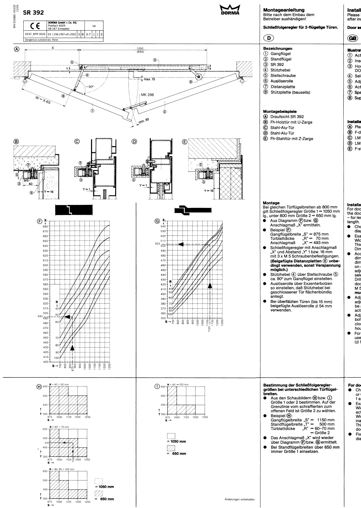
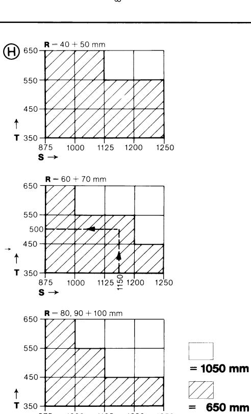
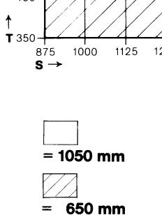

| tallation Guide ase hand over to the end-user r installation. r selector for double-leaf doors. 3) trations                                                                                                                                                                                                                                                                                                                                                                                                                                                                                                                                                                                                                                                                                                                                                                                                                                                                                                                                                                                            | Instructions de Montage (à remettre à l'utilisateur après l'installation) Régulateur de fermeture pour portes à 2 vantaux F Description:                                                                                                                                                                                                                                                                                                                                                                                                                                                                                                                                                                                                                                                                                                                                                                                                                         | Montagehandleiding S.v.p. na de inbouw aan de gebruiker overhandigen. Sluitvolgorde-regelaar voor dubbele aanslagdeuren (NL Omschrijving:                                                                                                                                                                                                                                                                                                                                                                                                                                                                                        | Monteringsvejledning Bedes udleveret til brugeren efter montering. Synkroniseringsbeslag til 2-fløjede døre. (DK) Benævnelser                                                                                                                                                                                                                                                                                                                                                                                                                                                                                                                                                                                                                                                                                                         |
|-----------------------------------------------------------------------------------------------------------------------------------------------------------------------------------------------------------------------------------------------------------------------------------------------------------------------------------------------------------------------------------------------------------------------------------------------------------------------------------------------------------------------------------------------------------------------------------------------------------------------------------------------------------------------------------------------------------------------------------------------------------------------------------------------------------------------------------------------------------------------------------------------------------------------------------------------------------------------------------------------------------------------------------------------------------------------------------------------------------------------|------------------------------------------------------------------------------------------------------------------------------------------------------------------------------------------------------------------------------------------------------------------------------------------------------------------------------------------------------------------------------------------------------------------------------------------------------------------------------------------------------------------------------------------------------------------------------------------------------------------------------------------------------------------------------------------------------------------------------------------------------------------------------------------------------------------------------------------------------------------------------------------------------------------------------------------------------------------------------------|----------------------------------------------------------------------------------------------------------------------------------------------------------------------------------------------------------------------------------------------------------------------------------------------------------------------------------------------------------------------------------------------------------------------------------------------------------------------------------------------------------------------------------------------------------------------------------------------------------------------------------------------------|------------------------------------------------------------------------------------------------------------------------------------------------------------------------------------------------------------------------------------------------------------------------------------------------------------------------------------------------------------------------------------------------------------------------------------------------------------------------------------------------------------------------------------------------------------------------------------------------------------------------------------------------------------------------------------------------------------------------------------------------------------------------------------------------------------------------------------------------------|
| Active door leaf (second closing) Inactive door leaf (first closing) Housing of door selector DORMA SR 392 Selector arm Adjustment screw Active roller Spacer plate Supporting plate (by others)                                                                                                                                                                                                                                                                                                                                                                                                                                                                                                                                                                                                                                                                                                                                                                                                                                                                                              | (1)  Vantail de service Vantail semi-fixe (2) (3) SR 392 (4) Bras de support (5) Vis de réglage (6) Rouleau de déclenchement (7) Plaque de distance Plaque de support (8)                                                                                                                                                                                                                                                                                                                                                                                                                                                                                                                                                                                                                                                                                                                                                                | (1) Loopdeur (2) Vaste deur (3) SR 392 Schokdemper (4) Stelschroef 5) Scharnierarm met rol (7) Uitvulplaatje (8) Beschermplaatje voor schokdemper (levering derden)                                                                                                                                                                                                                                                                                                                                                                                                                                         | Gående dørfløj (1) Stående dørfløj (2) (3) SR 392 Reguleringsarm (4) Justerskrue (5) Udløserulle (6) (7) Afstandsholder Anslagsplade (ikke medleveret)                                                                                                                                                                                                                                                                                                                                                                                                                                                                                                                                                                                                                                                     |
| allation examples Plan view of DORMA SR 392 F-door (timber door) with U-frame LM-door LM-door F-steel door with Z-frame                                                                                                                                                                                                                                                                                                                                                                                                                                                                                                                                                                                                                                                                                                                                                                                                                                                                                                                                                                                | Exemples de pose: (A)  Vue d'en haut - SR 392 Porte en bois avec huisserie en U (C) Porte en acier/alu (D)  Porte en acier/alu Porte en acier avec huisserie en Z Montage: Pour largeur égale des vantaux à partir de 800 mm - régulateur de fermeture taille 1                                                                                                                                                                                                                                                                                                                                                                                                                                                                                                                                                                                                                                                                                         | Montage-voorbeelden: Bovenaanzicht SR 392 (A) Houten deur met staalprofiel kozijn (B) Stalen alu-beklede deur (C) Stalen alu-beklede deur (D) Stalen deur met Z-profielkozijn Montage: Wanneer beide deuren even breed zijn en breder dan 800 mm, moet zwaarte 1 = 1050 mm worden genomen, minder dan 800 mm zwaarte 2 = 650 mm lengte. ● Met behulp van de diagrammen (F) of (G) moet de maat "X" worden vast- gesteld. Voorbeeld (met (F)): 0                                                                                                                                           | Monteringseksempler Plantegning SR 392 (A) Trædør (B) Stål-alu-dør (C) Stål-alu-dør (D) (E)  Ståldør                                                                                                                                                                                                                                                                                                                                                                                                                                                                                                                                                                                                                                                                                                                      |
| allation Guide door widths of 800 mm or more use door selector size 1 = 1050 mm length r less than 800 mm size 2 = 650 mm ath. Choose fixing dimension "X" from diagram (F) or G) Example (F): Width of active door leaf "S" = 875 mm "R" = 70 mm Thickness of door leaf "X" = 493 mm Dimension According to the chosen fixing dimension "X" and bearing in mind dimension "Y" (on flush doors = 1 mm, on over-rebated doors = 16 mm) adjust the housing of the door selector and mark the fixing holes. Drill the fixing holes M 5 and fix the door selector housing (3) with screws M 5 (attached spacer plates (8), must be used to avoid deformation). Adjust selector arm (4) with adjustment screw (5), so there will be an angle of approx. 90° between active door leaf and selector arm. Adjust active roller (6) with eccentric bolt so when inactive door leaf is closed, the selector arm (4) lies in the housing (3). For over-rebated doors (up to 15 mm) use the attached active roller (Ø. 54 mm). | = 1.050 mm de long; en dessous de 800 mm - taille 2 = 650 mm de long. Sur la base du diagramme (Fou G). déterminez la dimension "X". Exemple (F): Largeur du "S" = 875 mm vantail de service Epaisseur de la porte  "R" =   70 mm "X" = 493 mm Dimension Régulateur de fermeture avec dimen- 0 sion "X" et distance "Y", 1 ou 16 mm, avec des fixations de vis 3 x M 5. Dans tous les cas utilisez les plaques de distance (8) ci-jointes pour éviter le risque d'une déformation. Ajustez le bras de support (4) à 90º par rapport au vantail de service, utilisant la vis de réglage (5) Par le boulon excentrique, ajustez le ● rouleau de déclenchement de sorte que le bras de support soit en ligne avec la porte lorsque celle-ci est fermée. Lorsqu'il s'agit d'une porte à recou- O vrement (jusqu'à 15 mm), utilisez le rouleau de déclenchement ci-joint (diamètre 54 mm). | Loopdeurbreedte "S" = 875 mm "R" =   70 mm Deurdikte Maat "X" is dan 493 mm Sluitvolgorde-regelaar met maat "X" ● en afstand "Y" (1-16 mm voorsprong) met 3 metaalschroeven M 5 (hierbij de meegeleverde vulplaatjes gebrui- ken omdat anders vervorming kan ontstaan). De schokdemper (4) met de stel- ● schroef (5) haaks op de loopdeur instellen. De scharnierarm met rol via de 0 excentrische bout zo afstellen, dat de schokdemper bij gesloten stand van de deur vlak ligt. Bij opdekdeuren (tot 15 mm) moet de 0 meegeleverde geleiderol Ø 54 mm worden gebruikt. | Montering Ved ens dørfløjsbredder fra 800 mm anvendes synkroniseringsbeslag str. 1 = 1050 mm lgd. under 800 mm str. 2 = 650 mm Igd. · Fra diagram (F)eller G) findes monteringsmål "X". Eksempel (F): Gående dørfløj "S" = 875 mm Dørtykkelse "R" = 70 mm Monteringsmål "X" = 493 mm Ved montering af synkroniseringsbe- ● slag anvendes mål "X" og afstand "Y" 1 mm eller 16 mm samt 3 x M 5 skruer. For at forhindre klemning skal anven- des vedlagte afstandsplader (8). Reguleringsarm (4) stilles ved hjælp ● af justeringsskrue  (5) ca. 90° på gående dørfløj. Via excenterbolten indstilles udløse- ● rullen således at reguleringsarmen ligger glat med karm ved lukket dør. O Ved overfalsede døre (indtil 15 mm) anvendes vedlagte ø 54 udløserulle. |
| doors with unequal leaves (in width): Choose size 1 or 2 from diagrams (H) or (1); on the border line between size 1 and 2, use size 2. Example (H): Width of active door leaf    "S" =   1150 mm Width of inactive door leaf "T" = 500 mm Thickness of "R" = 60-70 mm door leaf Fixing dimension "X" = size 2 from diagram (F) or (G).                                                                                                                                                                                                                                                                                                                                                                                                                                                                                                                                                                                                                                                                                                                                        | Détermination des tailles du régulateur de fermeture lorsque les vantaux sont d'une largeur différente: ● Déterminez la taille 1 ou 2, en vous basant sur les dessins (H) ou (1). En cas limite, choississez la taille 2. · Exemple (H): Largeur du "S" = 1150 mm vantail de service Largeur de "T" = 500 mm vantail semi-fixe Epaisseur de la porte "R" = 60-70 mm = taille 2 ● Déterminez la dimension "X" sur la base du diagramme (F) ou (H).                                                                                                                                                                                                                                                                                                                                                                                                                                                                                  | Vaststellen van de juiste sluitvolgorde- regelaar bij twee ongelijke dubbele deuren. ● Met behulp van de afbeelding (H) of (1)de zwaarte 1 of 2 vaststellen, bij grensgevallen in het geärceerde gebied naar het vrije moet zwaarte 2 worden gekozen. ● Voorbeeld (H): Loopdeurbreedte   "S" =   1150 mm Breedte vaste deur "T" = 500 mm "R" = 60-70 mm Deurdikte = zwaarte 2 ● De maat "X" wordt weer uit het dia- gram (F) of (G) afgeleid.                                                                                                                                                         | Valg af synkroniseringsbeslag til uens dørfløjsbredder Ved hjælp af skema (H) eller (1)vælges str. 1 eller str. 2. På grænselinien mellem skraveret felt til lyst vælges str. 2. Eksempel (H): ● Gående fløj  "S" =   1150 mm Stående fløj "T" =      500 mm Dørtykkelse "R" = 60-70 mm Der vælges = str. 2 Monteringsmål "X" vælges ud fra dia- ● gram (F) eller (G).                                                                                                                                                                                                                                                                                                                                                                                                                                  |

- (4)

1)

0

ூ

(B)

(1)

680

670-

660

650-

640

630

620

610-

600-

590-

580-

570-

560-

૨૨૦-

540-

530-

520-

510-

500-

480-

470-

460-

450-440-430-420-410-

S->

493 490-

# Jätä tämä ohje

#### huoltomie helle. (Överlämnas till handhavaren efter montering) 2-lehtisten ovien tahdistin. Dörrkoordinator för 2-flygliga dörrar. (SF) (S Bete Kuvien selitykset 650 (1) Käyntiovi (1) A (2) Pariovi இர (3)-(3) SR 392 હી ર 4 Tukivarsi (4) ર (5) Säätöruuvi (5) S (6) Vapautinrulla கு ப -0-7 Distansplatta (7) Välilevy 8 Tukilevy (hankittava erikseen) (8) Stödplatta -MK 396 Asennusesimerkit Monteringsexempel A) Vaakaleikkaus SR 392 (A) Planvy SR 392 (B) Puupalo-ovi teräskarmilla B) Brandträdörr med U-karm © Teräsalumiiniovi © Stål-aluminiumdörr ① Teräsalumiiniovi ① Stål-aluminiumdörr (E) Teräspalo-ovi Z-teräsprofiililla E) Brandståldörr med Z-karm (D Asennus Montering Mikäli ovipuoliskot ovat yhtä leveät ja yli Vid lika dörrbladsbredder från 800 mm och uppåt väljs dörrkoordinator storlek 1 800 mm leveät, käytä tahdistinta koko 1 = pituus 1050 mm, alle 800 mm leveissä = 1050 mm lång, under 800 mm storlek 2 ovissa kokoa 2 = pituus 650 mm. (G) = 650 mm lång. ● Taulukko (Etai G) ● Anslagsmått "X" fastställes ur dia- Haetaan asennusmitta "X". gram (F) resp. (G) · Esimerkki (F): · Exempel (F): Käyntioven leveys "S" = 875 mm Aktiv dörrbredd "S" = 875 mm Ovilevyn paksuus "R"= 70 mm Dörrbladstjocklek "R" = 70 mm 203 Asennusmitta "X" = 493 mm Anslaasmått ..X" = 493 mm ● Asenna tahdistin mitoilla "X" välyksen Dörrkoordinator med anslagsmått "X" "Y" ollessa 1 – 16 mm käyttäen koloch avstånd "Y" 1 resp. 16 mm mea M 5 ruuvia. med 3 x M 5 skruv. (Käytä ehdottomasti mukana välile-460 vyjä (8), muutoin saattaa syntyä 450 nödvändiga.) jännitystä.) 440-Stödarm (4) justeras med ställskruv (5) ● ● Säädä tukivarsi (4) säätöruuvista (5) till ca. 90° mot aktiv dörr. 430 noin 90° kulmaan käyntioveen nähden, ● Säädä vapautuinrulla epäkeskoakseterbult så att stödarmen ligger tätt lista siten, että oven ollessa kiinni, mot stängd dörr. 400 tukivarsi on oven suuntainen. ● Vid överfalsade dörrar (till 15 mm) ● Huulletuissa ovissa on käytettävä används utlösningsrulle Ø 54 mm. (huullos aina 15 mm saakka) mukana olevaa 54 mm ø rullaa. Tahdistimen määrittely erilevyisiin oviin. Bestämning av koordinatorstorlek (1) 65 ● Kuvista (H)tai (1)määritellään koko 1 vid olika dörrbladsbredder tai 2. Rajatapauksissa 1 ja 2 välillä ● Välj ur diagrammen (H) resp. ① on valittava koko 2. storlek 1 eller 2. I gränsområdet ● Esimerkki (H): mellan vita och skuggade fält Käyntioven leveys "S" = 1150 mm väljs storlek 2. 个 Parioven leveys Exempel (H): Ovilehden paksuus "R" = 60-70 mm 875 1125 1200 1250 Aktiv dörrbredd "S" = 1150 mm = koko 2 Passiv dörrbredd "T" = 500 mm ● Asennusmitta "X" saadaan puoles-Dörtjocklek taan taulukosta (Etai G.

875 1000 1125 1200 1250

S ->

|  | Monteringsanvisning |  |
|--|---------------------|--|

| )               |  |
|-----------------|--|
| ckningar        |  |
| Aktiv dörr      |  |
| Passiv dörr     |  |
| SR 392          |  |
| Stödarm         |  |
| Ställskruv      |  |
| Jtlösningsrulle |  |
| :               |  |

- 
- 
- 
- 
- 
- 
- 
- 
- (Medlevererade distansplattor (8
- 
- Utlösningsrullen justeras över excen-
- 
- 

#### Monteringsanvisning

Vennligst sørg for at denne monteringsanvisning forblir tilgjengelig på bygget.

Dørkoordinator for 2-fløyete dører.

(N)

- Betegnelser: (1) Aktivt dørblad (2) Passivt dørblad 3 SR 392
- 4) Anslagsarm
- (5) Stillskrue 6 Utløserrulle
- 7 Distanseplate
- (8) Anslagsplate (ikke DORMA)

### Monteringseksempler:

- A) Horisontalsnitt SR 392 (B) Vertikalsnitt av tredør med stålkarm
- C Stål- alu dør
- (D) Stål- alu dør
- (E) Vertikalsnitt av ståldør med karm

## Montering

- Ved like dørbladbredder over 800 mm benyttes dørkoordinator
- str. 1 = 1050 mm, under 800 mm -
- str. 2 = = 650 mm. ● Finn monteringsmålet X i diagrammet
- (F) h.h.v. (G) ● Eksempel (F):
- Dørbladbredde aktivt "S" = 875 mm dørblad "R" = 70 mm Dørbladtykkelse "X" = 4935 mm Monteringsmal
- Monter dørkoordinatoren med vedlagte skruer etter monteringsmål "X" og "Y" (dører uten fals = 1 mm, dører med fals = 16 mm). Viktig: vedlagte distanseplate
- (8) må benyttes mellom koordinator og karm slik at koordinatoren ikke kommer i klem. Anslagsarmen (4) justeres med still-
- skruen slik at den får en 90° vinkel på det aktive dørbladet.
- Utløserrullen (6)justeres ved eksenterbolten, slik at anslagsarmen (4) ligger i flukt med karmen når passivt dørblad er lukket.
- Ved dører med overfals (inntil 15 mm) byttes den ferdig monterte utløserrullen (Ø 27 mm) ut med en utløserrulle (Ø 54 mm) som ligger løst ved.

- 
- "R" = 60-70 mm = storlek 2 ● Anslagsmåttet "X" fastställes
- åter över diagram (F)resp. G)
- relse ved dører med ulik dørbladbredde. ● Finn dørkoordinatorstørrelsen i skjema (1) h.h.v. (1). På grensen mellom skravert og åpent felt bør man velge str. 2. ● Eksempel (H): Bredde aktivt "S" = 1150 mm dørblad Bredde passivt "T" = dørblad

Skjema for valg av dørkoordinatorstør-

- "R" = 60-70 mm Dørbladtykkelse = str. 2 ● Monteringsmål "X" finner man i
- diagram (Fh.h.v. G).