# **Rostfritt.** Resten är  valfritt!

## **38-serien**  En flexibel  innovation

**dormakaba har utvecklat en serie av trycken och beslag med design och funktion i fokus. Montaget är enkelt, valmöjligheterna många och designspråket enhetligt.** 

Dörrtrycken i 38-serien finns i samma design både i ∅ 19 mm och ∅ 16 mm utförande och passar till samtliga skyltar i 38-serien. Lämpliga dörrmiljöer är kontorsdörrar, toaletter och tamburdörrar, i både privata och offentliga byggnader. Där kraven på funktion och design är stora är 38-serien ett givet val.

#### **Smart**

- Enkel montering direkt i skylten (bajonettinfästning)
- Många kombinationsmöjligheter för olika dörrlösningar
- Stilren design

#### **Snyggt**

- Stor valfrihet
- Trycken i ∅ 16 mm och ∅ 19 mm i samma design passar alla skyltar

#### **Tryggt**

- Certifierade enligt EN 1906
- 1,2 mm rörtrycke i rostfritt stål AISI 304
- Skyltar i 2 mm rostfritt stål AISI 304

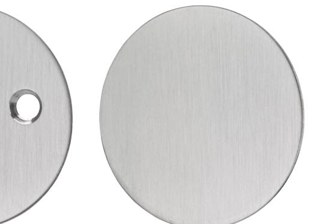

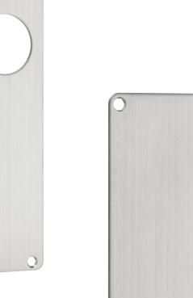

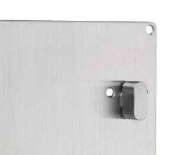

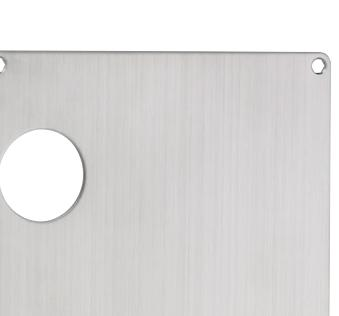

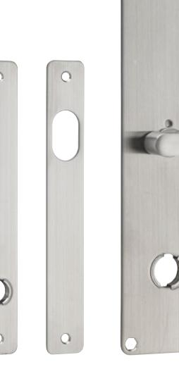

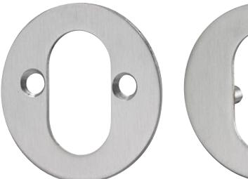

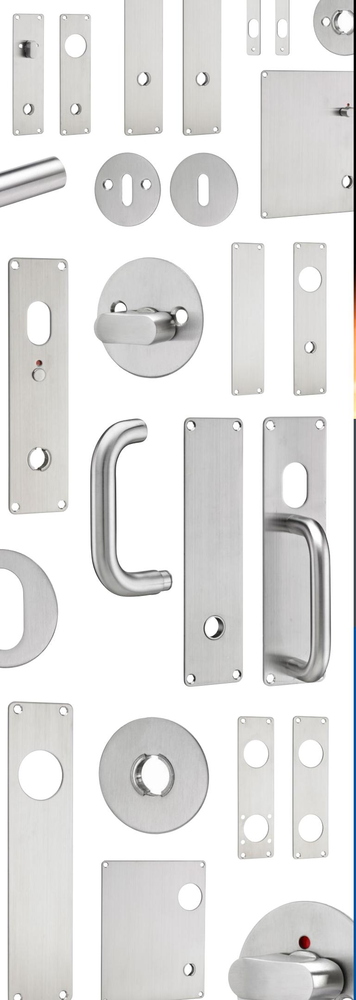

## **Dörrtrycket som pallar trycket**

**DH 823 är ett rejält trycke** i rostfritt stål framtaget för att klara de tuffa kraven på slitage i bland annat offentliga miljöer. Trycket finns i ytbehandlingarna krom och mattkrom, och den stilrena designen passar enkelt in i olika miljöer. Korrosionstestat enligt EN 1670 högsta grade, grade 5 (480 timmar). Certifierad enligt EN 1906, grade 4.

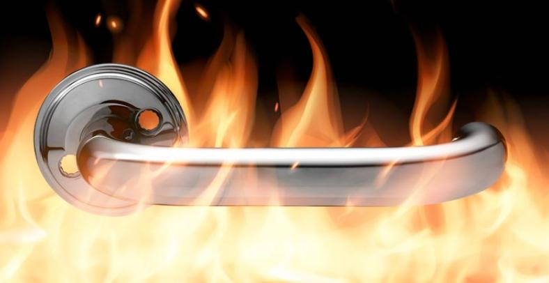

## **Nickeltestade produkter som standard**

Nickel är den vanligaste orsaken till kontaktallergi. dormakaba levererar nickeltestade produkter som standard. Våra trycken och beslag i krom och mattkrom klarar EU:s nickeldirektiv 94/27/EG.

Med ett av marknadens bredaste sortiment av kvalitetsbeslag är dormakaba ett tryggt val. **För alla dörrmiljöer.** 

**Vill du veta mer om våra olika koncept: Standard, Premium och Stainless steel?**

Beställ katalogen via QR-koden, kontakta din dormakaba-representant eller läs mer på **www. dormakaba.se**

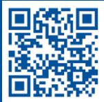

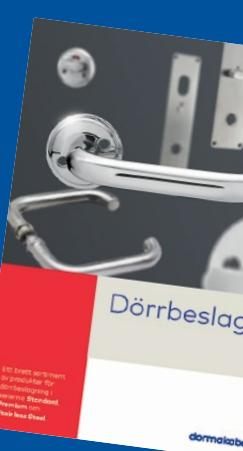

**Från bekväma barriärfria dörrlösningar till säkra utrymningsvägar, i enhetlig design. Vårt team av specialister kan allt om projektering av dörrmiljöer.**

Vi hjälper dig som arkitekt, byggkonsult, låssmed eller säkerhetskonsult att välja de bästa lås- och säkerhetsprodukterna för dina dörrar. Utifrån dina och dina kunders behov tar vi fram lösningar som ni behöver och som lever upp till de tillgänglighetsregler och säkerhetskrav som myndigheter och försäkringsbolag ställer.

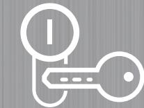

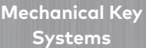

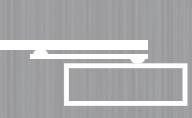

**Door Hardware**

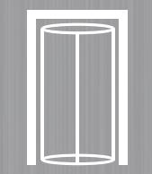

**Entrance Systems**

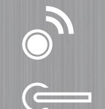

**Interior Glass Systems**

**Lodging Systems**

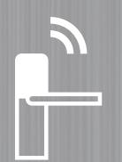

**Electronic Access & Data**

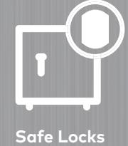

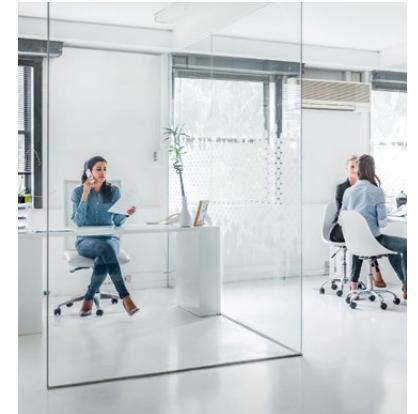

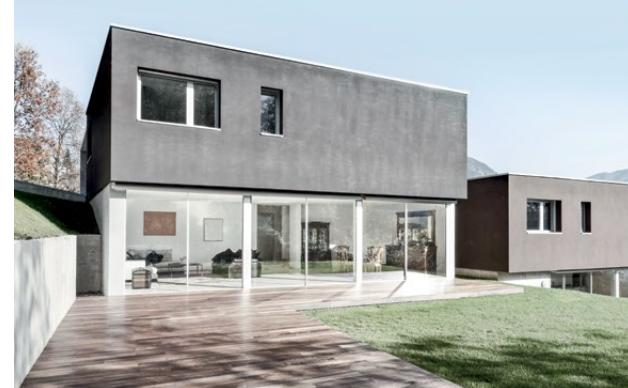

**dormakaba Sverige AB**  T: 031-355 20 00 info.se@dormakaba.com www.dormakaba.se

2020.09.14 sv Med förbehåll för eventuella fel och / eller ändringar