PRODUKTBLAD

**SV**

# **4SAFE**

Säkerhetssensor för svängdörrar och roterande dörrar

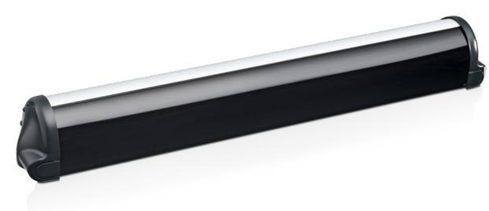

## **APPLIKATIONER TEKNIK NORM**

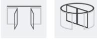

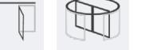

## **BESKRIVNING VIDEO**

https://bit.ly/3e6j2yO personer med funktionshinder. Du hittar vår produktvideo på vår You-Tube-kanal **BEA Sensors Europe**

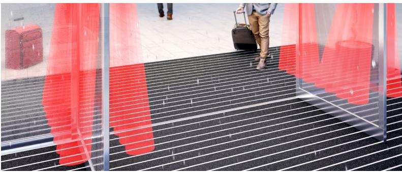

**4SAFE** är en aktiv infraröd sensor som fungerar genom avståndsmätning. Vid användning på dörrblad till svängdörrar och roterande dörrar ger den säkerhet för användare genom att undvika kontakt med dörrar i rörelse. Det tredimensionella området på 4SAFE gör det särskilt lämpligt för att skydda

## **Anpassning till alla golvtyper**

Anpassning till alla golvtyper, även de som avviker (rostfritt stål, galler, vattenpölar, snötäckt mark…).

## **Hög användarsäkerhet**

Hög användarsäkerhet tack vare ett detekteringsområde på 40 cm framför bladet på 2 m höjd med 4 grupper om 2 aktiva infraröda punkter.

## **Enkel installation**

Att trycka på knappen en gång är tillräckligt för att justera sensorn till vanlig installationshöjd. Finjustering är enkel via de fyra DIP-brytarna.

## **Enkel seriekopplingsmontering**

Enkel montering med seriekoppling med upp till 6 moduler, som täcker hela dörrens bredd.

## **APPLIKATIONER**

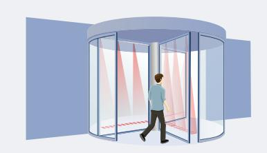

#### Roterande dörrar

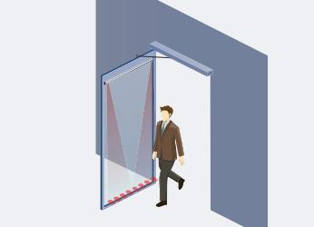

Svängdörrar

## **MONTERING VERSIONER**

- En nedtryckning av tryckknappen är tillräckligt för att justera sensorn för de vanliga installationshöjderna.
- Fininställning med 4 DIP-brytare.

## **TILLBEHÖR**

Verktyg för visualisering av den exakta positionen av infraröda ridåer.

SPOTFINDER

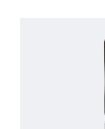

### BEA REMOTE CONTROL

Universal fjärrkon- troll för justeringar av våra sensorer.

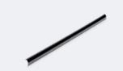

Imfri framsida för 4SAFE. 4SAFE FRONT FACE FOG-PROOF

övervakning.

extern övervakning.

## Gränssnitt för IXIO/ IXIO/VIO/4SAFE INTERFACE

VIO/4SAFE.

• 4SAFE ON SW : Svängdörrsensor med extern

• 4SAFE ON REV : Roterande dörrsensor med

4SAFE RA

Regntillbehör för 4SAFE.

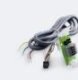

#### 4SAFE FDA

Branddörr adapter för 4SAFE.

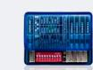

## MULTI-SENSOR HUB

Hubb för smart seriekoppling av 4SAFE och IXIO.

## **TUTORIAL**

https://bit.ly/2ZlNLob Du hittar vår produktvideo på vår You-Tube-kanal **BEA Sensors Europe**

## **TABELLE ÖVER SPECIFIKATIONER**

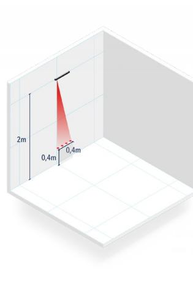

| Teknik                                                                 | Aktiv infraröd med bakgrundsdämpning                                                                                                                                                   |
|------------------------------------------------------------------------|----------------------------------------------------------------------------------------------------------------------------------------------------------------------------------------|
| Utsläppsfält                                                           | 400 mm (B) x 70 mm (D) (vid 2 m monteringshöjd; 4 aktiva punkter)                                                                                                                      |
| Monteringshöjd                                                         | 1,3 m till 3,5 m                                                                                                                                                                       |
| Reaktionstid                                                           | 64 ms (typ)                                                                                                                                                                            |
| Max. närvarotid                                                        | Oändlig                                                                                                                                                                                |
| Matningsspänning                                                       | 12 V – 24 V AC +/- 10 % ; 12 V – 30 V DC -5 %/+ 10 % (endast via SELV-kompatibla nätaggregat)                                                                                       |
| Max. strömförbrukning MASTER Andra moduler                       | 95 mA @ 24 V AC/ 70 mA @ 24 V DC; 170 mA @ 12 V AC/ 130 mA @ 12 V DC 85 mA @ 24 V AC/ 60 mA @ 24 V DC; 180 mA @ 12 V AC/ 113 mA @ 12 V DC                                           |
| Utgång Max. kontaktspänning Max. kontaktström Max. bryteffekt | 2 reläer (fri potentiell kontakt) 42 V AC/DC 1 A (resistiv) 30 W (DC) / 42 VA (AC)                                                                                            |
| Ingång Max. kontaktspänning Lägsta spänning                      | 1 optokopplare (fri från potentiell kontakt) 30 V Hög: >10 V DC; låg: <1 V DC                                                                                                    |
| Max. antal moduler                                                     | 4 (upp till 6 om 24 V DC)                                                                                                                                                              |
| Reflektivitet                                                          | Min. 5 % vid IR-våglängd på 850 nm                                                                                                                                                     |
| Nivå av skydd                                                          | IP54                                                                                                                                                                                   |
| Temperaturvariation                                                    | -25 °C till +55 °C; 0-95 % relativ luftfuktighet, inte kondenserande                                                                                                                   |
| Förväntad livslängd                                                    | 20 år                                                                                                                                                                                  |
| Norm conformity                                                        | EMC 2014/30/EU; MD 2006/42/EC; DIN 18650-1 ch. 5.7.4; BS 7036-2*; EN 16005 ch. 4.6.8; EN 12978 + A1; EN 61508; IEC 61496-2; BGR 232; EN ISO 13849-1 Performance Level «c» CAT. 2 |

**DISCLAIMER** Information is supplied upon the condition that the persons receiving it will make their own determination as to its suitability for their purposes prior to use. In no event will BEA be responsible for damages of any nature whatsoever resulting from the use of or reliance upon information from this document or the products to which the information refers. BEA has the right without liability to change descriptions and specifications at any time.

**WWW.BEASENSORS.COM**

