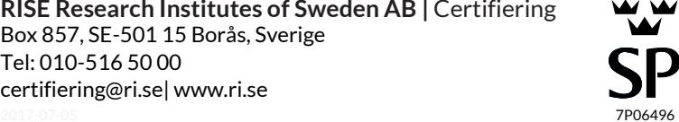
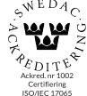

# Typgodkännande med beslut om tillverkningskontroll

0091/02

## Tätningströskel ASSA T 100

*Innehavare/Utfärdat för*

### ASSA AB

Box 371, 631 05 Eskilstuna Organisationsnummer: 556034-3161 Tel: 016-17 70 00, Fax: 016-17 73 72 E-post: helpdesk@assa.se , Hemsida: www.assa.se

### **Produktbeskrivning**

Tätningströskel ASSA T 100, mekanisk tätningströskel för slagdörrar.

#### **Avsedd användning**

Tätningströskel för tätning av 7-18 mm springa under innerdörrar av trä vilka är typgodkända i brandteknisk klass E 15, EI 15, E 30, EI 30 samt uppfyller kraven för ljudklass R'w 40dB som lägst.

### **Handelsnamn**

ASSA T 100

#### **Godkännande**

Produkten uppfyller kraven i 8 kap, 4 § 2 och 5 PBL i de avseenden och under de förutsättningar som anges i detta bevis och godkänns därför enligt bestämmelserna i följande avsnitt i Boverkets byggregler (BBR):

Brandteknisk klass EI 30 5:231 Luftljudsisolering R'w 35dB* (enligt SS 25267:2004) 7

* Luftljudsisolering enligt ovan gäller under förutsättning att tröskeln är monterad i dörr som uppfyller ljudklass R'w 40dB som lägst.

#### **Tillhörande handlingar**

Monteringsanvisning för tätningströskel ASSA T100, utgåva 3, daterad 2008-01-24 ASSA T100 Automatisk tätningströskel, ref.nr. M1186.0401

### **Kontroll**

Tillverkarens egenkontroll övervakas av ett oberoende kontrollorgan. Kontrollavtal: Ref nr. 210-00-0219, Kontrollorgan: RISE Research Institutes of Sweden.

Vid byggherrens kontroll på byggarbetsplatsen skall genom identifiering med hjälp av märkningen tillses att rätt produkter levererats och att de används enligt förutsättningarna givna i godkännande och tillhörande handlingar. Dessutom skall kontrolleras att produkten åtföljs av en tillverkarförsäkran som intygar att tillverkning skett i enlighet med de handlingar som legat till grund för detta godkännande.

#### **Tillverkningsställe**

Tillverkningskontrollen omfattar följande tillverkningsställe: ASSA AB, Eskilstuna

Typgodkännande 0091/02 | 2017-12-04

**RISE Research Institutes of Sweden AB |** Certifiering Box 857, SE-501 15 Borås, Sverige Tel: 010-516 50 00 [certifiering@ri.se|](mailto:certifiering@ri.se) www.ri.se

#### **Märkning**

Produkten skall vid fabrik förses med märkning. Märkningen utgörs av etikett på varje levererad tätningströskel och omfattar:

Innehavare/Distributör Tillverkningsställe/Fabriksbeteckning Boverkets inregistrerade varumärke Certifieringsorgan och ackrediteringsnummer Produktens typbeteckning Typgodkännandets nummer Egenskaper Löpande tillverkningsnummer/datum Kontrollorgan

ASSA AB Eskilstuna t RISE Certifiering 1002 ASSA T 100 0091/02 t. ex. EI 30*, R'w 35dB* nr/datum RISE

*Tätning av 7-18 mm springa mellan golv och slagdörr av trä, typgodkänd I klass E 15, EI 15, EI 30 och ljudklass R'w 40dB.

#### **Bedömningsunderlag**

Rapporter nr. 99R13249, 99F34351, P006269, P100888A och PX27750 från SP Sveriges Tekniska Forskningsinstitut.

#### **Kommentarer**

Dörrarna som tätningströskeln monteras tillsammans med förutsätts vara tillverkade i enlighet med respektive typgodkännandebevis.

Monteringsanvisning skall medfölja varje tätningströskel som levereras.

Detta godkännande ersätter tidigare godkännande med samma nummer daterat 2012-10-01.

#### **Giltighetstid**

Giltigt till och med 2022-12-03.

Detta typgodkännande upphör att gälla när egenskaper som ingår i detta bevis skall CE-märkas enligt Byggproduktförordningen CPR (EU) 305/2011.

Johan Åkesson Annika Hermodsson

Typgodkännande 0091/02 | 2017-12-04 **RISE Research Institutes of Sweden AB |** Certifiering