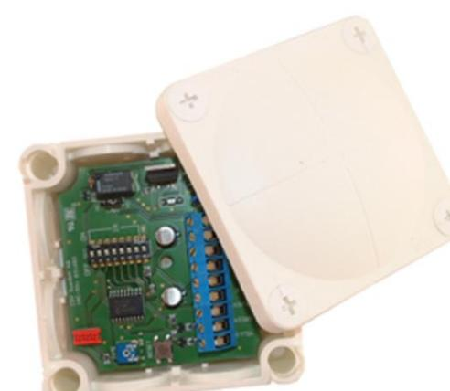
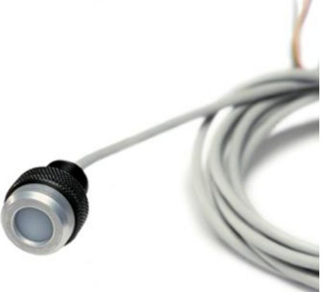
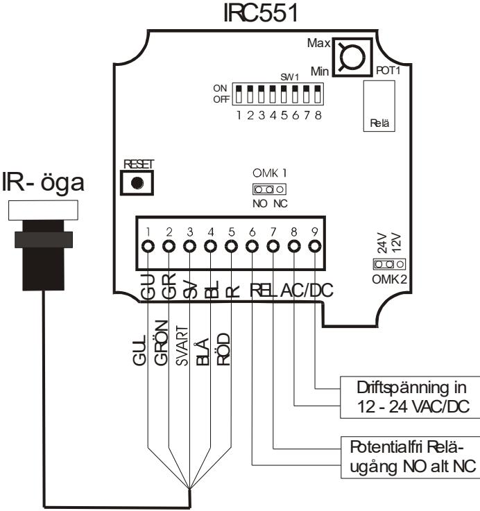
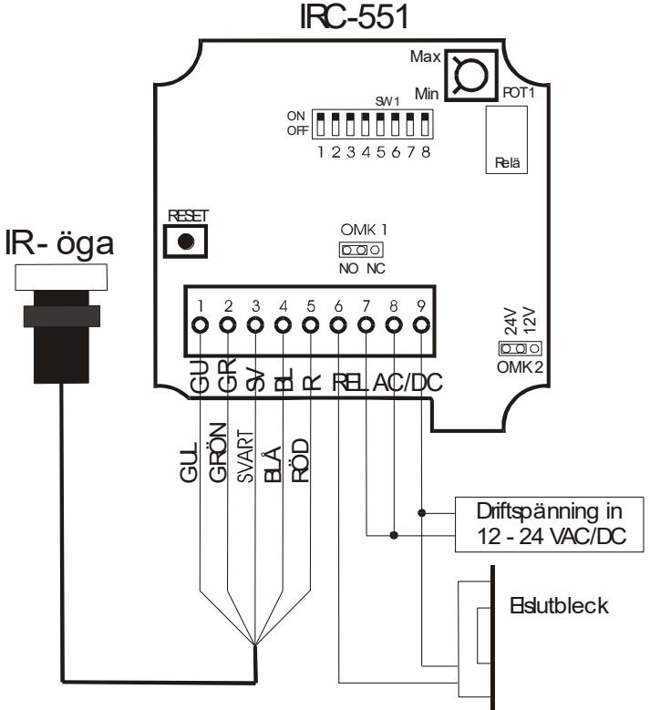

**Tel: +46 31 760 19 30 Fax: +46 31 748 09 30 Email: info@cdvi.se Web: www.cdvi.se**

# **IRC551**

*KOMPLETTERINGSMOTTAGARE TILL BEFINTLIGA KODLSÅ ELLER PORTTELEFONER*

I

Kontrollenhet IR-öga

Dimensioner kontrollenhet: 88 x 88 x 38 mm Dimensioner IR-öga: 25 x 35 x 30 mm

## INNEHÅLLSFÖRTECKNING

| I. PRODUKTINFORMATION2                                                                                        |  |
|---------------------------------------------------------------------------------------------------------------|--|
| A. ATT TÄNKA PÅ VID INSTALLATIONEN 2 B. ANVISNINGAR VID INSTALLATION OCH DRIFTSÄTTNING 2                   |  |
| C. DIP-SWITCHARNAS FUNKTION, SW1 3 D. INFORMATION FRÅN IR-ÖGATS LYSDIODER 3 E. TEKNISK SPECIFIKATION  3 |  |
| II. KOPPLINGSSCHEMA 4                                                                                         |  |
| A. INSTALLATION MOT BEFINTLIGT KODLÅS ELLER PORTTELEFON 4 B. INSTALLATION MOT ELSLUTBLECK4                 |  |

## I. PRODUKTINFORMATION

**IRC551** är en kompletteringsmottagare för installation mot befintlig dörröppnings- utrustning alternativt som stand alone enhet med bara ett lås, t ex elslutbleck, anslutet för öppning.

**IRC551** levereras med runt IR-öga (IRC671) ögat kan beställas separat. I IRC-satsen medföljer: IR-öga med kabel, styrelektronik med plastlåda, installationsanvisning, monteringsplatta, IRC dekaler, diod för elslutbleck samt ett svarskort till Pressens Morgontjänst (används endast i Stockholmsområdet).

För att enkelt kunna prova av systemet vid installation kan man beställa en testsändare, **IRC212**, om man är auktoriserad installatör.

#### *A. ATT TÄNKA PÅ VID INSTALLATIONEN*

För bästa resultat vid installation bör man tänka på följande saker.

- Placera IR-ögat så att det är väl synligt från den plats som öppning skall göras ifrån.
- Placera IR-ögat så att åverkan försvåras, t ex genom att sätt den innanför porten så att en

glasskiva skyddar men så den ändå är väl placerad för användaren, t ex Posten.

- Undvik att placera IR-ögat där solen kan se direkt in i den. Undvik också att placera den nära ljuskällor av typ lysrör eller lågenergilampor.
- Mottagarelektronikboxen bör sitta så att den i minsta mån påverkas av fukt mm. Man bör också tänka på att placera den så att åverkan försvåras.
- Placera en av dekalerna väl synlig på porten, helst en invändig placering, för att användaren ska se att IRC-systemet är installerat på porten.
- Tag kontakt med Posten och CityMail samt ev. övriga tidningsdistributörer för området och informera om att porten är försedd med IRC-systemet. I Stockholmsområdet går det också bra att fylla i bifogat svarskort och skicka in det till Pressens Morgontjänst.

#### *B. ANVISNINGAR VID INSTALLATION OCH DRIFTSÄTTNING*

Inkoppling av IRC551 kan göras enligt skisser på sidan 2 och 3. På sidan 4 finns information om indikeringar i IR-ögat vid uppstart, fel och användande.

- Ställ in önskat spänningsval, 12 alt 24 V på OMK 2.
- Ställ in önskad funktion för reläet, N/O alt N/C på OMK 1.
- Ställ alla dipswitchar i läge ON på SW1, dipswitcharnas funktion se sidan 4 i denna folder.
- Anslut spänningen, IRC-ögat blinkar rött två gånger.
- Tryck på resetknappen en gång. Kodminnet raderas och IRC-ögat blinkar två gånger.
- Ställ dipswitch 8 i läge OFF, om detta ej görs raderas minnet varje gång det blir spänningsbortfall eller när man trycker på resetknappen.
- Prova nu att sända en gång med en testsändare (IRC212). Grön diod ska då tändas i IRögat och reläet ska dra.
- Ställ in önskad öppentid för reläet på POT 1.
- Ställ dipswitcharna 1,2,3,4,5 och 7, för de kodkanaler som inte ska användas, i läge OFF.
- Efter installationen skall även testkanalen slås av genom att ställa dipswitch 6 i läge OFF.

IRC-mottagaren är nu klar för användning.

#### *C. DIP-SWITCHARNAS FUNKTION, SW1*

Dip-switch i läge ON = Aktiv. Dip-switch i läge OFF = Inaktiv / Avstängd

| Dip-switchar / IR-kodkanal | Användare / Funktion                             |
|-------------------------------|--------------------------------------------------|
| 1                             | Posten                                           |
| 2                             | Pressens Morgontjänst                            |
| 3                             | CityMail                                         |
| 4                             | Reklam, t ex SDR mfl                             |
| 5                             | Myndighet, Kommunal service                      |
| 6                             | Testsändare vid service och installation         |
| 7                             | Används ej                                       |
| 8                             | Används vid reset av koder, se text installation |

#### *D. INFORMATION FRÅN IR-ÖGATS LYSDIODER*

| Vid uppstart       | 1 röd blink  | Normal uppstart utan reset      |
|--------------------|--------------|---------------------------------|
| (spänningssättning | 2 rödablink  | Uppstart med dipswitch 8 i läge |
| eller reset)       |              | ON, alla koder raderas          |
| Vid användande     | Grönt        | Ok, öppning sker                |
|                    | 1 röd blink  | Fel kod                         |
|                    | 2 röda blink | För många tecken sända          |
|                    | 3 röda blink | Kodkanal avstängd               |
|                    |              | (eller sänt tecken för stort)   |
|                    | 4 röda blink | Fel kontrolltecken              |
|                    | 5 röda blink | Kanalnummer över 7 sänt         |

#### *E. TEKNISK SPECIFIKATION*

| Driftspänning: | 12 alt 24VAC/DC ställs med bygel, OMK 2    |
|----------------|--------------------------------------------|
|                | Vid leverans ställd för 24 Volt inspänning |

- Utgång: Potentialfri reläutgång, 1A@50VAC@24VDC@30W Ställbar funktion, NO alt NC, via bygel, OMK 1 Vid leverans ställd för NO-funktion.
- Öppettid: Justerbar på POT 1, från ca 1 sekund till ca 120 sekunder. Vid leverans inställd på ca 60 sekunders öppning.

### II. KOPPLINGSSCHEMA

#### *A. INSTALLATION MOT BEFINTLIGT KODLÅS ELLER PORTTELEFON*

#### *B. INSTALLATION MOT ELSLUTBLECK*

**OBS!** Vid installation mot elslutbleck ska diod monteras över elslutblecket om inte elslutblecket är utrustat med motsvarande skyddsutrustning t ex varistor. Detta för att skydda elektroniken mot transiens. Då elslutblecket är försett med varistor behövs ej dioden då varistorn ersätter denna.