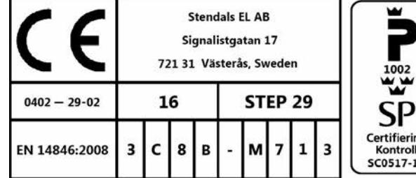
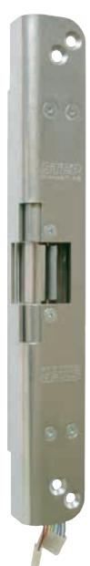
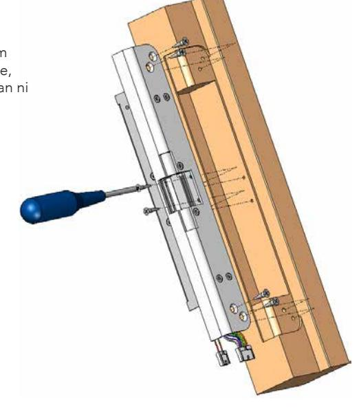
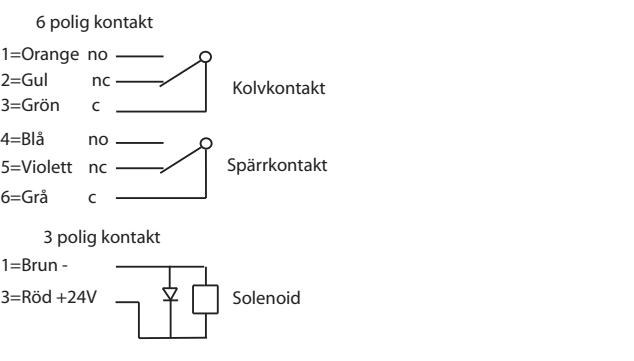
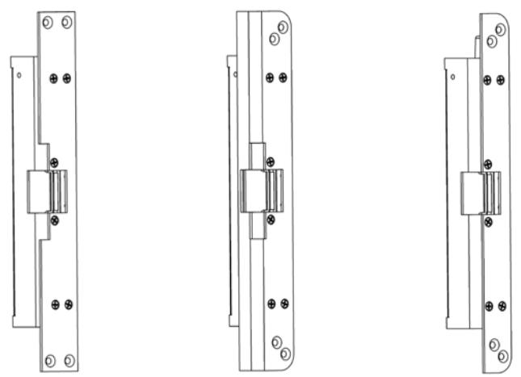

### Teknisk specifikation

- Låshus i rostfritt trumlat stål, vridfall i härdat stål.
- Inbyggd indikering för avkänning att dörren är stängd/öppen (kolv kontakt) och låst/olåst (spärrkontakt) för koppling till passersystem, larmanläggning etc.
- Brythållfasthet: > 12 KN.
- Garanterar öppning trots listtryck på 5kN (500Kg) i rättvänd funktion
- Knackskyddad
- Mikrobrytare enpoligt växlande Max. 30 VDC, 1 A
- Inbyggt transientskydd
- Testad av VTT och godkänd av Finska försäkringsbolagens centralförbund som klass 3 låsning i Finland.
- STEP 29 tillverkas i material med smältpunkt över 850 grader och i funktion låst utan spänning för att klara brandkrav.
- Spänning: 24 V DC + 15% / 10%, 7W 100% ED

### Artikelnummer

| ST2901    | Rättvänd funktion 24V Dc |
|-----------|--------------------------|
| ST2901-12 | Rättvänd funktion 12V Dc |

Läs bifogad installationsanvisning noggrant innan installation. Montagestolpens måttskiss är inkluderad i stolpens förpackning. Vid installation av produkten måste varningar och allmäna instruktioner följas. All bifogad dokumentation måste överlämnas av installatör till användare.

Före installation, säkerställ att dörr, karm är i gott skick och att rätt dörrhängning i kombination med beslag överensstämmer. Kontrollera certifikat innan installation i branddörr för att säkerställa att rätt kombination används. Kontrollera att dörrens konstruktion tillåter användning av elslutbleck. Kan användas i dubbel svängdörr om dörrens konstruktion tillåter elslutbleck. Beroende på dörrtyp (trä, stål eller aluminium) kan olika montage behövas (montagestolpe eller skruv). Vid installation i pardörr med dörrstängare, kontrollera om dörrkordinator krävs.

Under installation måste annan beslagning t.ex. tätningslister hanteras varsamt så att funktion på varken elslutbleck eller övrig beslagning påverkas. Var observant att urtag överensstämmer med montagestolpens måtskiss.

Efter installation, säkerställ att alla skruvar är åtdragna, skruvhuvuden inte sticker upp och att dörrbladet löper fritt.

För användning tillsammans med typgodkända dörrar i högst brandteknisk klass E60/A60/EI60. Kontrollera att dörrens godkännande tillåter användning av elslutbleck enligt denna installationsanvisning.

Elslutbleck med ett vridfall för enkelfallås. Vridfall skall utföras med rättvänd funktion.

P800158B, Step 28E, i isolerad enkeldörr av stål.

P800158D, Step 28E, i isolerad enkeldörr av stål

Säkerhetsegenskaperna på denna produkt är avgörande för dess överensstämmelse med EN 14846. Inga ändringar av något slag, andra är de som beskrivs i dessa anvisningar är tillåtna.

Stendals El AB Signalistgatan 17 SE-721 31 Västerås, Sweden Telephone: +46 21-18 97 50 Telefax: +46 21-13 01 69 E-mail: info@steplock.se Internet: www.steplock.se

# Installationsanvisning STEP 29

Artikelnr. ST2901, ST2901-12

STEP 29 är utvecklad för att erhålla en låsning med hög säkerhet där möjlighet finns att öppna och låsa dörren som man själv vill. Elektriskt, manuellt eller med dörrautomatik. Godkänd av Finska försäkringsförbundet som klass 3 låsning.

STEP 29 passar med sin kraftiga konstruktion in i skalskydd och innerdörrar med liten som stor frekvens.

STEP 29 låser och låser upp dörren med distinkt snabbhet via ett kodlås eller trycknapp. STEP 29 har en patenterad konstruktion som innebär att dörren blir upplåst även om kraftiga dörrlister gör så att dörren ligger med tryck mot STEP 29.

Anpassade låshus

Regellås typ Abloy 4180 eller liknande

- Montera montagestolpen med 6st skruvar M4X8 TUFLOK (bifogas i stolpförpackning).
- Orginalstolpe måste användas, se respektive montageritning för att få rätt placering mot låshus.
- För att erhålla en god funktion skall dörrspringan mellan låshusets stolpe och elslutbleckets monteringsstolpe skall vara 3mm ± 1mm.
- Det skall finnas ett glapp mellan låsets fallkolv och elslutbleckets vridfall som skall vara 1mm ± 0,5mm.
- Undvik fil- och smärgelspån, då detta stör elslutbleckets funktion. Efter att urtag för slutblecket gjorts i karmen, skall urtaget rengöras så att inga flisor finns kvar.
- Vid fastsättning av baksäkringsskruvar får borrning inte ske igenom hålen i elslutblecket.
- Var noga med att kabeln inte kläms när slutblecket trycks in i karmen.
- Elslutbleck eller montagestolpe får ej övermålas.

### Montering av baksäkringsskruvar

När stolpskruvarna är på plats skall ström tillföras och vridfallet fällas till öppet läge, tryck därefter ner kolvindikeringen medan ni skruvar i baksäkringsskruvarna.

### Montage Kopplingsschema STEP 29

Stolpe ST2917 Stolpe ST2916 Stolpe ST2922

## Underhållsanvisning

- Elslutbleckets funktion skall kontrolleras med jämna mellanrum i samband med provning av brandcellsgränser och utrymningsvägar eller liknande.
- Elslutbleckets fastsättning i karm bör kontrolleras 2 ggr/år.
- Smörjning av vridfallet skall ske med ett tunt skikt låsfett (DIN 51502) 2ggr/år. Olja får aldrig användas.