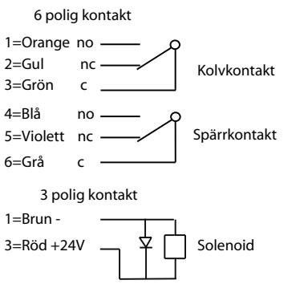
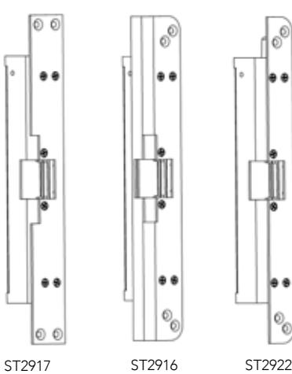
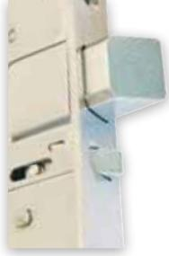

| 29 |  |
|----|--|
|    |  |

# Kraftigt elslutbleck för utskjutande fallkolvar

STEP 29 SilentTM är ett kraftigt elslutbleck som kan ta utskjutande fallkolvar upp till hela 20mm. Godkänd av finska försäkringsförbundet som klass 3 låsning. Patenterad STEP-teknik ger dörren en mjuk gång och en nästintill ljudlös öppning och stängning. Brandklass upp till E/EI 60.

### Minskat buller ger brett användningsområde

Step 29 SilentTM har unika öppnings- och stängningsegenskaper som ger ett brett användningsområde. En mjuk och tyst gång tillsammans med en kraftig konstruktion gör att STEP 29 SilentTM passar utmärkt i dörrar som används högfrekvent eller där minskat buller är önskvärt, som exempelvis i flerbostadshus, kontor, skolor och sjukhus.

### Hög säkerhet

Med STEP 29 SilentTM får du en hög intrångssäkerhet genom en hög brytstyrka och ett elektriskt manövrerat knackskydd som gör det omöjligt att manipulera låsfunktionen.

Kopplingsschema för STEP 29 SilentTM

STEP 29 SilentTM kan ta utskjutande fallkolvar på upp till 20 mm.

## Unik listtrycksteknik

STEP 29 SilentTM är utrustad med STEP-patenterad listtrycksteknik som har följande fördelar:

- Tätningslister och tryckskillnader listtrycksfunktionen gör att dörren alltid kan låsas upp, trots att dörrlåset spänner mot elslutblecket.
- Dörrautomatik listtrycksfunktionen i kombination med den snabba upplåsningen gör att dörren öppnas snabbt och utan risk för att fastna.
- Utrymningsdörr listtrycksfunktionen säkerställer att brandlarmet kan frilägga låsningen, trots tryck mot dörren av folkmassa, tätningslister, tryckskillnader eller sneda dörrar.

### Tekniska data

Brandgodkänd i brandteknisk klass upp till E/EI 60

### Strömförbrukning*

|                                                             | Rättvänd funktion |  |
|-------------------------------------------------------------|-------------------|--|
| 24 VDC +15% -10%                                            | 12 VDC +15% -10%  |  |
| 313mA olåst                                                 | 639mA olåst       |  |
| *Strömförbrukning 0mA för vridfall i vila (rättvänd = låst) |                   |  |

### Artikelnummer

| ST2901    | Rättvänd funktion 24V Dc inkl. kolvkontakt |
|-----------|--------------------------------------------|
| ST2901-12 | Rättvänd funktion 12V Dc inkl. kolvkontakt |

- Corrosion: Grade M enligt SS-EN 14846
- Security: Grade 7 enligt SS-EN 14846
- Security electrical manipulation: Grade 3 (rättvänd) enligt SS-EN 14846
- Mikrobrytare enpoligt växlande max. 30V Dc, 1 A
- Inbyggd indikering för avkänning att dörren är stängd/öppen (kolvkontakt) och låst/olåst (spärrkontakt) för koppling till passersystem, larmanläggning etc.
- Brythållfasthet 12 kN (1200 kg)
- Garanterar öppning trots listtryck på 5kN (≈500Kg)
- Knacksäkrad
- Inbyggt transientskydd
- Vridfall i härdat stål, låshus och montagestolpe i rostfritt stål

### Passande låshus

Fallås typ Abloy 4180

