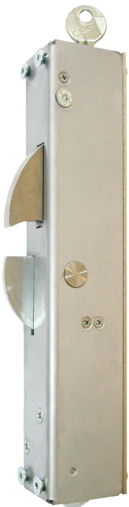
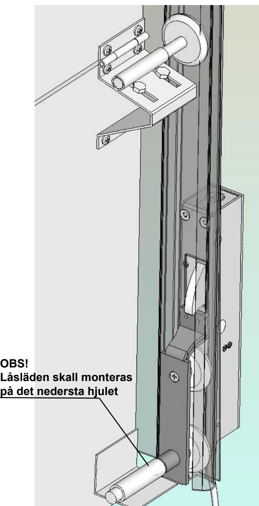
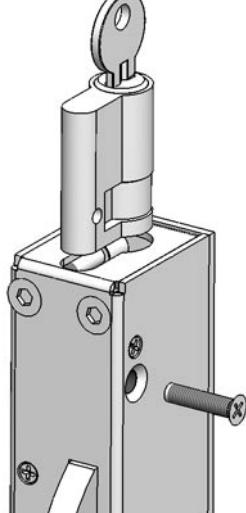
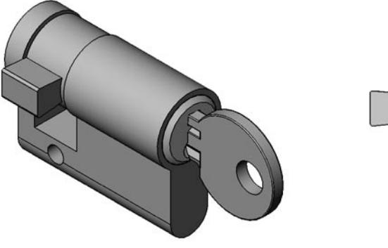
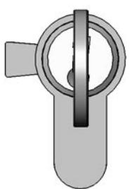
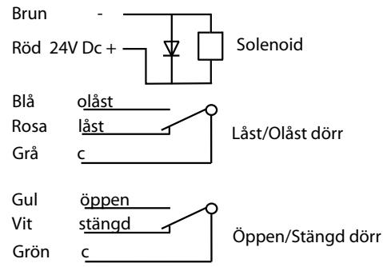
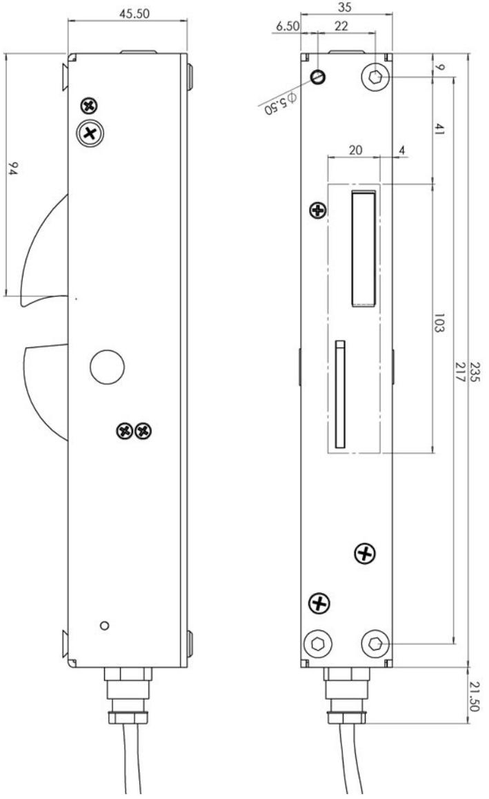

# Montageinstruktion STEP 50 med låssläde ST527-7 för industriport

### **Montageinstruktion Portlås typ STEP 50**

- 1. Montera bort det **nedersta hjulet** på den sida som är bäst lämpad för montering av ellåset. För in hjul axeln in i släden, röret för hjulaxeln kan behövas att kortas av för att hjulet skall passa in mellan plåtarna. Skruva tillbaka plåten på släden använd alltid **loctite** till skruvarna så att de inte lossnar under drift. Skjut in låssläden i C skenan, montera tillbaka hjul axeln i ursprungliga fästet på porten. Prova nu att skjuta upp porten för att se att låssläden löper fritt hela vägen upp till översta läget. Röret på låssläden kan i vissa fall behöva svetsas fast för att minska röligheten på låssläden på vissa porttyper.
- 2 Bestäm och märk ut ungefärligt läge för placeringen av ellåset genom att skjuta ner porten med låssläden till sitt nedersta läge. Markera på Cskenan där dit den översta delen på låssläden når och. Gör ett fyrkantigt urtag enligt måttskiss för både låshaken och indikeringsskivan så att låshakens underdel kommer på samma höjd som märket. Märk ut och borra hål för fastsättningsskruvarna igenom C-skenan så att ellåsets låshake ligger emot låssläden med ett spel på max 5mm, detta för att inte låsglappet skall bli för stort. Försänk och sätt fast ellåset med de fyra bifogade M5 skruvarna med **loctite**.
- 3 Koppla in ellåset enligt kopplingsschemat.

#### **Montering av cylinder**

Euro cylindern går att få i befintligt Assa Twin system.

För in euro cylindern i STEP 50 med nyckeln i cylindern. Skruva fast cylindern med M5 skruven som ingår. Tappen skall peka åt vänster enligt bild när nyckeln är urtagen.

### Måttskiss STEP 50

### Elschema STEP 50

#### Tekniska specifikationer

Brythållfasthet: 10 kN Material: Låshus i rostfritt stål, Låshake i härdat stål. Spänning: 24 V DC +/-10%, 100% ED 6,5W

#### l förpackning

STEP 50 inkl. fästskruvar låsvinkel och 5m kabel (Bultar för fastsättning av låsvinkel i porten medföljer ej).

## Stendal El AB

Stendal El. AB • Signalistgatan 17 • 721 31 Västerås Tel. 021-189750 • Fax 021-130169 • www.steab.se • postmaster@steab.se